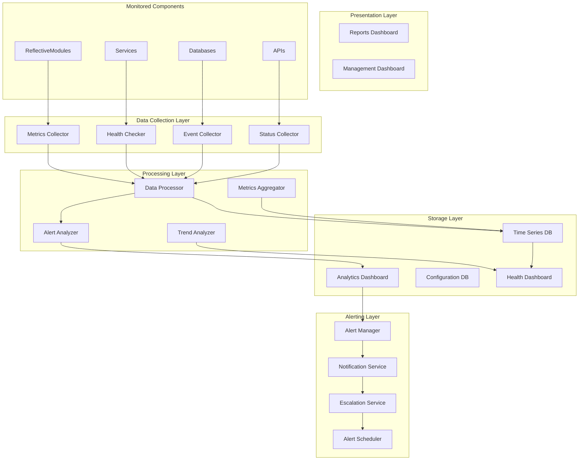
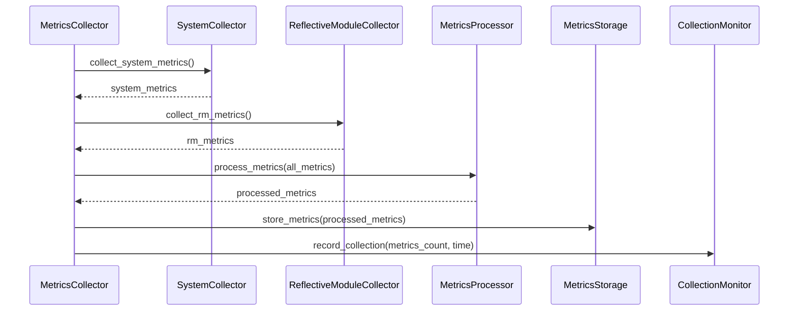
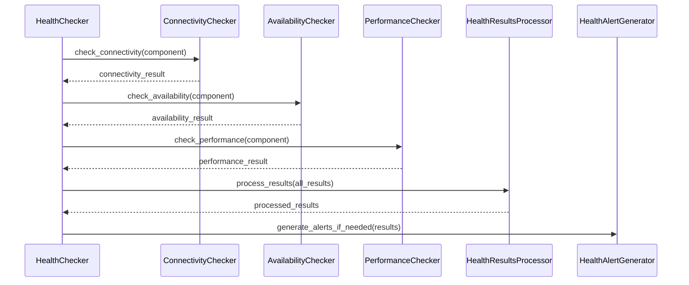
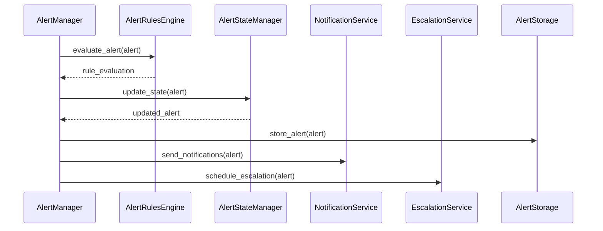

# Health Monitoring Design Specification

## Document Information
- **Version**: 1.0.0
- **Last Updated**: 2024-01-15
- **Status**: Active
- **RDI Compliance**: Requirements-Driven Implementation
- **Domain**: Domain Index System
- **Module**: Health Monitoring

## 1. Introduction

This document provides the detailed design specification for the Health Monitoring component of the Domain Index System. The Health Monitoring system is responsible for continuously monitoring the health, performance, and operational status of all system components while providing real-time visibility, proactive alerting, and comprehensive analytics.

### 1.1 Design Objectives
- **Comprehensive Monitoring**: Monitor all system components and services
- **Real-time Visibility**: Provide real-time health status and performance metrics
- **Proactive Alerting**: Detect issues before they impact system performance
- **Scalable Architecture**: Support monitoring of large-scale distributed systems
- **Intuitive Interface**: Provide user-friendly dashboards and reporting

### 1.2 Architecture Overview
The Health Monitoring system follows a distributed architecture with clear separation of concerns:
- **Data Collection Layer**: Collects metrics and health data from all components
- **Processing Layer**: Processes, aggregates, and analyzes monitoring data
- **Storage Layer**: Stores metrics, alerts, and historical data
- **Presentation Layer**: Provides dashboards, reports, and user interfaces
- **Alerting Layer**: Manages alerts, notifications, and escalation

## 2. System Architecture

### 2.1 High-Level Architecture



### 2.2 Component Architecture

#### 2.2.1 Data Collection Layer Components

**MetricsCollector**
- **Purpose**: Collect performance metrics from all system components
- **Responsibilities**: 
  - Collect CPU, memory, disk, and network metrics
  - Gather application-specific metrics
  - Collect custom metrics from ReflectiveModules
  - Normalize and standardize metric data

**HealthChecker**
- **Purpose**: Execute health checks on all system components
- **Responsibilities**:
  - Execute predefined health check procedures
  - Perform connectivity and availability tests
  - Validate component functionality
  - Execute custom health check scripts

**EventCollector**
- **Purpose**: Collect events and logs from system components
- **Responsibilities**:
  - Collect application events and logs
  - Parse and structure event data
  - Filter and categorize events
  - Forward events to processing layer

**StatusCollector**
- **Purpose**: Collect component status and availability information
- **Responsibilities**:
  - Monitor component availability
  - Track component state changes
  - Collect component configuration status
  - Monitor component dependencies

#### 2.2.2 Processing Layer Components

**DataProcessor**
- **Purpose**: Process and normalize collected monitoring data
- **Responsibilities**:
  - Normalize data from different sources
  - Validate data quality and completeness
  - Apply data transformations
  - Route data to appropriate storage

**AlertAnalyzer**
- **Purpose**: Analyze data and generate alerts
- **Responsibilities**:
  - Evaluate alert conditions and thresholds
  - Generate alerts for violations
  - Correlate related alerts
  - Manage alert lifecycle

**MetricsAggregator**
- **Purpose**: Aggregate and summarize metrics data
- **Responsibilities**:
  - Aggregate metrics by time periods
  - Calculate statistical summaries
  - Generate trend analysis
  - Create performance baselines

**TrendAnalyzer**
- **Purpose**: Analyze trends and patterns in monitoring data
- **Responsibilities**:
  - Identify performance trends
  - Detect anomalies and outliers
  - Predict capacity requirements
  - Generate insights and recommendations

#### 2.2.3 Storage Layer Components

**TimeSeriesDatabase**
- **Purpose**: Store time-series metrics data
- **Responsibilities**:
  - Store metrics with timestamps
  - Support efficient time-range queries
  - Implement data retention policies
  - Provide data compression

**AlertDatabase**
- **Purpose**: Store alert and notification data
- **Responsibilities**:
  - Store alert definitions and rules
  - Track alert history and status
  - Store notification preferences
  - Maintain alert correlation data

**ConfigurationDatabase**
- **Purpose**: Store monitoring configuration
- **Responsibilities**:
  - Store component monitoring configurations
  - Manage alert rules and thresholds
  - Store notification preferences
  - Maintain user access controls

**HistoricalDataStore**
- **Purpose**: Store historical monitoring data
- **Responsibilities**:
  - Archive historical metrics
  - Store long-term trend data
  - Maintain data retention policies
  - Support data export and backup

#### 2.2.4 Presentation Layer Components

**HealthDashboard**
- **Purpose**: Display real-time health status
- **Responsibilities**:
  - Show component health status
  - Display performance metrics
  - Provide alert status overview
  - Support dashboard customization

**ReportsDashboard**
- **Purpose**: Generate and display monitoring reports
- **Responsibilities**:
  - Generate automated reports
  - Display historical trends
  - Provide capacity planning data
  - Support custom report creation

**AnalyticsDashboard**
- **Purpose**: Provide analytics and insights
- **Responsibilities**:
  - Display performance analytics
  - Show trend analysis
  - Provide predictive insights
  - Support data exploration

**ManagementDashboard**
- **Purpose**: Manage monitoring configuration
- **Responsibilities**:
  - Configure monitoring parameters
  - Manage alert rules
  - Set notification preferences
  - Monitor system health

#### 2.2.5 Alerting Layer Components

**AlertManager**
- **Purpose**: Manage alert lifecycle and processing
- **Responsibilities**:
  - Process incoming alerts
  - Apply alert rules and filters
  - Manage alert state transitions
  - Coordinate alert notifications

**NotificationService**
- **Purpose**: Send notifications for alerts
- **Responsibilities**:
  - Send email notifications
  - Send SMS notifications
  - Send webhook notifications
  - Manage notification delivery

**EscalationService**
- **Purpose**: Handle alert escalation
- **Responsibilities**:
  - Escalate unresolved alerts
  - Apply escalation rules
  - Manage escalation timeouts
  - Track escalation history

**AlertScheduler**
- **Purpose**: Schedule and manage alert processing
- **Responsibilities**:
  - Schedule alert evaluations
  - Manage alert processing queues
  - Handle alert batching
  - Optimize alert processing

## 3. Detailed Component Design

### 3.1 MetricsCollector Component

```python
class MetricsCollector(ReflectiveModule):
    """Metrics collection component."""
    
    def __init__(self, config: MonitoringConfig):
        self.config = config
        self.collectors = self._initialize_collectors()
        self.processor = MetricsProcessor(config)
        self.storage = MetricsStorage(config)
        self.monitor = CollectionMonitor(config)
    
    async def collect_metrics(self) -> CollectionResult:
        """Collect metrics from all monitored components."""
        try:
            collection_start = time.time()
            collected_metrics = []
            
            # Collect from all registered collectors
            for collector in self.collectors:
                try:
                    metrics = await collector.collect()
                    collected_metrics.extend(metrics)
                except Exception as e:
                    logger.error(f"Collection failed for {collector.name}: {e}")
                    await self.monitor.record_collection_error(collector.name, e)
            
            # Process collected metrics
            processed_metrics = await self.processor.process(collected_metrics)
            
            # Store processed metrics
            await self.storage.store(processed_metrics)
            
            # Record collection metrics
            collection_time = time.time() - collection_start
            await self.monitor.record_collection(collection_time, len(processed_metrics))
            
            return CollectionResult(
                success=True,
                metrics_count=len(processed_metrics),
                collection_time=collection_time
            )
            
        except Exception as e:
            logger.error(f"Metrics collection failed: {e}")
            await self.monitor.record_collection_error("system", e)
            return CollectionResult(success=False, error=str(e))
    
    def _initialize_collectors(self) -> List[MetricsCollector]:
        """Initialize metric collectors for different component types."""
        collectors = []
        
        # System metrics collector
        collectors.append(SystemMetricsCollector(self.config.system))
        
        # ReflectiveModule metrics collector
        collectors.append(ReflectiveModuleMetricsCollector(self.config.reflective_modules))
        
        # Database metrics collector
        collectors.append(DatabaseMetricsCollector(self.config.databases))
        
        # API metrics collector
        collectors.append(APIMetricsCollector(self.config.apis))
        
        return collectors
    
    def get_module_info(self) -> ModuleInfo:
        """Get module information for ReflectiveModule interface."""
        return ModuleInfo(
            name="MetricsCollector",
            version="1.0.0",
            description="Metrics collection component for health monitoring",
            capabilities=["metrics_collection", "data_processing", "storage_management"],
            dependencies=["MetricsProcessor", "MetricsStorage", "CollectionMonitor"]
        )
    
    def get_health_status(self) -> HealthStatus:
        """Get health status for ReflectiveModule interface."""
        return HealthStatus(
            status="healthy",
            metrics={
                "collections_performed": self.monitor.get_collection_count(),
                "average_collection_time": self.monitor.get_average_collection_time(),
                "collection_success_rate": self.monitor.get_success_rate()
            }
        )
```

### 3.2 HealthChecker Component

```python
class HealthChecker(ReflectiveModule):
    """Health check execution component."""
    
    def __init__(self, config: HealthConfig):
        self.config = config
        self.checkers = self._initialize_checkers()
        self.scheduler = HealthCheckScheduler(config)
        self.results_processor = HealthResultsProcessor(config)
        self.alert_generator = HealthAlertGenerator(config)
    
    async def execute_health_checks(self) -> HealthCheckResult:
        """Execute health checks on all monitored components."""
        try:
            check_results = []
            
            # Execute health checks for all components
            for component in self.config.monitored_components:
                for checker in self.checkers:
                    if checker.supports_component(component):
                        try:
                            result = await checker.check(component)
                            check_results.append(result)
                            
                            # Process result
                            await self.results_processor.process(result)
                            
                            # Generate alerts if needed
                            if result.status != HealthStatus.HEALTHY:
                                await self.alert_generator.generate_alert(result)
                                
                        except Exception as e:
                            logger.error(f"Health check failed for {component}: {e}")
                            error_result = HealthCheckResult(
                                component=component,
                                status=HealthStatus.ERROR,
                                error=str(e)
                            )
                            check_results.append(error_result)
            
            return HealthCheckResult(
                success=True,
                checks_performed=len(check_results),
                results=check_results
            )
            
        except Exception as e:
            logger.error(f"Health check execution failed: {e}")
            return HealthCheckResult(success=False, error=str(e))
    
    def _initialize_checkers(self) -> List[HealthChecker]:
        """Initialize health checkers for different check types."""
        checkers = []
        
        # Connectivity checker
        checkers.append(ConnectivityChecker(self.config.connectivity))
        
        # Availability checker
        checkers.append(AvailabilityChecker(self.config.availability))
        
        # Performance checker
        checkers.append(PerformanceChecker(self.config.performance))
        
        # Custom checker
        checkers.append(CustomHealthChecker(self.config.custom))
        
        return checkers
    
    def get_capabilities(self) -> List[str]:
        """Get health checking capabilities."""
        return [
            "connectivity_checking",
            "availability_checking",
            "performance_checking",
            "custom_health_checks",
            "alert_generation"
        ]
```

### 3.3 AlertManager Component

```python
class AlertManager(ReflectiveModule):
    """Alert management component."""
    
    def __init__(self, config: AlertConfig):
        self.config = config
        self.rules_engine = AlertRulesEngine(config)
        self.state_manager = AlertStateManager(config)
        self.notification_service = NotificationService(config)
        self.escalation_service = EscalationService(config)
        self.alert_storage = AlertStorage(config)
    
    async def process_alert(self, alert: Alert) -> AlertProcessingResult:
        """Process an incoming alert."""
        try:
            # Evaluate alert against rules
            rule_evaluation = await self.rules_engine.evaluate(alert)
            
            if not rule_evaluation.should_alert:
                return AlertProcessingResult(
                    processed=False,
                    reason="Alert filtered by rules"
                )
            
            # Update alert state
            alert.state = await self.state_manager.update_state(alert)
            
            # Store alert
            await self.alert_storage.store(alert)
            
            # Send notifications
            notification_result = await self.notification_service.send_notifications(alert)
            
            # Schedule escalation if needed
            if alert.requires_escalation:
                await self.escalation_service.schedule_escalation(alert)
            
            return AlertProcessingResult(
                processed=True,
                notifications_sent=notification_result.notifications_sent,
                escalation_scheduled=alert.requires_escalation
            )
            
        except Exception as e:
            logger.error(f"Alert processing failed: {e}")
            return AlertProcessingResult(processed=False, error=str(e))
    
    async def get_active_alerts(self) -> List[Alert]:
        """Get all currently active alerts."""
        try:
            return await self.alert_storage.get_active_alerts()
        except Exception as e:
            logger.error(f"Failed to get active alerts: {e}")
            return []
    
    def get_dependencies(self) -> List[str]:
        """Get component dependencies."""
        return [
            "AlertRulesEngine",
            "AlertStateManager",
            "NotificationService",
            "EscalationService",
            "AlertStorage"
        ]
```

### 3.4 HealthDashboard Component

```python
class HealthDashboard(ReflectiveModule):
    """Health dashboard component."""
    
    def __init__(self, config: DashboardConfig):
        self.config = config
        self.data_service = DashboardDataService(config)
        self.view_generator = ViewGenerator(config)
        self.websocket_manager = WebSocketManager(config)
        self.cache_manager = DashboardCacheManager(config)
    
    async def get_dashboard_data(self, dashboard_type: str) -> DashboardData:
        """Get data for a specific dashboard type."""
        try:
            # Check cache first
            cached_data = await self.cache_manager.get(dashboard_type)
            if cached_data and not self._is_cache_expired(cached_data):
                return cached_data.data
            
            # Generate fresh data
            data = await self.data_service.get_dashboard_data(dashboard_type)
            
            # Cache the data
            await self.cache_manager.set(dashboard_type, data, ttl=30)
            
            return data
            
        except Exception as e:
            logger.error(f"Failed to get dashboard data: {e}")
            return DashboardData(error=str(e))
    
    async def get_real_time_updates(self, dashboard_type: str) -> AsyncGenerator[DashboardUpdate, None]:
        """Get real-time updates for dashboard."""
        try:
            async for update in self.websocket_manager.get_updates(dashboard_type):
                yield update
        except Exception as e:
            logger.error(f"Real-time updates failed: {e}")
            yield DashboardUpdate(error=str(e))
    
    def get_configuration(self) -> Dict[str, Any]:
        """Get dashboard configuration."""
        return {
            "dashboard_types": list(self.config.dashboards.keys()),
            "refresh_intervals": self.config.refresh_intervals,
            "cache_ttl": self.config.cache_ttl,
            "websocket_enabled": self.config.websocket_enabled
        }
```

## 4. Data Flow Architecture

### 4.1 Metrics Collection Flow



### 4.2 Health Check Flow



### 4.3 Alert Processing Flow



## 5. Error Handling Architecture

### 5.1 Error Classification

```python
class MonitoringError(Exception):
    """Base class for monitoring-related errors."""
    pass

class CollectionError(MonitoringError):
    """Metrics collection errors."""
    pass

class HealthCheckError(MonitoringError):
    """Health check errors."""
    pass

class AlertProcessingError(MonitoringError):
    """Alert processing errors."""
    pass

class DashboardError(MonitoringError):
    """Dashboard errors."""
    pass
```

### 5.2 Error Handling Strategy

```python
class MonitoringErrorHandler:
    """Centralized error handling for Health Monitoring."""
    
    def __init__(self, config: ErrorConfig):
        self.config = config
        self.logger = Logger("HealthMonitoring.ErrorHandler")
        self.metrics = MetricsCollector()
        self.alert_manager = AlertManager(config)
    
    async def handle_error(self, error: Exception, context: ErrorContext) -> ErrorResponse:
        """Handle and process monitoring errors."""
        try:
            # Classify error
            error_type = self._classify_error(error)
            
            # Log error
            await self._log_error(error, context)
            
            # Record metrics
            await self._record_error_metrics(error_type, context)
            
            # Generate alert if critical
            if error_type in [ErrorType.COLLECTION_FAILURE, ErrorType.HEALTH_CHECK_FAILURE]:
                await self._generate_error_alert(error, context)
            
            # Generate error response
            error_response = await self._generate_error_response(error, context)
            
            return error_response
            
        except Exception as e:
            self.logger.error(f"Error handling failed: {e}")
            return self._generate_fallback_error_response(error)
    
    def _classify_error(self, error: Exception) -> ErrorType:
        """Classify error type."""
        if isinstance(error, CollectionError):
            return ErrorType.COLLECTION_FAILURE
        elif isinstance(error, HealthCheckError):
            return ErrorType.HEALTH_CHECK_FAILURE
        elif isinstance(error, AlertProcessingError):
            return ErrorType.ALERT_PROCESSING_FAILURE
        else:
            return ErrorType.UNKNOWN
```

## 6. Performance Architecture

### 6.1 Caching Strategy

```python
class MonitoringCache:
    """Caching system for Health Monitoring."""
    
    def __init__(self, config: CacheConfig):
        self.config = config
        self.cache_storage = self._initialize_cache_storage()
        self.cache_policy = self._initialize_cache_policy()
        self.metrics = CacheMetrics()
    
    async def get_dashboard_data(self, dashboard_type: str) -> Optional[DashboardData]:
        """Get cached dashboard data."""
        try:
            cache_key = f"dashboard:{dashboard_type}"
            cached_data = await self.cache_storage.get(cache_key)
            
            if cached_data and not self._is_expired(cached_data):
                self.metrics.record_cache_hit()
                return cached_data.data
            else:
                self.metrics.record_cache_miss()
                return None
                
        except Exception as e:
            logger.error(f"Cache get failed: {e}")
            return None
    
    async def set_dashboard_data(self, dashboard_type: str, data: DashboardData, ttl: int) -> None:
        """Cache dashboard data."""
        try:
            cache_key = f"dashboard:{dashboard_type}"
            cached_item = CachedItem(
                data=data,
                timestamp=time.time(),
                ttl=ttl
            )
            await self.cache_storage.set(cache_key, cached_item, ttl)
            self.metrics.record_cache_set()
        except Exception as e:
            logger.error(f"Cache set failed: {e}")
```

### 6.2 Performance Monitoring

```python
class MonitoringPerformanceMonitor:
    """Performance monitoring for Health Monitoring system."""
    
    def __init__(self, config: PerformanceConfig):
        self.config = config
        self.metrics_collector = MetricsCollector()
        self.performance_analyzer = PerformanceAnalyzer()
        self.alert_manager = AlertManager(config)
    
    async def record_collection_performance(self, collection_time: float, 
                                          metrics_count: int, success: bool) -> None:
        """Record metrics collection performance."""
        try:
            # Record basic metrics
            await self.metrics_collector.record_metric("collection_time", collection_time)
            await self.metrics_collector.record_metric("metrics_collected", metrics_count)
            await self.metrics_collector.record_metric("collection_success", 1 if success else 0)
            
            # Analyze performance
            performance_analysis = await self.performance_analyzer.analyze_collection(
                collection_time, metrics_count, success
            )
            
            # Check for performance issues
            if performance_analysis.has_issues():
                await self.alert_manager.generate_performance_alert(performance_analysis)
            
        except Exception as e:
            logger.error(f"Performance monitoring failed: {e}")
```

## 7. Security Architecture

### 7.1 Access Control

```python
class MonitoringAccessControl:
    """Access control for Health Monitoring system."""
    
    def __init__(self, config: SecurityConfig):
        self.config = config
        self.authenticator = Authenticator(config)
        self.authorizer = Authorizer(config)
        self.audit_logger = AuditLogger(config)
    
    async def check_dashboard_access(self, user: User, dashboard_type: str) -> AccessResult:
        """Check user access to dashboard."""
        try:
            # Authenticate user
            auth_result = await self.authenticator.authenticate(user)
            if not auth_result.is_authenticated:
                return AccessResult(False, "Authentication failed")
            
            # Authorize dashboard access
            authz_result = await self.authorizer.authorize_dashboard_access(user, dashboard_type)
            if not authz_result.is_authorized:
                await self.audit_logger.log_access_denied(user, dashboard_type)
                return AccessResult(False, "Authorization failed")
            
            # Log access
            await self.audit_logger.log_dashboard_access(user, dashboard_type)
            
            return AccessResult(True, "Access granted")
            
        except Exception as e:
            logger.error(f"Access control failed: {e}")
            return AccessResult(False, f"Access control error: {e}")
```

### 7.2 Data Protection

```python
class MonitoringDataProtection:
    """Data protection for Health Monitoring system."""
    
    def __init__(self, config: DataProtectionConfig):
        self.config = config
        self.data_classifier = DataClassifier(config)
        self.data_masking = DataMasking(config)
        self.encryption = Encryption(config)
    
    async def protect_monitoring_data(self, data: MonitoringData, user: User) -> ProtectedData:
        """Protect sensitive monitoring data."""
        try:
            # Classify data sensitivity
            sensitivity_level = await self.data_classifier.classify(data)
            
            # Apply data masking based on user permissions
            masked_data = await self.data_masking.mask(data, user, sensitivity_level)
            
            # Encrypt sensitive data
            if sensitivity_level == SensitivityLevel.HIGH:
                encrypted_data = await self.encryption.encrypt(masked_data)
                return ProtectedData(encrypted_data, sensitivity_level)
            else:
                return ProtectedData(masked_data, sensitivity_level)
                
        except Exception as e:
            logger.error(f"Data protection failed: {e}")
            raise DataProtectionError(f"Data protection failed: {e}")
```

## 8. Integration Architecture

### 8.1 ReflectiveModule Integration

```python
class HealthMonitoringReflectiveModule(ReflectiveModule):
    """ReflectiveModule implementation for Health Monitoring."""
    
    def __init__(self, config: MonitoringConfig):
        self.config = config
        self.metrics_collector = MetricsCollector(config)
        self.health_checker = HealthChecker(config)
        self.alert_manager = AlertManager(config)
        self.dashboard = HealthDashboard(config)
        self.registry_client = RegistryClient(config)
    
    def get_module_info(self) -> ModuleInfo:
        """Get module information."""
        return ModuleInfo(
            name="HealthMonitoring",
            version="1.0.0",
            description="Comprehensive health monitoring and alerting system",
            capabilities=[
                "metrics_collection",
                "health_checking",
                "alert_management",
                "dashboard_display",
                "performance_monitoring"
            ],
            dependencies=[
                "MetricsCollector",
                "HealthChecker",
                "AlertManager",
                "HealthDashboard",
                "ReflectiveModuleSystem"
            ]
        )
    
    def get_health_status(self) -> HealthStatus:
        """Get health status."""
        return HealthStatus(
            status="healthy",
            metrics={
                "components_monitored": self.metrics_collector.get_monitored_count(),
                "health_checks_performed": self.health_checker.get_check_count(),
                "active_alerts": self.alert_manager.get_active_alert_count(),
                "dashboard_users": self.dashboard.get_active_user_count()
            }
        )
    
    def get_capabilities(self) -> List[str]:
        """Get module capabilities."""
        return [
            "real_time_monitoring",
            "health_status_tracking",
            "performance_metrics_collection",
            "alert_generation",
            "dashboard_visualization",
            "trend_analysis",
            "capacity_planning"
        ]
    
    def get_dependencies(self) -> List[str]:
        """Get module dependencies."""
        return [
            "ReflectiveModuleSystem",
            "ModuleRegistry",
            "ConfigurationManagement",
            "LoggingSystem",
            "SecuritySystem",
            "NotificationSystem"
        ]
    
    def get_configuration(self) -> Dict[str, Any]:
        """Get module configuration."""
        return {
            "monitoring_interval": self.config.monitoring_interval,
            "health_check_interval": self.config.health_check_interval,
            "alert_thresholds": self.config.alert_thresholds,
            "dashboard_refresh_rate": self.config.dashboard_refresh_rate,
            "data_retention_days": self.config.data_retention_days
        }
    
    def get_metrics(self) -> Dict[str, Any]:
        """Get module metrics."""
        return {
            "metrics_collected_per_minute": self.metrics_collector.get_collection_rate(),
            "health_check_success_rate": self.health_checker.get_success_rate(),
            "alert_response_time": self.alert_manager.get_average_response_time(),
            "dashboard_load_time": self.dashboard.get_average_load_time()
        }
```

### 8.2 Module Registry Integration

```python
class HealthMonitoringRegistryIntegration:
    """Registry integration for Health Monitoring."""
    
    def __init__(self, config: RegistryConfig):
        self.config = config
        self.registry_client = RegistryClient(config)
        self.service_discovery = ServiceDiscovery(config)
        self.component_discovery = ComponentDiscovery(config)
    
    async def register_health_monitoring(self, health_monitoring: HealthMonitoring) -> None:
        """Register Health Monitoring with module registry."""
        try:
            service_info = ServiceInfo(
                name="HealthMonitoring",
                version="1.0.0",
                endpoint=health_monitoring.get_endpoint(),
                capabilities=health_monitoring.get_capabilities(),
                health_check_url=health_monitoring.get_health_check_url()
            )
            
            await self.registry_client.register_service(service_info)
            logger.info("Health Monitoring registered with module registry")
            
        except Exception as e:
            logger.error(f"Health Monitoring registration failed: {e}")
            raise RegistryIntegrationError(f"Registration failed: {e}")
    
    async def discover_monitored_components(self) -> List[ComponentInfo]:
        """Discover components to monitor."""
        try:
            # Discover ReflectiveModule instances
            rm_components = await self.component_discovery.discover_reflective_modules()
            
            # Discover other monitored services
            other_components = await self.service_discovery.discover_services("MonitoredService")
            
            all_components = rm_components + other_components
            return [ComponentInfo.from_service_info(comp) for comp in all_components]
            
        except Exception as e:
            logger.error(f"Component discovery failed: {e}")
            return []
```

## 9. Testing Architecture

### 9.1 Unit Testing

```python
class HealthMonitoringUnitTests:
    """Unit tests for Health Monitoring components."""
    
    def test_metrics_collection(self):
        """Test metrics collection functionality."""
        collector = MetricsCollector(TestConfig())
        
        # Test system metrics collection
        system_metrics = collector.collect_system_metrics()
        assert system_metrics.cpu_usage is not None
        assert system_metrics.memory_usage is not None
        
        # Test ReflectiveModule metrics collection
        rm_metrics = collector.collect_rm_metrics()
        assert rm_metrics is not None
        assert len(rm_metrics) > 0
    
    def test_health_checking(self):
        """Test health checking functionality."""
        checker = HealthChecker(TestConfig())
        
        # Test connectivity check
        connectivity_result = checker.check_connectivity("test_component")
        assert connectivity_result.status in [HealthStatus.HEALTHY, HealthStatus.UNHEALTHY]
        
        # Test availability check
        availability_result = checker.check_availability("test_component")
        assert availability_result.status in [HealthStatus.HEALTHY, HealthStatus.UNHEALTHY]
    
    def test_alert_management(self):
        """Test alert management functionality."""
        alert_manager = AlertManager(TestConfig())
        
        # Test alert processing
        alert = Alert(
            component="test_component",
            severity=AlertSeverity.HIGH,
            message="Test alert"
        )
        result = alert_manager.process_alert(alert)
        assert result.processed
        assert result.notifications_sent > 0
```

### 9.2 Integration Testing

```python
class HealthMonitoringIntegrationTests:
    """Integration tests for Health Monitoring."""
    
    async def test_end_to_end_monitoring(self):
        """Test complete monitoring flow."""
        health_monitoring = HealthMonitoring(TestConfig())
        
        # Test metrics collection
        collection_result = await health_monitoring.collect_metrics()
        assert collection_result.success
        assert collection_result.metrics_count > 0
        
        # Test health checking
        health_result = await health_monitoring.execute_health_checks()
        assert health_result.success
        assert health_result.checks_performed > 0
        
        # Test dashboard data
        dashboard_data = await health_monitoring.get_dashboard_data("overview")
        assert dashboard_data is not None
        assert dashboard_data.components is not None
    
    async def test_alert_flow(self):
        """Test complete alert flow."""
        health_monitoring = HealthMonitoring(TestConfig())
        
        # Simulate component failure
        await health_monitoring.simulate_component_failure("test_component")
        
        # Wait for alert generation
        await asyncio.sleep(5)
        
        # Check for generated alerts
        active_alerts = await health_monitoring.get_active_alerts()
        assert len(active_alerts) > 0
        assert any(alert.component == "test_component" for alert in active_alerts)
```

### 9.3 Performance Testing

```python
class HealthMonitoringPerformanceTests:
    """Performance tests for Health Monitoring."""
    
    async def test_high_volume_metrics_collection(self):
        """Test metrics collection under high load."""
        health_monitoring = HealthMonitoring(TestConfig())
        
        # Simulate high volume metrics
        start_time = time.time()
        
        for _ in range(1000):
            await health_monitoring.collect_metrics()
        
        end_time = time.time()
        execution_time = end_time - start_time
        
        # Verify performance
        assert execution_time < 60.0  # Should complete within 60 seconds
        assert health_monitoring.get_collection_rate() > 10  # At least 10 collections per second
    
    async def test_concurrent_health_checks(self):
        """Test concurrent health check execution."""
        health_monitoring = HealthMonitoring(TestConfig())
        
        # Execute 100 concurrent health checks
        tasks = [health_monitoring.execute_health_checks() for _ in range(100)]
        
        start_time = time.time()
        results = await asyncio.gather(*tasks)
        end_time = time.time()
        
        # Verify all checks completed
        assert all(result.success for result in results)
        
        # Verify execution time
        execution_time = end_time - start_time
        assert execution_time < 30.0  # Should complete within 30 seconds
```

## 10. Deployment Architecture

### 10.1 Container Deployment

```dockerfile
# Dockerfile for Health Monitoring
FROM python:3.9-slim

WORKDIR /app

# Install dependencies
COPY requirements.txt .
RUN pip install -r requirements.txt

# Copy application code
COPY src/ ./src/
COPY config/ ./config/

# Set environment variables
ENV PYTHONPATH=/app/src
ENV HEALTH_MONITORING_CONFIG=/app/config/health_monitoring.yaml

# Expose port
EXPOSE 8080

# Health check
HEALTHCHECK --interval=30s --timeout=10s --start-period=5s --retries=3 \
    CMD curl -f http://localhost:8080/health || exit 1

# Start application
CMD ["python", "-m", "src.health_monitoring.main"]
```

### 10.2 Kubernetes Deployment

```yaml
# kubernetes-deployment.yaml
apiVersion: apps/v1
kind: Deployment
metadata:
  name: health-monitoring
spec:
  replicas: 3
  selector:
    matchLabels:
      app: health-monitoring
  template:
    metadata:
      labels:
        app: health-monitoring
    spec:
      containers:
      - name: health-monitoring
        image: health-monitoring:latest
        ports:
        - containerPort: 8080
        env:
        - name: HEALTH_MONITORING_CONFIG
          value: "/app/config/health_monitoring.yaml"
        resources:
          requests:
            memory: "2Gi"
            cpu: "1000m"
          limits:
            memory: "4Gi"
            cpu: "2000m"
        livenessProbe:
          httpGet:
            path: /health
            port: 8080
          initialDelaySeconds: 30
          periodSeconds: 10
        readinessProbe:
          httpGet:
            path: /ready
            port: 8080
          initialDelaySeconds: 5
          periodSeconds: 5
```

## 11. Monitoring and Observability

### 11.1 Metrics Collection

```python
class HealthMonitoringMetrics:
    """Metrics collection for Health Monitoring system."""
    
    def __init__(self):
        self.metrics = {
            "metrics_collected_total": Counter(),
            "health_checks_performed_total": Counter(),
            "alerts_generated_total": Counter(),
            "dashboard_requests_total": Counter(),
            "collection_duration": Histogram(),
            "health_check_duration": Histogram(),
            "alert_processing_duration": Histogram(),
            "dashboard_load_duration": Histogram(),
            "active_components": Gauge(),
            "active_alerts": Gauge(),
            "dashboard_users": Gauge()
        }
    
    def record_metrics_collection(self, duration: float, metrics_count: int, success: bool):
        """Record metrics collection metrics."""
        self.metrics["metrics_collected_total"].inc(metrics_count)
        self.metrics["collection_duration"].observe(duration)
        
        if not success:
            self.metrics["collection_errors_total"].inc()
    
    def record_health_check(self, duration: float, success: bool):
        """Record health check metrics."""
        self.metrics["health_checks_performed_total"].inc()
        self.metrics["health_check_duration"].observe(duration)
        
        if not success:
            self.metrics["health_check_errors_total"].inc()
    
    def record_alert_generation(self, alert_type: str, severity: str):
        """Record alert generation metrics."""
        self.metrics["alerts_generated_total"].inc()
        self.metrics[f"alerts_generated_{alert_type}_total"].inc()
        self.metrics[f"alerts_generated_{severity}_total"].inc()
```

### 11.2 Health Monitoring

```python
class HealthMonitoringHealthMonitor:
    """Health monitoring for Health Monitoring system."""
    
    def __init__(self, config: HealthConfig):
        self.config = config
        self.health_checks = self._initialize_health_checks()
        self.alert_manager = AlertManager(config)
    
    async def check_health(self) -> HealthStatus:
        """Perform comprehensive health check."""
        try:
            health_status = HealthStatus()
            
            # Check component health
            for check in self.health_checks:
                check_result = await check.check()
                health_status.add_check_result(check.name, check_result)
            
            # Determine overall health
            if all(check.is_healthy for check in health_status.checks.values()):
                health_status.status = "healthy"
            else:
                health_status.status = "unhealthy"
                await self.alert_manager.send_health_alert(health_status)
            
            return health_status
            
        except Exception as e:
            logger.error(f"Health check failed: {e}")
            return HealthStatus(status="error", error=str(e))
    
    def _initialize_health_checks(self) -> List[HealthCheck]:
        """Initialize health check components."""
        return [
            MetricsCollectionHealthCheck(self.config.metrics),
            HealthCheckingHealthCheck(self.config.health_checking),
            AlertManagementHealthCheck(self.config.alert_management),
            DashboardHealthCheck(self.config.dashboard),
            DatabaseHealthCheck(self.config.database),
            CacheHealthCheck(self.config.cache)
        ]
```

## 12. Maintenance Architecture

### 12.1 Configuration Management

```python
class HealthMonitoringConfigManager:
    """Configuration management for Health Monitoring."""
    
    def __init__(self, config_path: str):
        self.config_path = config_path
        self.config = self._load_config()
        self.config_watcher = ConfigWatcher(config_path)
    
    def _load_config(self) -> MonitoringConfig:
        """Load configuration from file."""
        with open(self.config_path, 'r') as f:
            config_data = yaml.safe_load(f)
        return MonitoringConfig.from_dict(config_data)
    
    async def reload_config(self) -> None:
        """Reload configuration without restart."""
        try:
            new_config = self._load_config()
            await self._validate_config(new_config)
            self.config = new_config
            await self._notify_config_change()
            logger.info("Configuration reloaded successfully")
        except Exception as e:
            logger.error(f"Configuration reload failed: {e}")
            raise ConfigReloadError(f"Configuration reload failed: {e}")
    
    def get_config(self) -> MonitoringConfig:
        """Get current configuration."""
        return self.config
```

### 12.2 Logging and Debugging

```python
class HealthMonitoringLogger:
    """Logging system for Health Monitoring."""
    
    def __init__(self, config: LoggingConfig):
        self.config = config
        self.logger = self._setup_logger()
        self.log_processor = LogProcessor(config)
    
    def _setup_logger(self) -> Logger:
        """Setup logger with appropriate configuration."""
        logger = Logger("HealthMonitoring")
        
        # Console handler
        console_handler = StreamHandler()
        console_handler.setLevel(self.config.console_level)
        console_formatter = Formatter(self.config.console_format)
        console_handler.setFormatter(console_formatter)
        logger.addHandler(console_handler)
        
        # File handler
        file_handler = FileHandler(self.config.file_path)
        file_handler.setLevel(self.config.file_level)
        file_formatter = Formatter(self.config.file_format)
        file_handler.setFormatter(file_formatter)
        logger.addHandler(file_handler)
        
        return logger
    
    def log_metrics_collection(self, metrics_count: int, duration: float, success: bool):
        """Log metrics collection details."""
        log_data = {
            "metrics_count": metrics_count,
            "duration": duration,
            "success": success,
            "timestamp": time.time()
        }
        
        if success:
            self.logger.info(f"Metrics collected successfully: {log_data}")
        else:
            self.logger.error(f"Metrics collection failed: {log_data}")
    
    def log_health_check(self, component: str, status: str, duration: float):
        """Log health check details."""
        log_data = {
            "component": component,
            "status": status,
            "duration": duration,
            "timestamp": time.time()
        }
        
        if status == "healthy":
            self.logger.info(f"Health check passed: {log_data}")
        else:
            self.logger.warning(f"Health check failed: {log_data}")
```

---

**Document Status**: Complete
**Next Review**: 2024-01-22
**Approved By**: System Architect
**Version History**: 
- v1.0.0: Initial design specification
