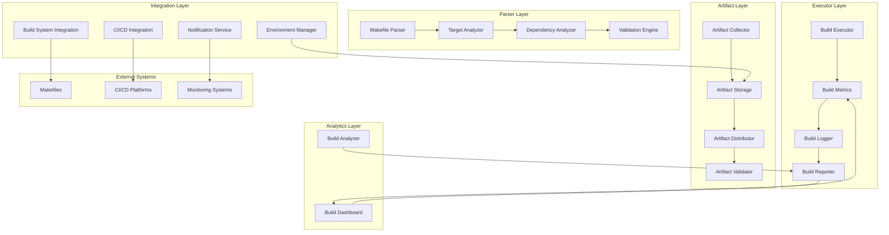
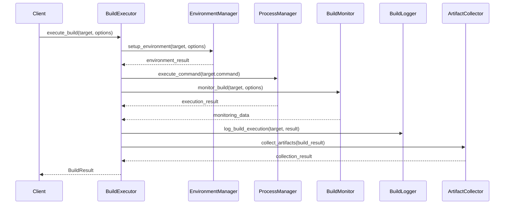
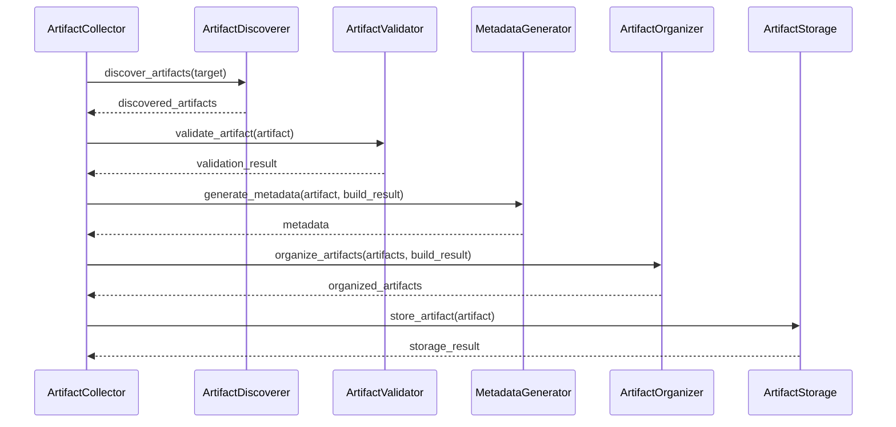
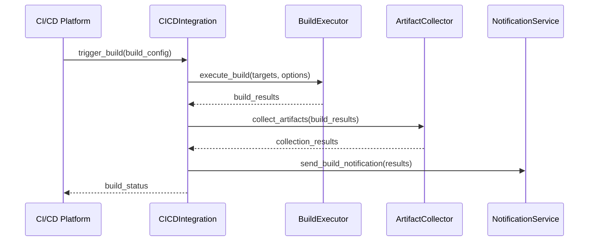

# Makefile Integration Design Specification

## Document Information
- **Version**: 1.0.0
- **Last Updated**: 2024-01-15
- **Status**: Active
- **RDI Compliance**: Requirements-Driven Implementation
- **Domain**: Domain Index System
- **Module**: Makefile Integration

## 1. Introduction

This document provides the detailed design specification for the Makefile Integration component of the Domain Index System. The Makefile Integration system is responsible for integrating with build systems and providing automated build, test, and deployment capabilities while enabling seamless integration with Make-based workflows.

### 1.1 Design Objectives
- **Build System Integration**: Seamlessly integrate with Make-based build systems
- **Automated Build Management**: Provide automated build execution and monitoring
- **Artifact Management**: Handle build artifact collection, storage, and distribution
- **CI/CD Integration**: Enable integration with popular CI/CD platforms
- **Build Analytics**: Provide comprehensive build analytics and reporting

### 1.2 Architecture Overview
The Makefile Integration system follows a layered architecture with clear separation of concerns:
- **Parser Layer**: Handles Makefile parsing and analysis
- **Executor Layer**: Manages build execution and monitoring
- **Artifact Layer**: Handles build artifact management
- **Integration Layer**: Provides CI/CD and external system integration
- **Analytics Layer**: Provides build analytics and reporting

## 2. System Architecture

### 2.1 High-Level Architecture



### 2.2 Component Architecture

#### 2.2.1 Parser Layer Components

**MakefileParser**
- **Purpose**: Parse and analyze Makefile syntax and structure
- **Responsibilities**: 
  - Parse Makefile syntax and grammar
  - Extract build targets and dependencies
  - Analyze target relationships
  - Validate Makefile structure

**TargetAnalyzer**
- **Purpose**: Analyze build targets and their properties
- **Responsibilities**:
  - Analyze target definitions
  - Extract target parameters
  - Identify target types and categories
  - Generate target metadata

**DependencyAnalyzer**
- **Purpose**: Analyze target dependencies and execution order
- **Responsibilities**:
  - Build dependency graphs
  - Determine execution order
  - Identify circular dependencies
  - Optimize execution sequences

**ValidationEngine**
- **Purpose**: Validate Makefile syntax and structure
- **Responsibilities**:
  - Validate Makefile syntax
  - Check target definitions
  - Verify dependency relationships
  - Report validation errors

#### 2.2.2 Executor Layer Components

**BuildExecutor**
- **Purpose**: Execute build targets and manage build processes
- **Responsibilities**:
  - Execute build targets
  - Manage build processes
  - Handle build environment
  - Coordinate target execution

**BuildMonitor**
- **Purpose**: Monitor build execution and performance
- **Responsibilities**:
  - Monitor build progress
  - Track build performance
  - Detect build issues
  - Provide real-time updates

**BuildLogger**
- **Purpose**: Log build execution and capture build output
- **Responsibilities**:
  - Capture build output
  - Log build events
  - Store build logs
  - Provide log access

**BuildReporter**
- **Purpose**: Generate build reports and status updates
- **Responsibilities**:
  - Generate build reports
  - Provide status updates
  - Create build summaries
  - Handle notifications

#### 2.2.3 Artifact Layer Components

**ArtifactCollector**
- **Purpose**: Collect and organize build artifacts
- **Responsibilities**:
  - Collect build artifacts
  - Organize artifacts by type
  - Validate artifact integrity
  - Generate artifact metadata

**ArtifactStorage**
- **Purpose**: Store and manage build artifacts
- **Responsibilities**:
  - Store build artifacts
  - Manage artifact versions
  - Handle artifact cleanup
  - Provide artifact access

**ArtifactDistributor**
- **Purpose**: Distribute artifacts to target locations
- **Responsibilities**:
  - Distribute artifacts
  - Handle artifact packaging
  - Support multiple channels
  - Manage distribution policies

**ArtifactValidator**
- **Purpose**: Validate artifact integrity and completeness
- **Responsibilities**:
  - Validate artifact integrity
  - Check artifact completeness
  - Verify artifact signatures
  - Report validation results

#### 2.2.4 Integration Layer Components

**CICDIntegration**
- **Purpose**: Integrate with CI/CD platforms and workflows
- **Responsibilities**:
  - Integrate with GitHub Actions
  - Support Jenkins pipelines
  - Enable GitLab CI integration
  - Handle CI/CD workflows

**BuildSystemIntegration**
- **Purpose**: Integrate with various build systems
- **Responsibilities**:
  - Support Make-based systems
  - Integrate with CMake, Gradle
  - Handle build system abstraction
  - Enable cross-platform builds

**EnvironmentManager**
- **Purpose**: Manage build environments and dependencies
- **Responsibilities**:
  - Setup build environments
  - Install build dependencies
  - Manage environment isolation
  - Handle environment cleanup

**NotificationService**
- **Purpose**: Send build notifications and alerts
- **Responsibilities**:
  - Send build notifications
  - Handle alert escalation
  - Support multiple channels
  - Manage notification preferences

#### 2.2.5 Analytics Layer Components

**BuildAnalyzer**
- **Purpose**: Analyze build performance and trends
- **Responsibilities**:
  - Analyze build metrics
  - Identify performance trends
  - Detect build issues
  - Generate insights

**BuildReporter**
- **Purpose**: Generate comprehensive build reports
- **Responsibilities**:
  - Generate build reports
  - Create performance summaries
  - Provide trend analysis
  - Support custom reports

**BuildDashboard**
- **Purpose**: Provide build visualization and monitoring
- **Responsibilities**:
  - Display build status
  - Show performance metrics
  - Provide real-time updates
  - Enable drill-down analysis

**BuildMetrics**
- **Purpose**: Collect and manage build metrics
- **Responsibilities**:
  - Collect build metrics
  - Store metric data
  - Calculate statistics
  - Provide metric queries

## 3. Detailed Component Design

### 3.1 MakefileParser Component

```python
class MakefileParser(ReflectiveModule):
    """Makefile parsing component."""
    
    def __init__(self, config: ParserConfig):
        self.config = config
        self.grammar_parser = GrammarParser(config)
        self.target_extractor = TargetExtractor(config)
        self.dependency_analyzer = DependencyAnalyzer(config)
        self.validator = ValidationEngine(config)
    
    async def parse_makefile(self, makefile_path: str) -> ParseResult:
        """Parse a Makefile and extract build information."""
        try:
            # Read Makefile content
            with open(makefile_path, 'r') as f:
                content = f.read()
            
            # Parse grammar
            grammar_result = await self.grammar_parser.parse(content)
            if not grammar_result.success:
                return ParseResult(
                    success=False,
                    error=f"Grammar parsing failed: {grammar_result.error}"
                )
            
            # Extract targets
            targets = await self.target_extractor.extract_targets(grammar_result.ast)
            
            # Analyze dependencies
            dependencies = await self.dependency_analyzer.analyze_dependencies(targets)
            
            # Validate structure
            validation_result = await self.validator.validate(targets, dependencies)
            if not validation_result.is_valid:
                return ParseResult(
                    success=False,
                    error=f"Validation failed: {validation_result.errors}"
                )
            
            return ParseResult(
                success=True,
                targets=targets,
                dependencies=dependencies,
                metadata=grammar_result.metadata
            )
            
        except Exception as e:
            logger.error(f"Makefile parsing failed: {e}")
            return ParseResult(success=False, error=str(e))
    
    async def discover_targets(self, makefile_path: str) -> List[BuildTarget]:
        """Discover all available build targets."""
        try:
            parse_result = await self.parse_makefile(makefile_path)
            if not parse_result.success:
                return []
            
            return parse_result.targets
            
        except Exception as e:
            logger.error(f"Target discovery failed: {e}")
            return []
    
    def get_module_info(self) -> ModuleInfo:
        """Get module information for ReflectiveModule interface."""
        return ModuleInfo(
            name="MakefileParser",
            version="1.0.0",
            description="Makefile parsing and analysis component",
            capabilities=["makefile_parsing", "target_extraction", "dependency_analysis"],
            dependencies=["GrammarParser", "TargetExtractor", "DependencyAnalyzer"]
        )
```

### 3.2 BuildExecutor Component

```python
class BuildExecutor(ReflectiveModule):
    """Build execution component."""
    
    def __init__(self, config: ExecutorConfig):
        self.config = config
        self.process_manager = ProcessManager(config)
        self.environment_manager = EnvironmentManager(config)
        self.monitor = BuildMonitor(config)
        self.logger = BuildLogger(config)
    
    async def execute_build(self, target: BuildTarget, options: BuildOptions) -> BuildResult:
        """Execute a build target."""
        try:
            # Setup build environment
            env_result = await self.environment_manager.setup_environment(target, options)
            if not env_result.success:
                return BuildResult(
                    success=False,
                    error=f"Environment setup failed: {env_result.error}"
                )
            
            # Start build monitoring
            monitor_task = asyncio.create_task(
                self.monitor.monitor_build(target, options)
            )
            
            # Execute build command
            execution_result = await self.process_manager.execute_command(
                target.command, 
                target.working_directory,
                options.environment_vars
            )
            
            # Stop monitoring
            monitor_task.cancel()
            
            # Log build execution
            await self.logger.log_build_execution(target, execution_result)
            
            # Collect artifacts if successful
            artifacts = []
            if execution_result.success:
                artifacts = await self._collect_artifacts(target, options)
            
            return BuildResult(
                success=execution_result.success,
                target=target,
                execution_time=execution_result.execution_time,
                output=execution_result.output,
                artifacts=artifacts,
                error=execution_result.error
            )
            
        except Exception as e:
            logger.error(f"Build execution failed: {e}")
            return BuildResult(success=False, error=str(e))
    
    async def execute_parallel_builds(self, targets: List[BuildTarget], options: BuildOptions) -> List[BuildResult]:
        """Execute multiple build targets in parallel."""
        try:
            # Create execution tasks
            tasks = [
                self.execute_build(target, options) 
                for target in targets
            ]
            
            # Execute in parallel
            results = await asyncio.gather(*tasks, return_exceptions=True)
            
            # Process results
            build_results = []
            for i, result in enumerate(results):
                if isinstance(result, Exception):
                    build_results.append(BuildResult(
                        success=False,
                        target=targets[i],
                        error=str(result)
                    ))
                else:
                    build_results.append(result)
            
            return build_results
            
        except Exception as e:
            logger.error(f"Parallel build execution failed: {e}")
            return [BuildResult(success=False, error=str(e)) for _ in targets]
    
    def get_capabilities(self) -> List[str]:
        """Get build execution capabilities."""
        return [
            "single_target_execution",
            "parallel_target_execution",
            "environment_management",
            "process_monitoring",
            "artifact_collection"
        ]
```

### 3.3 ArtifactCollector Component

```python
class ArtifactCollector(ReflectiveModule):
    """Build artifact collection component."""
    
    def __init__(self, config: ArtifactConfig):
        self.config = config
        self.storage = ArtifactStorage(config)
        self.validator = ArtifactValidator(config)
        self.metadata_generator = MetadataGenerator(config)
        self.organizer = ArtifactOrganizer(config)
    
    async def collect_artifacts(self, build_result: BuildResult) -> CollectionResult:
        """Collect artifacts from a build result."""
        try:
            if not build_result.success:
                return CollectionResult(
                    success=False,
                    error="Build was not successful, no artifacts to collect"
                )
            
            # Discover artifacts
            artifacts = await self._discover_artifacts(build_result.target)
            
            # Validate artifacts
            validated_artifacts = []
            for artifact in artifacts:
                validation_result = await self.validator.validate_artifact(artifact)
                if validation_result.is_valid:
                    validated_artifacts.append(artifact)
                else:
                    logger.warning(f"Artifact validation failed: {validation_result.error}")
            
            # Generate metadata
            for artifact in validated_artifacts:
                artifact.metadata = await self.metadata_generator.generate_metadata(artifact, build_result)
            
            # Organize artifacts
            organized_artifacts = await self.organizer.organize_artifacts(validated_artifacts, build_result)
            
            # Store artifacts
            storage_results = []
            for artifact in organized_artifacts:
                storage_result = await self.storage.store_artifact(artifact)
                storage_results.append(storage_result)
            
            # Check storage results
            if not all(result.success for result in storage_results):
                return CollectionResult(
                    success=False,
                    error="Some artifacts failed to store"
                )
            
            return CollectionResult(
                success=True,
                artifacts=organized_artifacts,
                collection_time=time.time()
            )
            
        except Exception as e:
            logger.error(f"Artifact collection failed: {e}")
            return CollectionResult(success=False, error=str(e))
    
    async def _discover_artifacts(self, target: BuildTarget) -> List[BuildArtifact]:
        """Discover artifacts generated by a build target."""
        try:
            artifacts = []
            
            # Check target output directories
            for output_dir in target.output_directories:
                if os.path.exists(output_dir):
                    for root, dirs, files in os.walk(output_dir):
                        for file in files:
                            file_path = os.path.join(root, file)
                            artifact = BuildArtifact(
                                path=file_path,
                                name=file,
                                type=self._determine_artifact_type(file),
                                size=os.path.getsize(file_path),
                                created_time=os.path.getctime(file_path)
                            )
                            artifacts.append(artifact)
            
            return artifacts
            
        except Exception as e:
            logger.error(f"Artifact discovery failed: {e}")
            return []
    
    def _determine_artifact_type(self, filename: str) -> str:
        """Determine artifact type based on filename."""
        extension = os.path.splitext(filename)[1].lower()
        
        type_mapping = {
            '.exe': 'executable',
            '.dll': 'library',
            '.so': 'library',
            '.a': 'static_library',
            '.lib': 'static_library',
            '.jar': 'java_archive',
            '.war': 'web_archive',
            '.tar': 'archive',
            '.zip': 'archive',
            '.gz': 'compressed',
            '.pdf': 'document',
            '.html': 'document',
            '.css': 'stylesheet',
            '.js': 'script'
        }
        
        return type_mapping.get(extension, 'unknown')
    
    def get_health_status(self) -> HealthStatus:
        """Get health status for ReflectiveModule interface."""
        return HealthStatus(
            status="healthy",
            metrics={
                "artifacts_collected": self.storage.get_collected_count(),
                "collection_success_rate": self.storage.get_success_rate(),
                "storage_usage": self.storage.get_storage_usage()
            }
        )
```

## 4. Data Flow Architecture

### 4.1 Build Execution Flow



### 4.2 Artifact Collection Flow



### 4.3 CI/CD Integration Flow



## 5. Integration Architecture

### 5.1 ReflectiveModule Integration

```python
class MakefileIntegrationReflectiveModule(ReflectiveModule):
    """ReflectiveModule implementation for Makefile Integration."""
    
    def __init__(self, config: IntegrationConfig):
        self.config = config
        self.parser = MakefileParser(config)
        self.executor = BuildExecutor(config)
        self.collector = ArtifactCollector(config)
        self.integrator = CICDIntegration(config)
        self.analyzer = BuildAnalyzer(config)
    
    def get_module_info(self) -> ModuleInfo:
        """Get module information."""
        return ModuleInfo(
            name="MakefileIntegration",
            version="1.0.0",
            description="Makefile integration and build management system",
            capabilities=[
                "makefile_parsing",
                "build_execution",
                "artifact_management",
                "cicd_integration",
                "build_analytics"
            ],
            dependencies=[
                "MakefileParser",
                "BuildExecutor",
                "ArtifactCollector",
                "CICDIntegration",
                "BuildAnalyzer"
            ]
        )
    
    def get_health_status(self) -> HealthStatus:
        """Get health status."""
        return HealthStatus(
            status="healthy",
            metrics={
                "makefiles_parsed": self.parser.get_parsed_count(),
                "builds_executed": self.executor.get_execution_count(),
                "artifacts_collected": self.collector.get_collected_count(),
                "cicd_integrations": self.integrator.get_integration_count(),
                "build_success_rate": self.analyzer.get_success_rate()
            }
        )
    
    def get_capabilities(self) -> List[str]:
        """Get module capabilities."""
        return [
            "makefile_parsing",
            "target_discovery",
            "build_execution",
            "parallel_builds",
            "artifact_collection",
            "artifact_management",
            "cicd_integration",
            "build_monitoring",
            "build_analytics",
            "environment_management"
        ]
    
    def get_dependencies(self) -> List[str]:
        """Get module dependencies."""
        return [
            "ReflectiveModuleSystem",
            "ConfigurationManagement",
            "LoggingSystem",
            "SecuritySystem",
            "HealthMonitoring",
            "ArtifactStorage",
            "CICDPlatforms"
        ]
    
    def get_configuration(self) -> Dict[str, Any]:
        """Get module configuration."""
        return {
            "supported_makefiles": self.config.supported_makefiles,
            "max_parallel_builds": self.config.max_parallel_builds,
            "artifact_retention_days": self.config.artifact_retention_days,
            "build_timeout": self.config.build_timeout,
            "cicd_platforms": list(self.config.cicd_platforms.keys())
        }
    
    def get_metrics(self) -> Dict[str, Any]:
        """Get module metrics."""
        return {
            "parsing_success_rate": self.parser.get_success_rate(),
            "execution_success_rate": self.executor.get_success_rate(),
            "collection_success_rate": self.collector.get_success_rate(),
            "average_build_time": self.executor.get_average_build_time(),
            "artifact_storage_usage": self.collector.get_storage_usage()
        }
```

## 6. Testing Architecture

### 6.1 Unit Testing

```python
class MakefileIntegrationUnitTests:
    """Unit tests for Makefile Integration components."""
    
    def test_makefile_parsing(self):
        """Test Makefile parsing functionality."""
        parser = MakefileParser(TestConfig())
        
        # Test valid Makefile parsing
        makefile_content = """
        all: build test
        build:
            echo "Building..."
        test:
            echo "Testing..."
        """
        
        result = parser.parse_makefile_content(makefile_content)
        assert result.success
        assert len(result.targets) == 3
        assert any(target.name == "all" for target in result.targets)
    
    def test_build_execution(self):
        """Test build execution functionality."""
        executor = BuildExecutor(TestConfig())
        
        # Test single target execution
        target = BuildTarget(
            name="test_target",
            command="echo 'Hello World'",
            working_directory="/tmp"
        )
        
        result = executor.execute_build(target, BuildOptions())
        assert result.success
        assert "Hello World" in result.output
    
    def test_artifact_collection(self):
        """Test artifact collection functionality."""
        collector = ArtifactCollector(TestConfig())
        
        # Test artifact discovery
        target = BuildTarget(
            name="test_target",
            output_directories=["/tmp/test_output"]
        )
        
        # Create test artifact
        os.makedirs("/tmp/test_output", exist_ok=True)
        with open("/tmp/test_output/test.txt", "w") as f:
            f.write("test content")
        
        artifacts = collector.discover_artifacts(target)
        assert len(artifacts) > 0
        assert any(artifact.name == "test.txt" for artifact in artifacts)
```

### 6.2 Integration Testing

```python
class MakefileIntegrationIntegrationTests:
    """Integration tests for Makefile Integration."""
    
    async def test_end_to_end_build_flow(self):
        """Test complete build flow."""
        integration = MakefileIntegration(TestConfig())
        
        # Test Makefile parsing
        parse_result = await integration.parse_makefile("test/Makefile")
        assert parse_result.success
        assert len(parse_result.targets) > 0
        
        # Test build execution
        build_result = await integration.execute_build("test_target")
        assert build_result.success
        
        # Test artifact collection
        collection_result = await integration.collect_artifacts(build_result)
        assert collection_result.success
    
    async def test_cicd_integration(self):
        """Test CI/CD integration."""
        integration = MakefileIntegration(TestConfig())
        
        # Test CI/CD trigger
        trigger_result = await integration.trigger_cicd_build("test_config")
        assert trigger_result.success
        
        # Test build status monitoring
        status = await integration.get_build_status(trigger_result.build_id)
        assert status is not None
```

## 7. Deployment Architecture

### 7.1 Container Deployment

```dockerfile
# Dockerfile for Makefile Integration
FROM python:3.9-slim

WORKDIR /app

# Install dependencies
COPY requirements.txt .
RUN pip install -r requirements.txt

# Install build tools
RUN apt-get update && apt-get install -y make gcc g++

# Copy application code
COPY src/ ./src/
COPY config/ ./config/

# Set environment variables
ENV PYTHONPATH=/app/src
ENV MAKEFILE_INTEGRATION_CONFIG=/app/config/makefile_integration.yaml

# Expose port
EXPOSE 8080

# Health check
HEALTHCHECK --interval=30s --timeout=10s --start-period=5s --retries=3 \
    CMD curl -f http://localhost:8080/health || exit 1

# Start application
CMD ["python", "-m", "src.makefile_integration.main"]
```

### 7.2 Kubernetes Deployment

```yaml
# kubernetes-deployment.yaml
apiVersion: apps/v1
kind: Deployment
metadata:
  name: makefile-integration
spec:
  replicas: 3
  selector:
    matchLabels:
      app: makefile-integration
  template:
    metadata:
      labels:
        app: makefile-integration
    spec:
      containers:
      - name: makefile-integration
        image: makefile-integration:latest
        ports:
        - containerPort: 8080
        env:
        - name: MAKEFILE_INTEGRATION_CONFIG
          value: "/app/config/makefile_integration.yaml"
        resources:
          requests:
            memory: "2Gi"
            cpu: "1000m"
          limits:
            memory: "4Gi"
            cpu: "2000m"
        livenessProbe:
          httpGet:
            path: /health
            port: 8080
          initialDelaySeconds: 30
          periodSeconds: 10
        readinessProbe:
          httpGet:
            path: /ready
            port: 8080
          initialDelaySeconds: 5
          periodSeconds: 5
```

---

**Document Status**: Complete
**Next Review**: 2024-01-22
**Approved By**: System Architect
**Version History**: 
- v1.0.0: Initial design specification
