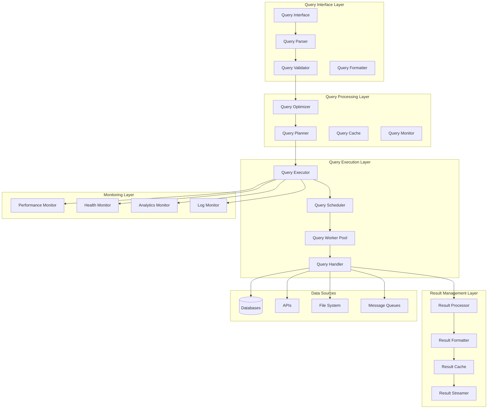
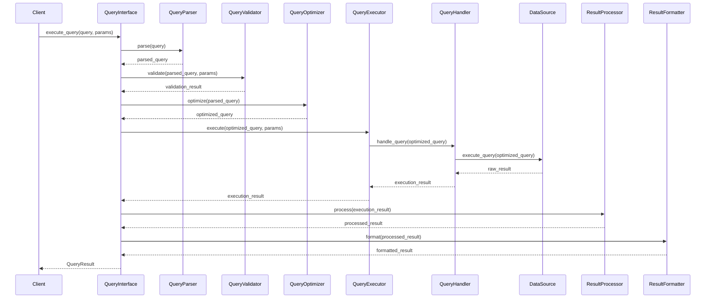
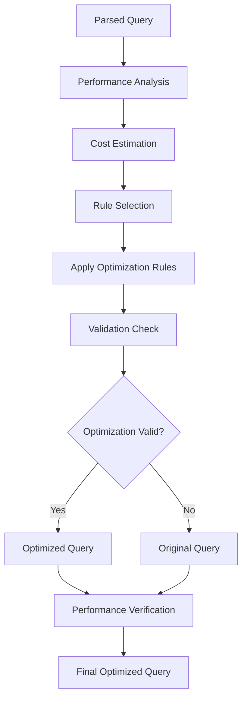
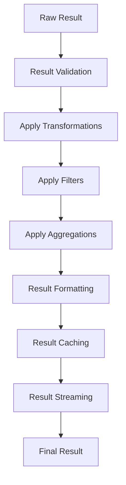

# Query Engine Design Specification

## Document Information
- **Version**: 1.0.0
- **Last Updated**: 2024-01-15
- **Status**: Active
- **RDI Compliance**: Requirements-Driven Implementation
- **Domain**: Domain Index System
- **Module**: Query Engine

## 1. Introduction

This document provides the detailed design specification for the Query Engine component of the Domain Index System. The Query Engine is responsible for processing, optimizing, and executing queries across the entire system while providing a unified interface for querying modules, services, and data sources.

### 1.1 Design Objectives
- **Unified Query Interface**: Provide a single, consistent interface for all query operations
- **High Performance**: Optimize query execution for maximum throughput and minimal latency
- **Scalability**: Support horizontal scaling and high concurrent query loads
- **Reliability**: Ensure robust error handling and fault tolerance
- **Extensibility**: Support multiple query languages and data sources

### 1.2 Architecture Overview
The Query Engine follows a layered architecture with clear separation of concerns:
- **Query Interface Layer**: Handles query parsing, validation, and formatting
- **Query Processing Layer**: Manages query optimization and execution planning
- **Query Execution Layer**: Executes queries against various data sources
- **Result Management Layer**: Processes, caches, and formats query results
- **Monitoring Layer**: Tracks performance, health, and analytics

## 2. System Architecture

### 2.1 High-Level Architecture



### 2.2 Component Architecture

#### 2.2.1 Query Interface Layer Components

**QueryInterface**
- **Purpose**: Main entry point for all query operations
- **Responsibilities**: 
  - Accept queries from various sources (REST API, GraphQL, CLI)
  - Route queries to appropriate processors
  - Handle query authentication and authorization
  - Provide query status and progress updates

**QueryParser**
- **Purpose**: Parse queries from various query languages
- **Responsibilities**:
  - Parse SQL-like queries
  - Parse GraphQL queries
  - Parse custom DSL queries
  - Extract query parameters and metadata

**QueryValidator**
- **Purpose**: Validate query syntax and semantics
- **Responsibilities**:
  - Validate query syntax
  - Check query permissions
  - Validate query parameters
  - Report validation errors

**QueryFormatter**
- **Purpose**: Format query results for different output formats
- **Responsibilities**:
  - Format results as JSON, XML, CSV, YAML
  - Apply result pagination and limiting
  - Generate result metadata
  - Handle result streaming

#### 2.2.2 Query Processing Layer Components

**QueryOptimizer**
- **Purpose**: Optimize queries for best performance
- **Responsibilities**:
  - Analyze query execution plans
  - Apply optimization rules
  - Rewrite queries for efficiency
  - Select optimal execution strategies

**QueryPlanner**
- **Purpose**: Create execution plans for queries
- **Responsibilities**:
  - Generate execution plans
  - Estimate resource requirements
  - Plan query execution steps
  - Optimize resource allocation

**QueryCache**
- **Purpose**: Cache query results for performance
- **Responsibilities**:
  - Cache frequently used query results
  - Implement cache invalidation
  - Manage cache storage
  - Provide cache statistics

**QueryMonitor**
- **Purpose**: Monitor query execution and performance
- **Responsibilities**:
  - Track query execution metrics
  - Monitor resource usage
  - Detect performance issues
  - Generate performance reports

#### 2.2.3 Query Execution Layer Components

**QueryExecutor**
- **Purpose**: Execute queries against data sources
- **Responsibilities**:
  - Execute queries against databases
  - Execute queries against APIs
  - Execute queries against file systems
  - Handle query execution errors

**QueryScheduler**
- **Purpose**: Schedule and manage query execution
- **Responsibilities**:
  - Schedule query execution
  - Manage query priorities
  - Handle query queuing
  - Balance query load

**QueryWorkerPool**
- **Purpose**: Manage concurrent query execution
- **Responsibilities**:
  - Manage worker threads/processes
  - Distribute query execution load
  - Handle worker lifecycle
  - Monitor worker performance

**QueryHandler**
- **Purpose**: Handle specific query types and data sources
- **Responsibilities**:
  - Handle database queries
  - Handle API queries
  - Handle file system queries
  - Handle message queue queries

#### 2.2.4 Result Management Layer Components

**ResultProcessor**
- **Purpose**: Process and transform query results
- **Responsibilities**:
  - Process raw query results
  - Apply result transformations
  - Filter and sort results
  - Aggregate result data

**ResultFormatter**
- **Purpose**: Format results for different output formats
- **Responsibilities**:
  - Format results as JSON, XML, CSV
  - Apply result pagination
  - Generate result metadata
  - Handle result compression

**ResultCache**
- **Purpose**: Cache formatted results
- **Responsibilities**:
  - Cache formatted results
  - Manage cache expiration
  - Handle cache invalidation
  - Provide cache statistics

**ResultStreamer**
- **Purpose**: Stream large result sets
- **Responsibilities**:
  - Stream results in chunks
  - Handle streaming errors
  - Manage streaming connections
  - Provide streaming progress

## 3. Detailed Component Design

### 3.1 QueryInterface Component

```python
class QueryInterface(ReflectiveModule):
    """Main query interface component."""
    
    def __init__(self, config: QueryConfig):
        self.config = config
        self.parser = QueryParser(config)
        self.validator = QueryValidator(config)
        self.optimizer = QueryOptimizer(config)
        self.executor = QueryExecutor(config)
        self.formatter = QueryFormatter(config)
        self.monitor = QueryMonitor(config)
    
    async def execute_query(self, query: str, params: Dict[str, Any]) -> QueryResult:
        """Execute a query and return results."""
        try:
            # Parse query
            parsed_query = await self.parser.parse(query)
            
            # Validate query
            validation_result = await self.validator.validate(parsed_query, params)
            if not validation_result.is_valid:
                raise QueryValidationError(validation_result.errors)
            
            # Optimize query
            optimized_query = await self.optimizer.optimize(parsed_query)
            
            # Execute query
            execution_result = await self.executor.execute(optimized_query, params)
            
            # Format results
            formatted_result = await self.formatter.format(execution_result)
            
            # Monitor performance
            await self.monitor.record_execution(parsed_query, execution_result)
            
            return formatted_result
            
        except Exception as e:
            await self.monitor.record_error(query, e)
            raise QueryExecutionError(f"Query execution failed: {e}")
    
    def get_module_info(self) -> ModuleInfo:
        """Get module information for ReflectiveModule interface."""
        return ModuleInfo(
            name="QueryInterface",
            version="1.0.0",
            description="Main query interface component",
            capabilities=["query_execution", "query_optimization", "result_formatting"],
            dependencies=["QueryParser", "QueryValidator", "QueryOptimizer", "QueryExecutor"]
        )
    
    def get_health_status(self) -> HealthStatus:
        """Get health status for ReflectiveModule interface."""
        return HealthStatus(
            status="healthy",
            metrics={
                "queries_executed": self.monitor.get_query_count(),
                "average_execution_time": self.monitor.get_average_execution_time(),
                "error_rate": self.monitor.get_error_rate()
            }
        )
```

### 3.2 QueryOptimizer Component

```python
class QueryOptimizer(ReflectiveModule):
    """Query optimization component."""
    
    def __init__(self, config: QueryConfig):
        self.config = config
        self.optimization_rules = self._load_optimization_rules()
        self.performance_analyzer = PerformanceAnalyzer(config)
        self.cost_estimator = CostEstimator(config)
    
    async def optimize(self, query: ParsedQuery) -> OptimizedQuery:
        """Optimize a parsed query."""
        try:
            # Analyze query performance
            performance_analysis = await self.performance_analyzer.analyze(query)
            
            # Estimate execution cost
            cost_estimate = await self.cost_estimator.estimate(query)
            
            # Apply optimization rules
            optimized_query = query
            for rule in self.optimization_rules:
                if rule.applies_to(optimized_query):
                    optimized_query = await rule.apply(optimized_query)
            
            # Validate optimization
            if not await self._validate_optimization(query, optimized_query):
                return query  # Return original if optimization is invalid
            
            return optimized_query
            
        except Exception as e:
            logger.error(f"Query optimization failed: {e}")
            return query  # Return original query on optimization failure
    
    def _load_optimization_rules(self) -> List[OptimizationRule]:
        """Load optimization rules from configuration."""
        rules = []
        for rule_config in self.config.optimization_rules:
            rule_class = get_rule_class(rule_config.type)
            rules.append(rule_class(rule_config))
        return rules
    
    def get_capabilities(self) -> List[str]:
        """Get optimization capabilities."""
        return [
            "query_rewriting",
            "index_optimization",
            "join_optimization",
            "predicate_pushdown",
            "projection_optimization"
        ]
```

### 3.3 QueryExecutor Component

```python
class QueryExecutor(ReflectiveModule):
    """Query execution component."""
    
    def __init__(self, config: QueryConfig):
        self.config = config
        self.scheduler = QueryScheduler(config)
        self.worker_pool = QueryWorkerPool(config)
        self.handlers = self._initialize_handlers()
        self.monitor = QueryMonitor(config)
    
    async def execute(self, query: OptimizedQuery, params: Dict[str, Any]) -> ExecutionResult:
        """Execute an optimized query."""
        try:
            # Schedule query execution
            execution_plan = await self.scheduler.schedule(query)
            
            # Execute query using worker pool
            execution_result = await self.worker_pool.execute(execution_plan, params)
            
            # Monitor execution
            await self.monitor.record_execution(query, execution_result)
            
            return execution_result
            
        except Exception as e:
            await self.monitor.record_error(query, e)
            raise QueryExecutionError(f"Query execution failed: {e}")
    
    def _initialize_handlers(self) -> Dict[str, QueryHandler]:
        """Initialize query handlers for different data sources."""
        handlers = {}
        for source_type, handler_config in self.config.data_sources.items():
            handler_class = get_handler_class(source_type)
            handlers[source_type] = handler_class(handler_config)
        return handlers
    
    def get_dependencies(self) -> List[str]:
        """Get component dependencies."""
        return [
            "QueryScheduler",
            "QueryWorkerPool",
            "DatabaseHandler",
            "APIHandler",
            "FileSystemHandler"
        ]
```

### 3.4 ResultProcessor Component

```python
class ResultProcessor(ReflectiveModule):
    """Result processing component."""
    
    def __init__(self, config: QueryConfig):
        self.config = config
        self.transformers = self._load_transformers()
        self.filters = self._load_filters()
        self.aggregators = self._load_aggregators()
    
    async def process(self, raw_result: RawResult, processing_config: ProcessingConfig) -> ProcessedResult:
        """Process raw query results."""
        try:
            processed_result = raw_result
            
            # Apply transformations
            for transformer in self.transformers:
                if transformer.applies_to(processed_result, processing_config):
                    processed_result = await transformer.transform(processed_result)
            
            # Apply filters
            for filter_rule in self.filters:
                if filter_rule.applies_to(processed_result, processing_config):
                    processed_result = await filter_rule.apply(processed_result)
            
            # Apply aggregations
            for aggregator in self.aggregators:
                if aggregator.applies_to(processed_result, processing_config):
                    processed_result = await aggregator.aggregate(processed_result)
            
            return processed_result
            
        except Exception as e:
            logger.error(f"Result processing failed: {e}")
            raise ResultProcessingError(f"Result processing failed: {e}")
    
    def get_health_status(self) -> HealthStatus:
        """Get health status."""
        return HealthStatus(
            status="healthy",
            metrics={
                "results_processed": self._get_processed_count(),
                "processing_time": self._get_average_processing_time(),
                "error_rate": self._get_error_rate()
            }
        )
```

## 4. Data Flow Architecture

### 4.1 Query Execution Flow



### 4.2 Query Optimization Flow



### 4.3 Result Processing Flow



## 5. Error Handling Architecture

### 5.1 Error Classification

```python
class QueryError(Exception):
    """Base class for query-related errors."""
    pass

class QueryValidationError(QueryError):
    """Query validation errors."""
    pass

class QueryOptimizationError(QueryError):
    """Query optimization errors."""
    pass

class QueryExecutionError(QueryError):
    """Query execution errors."""
    pass

class ResultProcessingError(QueryError):
    """Result processing errors."""
    pass

class DataSourceError(QueryError):
    """Data source errors."""
    pass
```

### 5.2 Error Handling Strategy

```python
class ErrorHandler:
    """Centralized error handling for Query Engine."""
    
    def __init__(self, config: ErrorConfig):
        self.config = config
        self.logger = Logger("QueryEngine.ErrorHandler")
        self.metrics = MetricsCollector()
    
    async def handle_error(self, error: Exception, context: ErrorContext) -> ErrorResponse:
        """Handle and process errors."""
        try:
            # Classify error
            error_type = self._classify_error(error)
            
            # Log error
            await self._log_error(error, context)
            
            # Record metrics
            await self._record_error_metrics(error_type, context)
            
            # Generate error response
            error_response = await self._generate_error_response(error, context)
            
            # Notify monitoring systems
            await self._notify_monitoring(error, context)
            
            return error_response
            
        except Exception as e:
            self.logger.error(f"Error handling failed: {e}")
            return self._generate_fallback_error_response(error)
    
    def _classify_error(self, error: Exception) -> ErrorType:
        """Classify error type."""
        if isinstance(error, QueryValidationError):
            return ErrorType.VALIDATION
        elif isinstance(error, QueryExecutionError):
            return ErrorType.EXECUTION
        elif isinstance(error, DataSourceError):
            return ErrorType.DATA_SOURCE
        else:
            return ErrorType.UNKNOWN
```

## 6. Performance Architecture

### 6.1 Caching Strategy

```python
class QueryCache:
    """Query result caching system."""
    
    def __init__(self, config: CacheConfig):
        self.config = config
        self.cache_storage = self._initialize_cache_storage()
        self.cache_policy = self._initialize_cache_policy()
        self.metrics = CacheMetrics()
    
    async def get(self, cache_key: str) -> Optional[CachedResult]:
        """Get cached result."""
        try:
            cached_result = await self.cache_storage.get(cache_key)
            if cached_result and not self._is_expired(cached_result):
                self.metrics.record_cache_hit()
                return cached_result
            else:
                self.metrics.record_cache_miss()
                return None
        except Exception as e:
            logger.error(f"Cache get failed: {e}")
            return None
    
    async def set(self, cache_key: str, result: QueryResult, ttl: int) -> None:
        """Cache query result."""
        try:
            cached_result = CachedResult(
                result=result,
                timestamp=time.time(),
                ttl=ttl
            )
            await self.cache_storage.set(cache_key, cached_result, ttl)
            self.metrics.record_cache_set()
        except Exception as e:
            logger.error(f"Cache set failed: {e}")
    
    def _is_expired(self, cached_result: CachedResult) -> bool:
        """Check if cached result is expired."""
        return time.time() - cached_result.timestamp > cached_result.ttl
```

### 6.2 Performance Monitoring

```python
class PerformanceMonitor:
    """Performance monitoring for Query Engine."""
    
    def __init__(self, config: MonitoringConfig):
        self.config = config
        self.metrics_collector = MetricsCollector()
        self.performance_analyzer = PerformanceAnalyzer()
        self.alert_manager = AlertManager()
    
    async def record_query_execution(self, query: ParsedQuery, execution_time: float, 
                                   resource_usage: ResourceUsage) -> None:
        """Record query execution metrics."""
        try:
            # Record basic metrics
            await self.metrics_collector.record_metric("query_execution_time", execution_time)
            await self.metrics_collector.record_metric("query_count", 1)
            
            # Record resource usage
            await self.metrics_collector.record_metric("cpu_usage", resource_usage.cpu)
            await self.metrics_collector.record_metric("memory_usage", resource_usage.memory)
            
            # Analyze performance
            performance_analysis = await self.performance_analyzer.analyze(
                query, execution_time, resource_usage
            )
            
            # Check for performance issues
            if performance_analysis.has_issues():
                await self.alert_manager.send_alert(performance_analysis)
            
        except Exception as e:
            logger.error(f"Performance monitoring failed: {e}")
```

## 7. Security Architecture

### 7.1 Query Security

```python
class QuerySecurityManager:
    """Security management for Query Engine."""
    
    def __init__(self, config: SecurityConfig):
        self.config = config
        self.authenticator = Authenticator(config)
        self.authorizer = Authorizer(config)
        self.query_sanitizer = QuerySanitizer(config)
        self.audit_logger = AuditLogger(config)
    
    async def validate_query_security(self, query: str, user: User) -> SecurityValidationResult:
        """Validate query security."""
        try:
            # Authenticate user
            auth_result = await self.authenticator.authenticate(user)
            if not auth_result.is_authenticated:
                return SecurityValidationResult(False, "Authentication failed")
            
            # Authorize query
            authz_result = await self.authorizer.authorize_query(query, user)
            if not authz_result.is_authorized:
                return SecurityValidationResult(False, "Authorization failed")
            
            # Sanitize query
            sanitized_query = await self.query_sanitizer.sanitize(query)
            if sanitized_query != query:
                await self.audit_logger.log_query_modification(query, sanitized_query, user)
            
            # Log query access
            await self.audit_logger.log_query_access(query, user)
            
            return SecurityValidationResult(True, "Security validation passed")
            
        except Exception as e:
            logger.error(f"Security validation failed: {e}")
            return SecurityValidationResult(False, f"Security validation error: {e}")
```

### 7.2 Data Protection

```python
class DataProtectionManager:
    """Data protection for Query Engine."""
    
    def __init__(self, config: DataProtectionConfig):
        self.config = config
        self.data_classifier = DataClassifier(config)
        self.data_masking = DataMasking(config)
        self.encryption = Encryption(config)
    
    async def protect_result_data(self, result: QueryResult, user: User) -> ProtectedResult:
        """Protect sensitive data in query results."""
        try:
            # Classify data sensitivity
            sensitivity_level = await self.data_classifier.classify(result.data)
            
            # Apply data masking based on user permissions
            masked_data = await self.data_masking.mask(result.data, user, sensitivity_level)
            
            # Encrypt sensitive data
            if sensitivity_level == SensitivityLevel.HIGH:
                encrypted_data = await self.encryption.encrypt(masked_data)
                return ProtectedResult(encrypted_data, sensitivity_level)
            else:
                return ProtectedResult(masked_data, sensitivity_level)
                
        except Exception as e:
            logger.error(f"Data protection failed: {e}")
            raise DataProtectionError(f"Data protection failed: {e}")
```

## 8. Integration Architecture

### 8.1 ReflectiveModule Integration

```python
class QueryEngineReflectiveModule(ReflectiveModule):
    """ReflectiveModule implementation for Query Engine."""
    
    def __init__(self, config: QueryConfig):
        self.config = config
        self.query_interface = QueryInterface(config)
        self.health_monitor = HealthMonitor(config)
        self.metrics_collector = MetricsCollector(config)
        self.registry_client = RegistryClient(config)
    
    def get_module_info(self) -> ModuleInfo:
        """Get module information."""
        return ModuleInfo(
            name="QueryEngine",
            version="1.0.0",
            description="Query processing and execution engine",
            capabilities=[
                "query_parsing",
                "query_optimization", 
                "query_execution",
                "result_processing",
                "performance_monitoring"
            ],
            dependencies=[
                "QueryParser",
                "QueryOptimizer", 
                "QueryExecutor",
                "ResultProcessor",
                "PerformanceMonitor"
            ]
        )
    
    def get_health_status(self) -> HealthStatus:
        """Get health status."""
        return self.health_monitor.get_health_status()
    
    def get_capabilities(self) -> List[str]:
        """Get module capabilities."""
        return [
            "sql_query_processing",
            "graphql_query_processing",
            "custom_dsl_processing",
            "query_optimization",
            "result_caching",
            "performance_monitoring"
        ]
    
    def get_dependencies(self) -> List[str]:
        """Get module dependencies."""
        return [
            "DatabaseConnections",
            "APIConnections", 
            "FileSystemAccess",
            "MessageQueueConnections",
            "CacheStorage",
            "MonitoringSystem"
        ]
    
    def get_configuration(self) -> Dict[str, Any]:
        """Get module configuration."""
        return {
            "query_languages": self.config.supported_languages,
            "data_sources": list(self.config.data_sources.keys()),
            "cache_enabled": self.config.cache.enabled,
            "max_concurrent_queries": self.config.max_concurrent_queries,
            "query_timeout": self.config.query_timeout
        }
    
    def get_metrics(self) -> Dict[str, Any]:
        """Get module metrics."""
        return self.metrics_collector.get_metrics()
```

### 8.2 Module Registry Integration

```python
class QueryEngineRegistryIntegration:
    """Registry integration for Query Engine."""
    
    def __init__(self, config: RegistryConfig):
        self.config = config
        self.registry_client = RegistryClient(config)
        self.service_discovery = ServiceDiscovery(config)
    
    async def register_query_engine(self, query_engine: QueryEngine) -> None:
        """Register Query Engine with module registry."""
        try:
            service_info = ServiceInfo(
                name="QueryEngine",
                version="1.0.0",
                endpoint=query_engine.get_endpoint(),
                capabilities=query_engine.get_capabilities(),
                health_check_url=query_engine.get_health_check_url()
            )
            
            await self.registry_client.register_service(service_info)
            logger.info("Query Engine registered with module registry")
            
        except Exception as e:
            logger.error(f"Query Engine registration failed: {e}")
            raise RegistryIntegrationError(f"Registration failed: {e}")
    
    async def discover_data_sources(self) -> List[DataSourceInfo]:
        """Discover available data sources."""
        try:
            data_sources = await self.service_discovery.discover_services("DataSource")
            return [DataSourceInfo.from_service_info(ds) for ds in data_sources]
        except Exception as e:
            logger.error(f"Data source discovery failed: {e}")
            return []
```

## 9. Testing Architecture

### 9.1 Unit Testing

```python
class QueryEngineUnitTests:
    """Unit tests for Query Engine components."""
    
    def test_query_parsing(self):
        """Test query parsing functionality."""
        parser = QueryParser(TestConfig())
        
        # Test SQL parsing
        sql_query = "SELECT * FROM users WHERE id = ?"
        parsed = parser.parse(sql_query)
        assert parsed.language == "SQL"
        assert parsed.operation == "SELECT"
        
        # Test GraphQL parsing
        graphql_query = "{ users { id name email } }"
        parsed = parser.parse(graphql_query)
        assert parsed.language == "GraphQL"
        assert parsed.operation == "QUERY"
    
    def test_query_optimization(self):
        """Test query optimization functionality."""
        optimizer = QueryOptimizer(TestConfig())
        
        # Test basic optimization
        query = ParsedQuery("SELECT * FROM users WHERE id = 1")
        optimized = optimizer.optimize(query)
        assert optimized != query
        assert optimized.execution_plan is not None
    
    def test_query_execution(self):
        """Test query execution functionality."""
        executor = QueryExecutor(TestConfig())
        
        # Test database query execution
        query = OptimizedQuery("SELECT * FROM users")
        result = executor.execute(query, {})
        assert result.success
        assert result.data is not None
```

### 9.2 Integration Testing

```python
class QueryEngineIntegrationTests:
    """Integration tests for Query Engine."""
    
    async def test_end_to_end_query_execution(self):
        """Test complete query execution flow."""
        query_engine = QueryEngine(TestConfig())
        
        # Test complete flow
        query = "SELECT * FROM users WHERE active = true"
        result = await query_engine.execute_query(query, {})
        
        assert result.success
        assert result.data is not None
        assert result.execution_time > 0
        assert result.metadata is not None
    
    async def test_query_caching(self):
        """Test query result caching."""
        query_engine = QueryEngine(TestConfig())
        
        # Execute query first time
        query = "SELECT COUNT(*) FROM users"
        result1 = await query_engine.execute_query(query, {})
        
        # Execute same query second time (should be cached)
        result2 = await query_engine.execute_query(query, {})
        
        assert result1.data == result2.data
        assert result2.from_cache == True
```

### 9.3 Performance Testing

```python
class QueryEnginePerformanceTests:
    """Performance tests for Query Engine."""
    
    async def test_concurrent_query_execution(self):
        """Test concurrent query execution."""
        query_engine = QueryEngine(TestConfig())
        
        # Execute 100 concurrent queries
        queries = [f"SELECT * FROM users WHERE id = {i}" for i in range(100)]
        tasks = [query_engine.execute_query(query, {}) for query in queries]
        
        start_time = time.time()
        results = await asyncio.gather(*tasks)
        end_time = time.time()
        
        # Verify all queries succeeded
        assert all(result.success for result in results)
        
        # Verify execution time is reasonable
        execution_time = end_time - start_time
        assert execution_time < 10.0  # Should complete within 10 seconds
    
    async def test_large_result_set_handling(self):
        """Test handling of large result sets."""
        query_engine = QueryEngine(TestConfig())
        
        # Execute query that returns large result set
        query = "SELECT * FROM large_table"
        result = await query_engine.execute_query(query, {})
        
        assert result.success
        assert len(result.data) > 10000  # Large result set
        assert result.streaming_enabled  # Should use streaming
```

## 10. Deployment Architecture

### 10.1 Container Deployment

```dockerfile
# Dockerfile for Query Engine
FROM python:3.9-slim

WORKDIR /app

# Install dependencies
COPY requirements.txt .
RUN pip install -r requirements.txt

# Copy application code
COPY src/ ./src/
COPY config/ ./config/

# Set environment variables
ENV PYTHONPATH=/app/src
ENV QUERY_ENGINE_CONFIG=/app/config/query_engine.yaml

# Expose port
EXPOSE 8080

# Health check
HEALTHCHECK --interval=30s --timeout=10s --start-period=5s --retries=3 \
    CMD curl -f http://localhost:8080/health || exit 1

# Start application
CMD ["python", "-m", "src.query_engine.main"]
```

### 10.2 Kubernetes Deployment

```yaml
# kubernetes-deployment.yaml
apiVersion: apps/v1
kind: Deployment
metadata:
  name: query-engine
spec:
  replicas: 3
  selector:
    matchLabels:
      app: query-engine
  template:
    metadata:
      labels:
        app: query-engine
    spec:
      containers:
      - name: query-engine
        image: query-engine:latest
        ports:
        - containerPort: 8080
        env:
        - name: QUERY_ENGINE_CONFIG
          value: "/app/config/query_engine.yaml"
        resources:
          requests:
            memory: "1Gi"
            cpu: "500m"
          limits:
            memory: "2Gi"
            cpu: "1000m"
        livenessProbe:
          httpGet:
            path: /health
            port: 8080
          initialDelaySeconds: 30
          periodSeconds: 10
        readinessProbe:
          httpGet:
            path: /ready
            port: 8080
          initialDelaySeconds: 5
          periodSeconds: 5
```

## 11. Monitoring and Observability

### 11.1 Metrics Collection

```python
class QueryEngineMetrics:
    """Metrics collection for Query Engine."""
    
    def __init__(self):
        self.metrics = {
            "queries_executed_total": Counter(),
            "query_execution_duration": Histogram(),
            "query_cache_hits": Counter(),
            "query_cache_misses": Counter(),
            "query_errors_total": Counter(),
            "active_connections": Gauge(),
            "memory_usage": Gauge(),
            "cpu_usage": Gauge()
        }
    
    def record_query_execution(self, duration: float, success: bool):
        """Record query execution metrics."""
        self.metrics["queries_executed_total"].inc()
        self.metrics["query_execution_duration"].observe(duration)
        
        if not success:
            self.metrics["query_errors_total"].inc()
    
    def record_cache_operation(self, hit: bool):
        """Record cache operation metrics."""
        if hit:
            self.metrics["query_cache_hits"].inc()
        else:
            self.metrics["query_cache_misses"].inc()
    
    def record_resource_usage(self, memory: float, cpu: float):
        """Record resource usage metrics."""
        self.metrics["memory_usage"].set(memory)
        self.metrics["cpu_usage"].set(cpu)
```

### 11.2 Health Monitoring

```python
class QueryEngineHealthMonitor:
    """Health monitoring for Query Engine."""
    
    def __init__(self, config: HealthConfig):
        self.config = config
        self.health_checks = self._initialize_health_checks()
        self.alert_manager = AlertManager(config)
    
    async def check_health(self) -> HealthStatus:
        """Perform comprehensive health check."""
        try:
            health_status = HealthStatus()
            
            # Check component health
            for check in self.health_checks:
                check_result = await check.check()
                health_status.add_check_result(check.name, check_result)
            
            # Determine overall health
            if all(check.is_healthy for check in health_status.checks.values()):
                health_status.status = "healthy"
            else:
                health_status.status = "unhealthy"
                await self.alert_manager.send_health_alert(health_status)
            
            return health_status
            
        except Exception as e:
            logger.error(f"Health check failed: {e}")
            return HealthStatus(status="error", error=str(e))
    
    def _initialize_health_checks(self) -> List[HealthCheck]:
        """Initialize health check components."""
        return [
            DatabaseHealthCheck(self.config.database),
            CacheHealthCheck(self.config.cache),
            MemoryHealthCheck(self.config.memory),
            CPUHealthCheck(self.config.cpu)
        ]
```

## 12. Maintenance Architecture

### 12.1 Configuration Management

```python
class QueryEngineConfigManager:
    """Configuration management for Query Engine."""
    
    def __init__(self, config_path: str):
        self.config_path = config_path
        self.config = self._load_config()
        self.config_watcher = ConfigWatcher(config_path)
    
    def _load_config(self) -> QueryConfig:
        """Load configuration from file."""
        with open(self.config_path, 'r') as f:
            config_data = yaml.safe_load(f)
        return QueryConfig.from_dict(config_data)
    
    async def reload_config(self) -> None:
        """Reload configuration without restart."""
        try:
            new_config = self._load_config()
            await self._validate_config(new_config)
            self.config = new_config
            await self._notify_config_change()
            logger.info("Configuration reloaded successfully")
        except Exception as e:
            logger.error(f"Configuration reload failed: {e}")
            raise ConfigReloadError(f"Configuration reload failed: {e}")
    
    def get_config(self) -> QueryConfig:
        """Get current configuration."""
        return self.config
```

### 12.2 Logging and Debugging

```python
class QueryEngineLogger:
    """Logging system for Query Engine."""
    
    def __init__(self, config: LoggingConfig):
        self.config = config
        self.logger = self._setup_logger()
        self.log_processor = LogProcessor(config)
    
    def _setup_logger(self) -> Logger:
        """Setup logger with appropriate configuration."""
        logger = Logger("QueryEngine")
        
        # Console handler
        console_handler = StreamHandler()
        console_handler.setLevel(self.config.console_level)
        console_formatter = Formatter(self.config.console_format)
        console_handler.setFormatter(console_formatter)
        logger.addHandler(console_handler)
        
        # File handler
        file_handler = FileHandler(self.config.file_path)
        file_handler.setLevel(self.config.file_level)
        file_formatter = Formatter(self.config.file_format)
        file_handler.setFormatter(file_formatter)
        logger.addHandler(file_handler)
        
        return logger
    
    def log_query_execution(self, query: str, execution_time: float, 
                          success: bool, error: Optional[Exception] = None):
        """Log query execution details."""
        log_data = {
            "query": query,
            "execution_time": execution_time,
            "success": success,
            "timestamp": time.time()
        }
        
        if error:
            log_data["error"] = str(error)
            self.logger.error(f"Query execution failed: {log_data}")
        else:
            self.logger.info(f"Query executed successfully: {log_data}")
```

---

**Document Status**: Complete
**Next Review**: 2024-01-22
**Approved By**: System Architect
**Version History**: 
- v1.0.0: Initial design specification
