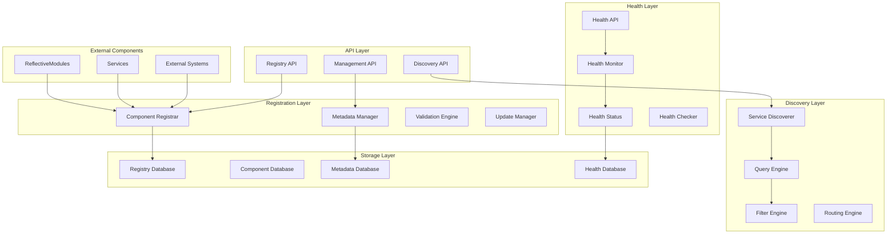
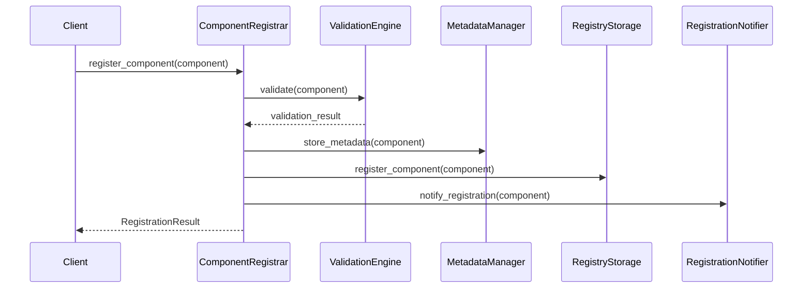
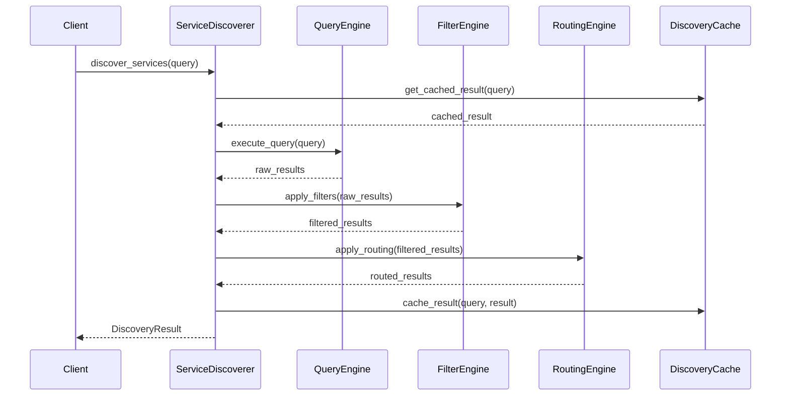
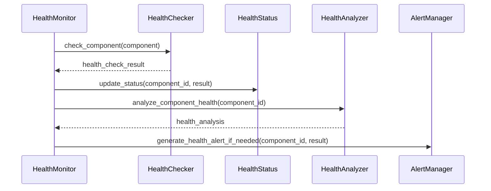

# Registry Management Design Specification

## Document Information
- **Version**: 1.0.0
- **Last Updated**: 2024-01-15
- **Status**: Active
- **RDI Compliance**: Requirements-Driven Implementation
- **Domain**: Domain Index System
- **Module**: Registry Management

## 1. Introduction

This document provides the detailed design specification for the Registry Management component of the Domain Index System. The Registry Management system is responsible for managing the discovery, registration, and lifecycle of all system components while providing dynamic service discovery and component management.

### 1.1 Design Objectives
- **Central Registry**: Serve as the central registry for all system components
- **Dynamic Discovery**: Enable dynamic component discovery and service location
- **Lifecycle Management**: Manage component registration, health, and deregistration
- **High Performance**: Support high-throughput registry operations
- **Scalable Architecture**: Scale to support large numbers of components

### 1.2 Architecture Overview
The Registry Management system follows a distributed architecture with clear separation of concerns:
- **Registration Layer**: Handles component registration and metadata management
- **Discovery Layer**: Provides component discovery and service location
- **Health Layer**: Manages component health status and monitoring
- **Storage Layer**: Stores registry data and metadata
- **API Layer**: Provides comprehensive registry APIs

## 2. System Architecture

### 2.1 High-Level Architecture



### 2.2 Component Architecture

#### 2.2.1 Registration Layer Components

**ComponentRegistrar**
- **Purpose**: Handle component registration and deregistration
- **Responsibilities**: 
  - Register new components with metadata
  - Deregister components when unavailable
  - Validate registration data
  - Manage registration lifecycle

**MetadataManager**
- **Purpose**: Manage component metadata and configuration
- **Responsibilities**:
  - Store and update component metadata
  - Validate metadata consistency
  - Support metadata versioning
  - Provide metadata queries

**ValidationEngine**
- **Purpose**: Validate component registration data
- **Responsibilities**:
  - Validate component metadata
  - Check dependency requirements
  - Verify endpoint accessibility
  - Ensure data consistency

**UpdateManager**
- **Purpose**: Handle component updates and changes
- **Responsibilities**:
  - Process component updates
  - Manage version transitions
  - Handle configuration changes
  - Coordinate update notifications

#### 2.2.2 Discovery Layer Components

**ServiceDiscoverer**
- **Purpose**: Discover and locate services
- **Responsibilities**:
  - Find services by type and capability
  - Resolve service endpoints
  - Support service routing
  - Handle service failover

**QueryEngine**
- **Purpose**: Execute complex registry queries
- **Responsibilities**:
  - Process discovery queries
  - Support filtering and sorting
  - Enable complex search operations
  - Optimize query performance

**FilterEngine**
- **Purpose**: Filter and refine discovery results
- **Responsibilities**:
  - Apply discovery filters
  - Support result ranking
  - Enable result pagination
  - Handle result caching

**RoutingEngine**
- **Purpose**: Route requests to appropriate services
- **Responsibilities**:
  - Implement load balancing
  - Handle service routing
  - Support failover routing
  - Manage routing policies

#### 2.2.3 Health Layer Components

**HealthMonitor**
- **Purpose**: Monitor component health status
- **Responsibilities**:
  - Track component health
  - Update health status
  - Monitor component availability
  - Handle health transitions

**HealthStatus**
- **Purpose**: Manage health status data
- **Responsibilities**:
  - Store health status information
  - Track health history
  - Provide health analytics
  - Support health queries

**HealthChecker**
- **Purpose**: Execute health checks on components
- **Responsibilities**:
  - Perform health check operations
  - Validate component functionality
  - Test endpoint accessibility
  - Report health check results

**HealthAnalyzer**
- **Purpose**: Analyze health patterns and trends
- **Responsibilities**:
  - Analyze health data
  - Identify health patterns
  - Predict component failures
  - Generate health insights

## 3. Detailed Component Design

### 3.1 ComponentRegistrar Component

```python
class ComponentRegistrar(ReflectiveModule):
    """Component registration component."""
    
    def __init__(self, config: RegistryConfig):
        self.config = config
        self.validator = ValidationEngine(config)
        self.metadata_manager = MetadataManager(config)
        self.storage = RegistryStorage(config)
        self.notifier = RegistrationNotifier(config)
    
    async def register_component(self, component: ComponentInfo) -> RegistrationResult:
        """Register a new component."""
        try:
            # Validate component data
            validation_result = await self.validator.validate(component)
            if not validation_result.is_valid:
                return RegistrationResult(
                    success=False,
                    error=f"Validation failed: {validation_result.errors}"
                )
            
            # Store component metadata
            await self.metadata_manager.store_metadata(component)
            
            # Register component in storage
            await self.storage.register_component(component)
            
            # Notify about registration
            await self.notifier.notify_registration(component)
            
            return RegistrationResult(
                success=True,
                component_id=component.id,
                registration_time=time.time()
            )
            
        except Exception as e:
            logger.error(f"Component registration failed: {e}")
            return RegistrationResult(success=False, error=str(e))
    
    async def deregister_component(self, component_id: str) -> DeregistrationResult:
        """Deregister a component."""
        try:
            # Get component info
            component = await self.storage.get_component(component_id)
            if not component:
                return DeregistrationResult(
                    success=False,
                    error="Component not found"
                )
            
            # Remove from storage
            await self.storage.deregister_component(component_id)
            
            # Clean up metadata
            await self.metadata_manager.remove_metadata(component_id)
            
            # Notify about deregistration
            await self.notifier.notify_deregistration(component)
            
            return DeregistrationResult(
                success=True,
                deregistration_time=time.time()
            )
            
        except Exception as e:
            logger.error(f"Component deregistration failed: {e}")
            return DeregistrationResult(success=False, error=str(e))
    
    def get_module_info(self) -> ModuleInfo:
        """Get module information for ReflectiveModule interface."""
        return ModuleInfo(
            name="ComponentRegistrar",
            version="1.0.0",
            description="Component registration and management",
            capabilities=["component_registration", "metadata_management", "validation"],
            dependencies=["ValidationEngine", "MetadataManager", "RegistryStorage"]
        )
```

### 3.2 ServiceDiscoverer Component

```python
class ServiceDiscoverer(ReflectiveModule):
    """Service discovery component."""
    
    def __init__(self, config: DiscoveryConfig):
        self.config = config
        self.query_engine = QueryEngine(config)
        self.filter_engine = FilterEngine(config)
        self.routing_engine = RoutingEngine(config)
        self.cache = DiscoveryCache(config)
    
    async def discover_services(self, query: DiscoveryQuery) -> DiscoveryResult:
        """Discover services based on query."""
        try:
            # Check cache first
            cached_result = await self.cache.get(query)
            if cached_result and not self._is_cache_expired(cached_result):
                return cached_result
            
            # Execute discovery query
            raw_results = await self.query_engine.execute_query(query)
            
            # Apply filters
            filtered_results = await self.filter_engine.apply_filters(raw_results, query.filters)
            
            # Apply routing
            routed_results = await self.routing_engine.apply_routing(filtered_results, query.routing)
            
            # Create discovery result
            result = DiscoveryResult(
                services=routed_results,
                total_count=len(routed_results),
                query_time=time.time() - query.start_time
            )
            
            # Cache result
            await self.cache.set(query, result)
            
            return result
            
        except Exception as e:
            logger.error(f"Service discovery failed: {e}")
            return DiscoveryResult(error=str(e))
    
    async def find_service(self, service_type: str, criteria: Dict[str, Any]) -> Optional[ServiceInfo]:
        """Find a specific service."""
        try:
            query = DiscoveryQuery(
                service_type=service_type,
                criteria=criteria,
                limit=1
            )
            
            result = await self.discover_services(query)
            return result.services[0] if result.services else None
            
        except Exception as e:
            logger.error(f"Service lookup failed: {e}")
            return None
    
    def get_capabilities(self) -> List[str]:
        """Get discovery capabilities."""
        return [
            "service_discovery",
            "service_lookup",
            "query_processing",
            "result_filtering",
            "service_routing"
        ]
```

### 3.3 HealthMonitor Component

```python
class HealthMonitor(ReflectiveModule):
    """Health monitoring component."""
    
    def __init__(self, config: HealthConfig):
        self.config = config
        self.health_checker = HealthChecker(config)
        self.health_status = HealthStatus(config)
        self.health_analyzer = HealthAnalyzer(config)
        self.alert_manager = HealthAlertManager(config)
    
    async def monitor_component_health(self, component_id: str) -> HealthResult:
        """Monitor health of a specific component."""
        try:
            # Get component info
            component = await self.get_component(component_id)
            if not component:
                return HealthResult(
                    component_id=component_id,
                    status=HealthStatus.UNKNOWN,
                    error="Component not found"
                )
            
            # Perform health check
            health_check_result = await self.health_checker.check_component(component)
            
            # Update health status
            await self.health_status.update_status(component_id, health_check_result)
            
            # Analyze health data
            analysis = await self.health_analyzer.analyze_component_health(component_id)
            
            # Generate alerts if needed
            if health_check_result.status != HealthStatus.HEALTHY:
                await self.alert_manager.generate_health_alert(component_id, health_check_result)
            
            return HealthResult(
                component_id=component_id,
                status=health_check_result.status,
                details=health_check_result.details,
                analysis=analysis
            )
            
        except Exception as e:
            logger.error(f"Health monitoring failed for {component_id}: {e}")
            return HealthResult(
                component_id=component_id,
                status=HealthStatus.ERROR,
                error=str(e)
            )
    
    async def get_component_health(self, component_id: str) -> Optional[HealthInfo]:
        """Get current health status of a component."""
        try:
            return await self.health_status.get_status(component_id)
        except Exception as e:
            logger.error(f"Failed to get health status for {component_id}: {e}")
            return None
    
    def get_health_status(self) -> HealthStatus:
        """Get health status for ReflectiveModule interface."""
        return HealthStatus(
            status="healthy",
            metrics={
                "components_monitored": self.health_status.get_monitored_count(),
                "health_checks_performed": self.health_checker.get_check_count(),
                "active_alerts": self.alert_manager.get_active_alert_count()
            }
        )
```

## 4. Data Flow Architecture

### 4.1 Component Registration Flow



### 4.2 Service Discovery Flow



### 4.3 Health Monitoring Flow



## 5. Integration Architecture

### 5.1 ReflectiveModule Integration

```python
class RegistryManagementReflectiveModule(ReflectiveModule):
    """ReflectiveModule implementation for Registry Management."""
    
    def __init__(self, config: RegistryConfig):
        self.config = config
        self.component_registrar = ComponentRegistrar(config)
        self.service_discoverer = ServiceDiscoverer(config)
        self.health_monitor = HealthMonitor(config)
        self.registry_api = RegistryAPI(config)
    
    def get_module_info(self) -> ModuleInfo:
        """Get module information."""
        return ModuleInfo(
            name="RegistryManagement",
            version="1.0.0",
            description="Central registry for component management and service discovery",
            capabilities=[
                "component_registration",
                "service_discovery",
                "health_monitoring",
                "metadata_management",
                "query_processing"
            ],
            dependencies=[
                "ComponentRegistrar",
                "ServiceDiscoverer",
                "HealthMonitor",
                "RegistryAPI",
                "ReflectiveModuleSystem"
            ]
        )
    
    def get_health_status(self) -> HealthStatus:
        """Get health status."""
        return HealthStatus(
            status="healthy",
            metrics={
                "registered_components": self.component_registrar.get_registered_count(),
                "discovery_queries": self.service_discoverer.get_query_count(),
                "health_checks": self.health_monitor.get_health_check_count(),
                "api_requests": self.registry_api.get_request_count()
            }
        )
    
    def get_capabilities(self) -> List[str]:
        """Get module capabilities."""
        return [
            "component_registration",
            "component_deregistration",
            "service_discovery",
            "service_lookup",
            "health_monitoring",
            "metadata_management",
            "query_processing",
            "routing_management"
        ]
    
    def get_dependencies(self) -> List[str]:
        """Get module dependencies."""
        return [
            "ReflectiveModuleSystem",
            "ConfigurationManagement",
            "LoggingSystem",
            "SecuritySystem",
            "HealthMonitoring",
            "DatabaseSystem"
        ]
    
    def get_configuration(self) -> Dict[str, Any]:
        """Get module configuration."""
        return {
            "max_components": self.config.max_components,
            "discovery_cache_ttl": self.config.discovery_cache_ttl,
            "health_check_interval": self.config.health_check_interval,
            "query_timeout": self.config.query_timeout,
            "enable_caching": self.config.enable_caching
        }
    
    def get_metrics(self) -> Dict[str, Any]:
        """Get module metrics."""
        return {
            "registration_rate": self.component_registrar.get_registration_rate(),
            "discovery_success_rate": self.service_discoverer.get_success_rate(),
            "health_check_success_rate": self.health_monitor.get_success_rate(),
            "average_query_time": self.service_discoverer.get_average_query_time()
        }
```

## 6. Testing Architecture

### 6.1 Unit Testing

```python
class RegistryManagementUnitTests:
    """Unit tests for Registry Management components."""
    
    def test_component_registration(self):
        """Test component registration functionality."""
        registrar = ComponentRegistrar(TestConfig())
        
        # Test valid component registration
        component = ComponentInfo(
            id="test-component",
            type="service",
            endpoint="http://localhost:8080",
            capabilities=["test"]
        )
        result = registrar.register_component(component)
        assert result.success
        assert result.component_id == "test-component"
        
        # Test invalid component registration
        invalid_component = ComponentInfo(id="", type="", endpoint="")
        result = registrar.register_component(invalid_component)
        assert not result.success
        assert "Validation failed" in result.error
    
    def test_service_discovery(self):
        """Test service discovery functionality."""
        discoverer = ServiceDiscoverer(TestConfig())
        
        # Test service discovery
        query = DiscoveryQuery(service_type="test-service")
        result = discoverer.discover_services(query)
        assert result.success
        assert len(result.services) >= 0
        
        # Test service lookup
        service = discoverer.find_service("test-service", {"version": "1.0"})
        assert service is None or isinstance(service, ServiceInfo)
    
    def test_health_monitoring(self):
        """Test health monitoring functionality."""
        monitor = HealthMonitor(TestConfig())
        
        # Test component health monitoring
        result = monitor.monitor_component_health("test-component")
        assert result.component_id == "test-component"
        assert result.status in [HealthStatus.HEALTHY, HealthStatus.UNHEALTHY, HealthStatus.UNKNOWN]
```

### 6.2 Integration Testing

```python
class RegistryManagementIntegrationTests:
    """Integration tests for Registry Management."""
    
    async def test_end_to_end_registry_flow(self):
        """Test complete registry management flow."""
        registry = RegistryManagement(TestConfig())
        
        # Test component registration
        component = ComponentInfo(
            id="integration-test-component",
            type="service",
            endpoint="http://localhost:8080"
        )
        registration_result = await registry.register_component(component)
        assert registration_result.success
        
        # Test service discovery
        discovery_result = await registry.discover_services("service")
        assert discovery_result.success
        assert len(discovery_result.services) > 0
        
        # Test health monitoring
        health_result = await registry.monitor_component_health("integration-test-component")
        assert health_result.component_id == "integration-test-component"
        
        # Test component deregistration
        deregistration_result = await registry.deregister_component("integration-test-component")
        assert deregistration_result.success
    
    async def test_concurrent_operations(self):
        """Test concurrent registry operations."""
        registry = RegistryManagement(TestConfig())
        
        # Test concurrent registrations
        components = [
            ComponentInfo(id=f"concurrent-{i}", type="service", endpoint=f"http://localhost:808{i}")
            for i in range(10)
        ]
        
        tasks = [registry.register_component(comp) for comp in components]
        results = await asyncio.gather(*tasks)
        
        # Verify all registrations succeeded
        assert all(result.success for result in results)
        
        # Test concurrent discovery
        discovery_tasks = [registry.discover_services("service") for _ in range(10)]
        discovery_results = await asyncio.gather(*discovery_tasks)
        
        # Verify all discoveries succeeded
        assert all(result.success for result in discovery_results)
```

## 7. Deployment Architecture

### 7.1 Container Deployment

```dockerfile
# Dockerfile for Registry Management
FROM python:3.9-slim

WORKDIR /app

# Install dependencies
COPY requirements.txt .
RUN pip install -r requirements.txt

# Copy application code
COPY src/ ./src/
COPY config/ ./config/

# Set environment variables
ENV PYTHONPATH=/app/src
ENV REGISTRY_CONFIG=/app/config/registry.yaml

# Expose port
EXPOSE 8080

# Health check
HEALTHCHECK --interval=30s --timeout=10s --start-period=5s --retries=3 \
    CMD curl -f http://localhost:8080/health || exit 1

# Start application
CMD ["python", "-m", "src.registry_management.main"]
```

### 7.2 Kubernetes Deployment

```yaml
# kubernetes-deployment.yaml
apiVersion: apps/v1
kind: Deployment
metadata:
  name: registry-management
spec:
  replicas: 3
  selector:
    matchLabels:
      app: registry-management
  template:
    metadata:
      labels:
        app: registry-management
    spec:
      containers:
      - name: registry-management
        image: registry-management:latest
        ports:
        - containerPort: 8080
        env:
        - name: REGISTRY_CONFIG
          value: "/app/config/registry.yaml"
        resources:
          requests:
            memory: "4Gi"
            cpu: "1000m"
          limits:
            memory: "8Gi"
            cpu: "2000m"
        livenessProbe:
          httpGet:
            path: /health
            port: 8080
          initialDelaySeconds: 30
          periodSeconds: 10
        readinessProbe:
          httpGet:
            path: /ready
            port: 8080
          initialDelaySeconds: 5
          periodSeconds: 5
```

---

**Document Status**: Complete
**Next Review**: 2024-01-22
**Approved By**: System Architect
**Version History**: 
- v1.0.0: Initial design specification
