# Repository Refactoring Design

## 🎯 **Overview**

This document defines the design for the Repository Refactoring capability within the RM-DDD framework. This capability provides systematic refactoring of entire repositories to achieve RM-DDD compliance, extending the proven module-level approach to repository-wide transformation.

## 🏗️ **Architecture Overview**

### **System Components**

```mermaid
graph TB
    A[Repository Refactoring Orchestrator] --> B[Analysis Engine]
    A --> C[Planning Engine]
    A --> D[Execution Engine]
    A --> E[Validation Engine]
    A --> F[Reporting Engine]
    
    B --> B1[File Discovery]
    B --> B2[Size Analysis]
    B --> B3[Domain Classification]
    B --> B4[Complexity Assessment]
    
    C --> C1[Plan Generation]
    C --> C2[Dependency Mapping]
    C --> C3[Interface Planning]
    C --> C4[Risk Assessment]
    
    D --> D1[Backup Management]
    D --> D2[File Operations]
    D --> D3[Import Updates]
    D --> D4[Progress Tracking]
    
    E --> E1[Syntax Validation]
    E --> E2[Import Resolution]
    E --> E3[RM-DDD Compliance]
    E --> E4[Functionality Testing]
    
    F --> F1[Analysis Reports]
    F --> F2[Execution Reports]
    F --> F3[Validation Reports]
    F --> F4[Summary Reports]
```



## 🔧 **Component Design**

### **1. Repository Refactoring Orchestrator**

#### **Purpose**
Central coordinator that manages the complete refactoring process from analysis through validation.

#### **Responsibilities**
- Orchestrate all refactoring phases
- Manage error handling and recovery
- Coordinate component interactions
- Generate comprehensive reports
- Provide user interface integration

#### **Key Methods**
```python
class RepositoryRefactoringOrchestrator:
    def run_complete_refactoring(self, dry_run: bool = False) -> Dict[str, Any]
    def run_analysis_phase(self) -> Dict[str, Any]
    def run_planning_phase(self) -> Dict[str, Any]
    def run_execution_phase(self, dry_run: bool = False) -> Dict[str, Any]
    def run_validation_phase(self) -> Dict[str, Any]
    def run_reporting_phase(self) -> Dict[str, Any]
```

### **2. Analysis Engine**

#### **Purpose**
Analyzes repository structure, identifies non-compliant files, and generates comprehensive analysis reports.

#### **Responsibilities**
- Discover all Python files in repository
- Analyze file size, complexity, and structure
- Classify files by domain and functionality
- Calculate refactoring priority scores
- Generate analysis reports

#### **Key Classes**
```python
class RepositoryRefactoringEngine:
    def analyze_repository(self) -> Dict[str, Any]
    def _analyze_file(self, file_path: str) -> Optional[FileAnalysis]
    def _classify_domain(self, file_path: str, classes: List[str], functions: List[str]) -> str
    def _calculate_priority(self, line_count: int, class_count: int, function_count: int) -> int
    def generate_refactoring_plans(self) -> List[RefactoringPlan]

@dataclass
class FileAnalysis:
    file_path: str
    line_count: int
    class_count: int
    function_count: int
    import_count: int
    is_large: bool
    classes: List[str]
    functions: List[str]
    imports: List[str]
    dependencies: List[str]
    domain: Optional[str] = None
    refactoring_priority: int = 0
    suggested_modules: List[str] = None
```

### **3. Planning Engine**

#### **Purpose**
Generates detailed refactoring plans for non-compliant files, ensuring optimal module boundaries and dependency management.

#### **Responsibilities**
- Generate refactoring plans for large files
- Group related classes and functions by domain
- Plan optimal module boundaries
- Map import dependencies
- Calculate effort and risk estimates

#### **Key Classes**
```python
@dataclass
class RefactoringPlan:
    source_file: str
    target_modules: List[str]
    class_assignments: Dict[str, str]  # class_name -> target_module
    function_assignments: Dict[str, str]  # function_name -> target_module
    dependencies: List[str]
    estimated_effort: int  # 1-5 scale
    risk_level: str  # low, medium, high

class RefactoringPlanner:
    def create_refactoring_plan(self, file_analysis: FileAnalysis) -> Optional[RefactoringPlan]
    def _group_classes_by_functionality(self, classes: List[str]) -> Dict[str, List[str]]
    def _group_functions_by_functionality(self, functions: List[str]) -> Dict[str, List[str]]
    def _calculate_effort(self, file_analysis: FileAnalysis) -> int
    def _calculate_risk(self, file_analysis: FileAnalysis) -> str
```

### **4. Execution Engine**

#### **Purpose**
Safely executes refactoring plans with backup creation, rollback support, and progress tracking.

#### **Responsibilities**
- Create backups before modifications
- Split large files into compliant modules
- Update import statements
- Maintain functionality preservation
- Support rollback on failure

#### **Key Classes**
```python
class RefactoringExecutor:
    def execute_refactoring_plan(self, plan: RefactoringPlan, dry_run: bool = False) -> RefactoringResult
    def _create_backup(self, file_path: str)
    def _extract_components(self, tree: ast.AST, class_assignments: Dict[str, str], function_assignments: Dict[str, str]) -> Dict[str, Dict[str, Any]]
    def _create_target_module(self, source_file: str, module_name: str, components: Dict[str, Any])
    def _update_source_file(self, source_file: str, components: Dict[str, Dict[str, Any]])
    def _rollback_refactoring(self, source_file: str)

@dataclass
class RefactoringResult:
    source_file: str
    target_modules: List[str]
    success: bool
    errors: List[str]
    warnings: List[str]
    lines_moved: int
    classes_moved: int
    functions_moved: int
```

### **5. Validation Engine**

#### **Purpose**
Validates refactored modules for syntax, imports, RM-DDD compliance, and functionality preservation.

#### **Responsibilities**
- Validate Python syntax
- Check import resolution
- Verify RM-DDD compliance
- Test functionality preservation
- Assess performance impact

#### **Key Classes**
```python
class RefactoringValidator:
    def validate_module(self, module_path: str) -> ValidationResult
    def _validate_syntax(self, content: str, result: ValidationResult) -> bool
    def _validate_imports(self, module_path: str, result: ValidationResult) -> bool
    def _validate_rm_ddd_compliance(self, module_path: str, content: str, result: ValidationResult) -> bool
    def _validate_functionality(self, module_path: str, result: ValidationResult) -> bool
    def _assess_performance_impact(self, module_path: str, result: ValidationResult) -> str

@dataclass
class ValidationResult:
    module_path: str
    syntax_valid: bool
    imports_resolved: bool
    rm_ddd_compliant: bool
    functionality_preserved: bool
    performance_impact: str  # low, medium, high
    errors: List[str]
    warnings: List[str]
    metrics: Dict[str, Any]
```

### **6. Reporting Engine**

#### **Purpose**
Generates comprehensive reports for analysis, execution, validation, and overall refactoring results.

#### **Responsibilities**
- Generate analysis reports
- Track execution results
- Report validation outcomes
- Create summary reports
- Export data in multiple formats

#### **Key Methods**
```python
class ReportingEngine:
    def generate_analysis_report(self, analysis_results: List[FileAnalysis]) -> Dict[str, Any]
    def generate_execution_report(self, execution_results: List[RefactoringResult]) -> Dict[str, Any]
    def generate_validation_report(self, validation_results: List[ValidationResult]) -> Dict[str, Any]
    def generate_summary_report(self, all_results: Dict[str, Any]) -> Dict[str, Any]
    def export_reports(self, reports: Dict[str, Any], output_dir: str)
```

## 🔄 **Process Flow**

### **Phase 1: Analysis**
1. **File Discovery**: Scan repository for Python files
2. **Size Analysis**: Identify files exceeding 300 lines
3. **Domain Classification**: Group files by functionality
4. **Complexity Assessment**: Calculate refactoring priority
5. **Report Generation**: Create analysis report

### **Phase 2: Planning**
1. **Plan Generation**: Create refactoring plans for large files
2. **Dependency Mapping**: Map import relationships
3. **Interface Planning**: Ensure ReflectiveModule consistency
4. **Risk Assessment**: Calculate effort and risk levels
5. **Plan Export**: Export plans for execution

### **Phase 3: Execution**
1. **Backup Creation**: Create safety backups
2. **File Splitting**: Split large files into modules
3. **Import Updates**: Update import statements
4. **Progress Tracking**: Monitor execution progress
5. **Error Handling**: Handle failures and rollbacks

### **Phase 4: Validation**
1. **Syntax Validation**: Check Python syntax
2. **Import Resolution**: Verify import statements
3. **RM-DDD Compliance**: Check interface implementation
4. **Functionality Testing**: Verify behavior preservation
5. **Performance Assessment**: Measure impact

### **Phase 5: Reporting**
1. **Result Compilation**: Gather all results
2. **Report Generation**: Create comprehensive reports
3. **Metrics Calculation**: Calculate success metrics
4. **Documentation**: Generate usage guides
5. **Archive**: Store reports for future reference

## 🛡️ **Safety Mechanisms**

### **Backup System**
- **Automatic Backups**: Created before any modifications
- **Backup Validation**: Verify backup integrity
- **Backup Management**: Organize and clean up backups
- **Rollback Support**: Restore from backups on failure

### **Validation Pipeline**
- **Pre-execution Validation**: Check prerequisites
- **During-execution Validation**: Validate each step
- **Post-execution Validation**: Verify results
- **Continuous Validation**: Ongoing compliance checking

### **Error Handling**
- **Graceful Degradation**: Handle errors without system failure
- **Detailed Logging**: Log all operations and errors
- **Recovery Procedures**: Automatic and manual recovery
- **User Notification**: Inform users of issues and solutions

## 🔧 **Configuration Management**

### **Domain Patterns**
```python
DOMAIN_PATTERNS = {
    "core": ["base", "core", "foundation", "common", "utils"],
    "models": ["model", "data", "entity", "schema", "dto"],
    "services": ["service", "manager", "handler", "processor", "engine"],
    "api": ["api", "client", "endpoint", "controller", "route"],
    "validation": ["validator", "validation", "checker", "verifier"],
    "testing": ["test", "spec", "mock", "fixture", "stub"],
    "integration": ["integration", "adapter", "bridge", "connector"],
    "monitoring": ["monitor", "metrics", "logging", "health", "status"],
    "configuration": ["config", "settings", "options", "preferences"],
    "storage": ["storage", "repository", "dao", "persistence", "database"]
}
```

### **Refactoring Rules**
```python
REFACTORING_RULES = {
    "max_file_size": 300,
    "target_file_size": 200,
    "min_module_size": 50,
    "max_classes_per_module": 10,
    "max_functions_per_module": 25,
    "required_interface": "ReflectiveModule",
    "backup_retention_days": 30
}
```

## 📊 **Metrics and Monitoring**

### **Analysis Metrics**
- **Total Files**: Count of all Python files
- **Large Files**: Count of files exceeding size limits
- **Compliance Rate**: Percentage of compliant files
- **Average File Size**: Mean lines per file
- **Domain Distribution**: Files per domain category

### **Execution Metrics**
- **Plans Executed**: Number of refactoring plans executed
- **Success Rate**: Percentage of successful executions
- **Files Modified**: Number of files changed
- **Lines Moved**: Total lines moved between files
- **Execution Time**: Time taken for execution

### **Validation Metrics**
- **Modules Validated**: Number of modules checked
- **Syntax Errors**: Count of syntax issues found
- **Import Errors**: Count of import resolution failures
- **Compliance Violations**: Count of RM-DDD violations
- **Functionality Issues**: Count of behavior changes

## 🔌 **Integration Points**

### **Makefile Integration**
```makefile
refactor-analyze: ## Analyze repository for refactoring opportunities
refactor-plan: ## Generate refactoring plans
refactor-dry-run: ## Execute refactoring in dry-run mode
refactor-execute: ## Execute refactoring (WARNING: modifies files)
refactor-validate: ## Validate refactored modules
refactor-orchestrate: ## Run complete refactoring orchestration (dry-run)
refactor-orchestrate-execute: ## Run complete refactoring orchestration
refactor-status: ## Show refactoring status and reports
```

### **CLI Integration**
```bash
# Repository analysis
uv run python scripts/repository_refactoring_engine.py

# Refactoring execution
uv run python scripts/refactoring_executor.py --plans refactoring_plans.json

# Validation
uv run python scripts/refactoring_validator.py --execution-report refactoring_execution_report.json

# Complete orchestration
uv run python scripts/repository_refactoring_orchestrator.py --dry-run
```

### **CI/CD Integration**
```yaml
# GitHub Actions example
- name: Repository Refactoring
  run: |
    make refactor-analyze
    make refactor-dry-run
    # Only execute if dry-run passes
    if [ $? -eq 0 ]; then
      make refactor-execute
      make refactor-validate
    fi
```

## 🎯 **Quality Assurance**

### **Testing Strategy**
- **Unit Tests**: Test individual components
- **Integration Tests**: Test component interactions
- **End-to-End Tests**: Test complete refactoring process
- **Performance Tests**: Test with large repositories
- **Regression Tests**: Ensure no functionality loss

### **Code Quality**
- **Linting**: Ensure code quality standards
- **Type Checking**: Verify type annotations
- **Documentation**: Comprehensive docstrings and comments
- **Error Handling**: Robust error management
- **Logging**: Detailed operation logging

### **Validation Criteria**
- **Syntax Validation**: All files must parse correctly
- **Import Resolution**: All imports must resolve
- **RM-DDD Compliance**: All modules must implement ReflectiveModule
- **Functionality Preservation**: No behavior changes
- **Performance Impact**: Minimal performance degradation

## 📚 **Related Designs**

- **RM-DDD Core Design**: `docs/design/rm_ddd/`
- **ReflectiveModule Design**: `docs/design/rm_ddd/reflective_module_design.md`
- **Health Monitoring Design**: `docs/design/rm_ddd/health_monitoring_design.md`
- **Module Registry Design**: `docs/design/rm_ddd/module_registry_design.md`

---

**This design provides a comprehensive, systematic approach to repository-wide refactoring that ensures RM-DDD compliance while maintaining safety, functionality, and quality.**


