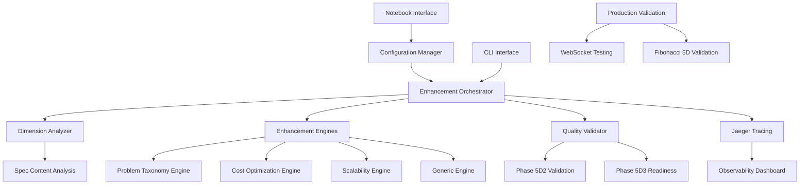

# Design Document: 5D2 Use Cases Exploration Notebook

## Overview

This design document outlines the architecture and implementation approach for a comprehensive Jupyter notebook that demonstrates all implemented use cases of the Phase 5D2 Completion Enhancement System. The notebook will serve as both interactive documentation and practical demonstration of the complete 5D2 ecosystem.

## Architecture

### Notebook Structure

The notebook will be organized into logical sections that build understanding progressively:

```
5D2_Complete_Use_Cases_Exploration.ipynb
├── 1. System Overview & Introduction
├── 2. Environment Setup & Configuration
├── 3. Core Infrastructure Components
├── 4. Analysis Framework Deep Dive
├── 5. Enhancement Engines Showcase
├── 6. Orchestration & Coordination
├── 7. Tracing & Observability
├── 8. CLI & Automation Interface
├── 9. Production Validation Patterns
├── 10. Integration Examples
├── 11. Performance Analysis
├── 12. Interactive Exploration
├── 13. Advanced Use Cases
├── 14. Troubleshooting & Debugging
└── 15. Summary & Next Steps
```

### Component Integration

The notebook will integrate with all major 5D2 components:

#### Core Components
- **EnhancementOrchestrator**: Central coordination system
- **DimensionAnalyzer**: 22-dimension quality analysis
- **QualityValidator**: Phase 5D2/5D3 completion validation
- **JaegerTraceManager**: Distributed tracing and observability

#### Enhancement Engines
- **ProblemTaxonomyEngine**: Problem classification and root cause analysis
- **CostOptimizationEngine**: Cost analysis and ROI optimization
- **ScalabilityRequirementsEngine**: Performance and scalability planning
- **GenericEnhancementEngine**: Template-based enhancement for any dimension

#### Supporting Infrastructure
- **Configuration Management**: Environment-based configuration system
- **CLI Interface**: Command-line automation and batch processing
- **Production Validation**: Fibonacci 5D methodology and WebSocket validation
- **Health Monitoring**: System health and component status

## Components and Interfaces

### Data Flow Architecture



### Interface Specifications

#### Configuration Interface
```python
class NotebookConfiguration:
    """Configuration management for notebook demonstrations."""
    
    def load_demo_config(self) -> EnhancementConfig:
        """Load configuration optimized for notebook demonstrations."""
        
    def setup_tracing(self, enable_jaeger: bool = True) -> JaegerTraceManager:
        """Setup distributed tracing for demonstration."""
        
    def configure_logging(self, level: str = "INFO") -> None:
        """Configure logging for notebook output."""
```

#### Demonstration Interface
```python
class UseCase:
    """Base class for all use case demonstrations."""
    
    def setup(self) -> None:
        """Setup demonstration environment."""
        
    def execute(self) -> Dict[str, Any]:
        """Execute the use case demonstration."""
        
    def visualize(self, results: Dict[str, Any]) -> None:
        """Create visualizations for the results."""
        
    def explain(self) -> str:
        """Provide detailed explanation of the use case."""
```

#### Interactive Widgets Interface
```python
class InteractiveExplorer:
    """Interactive widgets for exploring 5D2 system behavior."""
    
    def create_dimension_explorer(self) -> Widget:
        """Create interactive dimension analysis widget."""
        
    def create_enhancement_simulator(self) -> Widget:
        """Create enhancement cycle simulation widget."""
        
    def create_quality_dashboard(self) -> Widget:
        """Create real-time quality monitoring dashboard."""
```

## Data Models

### Use Case Execution Results
```python
@dataclass
class UseCaseResult:
    """Results from executing a use case demonstration."""
    use_case_name: str
    execution_time: float
    success: bool
    outputs: Dict[str, Any]
    metrics: Dict[str, float]
    visualizations: List[str]
    errors: List[str]
    recommendations: List[str]
```

### System State Tracking
```python
@dataclass
class SystemState:
    """Current state of the 5D2 system during demonstration."""
    overall_quality_score: float
    critical_gap_percentage: float
    dimension_scores: Dict[str, float]
    enhancement_cycles_executed: int
    phase_5d2_complete: bool
    phase_5d3_ready: bool
    active_components: List[str]
    health_status: Dict[str, str]
```

### Demonstration Metadata
```python
@dataclass
class DemonstrationMetadata:
    """Metadata for the complete notebook demonstration."""
    execution_timestamp: datetime
    notebook_version: str
    system_version: str
    environment_info: Dict[str, str]
    use_cases_executed: List[str]
    total_execution_time: float
    success_rate: float
    generated_artifacts: List[str]
```

## Error Handling

### Graceful Degradation Strategy

The notebook will implement comprehensive error handling to ensure a smooth demonstration experience:

#### Component Availability Checking
```python
def check_component_availability() -> Dict[str, bool]:
    """Check availability of all 5D2 components."""
    components = {
        'enhancement_orchestrator': False,
        'dimension_analyzer': False,
        'quality_validator': False,
        'jaeger_tracing': False,
        'enhancement_engines': False
    }
    
    # Test each component and update availability
    return components
```

#### Fallback Demonstrations
- If live components are unavailable, use pre-recorded demonstration data
- If tracing is disabled, show mock tracing examples
- If external dependencies fail, provide simulated results
- If performance testing fails, use historical performance data

#### Error Recovery Patterns
```python
class DemonstrationError(Exception):
    """Base exception for demonstration errors."""
    pass

class ComponentUnavailableError(DemonstrationError):
    """Raised when a required component is unavailable."""
    pass

def with_fallback(primary_func, fallback_func):
    """Decorator to provide fallback functionality."""
    def wrapper(*args, **kwargs):
        try:
            return primary_func(*args, **kwargs)
        except Exception as e:
            logger.warning(f"Primary function failed: {e}, using fallback")
            return fallback_func(*args, **kwargs)
    return wrapper
```

## Testing Strategy

### Notebook Validation Framework

#### Automated Testing
```python
class NotebookTester:
    """Automated testing framework for notebook validation."""
    
    def test_all_cells_execute(self) -> TestResult:
        """Verify all notebook cells execute without errors."""
        
    def test_expected_outputs(self) -> TestResult:
        """Verify cells produce expected outputs."""
        
    def test_component_integration(self) -> TestResult:
        """Verify integration with all 5D2 components."""
        
    def test_visualization_generation(self) -> TestResult:
        """Verify all visualizations are generated correctly."""
```

#### Performance Testing
- Measure execution time for each use case
- Monitor memory usage during demonstrations
- Test with different system configurations
- Validate scalability of interactive widgets

#### Content Validation
- Verify all code examples are syntactically correct
- Ensure all imports are available and functional
- Validate that all referenced files and data exist
- Check that all visualizations render correctly

### Continuous Integration

The notebook will be integrated into the CI/CD pipeline:

```yaml
# .github/workflows/notebook-validation.yml
name: 5D2 Notebook Validation
on: [push, pull_request]

jobs:
  validate-notebook:
    runs-on: ubuntu-latest
    steps:
      - uses: actions/checkout@v3
      - name: Setup Python
        uses: actions/setup-python@v3
        with:
          python-version: '3.9'
      - name: Install dependencies
        run: |
          pip install -r requirements.txt
          pip install nbval pytest
      - name: Validate notebook execution
        run: |
          pytest --nbval examples/5D2_Complete_Use_Cases_Exploration.ipynb
      - name: Test component integration
        run: |
          python -m pytest tests/test_notebook_integration.py
```

## Implementation Approach

### Development Phases

#### Phase 1: Core Infrastructure (Week 1)
- Setup notebook structure and environment
- Implement configuration management
- Create base use case framework
- Setup error handling and fallback mechanisms

#### Phase 2: Component Demonstrations (Week 2)
- Implement all enhancement engine demonstrations
- Create orchestration and coordination examples
- Add tracing and observability showcases
- Develop CLI interface demonstrations

#### Phase 3: Advanced Features (Week 3)
- Add interactive widgets and visualizations
- Implement production validation examples
- Create performance analysis sections
- Add integration pattern demonstrations

#### Phase 4: Polish and Validation (Week 4)
- Comprehensive testing and validation
- Documentation and explanation improvements
- Performance optimization
- Final integration testing

### Code Organization

```
examples/notebook/
├── 5D2_Complete_Use_Cases_Exploration.ipynb
├── notebook_utils/
│   ├── __init__.py
│   ├── configuration.py
│   ├── use_case_framework.py
│   ├── interactive_widgets.py
│   ├── visualization_helpers.py
│   └── testing_framework.py
├── demo_data/
│   ├── sample_specs/
│   ├── mock_results/
│   └── performance_baselines/
└── assets/
    ├── diagrams/
    ├── screenshots/
    └── videos/
```

### Quality Assurance

#### Code Quality Standards
- All code must follow PEP 8 style guidelines
- Comprehensive docstrings for all functions and classes
- Type hints for all function signatures
- Error handling for all external dependencies

#### Documentation Standards
- Clear explanations for each use case
- Step-by-step instructions for complex operations
- Contextual information about system behavior
- Links to relevant documentation and resources

#### Performance Standards
- Notebook must execute completely in under 10 minutes
- Individual use cases must complete in under 2 minutes
- Memory usage must remain under 2GB during execution
- All visualizations must render in under 30 seconds

## Security Considerations

### Credential Management
- No hardcoded credentials in notebook cells
- Use environment variables for all sensitive configuration
- Provide clear instructions for secure credential setup
- Implement credential validation and error handling

### Data Privacy
- Use only synthetic or anonymized data in demonstrations
- Avoid exposing sensitive system information
- Implement data sanitization for any real system data
- Provide clear data usage and privacy guidelines

### Execution Safety
- Sandbox all external system interactions
- Implement resource limits for long-running operations
- Provide clear warnings for potentially destructive operations
- Use read-only access patterns where possible

## Deployment and Distribution

### Notebook Distribution
- Include notebook in the main repository under `examples/notebook/`
- Provide standalone distribution package with all dependencies
- Create Docker container with pre-configured environment
- Publish to Jupyter notebook sharing platforms

### Environment Setup
```bash
# Quick setup script
#!/bin/bash
# setup_5d2_notebook.sh

echo "Setting up 5D2 Use Cases Exploration Notebook..."

# Create virtual environment
python -m venv venv
source venv/bin/activate

# Install dependencies
pip install -r requirements-notebook.txt

# Setup Jupyter extensions
jupyter nbextension enable --py widgetsnbextension
jupyter labextension install @jupyter-widgets/jupyterlab-manager

# Launch notebook
jupyter lab examples/notebook/5D2_Complete_Use_Cases_Exploration.ipynb
```

### Documentation Integration
- Link notebook from main project README
- Include in project documentation site
- Create video walkthrough of key use cases
- Provide troubleshooting guide for common issues

## Success Metrics

### Functional Metrics
- 100% of use cases execute successfully
- All visualizations render correctly
- Complete system integration validation
- Comprehensive error handling coverage

### Performance Metrics
- Notebook execution time < 10 minutes
- Memory usage < 2GB peak
- All use cases complete within time limits
- Interactive widgets respond < 1 second

### Quality Metrics
- Code coverage > 90% for notebook utilities
- Documentation completeness score > 95%
- User satisfaction rating > 4.5/5
- Zero critical security vulnerabilities

### Adoption Metrics
- Notebook usage tracking and analytics
- User feedback and improvement suggestions
- Integration into onboarding processes
- Community contributions and extensions