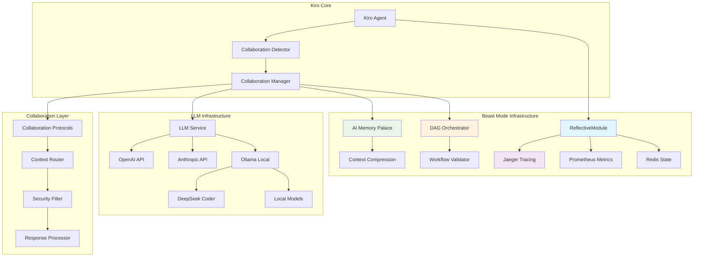
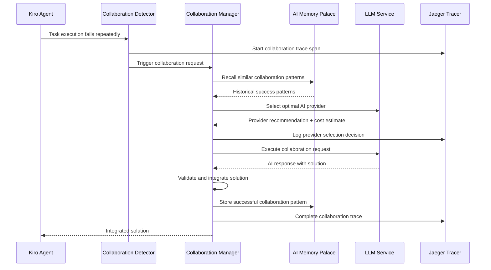

# AI Collaboration System Design

## Overview

The AI Collaboration System enables systematic AI-to-AI collaboration by extending the existing Beast Mode framework. The system detects when Kiro encounters complex problems, intelligently escalates to specialized AI systems, and integrates solutions seamlessly while maintaining full observability and security.

The design leverages existing Beast Mode infrastructure:
- **ReflectiveModule Pattern** for automatic observability and state management
- **Jaeger Tracing** (localhost:16686) for collaboration workflow visibility
- **AI Memory Palace** for persistent collaboration context and learning
- **DAG Orchestration** for mathematically validated collaboration workflows
- **LLM Service** with provider selection policies for optimal AI routing
- **Ollama Infrastructure** (localhost:11434) for cost-effective local AI collaboration

## Architecture

### High-Level Architecture



### Component Interaction Flow



## Components and Interfaces

### 1. Collaboration Detector

**Purpose**: Detects when Kiro is stuck and needs AI assistance

```python
from src.rm_ddd.core.unified_reflective_module import ReflectiveModule
from dataclasses import dataclass
from typing import List, Optional
import time

@dataclass
class StuckPattern:
    task_id: str
    failure_count: int
    error_types: List[str]
    time_spent: float
    last_attempt: float

class CollaborationDetector(ReflectiveModule):
    """Detects when Kiro needs AI collaboration assistance"""
    
    def __init__(self):
        super().__init__()
        self.failure_threshold = 3
        self.timeout_threshold = 300  # 5 minutes
        self.stuck_patterns: Dict[str, StuckPattern] = {}
    
    def record_failure(self, task_id: str, error_type: str) -> bool:
        """Record task failure and check if collaboration needed"""
        with self.trace_operation("record_failure"):
            pattern = self.stuck_patterns.get(task_id, StuckPattern(
                task_id=task_id, failure_count=0, error_types=[], 
                time_spent=0, last_attempt=time.time()
            ))
            
            pattern.failure_count += 1
            pattern.error_types.append(error_type)
            pattern.time_spent += time.time() - pattern.last_attempt
            pattern.last_attempt = time.time()
            
            self.stuck_patterns[task_id] = pattern
            
            needs_collaboration = (
                pattern.failure_count >= self.failure_threshold or
                pattern.time_spent >= self.timeout_threshold
            )
            
            if needs_collaboration:
                self.log_info(f"Collaboration needed for task {task_id}", 
                             failure_count=pattern.failure_count,
                             time_spent=pattern.time_spent)
                self.record_metric("collaboration_triggers", 1, 
                                 {"reason": "stuck_pattern", "task_id": task_id})
            
            return needs_collaboration
    
    def get_stuck_context(self, task_id: str) -> Optional[StuckPattern]:
        """Get context about why task is stuck"""
        return self.stuck_patterns.get(task_id)
```

### 2. Collaboration Manager

**Purpose**: Orchestrates AI-to-AI collaboration workflows

```python
from src.ai_memory_palace import MemoryPalace
from src.dag_orchestration import DAGOrchestrator
from typing import Dict, Any, Optional
import asyncio

@dataclass
class CollaborationRequest:
    task_id: str
    problem_description: str
    context: Dict[str, Any]
    attempted_solutions: List[str]
    success_criteria: str
    urgency: str  # "low", "medium", "high"
    max_cost: float
    timeout_seconds: int

@dataclass
class CollaborationResponse:
    solution: str
    confidence: float
    cost: float
    provider: str
    reasoning: str
    follow_up_actions: List[str]

class CollaborationManager(ReflectiveModule):
    """Manages AI-to-AI collaboration workflows"""
    
    def __init__(self):
        super().__init__()
        self.memory = MemoryPalace()
        self.orchestrator = DAGOrchestrator()
        self.security_filter = SecurityFilter()
        self.context_router = ContextRouter()
        
        # Performance limits
        self.max_concurrent_collaborations = 3
        self.cost_budgets = {
            "simple": 0.50,
            "complex": 2.00,
            "urgent": 5.00
        }
        self.timeout_limits = {
            "simple": 30,
            "complex": 120,
            "urgent": 300
        }
    
    async def request_collaboration(self, request: CollaborationRequest) -> CollaborationResponse:
        """Main collaboration orchestration method"""
        with self.trace_operation("request_collaboration") as span:
            span.set_attribute("task_id", request.task_id)
            span.set_attribute("urgency", request.urgency)
            
            # 1. Check historical patterns
            historical_patterns = await self._recall_similar_patterns(request)
            
            # 2. Validate collaboration workflow
            workflow = await self._plan_collaboration_workflow(request, historical_patterns)
            
            # 3. Execute collaboration with timeout
            try:
                response = await asyncio.wait_for(
                    self._execute_collaboration_workflow(workflow),
                    timeout=request.timeout_seconds
                )
                
                # 4. Store successful pattern
                await self._store_collaboration_pattern(request, response)
                
                return response
                
            except asyncio.TimeoutError:
                self.log_warning(f"Collaboration timeout for task {request.task_id}")
                return self._create_timeout_response(request)
    
    async def _recall_similar_patterns(self, request: CollaborationRequest) -> List[Dict]:
        """Recall similar collaboration patterns from memory"""
        with self.trace_operation("recall_patterns"):
            # Use AI Memory Palace to find similar problems
            pattern_key = f"collaboration_patterns_{hash(request.problem_description) % 1000}"
            patterns = self.memory.recall(pattern_key) or []
            
            # Filter by similarity and success rate
            relevant_patterns = [
                p for p in patterns 
                if p.get("success_rate", 0) > 0.7 and
                   self._calculate_similarity(request.problem_description, p.get("problem", "")) > 0.6
            ]
            
            self.log_info(f"Found {len(relevant_patterns)} relevant patterns")
            return relevant_patterns
    
    async def _plan_collaboration_workflow(self, request: CollaborationRequest, patterns: List[Dict]) -> Dict:
        """Plan collaboration workflow using DAG orchestration"""
        with self.trace_operation("plan_workflow"):
            # Create DAG for collaboration steps
            self.orchestrator.clear_tasks()
            
            # Step 1: Context preparation
            self.orchestrator.add_task("prepare_context", dependencies=[])
            
            # Step 2: Provider selection (depends on context)
            self.orchestrator.add_task("select_provider", dependencies=["prepare_context"])
            
            # Step 3: Execute collaboration (depends on provider)
            self.orchestrator.add_task("execute_collaboration", dependencies=["select_provider"])
            
            # Step 4: Validate response (depends on execution)
            self.orchestrator.add_task("validate_response", dependencies=["execute_collaboration"])
            
            # Validate workflow is acyclic
            if self.orchestrator.has_cycles():
                raise ValueError("Collaboration workflow contains cycles")
            
            return {
                "request": request,
                "patterns": patterns,
                "execution_order": self.orchestrator.get_execution_order()
            }
```

### 3. Context Router

**Purpose**: Routes and filters context for secure AI collaboration

```python
class ContextRouter(ReflectiveModule):
    """Routes and filters context for AI collaboration"""
    
    def __init__(self):
        super().__init__()
        self.max_context_size = 50 * 1024  # 50KB limit
        self.sensitive_patterns = [
            r'password\s*=\s*["\'][^"\']+["\']',
            r'api_key\s*=\s*["\'][^"\']+["\']',
            r'secret\s*=\s*["\'][^"\']+["\']',
            r'token\s*=\s*["\'][^"\']+["\']',
        ]
    
    def prepare_context(self, raw_context: Dict[str, Any], target_provider: str) -> Dict[str, Any]:
        """Prepare context for specific AI provider"""
        with self.trace_operation("prepare_context") as span:
            span.set_attribute("target_provider", target_provider)
            span.set_attribute("raw_context_size", len(str(raw_context)))
            
            # 1. Security filtering
            filtered_context = self._filter_sensitive_data(raw_context)
            
            # 2. Size optimization
            optimized_context = self._optimize_context_size(filtered_context)
            
            # 3. Provider-specific formatting
            formatted_context = self._format_for_provider(optimized_context, target_provider)
            
            span.set_attribute("final_context_size", len(str(formatted_context)))
            
            return formatted_context
    
    def _filter_sensitive_data(self, context: Dict[str, Any]) -> Dict[str, Any]:
        """Remove sensitive information from context"""
        import re
        
        filtered = {}
        for key, value in context.items():
            if isinstance(value, str):
                # Check for sensitive patterns
                is_sensitive = any(re.search(pattern, value, re.IGNORECASE) 
                                 for pattern in self.sensitive_patterns)
                if is_sensitive:
                    filtered[key] = "[REDACTED]"
                else:
                    filtered[key] = value
            elif isinstance(value, dict):
                filtered[key] = self._filter_sensitive_data(value)
            else:
                filtered[key] = value
        
        return filtered
    
    def _optimize_context_size(self, context: Dict[str, Any]) -> Dict[str, Any]:
        """Optimize context size while preserving essential information"""
        context_str = str(context)
        if len(context_str) <= self.max_context_size:
            return context
        
        # Priority-based context reduction
        optimized = {
            "problem_description": context.get("problem_description", ""),
            "error_messages": context.get("error_messages", [])[-5:],  # Last 5 errors
            "attempted_solutions": context.get("attempted_solutions", [])[-3:],  # Last 3 attempts
            "relevant_code": self._truncate_code(context.get("relevant_code", "")),
            "system_state": self._summarize_system_state(context.get("system_state", {}))
        }
        
        return optimized
```

### 4. LLM Service Integration

**Purpose**: Extends existing LLM Service for collaboration-specific needs

```python
from src.llm_service import LLMService, LLMProvider
from typing import AsyncGenerator

class CollaborationLLMService(LLMService):
    """Extended LLM Service for AI collaboration"""
    
    def __init__(self):
        super().__init__()
        self.collaboration_prompts = {
            "code_review": "You are an expert code reviewer. Analyze the following code and provide specific improvement suggestions...",
            "debugging": "You are a debugging expert. Given the error and context, provide a systematic debugging approach...",
            "architecture": "You are a software architect. Review the following design and suggest improvements...",
            "optimization": "You are a performance optimization expert. Analyze the code and suggest optimizations..."
        }
    
    async def collaborate(self, 
                         collaboration_type: str,
                         context: Dict[str, Any],
                         provider_preference: Optional[str] = None) -> AsyncGenerator[str, None]:
        """Stream collaboration response from selected AI provider"""
        
        with self.trace_operation("ai_collaboration") as span:
            span.set_attribute("collaboration_type", collaboration_type)
            
            # Select optimal provider for collaboration type
            provider = await self._select_collaboration_provider(
                collaboration_type, context, provider_preference
            )
            
            span.set_attribute("selected_provider", provider.name)
            
            # Prepare collaboration prompt
            prompt = self._build_collaboration_prompt(collaboration_type, context)
            
            # Stream response with cost tracking
            total_cost = 0.0
            async for chunk in provider.stream_completion(prompt):
                total_cost += chunk.cost if hasattr(chunk, 'cost') else 0
                span.set_attribute("total_cost", total_cost)
                yield chunk.content
    
    async def _select_collaboration_provider(self, 
                                           collaboration_type: str,
                                           context: Dict[str, Any],
                                           preference: Optional[str]) -> LLMProvider:
        """Select optimal provider for collaboration type"""
        
        # Provider specializations
        specializations = {
            "code_review": ["claude-3-5-sonnet", "gpt-4"],
            "debugging": ["gpt-4", "claude-3-5-sonnet"],
            "architecture": ["claude-3-5-sonnet", "gpt-4"],
            "optimization": ["deepseek-coder", "claude-3-5-sonnet"],
            "local_analysis": ["deepseek-coder"]  # Use Ollama for cost efficiency
        }
        
        preferred_models = specializations.get(collaboration_type, ["gpt-4"])
        
        # Check if local model is sufficient and available
        if collaboration_type in ["local_analysis", "optimization"] and self._is_ollama_available():
            return await self._get_ollama_provider("deepseek-coder")
        
        # Use existing provider selection logic
        return await self.select_provider(
            preferred_models=preferred_models,
            max_cost=context.get("max_cost", 2.0)
        )
```

## Data Models

### Collaboration Session Model

```python
@dataclass
class CollaborationSession:
    session_id: str
    task_id: str
    started_at: datetime
    ended_at: Optional[datetime]
    participants: List[str]  # AI provider names
    total_cost: float
    success: bool
    context_size: int
    response_time_ms: int
    
    # Tracing information
    trace_id: str
    span_ids: List[str]
    
    # Learning data
    problem_pattern: str
    solution_pattern: str
    effectiveness_score: float

@dataclass
class CollaborationMetrics:
    total_sessions: int
    success_rate: float
    average_cost: float
    average_response_time_ms: int
    provider_performance: Dict[str, float]
    cost_by_provider: Dict[str, float]
    most_effective_patterns: List[str]
```

### Memory Palace Integration

```python
class CollaborationMemoryManager:
    """Manages collaboration patterns in AI Memory Palace"""
    
    def __init__(self):
        self.memory = MemoryPalace()
        self.compression_threshold = 1000  # Compress after 1000 patterns
    
    def store_collaboration_pattern(self, session: CollaborationSession):
        """Store successful collaboration pattern"""
        pattern = {
            "problem_hash": hash(session.problem_pattern),
            "solution_approach": session.solution_pattern,
            "provider": session.participants[0] if session.participants else "unknown",
            "cost": session.total_cost,
            "success": session.success,
            "effectiveness": session.effectiveness_score,
            "timestamp": session.started_at.isoformat()
        }
        
        # Store in categorized memory
        category = self._categorize_problem(session.problem_pattern)
        key = f"collaboration_patterns_{category}"
        
        existing_patterns = self.memory.recall(key) or []
        existing_patterns.append(pattern)
        
        # Compress if needed
        if len(existing_patterns) > self.compression_threshold:
            compressed_patterns = self._compress_patterns(existing_patterns)
            self.memory.remember(key, compressed_patterns)
        else:
            self.memory.remember(key, existing_patterns)
```

## Error Handling

### Circuit Breaker Pattern

```python
class CollaborationCircuitBreaker(ReflectiveModule):
    """Circuit breaker for AI collaboration failures"""
    
    def __init__(self):
        super().__init__()
        self.failure_threshold = 5
        self.recovery_timeout = 300  # 5 minutes
        self.provider_states = {}  # provider -> CircuitState
    
    async def call_with_circuit_breaker(self, provider: str, collaboration_func):
        """Execute collaboration with circuit breaker protection"""
        state = self.provider_states.get(provider, CircuitState.CLOSED)
        
        if state == CircuitState.OPEN:
            if self._should_attempt_reset(provider):
                self.provider_states[provider] = CircuitState.HALF_OPEN
            else:
                raise CircuitBreakerOpenError(f"Circuit breaker open for {provider}")
        
        try:
            result = await collaboration_func()
            self._record_success(provider)
            return result
            
        except Exception as e:
            self._record_failure(provider)
            raise
    
    def _record_failure(self, provider: str):
        """Record collaboration failure"""
        failures = self.get_state(f"failures_{provider}", 0) + 1
        self.set_state(f"failures_{provider}", failures)
        
        if failures >= self.failure_threshold:
            self.provider_states[provider] = CircuitState.OPEN
            self.set_state(f"circuit_opened_{provider}", time.time())
            
            self.log_warning(f"Circuit breaker opened for provider {provider}")
            self.record_metric("circuit_breaker_opened", 1, {"provider": provider})
```

### Graceful Degradation

```python
class CollaborationFallbackManager(ReflectiveModule):
    """Manages fallback strategies for collaboration failures"""
    
    def __init__(self):
        super().__init__()
        self.fallback_chain = [
            "claude-3-5-sonnet",  # Primary
            "gpt-4",              # Secondary  
            "deepseek-coder",     # Local fallback
            "mock"                # Last resort
        ]
    
    async def execute_with_fallback(self, request: CollaborationRequest) -> CollaborationResponse:
        """Execute collaboration with automatic fallback"""
        last_error = None
        
        for provider in self.fallback_chain:
            try:
                with self.trace_operation(f"fallback_attempt_{provider}"):
                    response = await self._attempt_collaboration(request, provider)
                    
                    if self._is_response_acceptable(response):
                        self.log_info(f"Collaboration succeeded with {provider}")
                        return response
                        
            except Exception as e:
                last_error = e
                self.log_warning(f"Collaboration failed with {provider}: {str(e)}")
                continue
        
        # All providers failed - return best-effort response
        return self._create_fallback_response(request, last_error)
```

## Testing Strategy

### Unit Testing

```python
class TestCollaborationDetector:
    """Test collaboration detection logic"""
    
    def test_failure_threshold_detection(self):
        detector = CollaborationDetector()
        
        # Should not trigger on first few failures
        assert not detector.record_failure("task1", "syntax_error")
        assert not detector.record_failure("task1", "import_error")
        
        # Should trigger on threshold
        assert detector.record_failure("task1", "runtime_error")
        
        # Verify stuck pattern recorded
        pattern = detector.get_stuck_context("task1")
        assert pattern.failure_count == 3
        assert "syntax_error" in pattern.error_types

class TestCollaborationManager:
    """Test collaboration orchestration"""
    
    @pytest.mark.asyncio
    async def test_collaboration_workflow(self):
        manager = CollaborationManager()
        
        request = CollaborationRequest(
            task_id="test_task",
            problem_description="Unit test failing",
            context={"error": "AssertionError"},
            attempted_solutions=["fix syntax"],
            success_criteria="Tests pass",
            urgency="medium",
            max_cost=1.0,
            timeout_seconds=60
        )
        
        response = await manager.request_collaboration(request)
        
        assert response.solution is not None
        assert response.cost <= request.max_cost
        assert response.provider in ["claude-3-5-sonnet", "gpt-4", "deepseek-coder"]
```

### Integration Testing

```python
class TestCollaborationIntegration:
    """Test full collaboration system integration"""
    
    @pytest.mark.asyncio
    async def test_end_to_end_collaboration(self):
        """Test complete collaboration workflow"""
        
        # Setup
        detector = CollaborationDetector()
        manager = CollaborationManager()
        
        # Simulate stuck pattern
        for i in range(3):
            needs_help = detector.record_failure("integration_test", f"error_{i}")
        
        assert needs_help
        
        # Create collaboration request
        stuck_context = detector.get_stuck_context("integration_test")
        request = CollaborationRequest(
            task_id="integration_test",
            problem_description="Integration test scenario",
            context={"stuck_pattern": stuck_context},
            attempted_solutions=["approach1", "approach2"],
            success_criteria="Problem resolved",
            urgency="medium",
            max_cost=2.0,
            timeout_seconds=120
        )
        
        # Execute collaboration
        response = await manager.request_collaboration(request)
        
        # Verify results
        assert response.solution is not None
        assert response.confidence > 0.5
        assert response.cost <= request.max_cost
        
        # Verify tracing
        traces = self._get_jaeger_traces("integration_test")
        assert len(traces) > 0
        assert "collaboration" in traces[0].operation_name
```

This design provides a comprehensive foundation for AI collaboration while leveraging all existing Beast Mode infrastructure. The system is observable, secure, performant, and mathematically validated through DAG orchestration.

<function_calls>
<invoke name="userInput">
<parameter name="question">**Does the design look good? If so, we can move on to the implementation plan.**