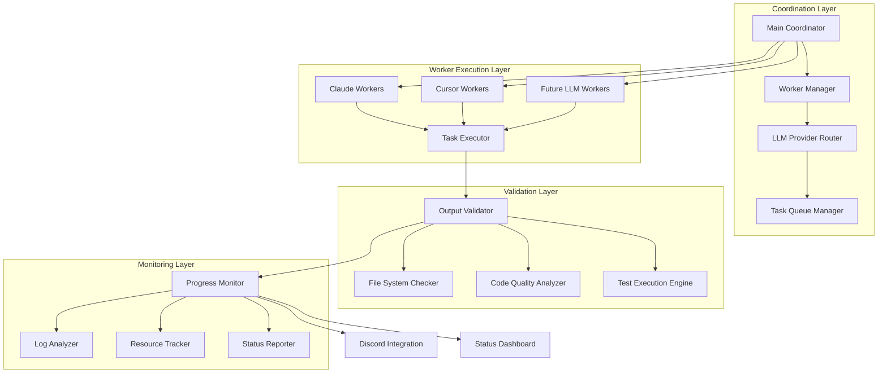
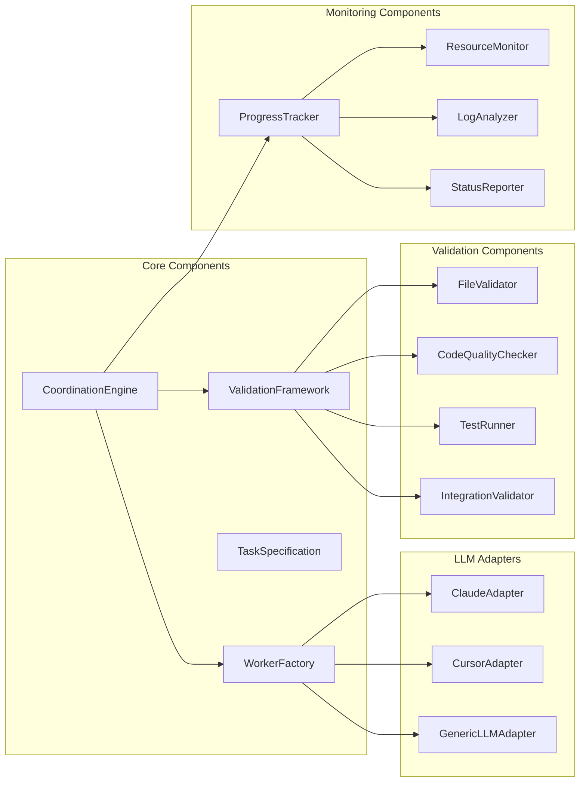

# AI Coordination Meta-Programming Framework - Design Document

## Overview

This design implements a systematic framework for coordinating multiple AI workers across different LLM providers to execute complex development tasks in parallel. The framework emerged from WebSocket remediation experiments and provides autonomous coordination, intelligent resource allocation, and comprehensive validation of AI-generated deliverables.

## Architecture

### High-Level Architecture



### Component Architecture



## Components and Interfaces

### 1. Coordination Engine

**Purpose**: Central orchestrator managing the entire AI coordination workflow

**Core Implementation**:
```python
class CoordinationEngine:
    def __init__(self, config: CoordinationConfig):
        self.worker_factory = WorkerFactory()
        self.task_queue = TaskQueue()
        self.validator = ValidationFramework()
        self.monitor = ProgressTracker()
        self.llm_router = LLMProviderRouter()
        
    async def coordinate_tasks(self, spec: ProjectSpecification) -> CoordinationResult
    async def launch_workers(self, tasks: List[TaskSpecification]) -> List[Worker]
    async def monitor_progress(self) -> ProgressReport
    async def handle_worker_failures(self, failed_workers: List[Worker]) -> RecoveryResult
    async def validate_completions(self, completed_tasks: List[Task]) -> ValidationReport
```

**Key Responsibilities**:
- Task decomposition and worker allocation
- LLM provider selection and failover
- Progress monitoring and failure detection
- Result validation and quality assurance
- Status reporting and logging

### 2. LLM Provider Adapters

**Purpose**: Standardized interface for different LLM providers with provider-specific optimizations

**Claude Adapter**:
```python
class ClaudeAdapter(LLMAdapter):
    def __init__(self, api_config: ClaudeConfig):
        self.client = ClaudeClient(api_config)
        self.credit_monitor = CreditMonitor()
        
    async def execute_task(self, task: TaskSpecification) -> TaskResult
    async def check_availability(self) -> ProviderStatus
    async def estimate_cost(self, task: TaskSpecification) -> CostEstimate
    def get_capabilities(self) -> ProviderCapabilities
```

**Cursor Adapter**:
```python
class CursorAdapter(LLMAdapter):
    def __init__(self, config: CursorConfig):
        self.client = CursorClient(config)
        self.time_tracker = TimeUsageTracker()
        
    async def execute_task(self, task: TaskSpecification) -> TaskResult
    async def check_availability(self) -> ProviderStatus
    async def estimate_duration(self, task: TaskSpecification) -> TimeEstimate
    def get_capabilities(self) -> ProviderCapabilities
```

### 3. Task Specification Framework

**Purpose**: Standardized task definition with explicit completion criteria

**Core Implementation**:
```python
@dataclass
class TaskSpecification:
    task_id: str
    title: str
    description: str
    ontological_context: Dict[str, Any]
    requirements_coverage: List[str]
    definition_of_done: DefinitionOfDone
    file_requirements: List[FileRequirement]
    validation_steps: List[ValidationStep]
    estimated_complexity: ComplexityLevel
    preferred_llm: Optional[str]
    
@dataclass
class DefinitionOfDone:
    required_files: List[str]
    minimum_line_counts: Dict[str, int]
    functional_requirements: List[str]
    test_requirements: List[str]
    integration_requirements: List[str]
    verification_commands: List[str]
```

### 4. Validation Framework

**Purpose**: Comprehensive validation of AI worker outputs against specifications

**Core Implementation**:
```python
class ValidationFramework:
    def __init__(self):
        self.file_validator = FileValidator()
        self.code_quality_checker = CodeQualityChecker()
        self.test_runner = TestRunner()
        self.integration_validator = IntegrationValidator()
        
    async def validate_task_completion(self, task: TaskSpecification, result: TaskResult) -> ValidationResult
    async def validate_file_requirements(self, requirements: List[FileRequirement]) -> FileValidationResult
    async def validate_code_quality(self, files: List[str]) -> CodeQualityResult
    async def run_verification_tests(self, test_commands: List[str]) -> TestResult
```

**Validation Components**:

1. **File Validator**: Checks file existence, content, and structure
2. **Code Quality Checker**: Validates syntax, imports, documentation
3. **Test Runner**: Executes tests and validates functionality
4. **Integration Validator**: Ensures compatibility with existing code

### 5. Progress Monitoring System

**Purpose**: Real-time monitoring of worker progress and system health

**Core Implementation**:
```python
class ProgressTracker:
    def __init__(self):
        self.worker_monitor = WorkerMonitor()
        self.resource_tracker = ResourceTracker()
        self.log_analyzer = LogAnalyzer()
        self.status_reporter = StatusReporter()
        
    async def monitor_workers(self, workers: List[Worker]) -> List[WorkerStatus]
    async def detect_stuck_workers(self, timeout: int = 300) -> List[Worker]
    async def analyze_progress_logs(self, log_files: List[str]) -> ProgressAnalysis
    async def generate_status_report(self) -> StatusReport
```

**Monitoring Capabilities**:
- Worker process health and resource usage
- Log file analysis for progress detection
- Stuck worker detection and recovery
- Resource utilization tracking
- Status reporting and alerting

## Data Models

### Worker State Management

```python
@dataclass
class WorkerState:
    worker_id: str
    task_id: str
    llm_provider: str
    status: WorkerStatus  # STARTING, RUNNING, COMPLETED, FAILED, STUCK
    start_time: datetime
    last_activity: datetime
    progress_indicators: List[ProgressIndicator]
    resource_usage: ResourceUsage
    output_log_path: str
    pid: Optional[int]
```

### Task Execution Results

```python
@dataclass
class TaskResult:
    task_id: str
    worker_id: str
    status: TaskStatus  # COMPLETED, FAILED, PARTIAL
    execution_time: timedelta
    files_created: List[str]
    lines_of_code: int
    tests_passed: int
    validation_results: ValidationResult
    cost_metrics: CostMetrics
    output_log: str
```

### Coordination Metrics

```python
@dataclass
class CoordinationMetrics:
    total_tasks: int
    completed_tasks: int
    failed_tasks: int
    active_workers: int
    total_execution_time: timedelta
    cost_breakdown: Dict[str, float]
    success_rate: float
    average_task_duration: timedelta
    resource_efficiency: float
```

## Error Handling

### Worker Failure Management

**Failure Categories**:
1. **Credit Exhaustion**: LLM provider limits reached
2. **Process Crashes**: Worker process dies unexpectedly
3. **Timeout Failures**: Workers stuck without progress
4. **Validation Failures**: Output doesn't meet requirements
5. **Resource Exhaustion**: System resource limits reached

**Recovery Strategies**:
```python
class FailureRecoveryManager:
    def __init__(self):
        self.recovery_strategies = {
            FailureType.CREDIT_EXHAUSTION: self.switch_llm_provider,
            FailureType.PROCESS_CRASH: self.restart_worker,
            FailureType.TIMEOUT: self.kill_and_restart,
            FailureType.VALIDATION_FAILURE: self.retry_with_enhanced_prompt,
            FailureType.RESOURCE_EXHAUSTION: self.reduce_parallel_workers
        }
        
    async def handle_failure(self, worker: Worker, failure: WorkerFailure) -> RecoveryResult
    async def switch_llm_provider(self, task: TaskSpecification) -> Worker
    async def retry_with_enhanced_prompt(self, task: TaskSpecification) -> Worker
```

### Graceful Degradation

**Degradation Levels**:
1. **Full Operation**: All LLM providers available, optimal performance
2. **Limited Providers**: Some providers unavailable, reduced parallelism
3. **Single Provider**: Only one LLM available, sequential execution
4. **Manual Fallback**: All automation failed, human intervention required

## Testing Strategy

### Unit Testing

**Core Component Tests**:
```python
class TestCoordinationEngine:
    async def test_task_decomposition(self)
    async def test_worker_allocation(self)
    async def test_failure_recovery(self)
    async def test_progress_monitoring(self)
    
class TestLLMAdapters:
    async def test_claude_adapter_execution(self)
    async def test_cursor_adapter_execution(self)
    async def test_provider_failover(self)
    
class TestValidationFramework:
    async def test_file_validation(self)
    async def test_code_quality_checking(self)
    async def test_test_execution(self)
```

### Integration Testing

**End-to-End Scenarios**:
```python
class TestCoordinationIntegration:
    async def test_full_coordination_cycle(self)
    async def test_multi_provider_failover(self)
    async def test_large_scale_coordination(self)
    async def test_autonomous_operation(self)
```

### Performance Testing

**Scalability Tests**:
- 20+ parallel workers coordination
- Large task queue processing
- Resource usage under load
- Failure recovery performance

### Chaos Testing

**Failure Simulation**:
- Random worker process kills
- LLM provider outages
- Resource exhaustion scenarios
- Network connectivity issues

## Discord Integration

### Automated Posting System

**Core Implementation**:
```python
class DiscordIntegration:
    def __init__(self, webhook_url: str, channel_config: DiscordConfig):
        self.webhook_url = webhook_url
        self.channel_config = channel_config
        
    async def post_spec_completion(self, spec: ProjectSpecification) -> bool
    async def post_coordination_results(self, results: CoordinationResult) -> bool
    async def post_experiment_findings(self, findings: ExperimentResults) -> bool
    async def post_status_updates(self, status: StatusReport) -> bool
```

**Posting Triggers**:
- Specification document completion (requirements, design, tasks)
- Major coordination milestones
- Experiment results and findings
- Critical failures or successes
- Daily status summaries

**Message Formatting**:
```python
def format_spec_completion_message(spec: ProjectSpecification) -> DiscordMessage:
    return DiscordMessage(
        title=f"📋 Spec Completed: {spec.name}",
        description=spec.summary,
        fields=[
            {"name": "Requirements", "value": f"{len(spec.requirements)} defined"},
            {"name": "Tasks", "value": f"{len(spec.tasks)} planned"},
            {"name": "Estimated Duration", "value": spec.estimated_duration}
        ],
        color=0x00ff00,  # Green for completion
        attachments=[spec.requirements_file, spec.design_file, spec.tasks_file]
    )
```

## Performance Considerations

### Scalability Optimizations

**Parallel Worker Management**:
- Asynchronous worker coordination
- Resource-aware worker allocation
- Dynamic scaling based on system capacity
- Efficient task queue management

**Memory Management**:
- Streaming log analysis to avoid memory buildup
- Periodic cleanup of completed worker data
- Efficient data structures for large task sets
- Resource monitoring and alerting

### Cost Optimization

**LLM Provider Selection**:
- Task complexity analysis for provider matching
- Cost estimation and budget tracking
- Automatic failover to cheaper providers
- Usage pattern optimization

**Resource Efficiency**:
- Worker process pooling and reuse
- Intelligent task batching
- Resource usage monitoring and optimization
- Predictive scaling based on workload

## Security Considerations

### Code Execution Safety

**Sandboxing**:
- Isolated execution environments for AI-generated code
- File system access restrictions
- Network access controls
- Resource usage limits

**Validation Security**:
- Code review for security vulnerabilities
- Dependency scanning for known issues
- Input sanitization for all AI outputs
- Audit logging for all system modifications

### Data Protection

**Sensitive Information**:
- Credential management and rotation
- API key protection and encryption
- Log sanitization for sensitive data
- Access control for coordination logs

## Deployment Strategy

### Development Environment Setup

**Prerequisites**:
- Python 3.9+ with asyncio support
- Claude Code CLI with pro plan access
- Cursor CLI installation and configuration
- Discord webhook configuration
- File system monitoring tools

**Installation Process**:
```bash
# Install coordination framework
pip install ai-coordination-framework

# Configure LLM providers
claude login
cursor setup

# Configure Discord integration
export DISCORD_WEBHOOK_URL="your_webhook_url"

# Initialize coordination workspace
coordination-init --project-name "your-project"
```

### Production Deployment

**Infrastructure Requirements**:
- Multi-core CPU for parallel worker management
- Sufficient RAM for concurrent LLM processes
- Fast SSD storage for log analysis
- Reliable network connectivity
- Monitoring and alerting infrastructure

**Deployment Configuration**:
```yaml
coordination:
  max_parallel_workers: 20
  worker_timeout: 300
  resource_limits:
    cpu_percent: 80
    memory_gb: 8
  
llm_providers:
  claude:
    enabled: true
    max_concurrent: 10
    cost_limit_per_hour: 50
  cursor:
    enabled: true
    max_concurrent: 15
    
validation:
  file_validation: true
  code_quality_checks: true
  test_execution: true
  
monitoring:
  log_level: INFO
  status_update_interval: 60
  discord_notifications: true
```

## Success Metrics

### Primary Metrics

1. **Task Completion Rate**: >90% of tasks completed successfully
2. **Validation Accuracy**: <5% false positives/negatives in completion validation
3. **Autonomous Operation**: 2+ hours without human intervention
4. **Cost Efficiency**: 50% reduction in expensive API usage through intelligent routing
5. **Scalability**: 20+ parallel workers with <10% performance degradation

### Secondary Metrics

1. **Worker Utilization**: >80% of worker time spent on productive tasks
2. **Failure Recovery**: <60 seconds average recovery time from worker failures
3. **Resource Efficiency**: <10% CPU and <2GB memory usage for coordination
4. **Integration Success**: 100% compatibility with existing development workflows
5. **Extensibility**: New LLM providers addable in <1 hour

This design provides a comprehensive framework for autonomous AI coordination that can scale from small experiments to large production deployments while maintaining quality, cost efficiency, and operational reliability.