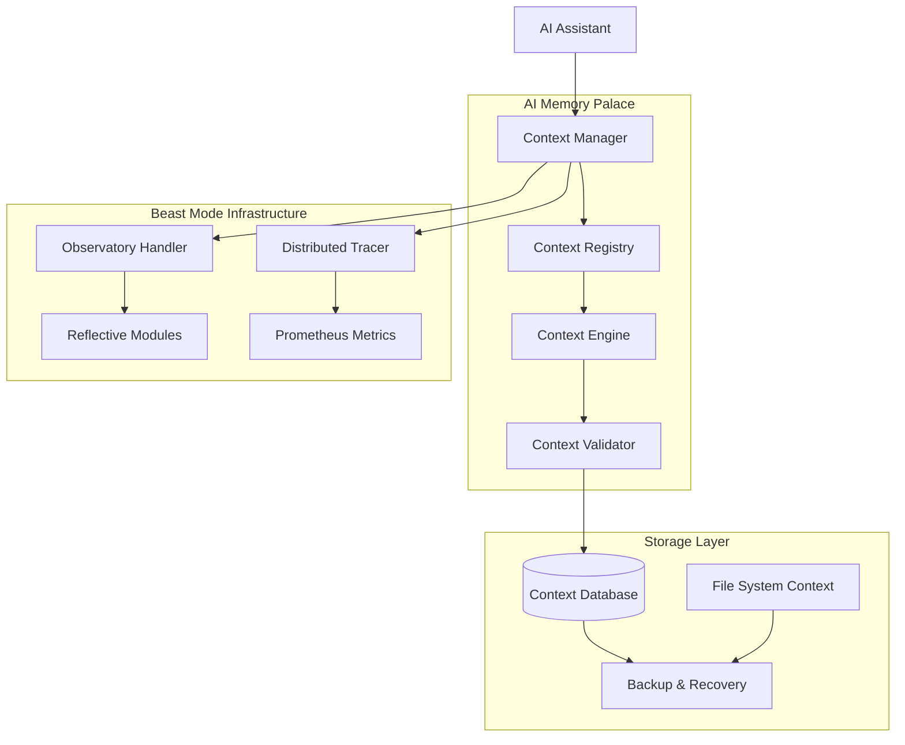
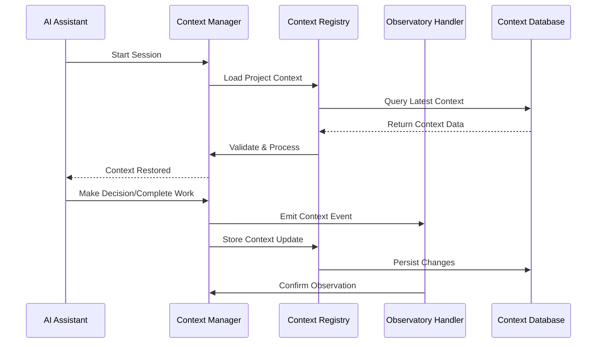

# AI Memory Palace Design

## Overview

The AI Memory Palace is a persistent context management system that eliminates the "50 first dates" problem by creating a systematic memory architecture for AI conversations. It integrates with the existing Beast Mode Observatory infrastructure to provide seamless context persistence across sessions.

**Core Principle:** Transform O(n) discovery overhead into O(1) context restoration through systematic memory architecture.

## Architecture

### High-Level Architecture



### Context Flow Architecture



## Components and Interfaces

### 1. Context Manager (`ContextManager`)

**Primary Interface:** Coordinates all context operations and serves as the main entry point.

```python
class ContextManager(ReflectiveModule):
    """Main orchestrator for AI conversation context persistence"""
    
    def load_session_context(self, project_path: str) -> SessionContext
    def save_context_event(self, event: ContextEvent) -> bool
    def validate_context_integrity(self) -> ValidationResult
    def clear_context(self, confirmation: str) -> bool
```

**Responsibilities:**
- Session lifecycle management
- Context validation and integrity checking
- Integration with Observatory infrastructure
- Error handling and recovery coordination

### 2. Context Registry (`ContextRegistry`)

**Primary Interface:** Manages context storage, retrieval, and versioning.

```python
class ContextRegistry(ReflectiveModule):
    """Persistent storage and retrieval of conversation context"""
    
    def store_context(self, context: SessionContext) -> ContextVersion
    def load_context(self, project_id: str, version: Optional[str] = None) -> SessionContext
    def list_context_versions(self, project_id: str) -> List[ContextVersion]
    def prune_old_contexts(self, retention_policy: RetentionPolicy) -> PruneResult
```

**Responsibilities:**
- Context serialization and deserialization
- Version management and history tracking
- Storage optimization and compression
- Backup and recovery operations

### 3. Context Engine (`ContextEngine`)

**Primary Interface:** Processes and analyzes context for relevance and summarization.

```python
class ContextEngine(ReflectiveModule):
    """Intelligent context processing and summarization"""
    
    def summarize_context(self, full_context: SessionContext) -> ContextSummary
    def filter_relevant_context(self, context: SessionContext, query: str) -> FilteredContext
    def detect_context_patterns(self, context: SessionContext) -> List[Pattern]
    def merge_contexts(self, contexts: List[SessionContext]) -> MergedContext
```

**Responsibilities:**
- Context summarization for efficiency
- Relevance filtering based on current work
- Pattern detection and learning
- Context merging for cross-project work

### 4. Context Validator (`ContextValidator`)

**Primary Interface:** Ensures context integrity and mathematical governance compliance.

```python
class ContextValidator(ReflectiveModule):
    """Validates context integrity and DAG compliance"""
    
    def validate_dag_integrity(self, context: SessionContext) -> DAGValidationResult
    def check_context_consistency(self, context: SessionContext) -> ConsistencyResult
    def detect_circular_dependencies(self, events: List[ContextEvent]) -> List[Cycle]
    def repair_context_corruption(self, corrupted_context: SessionContext) -> RepairResult
```

**Responsibilities:**
- DAG validation for mathematical governance
- Circular dependency detection
- Context consistency checking
- Automated repair mechanisms

## Data Models

### Core Context Models

```python
@dataclass
class SessionContext:
    """Complete context for an AI session"""
    project_id: str
    session_id: str
    timestamp: datetime
    conversation_history: List[ConversationEvent]
    project_state: ProjectState
    decisions_made: List[Decision]
    work_completed: List[WorkItem]
    system_discoveries: List[Discovery]
    spec_states: Dict[str, SpecState]
    
@dataclass
class ContextEvent:
    """Individual context event for persistence"""
    event_id: str
    event_type: ContextEventType
    timestamp: datetime
    correlation_id: str
    data: Dict[str, Any]
    metadata: EventMetadata
    
@dataclass
class ProjectState:
    """Current state of the project"""
    architecture_overview: str
    running_services: List[ServiceInfo]
    active_specs: List[str]
    recent_changes: List[Change]
    health_status: HealthStatus
```

### Event Types

```python
class ContextEventType(Enum):
    CONVERSATION_START = "conversation_start"
    CONVERSATION_END = "conversation_end"
    CODE_WRITTEN = "code_written"
    SPEC_CREATED = "spec_created"
    SPEC_UPDATED = "spec_updated"
    TASK_COMPLETED = "task_completed"
    DECISION_MADE = "decision_made"
    DISCOVERY_MADE = "discovery_made"
    ERROR_ENCOUNTERED = "error_encountered"
    SYSTEM_STATE_CHANGED = "system_state_changed"
```

## Error Handling

### Context Corruption Recovery

1. **Automatic Detection:** Checksums and integrity validation on every load
2. **Graceful Degradation:** Fall back to discovery mode if context is corrupted
3. **Backup Recovery:** Automatic restoration from previous known-good state
4. **Manual Recovery:** Tools for developers to manually repair context

### DAG Violation Handling

1. **Cycle Detection:** Mathematical validation of context event dependencies
2. **Automatic Resolution:** Attempt to break cycles by removing redundant events
3. **Manual Intervention:** Flag for developer review when automatic resolution fails
4. **Prevention:** Real-time validation during context event creation

### Performance Degradation

1. **Context Size Monitoring:** Track context growth and performance impact
2. **Automatic Summarization:** Compress old context when size limits are reached
3. **Selective Loading:** Load only relevant context portions for current work
4. **Cache Management:** Intelligent caching of frequently accessed context

## Testing Strategy

### Unit Tests

- **Context Manager:** Session lifecycle, error handling, integration points
- **Context Registry:** Storage/retrieval, versioning, backup/recovery
- **Context Engine:** Summarization accuracy, filtering effectiveness, pattern detection
- **Context Validator:** DAG validation, consistency checking, repair mechanisms

### Integration Tests

- **Observatory Integration:** Context events flow through observation system
- **Tracing Integration:** Context operations are properly traced
- **Database Integration:** Context persistence and retrieval across restarts
- **Multi-Project:** Context isolation and cross-project references

### End-to-End Tests

- **Session Continuity:** Full conversation → restart → context restoration
- **Corruption Recovery:** Simulate corruption and verify recovery
- **Performance:** Context loading time under various sizes
- **Concurrent Access:** Multiple AI sessions with shared context

### Performance Tests

- **Context Loading Speed:** Target <2 seconds for any context size
- **Memory Usage:** Context should not exceed 100MB in memory
- **Storage Efficiency:** Context compression and deduplication
- **Concurrent Operations:** Multiple context operations without blocking

## Observatory Integration

### Context Event Emission

All context operations emit observations through the existing `ObservationHandler`:

```python
# Context loading
self.emit_observation({
    "type": "context_loaded",
    "project_id": project_id,
    "context_size": len(context.conversation_history),
    "load_time_ms": load_time,
    "correlation_id": correlation_id
})

# Context saving
self.emit_observation({
    "type": "context_saved",
    "event_type": event.event_type,
    "project_id": project_id,
    "correlation_id": correlation_id
})
```

### Distributed Tracing Integration

Context operations are traced using the existing `DistributedTracer`:

```python
with self.tracer.start_span("context_load") as span:
    span.set_attribute("project_id", project_id)
    span.set_attribute("context_version", version)
    context = self.registry.load_context(project_id, version)
    span.set_attribute("context_size", len(context.conversation_history))
```

### Health Monitoring

Context system health is monitored through ReflectiveModule endpoints:

- `/health` - Overall context system health
- `/ready` - Context system readiness for operations
- `/metrics` - Prometheus metrics for context operations

### Prometheus Metrics

```python
# Context operation metrics
context_operations_total = Counter('context_operations_total', 'Total context operations', ['operation', 'status'])
context_load_duration_seconds = Histogram('context_load_duration_seconds', 'Context loading duration')
context_size_bytes = Gauge('context_size_bytes', 'Current context size in bytes', ['project_id'])
context_events_total = Counter('context_events_total', 'Total context events', ['event_type'])
```

## Security and Privacy

### Data Protection

1. **Sensitive Information Filtering:** Automatic detection and redaction of credentials, API keys, personal information
2. **Encryption at Rest:** Context data encrypted in storage using project-specific keys
3. **Access Logging:** All context access logged for audit purposes
4. **Retention Policies:** Automatic purging of old context based on configurable policies

### Privacy Boundaries

1. **Project Isolation:** Context strictly isolated between different projects
2. **User Consent:** Clear indication when context is being stored and used
3. **Data Minimization:** Only store context necessary for functionality
4. **Right to Deletion:** Ability to completely purge context for a project

## Deployment Considerations

### Storage Requirements

- **Database:** PostgreSQL or SQLite for structured context data
- **File System:** Local storage for context backups and large artifacts
- **Memory:** 100MB maximum per active context session
- **Network:** Minimal - all operations are local to the development environment

### Configuration

```yaml
# Context configuration
context:
  storage:
    type: "sqlite"  # or "postgresql"
    path: ".kiro/context/context.db"
    backup_path: ".kiro/context/backups/"
  
  retention:
    max_age_days: 90
    max_size_mb: 1000
    auto_prune: true
  
  performance:
    max_context_size_mb: 100
    summarization_threshold: 1000  # events
    cache_size_mb: 50
  
  privacy:
    filter_sensitive: true
    encryption_enabled: true
    audit_logging: true
```

### Integration Points

1. **Observatory Server:** Context events flow through existing observation infrastructure
2. **Distributed Tracer:** Context operations are traced with correlation IDs
3. **Reflective Modules:** Context system implements standard health endpoints
4. **Prometheus:** Context metrics exposed via existing metrics infrastructure

## Future Enhancements

### Phase 2: Advanced Features

1. **Cross-Project Context Sharing:** Intelligent sharing of relevant context between related projects
2. **Context Analytics:** Machine learning analysis of context patterns for optimization
3. **Collaborative Context:** Multiple developers sharing context for team projects
4. **Context Templates:** Pre-built context templates for common project types

### Phase 3: AI Enhancement

1. **Intelligent Summarization:** AI-powered context summarization and relevance scoring
2. **Predictive Context:** Anticipate what context will be needed based on current work
3. **Context Recommendations:** Suggest relevant context from other projects or sessions
4. **Automated Context Curation:** AI-driven organization and cleanup of context data

## Success Metrics

### Primary Metrics

1. **Context Restoration Time:** <2 seconds for any context size
2. **Discovery Elimination:** >90% reduction in "what do I have" questions
3. **Session Continuity:** >95% successful context restoration across sessions
4. **Developer Satisfaction:** Measurable reduction in frustration with AI memory

### Secondary Metrics

1. **Context Accuracy:** >95% of restored context is relevant and accurate
2. **Storage Efficiency:** Context compression ratio >10:1 for large contexts
3. **System Reliability:** <1% context corruption rate
4. **Performance Impact:** <5% overhead on existing Observatory operations

The AI Memory Palace transforms the AI assistant from having amnesia to having perfect recall, enabling truly productive long-term collaboration on complex software projects.