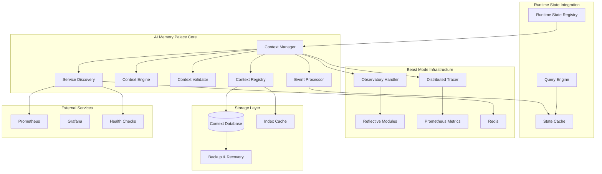
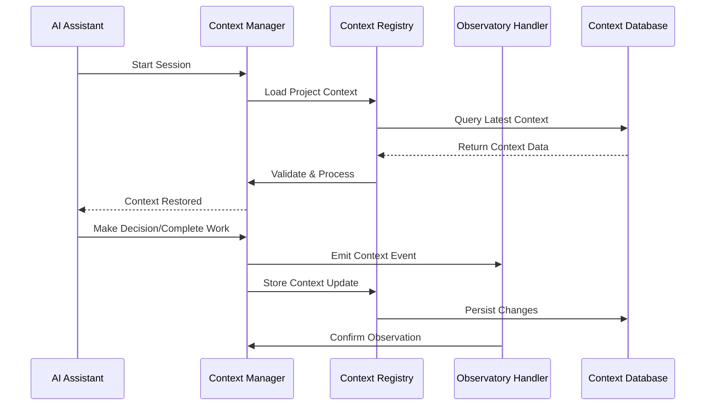

# AI Memory Palace Design

## Overview

The AI Memory Palace is a robust persistent context management system that eliminates the "50 first dates" problem by creating a systematic memory architecture for AI conversations. It integrates with the existing Beast Mode Observatory infrastructure and provides specific support for Runtime State Registry integration through O(1) context-aware operations.

**Core Principle:** Transform O(n) discovery overhead into O(1) context restoration through systematic memory architecture with robust error handling, dynamic service discovery, and real-time state synchronization.

**Key Integration Points:**
- **Runtime State Registry Support**: Provides O(1) context-aware queries for system state
- **Dynamic Service Discovery**: Real-time integration with Redis, Prometheus, and health endpoints
- **Graceful Degradation**: Continues operating even when dependencies fail
- **Performance Guarantees**: <2 second context loading regardless of size

## Architecture

### High-Level Architecture



### Context Flow Architecture



## Components and Interfaces

### 1. Context Manager (`ContextManager`)

**Primary Interface:** Coordinates all context operations and serves as the main entry point.

```python
class ContextManager(ReflectiveModule):
    """Main orchestrator for AI conversation context persistence"""
    
    def load_session_context(self, project_path: str) -> SessionContext
    def save_context_event(self, event: ContextEvent) -> bool
    def validate_context_integrity(self) -> ValidationResult
    def clear_context(self, confirmation: str) -> bool
    def get_context_summary(self, project_id: str) -> ContextSummary
    def enable_memory_only_mode(self, reason: str) -> bool
    def handle_graceful_degradation(self, failure_type: str) -> DegradationResult
```

**Responsibilities:**
- Session lifecycle management with graceful degradation (Req 17.1)
- Context validation and integrity checking (Req 7.1)
- Integration with Observatory infrastructure (Req 4.1-4.4)
- Error handling and recovery coordination (Req 17.2, 17.5)
- Memory-only fallback when database unavailable (Req 12.1)
- Developer experience with context summaries (Req 9.1)

### 2. Context Registry (`ContextRegistry`)

**Primary Interface:** Manages context storage, retrieval, and versioning with robust error handling.

```python
class ContextRegistry(ReflectiveModule):
    """Persistent storage and retrieval of conversation context"""
    
    def store_context(self, context: SessionContext) -> ContextVersion
    def load_context(self, project_id: str, version: Optional[str] = None) -> SessionContext
    def list_context_versions(self, project_id: str) -> List[ContextVersion]
    def prune_old_contexts(self, retention_policy: RetentionPolicy) -> PruneResult
    def validate_checksums(self, context: SessionContext) -> ChecksumResult
    def attempt_auto_recovery(self, corrupted_context: SessionContext) -> RecoveryResult
    def migrate_schema(self, target_version: str) -> MigrationResult
    def retry_with_backoff(self, operation: Callable, max_retries: int = 3) -> Any
```

**Responsibilities:**
- Context serialization and deserialization with integrity validation (Req 7.1)
- Version management and history tracking (Req 1.3)
- Storage optimization and compression for large contexts (Req 16.2)
- Backup and recovery operations with automatic repair (Req 7.2, 7.3)
- Database retry logic with exponential backoff (Req 12.2)
- Schema migration for database evolution (Req 12.4)
- Data integrity verification after storage (Req 12.5)

### 3. Context Engine (`ContextEngine`)

**Primary Interface:** Processes and analyzes context for relevance and summarization with performance optimization.

```python
class ContextEngine(ReflectiveModule):
    """Intelligent context processing and summarization"""
    
    def summarize_context(self, full_context: SessionContext) -> ContextSummary
    def filter_relevant_context(self, context: SessionContext, query: str) -> FilteredContext
    def detect_context_patterns(self, context: SessionContext) -> List[Pattern]
    def merge_contexts(self, contexts: List[SessionContext]) -> MergedContext
    def compress_old_data(self, context: SessionContext, threshold_mb: int = 10) -> SessionContext
    def paginate_events(self, events: List[ContextEvent], page_size: int = 100) -> Iterator[List[ContextEvent]]
    def create_indexed_access(self, context: SessionContext) -> IndexedContext
    def implement_lru_eviction(self, cache_size_mb: int = 100) -> None
    def validate_staleness(self, context: SessionContext) -> StalenessResult
```

**Responsibilities:**
- Context summarization for large datasets (Req 5.2, 16.2)
- Relevance filtering based on current work (Req 5.3)
- Pattern detection and learning for optimization
- Context merging for cross-project work (Req 6.3)
- Automatic compression when size limits exceeded (Req 16.2)
- Pagination for large event collections (Req 16.3)
- Indexed access for query optimization (Req 15.5)
- LRU cache management for memory efficiency (Req 16.4)
- Staleness validation for context freshness (Req 5.4)

### 4. Context Validator (`ContextValidator`)

**Primary Interface:** Ensures context integrity and mathematical governance compliance.

```python
class ContextValidator(ReflectiveModule):
    """Validates context integrity and DAG compliance"""
    
    def validate_dag_integrity(self, context: SessionContext) -> DAGValidationResult
    def check_context_consistency(self, context: SessionContext) -> ConsistencyResult
    def detect_circular_dependencies(self, events: List[ContextEvent]) -> List[Cycle]
    def repair_context_corruption(self, corrupted_context: SessionContext) -> RepairResult
    def enforce_bounded_dimensions(self, context: SessionContext) -> BoundednessResult
    def isolate_corruption(self, context: SessionContext) -> IsolationResult
    def validate_external_state(self, context: SessionContext, runtime_state: Dict) -> ValidationResult
```

**Responsibilities:**
- DAG validation for mathematical governance (Req 3.1, 3.2)
- Circular dependency detection and rejection (Req 3.3)
- Context consistency checking with repair (Req 7.4)
- Automated repair mechanisms with verification (Req 7.3, 7.4)
- Bounded dimensions enforcement to prevent unbounded growth (Req 3.4)
- Corruption isolation to prevent cascade failures (Req 17.3)
- External validation against runtime state (Req 18.3)

### 5. Service Discovery (`ServiceDiscovery`)

**Primary Interface:** Discovers and monitors services from multiple sources for real-time context updates.

```python
class ServiceDiscovery(ReflectiveModule):
    """Dynamic service discovery and monitoring"""
    
    def discover_from_redis(self) -> List[ServiceInfo]
    def discover_from_prometheus(self) -> List[ServiceInfo]
    def perform_health_checks(self, services: List[ServiceInfo]) -> List[HealthResult]
    def update_service_cache(self, services: List[ServiceInfo]) -> None
    def handle_discovery_failure(self, source: str, error: Exception) -> FallbackResult
    def get_cached_services_with_staleness(self) -> Tuple[List[ServiceInfo], StalenessInfo]
```

**Responsibilities:**
- Redis ReflectiveModule health key discovery (Req 13.1)
- Prometheus service target discovery (Req 13.2)
- Health check validation on discovered endpoints (Req 13.3)
- Service state change detection and context updates (Req 13.4)
- Cached service fallback with staleness indicators (Req 13.5)

### 6. Event Processor (`EventProcessor`)

**Primary Interface:** Processes context events in real-time and integrates them into session context.

```python
class EventProcessor(ReflectiveModule):
    """Real-time context event processing and integration"""
    
    def process_context_event(self, event: ContextEvent) -> ProcessingResult
    def integrate_into_session(self, event: ContextEvent, session: SessionContext) -> SessionContext
    def update_project_state(self, state_change: StateChange) -> None
    def handle_service_health_change(self, health_change: HealthChange) -> None
    def capture_configuration_change(self, old_config: Dict, new_config: Dict) -> ContextEvent
    def maintain_correlation_ids(self, event: ContextEvent) -> ContextEvent
```

**Responsibilities:**
- Immediate context event integration (Req 14.1)
- Automatic project state updates on system changes (Req 14.2)
- Service health change reflection in context (Req 14.3)
- Configuration change capture with old/new values (Req 14.4)
- Correlation ID maintenance throughout processing (Req 14.5)

### 7. Query Engine (`QueryEngine`)

**Primary Interface:** Provides O(1) context-aware queries for system state information.

```python
class QueryEngine(ReflectiveModule):
    """O(1) context-aware query optimization"""
    
    def query_running_services(self, context: SessionContext) -> List[ServiceInfo]
    def query_service_health(self, service_name: str, context: SessionContext) -> HealthStatus
    def refresh_stale_data(self, query_type: str, context: SessionContext) -> RefreshResult
    def perform_discovery_and_cache(self, query: str) -> QueryResult
    def provide_indexed_access(self, context: SessionContext, query_params: Dict) -> QueryResult
    def answer_from_cache(self, query: str) -> Optional[QueryResult]
```

**Responsibilities:**
- O(1) "what's running" queries from cached context (Req 15.1)
- Service health status from context cache (Req 15.2)
- Intelligent refresh of stale context data (Req 15.3)
- Discovery and caching for missing query results (Req 15.4)
- Indexed access for large context datasets (Req 15.5)

## Data Models

### Core Context Models

```python
@dataclass
class SessionContext:
    """Complete context for an AI session"""
    project_id: str
    session_id: str
    timestamp: datetime
    conversation_history: List[ConversationEvent]
    project_state: ProjectState
    decisions_made: List[Decision]
    work_completed: List[WorkItem]
    system_discoveries: List[Discovery]
    spec_states: Dict[str, SpecState]
    
@dataclass
class ContextEvent:
    """Individual context event for persistence"""
    event_id: str
    event_type: ContextEventType
    timestamp: datetime
    correlation_id: str
    data: Dict[str, Any]
    metadata: EventMetadata
    
@dataclass
class ProjectState:
    """Current state of the project"""
    architecture_overview: str
    running_services: List[ServiceInfo]
    active_specs: List[str]
    recent_changes: List[Change]
    health_status: HealthStatus
    service_discovery_cache: Dict[str, ServiceInfo]
    last_discovery_timestamp: datetime
    staleness_indicators: Dict[str, StalenessInfo]

@dataclass
class ServiceInfo:
    """Information about a discovered service"""
    name: str
    host: str
    port: int
    health_status: HealthStatus
    discovery_source: str  # "redis", "prometheus", "health_check"
    last_seen: datetime
    metadata: Dict[str, Any]

@dataclass
class HealthStatus:
    """Service health status information"""
    status: str  # "healthy", "unhealthy", "unknown"
    last_check: datetime
    response_time_ms: Optional[float]
    error_message: Optional[str]
    
@dataclass
class StalenessInfo:
    """Information about data staleness"""
    last_updated: datetime
    is_stale: bool
    staleness_threshold_seconds: int
    refresh_needed: bool

@dataclass
class ContextSummary:
    """Summarized view of context for developer experience"""
    project_id: str
    last_session: datetime
    total_events: int
    recent_decisions: List[str]
    active_specs: List[str]
    system_health: str
    context_size_mb: float
```

### Event Types

```python
class ContextEventType(Enum):
    CONVERSATION_START = "conversation_start"
    CONVERSATION_END = "conversation_end"
    CODE_WRITTEN = "code_written"
    SPEC_CREATED = "spec_created"
    SPEC_UPDATED = "spec_updated"
    TASK_COMPLETED = "task_completed"
    DECISION_MADE = "decision_made"
    DISCOVERY_MADE = "discovery_made"
    ERROR_ENCOUNTERED = "error_encountered"
    SYSTEM_STATE_CHANGED = "system_state_changed"
    SERVICE_DISCOVERED = "service_discovered"
    SERVICE_HEALTH_CHANGED = "service_health_changed"
    CONFIGURATION_CHANGED = "configuration_changed"
    RUNTIME_STATE_UPDATED = "runtime_state_updated"
```

## Runtime State Registry Integration

### Integration Architecture

The AI Memory Palace provides specific integration points for the Runtime State Registry to enable O(1) context-aware operations:

```python
class RuntimeStateRegistryIntegration:
    """Integration interface for Runtime State Registry"""
    
    def provide_structured_access(self, query_type: str) -> Dict[str, Any]
    def accept_runtime_state_event(self, event: RuntimeStateEvent) -> bool
    def validate_against_runtime_state(self, context: SessionContext, runtime_state: Dict) -> ValidationResult
    def enrich_context_with_runtime_data(self, context: SessionContext, runtime_data: Dict) -> SessionContext
    def provide_context_views(self, view_type: str) -> Union[SessionContext, ContextSummary]
```

### Integration Points

#### 1. Structured System State Access (Req 18.1)
- **Query Interface**: Provides structured access to cached service information, health status, and system state
- **Data Format**: Standardized JSON/dict format for easy consumption by Runtime State Registry
- **Performance**: O(1) access through indexed context data structures

#### 2. Runtime State Event Processing (Req 18.2)
- **Event Acceptance**: Processes runtime state change events and integrates them into context
- **Real-time Updates**: Immediately updates project state when runtime state changes
- **Correlation**: Maintains correlation IDs between runtime state events and context events

#### 3. External Validation (Req 18.3)
- **State Consistency**: Validates context against current runtime state to detect drift
- **Conflict Resolution**: Identifies and reports inconsistencies between cached and actual state
- **Refresh Triggers**: Automatically refreshes stale context data when validation fails

#### 4. Context Enrichment (Req 18.4)
- **Data Integration**: Accepts runtime state data to enhance project state information
- **Merge Strategy**: Intelligently merges runtime data with existing context without conflicts
- **Metadata Preservation**: Maintains source attribution for all enriched data

#### 5. Multi-View Context Access (Req 18.5)
- **Full Context**: Complete SessionContext for comprehensive analysis
- **Summary Views**: Lightweight ContextSummary for quick status checks
- **Filtered Views**: Project-specific or service-specific context subsets
- **Query-Optimized Views**: Pre-indexed data structures for specific query patterns

## Error Handling

### Graceful Degradation Strategy (Req 17.1)

The system is designed to continue operating with reduced functionality when components fail:

1. **Component Failure Isolation:** Each component (Context Manager, Registry, Engine, Validator) can fail independently without bringing down the entire system
2. **Functionality Reduction:** When components fail, the system provides reduced but still useful functionality
3. **Clear Status Indication:** Users are informed about which components are unavailable and what functionality is affected
4. **Automatic Recovery Attempts:** Failed components are periodically retried with exponential backoff

### Database Failure Handling (Req 12.1, 12.2)

1. **Memory-Only Mode:** When database is unavailable, system operates in memory-only mode with clear warnings
2. **Retry Logic:** Database operations use exponential backoff retry (3 attempts with 1s, 2s, 4s delays)
3. **Connection Pooling:** Maintains connection pool with health checks and automatic reconnection
4. **Transaction Safety:** All database operations are wrapped in transactions with proper rollback

### Context Corruption Recovery (Req 7.1, 7.2, 7.3, 7.4)

1. **Automatic Detection:** Checksums and integrity validation on every load operation
2. **Graceful Degradation:** Fall back to discovery mode if context is corrupted, with clear user indication
3. **Backup Recovery:** Automatic restoration from previous known-good state with verification
4. **Manual Recovery:** Tools for developers to manually repair context with guided workflows
5. **Corruption Isolation:** Isolate corrupted sections to prevent cascade failures (Req 17.3)

### DAG Violation Handling (Req 3.1, 3.2, 3.3)

1. **Cycle Detection:** Mathematical validation of context event dependencies using topological sort
2. **Automatic Resolution:** Attempt to break cycles by removing redundant or conflicting events
3. **Manual Intervention:** Flag for developer review when automatic resolution fails
4. **Prevention:** Real-time validation during context event creation to prevent cycles

### Performance Degradation Handling (Req 16.1, 16.2, 16.3, 16.4)

1. **Context Size Monitoring:** Track context growth and performance impact with alerts
2. **Automatic Summarization:** Compress old context when size limits are reached (>10MB)
3. **Selective Loading:** Load only relevant context portions for current work
4. **Cache Management:** Intelligent LRU caching with memory limits (100MB max)
5. **Pagination:** Implement pagination for large event collections (>1000 events)

### External Dependency Failures (Req 17.4, 13.5)

1. **Service Discovery Failures:** Use cached service information with staleness indicators
2. **Tracing System Failures:** Continue operation without tracing, log failures (Req 11.3)
3. **Observatory Failures:** Queue observations for later delivery, continue core functionality
4. **Network Failures:** Implement circuit breaker pattern with automatic recovery

### Error Recovery Tools (Req 17.5)

1. **Automated Recovery:** Self-healing mechanisms for common failure patterns
2. **Manual Override Options:** Developer tools for complex recovery scenarios
3. **Recovery Validation:** Verify all recovery operations before marking as complete
4. **Recovery Logging:** Complete audit trail of all recovery operations

### Clear Error Communication (Req 17.2)

1. **Structured Error Messages:** Consistent error format with context and suggested actions
2. **Recovery Suggestions:** Specific, actionable steps for resolving each error type
3. **Error Classification:** Categorize errors by severity and required action
4. **User-Friendly Messages:** Translate technical errors into understandable language

## Testing Strategy

### Unit Tests

- **Context Manager:** Session lifecycle, error handling, integration points, graceful degradation modes
- **Context Registry:** Storage/retrieval, versioning, backup/recovery, retry logic, schema migration
- **Context Engine:** Summarization accuracy, filtering effectiveness, pattern detection, compression algorithms
- **Context Validator:** DAG validation, consistency checking, repair mechanisms, corruption isolation
- **Service Discovery:** Redis/Prometheus discovery, health checks, failure handling, cache management
- **Event Processor:** Real-time event processing, correlation ID maintenance, state updates
- **Query Engine:** O(1) query performance, cache hits/misses, staleness detection

### Integration Tests

- **Observatory Integration:** Context events flow through observation system with proper correlation
- **Tracing Integration:** Context operations are properly traced with OpenTelemetry and no-op fallback
- **Database Integration:** Context persistence and retrieval across restarts, migration scenarios
- **Multi-Project:** Context isolation and cross-project references, security boundaries
- **Runtime State Registry:** Integration points, structured access, event processing, validation
- **Service Discovery Integration:** Redis health keys, Prometheus targets, health endpoint validation

### End-to-End Tests

- **Session Continuity:** Full conversation → restart → context restoration with <2s loading time
- **Corruption Recovery:** Simulate corruption and verify automatic recovery with manual fallback
- **Performance:** Context loading time under various sizes (1MB, 10MB, 100MB scenarios)
- **Concurrent Access:** Multiple AI sessions with shared context, thread safety validation
- **Graceful Degradation:** Component failure scenarios with reduced functionality validation
- **Memory-Only Mode:** Database unavailable scenarios with full functionality preservation

### Performance Tests

- **Context Loading Speed:** Target <2 seconds for any context size (Req 5.1, 16.1)
- **Memory Usage:** Context should not exceed 100MB in memory with LRU eviction (Req 16.4)
- **Storage Efficiency:** Context compression and deduplication ratios >10:1 (Success Metric)
- **Concurrent Operations:** Multiple context operations without blocking (Req 16.5)
- **Query Performance:** O(1) context-aware queries with <100ms response time (Req 15.1-15.5)
- **Scalability:** Performance with 1000+ events and pagination (Req 16.3)

### Failure Scenario Tests

- **Database Failures:** Connection loss, corruption, schema conflicts, recovery validation
- **Service Discovery Failures:** Redis unavailable, Prometheus unreachable, health check timeouts
- **Tracing System Failures:** OpenTelemetry unavailable, span creation failures, graceful degradation
- **Memory Pressure:** Large context scenarios, memory exhaustion, LRU eviction effectiveness
- **Network Partitions:** Service isolation, cached data usage, staleness handling
- **Concurrent Corruption:** Multiple sessions with corrupted context, isolation effectiveness

### Security and Privacy Tests

- **Sensitive Data Filtering:** Credential detection and redaction accuracy (Req 8.1, 8.2)
- **Access Logging:** Audit trail completeness and integrity (Req 8.3)
- **Retention Policies:** Automatic purging functionality and compliance (Req 8.4)
- **Project Isolation:** Cross-project data leakage prevention (Req 6.1, 6.2)
- **Encryption:** Data at rest encryption and key management validation

## Observatory Integration

### Context Event Emission

All context operations emit observations through the existing `ObservationHandler`:

```python
# Context loading
self.emit_observation({
    "type": "context_loaded",
    "project_id": project_id,
    "context_size": len(context.conversation_history),
    "load_time_ms": load_time,
    "correlation_id": correlation_id
})

# Context saving
self.emit_observation({
    "type": "context_saved",
    "event_type": event.event_type,
    "project_id": project_id,
    "correlation_id": correlation_id
})
```

### Distributed Tracing Integration

Context operations are traced using robust tracing with graceful degradation (Req 11.1-11.5):

```python
class TracingManager:
    """Manages distributed tracing with graceful fallback"""
    
    def __init__(self):
        self.tracer = self._initialize_tracer()
    
    def _initialize_tracer(self):
        """Initialize OpenTelemetry tracer with no-op fallback"""
        try:
            from opentelemetry import trace
            return trace.get_tracer(__name__)
        except ImportError:
            return NoOpTracer()  # Graceful fallback when OpenTelemetry unavailable
    
    def trace_context_operation(self, operation_name: str, **attributes):
        """Trace context operations with error handling"""
        try:
            span = self.tracer.start_span(operation_name)
            for key, value in attributes.items():
                span.set_attribute(key, value)
            return span
        except Exception as e:
            # Log failure but continue without tracing (Req 11.3)
            logger.warning(f"Tracing operation failed: {e}")
            return NoOpSpan()

# Usage example with robust error handling
with self.tracing_manager.trace_context_operation(
    "context_load",
    project_id=project_id,
    context_version=version,
    correlation_id=correlation_id
) as span:
    try:
        context = self.registry.load_context(project_id, version)
        span.set_attribute("context_size", len(context.conversation_history))
        span.set_attribute("load_success", True)
    except Exception as e:
        span.set_attribute("load_success", False)
        span.set_attribute("error_message", str(e))
        raise
```

**Tracing Features:**
- **OpenTelemetry Integration:** Uses OpenTelemetry when available (Req 11.1)
- **No-Op Fallback:** Continues functioning when OpenTelemetry unavailable (Req 11.2)
- **Error Resilience:** Logs tracing failures and continues without tracing (Req 11.3)
- **Rich Attributes:** Includes correlation IDs and span attributes (Req 11.4)
- **Optional Operation:** Context operations complete without tracing dependencies (Req 11.5)

### Health Monitoring

Context system health is monitored through ReflectiveModule endpoints:

- `/health` - Overall context system health
- `/ready` - Context system readiness for operations
- `/metrics` - Prometheus metrics for context operations

### Prometheus Metrics

```python
# Context operation metrics
context_operations_total = Counter('context_operations_total', 'Total context operations', ['operation', 'status'])
context_load_duration_seconds = Histogram('context_load_duration_seconds', 'Context loading duration')
context_size_bytes = Gauge('context_size_bytes', 'Current context size in bytes', ['project_id'])
context_events_total = Counter('context_events_total', 'Total context events', ['event_type'])
```

## Security and Privacy

### Data Protection

1. **Sensitive Information Filtering:** Automatic detection and redaction of credentials, API keys, personal information
2. **Encryption at Rest:** Context data encrypted in storage using project-specific keys
3. **Access Logging:** All context access logged for audit purposes
4. **Retention Policies:** Automatic purging of old context based on configurable policies

### Privacy Boundaries

1. **Project Isolation:** Context strictly isolated between different projects
2. **User Consent:** Clear indication when context is being stored and used
3. **Data Minimization:** Only store context necessary for functionality
4. **Right to Deletion:** Ability to completely purge context for a project

## Deployment Considerations

### Storage Requirements

- **Database:** PostgreSQL or SQLite for structured context data
- **File System:** Local storage for context backups and large artifacts
- **Memory:** 100MB maximum per active context session
- **Network:** Minimal - all operations are local to the development environment

### Configuration

```yaml
# Context configuration
context:
  storage:
    type: "sqlite"  # or "postgresql"
    path: ".kiro/context/context.db"
    backup_path: ".kiro/context/backups/"
  
  retention:
    max_age_days: 90
    max_size_mb: 1000
    auto_prune: true
  
  performance:
    max_context_size_mb: 100
    summarization_threshold: 1000  # events
    cache_size_mb: 50
  
  privacy:
    filter_sensitive: true
    encryption_enabled: true
    audit_logging: true
```

### Integration Points

1. **Observatory Server:** Context events flow through existing observation infrastructure
2. **Distributed Tracer:** Context operations are traced with correlation IDs
3. **Reflective Modules:** Context system implements standard health endpoints
4. **Prometheus:** Context metrics exposed via existing metrics infrastructure

## Future Enhancements

### Phase 2: Advanced Features

1. **Cross-Project Context Sharing:** Intelligent sharing of relevant context between related projects
2. **Context Analytics:** Machine learning analysis of context patterns for optimization
3. **Collaborative Context:** Multiple developers sharing context for team projects
4. **Context Templates:** Pre-built context templates for common project types

### Phase 3: AI Enhancement

1. **Intelligent Summarization:** AI-powered context summarization and relevance scoring
2. **Predictive Context:** Anticipate what context will be needed based on current work
3. **Context Recommendations:** Suggest relevant context from other projects or sessions
4. **Automated Context Curation:** AI-driven organization and cleanup of context data

## Success Metrics

### Primary Metrics

1. **Context Restoration Time:** <2 seconds for any context size (Req 5.1, 16.1)
2. **Discovery Elimination:** >90% reduction in "what do I have" questions
3. **Session Continuity:** >95% successful context restoration across sessions
4. **Developer Satisfaction:** Measurable reduction in frustration with AI memory

### Performance Metrics

1. **Context Loading Performance:** <2 seconds regardless of context size (Req 16.1)
2. **Memory Efficiency:** <100MB memory usage with LRU eviction (Req 16.4)
3. **Query Performance:** O(1) context-aware queries <100ms response time (Req 15.1-15.5)
4. **Concurrent Operations:** Safe handling of multiple simultaneous operations (Req 16.5)
5. **Compression Efficiency:** >10:1 compression ratio for large contexts (Req 16.2)

### Reliability Metrics

1. **Context Accuracy:** >95% of restored context is relevant and accurate
2. **System Reliability:** <1% context corruption rate with automatic recovery (Req 7.1-7.4)
3. **Graceful Degradation:** 100% uptime with reduced functionality during failures (Req 17.1)
4. **Recovery Success:** >99% automatic recovery from common failure scenarios (Req 17.5)
5. **Data Integrity:** 100% data integrity verification after storage operations (Req 12.5)

### Integration Metrics

1. **Observatory Integration:** 100% context events properly emitted and traced (Req 4.1-4.4)
2. **Tracing Reliability:** >99% tracing success with graceful fallback (Req 11.1-11.5)
3. **Service Discovery:** >95% service discovery success with cache fallback (Req 13.1-13.5)
4. **Runtime State Integration:** <100ms response time for structured access queries (Req 18.1-18.5)
5. **Performance Impact:** <5% overhead on existing Observatory operations

### Security and Privacy Metrics

1. **Sensitive Data Protection:** 100% credential detection and redaction (Req 8.1, 8.2)
2. **Access Audit:** 100% context access logging for audit purposes (Req 8.3)
3. **Retention Compliance:** 100% automatic purging according to policies (Req 8.4)
4. **Project Isolation:** 0% cross-project data leakage incidents (Req 6.1, 6.2)

### Developer Experience Metrics

1. **Context Transparency:** Clear context summaries provided on every load (Req 9.1)
2. **Manual Control:** 100% availability of context editing and clearing tools (Req 9.2, 9.3)
3. **Operational Transparency:** System operates transparently when functioning well (Req 9.4)
4. **Error Communication:** Clear error messages and recovery suggestions (Req 17.2)

### Mathematical Governance Metrics

1. **DAG Compliance:** 100% DAG validation with cycle rejection (Req 3.1-3.3)
2. **Bounded Dimensions:** 0% unbounded growth scenarios (Req 3.4)
3. **Consistency Validation:** >99% context consistency across operations
4. **Dependency Resolution:** 100% successful topological ordering of events

The AI Memory Palace transforms the AI assistant from having amnesia to having perfect recall, enabling truly productive long-term collaboration on complex software projects while maintaining strict performance, reliability, and security standards.