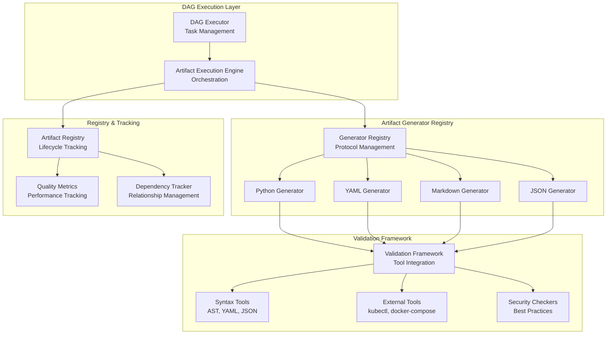

# Artifact-Driven Beast Mode Enhancement Design

## Overview

The Artifact-Driven Beast Mode Enhancement implements a systematic separation between DAG execution logic and artifact-specific implementation. This design enables Beast Mode to generate artifacts with explicit subtypes, validation rules, and completion criteria while maintaining the existing DAG execution capabilities.

**Design Principles:**
- **Separation of Concerns**: DAG logic handles task management; artifact generators handle implementation
- **Explicit Subtyping**: No generic artifacts allowed; every artifact has explicit subtype and validation
- **Systematic Validation**: Each artifact type has specific validation tools and acceptance criteria
- **Extensible Architecture**: New artifact types can be added without changing core DAG logic
- **Registry Integration**: All artifacts are systematically tracked with validation results

## Architecture

### High-Level Component Architecture



### Component Responsibilities

#### 1. DAG Execution Layer

**DAGTaskExecutor** (Existing)
- Manages task dependencies and execution waves
- Updates task status based on artifact generation results
- Provides parallel execution capabilities
- Remains unchanged - no artifact-specific logic

**ArtifactExecutionEngine** (New)
- Orchestrates artifact generation using DAG execution
- Delegates to appropriate artifact generators
- Manages artifact lifecycle from specification to completion
- Integrates validation results with task status

#### 2. Artifact Generator Framework

**ArtifactGenerator Protocol**
```python
class ArtifactGenerator(Protocol):
    def can_generate(self, artifact_type: ArtifactType, subtype: str = None) -> bool
    def generate_artifact(self, spec: ArtifactSpec) -> ArtifactResult
    def validate_artifact(self, artifact_path: str, spec: ArtifactSpec) -> Dict[str, bool]
    def get_definition_of_done(self, artifact_type: ArtifactType, subtype: str = None) -> List[str]
```

**Generator Registry**
- Maintains registry of available generators
- Routes artifact requests to appropriate generators
- Handles generator health monitoring and failover
- Supports dynamic generator registration

#### 3. Artifact Type Specifications

**ArtifactSpec Data Model**
```python
@dataclass
class ArtifactSpec:
    artifact_type: ArtifactType          # PYTHON_MODULE, YAML_CONFIG, etc.
    subtype: Optional[str]               # kubernetes_deployment, docker_compose, etc.
    target_path: str                     # Where to create the artifact
    requirements: List[str]              # Source requirements
    acceptance_criteria: List[str]       # Validation requirements
    definition_of_done: List[str]        # Completion criteria
    dependencies: List[str]              # Other artifacts needed
    metadata: Dict[str, Any]             # Additional context
```

**ArtifactResult Data Model**
```python
@dataclass
class ArtifactResult:
    success: bool                        # Overall success status
    artifact_path: str                   # Created artifact location
    artifact_type: ArtifactType          # Type of artifact created
    subtype: Optional[str]               # Specific subtype
    files_created: List[str]             # All files created
    files_modified: List[str]            # All files modified
    validation_results: Dict[str, bool]  # Validation check results
    quality_metrics: Dict[str, float]    # Quality measurements
    registry_entries: List[str]          # Registry entry IDs
    error_message: Optional[str]         # Error details if failed
```

## Detailed Component Design

### 1. Python Artifact Generator

**Responsibilities:**
- Generate RM-DDD compliant Python modules
- Create comprehensive test suites
- Validate Python syntax and imports
- Check RM-DDD compliance (ReflectiveModule inheritance)
- Run tests and measure coverage
- Register modules in system registry

**Definition of Done for Python Modules:**
```python
python_definition_of_done = [
    "Valid Python syntax with no syntax errors",
    "All imports resolve successfully", 
    "Inherits from ReflectiveModule (RM-DDD compliance)",
    "Implements all required RM-DDD methods",
    "Has working unit tests with >90% coverage",
    "All tests pass without errors",
    "Proper error handling and logging",
    "Registered in system registry",
    "Code complexity within acceptable limits",
    "Follows Python naming conventions"
]
```

**Validation Pipeline:**
1. **Syntax Validation**: AST parsing
2. **Import Validation**: Import resolution checking
3. **RM-DDD Validation**: ReflectiveModule compliance
4. **Test Generation**: Comprehensive test suite creation
5. **Test Execution**: pytest with coverage measurement
6. **Quality Analysis**: Complexity and style checking
7. **Registry Integration**: System registry entry creation

### 2. YAML Artifact Generator

**Responsibilities:**
- Generate YAML with explicit subtype specification
- Validate using subtype-specific tools (kubectl, docker-compose, etc.)
- Enforce security best practices per subtype
- Check operational requirements (resource limits, health checks, etc.)
- Register YAML artifacts with validation results

**Subtype-Specific Generators:**

**Kubernetes YAML Generator**
```python
kubernetes_definition_of_done = [
    "Valid YAML syntax with no parsing errors",
    "Conforms to Kubernetes API schema",
    "Passes kubectl dry-run validation",
    "Includes proper resource limits (CPU/memory)",
    "Has security context with non-root user", 
    "Uses proper labels and selectors",
    "No hardcoded secrets or sensitive data",
    "Follows Kubernetes security best practices",
    "Has readiness and liveness probes",
    "Includes proper annotations for monitoring"
]
```

**Docker Compose Generator**
```python
docker_compose_definition_of_done = [
    "Valid YAML syntax with no parsing errors",
    "Conforms to Docker Compose schema version 3.8+",
    "Passes docker-compose config validation",
    "All services have health checks defined",
    "No hardcoded secrets in environment variables",
    "Uses proper networking configuration",
    "Includes restart policies for all services",
    "Volume mounts are properly configured",
    "Port mappings are non-conflicting",
    "Environment variables use .env file references"
]
```

### 3. Validation Framework

**Tool Integration Architecture:**
```python
class ValidationFramework:
    def __init__(self):
        self.syntax_validators = {
            'python': PythonSyntaxValidator(),
            'yaml': YAMLSyntaxValidator(),
            'json': JSONSyntaxValidator()
        }
        
        self.external_tools = {
            'kubectl': KubectlValidator(),
            'docker-compose': DockerComposeValidator(),
            'pytest': PytestValidator()
        }
        
        self.security_checkers = {
            'kubernetes': KubernetesSecurityChecker(),
            'docker': DockerSecurityChecker(),
            'python': PythonSecurityChecker()
        }
```

**Validation Pipeline:**
1. **Syntax Validation**: Language-specific parsing
2. **Schema Validation**: Subtype-specific schema checking
3. **Tool Validation**: External tool validation (kubectl, etc.)
4. **Security Validation**: Security best practices checking
5. **Quality Validation**: Performance and maintainability metrics
6. **Integration Validation**: Dependency and compatibility checking

### 4. Registry Integration

**Artifact Registry Schema:**
```python
artifact_registry_entry = {
    'artifact_id': str,                    # Unique identifier
    'artifact_type': ArtifactType,         # PYTHON_MODULE, YAML_CONFIG, etc.
    'subtype': Optional[str],              # Specific subtype
    'file_path': str,                      # Persistent file location
    'requirements_traced': List[str],      # Source requirements
    'validation_results': Dict[str, bool], # All validation results
    'quality_metrics': Dict[str, float],   # Quality measurements
    'definition_of_done_met': bool,        # Overall completion status
    'created_at': datetime,                # Creation timestamp
    'validated_at': datetime,              # Last validation timestamp
    'dependencies': List[str],             # Other artifacts this depends on
    'dependents': List[str],               # Other artifacts that depend on this
    'generator_used': str,                 # Which generator created this
    'tool_versions': Dict[str, str],       # Validation tool versions used
    'security_score': float,               # Security compliance score
    'maintainability_score': float         # Code maintainability score
}
```

## Integration with Existing Beast Mode

### Task Specification Enhancement

**Enhanced Task Format:**
```markdown
- [ ] 1.1 Create Kubernetes Deployment YAML [k8s-deploy-a1b2]
  - **Artifact Type**: YAML_CONFIG
  - **Subtype**: kubernetes_deployment
  - **Target**: k8s/web-deployment.yaml
  - **Requirements**: Production-ready web service deployment with security
  - **Validation**: kubectl dry-run must pass, security context required
  - **Dependencies**: None
```

**Task Parsing Enhancement:**
```python
def parse_artifact_specification(task_content: str) -> ArtifactSpec:
    # Extract artifact type and subtype from task metadata
    artifact_type = extract_field(task_content, "Artifact Type")
    subtype = extract_field(task_content, "Subtype")
    target_path = extract_field(task_content, "Target")
    requirements = extract_field(task_content, "Requirements")
    
    return ArtifactSpec(
        artifact_type=ArtifactType(artifact_type),
        subtype=subtype,
        target_path=target_path,
        requirements=requirements.split(','),
        # ... other fields
    )
```

### DAG Execution Integration

**Enhanced Task Execution Flow:**
```python
def execute_artifact_task(task_file_path: str, task_identifier: str) -> ArtifactResult:
    # 1. Load task using existing DAG executor
    dag_executor.load_task_file(task_file_path)
    task_info = dag_executor.get_task_status(task_identifier)
    
    # 2. Update task to in_progress
    dag_executor.update_task_status(task_identifier, "in_progress")
    
    # 3. Parse artifact specification from task
    artifact_spec = parse_artifact_specification(task_content)
    
    # 4. Generate artifact using appropriate generator
    generator = find_generator(artifact_spec.artifact_type, artifact_spec.subtype)
    result = generator.generate_artifact(artifact_spec)
    
    # 5. Update task status based on definition of done
    if result.success and check_definition_of_done(result, artifact_spec):
        dag_executor.update_task_status(task_identifier, "completed")
    else:
        dag_executor.update_task_status(task_identifier, "failed")
    
    return result
```

## Error Handling and Recovery

### Systematic Error Categories

**1. Specification Errors**
- Missing artifact subtype specification
- Invalid artifact type or subtype
- Incomplete task metadata

**2. Generation Errors**
- Template processing failures
- File system permission issues
- Dependency resolution failures

**3. Validation Errors**
- Syntax validation failures
- Schema validation failures
- External tool validation failures
- Security validation failures

**4. Tool Integration Errors**
- Missing validation tools
- Tool version incompatibilities
- Tool execution failures

### Recovery Strategies

**Graceful Degradation:**
```python
def graceful_degradation_strategy(error_type: ErrorType, context: Dict[str, Any]) -> RecoveryAction:
    if error_type == ErrorType.MISSING_TOOL:
        return RecoveryAction.SKIP_TOOL_VALIDATION
    elif error_type == ErrorType.SYNTAX_ERROR:
        return RecoveryAction.PROVIDE_SYNTAX_HELP
    elif error_type == ErrorType.SECURITY_VIOLATION:
        return RecoveryAction.FAIL_WITH_SECURITY_DETAILS
    else:
        return RecoveryAction.FAIL_WITH_DIAGNOSTIC_INFO
```

## Performance and Scalability

### Performance Targets

- **Artifact Generation**: <5 seconds for typical artifacts
- **Validation Pipeline**: <10 seconds for comprehensive validation
- **Registry Operations**: <1 second for read/write operations
- **Generator Discovery**: <100ms for generator selection

### Scalability Considerations

- **Parallel Validation**: Multiple validation checks run concurrently
- **Generator Pooling**: Multiple generator instances for high throughput
- **Registry Sharding**: Artifact registry partitioned by type/date
- **Caching**: Validation results cached for identical artifacts

## Security Considerations

### Artifact Security

- **Input Validation**: All artifact specifications validated before processing
- **Output Sanitization**: Generated artifacts checked for security violations
- **Tool Isolation**: External validation tools run in isolated environments
- **Secret Management**: No secrets stored in generated artifacts

### System Security

- **Generator Isolation**: Generators run with minimal privileges
- **File System Access**: Restricted to designated artifact directories
- **Network Access**: Limited to required validation endpoints
- **Audit Logging**: All artifact operations logged for security analysis

This design provides a systematic foundation for artifact-driven Beast Mode enhancement while maintaining compatibility with existing DAG execution capabilities.