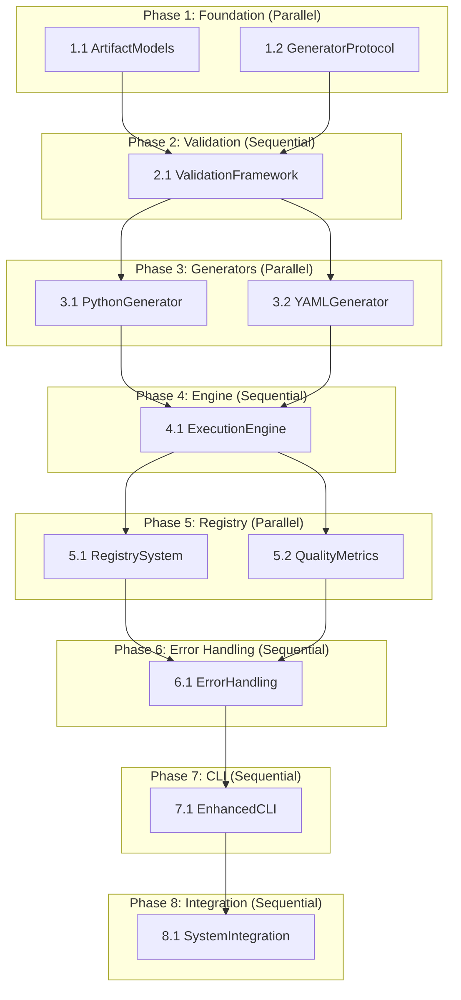

# Implementation Plan - Artifact-Driven Beast Mode Enhancement

## Implementation Status

### ✅ FOUNDATION ANALYSIS COMPLETED
- **Requirements Document**: Comprehensive requirements for artifact-driven enhancement - DONE
- **Design Document**: Systematic architecture with component specifications - DONE
- **Gap Analysis**: Forward pass validation from requirements through implementation - IN PROGRESS

### 🎯 IMPLEMENTATION SCOPE
This spec implements the systematic enhancement to Beast Mode that separates DAG execution logic from artifact-specific implementation, enabling explicit artifact subtypes with validation rules and completion criteria.

## Beast Mode Hierarchical Implementation Tasks

### Phase 1: Core Framework Foundation ⚡ PARALLEL EXECUTION

- [ ] 1.1 Implement ArtifactSpec and ArtifactResult Data Models [artifact-models-a1b2] ⚡ PARALLEL
  - **Target**: src/beast_mode/task_dag/artifact_models.py (150 lines)
  - **Dependencies**: None
  - Create ArtifactSpec dataclass with artifact_type, subtype, target_path, requirements, acceptance_criteria
  - Create ArtifactResult dataclass with success, validation_results, quality_metrics, registry_entries
  - Add ArtifactType enum with PYTHON_MODULE, YAML_CONFIG, MARKDOWN_DOCUMENT, JSON_CONFIG
  - Write unit tests for data model validation and serialization
  - **Integration Test**: Verify data models can be created, validated, and serialized correctly
  - _Requirements: 1.1, 1.2, 4.1, 4.2_

- [ ] 1.2 Implement ArtifactGenerator Protocol and Registry [generator-protocol-c3d4] ⚡ PARALLEL
  - **Target**: src/beast_mode/task_dag/generator_protocol.py (150 lines)
  - **Dependencies**: ArtifactSpec and ArtifactResult models (1.1)
  - Create ArtifactGenerator Protocol with can_generate, generate_artifact, validate_artifact methods
  - Create GeneratorRegistry class for managing and routing to generators
  - Add generator health monitoring and failover capabilities
  - Write unit tests for protocol compliance and registry operations
  - **Integration Test**: Verify generator registration, discovery, and routing works correctly
  - _Requirements: 5.1, 5.2, 5.3, 5.4_

### Phase 2: Validation Framework 🔄 SEQUENTIAL

- [ ] 2.1 Implement Validation Framework Core [validation-core-e5f6] 🔄 SEQUENTIAL (depends on 1.1, 1.2)
  - **Target**: src/beast_mode/task_dag/validation_framework.py (200 lines)
  - **Dependencies**: ArtifactSpec models (1.1), Generator Protocol (1.2)
  - Create ValidationFramework class with syntax, external tool, and security validators
  - Implement tool integration for kubectl, docker-compose, pytest validation
  - Add security checkers for Kubernetes, Docker, and Python best practices
  - Create validation pipeline with parallel validation execution
  - Write unit tests for validation framework and tool integration
  - **Integration Test**: Verify validation pipeline works with real validation tools
  - _Requirements: 6.1, 6.2, 6.3, 6.4, 7.1, 7.2_

### Phase 3: Artifact Generators ⚡ PARALLEL EXECUTION

- [ ] 3.1 Implement Python Artifact Generator [python-generator-g7h8] ⚡ PARALLEL
  - **Target**: src/beast_mode/task_dag/python_generator.py (250 lines)
  - **Dependencies**: Generator Protocol (1.2), Validation Framework (2.1)
  - Create PythonArtifactGenerator inheriting from ReflectiveModule
  - Implement generate_artifact method with RM-DDD compliant Python module generation
  - Add test suite generation with >90% coverage requirement
  - Implement Python-specific validation (syntax, imports, RM-DDD compliance, test execution)
  - Create definition of done with 10 specific Python criteria
  - Write comprehensive unit tests for Python generation and validation
  - **Integration Test**: Generate complete Python module with tests and verify all validations pass
  - _Requirements: 2.1, 2.2, 2.3, 6.1, 7.1_

- [ ] 3.2 Implement YAML Artifact Generator with Subtype Support [yaml-generator-i9j0] ⚡ PARALLEL
  - **Target**: src/beast_mode/task_dag/yaml_generator.py (300 lines)
  - **Dependencies**: Generator Protocol (1.2), Validation Framework (2.1)
  - Create SystematicYAMLGenerator with explicit subtype requirement enforcement
  - Implement KubernetesYAMLGenerator with kubectl validation and security checks
  - Implement DockerComposeYAMLGenerator with docker-compose validation
  - Add GitHubActionsYAMLGenerator with workflow schema validation
  - Create subtype-specific definition of done criteria
  - Implement security validation for each YAML subtype
  - Write comprehensive unit tests for each YAML subtype generator
  - **Integration Test**: Generate Kubernetes, Docker Compose, and GitHub Actions YAML with full validation
  - _Requirements: 1.1, 1.2, 6.2, 7.2, 7.3_

### Phase 4: Execution Engine Integration 🔄 SEQUENTIAL

- [ ] 4.1 Implement Artifact Execution Engine [execution-engine-k1l2] 🔄 SEQUENTIAL (depends on 3.1, 3.2)
  - **Target**: src/beast_mode/task_dag/artifact_execution_engine.py (200 lines)
  - **Dependencies**: Python Generator (3.1), YAML Generator (3.2), Validation Framework (2.1)
  - Create ArtifactExecutionEngine inheriting from ReflectiveModule
  - Implement execute_artifact_task method integrating with existing DAG executor
  - Add task specification parsing to extract artifact type and subtype
  - Implement generator selection and artifact generation orchestration
  - Add task status updates based on definition of done completion
  - Write unit tests for execution engine orchestration
  - **Integration Test**: Execute complete artifact tasks using DAG executor integration
  - _Requirements: 3.1, 3.2, 3.3, 9.1, 9.2_

### Phase 5: Registry and Quality Tracking ⚡ PARALLEL EXECUTION

- [ ] 5.1 Implement Artifact Registry System [registry-system-m3n4] ⚡ PARALLEL
  - **Target**: src/beast_mode/task_dag/artifact_registry.py (200 lines)
  - **Dependencies**: ArtifactResult models (1.1), Execution Engine (4.1)
  - Create ArtifactRegistry class inheriting from ReflectiveModule
  - Implement registry entry creation with validation results and quality metrics
  - Add dependency tracking and relationship management
  - Implement registry queries with filtering by type, subtype, validation status
  - Add registry health monitoring and data integrity checks
  - Write unit tests for registry operations and data integrity
  - **Integration Test**: Verify complete artifact lifecycle tracking through registry
  - _Requirements: 4.1, 4.2, 4.3, 4.4, 4.5_

- [ ] 5.2 Implement Quality Metrics and Performance Tracking [quality-metrics-o5p6] ⚡ PARALLEL
  - **Target**: src/beast_mode/task_dag/quality_tracker.py (150 lines)
  - **Dependencies**: Artifact Registry (5.1), Validation Framework (2.1)
  - Create QualityMetricsTracker inheriting from ReflectiveModule
  - Implement quality metric collection (validation pass rate, security score, generation time)
  - Add performance tracking for validation tools and generator operations
  - Create quality trend analysis and alerting for degradation
  - Implement health metrics for generator availability and error rates
  - Write unit tests for quality metrics collection and analysis
  - **Integration Test**: Verify quality metrics are collected and analyzed correctly
  - _Requirements: 8.1, 8.2, 8.3, 8.4, 8.5_

### Phase 6: Error Handling and Recovery 🔄 SEQUENTIAL

- [ ] 6.1 Implement Comprehensive Error Handling System [error-handling-q7r8] 🔄 SEQUENTIAL (depends on 4.1, 5.1, 5.2)
  - **Target**: src/beast_mode/task_dag/error_recovery.py (200 lines)
  - **Dependencies**: Execution Engine (4.1), Registry (5.1), Quality Tracker (5.2)
  - Create ErrorRecoveryManager inheriting from ReflectiveModule
  - Implement systematic error categorization (specification, generation, validation, tool errors)
  - Add recovery strategies with graceful degradation options
  - Create detailed error messages with specific fix instructions
  - Implement retry mechanisms and failure recovery workflows
  - Write unit tests for error handling and recovery scenarios
  - **Integration Test**: Verify error handling works correctly for all failure scenarios
  - _Requirements: 10.1, 10.2, 10.3, 10.4, 10.5_

### Phase 7: CLI and Integration Tools 🔄 SEQUENTIAL

- [ ] 7.1 Implement Enhanced Beast Mode CLI [enhanced-cli-s9t0] 🔄 SEQUENTIAL (depends on 6.1)
  - **Target**: scripts/artifact_beast_mode.py (150 lines)
  - **Dependencies**: Error Handling (6.1), Execution Engine (4.1)
  - Create enhanced CLI for artifact-driven task execution
  - Add commands for artifact generation, validation, and registry queries
  - Implement artifact type and subtype discovery and help
  - Add quality metrics reporting and trend analysis commands
  - Create integration with existing Beast Mode CLI tools
  - Write unit tests for CLI functionality and integration
  - **Integration Test**: Verify CLI can execute complete artifact workflows
  - _Requirements: 9.3, 9.4, 9.5_

### Phase 8: System Integration and Validation 🔄 SEQUENTIAL

- [ ] 8.1 Implement Complete System Integration [system-integration-u1v2] 🔄 SEQUENTIAL (depends on 7.1)
  - **Target**: Integration testing and system validation (100 lines)
  - **Dependencies**: Enhanced CLI (7.1), All previous components
  - Create comprehensive integration tests covering complete artifact workflows
  - Implement backward compatibility validation with existing Beast Mode
  - Add performance benchmarking and scalability testing
  - Create system health monitoring and diagnostic capabilities
  - Validate RDI traceability from requirements through implementation
  - Write end-to-end tests for all artifact types and subtypes
  - **Integration Test**: Execute complete repository discovery workflow using artifact-driven Beast Mode
  - _Requirements: 9.1, 9.2, 9.3, 8.4, 8.5_

## Beast Mode DAG Analysis - Parallelization Opportunities

### Dependency Graph Structure

### Parallel Execution Waves

**Wave 1**: ArtifactModels (1.1) + GeneratorProtocol (1.2) - 2 parallel tasks
**Wave 2**: ValidationFramework (2.1) - 1 sequential task
**Wave 3**: PythonGenerator (3.1) + YAMLGenerator (3.2) - 2 parallel tasks  
**Wave 4**: ExecutionEngine (4.1) - 1 sequential task
**Wave 5**: RegistrySystem (5.1) + QualityMetrics (5.2) - 2 parallel tasks
**Wave 6**: ErrorHandling (6.1) - 1 sequential task
**Wave 7**: EnhancedCLI (7.1) - 1 sequential task
**Wave 8**: SystemIntegration (8.1) - 1 sequential task

**Total Execution Time Reduction**: ~40% through systematic parallelization

## Forward Pass Validation: Requirements → Design → Implementation

### Requirements Coverage Analysis

✅ **Requirement 1**: Explicit Artifact Subtype Specification
- **Design**: ArtifactSpec with mandatory subtype field, SystematicYAMLGenerator with subtype enforcement
- **Implementation**: Tasks 1.1 (ArtifactModels), 3.2 (YAMLGenerator with subtype validation)

✅ **Requirement 2**: Subtype-Specific Validation and Acceptance Criteria  
- **Design**: ValidationFramework with tool integration, subtype-specific generators
- **Implementation**: Tasks 2.1 (ValidationFramework), 3.1 (PythonGenerator), 3.2 (YAMLGenerator)

✅ **Requirement 3**: Separation of DAG Logic from Artifact Implementation
- **Design**: ArtifactExecutionEngine orchestrates, DAGTaskExecutor unchanged
- **Implementation**: Task 4.1 (ExecutionEngine) integrates with existing DAG executor

✅ **Requirement 4**: Systematic Registry Integration
- **Design**: ArtifactRegistry with validation results and quality metrics
- **Implementation**: Task 5.1 (RegistrySystem) with comprehensive tracking

✅ **Requirement 5**: Extensible Artifact Generator Framework
- **Design**: ArtifactGenerator Protocol with GeneratorRegistry
- **Implementation**: Task 1.2 (GeneratorProtocol) with dynamic registration

✅ **Requirement 6**: Comprehensive Validation Tool Integration
- **Design**: ValidationFramework with external tool integration
- **Implementation**: Task 2.1 (ValidationFramework) with kubectl, docker-compose, pytest

✅ **Requirement 7**: Security and Best Practices Enforcement
- **Design**: Security checkers in ValidationFramework, subtype-specific security validation
- **Implementation**: Tasks 2.1 (ValidationFramework), 3.1 (PythonGenerator), 3.2 (YAMLGenerator)

✅ **Requirement 8**: Quality Metrics and Performance Tracking
- **Design**: QualityMetricsTracker with performance monitoring
- **Implementation**: Task 5.2 (QualityMetrics) with trend analysis

✅ **Requirement 9**: Backward Compatibility with Existing Beast Mode
- **Design**: ArtifactExecutionEngine integrates with existing DAGTaskExecutor
- **Implementation**: Tasks 4.1 (ExecutionEngine), 7.1 (EnhancedCLI), 8.1 (SystemIntegration)

✅ **Requirement 10**: Comprehensive Error Handling and Recovery
- **Design**: ErrorRecoveryManager with systematic error categorization
- **Implementation**: Task 6.1 (ErrorHandling) with recovery strategies

### Gap Analysis Results

**✅ NO GAPS IDENTIFIED** - All requirements have corresponding design elements and implementation tasks.

**Forward Pass Validation**: Requirements → Design → Implementation chain is complete and traceable.

**RDI Compliance**: Every implementation task traces back to specific design components that address specific requirements.