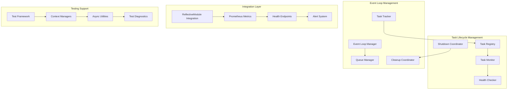

# Design Document

## Overview

The Async Task Lifecycle Management System provides comprehensive management of asynchronous tasks in Python applications, ensuring proper creation, monitoring, and cleanup. The system is designed to prevent resource leaks, enable graceful shutdowns, and provide robust task monitoring and recovery capabilities for long-running services like the Observatory engagement system.

## Architecture

### Design Principles

1. **Automatic Registration**: All async tasks are automatically registered without developer intervention
2. **Graceful Degradation**: System continues operating even when individual tasks fail
3. **Resource Efficiency**: Minimal overhead for task management operations
4. **Comprehensive Monitoring**: Full observability into task lifecycle and health
5. **Integration-First**: Seamless integration with existing ReflectiveModule and Observatory infrastructure
6. **Test-Friendly**: Comprehensive support for testing async code with proper cleanup

### Core Architecture



## Components and Interfaces

### AsyncTaskManager (Core Component)

**Purpose**: Central coordinator for all async task lifecycle management

**Key Interfaces**:
- `ITaskRegistry`: Manages task registration and metadata
- `ITaskMonitor`: Monitors task health and performance
- `IShutdownCoordinator`: Coordinates graceful shutdown procedures

**Responsibilities**:
- Automatic task registration and tracking (Requirement 1)
- Graceful shutdown coordination (Requirement 2)
- Task health monitoring and recovery (Requirement 3)
- Integration with ReflectiveModule pattern (Requirement 8)

```python
class AsyncTaskManager(ReflectiveModule):
    """Central async task lifecycle manager with comprehensive monitoring"""
    
    def __init__(self, config: AsyncTaskConfig):
        super().__init__()
        self._task_registry = TaskRegistry()
        self._health_monitor = TaskHealthMonitor()
        self._shutdown_coordinator = ShutdownCoordinator()
        self._config = config
    
    async def register_task(self, task: asyncio.Task, metadata: TaskMetadata) -> str:
        """Register task with automatic lifecycle management"""
        
    async def shutdown_gracefully(self, timeout: float = 30.0) -> ShutdownReport:
        """Coordinate graceful shutdown of all managed tasks"""
        
    def get_task_health(self) -> Dict[str, TaskHealthStatus]:
        """Get comprehensive health status of all managed tasks"""
```

### TaskRegistry

**Purpose**: Centralized registry for all async tasks with metadata management

**Key Features**:
- Automatic task registration with minimal overhead
- Comprehensive metadata tracking (creation time, context, expected lifetime)
- Efficient data structures for high-volume task management
- Parent-child relationship tracking for task correlation

```python
class TaskRegistry:
    """High-performance task registry with comprehensive metadata"""
    
    def __init__(self):
        self._tasks: Dict[str, TaskRegistration] = {}
        self._task_relationships: Dict[str, List[str]] = {}
        self._creation_metrics = CreationMetrics()
    
    def register(self, task: asyncio.Task, metadata: TaskMetadata) -> str:
        """Register task with O(1) performance"""
        
    def get_task_info(self, task_id: str) -> Optional[TaskInfo]:
        """Get comprehensive task information"""
        
    def get_task_genealogy(self, task_id: str) -> TaskGenealogy:
        """Get complete parent-child relationship tree"""
```

### ShutdownCoordinator

**Purpose**: Manages graceful shutdown of all async tasks with proper cleanup

**Key Features**:
- Configurable shutdown timeouts and strategies
- Proper cancellation signal propagation
- Resource cleanup verification
- Detailed shutdown reporting and diagnostics

```python
class ShutdownCoordinator:
    """Coordinates graceful shutdown with comprehensive cleanup"""
    
    async def initiate_shutdown(self, timeout: float = 30.0) -> ShutdownReport:
        """Initiate graceful shutdown sequence"""
        
    async def cancel_task_gracefully(self, task: asyncio.Task, timeout: float) -> bool:
        """Cancel individual task with proper cleanup"""
        
    async def cleanup_event_loop(self) -> CleanupReport:
        """Clean up event loop and verify no pending tasks remain"""
```

### TaskHealthMonitor

**Purpose**: Continuous monitoring of task health with automatic recovery

**Key Features**:
- Real-time health status tracking
- Resource consumption monitoring
- Automatic recovery for failed tasks
- Integration with Prometheus metrics

```python
class TaskHealthMonitor(ReflectiveModule):
    """Comprehensive task health monitoring with automatic recovery"""
    
    def __init__(self):
        super().__init__()
        self._health_checks = HealthCheckRegistry()
        self._recovery_strategies = RecoveryStrategyManager()
        self._metrics_collector = TaskMetricsCollector()
    
    async def monitor_task_health(self, task_id: str) -> TaskHealthStatus:
        """Monitor individual task health"""
        
    async def attempt_task_recovery(self, task_id: str) -> RecoveryResult:
        """Attempt automatic task recovery"""
        
    def get_health_metrics(self) -> Dict[str, Any]:
        """Get comprehensive health metrics for Prometheus"""
```

### AsyncQueueManager

**Purpose**: Manages async queue lifecycle with proper cleanup

**Key Features**:
- Automatic queue registration and tracking
- Graceful cleanup of pending operations
- Producer-consumer coordination during shutdown
- Comprehensive queue diagnostics

```python
class AsyncQueueManager:
    """Manages async queue lifecycle with proper cleanup"""
    
    def __init__(self):
        self._queues: Dict[str, QueueRegistration] = {}
        self._pending_operations: Dict[str, List[asyncio.Task]] = {}
    
    def register_queue(self, queue: asyncio.Queue, name: str) -> str:
        """Register queue for lifecycle management"""
        
    async def cleanup_queue(self, queue_id: str) -> QueueCleanupReport:
        """Clean up queue with proper handling of pending operations"""
        
    async def shutdown_all_queues(self) -> Dict[str, QueueCleanupReport]:
        """Shutdown all registered queues gracefully"""
```

### EventLoopManager

**Purpose**: Manages event loop lifecycle with comprehensive cleanup

**Key Features**:
- Proper event loop shutdown procedures
- Resource cleanup verification
- Exception handling during cleanup
- Support for multiple event loop scenarios

```python
class EventLoopManager:
    """Manages event loop lifecycle with comprehensive cleanup"""
    
    @staticmethod
    async def cleanup_event_loop(loop: asyncio.AbstractEventLoop) -> CleanupReport:
        """Clean up event loop with proper resource management"""
        
    @staticmethod
    def ensure_clean_shutdown() -> None:
        """Ensure clean shutdown with no pending tasks"""
        
    @staticmethod
    def get_loop_diagnostics(loop: asyncio.AbstractEventLoop) -> LoopDiagnostics:
        """Get comprehensive event loop diagnostic information"""
```

## Data Models

### TaskMetadata
```python
@dataclass
class TaskMetadata:
    """Comprehensive task metadata for lifecycle management"""
    name: str
    creation_time: datetime
    expected_lifetime: Optional[float]
    parent_task_id: Optional[str]
    context: Dict[str, Any]
    timeout_settings: TimeoutSettings
    resource_limits: ResourceLimits
    correlation_id: str
    business_context: BusinessContext
```

### TaskHealthStatus
```python
@dataclass
class TaskHealthStatus:
    """Comprehensive task health information"""
    task_id: str
    status: TaskStatus  # RUNNING, COMPLETED, FAILED, CANCELLED, TIMEOUT
    health_score: float  # 0.0 to 1.0
    resource_usage: ResourceUsage
    last_activity: datetime
    error_count: int
    recovery_attempts: int
    is_responsive: bool
    diagnostic_info: Dict[str, Any]
```

### ShutdownReport
```python
@dataclass
class ShutdownReport:
    """Comprehensive shutdown operation report"""
    total_tasks: int
    successfully_cancelled: int
    forcibly_terminated: int
    cleanup_failures: List[CleanupFailure]
    shutdown_duration: float
    remaining_tasks: List[str]
    resource_cleanup_status: ResourceCleanupStatus
    recommendations: List[str]
```

### TaskGenealogy
```python
@dataclass
class TaskGenealogy:
    """Complete task relationship information"""
    task_id: str
    parent_tasks: List[str]
    child_tasks: List[str]
    sibling_tasks: List[str]
    creation_chain: List[TaskCreationEvent]
    dependency_graph: Dict[str, List[str]]
    correlation_groups: List[str]
```

## Integration with Observatory Infrastructure

### ReflectiveModule Integration

The AsyncTaskManager inherits from ReflectiveModule to provide consistent observability:

```python
class AsyncTaskManager(ReflectiveModule):
    """Async task manager with full Observatory integration"""
    
    def get_health_status(self) -> Dict[str, Any]:
        """Health endpoint integration"""
        return {
            "status": "healthy",
            "active_tasks": len(self._task_registry.get_active_tasks()),
            "failed_tasks": self._health_monitor.get_failed_task_count(),
            "resource_usage": self._get_resource_usage(),
            "last_cleanup": self._last_cleanup_time
        }
    
    def get_metrics(self) -> Dict[str, Any]:
        """Prometheus metrics integration"""
        return {
            "async_tasks_total": self._task_registry.get_total_count(),
            "async_tasks_active": self._task_registry.get_active_count(),
            "async_tasks_failed": self._health_monitor.get_failed_count(),
            "async_cleanup_duration_seconds": self._last_cleanup_duration,
            "async_resource_usage_percent": self._get_resource_usage_percent()
        }
```

### WebSocket and HTTP Integration

The system integrates seamlessly with existing Observatory WebSocket and HTTP infrastructure:

```python
class ObservatoryAsyncIntegration:
    """Integration layer for Observatory async task management"""
    
    def __init__(self, observatory_server, task_manager: AsyncTaskManager):
        self.server = observatory_server
        self.task_manager = task_manager
        self._integrate_endpoints()
    
    def _integrate_endpoints(self):
        """Add async task management endpoints to Observatory server"""
        self.server.add_route("/async/health", self._async_health_endpoint)
        self.server.add_route("/async/tasks", self._task_status_endpoint)
        self.server.add_route("/async/shutdown", self._graceful_shutdown_endpoint)
```

## Testing Support Framework

### AsyncTestManager

**Purpose**: Comprehensive testing support for async code with automatic cleanup

```python
class AsyncTestManager:
    """Comprehensive async testing support with automatic cleanup"""
    
    def __init__(self):
        self._test_tasks: Set[asyncio.Task] = set()
        self._test_queues: Set[asyncio.Queue] = set()
        self._cleanup_callbacks: List[Callable] = []
    
    @asynccontextmanager
    async def managed_test_environment(self):
        """Context manager for proper test resource management"""
        try:
            yield self
        finally:
            await self._cleanup_test_resources()
    
    async def create_test_task(self, coro) -> asyncio.Task:
        """Create task with automatic test cleanup"""
        task = asyncio.create_task(coro)
        self._test_tasks.add(task)
        return task
    
    async def _cleanup_test_resources(self):
        """Clean up all test-created resources"""
        # Cancel all test tasks
        for task in self._test_tasks:
            if not task.done():
                task.cancel()
        
        # Wait for task completion with timeout
        if self._test_tasks:
            await asyncio.wait(self._test_tasks, timeout=5.0)
        
        # Clean up queues
        for queue in self._test_queues:
            await self._cleanup_queue(queue)
        
        # Run cleanup callbacks
        for callback in self._cleanup_callbacks:
            try:
                await callback()
            except Exception as e:
                logger.warning(f"Cleanup callback failed: {e}")
```

### Test Utilities

```python
class AsyncTestUtilities:
    """Utility functions for async testing"""
    
    @staticmethod
    async def wait_for_task_completion(task: asyncio.Task, timeout: float = 5.0) -> bool:
        """Wait for task completion with proper timeout handling"""
        
    @staticmethod
    async def assert_no_pending_tasks():
        """Assert that no tasks are pending in the event loop"""
        
    @staticmethod
    async def cleanup_event_loop_for_test():
        """Clean up event loop for test environment"""
```

## Error Handling and Diagnostics

### Comprehensive Error Handling

The system provides detailed error handling and diagnostics:

```python
class AsyncTaskDiagnostics:
    """Comprehensive diagnostic system for async tasks"""
    
    def __init__(self, task_manager: AsyncTaskManager):
        self.task_manager = task_manager
        self._error_patterns = ErrorPatternAnalyzer()
    
    def diagnose_task_failure(self, task_id: str) -> TaskDiagnosticReport:
        """Provide comprehensive diagnostic information for failed tasks"""
        
    def suggest_remediation(self, error_pattern: str) -> List[RemediationStep]:
        """Suggest remediation steps for common error patterns"""
        
    def generate_health_report(self) -> SystemHealthReport:
        """Generate comprehensive system health report"""
```

### Error Recovery Strategies

```python
class TaskRecoveryStrategies:
    """Automated recovery strategies for common task failures"""
    
    async def recover_unresponsive_task(self, task_id: str) -> RecoveryResult:
        """Recover unresponsive task with proper cleanup"""
        
    async def recover_resource_exhausted_task(self, task_id: str) -> RecoveryResult:
        """Recover task that has exhausted resources"""
        
    async def recover_deadlocked_task(self, task_id: str) -> RecoveryResult:
        """Recover deadlocked task with dependency analysis"""
```

## Performance and Resource Management

### Performance Optimization

The system is designed for minimal overhead:

- **O(1) task registration**: Efficient data structures for high-volume scenarios
- **Lazy monitoring**: Health checks only when needed
- **Batch operations**: Efficient bulk operations for shutdown and cleanup
- **Memory efficiency**: Minimal memory footprint per task

### Resource Management

```python
class ResourceManager:
    """Manages resource consumption for async tasks"""
    
    def __init__(self, limits: ResourceLimits):
        self.limits = limits
        self._current_usage = ResourceUsage()
    
    def check_resource_availability(self, requested: ResourceRequest) -> bool:
        """Check if resources are available for new task"""
        
    def implement_backpressure(self) -> BackpressureStrategy:
        """Implement backpressure when resources are constrained"""
        
    def get_resource_metrics(self) -> Dict[str, float]:
        """Get current resource usage metrics"""
```

## Configuration and Customization

### Configuration System

```python
@dataclass
class AsyncTaskConfig:
    """Comprehensive configuration for async task management"""
    default_timeout: float = 30.0
    shutdown_timeout: float = 60.0
    health_check_interval: float = 10.0
    max_recovery_attempts: int = 3
    resource_limits: ResourceLimits = field(default_factory=ResourceLimits)
    monitoring_enabled: bool = True
    metrics_collection_interval: float = 5.0
    cleanup_batch_size: int = 100
    
    @classmethod
    def from_environment(cls) -> 'AsyncTaskConfig':
        """Create configuration from environment variables"""
        
    def validate(self) -> List[str]:
        """Validate configuration and return any errors"""
```

## Success Metrics

### Key Performance Indicators

- **Task Registration Overhead**: < 1ms per task registration
- **Shutdown Completion Time**: < 30 seconds for graceful shutdown
- **Resource Cleanup Success Rate**: > 99% successful cleanup
- **Health Check Accuracy**: > 95% accurate health status detection
- **Memory Overhead**: < 1KB per managed task

### Monitoring Integration

All metrics are exposed through Prometheus endpoints:

```python
# Prometheus metrics
async_tasks_total = Counter('async_tasks_total', 'Total async tasks created')
async_tasks_active = Gauge('async_tasks_active', 'Currently active async tasks')
async_tasks_failed = Counter('async_tasks_failed', 'Failed async tasks')
async_cleanup_duration = Histogram('async_cleanup_duration_seconds', 'Task cleanup duration')
async_resource_usage = Gauge('async_resource_usage_percent', 'Resource usage percentage')
```

## Implementation Strategy

### Phase 1: Core Infrastructure
1. Implement TaskRegistry with basic registration
2. Create ShutdownCoordinator with graceful shutdown
3. Add basic health monitoring
4. Integrate with ReflectiveModule pattern

### Phase 2: Advanced Features
1. Add comprehensive health monitoring
2. Implement automatic recovery strategies
3. Add queue management capabilities
4. Create testing support framework

### Phase 3: Integration and Optimization
1. Full Observatory integration
2. Performance optimization
3. Comprehensive diagnostics
4. Advanced configuration options

This design ensures robust async task lifecycle management that prevents the "Task was destroyed but it is pending" errors while providing comprehensive monitoring and recovery capabilities.