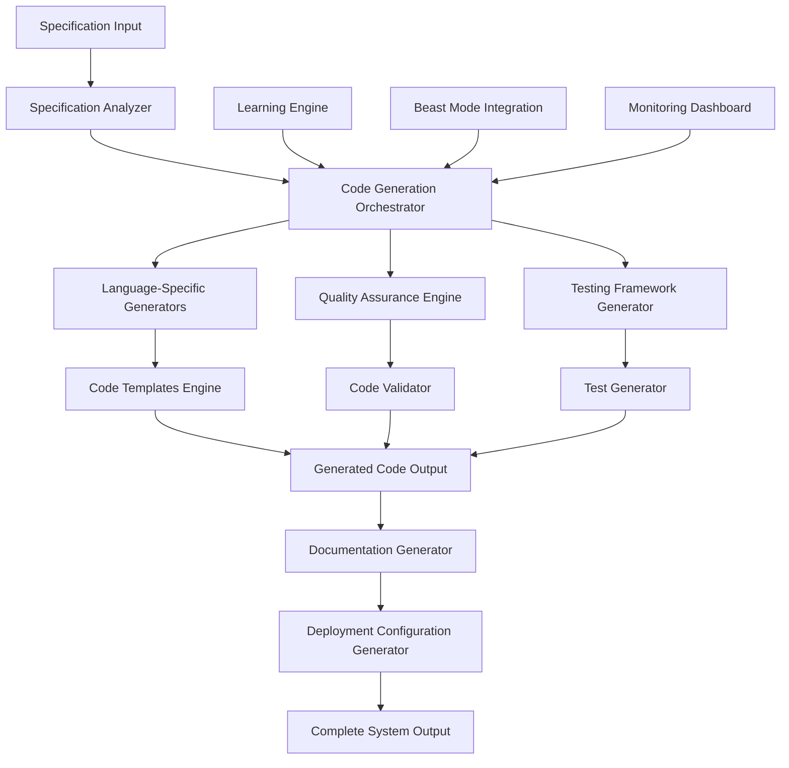

# Beast Mode Autonomous Code Generation Engine Design

## Overview

The Beast Mode Autonomous Code Generation Engine is a sophisticated AI-powered system that transforms specifications into production-ready code with systematic precision. The system leverages advanced language models, systematic templates, and continuous learning to generate high-quality, tested, and documented code across multiple programming languages.

## Architecture

### High-Level Architecture



### Core Components Architecture

The system follows a modular, plugin-based architecture with systematic separation of concerns:

1. **Specification Processing Layer**
   - Specification Parser and Analyzer
   - Requirements Extraction Engine
   - Design Pattern Recognition
   - Dependency Analysis

2. **Code Generation Core**
   - Multi-Language Generation Engine
   - Template Management System
   - Pattern Application Engine
   - Code Structure Optimizer

3. **Quality Assurance Layer**
   - Systematic Code Validation
   - Test Generation Engine
   - Coverage Analysis
   - Performance Optimization

4. **Integration and Deployment Layer**
   - Beast Mode Integration
   - CI/CD Configuration Generation
   - Documentation Generation
   - Monitoring and Alerting Setup

## Components and Interfaces

### 1. Specification Analyzer

**Purpose:** Systematically analyze input specifications to extract actionable code generation requirements.

**Key Interfaces:**
```python
class SpecificationAnalyzer:
    def analyze_specification(self, spec_directory: str) -> SpecificationAnalysis
    def extract_requirements(self, requirements_md: str) -> List[Requirement]
    def parse_design_patterns(self, design_md: str) -> List[DesignPattern]
    def identify_dependencies(self, tasks_md: str) -> DependencyGraph
```

**Responsibilities:**
- Parse requirements.md, design.md, and tasks.md files
- Extract functional and non-functional requirements
- Identify architectural patterns and constraints
- Map dependencies and integration points

### 2. Code Generation Orchestrator

**Purpose:** Coordinate the entire code generation process with systematic precision.

**Key Interfaces:**
```python
class CodeGenerationOrchestrator:
    def generate_system(self, spec_analysis: SpecificationAnalysis, 
                       target_languages: List[str]) -> GenerationResult
    def orchestrate_generation_pipeline(self, generation_plan: GenerationPlan) -> ExecutionResult
    def monitor_generation_progress(self, generation_id: str) -> ProgressStatus
    def handle_generation_failures(self, failure_context: FailureContext) -> RecoveryPlan
```

**Responsibilities:**
- Create systematic generation plans
- Coordinate multi-language code generation
- Monitor progress and handle failures
- Integrate with Beast Mode orchestration

### 3. Language-Specific Generators

**Purpose:** Generate idiomatic code for specific programming languages.

**Key Interfaces:**
```python
class LanguageGenerator(ABC):
    def generate_code(self, spec: CodeSpecification) -> GeneratedCode
    def apply_language_patterns(self, code: GeneratedCode) -> GeneratedCode
    def validate_syntax(self, code: GeneratedCode) -> ValidationResult
    def optimize_performance(self, code: GeneratedCode) -> GeneratedCode

class PythonGenerator(LanguageGenerator):
    def generate_classes(self, class_specs: List[ClassSpec]) -> List[PythonClass]
    def generate_functions(self, function_specs: List[FunctionSpec]) -> List[PythonFunction]
    def apply_pep8_standards(self, code: PythonCode) -> PythonCode

class TypeScriptGenerator(LanguageGenerator):
    def generate_interfaces(self, interface_specs: List[InterfaceSpec]) -> List[TSInterface]
    def generate_classes(self, class_specs: List[ClassSpec]) -> List[TSClass]
    def apply_typescript_patterns(self, code: TSCode) -> TSCode
```

**Responsibilities:**
- Generate language-specific code structures
- Apply language best practices and conventions
- Ensure type safety and performance optimization
- Handle language-specific error patterns

### 4. Quality Assurance Engine

**Purpose:** Ensure generated code meets systematic quality standards.

**Key Interfaces:**
```python
class QualityAssuranceEngine:
    def validate_code_quality(self, generated_code: GeneratedCode) -> QualityReport
    def generate_unit_tests(self, code: GeneratedCode) -> TestSuite
    def calculate_coverage(self, code: GeneratedCode, tests: TestSuite) -> CoverageReport
    def apply_quality_gates(self, quality_report: QualityReport) -> QualityGateResult
```

**Responsibilities:**
- Validate code against quality metrics
- Generate comprehensive test suites
- Ensure >90% test coverage
- Apply systematic quality gates

### 5. Template Management System

**Purpose:** Manage and apply systematic code generation templates.

**Key Interfaces:**
```python
class TemplateManager:
    def load_templates(self, language: str, pattern: str) -> List[CodeTemplate]
    def customize_template(self, template: CodeTemplate, customizations: Dict) -> CodeTemplate
    def validate_template(self, template: CodeTemplate) -> ValidationResult
    def update_template_library(self, new_templates: List[CodeTemplate]) -> UpdateResult
```

**Responsibilities:**
- Manage language-specific templates
- Support template customization
- Validate template compatibility
- Enable systematic template evolution

## Data Models

### Core Data Structures

```python
@dataclass
class SpecificationAnalysis:
    specification_id: str
    requirements: List[Requirement]
    design_patterns: List[DesignPattern]
    dependencies: DependencyGraph
    complexity_score: float
    estimated_generation_time: int

@dataclass
class GenerationPlan:
    plan_id: str
    target_languages: List[str]
    generation_phases: List[GenerationPhase]
    quality_requirements: QualityRequirements
    integration_points: List[IntegrationPoint]

@dataclass
class GeneratedCode:
    code_id: str
    language: str
    source_files: List[SourceFile]
    test_files: List[TestFile]
    documentation: Documentation
    deployment_configs: List[DeploymentConfig]
    quality_metrics: QualityMetrics

@dataclass
class QualityMetrics:
    code_coverage: float
    cyclomatic_complexity: float
    maintainability_index: float
    technical_debt_ratio: float
    security_score: float
    performance_score: float
```

### Language-Specific Models

```python
@dataclass
class PythonCode(GeneratedCode):
    classes: List[PythonClass]
    functions: List[PythonFunction]
    modules: List[PythonModule]
    requirements_txt: str
    setup_py: str

@dataclass
class TypeScriptCode(GeneratedCode):
    interfaces: List[TSInterface]
    classes: List[TSClass]
    modules: List[TSModule]
    package_json: str
    tsconfig_json: str
```

## Error Handling

### Systematic Error Management

The system implements comprehensive error handling with systematic recovery strategies:

1. **Specification Parsing Errors**
   - Invalid requirement format detection
   - Missing specification file handling
   - Circular dependency resolution
   - Automatic specification repair suggestions

2. **Code Generation Errors**
   - Template application failures
   - Language syntax errors
   - Pattern application conflicts
   - Systematic retry with alternative approaches

3. **Quality Assurance Failures**
   - Test generation failures
   - Coverage threshold violations
   - Quality gate failures
   - Automatic code improvement iterations

4. **Integration Errors**
   - Beast Mode integration failures
   - Deployment configuration errors
   - Documentation generation issues
   - Systematic rollback and recovery

### Error Recovery Strategies

```python
class ErrorRecoveryEngine:
    def handle_specification_error(self, error: SpecificationError) -> RecoveryPlan
    def handle_generation_error(self, error: GenerationError) -> RecoveryPlan
    def handle_quality_error(self, error: QualityError) -> RecoveryPlan
    def execute_recovery_plan(self, plan: RecoveryPlan) -> RecoveryResult
```

## Testing Strategy

### Comprehensive Testing Framework

1. **Unit Testing**
   - Test each component in isolation
   - Mock external dependencies
   - Validate core generation logic
   - Ensure error handling robustness

2. **Integration Testing**
   - Test component interactions
   - Validate end-to-end workflows
   - Test Beast Mode integration
   - Verify multi-language consistency

3. **System Testing**
   - Test complete specification-to-code workflows
   - Validate generated code quality
   - Test performance under load
   - Verify systematic behavior

4. **Generated Code Testing**
   - Validate generated code syntax
   - Test generated test suites
   - Verify generated documentation
   - Validate deployment configurations

### Test Automation Strategy

```python
class CodeGenerationTestFramework:
    def test_specification_analysis(self, test_specs: List[TestSpecification]) -> TestResults
    def test_code_generation(self, generation_tests: List[GenerationTest]) -> TestResults
    def test_quality_assurance(self, quality_tests: List[QualityTest]) -> TestResults
    def test_integration_points(self, integration_tests: List[IntegrationTest]) -> TestResults
```

## Performance Considerations

### Systematic Performance Optimization

1. **Generation Performance**
   - Parallel code generation for multiple languages
   - Template caching and optimization
   - Incremental generation for large systems
   - Memory-efficient processing

2. **Quality Assurance Performance**
   - Parallel test execution
   - Incremental coverage analysis
   - Cached quality metrics
   - Optimized validation algorithms

3. **Integration Performance**
   - Asynchronous Beast Mode integration
   - Batched documentation generation
   - Streaming deployment configuration
   - Efficient monitoring data collection

### Performance Monitoring

```python
class PerformanceMonitor:
    def monitor_generation_performance(self, generation_id: str) -> PerformanceMetrics
    def track_quality_assurance_performance(self, qa_session_id: str) -> PerformanceMetrics
    def analyze_system_performance(self, time_range: TimeRange) -> PerformanceAnalysis
    def optimize_performance_bottlenecks(self, bottlenecks: List[Bottleneck]) -> OptimizationPlan
```

## Security Considerations

### Systematic Security Framework

1. **Input Validation**
   - Specification sanitization
   - Template injection prevention
   - Dependency validation
   - Malicious pattern detection

2. **Code Generation Security**
   - Secure code pattern enforcement
   - Vulnerability scanning integration
   - Security best practice application
   - Systematic security review

3. **Output Security**
   - Generated code security validation
   - Deployment security configuration
   - Access control implementation
   - Security documentation generation

### Security Implementation

```python
class SecurityEngine:
    def validate_specification_security(self, spec: Specification) -> SecurityReport
    def apply_security_patterns(self, code: GeneratedCode) -> SecureCode
    def scan_generated_code(self, code: GeneratedCode) -> VulnerabilityReport
    def generate_security_documentation(self, system: GeneratedSystem) -> SecurityDocumentation
```

## Deployment Architecture

### Systematic Deployment Strategy

The Beast Mode Autonomous Code Generation Engine will be deployed as a distributed system with the following components:

1. **Core Generation Service**
   - Containerized microservice architecture
   - Kubernetes orchestration
   - Auto-scaling based on generation load
   - High availability with systematic failover

2. **Template and Pattern Repository**
   - Distributed template storage
   - Version-controlled pattern library
   - Cached template delivery
   - Systematic template updates

3. **Quality Assurance Pipeline**
   - Parallel quality validation
   - Distributed test execution
   - Systematic quality reporting
   - Integration with Beast Mode metrics

4. **Monitoring and Observability**
   - Real-time generation monitoring
   - Systematic performance tracking
   - Quality metrics dashboard
   - Beast Mode integration monitoring

### Infrastructure Requirements

```yaml
# Kubernetes Deployment Configuration
apiVersion: apps/v1
kind: Deployment
metadata:
  name: beast-mode-codegen
spec:
  replicas: 3
  selector:
    matchLabels:
      app: beast-mode-codegen
  template:
    metadata:
      labels:
        app: beast-mode-codegen
    spec:
      containers:
      - name: codegen-engine
        image: beast-mode/codegen:latest
        resources:
          requests:
            memory: "2Gi"
            cpu: "1000m"
          limits:
            memory: "4Gi"
            cpu: "2000m"
```

## Integration with Beast Mode Ecosystem

### Systematic Beast Mode Integration

1. **DAG Orchestration Integration**
   - Code generation as orchestrated tasks
   - Dependency-aware generation scheduling
   - Parallel generation optimization
   - Systematic progress tracking

2. **Quality Framework Integration**
   - Beast Mode quality metrics integration
   - Systematic quality gate enforcement
   - Quality trend analysis
   - Continuous quality improvement

3. **Monitoring Integration**
   - Real-time generation monitoring
   - Beast Mode dashboard integration
   - Systematic alerting and notifications
   - Performance metrics correlation

4. **Learning Integration**
   - Pattern learning from Beast Mode usage
   - Systematic improvement feedback loops
   - Best practice evolution
   - Community pattern sharing

This design provides a comprehensive foundation for building the Beast Mode Autonomous Code Generation Engine with systematic precision and BEASTMASTER quality standards.