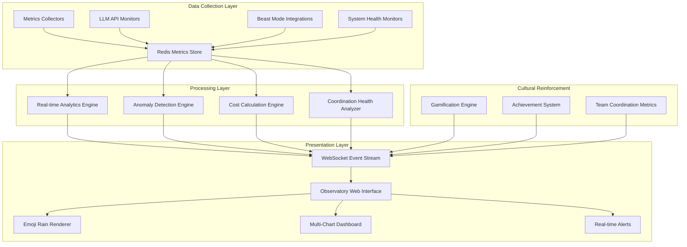
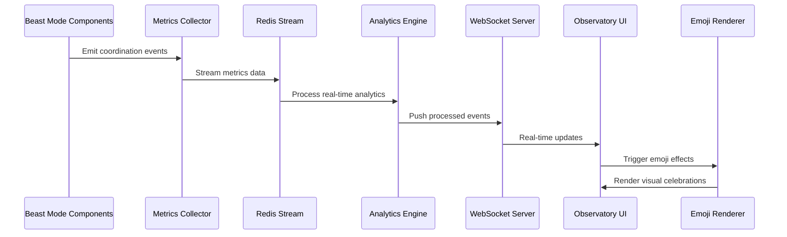

# Design Document

## Overview

The Beast Mode Coordination Observatory transforms system monitoring from a necessary chore into an engaging, rewarding experience. By combining real-time coordination health visualization, multi-LLM cost tracking, anomaly detection, and delightful visual effects (including raining emojis), it creates a culture where systematic coordination feels like winning rather than working.

The Observatory serves as both operational intelligence and cultural reinforcement - making good coordination behavior immediately visible and rewarding while detecting problems before they cascade through the system.

## Architecture

### High-Level System Architecture



### Real-Time Data Flow Architecture



## Components and Interfaces

### 1. Observatory Core Engine

**Purpose**: Central orchestrator managing all Observatory functionality

```python
class ObservatoryCoreEngine(ReflectiveModule):
    """Central orchestrator for the Beast Mode Coordination Observatory."""
    
    def __init__(self, config: ObservatoryConfig):
        super().__init__()
        self.module_id = "observatory_core"
        self._config = config
        self._metrics_collector = MetricsCollector(config.metrics_config)
        self._analytics_engine = RealTimeAnalyticsEngine(config.analytics_config)
        self._websocket_server = ObservatoryWebSocketServer(config.websocket_config)
        self._anomaly_detector = AnomalyDetectionEngine(config.anomaly_config)
        self._cost_tracker = MultiLLMCostTracker(config.cost_config)
        self._gamification_engine = GamificationEngine(config.gamification_config)
    
    async def start_observatory(self) -> bool:
        """Start all Observatory components and begin monitoring."""
        
    async def process_coordination_event(self, event: CoordinationEvent) -> None:
        """Process incoming coordination events and update displays."""
        
    async def generate_real_time_insights(self) -> ObservatoryInsights:
        """Generate real-time insights for dashboard display."""
```

### 2. Real-Time Metrics Collection System

**Purpose**: Collects metrics from all Beast Mode components with minimal performance impact

```python
class MetricsCollector(ReflectiveModule):
    """High-performance metrics collection with automatic discovery."""
    
    def __init__(self, config: MetricsConfig):
        super().__init__()
        self._redis_client = redis.asyncio.from_url(config.redis_url)
        self._component_registry = ComponentRegistry()
        self._metric_processors = {}
        self._collection_tasks = {}
    
    async def discover_beast_mode_components(self) -> List[MonitorableComponent]:
        """Automatically discover and register Beast Mode components for monitoring."""
        
    async def collect_coordination_metrics(self, component: MonitorableComponent) -> CoordinationMetrics:
        """Collect coordination health metrics from a component."""
        
    async def collect_llm_api_metrics(self, api_call: LLMAPICall) -> LLMMetrics:
        """Collect token usage, cost, and performance metrics from LLM API calls."""
        
    async def stream_metrics_to_redis(self, metrics: Metrics) -> None:
        """Stream collected metrics to Redis for real-time processing."""
```

### 3. Multi-LLM Cost Tracking Engine

**Purpose**: Tracks costs and usage across multiple LLM providers with real-time cost projection

```python
class MultiLLMCostTracker(ReflectiveModule):
    """Comprehensive cost tracking across multiple LLM providers."""
    
    def __init__(self, config: CostTrackingConfig):
        super().__init__()
        self._provider_configs = config.provider_configs
        self._cost_calculators = self._initialize_cost_calculators()
        self._usage_aggregator = UsageAggregator()
        self._cost_projector = CostProjector()
    
    async def track_api_call(self, call: LLMAPICall) -> CostMetrics:
        """Track individual API call costs and usage."""
        
    async def calculate_real_time_costs(self) -> RealTimeCostSummary:
        """Calculate current costs across all providers."""
        
    async def project_cost_trends(self, time_window: timedelta) -> CostProjection:
        """Project cost trends based on current usage patterns."""
        
    async def detect_cost_anomalies(self) -> List[CostAnomaly]:
        """Detect unusual cost patterns that may indicate issues."""

class LLMProviderCostCalculator:
    """Provider-specific cost calculation logic."""
    
    def calculate_token_cost(self, tokens: int, model: str, operation_type: str) -> Decimal:
        """Calculate cost for token usage based on provider pricing."""
        
    def estimate_monthly_cost(self, current_usage: UsageMetrics) -> Decimal:
        """Estimate monthly cost based on current usage patterns."""
```

### 4. Real-Time Analytics Engine

**Purpose**: Processes streaming metrics data to generate real-time insights and visualizations

```python
class RealTimeAnalyticsEngine(ReflectiveModule):
    """Real-time analytics processing for Observatory displays."""
    
    def __init__(self, config: AnalyticsConfig):
        super().__init__()
        self._stream_processor = RedisStreamProcessor(config.redis_config)
        self._window_aggregator = TimeWindowAggregator()
        self._trend_analyzer = TrendAnalyzer()
        self._health_calculator = CoordinationHealthCalculator()
    
    async def process_metrics_stream(self) -> AsyncGenerator[AnalyticsEvent, None]:
        """Process streaming metrics and yield analytics events."""
        
    async def calculate_coordination_health(self, metrics: CoordinationMetrics) -> HealthScore:
        """Calculate overall coordination health score."""
        
    async def analyze_system_trends(self, time_window: timedelta) -> TrendAnalysis:
        """Analyze trends in system behavior over time."""
        
    async def generate_dashboard_data(self) -> DashboardData:
        """Generate comprehensive data for dashboard display."""

class CoordinationHealthCalculator:
    """Calculates coordination health scores based on multiple factors."""
    
    def calculate_task_queue_health(self, queue_metrics: TaskQueueMetrics) -> float:
        """Calculate health score for task queue performance."""
        
    def calculate_api_health(self, api_metrics: APIMetrics) -> float:
        """Calculate health score for API performance."""
        
    def calculate_overall_health(self, component_healths: Dict[str, float]) -> HealthScore:
        """Calculate overall system coordination health."""
```

### 5. Anomaly Detection Engine

**Purpose**: Detects unusual patterns in coordination behavior, costs, and performance

```python
class AnomalyDetectionEngine(ReflectiveModule):
    """Advanced anomaly detection for coordination and cost metrics."""
    
    def __init__(self, config: AnomalyConfig):
        super().__init__()
        self._baseline_calculator = BaselineCalculator()
        self._pattern_detector = PatternDetector()
        self._ml_detector = MLAnomalyDetector() if config.enable_ml else None
        self._threshold_detector = ThresholdAnomalyDetector()
    
    async def establish_baselines(self, historical_data: HistoricalMetrics) -> Baselines:
        """Establish baseline patterns for normal system operation."""
        
    async def detect_coordination_anomalies(self, current_metrics: CoordinationMetrics) -> List[Anomaly]:
        """Detect anomalies in coordination patterns."""
        
    async def detect_cost_anomalies(self, cost_metrics: CostMetrics) -> List[CostAnomaly]:
        """Detect unusual cost patterns."""
        
    async def detect_performance_anomalies(self, performance_metrics: PerformanceMetrics) -> List[PerformanceAnomaly]:
        """Detect performance degradation or unusual patterns."""

class MLAnomalyDetector:
    """Machine learning-based anomaly detection using isolation forests."""
    
    def train_model(self, training_data: TrainingMetrics) -> AnomalyModel:
        """Train anomaly detection model on historical data."""
        
    def detect_anomalies(self, current_data: Metrics) -> List[MLAnomaly]:
        """Detect anomalies using trained ML model."""
```

### 6. Observatory Web Interface

**Purpose**: Provides the engaging, real-time web interface with emoji rain and advanced charting

```python
class ObservatoryWebInterface:
    """Web interface for the Beast Mode Coordination Observatory."""
    
    def __init__(self, config: WebInterfaceConfig):
        self._app = FastAPI(title="Beast Mode Coordination Observatory")
        self._websocket_manager = WebSocketManager()
        self._chart_renderer = ChartRenderer()
        self._emoji_engine = EmojiRainEngine()
        self._dashboard_builder = DashboardBuilder()
    
    async def serve_observatory_dashboard(self) -> HTMLResponse:
        """Serve the main Observatory dashboard."""
        
    async def websocket_endpoint(self, websocket: WebSocket) -> None:
        """WebSocket endpoint for real-time updates."""
        
    async def stream_real_time_data(self, websocket: WebSocket) -> None:
        """Stream real-time data to connected clients."""

class EmojiRainEngine:
    """Manages the delightful emoji rain visualization."""
    
    def __init__(self):
        self._emoji_mappings = {
            "task_completed": ["✅", "🎉", "🚀"],
            "high_performance": ["⚡", "🔥", "💨"],
            "cost_savings": ["💰", "📉", "🎯"],
            "coordination_success": ["🤝", "⚙️", "🔄"],
            "anomaly_detected": ["⚠️", "🔍", "📊"],
            "milestone_achieved": ["🏆", "🎊", "🌟"]
        }
    
    def generate_emoji_rain(self, event_type: str, intensity: float) -> EmojiRainEffect:
        """Generate emoji rain effect based on system events."""
        
    def create_celebration_effect(self, achievement: Achievement) -> CelebrationEffect:
        """Create special celebration effects for achievements."""

class ChartRenderer:
    """Advanced charting with Grafana-style capabilities."""
    
    def render_multi_series_chart(self, data: ChartData, config: ChartConfig) -> Chart:
        """Render multi-colored, interactive charts."""
        
    def create_real_time_chart(self, metric_stream: MetricStream) -> RealTimeChart:
        """Create real-time updating charts."""
        
    def generate_correlation_chart(self, metrics: List[Metric]) -> CorrelationChart:
        """Generate charts showing metric correlations."""
```

### 7. Gamification and Cultural Reinforcement Engine

**Purpose**: Makes systematic coordination feel rewarding and engaging

```python
class GamificationEngine(ReflectiveModule):
    """Gamification system to reinforce coordination culture."""
    
    def __init__(self, config: GamificationConfig):
        super().__init__()
        self._achievement_tracker = AchievementTracker()
        self._milestone_detector = MilestoneDetector()
        self._team_metrics = TeamCoordinationMetrics()
        self._reward_system = RewardSystem()
    
    async def track_coordination_behavior(self, behavior: CoordinationBehavior) -> None:
        """Track positive coordination behaviors for rewards."""
        
    async def detect_achievements(self, metrics: CoordinationMetrics) -> List[Achievement]:
        """Detect when teams achieve coordination milestones."""
        
    async def calculate_team_coordination_score(self, team_metrics: TeamMetrics) -> CoordinationScore:
        """Calculate team coordination effectiveness score."""
        
    async def generate_positive_reinforcement(self, achievement: Achievement) -> ReinforcementEvent:
        """Generate positive reinforcement for good coordination."""

class AchievementTracker:
    """Tracks and manages coordination achievements."""
    
    def __init__(self):
        self._achievements = {
            "systematic_streak": "Complete 10 tasks using systematic approaches",
            "cost_optimizer": "Reduce LLM costs by 20% through efficient coordination",
            "anomaly_hunter": "Detect and resolve 5 system anomalies",
            "coordination_master": "Maintain 95% coordination health for 24 hours",
            "team_player": "Contribute to 50 successful team coordination events"
        }
    
    def check_achievement_progress(self, user_metrics: UserMetrics) -> Dict[str, float]:
        """Check progress toward achievements."""
        
    def unlock_achievement(self, user_id: str, achievement_id: str) -> Achievement:
        """Unlock achievement and trigger celebration."""
```

## Data Models

### Core Observatory Data Models

```python
@dataclass
class CoordinationEvent:
    """Represents a coordination event in the system."""
    event_id: str = field(default_factory=lambda: str(uuid.uuid4()))
    timestamp: datetime = field(default_factory=datetime.now)
    event_type: CoordinationEventType
    source_component: str
    event_data: Dict[str, Any]
    correlation_id: Optional[str] = None
    user_id: Optional[str] = None

@dataclass
class CoordinationMetrics:
    """Comprehensive coordination health metrics."""
    timestamp: datetime
    task_queue_health: float  # 0.0 to 1.0
    api_response_times: Dict[str, float]
    error_rates: Dict[str, float]
    throughput_metrics: Dict[str, int]
    coordination_efficiency: float
    system_load: SystemLoadMetrics

@dataclass
class LLMMetrics:
    """LLM API usage and cost metrics."""
    provider: str
    model: str
    timestamp: datetime
    tokens_used: int
    estimated_cost: Decimal
    response_time_ms: float
    operation_type: str  # completion, embedding, etc.
    success: bool
    error_type: Optional[str] = None

@dataclass
class CostMetrics:
    """Real-time cost tracking across providers."""
    timestamp: datetime
    total_cost_today: Decimal
    cost_by_provider: Dict[str, Decimal]
    cost_by_model: Dict[str, Decimal]
    projected_monthly_cost: Decimal
    cost_trend: CostTrend
    anomalies: List[CostAnomaly]

@dataclass
class HealthScore:
    """Overall system coordination health score."""
    overall_score: float  # 0.0 to 1.0
    component_scores: Dict[str, float]
    trend: HealthTrend
    factors: List[HealthFactor]
    recommendations: List[str]

@dataclass
class Anomaly:
    """Detected anomaly in system behavior."""
    anomaly_id: str
    timestamp: datetime
    anomaly_type: AnomalyType
    severity: AnomalySeverity
    affected_components: List[str]
    description: str
    confidence_score: float
    suggested_actions: List[str]
    auto_resolved: bool = False

@dataclass
class Achievement:
    """Coordination achievement for gamification."""
    achievement_id: str
    name: str
    description: str
    icon_emoji: str
    unlocked_at: datetime
    user_id: str
    celebration_effect: CelebrationEffect

@dataclass
class EmojiRainEffect:
    """Configuration for emoji rain visualization."""
    emojis: List[str]
    intensity: float  # 0.0 to 1.0
    duration_seconds: float
    animation_style: AnimationStyle
    trigger_event: str
```

### Configuration Models

```python
@dataclass
class ObservatoryConfig:
    """Main configuration for the Observatory system."""
    redis_config: RedisConfig
    websocket_config: WebSocketConfig
    metrics_config: MetricsConfig
    analytics_config: AnalyticsConfig
    anomaly_config: AnomalyConfig
    cost_config: CostTrackingConfig
    gamification_config: GamificationConfig
    web_interface_config: WebInterfaceConfig

@dataclass
class MetricsConfig:
    """Configuration for metrics collection."""
    collection_interval_seconds: int = 5
    retention_days: int = 30
    high_frequency_metrics: List[str] = field(default_factory=list)
    component_discovery_enabled: bool = True
    performance_impact_limit: float = 0.01  # Max 1% performance impact

@dataclass
class CostTrackingConfig:
    """Configuration for LLM cost tracking."""
    provider_configs: Dict[str, ProviderConfig]
    cost_alert_thresholds: Dict[str, Decimal]
    projection_window_days: int = 30
    anomaly_detection_sensitivity: float = 0.8

@dataclass
class GamificationConfig:
    """Configuration for gamification features."""
    achievements_enabled: bool = True
    team_metrics_enabled: bool = True
    celebration_effects_enabled: bool = True
    emoji_rain_enabled: bool = True
    leaderboard_enabled: bool = False  # Privacy-conscious default
```

## Error Handling

### Comprehensive Error Recovery Strategy

The Observatory implements multi-layered error handling to ensure continuous monitoring even during system issues:

```python
class ObservatoryErrorHandler:
    """Comprehensive error handling for Observatory operations."""
    
    def __init__(self):
        self._circuit_breakers = {}
        self._fallback_strategies = {}
        self._error_aggregator = ErrorAggregator()
    
    async def handle_metrics_collection_failure(self, component: str, error: Exception) -> None:
        """Handle metrics collection failures with graceful degradation."""
        
    async def handle_websocket_disconnection(self, client_id: str) -> None:
        """Handle WebSocket client disconnections gracefully."""
        
    async def handle_redis_failure(self, operation: str, error: Exception) -> None:
        """Handle Redis connectivity issues with local caching fallback."""

class GracefulDegradationManager:
    """Manages graceful degradation during system issues."""
    
    async def enable_offline_mode(self) -> None:
        """Enable offline mode with local data caching."""
        
    async def restore_online_mode(self) -> None:
        """Restore full functionality after system recovery."""
        
    async def maintain_core_functionality(self) -> None:
        """Maintain core monitoring during degraded operation."""
```

### Error Recovery Patterns

1. **Circuit Breaker Pattern**: Prevent cascade failures during component outages
2. **Graceful Degradation**: Continue core functionality during partial failures
3. **Local Caching**: Cache recent data for offline operation
4. **Automatic Recovery**: Detect and recover from transient failures
5. **User Notification**: Inform users of degraded functionality without alarm

## Testing Strategy

### Multi-Level Testing Approach

```python
# Unit Tests
class TestMetricsCollector:
    def test_component_discovery(self):
        """Test automatic discovery of Beast Mode components."""
        
    def test_metrics_collection_performance(self):
        """Ensure metrics collection has minimal performance impact."""
        
    def test_error_handling(self):
        """Test graceful handling of collection errors."""

# Integration Tests  
class TestObservatoryIntegration:
    def test_end_to_end_monitoring(self):
        """Test complete monitoring flow from collection to display."""
        
    def test_real_time_updates(self):
        """Test real-time WebSocket updates."""
        
    def test_cost_tracking_accuracy(self):
        """Test accuracy of cost calculations across providers."""

# Performance Tests
class TestObservatoryPerformance:
    def test_high_volume_metrics(self):
        """Test performance under high metrics volume."""
        
    def test_concurrent_users(self):
        """Test WebSocket performance with many concurrent users."""
        
    def test_memory_usage(self):
        """Ensure memory usage remains bounded."""

# Visual Tests
class TestEmojiRainEngine:
    def test_emoji_generation(self):
        """Test emoji rain generation for different events."""
        
    def test_celebration_effects(self):
        """Test achievement celebration effects."""
        
    def test_performance_impact(self):
        """Ensure visual effects don't impact performance."""
```

### Test Data Strategy

- **Synthetic Metrics**: Generate realistic test metrics for all scenarios
- **Real System Integration**: Test with actual Beast Mode components
- **Load Testing**: Simulate high-volume production scenarios
- **Visual Regression**: Ensure UI changes don't break visual effects

## Performance Optimization

### Real-Time Performance Requirements

The Observatory must maintain excellent performance while providing rich visualizations:

```python
class PerformanceOptimizer:
    """Optimizes Observatory performance for real-time operation."""
    
    def __init__(self):
        self._connection_pool = ConnectionPool(max_connections=100)
        self._metric_cache = LRUCache(maxsize=10000)
        self._websocket_pool = WebSocketPool()
    
    async def optimize_metrics_collection(self) -> None:
        """Optimize metrics collection for minimal system impact."""
        
    async def optimize_real_time_updates(self) -> None:
        """Optimize WebSocket updates for smooth 60fps performance."""
        
    async def manage_memory_usage(self) -> None:
        """Manage memory usage with intelligent caching and cleanup."""

class MetricsAggregator:
    """Efficiently aggregates metrics for real-time display."""
    
    def aggregate_time_series(self, metrics: List[Metric], window: timedelta) -> AggregatedMetrics:
        """Aggregate time series data for efficient display."""
        
    def downsample_historical_data(self, data: HistoricalData) -> DownsampledData:
        """Downsample historical data for long-term trend display."""
```

### Caching Strategy

- **Redis Caching**: Cache frequently accessed metrics and calculations
- **Browser Caching**: Cache static assets and chart configurations
- **WebSocket Caching**: Cache recent updates for new client connections
- **Computation Caching**: Cache expensive calculations like anomaly detection

## Security and Privacy

### Security Considerations

```python
class ObservatorySecurity:
    """Security measures for Observatory access and data."""
    
    def __init__(self, config: SecurityConfig):
        self._auth_manager = AuthenticationManager(config.auth_config)
        self._access_controller = AccessController(config.access_config)
        self._data_sanitizer = DataSanitizer()
    
    async def authenticate_user(self, credentials: Credentials) -> AuthResult:
        """Authenticate users accessing the Observatory."""
        
    async def authorize_metrics_access(self, user: User, metrics: List[str]) -> bool:
        """Authorize access to specific metrics based on user permissions."""
        
    async def sanitize_displayed_data(self, data: DisplayData) -> SanitizedData:
        """Sanitize data before display to prevent information leakage."""
```

### Privacy Protection

- **Data Anonymization**: Remove or hash sensitive identifiers
- **Access Controls**: Limit access to sensitive metrics based on roles
- **Audit Logging**: Log all access to sensitive monitoring data
- **Data Retention**: Automatically purge old metrics data

## Deployment and Operations

### Container Architecture

```dockerfile
# Observatory Web Interface
FROM node:18-alpine AS frontend-builder
WORKDIR /app
COPY frontend/ .
RUN npm install && npm run build

FROM python:3.9-slim AS backend
WORKDIR /app
COPY requirements.txt .
RUN pip install -r requirements.txt
COPY src/ ./src/
COPY --from=frontend-builder /app/dist ./static/
CMD ["python", "-m", "src.beast_mode.observatory.main"]
```

### Kubernetes Deployment

```yaml
apiVersion: apps/v1
kind: Deployment
metadata:
  name: beast-mode-observatory
spec:
  replicas: 2
  selector:
    matchLabels:
      app: beast-mode-observatory
  template:
    metadata:
      labels:
        app: beast-mode-observatory
    spec:
      containers:
      - name: observatory
        image: beast-mode-observatory:latest
        ports:
        - containerPort: 8080
        env:
        - name: REDIS_URL
          value: "redis://redis-service:6379"
        - name: WEBSOCKET_ENABLED
          value: "true"
        - name: EMOJI_RAIN_ENABLED
          value: "true"
        resources:
          requests:
            memory: "256Mi"
            cpu: "100m"
          limits:
            memory: "512Mi"
            cpu: "500m"
        livenessProbe:
          httpGet:
            path: /health
            port: 8080
        readinessProbe:
          httpGet:
            path: /ready
            port: 8080
```

### Monitoring the Monitor

The Observatory itself implements comprehensive self-monitoring:

- **Health Endpoints**: Standard `/health`, `/ready`, `/metrics` endpoints
- **Performance Metrics**: Track its own performance impact
- **Error Monitoring**: Monitor and alert on Observatory failures
- **Resource Usage**: Track memory, CPU, and network usage

This design creates a comprehensive, engaging monitoring system that transforms coordination from overhead into advantage, making systematic approaches feel rewarding while providing the operational intelligence needed to maintain high-performance distributed systems.