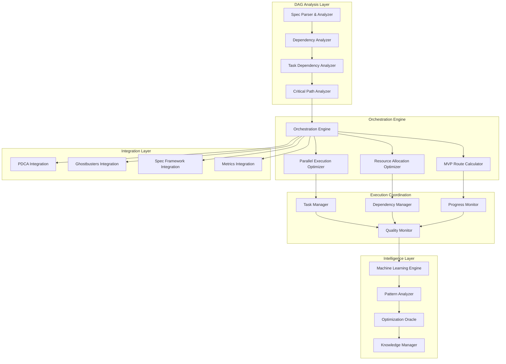

# Design Document

## Overview

The **Beast Mode DAG Orchestration System** implements systematic dependency analysis and parallel execution orchestration for complex multi-spec ecosystems. This system transforms comprehensive DAG analysis into executable orchestration workflows that maximize parallel execution while maintaining systematic integrity.

### Core Design Philosophy

**"Systematic Orchestration at Scale"** - The system applies systematic principles to coordinate the execution of systematic specifications, ensuring optimal resource utilization while maintaining dependency compliance and systematic quality.

### Key Design Principles

1. **Systematic Dependency Analysis** - Complete mapping of all task-level dependencies
2. **Optimal Parallel Execution** - Maximum parallelism within dependency constraints
3. **MVP Route Optimization** - Shortest path to demonstrable systematic value
4. **Resource Allocation Intelligence** - Optimal team structure and task assignment
5. **Risk-Aware Orchestration** - Systematic risk analysis and mitigation planning

## Architecture

### High-Level Architecture



### DAG Analysis Architecture

```mermaid
graph LR
    subgraph "Input Processing"
        SI[Spec Input]
        SP[Spec Parser]
        TD[Task Detector]
    end
    
    subgraph "Dependency Analysis"
        DM[Dependency Mapper]
        CG[Constraint Graph]
        LP[Layer Processor]
    end
    
    subgraph "Optimization Analysis"
        CP[Critical Path]
        PP[Parallel Potential]
        MVP[MVP Calculator]
    end
    
    subgraph "Output Generation"
        EG[Execution Graph]
        RP[Resource Plan]
        TP[Timeline Plan]
    end
    
    SI --> SP
    SP --> TD
    TD --> DM
    DM --> CG
    CG --> LP
    LP --> CP
    CP --> PP
    PP --> MVP
    MVP --> EG
    EG --> RP
    RP --> TP
```



## Components and Interfaces

### 1. Dependency Analyzer

The core component that maps all dependencies across specifications and tasks.

```python
class DependencyAnalyzer(DomainReflectiveModule):
    """
    Systematic dependency analysis for multi-spec ecosystems.
    
    Analyzes all specifications and tasks to create comprehensive
    dependency graphs with critical path and parallelism analysis.
    """
    
    def __init__(self, domain_context: str):
        super().__init__(domain_context)
        self.spec_parser = SpecParser()
        self.task_analyzer = TaskDependencyAnalyzer()
        self.critical_path_analyzer = CriticalPathAnalyzer()
    
    async def analyze_ecosystem_dependencies(self, spec_directory: str) -> EcosystemDAG:
        """
        Analyze all specifications in ecosystem for comprehensive dependency mapping.
        
        Args:
            spec_directory: Root directory containing all specifications
            
        Returns:
            EcosystemDAG: Complete dependency graph with analysis
        """
        pass
    
    async def calculate_critical_paths(self, ecosystem_dag: EcosystemDAG) -> List[CriticalPath]:
        """
        Calculate all critical paths through the dependency graph.
        
        Returns:
            List[CriticalPath]: All critical dependency chains
        """
        pass
    
    async def identify_parallel_opportunities(self, ecosystem_dag: EcosystemDAG) -> ParallelExecutionPlan:
        """
        Identify maximum parallelism opportunities within dependency constraints.
        
        Returns:
            ParallelExecutionPlan: Optimal parallel execution strategy
        """
        pass
```

### 2. MVP Route Calculator

Calculates optimal routes to MVP delivery with systematic value demonstration.

```python
class MVPRouteCalculator(DomainReflectiveModule):
    """
    Systematic MVP route calculation and optimization.
    
    Identifies shortest paths to demonstrable systematic value
    while maintaining systematic quality and dependency compliance.
    """
    
    async def calculate_mvp_route(self, ecosystem_dag: EcosystemDAG, mvp_criteria: MVPCriteria) -> MVPRoute:
        """
        Calculate optimal route to MVP delivery.
        
        Args:
            ecosystem_dag: Complete ecosystem dependency graph
            mvp_criteria: Systematic criteria for MVP success
            
        Returns:
            MVPRoute: Optimal path with phases and deliverables
        """
        pass
    
    async def optimize_mvp_phases(self, mvp_route: MVPRoute) -> List[MVPPhase]:
        """
        Optimize MVP route into systematic phases with clear deliverables.
        
        Returns:
            List[MVPPhase]: Systematic phases with parallel execution plans
        """
        pass
    
    async def calculate_success_probability(self, mvp_route: MVPRoute) -> SuccessProbability:
        """
        Calculate systematic success probability for MVP route.
        
        Returns:
            SuccessProbability: Risk-adjusted success probability with factors
        """
        pass
```

### 3. Parallel Execution Optimizer

Optimizes parallel execution within dependency constraints and resource limitations.

```python
class ParallelExecutionOptimizer(DomainReflectiveModule):
    """
    Systematic parallel execution optimization.
    
    Maximizes parallel execution opportunities while respecting
    dependencies, resource constraints, and systematic quality requirements.
    """
    
    async def optimize_parallel_execution(self, 
                                        execution_plan: ExecutionPlan, 
                                        resource_constraints: ResourceConstraints) -> OptimizedExecution:
        """
        Optimize execution plan for maximum parallelism within constraints.
        
        Args:
            execution_plan: Initial execution plan with dependencies
            resource_constraints: Available resources and limitations
            
        Returns:
            OptimizedExecution: Optimized parallel execution strategy
        """
        pass
    
    async def calculate_resource_allocation(self, 
                                          optimized_execution: OptimizedExecution,
                                          team_capabilities: TeamCapabilities) -> ResourceAllocation:
        """
        Calculate optimal resource allocation for parallel execution.
        
        Returns:
            ResourceAllocation: Systematic team and resource assignment
        """
        pass
    
    async def monitor_parallel_execution(self, execution_id: str) -> ExecutionStatus:
        """
        Monitor parallel execution progress and systematic quality.
        
        Returns:
            ExecutionStatus: Real-time execution status with quality metrics
        """
        pass
```

### 4. Orchestration Engine

Core orchestrator that coordinates all DAG orchestration activities.

```python
class OrchestrationEngine(DomainReflectiveModule):
    """
    Core Beast Mode DAG orchestration engine.
    
    Coordinates systematic dependency analysis, MVP route calculation,
    parallel execution optimization, and systematic quality monitoring.
    """
    
    def __init__(self, domain_context: str):
        super().__init__(domain_context)
        self.dependency_analyzer = DependencyAnalyzer(domain_context)
        self.mvp_calculator = MVPRouteCalculator(domain_context)
        self.parallel_optimizer = ParallelExecutionOptimizer(domain_context)
        self.risk_analyzer = RiskAnalyzer(domain_context)
    
    async def orchestrate_ecosystem_execution(self, 
                                            spec_directory: str,
                                            mvp_criteria: MVPCriteria,
                                            resource_constraints: ResourceConstraints) -> OrchestrationPlan:
        """
        Orchestrate complete ecosystem execution with systematic optimization.
        
        Args:
            spec_directory: Root directory with all specifications
            mvp_criteria: Systematic MVP success criteria
            resource_constraints: Available resources and constraints
            
        Returns:
            OrchestrationPlan: Complete systematic orchestration strategy
        """
        # Analyze ecosystem dependencies
        ecosystem_dag = await self.dependency_analyzer.analyze_ecosystem_dependencies(spec_directory)
        
        # Calculate MVP route
        mvp_route = await self.mvp_calculator.calculate_mvp_route(ecosystem_dag, mvp_criteria)
        
        # Optimize parallel execution
        execution_plan = ExecutionPlan.from_mvp_route(mvp_route)
        optimized_execution = await self.parallel_optimizer.optimize_parallel_execution(
            execution_plan, resource_constraints
        )
        
        # Analyze risks
        risk_analysis = await self.risk_analyzer.analyze_execution_risks(optimized_execution)
        
        return OrchestrationPlan(
            ecosystem_dag=ecosystem_dag,
            mvp_route=mvp_route,
            optimized_execution=optimized_execution,
            risk_analysis=risk_analysis
        )
    
    async def execute_orchestration_plan(self, orchestration_plan: OrchestrationPlan) -> ExecutionResult:
        """
        Execute systematic orchestration plan with monitoring and quality control.
        
        Returns:
            ExecutionResult: Systematic execution results with quality metrics
        """
        pass
```

## Data Models

### Core DAG Models

```python
@dataclass
class EcosystemDAG:
    """Complete ecosystem dependency graph."""
    specifications: List[SpecificationNode]
    tasks: List[TaskNode]
    dependencies: List[DependencyEdge]
    critical_paths: List[CriticalPath]
    parallel_opportunities: List[ParallelGroup]
    completion_percentage: float
    estimated_remaining_effort: int  # hours

@dataclass
class SpecificationNode:
    """Specification node in dependency graph."""
    spec_name: str
    spec_path: str
    completion_percentage: float
    task_count: int
    completed_tasks: int
    dependencies: List[str]  # spec names
    dependents: List[str]   # spec names
    layer: int  # dependency layer (0 = no dependencies)

@dataclass
class TaskNode:
    """Task node in dependency graph."""
    task_id: str
    spec_name: str
    task_name: str
    description: str
    estimated_effort: int  # hours
    completion_status: TaskStatus
    dependencies: List[str]  # task IDs
    dependents: List[str]   # task IDs
    requirements_traced: List[str]

@dataclass
class MVPRoute:
    """Optimal route to MVP delivery."""
    phases: List[MVPPhase]
    critical_tasks: List[TaskNode]
    total_estimated_effort: int  # hours
    estimated_timeline: int  # weeks
    success_probability: float
    risk_factors: List[RiskFactor]

@dataclass
class MVPPhase:
    """Systematic MVP phase with deliverables."""
    phase_name: str
    phase_number: int
    objectives: List[str]
    tasks: List[TaskNode]
    deliverables: List[str]
    estimated_duration: int  # weeks
    parallel_groups: List[ParallelGroup]
    success_criteria: List[str]
```

### Execution Models

```python
@dataclass
class OptimizedExecution:
    """Optimized parallel execution plan."""
    execution_phases: List[ExecutionPhase]
    resource_allocation: ResourceAllocation
    parallel_groups: List[ParallelGroup]
    estimated_timeline: int  # weeks
    maximum_parallelism: int  # concurrent tasks
    bottlenecks: List[Bottleneck]

@dataclass
class ExecutionPhase:
    """Systematic execution phase."""
    phase_name: str
    tasks: List[TaskNode]
    parallel_groups: List[ParallelGroup]
    dependencies_satisfied: List[str]
    estimated_duration: int  # days
    resource_requirements: ResourceRequirements

@dataclass
class ParallelGroup:
    """Group of tasks that can execute in parallel."""
    group_id: str
    tasks: List[TaskNode]
    resource_requirements: ResourceRequirements
    estimated_duration: int  # days
    coordination_overhead: float

@dataclass
class ResourceAllocation:
    """Systematic resource allocation plan."""
    teams: List[TeamAssignment]
    individual_assignments: List[IndividualAssignment]
    resource_utilization: float
    bottleneck_resources: List[str]
    scaling_recommendations: List[str]
```

### Risk and Quality Models

```python
@dataclass
class RiskAnalysis:
    """Systematic risk analysis for execution plan."""
    high_risk_dependencies: List[RiskFactor]
    single_points_of_failure: List[str]
    success_probability: float
    mitigation_strategies: List[MitigationStrategy]
    contingency_plans: List[ContingencyPlan]

@dataclass
class RiskFactor:
    """Individual risk factor in execution plan."""
    risk_id: str
    risk_type: RiskType
    probability: float
    impact: RiskImpact
    affected_tasks: List[str]
    mitigation_strategy: Optional[str]

@dataclass
class ExecutionStatus:
    """Real-time execution status and quality metrics."""
    execution_id: str
    overall_progress: float
    phase_progress: Dict[str, float]
    task_completions: Dict[str, TaskStatus]
    systematic_quality_score: float
    bottlenecks: List[Bottleneck]
    quality_issues: List[QualityIssue]
```

## Error Handling

### DAG Orchestration Error Hierarchy

```python
class DAGOrchestrationException(DomainException):
    """Base exception for DAG orchestration."""
    pass

class DependencyAnalysisException(DAGOrchestrationException):
    """Raised when dependency analysis fails."""
    pass

class MVPCalculationException(DAGOrchestrationException):
    """Raised when MVP route calculation fails."""
    pass

class ParallelOptimizationException(DAGOrchestrationException):
    """Raised when parallel optimization fails."""
    pass

class ResourceAllocationException(DAGOrchestrationException):
    """Raised when resource allocation is impossible."""
    pass

class ExecutionOrchestrationException(DAGOrchestrationException):
    """Raised when execution orchestration fails."""
    pass
```

### Error Recovery Strategies

1. **Dependency Analysis Failures**
   - Fallback to manual dependency specification
   - Partial analysis with warnings
   - Conservative dependency assumptions

2. **MVP Route Calculation Failures**
   - Alternative MVP criteria
   - Phased MVP approach
   - Scope reduction recommendations

3. **Parallel Optimization Failures**
   - Sequential execution fallback
   - Reduced parallelism
   - Resource constraint relaxation

## Testing Strategy

### DAG Orchestration Testing Framework

```python
class DAGOrchestrationTestFramework:
    """
    Testing framework for DAG orchestration scenarios.
    
    Tests systematic orchestration across various ecosystem sizes
    and complexity levels with systematic validation.
    """
    
    def test_dependency_analysis_accuracy(self):
        """Test accuracy of dependency analysis across different spec structures."""
        pass
    
    def test_mvp_route_optimization(self):
        """Test MVP route calculation and optimization effectiveness."""
        pass
    
    def test_parallel_execution_efficiency(self):
        """Test parallel execution optimization and resource utilization."""
        pass
    
    def test_risk_analysis_accuracy(self):
        """Test risk analysis and mitigation strategy effectiveness."""
        pass
    
    def test_scalability_performance(self):
        """Test performance with large ecosystems and complex dependencies."""
        pass
```

### Test Scenarios

1. **Small Ecosystem Tests** (5-10 specs)
   - Basic dependency analysis
   - Simple MVP routes
   - Limited parallel execution

2. **Medium Ecosystem Tests** (20-50 specs)
   - Complex dependency chains
   - Multi-phase MVP routes
   - Resource allocation optimization

3. **Large Ecosystem Tests** (100+ specs)
   - Scalability validation
   - Performance optimization
   - Enterprise-scale orchestration

4. **Real-World Scenario Tests**
   - RM-DDD ecosystem orchestration
   - Beast Mode framework coordination
   - Multi-language project orchestration

## Integration with Beast Mode Infrastructure

### PDCA Integration

```python
class PDCADAGIntegration:
    """
    Integration between DAG orchestration and PDCA cycles.
    
    Enhances PDCA orchestration with DAG-optimized execution
    and systematic dependency management.
    """
    
    async def enhance_pdca_with_dag(self, pdca_cycle: PDCACycle) -> EnhancedPDCACycle:
        """
        Enhance PDCA cycle with DAG orchestration capabilities.
        
        Returns:
            EnhancedPDCACycle: PDCA cycle with DAG optimization
        """
        pass
```

### Ghostbusters Integration

```python
class GhostbustersDAGIntegration:
    """
    Integration between DAG orchestration and Ghostbusters AI agents.
    
    Leverages AI agents for intelligent task assignment,
    progress monitoring, and optimization recommendations.
    """
    
    async def assign_ai_agents_to_tasks(self, execution_plan: ExecutionPlan) -> AIAgentAssignment:
        """
        Assign AI agents to tasks based on capabilities and requirements.
        
        Returns:
            AIAgentAssignment: Optimal AI agent task assignment
        """
        pass
```

## Performance Considerations

### Scalability Metrics

1. **Analysis Performance** - Handle 1000+ specs in <5 minutes
2. **Optimization Speed** - Calculate MVP routes in <30 seconds
3. **Memory Efficiency** - Support large ecosystems in <8GB RAM
4. **Parallel Coordination** - Coordinate 100+ parallel tasks
5. **Real-time Monitoring** - Sub-second status updates

### Optimization Strategies

1. **Incremental Analysis** - Update only changed dependencies
2. **Caching Strategies** - Cache analysis results and optimizations
3. **Distributed Processing** - Distribute analysis across multiple nodes
4. **Lazy Loading** - Load detailed analysis only when needed
5. **Compression** - Compress large dependency graphs

## Security Considerations

### Orchestration Security

1. **Access Control** - Role-based access to orchestration functions
2. **Execution Isolation** - Isolated execution environments
3. **Audit Trails** - Complete audit trails for all orchestration decisions
4. **Resource Protection** - Prevent resource exhaustion attacks
5. **Data Privacy** - Protect sensitive specification and task data

## Deployment Strategy

### DAG Orchestration Deployment

1. **Containerized Deployment** - Docker containers for scalability
2. **Kubernetes Orchestration** - K8s for distributed orchestration
3. **Cloud Integration** - Support for AWS, GCP, Azure
4. **On-Premise Support** - Enterprise on-premise deployment
5. **Hybrid Deployment** - Mixed cloud and on-premise orchestration

This design provides the systematic foundation for Beast Mode DAG orchestration - a system that can systematically analyze, optimize, and orchestrate complex multi-spec ecosystems while maintaining systematic quality and maximizing parallel execution efficiency.