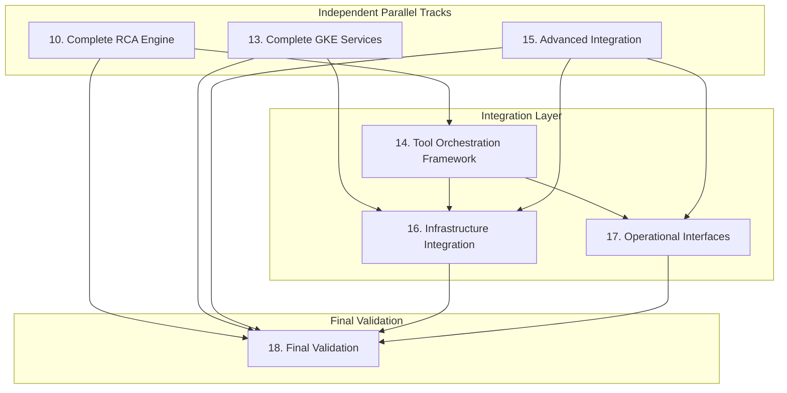

# Beast Mode Framework - Task DAG Analysis for Parallel Execution

## Remaining Tasks Dependency Analysis

### Critical Path Dependencies

## Parallel Execution Waves

### Wave 1: Independent Core Completions (Parallel Execution)
**Duration: ~3-5 days (parallel)**
**Total Story Points: 22 points**

**Parallel Track A: RCA Engine Implementation (8 points)**
- **Task 10**: Complete Root Cause Analysis Engine Implementation
  - Replace mock RCA engine with full systematic failure analysis
  - Implement perform_systematic_rca() method with comprehensive factor analysis
  - Build analyze_comprehensive_factors() for symptoms, tools, dependencies, config, installation
  - Create implement_systematic_fixes() that addresses root causes, not symptoms
  - Build validate_root_cause_addressed() method for fix validation
  - Implement document_prevention_patterns() with pattern library management
  - Add pattern matching with <1 second performance for 10,000+ patterns
  - **Dependencies**: None (can start immediately)
  - **Estimated Duration**: 2-3 days

**Parallel Track B: GKE Service Implementation (10 points)**
- **Task 13**: Complete GKE Service Implementation
  - Implement provide_pdca_services() method in GKEServiceInterface
  - Add provide_model_driven_building() for project registry consultation services
  - Create provide_tool_health_management() for systematic tool fixing capabilities
  - Build provide_quality_assurance() for comprehensive GKE code validation
  - Implement measure_improvement_over_adhoc() for concrete superiority metrics
  - Add service request/response handling with <500ms performance
  - Create 5-minute integration documentation and examples
  - **Dependencies**: None (can start immediately)
  - **Estimated Duration**: 3-4 days

**Parallel Track C: Advanced Integration (4 points)**
- **Task 15**: Complete Advanced Integration and Future-Proofing
  - Enhance existing GracefulDegradationManager with operational reliability features
  - Complete comprehensive observability configuration with actionable alerts
  - Implement Architectural Decision Record (ADR) documentation system integration
  - Create automated code quality gates (linting, formatting, security scanning)
  - Document all design decisions and trade-off rationales in ADR format
  - **Dependencies**: None (can start immediately)
  - **Estimated Duration**: 1-2 days

### Wave 2: Integration Layer (Sequential Dependencies)
**Duration: ~4-6 days (some parallel)**
**Total Story Points: 17 points**

**Sequential Track D: Tool Orchestration Framework (6 points)**
- **Task 14**: Complete Tool Orchestration Decision Framework
  - Enhance existing ToolOrchestrationEngine with confidence-based decision framework
  - Implement 80%+ Model confidence → Direct registry consultation
  - Add 50-80% Multi-Perspective → Stakeholder validation escalation
  - Create <50% Full Analysis → Comprehensive RCA and multi-stakeholder synthesis
  - Build decision documentation for manual analysis fallback
  - Integrate with completed RCA engine for systematic tool problem resolution
  - **Dependencies**: Task 10 (RCA Engine) must be complete
  - **Estimated Duration**: 2-3 days

**Parallel Track E: Infrastructure Integration (6 points)**
- **Task 16**: Complete Infrastructure Integration and Self-Consistency Validation
  - Add Beast Mode operations to existing Makefile (make beast-mode, make pdca-cycle, make systematic-repair)
  - Integrate with existing project_model_registry.json for model-driven decisions
  - Create Beast Mode configuration integration with .cursor/rules system
  - Implement self-consistency validation: Beast Mode uses its own PDCA cycles
  - Prove system works on itself through self-application validation
  - **Dependencies**: Task 13 (GKE Services) and Task 14 (Tool Orchestration) must be complete
  - **Estimated Duration**: 2-3 days

**Parallel Track F: Operational Interfaces (5 points)**
- **Task 17**: Complete Operational Interfaces and Unknown Risk Mitigation
  - Enhance existing BeastModeCLI with manual operations and debugging capabilities
  - Complete operational dashboards for health monitoring and superiority metrics
  - Integrate comprehensive logging and audit trail system across all components
  - Implement status reporting and metrics collection with unknown demand handling
  - Add mitigation strategies for identified unknowns (UK-01 through UK-17)
  - **Dependencies**: Task 14 (Tool Orchestration) and Task 15 (Advanced Integration) must be complete
  - **Estimated Duration**: 2-3 days

### Wave 3: Final Validation (Sequential)
**Duration: ~2-3 days**
**Total Story Points: 7 points**

**Sequential Track G: Final System Validation (7 points)**
- **Task 18**: Complete Final Validation and Assessment Preparation
  - Enhance existing EvidencePackageGenerator with concrete superiority metrics
  - Complete production readiness assessment using ProductionReadinessAssessor
  - Implement GKE service delivery impact measurement using GKEServiceImpactMeasurer
  - Complete systematic vs ad-hoc approach comparison using SystematicComparisonFramework
  - Generate comprehensive evidence package for hackathon evaluation
  - Validate all constraint compliance using ConstraintComplianceValidator
  - **Dependencies**: All previous tasks (10, 13, 14, 15, 16, 17) must be complete
  - **Estimated Duration**: 2-3 days

## Optimized Execution Strategy

### Resource Allocation Recommendations

**For 3 Developers (Optimal):**
- **Developer 1**: Task 10 (RCA Engine) → Task 14 (Tool Orchestration) → Task 18 (Final Validation)
- **Developer 2**: Task 13 (GKE Services) → Task 16 (Infrastructure Integration) → Support Task 18
- **Developer 3**: Task 15 (Advanced Integration) → Task 17 (Operational Interfaces) → Support Task 18

**For 2 Developers:**
- **Developer 1**: Task 10 + Task 15 → Task 14 → Task 16 → Task 18
- **Developer 2**: Task 13 → Task 17 → Support Task 16 → Support Task 18

**For 1 Developer (Sequential):**
- Task 10 → Task 13 → Task 15 → Task 14 → Task 16 → Task 17 → Task 18

### Critical Dependencies to Monitor

1. **Task 10 → Task 14**: RCA engine must be complete before tool orchestration integration
2. **Task 13 → Task 16**: GKE services must be complete before infrastructure integration
3. **Task 14 → Task 16**: Tool orchestration must be complete before infrastructure integration
4. **Task 14 → Task 17**: Tool orchestration must be complete before operational interfaces
5. **Task 15 → Task 17**: Advanced integration must be complete before operational interfaces
6. **Tasks 10, 13, 14, 15, 16, 17 → Task 18**: All tasks must be complete before final validation

### Parallel Execution Benefits

**Time Savings:**
- **Sequential Execution**: ~12-15 days
- **Parallel Execution (3 developers)**: ~7-10 days
- **Time Reduction**: ~35-40%

**Risk Mitigation:**
- Independent Wave 1 tracks reduce blocking dependencies
- Early completion of core functionality (RCA, GKE Services) enables integration work
- Parallel integration work in Wave 2 maximizes resource utilization

### Coordination Points

**Daily Standups Focus:**
- Interface compatibility between RCA engine and tool orchestration
- GKE service API consistency with infrastructure integration needs
- Shared logging and monitoring interfaces across operational components

**Critical Handoff Points:**
1. **End of Wave 1**: Core implementations (RCA, GKE Services, Advanced Integration) ready
2. **End of Wave 2**: All integration work complete, system ready for final validation
3. **End of Wave 3**: Complete system validated and ready for deployment

### Implementation Sequence Recommendations

**Week 1 (Wave 1 - Days 1-5):**
- Start all three parallel tracks simultaneously
- Focus on core implementation completion
- Daily integration checks for shared interfaces

**Week 2 (Wave 2 - Days 6-10):**
- Begin integration layer work as Wave 1 tasks complete
- Maintain parallel execution where dependencies allow
- Intensive testing of integrated components

**Week 2-3 (Wave 3 - Days 11-13):**
- Final validation and evidence generation
- System-wide testing and validation
- Documentation and assessment preparation

### Risk Mitigation Strategies

**Dependency Risk:**
- Monitor Task 10 completion closely as it blocks Task 14
- Ensure Task 13 API design is stable before Task 16 begins
- Maintain interface contracts between parallel tracks

**Integration Risk:**
- Daily builds and integration testing
- Shared interface definitions established early
- Regular cross-track communication

**Quality Risk:**
- Unit tests for each task before handoff
- Integration tests at each wave completion
- Comprehensive system testing before final validation

## Expected Outcomes

**Timeline Optimization:**
- **Original Sequential**: 12-15 days
- **Optimized Parallel**: 7-10 days
- **Improvement**: 35-40% time reduction

**Quality Benefits:**
- Independent development reduces merge conflicts
- Early integration testing catches issues sooner
- Parallel validation improves overall system quality

**Resource Utilization:**
- Maximum parallel work in Wave 1 (3 independent tracks)
- Efficient handoffs in Wave 2 (managed dependencies)
- Focused final validation in Wave 3

This DAG analysis demonstrates significant opportunities for parallel execution while respecting critical dependencies, potentially reducing the remaining implementation time from 2 weeks to 1-1.5 weeks with proper resource allocation.