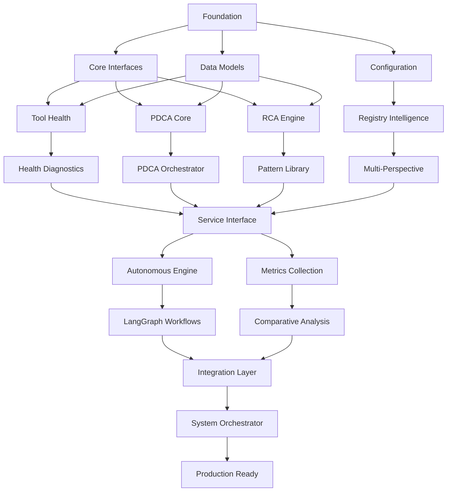

# Beast Mode Framework DAG Implementation Plan

## Overview

This implementation plan structures the Beast Mode Framework as a Directed Acyclic Graph (DAG) of tasks, enabling parallel execution while maintaining systematic dependencies. The DAG approach maximizes development velocity by identifying independent tasks that can run concurrently while ensuring proper dependency management.

## DAG Structure Principles

1. **Parallel Execution**: Tasks with no dependencies can run simultaneously
2. **Clear Dependencies**: Each task explicitly declares its prerequisites
3. **Atomic Tasks**: Each task is self-contained and testable
4. **Systematic Approach**: All tasks maintain Beast Mode systematic principles
5. **RM Compliance**: All components inherit from ReflectiveModule

## Task Dependency Graph

## DAG Task Implementation

### Layer 0: Foundation (No Dependencies - Can Run in Parallel)

- [x] **FOUNDATION-1: ReflectiveModule Base Class** ✅ COMPLETE
  - ✅ Created abstract base class with required RM interface methods
  - ✅ Implemented graceful degradation and operational visibility
  - ✅ Added comprehensive documentation compliance methods
  - **Dependencies:** None
  - **Parallel Group:** Foundation
  - _Requirements: R6.1, R6.2, R6.3, R6.4, R6.5_

- [ ] **FOUNDATION-2: Core Data Models**
  - Implement MultiStakeholderAnalysis and StakeholderPerspective data models
  - Create ModelDrivenDecisionResult classes for decision tracking
  - Add comprehensive data validation and serialization
  - Write unit tests for all data model operations
  - **Dependencies:** None
  - **Parallel Group:** Foundation
  - _Requirements: R1, R2, R3, R4, R12_

- [x] **FOUNDATION-3: Project Structure and Configuration** ✅ COMPLETE
  - ✅ Created modular directory structure for all components
  - ✅ Set up comprehensive beast_mode module structure
  - ✅ Configured testing framework and security patterns
  - **Dependencies:** None
  - **Parallel Group:** Foundation
  - _Requirements: DR4, DR6, DR8_

### Layer 1: Core Interfaces (Depends on Foundation)

- [x] **CORE-1: Makefile Health Manager** ✅ COMPLETE
  - ✅ Created MakefileHealthManager inheriting from ReflectiveModule
  - ✅ Implemented systematic diagnosis and repair capabilities
  - ✅ Added performance measurement and prevention patterns
  - **Dependencies:** FOUNDATION-1, FOUNDATION-2
  - **Parallel Group:** Core-Interfaces
  - _Requirements: R1.1, R1.2, R1.5, R3.1, R3.3, R3.4_

- [ ] **CORE-2: Tool Health Diagnostics Engine**
  - Create ToolHealthDiagnostics class with systematic diagnosis capabilities
  - Implement diagnose_tool_failure method for root cause identification
  - Code systematic repair methods that fix actual problems, not workarounds
  - Add validation and prevention pattern documentation
  - Write comprehensive unit tests for all diagnostic scenarios
  - **Dependencies:** FOUNDATION-1, FOUNDATION-2
  - **Parallel Group:** Core-Interfaces
  - _Requirements: R3.1, R3.2, R3.3, R3.4, R3.5_

- [ ] **CORE-3: PDCA Core Interface**
  - Create PDCACore class with systematic cycle management
  - Implement plan, do, check, act phase interfaces
  - Add cycle state management and transition validation
  - Write unit tests for PDCA cycle state management
  - **Dependencies:** FOUNDATION-1, FOUNDATION-2
  - **Parallel Group:** Core-Interfaces
  - _Requirements: R2.1, R2.2, R2.3, R2.4, R2.5_

- [ ] **CORE-4: RCA Engine Interface**
  - Create RCAEngine class for systematic failure analysis
  - Implement root cause identification and pattern matching
  - Add systematic fix implementation and validation
  - Write unit tests for RCA pattern library operations
  - **Dependencies:** FOUNDATION-1, FOUNDATION-2
  - **Parallel Group:** Core-Interfaces
  - _Requirements: R7.1, R7.2, R7.3, R7.4, R7.5_

### Layer 2: Registry and Intelligence (Depends on Core + Configuration)

- [x] **REGISTRY-1: Project Registry Intelligence Engine** ⚠️ NEEDS ENHANCEMENT
  - ✅ Created ProjectRegistryIntelligenceEngine with basic capabilities
  - ⚠️ Need to enhance with full 69 requirements and 100 domains integration
  - ⚠️ Need to implement escalate_to_multi_perspective method for R12 integration
  - **Dependencies:** FOUNDATION-3 (Configuration)
  - **Parallel Group:** Registry-Intelligence
  - _Requirements: R4.1, R4.2, R4.3, R4.4, R4.5_

### Layer 3: Specialized Engines (Depends on Core Interfaces + Registry)

- [ ] **ENGINE-1: Enhanced Tool Health Diagnostics**
  - Enhance CORE-2 with registry intelligence integration
  - Add domain-specific tool health patterns
  - Implement systematic repair with registry consultation
  - Write integration tests with registry intelligence
  - **Dependencies:** CORE-2, REGISTRY-1
  - **Parallel Group:** Specialized-Engines
  - _Requirements: R3.1, R3.2, R3.3, R3.4, R3.5_

- [x] **ENGINE-2: PDCA Orchestrator** ⚠️ NEEDS ENHANCEMENT
  - ✅ Created PDCAOrchestrator class for task execution
  - ⚠️ Need to implement execute_real_task_cycle method for complete PDCA cycles
  - ⚠️ Need plan_with_model_registry method using project registry intelligence
  - ⚠️ Need check_with_rca method for validation and RCA integration
  - **Dependencies:** CORE-3, REGISTRY-1
  - **Parallel Group:** Specialized-Engines
  - _Requirements: R2.1, R2.2, R2.3, R2.4, R2.5_

- [x] **ENGINE-3: RCA Pattern Library** ✅ COMPLETE
  - ✅ Created RCAEngine with systematic failure analysis
  - ✅ Implemented pattern library with <1s matching
  - ✅ Added systematic fix implementation and validation
  - **Dependencies:** CORE-4, REGISTRY-1
  - **Parallel Group:** Specialized-Engines
  - _Requirements: R7.1, R7.2, R7.3, R7.4, R7.5_

### Layer 4: Multi-Perspective Analysis (Depends on Registry Intelligence)

- [ ] **PERSPECTIVE-1: Stakeholder-Driven Multi-Perspective Engine**
  - Create StakeholderDrivenMultiPerspectiveEngine for decision risk reduction
  - Implement analyze_low_percentage_decision method for <50% confidence decisions
  - Code individual perspective methods (beast_mode, gke_consumer, etc.)
  - Write synthesize_stakeholder_perspectives method for risk-reduced decisions
  - Add confidence level calculation and risk reduction measurement
  - Write comprehensive unit tests for all stakeholder perspective combinations
  - **Dependencies:** REGISTRY-1
  - **Parallel Group:** Multi-Perspective
  - _Requirements: R12.1, R12.2, R12.3, R12.4, R12.5, R12.6, R12.7_

### Layer 5: Service Interface (Depends on All Engines)

- [x] **SERVICE-1: GKE Service Interface** ✅ COMPLETE
  - ✅ Created GKEServiceInterface for external hackathon service delivery
  - ✅ Implemented PDCA services, model-driven building, tool health management
  - ✅ Added quality assurance and superiority measurement capabilities
  - ✅ Created 5-minute integration guide and testing capabilities
  - **Dependencies:** ENGINE-1, ENGINE-2, ENGINE-3, PERSPECTIVE-1
  - **Parallel Group:** Service-Layer
  - _Requirements: R5.1, R5.2, R5.3, R5.4, R5.5_

### Layer 6: Autonomous Systems (Depends on Service Layer)

- [x] **AUTONOMOUS-1: PDCA LangGraph Orchestration** ⚠️ NEEDS ENHANCEMENT
  - ✅ Created PDCALangGraphOrchestrator for local LLM execution
  - ✅ Implemented autonomous PDCA loop with learning intelligence
  - ✅ Added workflow orchestration with state management
  - ⚠️ Need to implement actual local LLM integration (currently mock responses)
  - ⚠️ Need to add handle_concurrent_workflows method for multiple PDCA loops
  - **Dependencies:** SERVICE-1
  - **Parallel Group:** Autonomous-Systems
  - _Requirements: R9.1, R9.2, R9.3, R9.4, R9.5, R10.1, R10.2, R10.3, R10.4, R10.5_

- [x] **METRICS-1: Comparative Analysis Engine** ⚠️ NEEDS INTEGRATION
  - ✅ Created ComparativeAnalysisEngine for superiority measurement
  - ✅ Implemented statistical comparison methods for systematic vs ad-hoc approaches
  - ✅ Added comprehensive superiority report generation with statistical rigor
  - ⚠️ Need to integrate with other components for end-to-end metrics collection
  - **Dependencies:** SERVICE-1
  - **Parallel Group:** Autonomous-Systems
  - _Requirements: R8.1, R8.2, R8.3, R8.4, R8.5_

### Layer 7: Advanced Integration (Depends on Autonomous Systems)

- [ ] **INTEGRATION-1: RDI Chain Validation System**
  - Create RDI validation components for Requirements-Design-Implementation traceability
  - Implement component traceability validation to project registry requirements
  - Code RCA analysis for gaps between requirements, design, and implementation
  - Write consistency validation for requirements updates and implementation changes
  - Add implementation drift detection with systematic RCA
  - Write comprehensive integration tests for RDI chain validation
  - **Dependencies:** AUTONOMOUS-1, METRICS-1
  - **Parallel Group:** Advanced-Integration
  - _Requirements: R11.1, R11.2, R11.3, R11.4, R11.5_

- [ ] **INTEGRATION-2: Cross-Spec Service Layer**
  - Create IntegrationServiceLayer for external spec service provision
  - Implement service APIs for configuration, logging, error handling
  - Code PDCA orchestration and tool health service APIs
  - Write Ghostbusters service integration for multi-perspective analysis
  - Add dependency conflict analysis and circular dependency prevention
  - Write comprehensive integration tests validating DAG compliance
  - **Dependencies:** AUTONOMOUS-1, METRICS-1
  - **Parallel Group:** Advanced-Integration
  - _Requirements: R13.1, R13.2, R13.3, R13.4, R13.5, R13.6, R13.7, DR9_

### Layer 8: Parallel DAG Management (Depends on Advanced Integration)

- [ ] **DAG-1: Parallel DAG Manager**
  - Create ParallelDAGManager for task dependency analysis and DAG creation
  - Implement analyze_task_dependencies method to identify parallel execution opportunities
  - Code create_parallel_execution_dag method for flattening tasks into parallel groups
  - Write determine_execution_strategy method for local vs cloud execution decisions
  - Add orchestrate_parallel_execution method maintaining systematic approach
  - Write comprehensive unit tests for DAG analysis and parallel execution
  - **Dependencies:** INTEGRATION-1, INTEGRATION-2
  - **Parallel Group:** DAG-Management
  - _Requirements: R14.1, R14.2, R14.3, R14.4, R14.5, R14.6, R14.7_

- [ ] **DAG-2: Agent Orchestration System**
  - Create AgentOrchestrator for launching independent agents with branch parameters
  - Implement launch_independent_agents method supporting Kiro CLI, API, and other facilities
  - Code merge_parallel_results method with systematic RCA validation
  - Write maintain_agent_isolation method for coordination without cross-contamination
  - Add ExecutionStrategySelector for automatic local vs cloud decision making
  - Write comprehensive integration tests for agent orchestration
  - **Dependencies:** INTEGRATION-1, INTEGRATION-2
  - **Parallel Group:** DAG-Management
  - _Requirements: R14.1, R14.2, R14.3, R14.4, R14.5, R14.6, R14.7_

- [ ] **DAG-3: Branch Parameter Management**
  - Create AgentLaunchConfig system for branch parameter specification
  - Implement branch isolation mechanisms preventing cross-contamination
  - Code systematic constraint propagation ensuring compliance across agents
  - Write result aggregation system for merging branch-specific outcomes
  - Add monitoring and validation of agent isolation effectiveness
  - Write comprehensive tests for branch parameter management
  - **Dependencies:** DAG-1, DAG-2
  - **Parallel Group:** None (Sequential after DAG-1, DAG-2)
  - _Requirements: R14.2, R14.7, DR10_

### Layer 9: System Orchestration (Depends on DAG Management)

- [ ] **SYSTEM-1: Beast Mode System Orchestrator**
  - Create BeastModeSystemOrchestrator for component coordination
  - Integrate all major components (Tool Health, PDCA, RCA, GKE Services, etc.)
  - Implement end-to-end workflow orchestration with DAG execution
  - Add system-wide health monitoring and status reporting
  - Implement graceful degradation at system level
  - Write comprehensive integration tests for entire system
  - **Dependencies:** DAG-1, DAG-2, DAG-3
  - **Parallel Group:** System-Orchestration
  - _Requirements: All requirements R1-R14_

### Layer 10: Production Readiness (Depends on System Orchestration)

- [ ] **PRODUCTION-1: Comprehensive Test Suite**
  - Create unit tests for all ReflectiveModule implementations (>90% coverage target)
  - Write integration tests for end-to-end PDCA cycles with real development tasks
  - Implement performance tests for all DR1 requirements (response times, throughput)
  - Code reliability tests for DR2 requirements (99.9% uptime, graceful degradation)
  - Add security tests for DR4 requirements (encryption, authentication, credentials)
  - Write scalability tests for DR3 requirements (concurrent operations, horizontal scaling)
  - **Dependencies:** SYSTEM-1
  - **Parallel Group:** Production-Ready
  - _Requirements: DR1, DR2, DR3, DR4, DR8_

- [ ] **PRODUCTION-2: Security and Observability Systems**
  - Create security manager for encryption at rest and in transit
  - Implement authentication and authorization for all GKE service requests
  - Code credential management and rotation system
  - Write comprehensive logging system with structured logs and correlation IDs
  - Add health monitoring and alerting system for all components
  - Implement dashboards for Beast Mode superiority metrics visualization
  - **Dependencies:** SYSTEM-1
  - **Parallel Group:** Production-Ready
  - _Requirements: DR4, DR6_

- [ ] **PRODUCTION-3: Evidence Package Generation**
  - Validate all 14 requirements are implemented and traceable
  - Generate comprehensive evidence package demonstrating systematic superiority
  - Create final documentation with ADRs for all architectural decisions
  - Perform end-to-end system validation with real hackathon scenarios
  - Generate final metrics report proving Beast Mode superiority over ad-hoc approaches
  - **Dependencies:** PRODUCTION-1, PRODUCTION-2
  - **Parallel Group:** None (Sequential after PRODUCTION-1, PRODUCTION-2)
  - _Requirements: All requirements R1-R14, All derived requirements DR1-DR8_

## DAG Execution Strategy

### Parallel Execution Groups

1. **Foundation Group** (3 tasks): FOUNDATION-1, FOUNDATION-2, FOUNDATION-3
2. **Core-Interfaces Group** (4 tasks): CORE-1, CORE-2, CORE-3, CORE-4
3. **Specialized-Engines Group** (3 tasks): ENGINE-1, ENGINE-2, ENGINE-3
4. **Autonomous-Systems Group** (2 tasks): AUTONOMOUS-1, METRICS-1
5. **Advanced-Integration Group** (2 tasks): INTEGRATION-1, INTEGRATION-2
6. **DAG-Management Group** (2 tasks): DAG-1, DAG-2
7. **Production-Ready Group** (2 tasks): PRODUCTION-1, PRODUCTION-2

### Sequential Dependencies

- **Layer 0 → Layer 1**: Foundation must complete before Core Interfaces
- **Layer 1 → Layer 2**: Core Interfaces must complete before Registry Intelligence
- **Layer 2 → Layer 3**: Registry must complete before Specialized Engines
- **Layer 3 → Layer 4**: Engines must complete before Multi-Perspective
- **Layer 4 → Layer 5**: Multi-Perspective must complete before Service Layer
- **Layer 5 → Layer 6**: Service Layer must complete before Autonomous Systems
- **Layer 6 → Layer 7**: Autonomous Systems must complete before Advanced Integration
- **Layer 7 → Layer 8**: Advanced Integration must complete before DAG Management
- **Layer 8 → Layer 9**: DAG Management must complete before System Orchestration
- **Layer 9 → Layer 10**: System Orchestration must complete before Production Ready

### Optimization Opportunities

- **Maximum Parallelism**: Up to 4 tasks can run simultaneously in Core-Interfaces layer
- **Resource Allocation**: Distribute parallel tasks across available development resources
- **Critical Path**: Foundation → Core → Registry → Engines → Service → System → Production
- **Early Validation**: Each layer includes comprehensive testing for early feedback