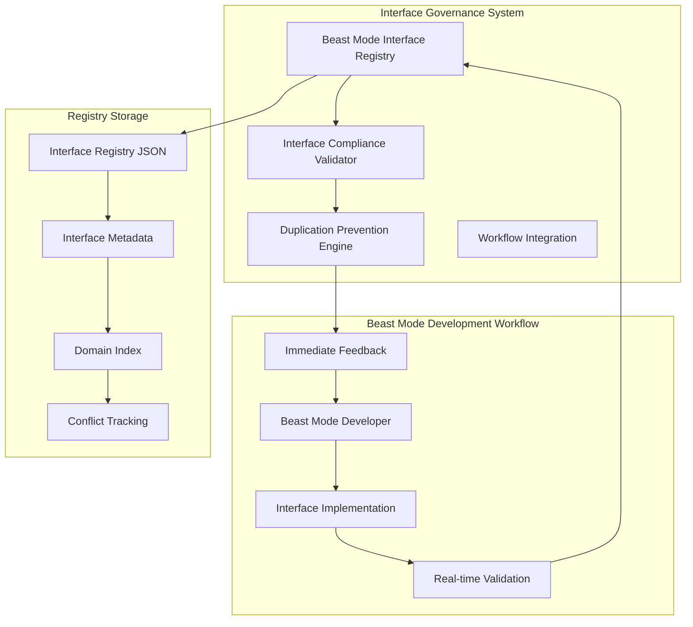

# Beast Mode Interface Governance Design

## Overview

The Beast Mode Interface Governance system provides proactive interface validation and duplication prevention to maintain architectural integrity. This design implements systematic prevention of architectural violations through registry-based validation and compliance checking.

## Architecture

### Core Components



### Component Responsibilities

#### 1. Beast Mode Interface Registry
**Single Responsibility:** Interface registration and duplication prevention
- Interface metadata storage and retrieval
- Duplicate detection and conflict tracking
- Domain indexing for interface discovery
- Registry persistence and recovery

#### 2. Interface Compliance Validator
**Single Responsibility:** RM-DDD compliance validation
- ReflectiveModule interface validation
- Required method checking
- Inheritance pattern validation
- Compliance reporting and guidance

#### 3. Duplication Prevention Engine
**Single Responsibility:** Proactive duplication prevention
- Real-time duplicate detection
- Conflict resolution suggestions
- Alternative interface recommendations
- Prevention pattern documentation

#### 4. Workflow Integration
**Single Responsibility:** Development workflow integration
- Seamless registry access
- Real-time validation feedback
- Graceful degradation handling
- Developer experience optimization

## Interface Design

### BeastModeInterfaceRegistry API

```python
class BeastModeInterfaceRegistry:
    """Interface registry with duplication prevention"""
    
    def register_interface(self, interface: InterfaceMetadata) -> bool:
        """Register interface with duplication prevention"""
        
    def find_interface_by_name_and_type(self, name: str, interface_type: InterfaceType) -> Optional[InterfaceMetadata]:
        """Find existing interface by name and type"""
        
    def validate_interface_compliance(self, file_path: str, interface_name: str) -> Dict[str, Any]:
        """Validate interface compliance with Beast Mode standards"""
        
    def get_registry_status(self) -> Dict[str, Any]:
        """Get registry status and statistics"""
```

### InterfaceMetadata Structure

```python
@dataclass
class InterfaceMetadata:
    interface_name: str
    interface_type: InterfaceType
    file_path: str
    line_number: int
    methods: List[str]
    domain_terms: List[str]
    status: InterfaceStatus
    registered_at: datetime
    conflicts: List[str]
```

## Integration Points

### 1. Beast Mode Development Workflow Integration

**Integration Point:** Development environment
**Trigger:** Before interface implementation
**Validation:** Real-time compliance checking
**Feedback:** Immediate duplication prevention

### 2. Beast Mode ReflectiveModule Integration

**Integration Point:** Existing ReflectiveModule interface
**Validation:** RM-DDD compliance checking
**Standards:** Beast Mode interface patterns
**Compliance:** Required method validation

### 3. Registry Storage Integration

**Integration Point:** Persistent registry storage
**Format:** JSON-based metadata storage
**Location:** `.beast_mode/interface_registry.json`
**Recovery:** Automatic registry recovery and validation

## Validation Logic

### Duplication Prevention Algorithm

```python
def prevent_duplication(self, new_interface: InterfaceMetadata) -> bool:
    """
    1. Check for exact name and type matches
    2. Validate against existing interfaces
    3. Detect conflicts and provide resolution
    4. Block registration if duplicate found
    5. Provide alternative suggestions
    """
    existing = self.find_interface_by_name_and_type(
        new_interface.interface_name, 
        new_interface.interface_type
    )
    
    if existing:
        # Duplicate detected - prevent registration
        return False
    
    # No duplicate - allow registration
    return True
```

### Compliance Validation Algorithm

```python
def validate_compliance(self, file_path: str, interface_name: str) -> Dict[str, Any]:
    """
    1. Parse interface definition
    2. Check ReflectiveModule inheritance
    3. Validate required methods
    4. Check interface patterns
    5. Provide compliance report
    """
    # Parse AST and validate structure
    # Check inheritance patterns
    # Validate required methods
    # Return compliance status
```

## Data Flow

### Interface Registration Flow

1. **Developer creates interface** → Interface implementation
2. **Registry consultation** → Check for existing interfaces
3. **Duplication check** → Prevent if duplicate found
4. **Compliance validation** → Validate RM-DDD compliance
5. **Registration** → Register if compliant and unique
6. **Feedback** → Provide registration status and guidance

### Validation Flow

1. **Interface creation** → New interface definition
2. **Real-time validation** → Immediate compliance checking
3. **Conflict detection** → Identify potential issues
4. **Resolution guidance** → Provide fix suggestions
5. **Implementation blocking** → Prevent violations
6. **Success confirmation** → Allow compliant implementations

## Error Handling

### Graceful Degradation

**Scenario:** Registry unavailable
**Response:** Provide offline validation guidance
**Fallback:** Manual compliance checking instructions
**Recovery:** Automatic registry recovery on availability

### Validation Failures

**Scenario:** Interface validation fails
**Response:** Detailed error reporting with fix suggestions
**Guidance:** Step-by-step resolution instructions
**Prevention:** Block implementation until compliant

### Registry Corruption

**Scenario:** Registry data corruption
**Response:** Automatic backup recovery
**Validation:** Data integrity checking
**Repair:** Automatic registry repair and validation

## Performance Considerations

### Registry Performance
- **Storage:** JSON-based for fast access
- **Indexing:** Domain-based indexing for quick lookups
- **Caching:** In-memory caching for frequent access
- **Persistence:** Asynchronous registry updates

### Validation Performance
- **AST Parsing:** Fast Python AST parsing
- **Method Checking:** Efficient method signature validation
- **Compliance:** Optimized compliance checking algorithms
- **Feedback:** Real-time validation results

## Security Considerations

### Registry Security
- **Access Control:** Authenticated registry access
- **Data Validation:** Input sanitization and validation
- **Encryption:** Sensitive metadata encryption
- **Audit Trail:** Registry access logging

### Validation Security
- **File Access:** Secure file reading and parsing
- **Code Analysis:** Safe AST parsing without execution
- **Input Validation:** Malicious input prevention
- **Error Handling:** Secure error message generation

## Monitoring and Observability

### Registry Monitoring
- **Interface Count:** Track total registered interfaces
- **Duplication Rate:** Monitor duplicate prevention effectiveness
- **Validation Success:** Track compliance validation success rate
- **Registry Health:** Monitor registry availability and performance

### Validation Monitoring
- **Validation Time:** Track validation performance
- **Compliance Rate:** Monitor RM-DDD compliance success
- **Error Rate:** Track validation failures and causes
- **Developer Experience:** Monitor developer satisfaction metrics

## Future Enhancements

### Advanced Features
- **Multi-language Support:** Extend validation to other languages
- **Interface Evolution:** Track interface versioning and migration
- **Automated Refactoring:** Suggest and apply interface improvements
- **Integration Testing:** Validate interface compatibility

### Scalability Improvements
- **Distributed Registry:** Multi-instance registry support
- **Performance Optimization:** Enhanced caching and indexing
- **Batch Processing:** Bulk interface validation
- **API Integration:** RESTful registry API for external access
