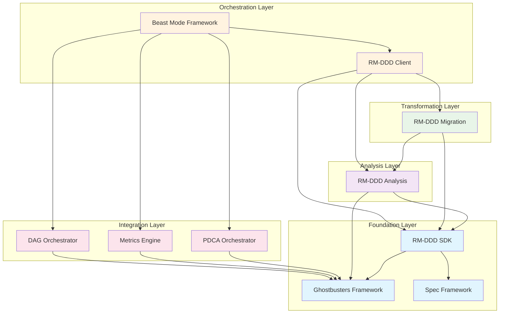

# Beast Mode RM-DDD Ecosystem DAG Analysis & MVP Prioritization

## Executive Summary

**Current Status**: RM-DDD SDK is 60% complete with core functionality implemented. Critical dependencies identified for MVP delivery.

**MVP Strategy**: Focus on completing RM-DDD SDK foundation, then implement RM-DDD Analysis as the first consumer to validate the ecosystem.

## Unfinished Task Analysis

### RM-DDD SDK (Primary Foundation) - 60% Complete

**✅ COMPLETED (Major Components):**
- Core RM Layer (base classes, health monitoring, registry)
- DDD Pattern Layer (entities, aggregates, value objects, services, repositories)
- Domain Events & Event Sourcing (complete event system)
- Infrastructure Layer (dependency validation, anti-corruption)
- Bounded Contexts & Strategic Design Tools
- Shared Kernel Management
- Convenience Layer (decorators, validators, complexity monitoring)
- Code Generation Framework (basic templates)

**🔄 REMAINING CRITICAL TASKS:**
```
Priority 1 (MVP Blockers):
- [ ] 8.2 Template customization and extension
- [ ] 8.3 Scaffolding and project generation  
- [ ] 10.1 E-commerce reference implementation
- [ ] 14.1 PyPI packaging setup

Priority 2 (MVP Enhancers):
- [ ] 9.1-9.4 Multi-language stubs (Java, C#, TypeScript, Go)
- [ ] 11.1 Testing framework base classes
- [ ] 13.1 Ecosystem documentation

Priority 3 (Post-MVP):
- [ ] 12.1-12.2 Security features
- [ ] 15.1-15.3 Beast Mode integration
- [ ] 16.1-16.3 Advanced reference implementations
```

### RM-DDD Analysis (First Consumer) - 0% Complete

**Dependencies**: RM-DDD SDK (Priority 1 tasks)
**Role**: Validates SDK by consuming it for codebase analysis
**MVP Value**: Proves "Requirements ARE the Solution" philosophy

### RM-DDD Migration (Second Consumer) - 0% Complete  

**Dependencies**: RM-DDD SDK + RM-DDD Analysis
**Role**: Transforms analysis results into executable refactoring
**MVP Value**: Demonstrates systematic transformation capabilities

### RM-DDD Client (Orchestration Layer) - 0% Complete

**Dependencies**: All RM-DDD services
**Role**: Provides unified API for Beast Mode integration
**MVP Value**: Enables ecosystem orchestration

## Dependency DAG



## Critical Path Analysis

### **Longest Dependency Chain (5 levels)**
```
Ghostbusters Framework → RM-DDD SDK → RM-DDD Analysis → RM-DDD Migration → RM-DDD Client → Beast Mode Framework
```

### **MVP Critical Path (3 levels)**
```
RM-DDD SDK (Complete Priority 1) → RM-DDD Analysis → RM-DDD Client (Basic)
```

## MVP Prioritization Strategy

### **Phase 1: Complete RM-DDD SDK Foundation (Week 1-2)**

**Immediate Tasks (MVP Blockers):**

1. **8.2 Template Customization** - Extend code generation
2. **8.3 Project Scaffolding** - Enable new project creation  
3. **10.1 E-commerce Reference** - Prove SDK capabilities
4. **14.1 PyPI Packaging** - Enable distribution

**Rationale**: SDK must be complete and distributable before any consumers can use it.

### **Phase 2: Implement RM-DDD Analysis (Week 3-4)**

**Why Analysis First:**
- **Validates SDK**: First real consumer of RM-DDD SDK
- **Proves Philosophy**: Demonstrates "Requirements ARE Solution"
- **Enables Discovery**: Identifies bounded contexts in existing code
- **Low Risk**: Read-only analysis, no code modification

**Key Capabilities:**
- Bounded context discovery
- Ubiquitous language analysis  
- Tactical pattern assessment
- RM compliance evaluation

### **Phase 3: Basic RM-DDD Client (Week 5)**

**Minimal Orchestration:**
- API wrapper for RM-DDD Analysis
- Basic progress monitoring
- Simple result formatting
- Beast Mode integration hooks

**Rationale**: Enables Beast Mode to consume analysis results without full migration capabilities.

### **Phase 4: RM-DDD Migration (Week 6-8)**

**Systematic Transformation:**
- Convert analysis to refactoring tasks
- Implement bounded context extraction
- Apply tactical patterns
- Maintain RM compliance

### **Phase 5: Full Integration (Week 9-10)**

**Complete Ecosystem:**
- Enhanced RM-DDD Client with full orchestration
- Beast Mode PDCA integration
- Multi-language support
- Advanced reference implementations

## Risk Assessment & Mitigation

### **High Risk Dependencies**

1. **Ghostbusters Framework** (15 dependents)
   - **Risk**: Single point of failure
   - **Mitigation**: Ensure stable foundation before building consumers
   - **Status**: Assumed available (external dependency)

2. **RM-DDD SDK Completion** (3 direct dependents)
   - **Risk**: Incomplete SDK blocks all consumers
   - **Mitigation**: Focus on Priority 1 tasks only for MVP
   - **Status**: 60% complete, manageable scope

### **Medium Risk Dependencies**

1. **Analysis Quality** (Migration depends on it)
   - **Risk**: Poor analysis leads to poor migration
   - **Mitigation**: Extensive testing with reference implementations
   - **Status**: New implementation, needs validation

2. **Integration Complexity** (Client orchestrates multiple services)
   - **Risk**: Complex orchestration logic
   - **Mitigation**: Start with simple API wrapper, enhance iteratively
   - **Status**: Manageable with phased approach

## Success Metrics

### **MVP Success Criteria**

1. **RM-DDD SDK**: Installable via PyPI, generates working code
2. **RM-DDD Analysis**: Analyzes real codebases, identifies contexts
3. **RM-DDD Client**: Beast Mode can consume analysis results
4. **Integration**: End-to-end workflow from analysis to recommendations

### **Ecosystem Health Indicators**

- **SDK Adoption**: Downloads, usage in analysis
- **Analysis Accuracy**: Bounded context identification quality
- **Migration Success**: Successful refactoring task completion
- **Beast Mode Integration**: Seamless PDCA workflow integration

## Implementation Recommendations

### **Immediate Actions (Next 48 hours)**

1. **Complete Task 8.2**: Template customization for code generation
2. **Complete Task 8.3**: Project scaffolding capabilities
3. **Start Task 10.1**: E-commerce reference implementation
4. **Prepare Task 14.1**: PyPI packaging setup

### **Week 1 Goals**

- RM-DDD SDK Priority 1 tasks complete
- PyPI package published and installable
- E-commerce reference implementation working
- Analysis spec implementation started

### **MVP Delivery Target**

- **Week 3**: Working RM-DDD Analysis consuming SDK
- **Week 4**: Basic RM-DDD Client enabling Beast Mode integration
- **Week 5**: End-to-end workflow demonstration

This systematic approach ensures we build a solid foundation before adding complexity, validates our architecture with real consumers, and delivers MVP value quickly while maintaining the systematic superiority that defines the Beast Mode ecosystem.