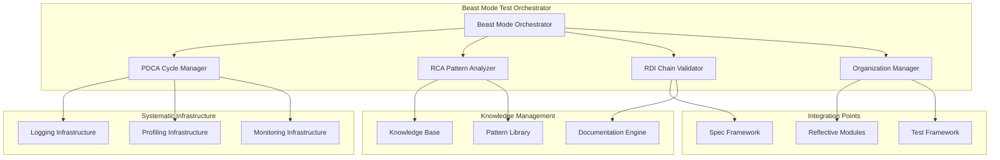
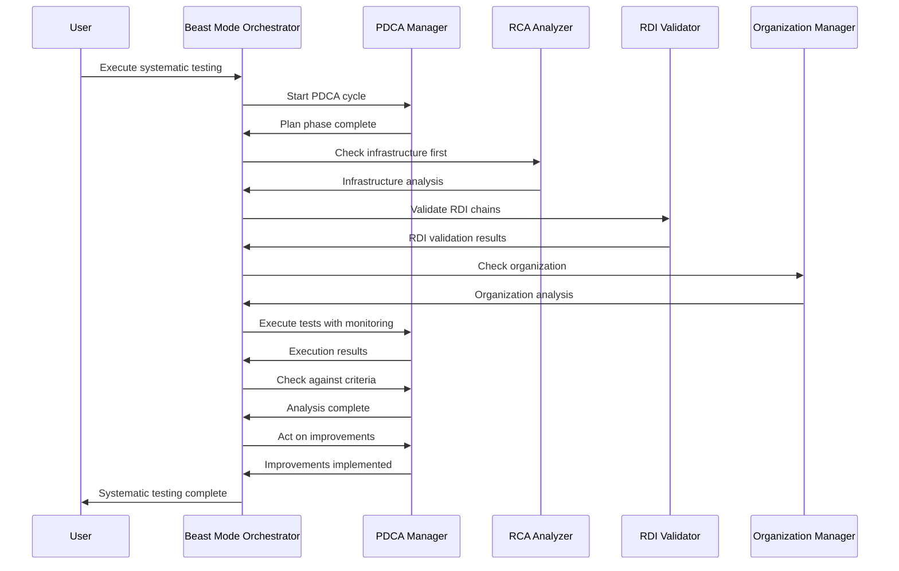

# Beast Mode Test Orchestrator - Design Document

## Overview

The Beast Mode Test Orchestrator implements a systematic testing framework that prioritizes systemic error detection, RDI chain validation, and organizational excellence. The design emphasizes systematic approaches over ad-hoc testing, with built-in compensation mechanisms for vibe coding sessions.

## Architecture

### Core Design Principles

1. **Systemic Error Priority**: Always suspect insufficient logging and profiling first
2. **RDI Chain Integrity**: Validate requirements-design-implementation traceability continuously
3. **PDCA-Driven Improvement**: Every test execution drives systematic improvement
4. **Organizational Excellence**: Maintain systematic structure and prevent entropy
5. **Vibe Coding Compensation**: Enhanced validation after non-systematic development

### System Architecture Diagram



## Components and Interfaces

### 1. Beast Mode Orchestrator (Core Component)

**Responsibility**: Central coordination of all systematic testing activities

**Key Interfaces**:
- `start_systematic_testing(test_suite, requirements)` - Initiates PDCA-driven testing
- `validate_rdi_chains(components)` - Validates requirements-design-implementation traceability
- `detect_systemic_errors(failures)` - Prioritizes systemic error detection
- `compensate_vibe_coding(session_data)` - Enhanced validation after vibe sessions

**Integration Points**:
- ReflectiveModule pattern for systematic compliance
- Spec framework for requirements traceability
- Existing test infrastructure for execution

### 2. PDCA Cycle Manager

**Responsibility**: Implements systematic Plan-Do-Check-Act cycles for continuous improvement

**Key Methods**:
- `plan_test_execution(requirements, context)` - Systematic test planning
- `execute_with_monitoring(test_plan)` - Monitored test execution
- `check_against_criteria(results, criteria)` - Systematic result validation
- `act_on_improvements(analysis)` - Systematic improvement implementation

**Data Models**:
```python
@dataclass
class PDCACycle:
    cycle_id: str
    plan_phase: PlanData
    do_phase: ExecutionData
    check_phase: AnalysisData
    act_phase: ImprovementData
    systematic_metrics: SystematicMetrics
```

### 3. RCA Pattern Analyzer

**Responsibility**: Systematic root cause analysis with logging/profiling priority

**Key Capabilities**:
- Logging deficiency detection (ALWAYS FIRST)
- Profiling infrastructure validation (ALWAYS SECOND)
- Systemic pattern identification
- Organizational improvement recommendations

**Pattern Detection Engine**:
```python
class SystemicPatternDetector:
    def detect_logging_deficiencies(self, context) -> LoggingAnalysis
    def detect_profiling_gaps(self, context) -> ProfilingAnalysis
    def identify_rdi_violations(self, context) -> RDIAnalysis
    def recommend_systematic_fixes(self, patterns) -> ImprovementPlan
```

### 4. RDI Chain Validator

**Responsibility**: Continuous validation of requirements-design-implementation traceability

**Validation Layers**:
1. **Requirements Coverage**: All requirements have corresponding design elements
2. **Design Consistency**: Design elements map to implementation components
3. **Implementation Compliance**: Code follows design specifications
4. **Test Traceability**: Tests validate requirements through implementation

**Vibe Coding Compensation**:
```python
class VibeCompensationEngine:
    def detect_vibe_sessions(self, git_history) -> VibeSessionData
    def enhance_rdi_validation(self, session_data) -> ValidationPlan
    def generate_cleanup_tasks(self, violations) -> CleanupPlan
    def validate_systematic_restoration(self, results) -> ComplianceReport
```

### 5. Organization Manager

**Responsibility**: Maintain systematic organizational structure and prevent entropy

**Key Functions**:
- Root directory organization validation
- File placement systematic compliance
- Systematic structure enforcement
- Entropy detection and remediation

**Organization Validation Engine**:
```python
class SystematicOrganizer:
    def validate_directory_structure(self) -> StructureAnalysis
    def detect_organizational_violations(self) -> ViolationReport
    def recommend_systematic_cleanup(self) -> CleanupPlan
    def enforce_systematic_standards(self) -> ComplianceReport
```

## Data Models

### Core Data Structures

```python
@dataclass
class SystematicTestExecution:
    execution_id: str
    pdca_cycle: PDCACycle
    rca_analysis: RCAAnalysis
    rdi_validation: RDIValidation
    organizational_check: OrganizationalAnalysis
    systematic_metrics: SystematicMetrics
    improvement_plan: ImprovementPlan

@dataclass
class SystemicErrorAnalysis:
    error_type: SystemicErrorType
    logging_deficiency: Optional[LoggingDeficiency]
    profiling_gap: Optional[ProfilingGap]
    rdi_violation: Optional[RDIViolation]
    organizational_issue: Optional[OrganizationalIssue]
    systematic_remediation: SystematicRemediation

@dataclass
class RDIChainValidation:
    requirements_coverage: float
    design_consistency: float
    implementation_compliance: float
    test_traceability: float
    overall_rdi_score: float
    violation_details: List[RDIViolation]
    remediation_plan: RDIRemediationPlan
```

## Error Handling

### Systematic Error Hierarchy

1. **Infrastructure Errors** (HIGHEST PRIORITY)
   - Insufficient logging infrastructure
   - Missing profiling capabilities
   - Monitoring gaps

2. **RDI Chain Errors** (HIGH PRIORITY)
   - Requirements-design misalignment
   - Design-implementation gaps
   - Implementation-test disconnects

3. **Organizational Errors** (MEDIUM PRIORITY)
   - Directory structure violations
   - File placement issues
   - Systematic standard violations

4. **Application Errors** (LOWEST PRIORITY)
   - Business logic failures
   - Data validation issues
   - Performance problems

### Error Handling Strategy

```python
class SystematicErrorHandler:
    def handle_error(self, error: Exception, context: TestContext) -> SystematicResponse:
        # 1. Always check infrastructure first
        if self.is_infrastructure_issue(error, context):
            return self.handle_infrastructure_error(error, context)
        
        # 2. Check RDI chain integrity
        if self.is_rdi_violation(error, context):
            return self.handle_rdi_violation(error, context)
        
        # 3. Check organizational compliance
        if self.is_organizational_issue(error, context):
            return self.handle_organizational_issue(error, context)
        
        # 4. Handle application-specific errors
        return self.handle_application_error(error, context)
```

## Testing Strategy

### Systematic Testing Approach

1. **Infrastructure Validation Tests**
   - Logging infrastructure completeness
   - Profiling capability verification
   - Monitoring system functionality

2. **RDI Chain Validation Tests**
   - Requirements traceability verification
   - Design consistency validation
   - Implementation compliance checking

3. **Organizational Compliance Tests**
   - Directory structure validation
   - File placement verification
   - Systematic standard compliance

4. **Integration Tests**
   - End-to-end systematic workflow validation
   - Cross-component systematic compliance
   - Performance under systematic load

### Test Execution Flow



## Performance Considerations

### Systematic Performance Requirements

- **Infrastructure Validation**: < 5 seconds for complete validation
- **RDI Chain Analysis**: < 10 seconds for full traceability check
- **Organizational Validation**: < 3 seconds for structure analysis
- **PDCA Cycle Execution**: < 30 seconds for complete cycle
- **Memory Usage**: < 200MB for full systematic analysis

### Optimization Strategies

1. **Caching**: Cache systematic validation results for unchanged components
2. **Incremental Analysis**: Only analyze changed components in RDI chains
3. **Parallel Processing**: Execute independent validations concurrently
4. **Smart Scheduling**: Prioritize high-impact systematic validations

## Security Considerations

### Systematic Security Principles

1. **Validation Security**: Ensure RDI validation cannot be bypassed
2. **Infrastructure Security**: Protect logging and profiling data
3. **Organizational Security**: Prevent unauthorized systematic changes
4. **Knowledge Security**: Protect systematic knowledge and patterns

### Security Implementation

- **Access Control**: Role-based access to systematic functions
- **Audit Logging**: Complete audit trail of systematic decisions
- **Data Protection**: Encryption of systematic knowledge and patterns
- **Integrity Validation**: Cryptographic validation of systematic components

## Integration Architecture

### Existing System Integration

1. **ReflectiveModule Integration**: All components inherit systematic patterns
2. **Spec Framework Integration**: Seamless RDI validation with existing specs
3. **Test Framework Integration**: Enhanced systematic testing capabilities
4. **Knowledge Management Integration**: Systematic learning and improvement

### Migration Strategy

1. **Phase 1**: Deploy core Beast Mode Orchestrator
2. **Phase 2**: Integrate RDI validation with existing specs
3. **Phase 3**: Add organizational management capabilities
4. **Phase 4**: Full systematic ecosystem integration

## Monitoring and Observability

### Systematic Metrics

- **RDI Chain Health**: Continuous traceability monitoring
- **Infrastructure Completeness**: Logging/profiling capability metrics
- **Organizational Entropy**: Structure degradation detection
- **Improvement Velocity**: PDCA cycle effectiveness measurement
- **Systematic Compliance**: Overall systematic adherence scoring

### Dashboards and Alerting

- **Real-time Systematic Health Dashboard**
- **RDI Chain Violation Alerts**
- **Infrastructure Deficiency Notifications**
- **Organizational Entropy Warnings**
- **Improvement Opportunity Recommendations**