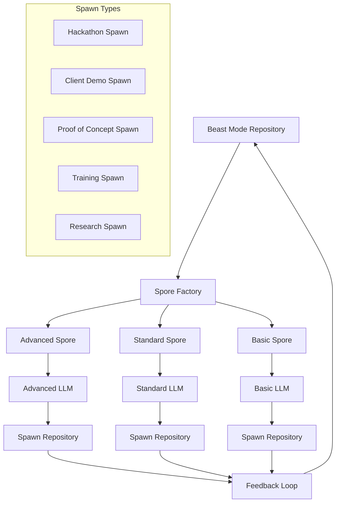
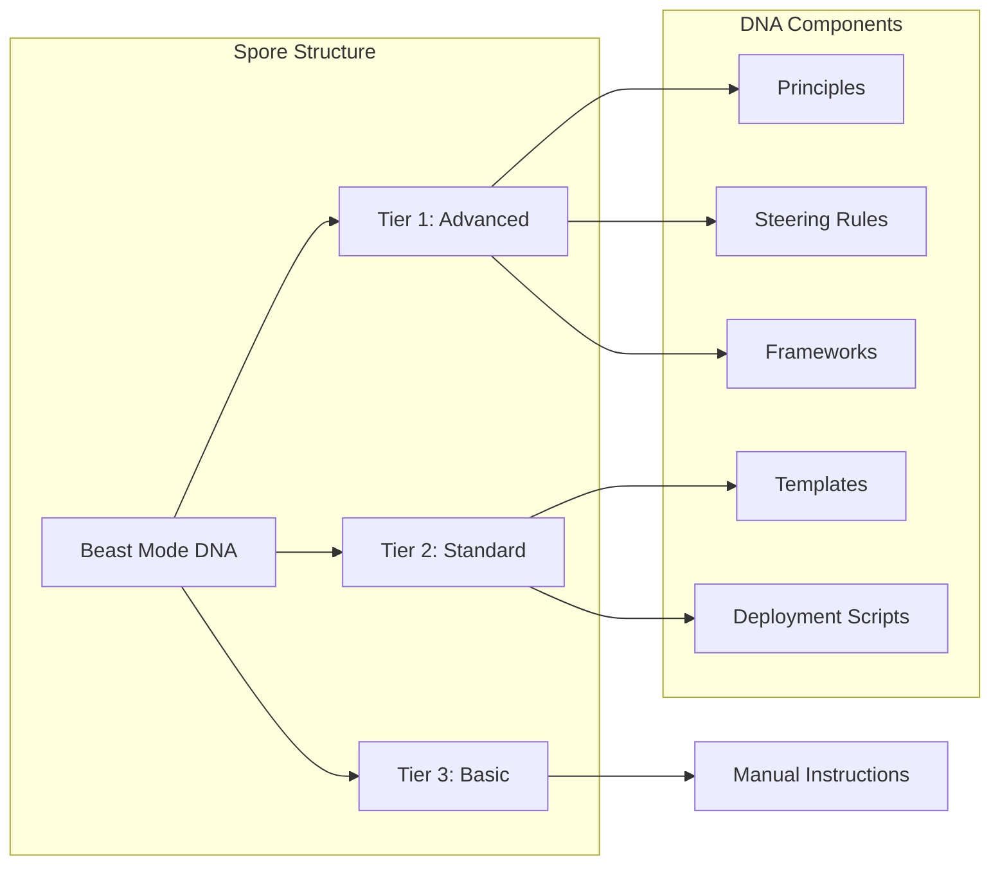

# Design Document - Beastmaster Spawn Framework

## Overview

The Beastmaster Spawn Framework is a systematic approach to creating autonomous repositories that inherit Beast Mode DNA while operating independently. This design implements a spore-based knowledge transfer system that enables the creation of specialized repositories (hackathon projects, client demos, proof-of-concepts) that demonstrate systematic superiority without requiring Beast Mode infrastructure dependencies.

The framework addresses the reality of LLM capability variance by providing multi-tier spore formats that can be consumed by advanced LLMs autonomously, standard LLMs with guidance, or basic LLMs through hand-fed instructions.

## Architecture

### Core Components



### Spore Architecture



## Components and Interfaces

### 1. Spore Factory

**Purpose**: Creates multi-tier spores containing Beast Mode DNA for different spawn types.

**Interface**:
```python
class SporeFactory:
    def create_spore(self, spawn_type: str, target_platform: str) -> Spore
    def package_dna(self, dna_components: List[DNAComponent]) -> SporePackage
    def validate_spore(self, spore: Spore) -> ValidationResult
```

**Implementation**:
- Analyzes Beast Mode repository for relevant DNA components
- Filters and packages DNA based on spawn type and target platform
- Creates multi-tier spore formats for different LLM capabilities
- Validates spore completeness and coherence

### 2. DNA Extractor

**Purpose**: Extracts relevant Beast Mode DNA components for spore packaging.

**Interface**:
```python
class DNAExtractor:
    def extract_steering_rules(self, spawn_type: str) -> List[SteeringRule]
    def extract_frameworks(self, platform: str) -> List[Framework]
    def extract_patterns(self, domain: str) -> List[Pattern]
    def extract_templates(self, use_case: str) -> List[Template]
```

**Implementation**:
- Scans `.kiro/steering/` for relevant systematic principles
- Extracts deployment frameworks from `deployment/` directories
- Identifies proven patterns from `patterns/` and successful implementations
- Selects appropriate templates based on spawn requirements

### 3. Spawn Generator

**Purpose**: Creates complete spawn repositories with injected Beast Mode DNA.

**Interface**:
```python
class SpawnGenerator:
    def create_spawn(self, spore: Spore, target_path: str) -> SpawnRepository
    def inject_dna(self, repository: Repository, spore: Spore) -> None
    def create_structure(self, spawn_type: str) -> DirectoryStructure
    def generate_scripts(self, platform: str, spore: Spore) -> List[Script]
```

**Implementation**:
- Creates systematic directory structure (`.kiro/`, `deployment/`, `scripts/`)
- Injects spore DNA into `.kiro/BEAST_MODE_DNA.md`
- Generates platform-specific deployment scripts
- Creates comprehensive documentation and README files

### 4. Submodule Manager

**Purpose**: Manages git submodule integration and DNA seeding.

**Interface**:
```python
class SubmoduleManager:
    def add_submodule(self, repo_url: str, path: str) -> Submodule
    def seed_submodule(self, submodule: Submodule, spore: Spore) -> None
    def update_submodule_reference(self, submodule: Submodule) -> None
    def sync_changes(self, submodule: Submodule) -> SyncResult
```

**Implementation**:
- Adds git submodules using `git submodule add`
- Seeds submodules with appropriate spores
- Manages submodule commit references in main repository
- Handles bidirectional synchronization of successful patterns

### 5. LLM Capability Detector

**Purpose**: Detects receiving LLM capabilities and selects appropriate spore tier.

**Interface**:
```python
class LLMCapabilityDetector:
    def detect_capability(self, llm_context: str) -> CapabilityLevel
    def select_spore_tier(self, capability: CapabilityLevel) -> SporeTier
    def provide_guidance(self, tier: SporeTier) -> GuidancePackage
```

**Implementation**:
- Analyzes LLM responses and reasoning patterns
- Classifies as Advanced, Standard, or Basic capability
- Selects appropriate spore tier and guidance level
- Provides tier-specific consumption instructions

## Data Models

### Spore Model

```python
@dataclass
class Spore:
    spore_id: str
    spawn_type: SpawnType
    target_platform: str
    dna_version: str
    compatibility: List[CapabilityLevel]
    
    # Multi-tier content
    advanced_tier: AdvancedSporeContent
    standard_tier: StandardSporeContent
    basic_tier: BasicSporeContent
    
    # Metadata
    creation_date: datetime
    source_commit: str
    validation_status: ValidationStatus

@dataclass
class AdvancedSporeContent:
    dna_principles: Dict[str, str]
    autonomous_instructions: str
    framework_references: List[str]
    implementation_patterns: List[Pattern]

@dataclass
class StandardSporeContent:
    guided_steps: List[GuidedStep]
    template_files: List[TemplateFile]
    deployment_scripts: List[Script]
    validation_checklist: List[str]

@dataclass
class BasicSporeContent:
    manual_instructions: List[ManualStep]
    copy_paste_commands: List[Command]
    file_templates: List[FileTemplate]
    simple_validation: List[str]
```

### Spawn Repository Model

```python
@dataclass
class SpawnRepository:
    name: str
    path: str
    spawn_type: SpawnType
    target_platform: str
    
    # Structure
    kiro_directory: KiroDirectory
    deployment_directory: DeploymentDirectory
    scripts_directory: ScriptsDirectory
    
    # DNA Integration
    injected_spore: Spore
    dna_assimilation_status: AssimilationStatus
    
    # Git Integration
    git_repository: GitRepository
    submodule_reference: Optional[SubmoduleReference]

@dataclass
class KiroDirectory:
    beast_mode_dna: str  # Path to BEAST_MODE_DNA.md
    steering_rules: List[str]  # Paths to steering rule files
    specs: List[str]  # Paths to spec files
```

### DNA Component Model

```python
@dataclass
class DNAComponent:
    component_id: str
    component_type: ComponentType  # PRINCIPLE, FRAMEWORK, PATTERN, TEMPLATE
    content: str
    applicability: List[str]  # Spawn types where this applies
    dependencies: List[str]  # Other components this depends on

@dataclass
class SteeringRule:
    rule_id: str
    title: str
    content: str
    applicability: List[SpawnType]
    priority: int

@dataclass
class Framework:
    framework_id: str
    name: str
    platform: str
    scripts: List[Script]
    configuration: Dict[str, Any]
    documentation: str
```

## Error Handling

### Spore Creation Errors

```python
class SporeCreationError(Exception):
    """Raised when spore creation fails"""
    pass

class DNAExtractionError(Exception):
    """Raised when DNA extraction fails"""
    pass

class SporeValidationError(Exception):
    """Raised when spore validation fails"""
    pass
```

**Error Handling Strategy**:
- Validate DNA components before spore packaging
- Provide fallback spore content if extraction fails
- Log all errors for systematic improvement
- Graceful degradation to simpler spore tiers

### Spawn Generation Errors

```python
class SpawnGenerationError(Exception):
    """Raised when spawn generation fails"""
    pass

class DNAInjectionError(Exception):
    """Raised when DNA injection fails"""
    pass

class SubmoduleError(Exception):
    """Raised when submodule operations fail"""
    pass
```

**Error Handling Strategy**:
- Validate target directories before spawn creation
- Rollback partial spawn creation on failure
- Provide clear error messages with remediation steps
- Maintain spawn creation logs for debugging

## Testing Strategy

### Unit Testing

**Spore Factory Tests**:
```python
def test_create_gke_hackathon_spore():
    factory = SporeFactory()
    spore = factory.create_spore("hackathon", "gke-autopilot")
    assert spore.spawn_type == SpawnType.HACKATHON
    assert "gke-autopilot" in spore.target_platform
    assert len(spore.advanced_tier.dna_principles) > 0

def test_multi_tier_spore_content():
    spore = create_test_spore()
    assert spore.advanced_tier is not None
    assert spore.standard_tier is not None
    assert spore.basic_tier is not None
```

**DNA Extractor Tests**:
```python
def test_extract_steering_rules():
    extractor = DNAExtractor()
    rules = extractor.extract_steering_rules("hackathon")
    assert any("systematic" in rule.content.lower() for rule in rules)

def test_extract_deployment_frameworks():
    extractor = DNAExtractor()
    frameworks = extractor.extract_frameworks("gke-autopilot")
    assert any("autopilot" in fw.name.lower() for fw in frameworks)
```

### Integration Testing

**End-to-End Spawn Creation**:
```python
def test_complete_spawn_workflow():
    # Create spore
    factory = SporeFactory()
    spore = factory.create_spore("hackathon", "gke-autopilot")
    
    # Generate spawn
    generator = SpawnGenerator()
    spawn = generator.create_spawn(spore, "/tmp/test-spawn")
    
    # Validate spawn structure
    assert os.path.exists(spawn.kiro_directory.beast_mode_dna)
    assert os.path.exists(os.path.join(spawn.path, "scripts"))
    assert os.path.exists(os.path.join(spawn.path, "deployment"))
```

**Submodule Integration Tests**:
```python
def test_submodule_seeding():
    manager = SubmoduleManager()
    submodule = manager.add_submodule("test-repo", "test-path")
    
    spore = create_test_spore()
    manager.seed_submodule(submodule, spore)
    
    # Validate DNA injection
    dna_path = os.path.join(submodule.path, ".kiro", "BEAST_MODE_DNA.md")
    assert os.path.exists(dna_path)
```

### Performance Testing

**Spore Creation Performance**:
- Measure time to extract DNA components
- Validate spore packaging efficiency
- Test with large Beast Mode repositories

**Spawn Generation Performance**:
- Measure spawn creation time
- Test with multiple concurrent spawn operations
- Validate memory usage during large spawn creation

## Implementation Phases

### Phase 1: Core Spore System
- Implement SporeFactory and DNAExtractor
- Create basic spore data models
- Develop multi-tier spore packaging
- Basic unit testing

### Phase 2: Spawn Generation
- Implement SpawnGenerator
- Create directory structure templates
- Develop script generation system
- Integration testing

### Phase 3: Submodule Integration
- Implement SubmoduleManager
- Develop git submodule automation
- Create seeding and synchronization
- End-to-end testing

### Phase 4: LLM Capability Detection
- Implement LLMCapabilityDetector
- Develop tier selection algorithms
- Create guidance generation system
- Advanced testing and validation

### Phase 5: Production Hardening
- Error handling and recovery
- Performance optimization
- Comprehensive documentation
- Production deployment

## Validation and Quality Assurance

### Spore Validation Criteria
- [ ] Contains complete Beast Mode DNA for target spawn type
- [ ] Multi-tier content is coherent and non-contradictory
- [ ] All dependencies are included or referenced
- [ ] Platform-specific content is accurate and tested
- [ ] Documentation is comprehensive and clear

### Spawn Quality Criteria
- [ ] Repository structure follows systematic patterns
- [ ] DNA injection is complete and accessible
- [ ] Deployment scripts are functional and tested
- [ ] Documentation enables immediate development
- [ ] Git integration is proper and maintainable

### Success Metrics
- **Spore Creation Time**: < 30 seconds for standard spores
- **Spawn Generation Time**: < 2 minutes for complete spawns
- **DNA Assimilation Success**: > 90% for target LLM capabilities
- **Spawn Functionality**: 100% of generated scripts execute successfully
- **Documentation Quality**: Enables development without additional context

## Security Considerations

### DNA Protection
- Validate all extracted DNA components
- Sanitize file paths and commands in spores
- Prevent injection of malicious content
- Audit trail for all DNA extraction and packaging

### Spawn Security
- Validate target directories before spawn creation
- Sanitize all generated scripts and configurations
- Implement secure defaults for all platform deployments
- Regular security scanning of generated spawns

### Submodule Security
- Validate submodule URLs before addition
- Verify submodule integrity after seeding
- Implement secure git operations
- Monitor for unauthorized submodule changes

## Monitoring and Observability

### Spore Metrics
- Spore creation success/failure rates
- DNA extraction performance metrics
- Spore validation results
- Multi-tier content quality scores

### Spawn Metrics
- Spawn generation success rates
- Generated script execution success
- DNA assimilation effectiveness
- User adoption and usage patterns

### System Health
- Component availability and performance
- Error rates and recovery times
- Resource utilization patterns
- Integration point health

This design provides a comprehensive framework for creating autonomous repositories with Beast Mode DNA that can operate independently while maintaining systematic excellence. The multi-tier spore approach ensures compatibility across different LLM capabilities, while the systematic architecture enables reliable knowledge transfer and spawn generation.