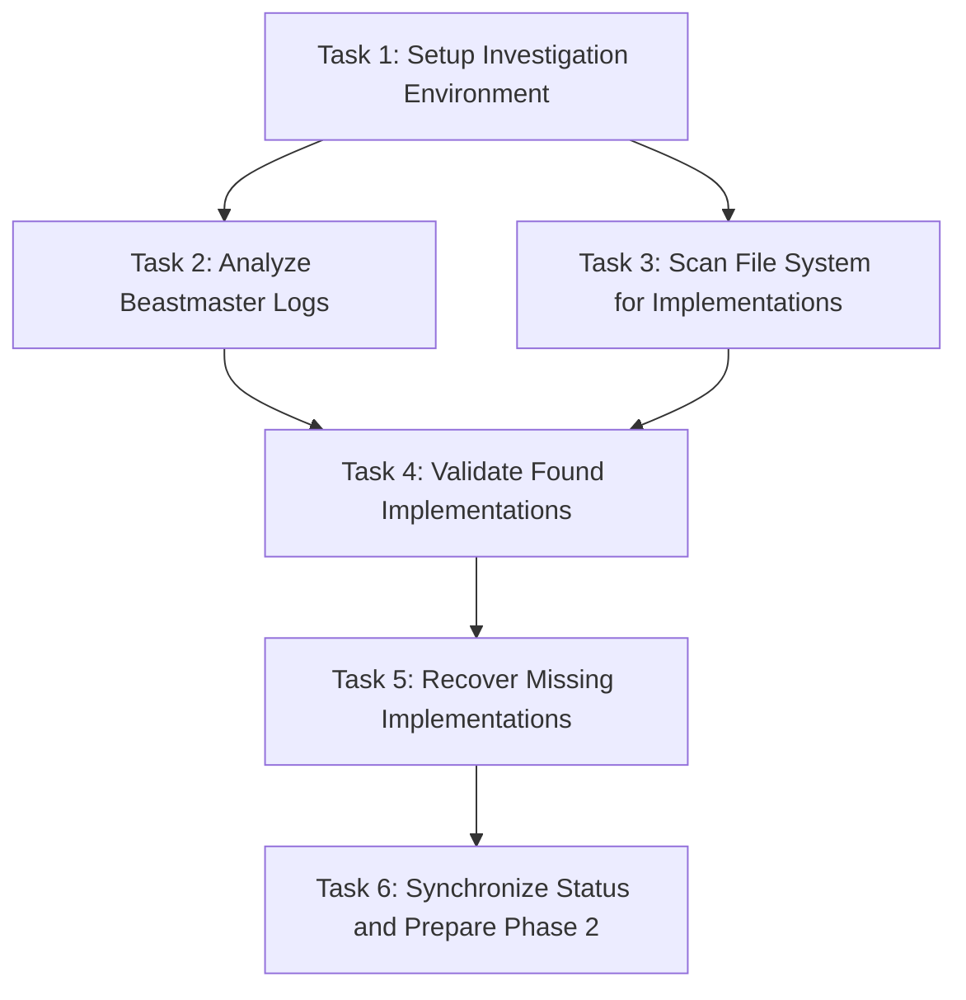

# Capture Beastmaster Outputs - Tasks

## Task Dependency Graph

## Phase 1: Investigation Setup (Parallel Group A)

### Task 1: Setup Investigation Environment
**Estimated Time**: 15 minutes  
**Dependencies**: None  
**Parallel Group**: A  

**Deliverables**:
- Investigation workspace prepared
- Log file access validated
- Search patterns defined
- Output directories created

**Acceptance Criteria**:
- [ ] All beastmaster log files accessible and readable
- [ ] Investigation output directory structure created
- [ ] Search patterns for implementations defined and tested
- [ ] Baseline file system state captured for comparison

**Implementation Notes**:
- Create `investigation/` directory for outputs
- Validate access to `logs/beastmaster-dag/beastmaster-20250930-102354/`
- Define search patterns for CloudflareTunnelDiscoverer, MakefileAnalysisSystem, NetworkTopologyMapper
- Capture current file system state for new file detection

## Phase 2: Evidence Gathering (Parallel Group B)

### Task 2: Analyze Beastmaster Logs
**Estimated Time**: 30 minutes  
**Dependencies**: Task 1  
**Parallel Group**: B  

**Deliverables**:
- `BeastmasterOutputAnalyzer` implementation
- Log analysis report
- Implementation evidence summary
- Kiro session output analysis

**Acceptance Criteria**:
- [ ] All three beastmaster log files parsed and analyzed
- [ ] Evidence of implementation creation extracted from logs
- [ ] Kiro session outputs identified and documented
- [ ] Analysis report generated with findings and recommendations

**Implementation Notes**:
- Inherit from ReflectiveModule for systematic observability
- Parse logs for file creation evidence, error messages, success indicators
- Look for Kiro temp file references (code-stdin-kcs, code-stdin-VRF, code-stdin-jcU)
- Document any implementation hints or partial outputs found

### Task 3: Scan File System for Implementations  
**Estimated Time**: 30 minutes  
**Dependencies**: Task 1  
**Parallel Group**: B  

**Deliverables**:
- `ImplementationDiscoverer` implementation
- File system scan results
- Implementation location report
- New file detection summary

**Acceptance Criteria**:
- [ ] Complete file system scan for new files since 2025-09-30 10:20:00
- [ ] Targeted search for expected implementation files completed
- [ ] Pattern matching for class names and import paths executed
- [ ] Comprehensive report of found implementations generated

**Implementation Notes**:
- Use multiple search strategies: file modification time, name patterns, content analysis
- Search locations: `src/`, `scripts/`, root directory, any new directories
- Look for Python files containing target class names
- Validate file creation timestamps against beastmaster execution window

## Phase 3: Validation and Recovery (Sequential)

### Task 4: Validate Found Implementations
**Estimated Time**: 45 minutes  
**Dependencies**: Task 2, Task 3  
**Parallel Group**: C  

**Deliverables**:
- Implementation validation report
- Functionality test results
- ReflectiveModule compliance check
- Quality assessment summary

**Acceptance Criteria**:
- [ ] Each found implementation tested for basic functionality
- [ ] ReflectiveModule inheritance verified for all implementations
- [ ] Beast Mode pattern compliance validated
- [ ] Implementation completeness assessed against specification requirements

**Implementation Notes**:
- Import and instantiate each found implementation
- Test basic methods and error handling
- Verify health endpoints and observability features
- Check integration with existing system architecture components

### Task 5: Recover Missing Implementations
**Estimated Time**: 60 minutes  
**Dependencies**: Task 4  
**Parallel Group**: D  

**Deliverables**:
- `MissingImplementationRecoverer` implementation
- Recovered/created implementations
- Re-execution results from beastmaster prompts
- Implementation completion report

**Acceptance Criteria**:
- [ ] Missing implementations identified and documented
- [ ] Beastmaster prompts re-executed with proper output capture
- [ ] Any missing implementations created from specification requirements
- [ ] All implementations follow ReflectiveModule pattern and Beast Mode compliance

**Implementation Notes**:
- Re-process beastmaster logs through Kiro with output capture
- Create implementations based on `.kiro/specs/system-architecture-wiring-diagram/tasks.md`
- Ensure proper integration with `src.rm_ddd.core.unified_reflective_module`
- Include comprehensive error handling, logging, and health monitoring

### Task 6: Synchronize Status and Prepare Phase 2
**Estimated Time**: 30 minutes  
**Dependencies**: Task 5  
**Parallel Group**: E  

**Deliverables**:
- `StatusSynchronizer` implementation
- Updated task completion markers
- Phase 2 readiness assessment
- Development continuation plan

**Acceptance Criteria**:
- [ ] Task completion markers created for all verified implementations
- [ ] `ACTIVE_DAG_EXECUTION_STATUS.md` updated with accurate progress
- [ ] Phase 1 marked as complete if all implementations verified
- [ ] Phase 2 dependencies validated and launch readiness confirmed

**Implementation Notes**:
- Create `.task-1.4-complete`, `.task-1.5-complete`, `.task-1.6-complete` markers
- Update progress tracking files with actual implementation status
- Validate Phase 2 task dependencies are satisfied
- Generate recommendations for Phase 2 DAG execution launch

## Execution Strategy

### Parallel Execution Groups
- **Group A**: Environment setup (Task 1)
- **Group B**: Evidence gathering (Tasks 2, 3) - can run in parallel
- **Group C**: Validation (Task 4) - depends on Group B completion
- **Group D**: Recovery (Task 5) - depends on Group C completion  
- **Group E**: Status sync (Task 6) - depends on Group D completion

### Critical Path
Task 1 → Task 4 → Task 5 → Task 6 (3 hours total)

### Optimization Opportunities
- Tasks 2 and 3 can run in parallel after Task 1
- File system scanning can be optimized with targeted search patterns
- Implementation validation can be parallelized per implementation

## Risk Mitigation

### High-Risk Tasks
- **Task 5**: Recovery may require significant implementation work if nothing found
- **Task 4**: Validation may reveal incomplete or broken implementations

### Mitigation Strategies
- **Task 5**: Have specification-based fallback implementation ready
- **Task 4**: Include repair and completion capabilities in validation process

## Success Criteria

### Phase Completion
- [ ] All 6 tasks completed successfully
- [ ] All expected implementations located, validated, or created
- [ ] Task completion status accurately reflects reality
- [ ] Phase 2 DAG execution ready to launch

### Quality Gates
- [ ] All implementations follow ReflectiveModule pattern
- [ ] Basic functionality tests pass for all implementations
- [ ] Complete audit trail of investigation and recovery process
- [ ] No blocking issues for continued development

## Deliverable Summary

### Core Implementations
1. `BeastmasterOutputAnalyzer` - Log analysis and evidence extraction
2. `ImplementationDiscoverer` - File system scanning and implementation location
3. `MissingImplementationRecoverer` - Recovery and creation of missing implementations
4. `StatusSynchronizer` - Status updates and Phase 2 preparation

### System Architecture Implementations (Expected)
1. `CloudflareTunnelDiscoverer` - Task 1.4 implementation
2. `MakefileAnalysisSystem` - Task 1.5 implementation  
3. `NetworkTopologyMapper` - Task 1.6 implementation

### Status and Documentation
1. Investigation report with complete findings
2. Updated task completion markers
3. Phase 2 readiness assessment
4. Development continuation recommendations

**Total Estimated Time**: 3.5 hours  
**Critical Path Time**: 3 hours  
**Parallel Optimization**: 30 minutes saved through parallel execution