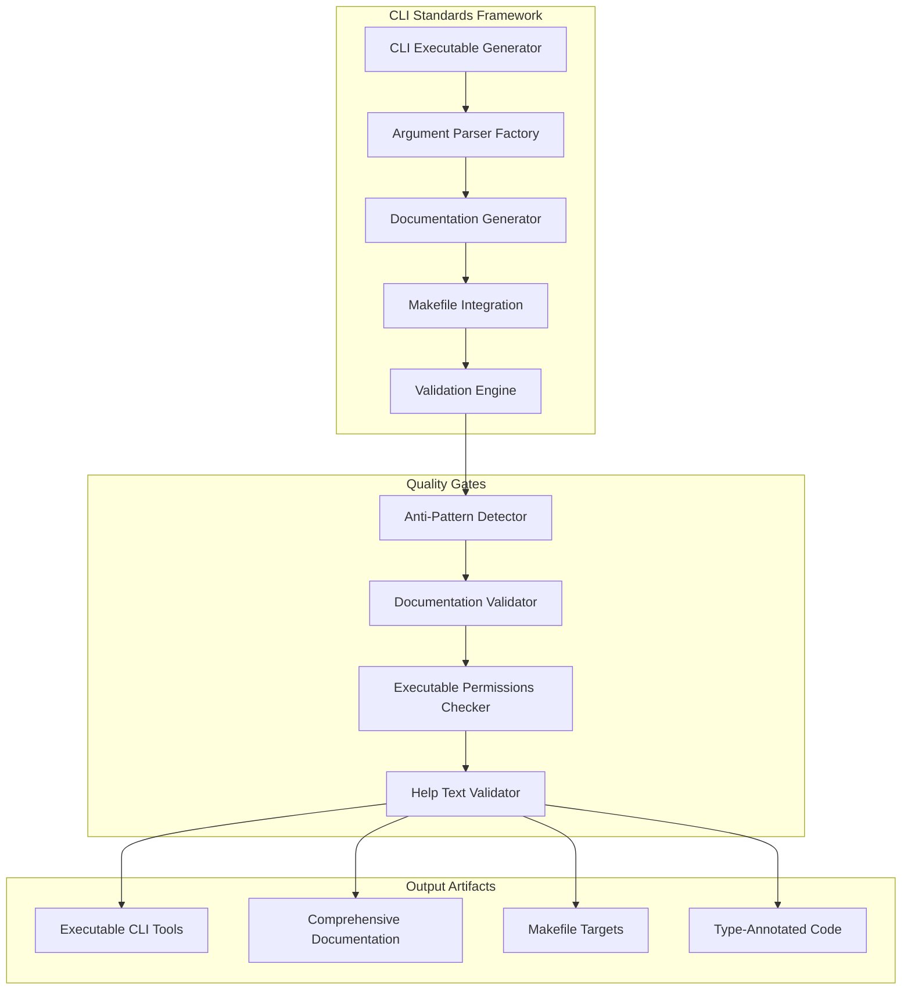

# CLI Implementation Standards - Design Document

## Overview

The CLI Implementation Standards system establishes a comprehensive framework for creating professional, maintainable command-line interfaces across the Beast Mode Framework. This design ensures all CLI tools follow consistent patterns, avoid anti-patterns, and maintain PyPI-grade documentation standards.

## Architecture

### Core Components



### Design Principles

1. **Zero Tolerance Architecture**: Absolute prohibition of `python3` command-line patterns
2. **Documentation-First Design**: Nothing is complete without comprehensive documentation
3. **Professional Standards**: All CLIs behave like production-grade tools
4. **Consistency Framework**: Uniform patterns across all CLI implementations
5. **Executable-Centric**: Proper executables, not script invocations

## Components and Interfaces

### 1. CLI Executable Generator

**Purpose**: Creates proper executable CLI tools with correct permissions and shebang lines.

**Interface**:
```python
class CLIExecutableGenerator:
    def create_executable(
        self, 
        name: str, 
        entry_point: str, 
        description: str
    ) -> ExecutableCLI:
        """Generate a proper CLI executable with permissions and shebang."""
        pass
    
    def validate_executable(self, path: str) -> ValidationResult:
        """Ensure executable meets standards."""
        pass
```

**Key Features**:
- Automatic shebang line insertion (`#!/usr/bin/env python3`)
- Executable permission setting (`chmod +x`)
- Support for both direct execution and uv wrapper
- Validation of executable format

### 2. Argument Parser Factory

**Purpose**: Standardizes argument parsing across all CLI tools using argparse.

**Interface**:
```python
class ArgumentParserFactory:
    def create_parser(
        self, 
        tool_name: str, 
        description: str
    ) -> argparse.ArgumentParser:
        """Create standardized argument parser."""
        pass
    
    def add_standard_options(self, parser: argparse.ArgumentParser) -> None:
        """Add consistent options like --verbose, --log-level."""
        pass
    
    def add_subcommands(
        self, 
        parser: argparse.ArgumentParser, 
        commands: Dict[str, CommandSpec]
    ) -> None:
        """Add subcommands with consistent patterns."""
        pass
```

**Standard Options**:
- `--verbose, -v`: Verbose output
- `--log-level`: Logging level (DEBUG, INFO, WARNING, ERROR)
- `--dry-run`: Simulation mode
- `--help, -h`: Comprehensive help text

### 3. Documentation Generator

**Purpose**: Ensures PyPI-grade documentation for all CLI tools.

**Interface**:
```python
class DocumentationGenerator:
    def generate_docstrings(self, cli_module: Module) -> None:
        """Generate comprehensive docstrings with Args, Returns, Raises."""
        pass
    
    def generate_readme(self, cli_spec: CLISpec) -> str:
        """Generate complete README.md with usage examples."""
        pass
    
    def generate_help_text(self, commands: List[Command]) -> str:
        """Generate comprehensive --help output."""
        pass
    
    def validate_documentation(self, cli_path: str) -> DocumentationReport:
        """Validate documentation completeness."""
        pass
```

**Documentation Requirements**:
- Complete function docstrings with type hints
- Comprehensive README.md with examples
- Detailed help text for all commands and options
- API reference documentation
- Error condition documentation

### 4. Makefile Integration Engine

**Purpose**: Generates proper Makefile targets that use CLI executables instead of Python scripts.

**Interface**:
```python
class MakefileIntegrator:
    def generate_targets(self, cli_tools: List[CLITool]) -> str:
        """Generate Makefile targets using proper CLI commands."""
        pass
    
    def categorize_targets(self, targets: List[Target]) -> CategorizedTargets:
        """Organize targets into BEAST MODE, SETUP & TESTING, LEGACY."""
        pass
    
    def validate_no_python_commands(self, makefile: str) -> ValidationResult:
        """Ensure no python3 script.py patterns exist."""
        pass
```

**Target Categories**:
- **BEAST MODE COMMANDS**: Primary CLI operations
- **SETUP & TESTING**: Development and testing commands  
- **LEGACY**: Deprecated patterns (marked for removal)

### 5. Anti-Pattern Detection Engine

**Purpose**: Enforces zero tolerance for CLI anti-patterns.

**Interface**:
```python
class AntiPatternDetector:
    def scan_for_python_commands(self, directory: str) -> List[Violation]:
        """Detect python3 script.py patterns."""
        pass
    
    def validate_executable_format(self, cli_path: str) -> ValidationResult:
        """Ensure proper executable format."""
        pass
    
    def check_documentation_completeness(self, cli_spec: CLISpec) -> DocumentationReport:
        """Validate documentation requirements."""
        pass
```

**Detected Anti-Patterns**:
- `python3 script.py` command patterns
- Missing executable permissions
- Incomplete documentation
- Missing type hints
- Inconsistent argument parsing

## Data Models

### CLI Specification Model

```python
@dataclass
class CLISpec:
    name: str
    description: str
    entry_point: str
    commands: List[CommandSpec]
    options: List[OptionSpec]
    documentation: DocumentationSpec
    
@dataclass
class CommandSpec:
    name: str
    description: str
    arguments: List[ArgumentSpec]
    options: List[OptionSpec]
    examples: List[str]
    
@dataclass
class DocumentationSpec:
    readme_path: str
    api_docs_path: str
    examples_path: str
    changelog_path: str
    required_sections: List[str]
```

### Validation Models

```python
@dataclass
class ValidationResult:
    is_valid: bool
    violations: List[Violation]
    warnings: List[Warning]
    
@dataclass
class Violation:
    type: ViolationType
    message: str
    file_path: str
    line_number: Optional[int]
    severity: Severity
```

## Error Handling

### Error Categories

1. **Critical Violations**: Python3 command patterns, missing executables
2. **Documentation Errors**: Incomplete docstrings, missing README
3. **Format Violations**: Inconsistent argument parsing, missing permissions
4. **Integration Errors**: Makefile anti-patterns, broken CLI chains

### Error Recovery Strategies

```python
class ErrorRecoveryEngine:
    def fix_python_commands(self, violations: List[Violation]) -> None:
        """Convert python3 commands to proper executables."""
        pass
    
    def generate_missing_documentation(self, cli_spec: CLISpec) -> None:
        """Auto-generate missing documentation sections."""
        pass
    
    def fix_executable_permissions(self, cli_path: str) -> None:
        """Set proper executable permissions."""
        pass
```

## Testing Strategy

### Unit Testing

- **CLI Generator Tests**: Validate executable creation and permissions
- **Parser Factory Tests**: Ensure consistent argument parsing patterns
- **Documentation Tests**: Verify documentation completeness and quality
- **Anti-Pattern Tests**: Confirm detection of all prohibited patterns

### Integration Testing

- **End-to-End CLI Tests**: Test complete CLI workflows
- **Makefile Integration Tests**: Validate proper target generation
- **Cross-CLI Consistency Tests**: Ensure uniform behavior across tools
- **Documentation Integration Tests**: Verify docs match implementation

### Validation Testing

```python
class CLIValidationSuite:
    def test_executable_format(self, cli_path: str) -> TestResult:
        """Test proper executable format and permissions."""
        pass
    
    def test_argument_parsing(self, cli_tool: CLITool) -> TestResult:
        """Test argparse implementation and help text."""
        pass
    
    def test_documentation_completeness(self, cli_spec: CLISpec) -> TestResult:
        """Test PyPI-grade documentation requirements."""
        pass
    
    def test_anti_pattern_absence(self, project_path: str) -> TestResult:
        """Test absence of all prohibited patterns."""
        pass
```

### Performance Testing

- **CLI Startup Time**: Ensure fast CLI initialization
- **Help Generation Speed**: Validate quick help text generation
- **Documentation Build Time**: Test documentation generation performance
- **Validation Engine Speed**: Ensure fast anti-pattern detection

## Implementation Phases

### Phase 1: Core Infrastructure
1. CLI Executable Generator implementation
2. Argument Parser Factory with standard patterns
3. Basic anti-pattern detection engine
4. Executable permission management

### Phase 2: Documentation Framework
1. Documentation Generator with PyPI standards
2. README.md template system
3. API documentation auto-generation
4. Help text standardization

### Phase 3: Integration & Validation
1. Makefile Integration Engine
2. Comprehensive validation suite
3. Error recovery mechanisms
4. Cross-CLI consistency enforcement

### Phase 4: Quality & Enforcement
1. Complete anti-pattern detection
2. Documentation completeness validation
3. Professional CLI behavior verification
4. Zero-tolerance enforcement mechanisms

## Quality Gates

### Definition of Done Validation

Each CLI implementation must pass:

1. **Executable Format Check**: Proper shebang, permissions, direct execution
2. **Argument Parsing Validation**: Professional argparse implementation
3. **Documentation Completeness**: PyPI-grade docs with all required sections
4. **Anti-Pattern Absence**: Zero python3 command patterns
5. **Consistency Verification**: Matches established CLI patterns
6. **Integration Testing**: Works with Makefile and uv wrapper
7. **Help Text Quality**: Comprehensive and professional help output

### Enforcement Mechanisms

- **Pre-commit Hooks**: Validate CLI standards before commits
- **CI/CD Integration**: Automated validation in build pipeline
- **Documentation Gates**: Block incomplete documentation
- **Anti-Pattern Scanning**: Continuous monitoring for violations

This design ensures that all CLI implementations in the Beast Mode Framework meet professional standards, maintain consistency, and provide comprehensive documentation while absolutely prohibiting anti-patterns that lead to maintenance nightmares.