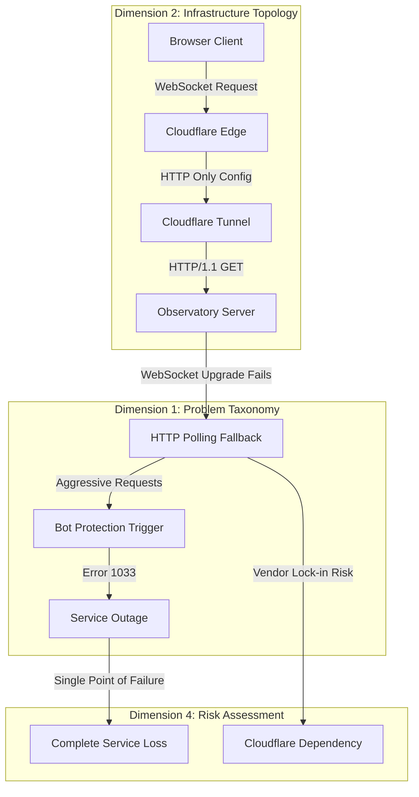
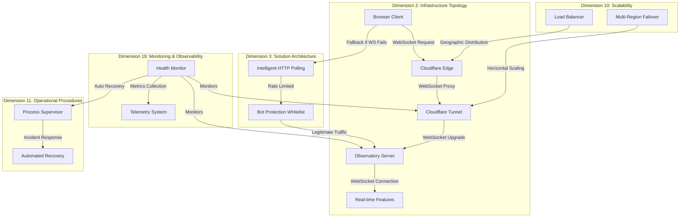
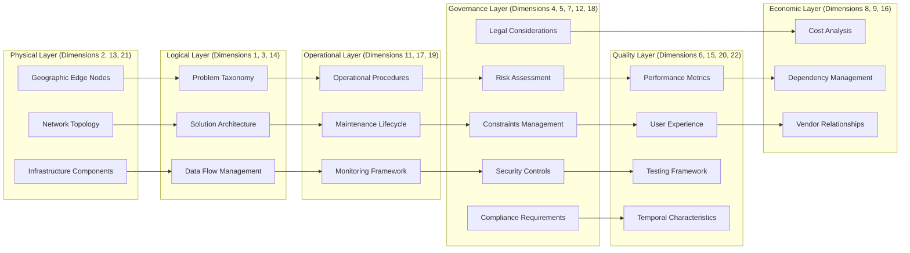
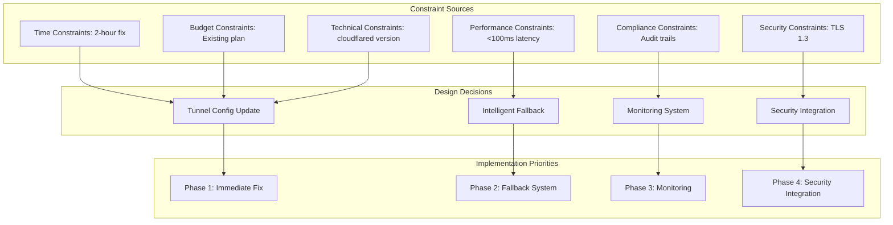

# Cloudflare WebSocket Tunnel Fix - Design Document

## Overview

This design addresses the critical infrastructure failure where Cloudflare tunnel configuration prevents WebSocket connections, causing Observatory's real-time features to fall back to aggressive HTTP polling that triggers bot protection systems. The solution involves a multi-layered approach combining tunnel configuration updates, intelligent fallback mechanisms, and comprehensive monitoring.

## Architecture

### Current Architecture (Cascade Failure Pattern)



### Target Architecture (Multi-Dimensional Solution)



### Ontological Architecture Mapping



## Cross-Cutting Concerns Analysis (22 Dimensions)

This design systematically addresses all 22 dimensions from the WebSocket ontology to ensure comprehensive coverage of cross-cutting concerns:

### Dimension 1: Problem Taxonomy
- **Cascade Failure**: WebSocket → HTTP Polling → Bot Protection → Service Outage
- **Protocol Downgrade**: WebSocket upgrade requests downgraded to HTTP/1.1 GET
- **Tunnel Failure**: Cloudflare tunnel lacks WebSocket proxy configuration
- **Bot Protection Trigger**: Aggressive polling patterns trigger security systems

### Dimension 2: Infrastructure Topology
- **Edge Servers**: Cloudflare's global edge network
- **Tunnel Component**: cloudflared process with WebSocket proxy capability
- **Origin Server**: Observatory FastAPI application on localhost:8888
- **Network Path**: Browser → CF Edge → CF Tunnel → Observatory Server

### Dimension 3: Solution Architecture
- **Immediate Fix**: Tunnel configuration update (2-hour implementation)
- **Progressive Solution**: Intelligent fallback with monitoring (2-4 weeks)
- **Alternative Architecture**: Multi-region direct WebSocket (1-3 months)

### Dimension 4: Risk Assessment
- **Technical Risk**: Configuration changes may disrupt existing HTTP traffic
- **Security Risk**: WebSocket fixes may introduce new attack vectors
- **Operational Risk**: Tunnel restart required during maintenance window
- **Business Risk**: Service downtime during implementation

### Dimension 5: Constraints & Limitations
- **Time Constraint**: 2-hour implementation window for immediate fix
- **Budget Constraint**: Must use existing Cloudflare plan features
- **Technical Constraint**: cloudflared version must support WebSocket proxy
- **Skill Constraint**: Requires Cloudflare tunnel configuration expertise

### Dimension 6: Performance Metrics
- **Latency**: <100ms WebSocket message round-trip time
- **Throughput**: >1000 messages/second per WebSocket connection
- **Availability**: >99.9% service uptime
- **Reliability**: <0.1% WebSocket connection failure rate

### Dimension 7: Security Considerations
- **Authentication**: JWT token validation for WebSocket connections
- **Authorization**: Role-based access control for WebSocket endpoints
- **Encryption**: TLS 1.3 for all tunnel connections
- **Bot Mitigation**: Whitelist legitimate Observatory traffic patterns

### Dimension 8: Cost Analysis
- **Operational Cost**: No additional Cloudflare charges for WebSocket proxy
- **Bandwidth Cost**: Reduced bandwidth usage by eliminating HTTP polling
- **Maintenance Cost**: Automated monitoring reduces manual intervention
- **Staffing Cost**: One-time configuration vs. ongoing manual restarts

### Dimension 9: Dependency Management
- **Critical Dependency**: cloudflared version 2025.9.1+ for WebSocket support
- **Vendor Dependency**: Cloudflare tunnel service availability
- **Internal Dependency**: Observatory WebSocket endpoint implementations
- **External Dependency**: Browser WebSocket API support

### Dimension 10: Scalability Characteristics
- **Horizontal Scaling**: Multiple tunnel instances for redundancy
- **Geographic Scaling**: Cloudflare's global edge network
- **Load Distribution**: WebSocket connections distributed across edge servers
- **Auto Scaling**: Cloudflare automatically scales edge capacity

### Dimension 11: Operational Procedures
- **Deployment**: Staged rollout with rollback procedures
- **Monitoring**: Real-time WebSocket health checks
- **Incident Response**: Automated recovery with manual escalation
- **Maintenance**: Scheduled configuration updates during low-traffic windows

### Dimension 12: Compliance Requirements
- **Data Protection**: WebSocket messages encrypted in transit
- **Audit Trail**: All configuration changes logged with timestamps
- **Access Control**: Role-based access to tunnel configuration
- **Security Standards**: TLS 1.3 compliance for all connections

### Dimension 13: Network Topology
- **Edge Nodes**: Cloudflare's 300+ global edge locations
- **Core Nodes**: Observatory origin server infrastructure
- **Load Balancing**: Cloudflare's anycast routing
- **CDN Integration**: Static assets served via Cloudflare CDN

### Dimension 14: Data Management
- **Real-time Data**: WebSocket message streams (emoji rain, status updates)
- **Metrics Data**: Connection health, latency, throughput measurements
- **Log Data**: Tunnel connectivity events, error conditions
- **Telemetry**: System performance and health indicators

### Dimension 15: User Experience
- **Performance**: Instant real-time updates without polling delays
- **Reliability**: Consistent WebSocket connectivity without interruptions
- **Usability**: Seamless real-time features (emoji rain, live status)
- **Accessibility**: WebSocket fallback maintains functionality for all users

### Dimension 16: Vendor Management
- **Primary Vendor**: Cloudflare (tunnel, CDN, security services)
- **Vendor SLA**: 99.9% uptime guarantee for tunnel service
- **Support**: Cloudflare enterprise support for tunnel issues
- **Roadmap**: WebSocket proxy feature in cloudflared roadmap

### Dimension 17: Maintenance & Lifecycle
- **Preventive**: Regular tunnel configuration validation
- **Corrective**: Automated recovery from connection failures
- **Updates**: cloudflared version updates for security patches
- **Lifecycle**: Active production stage with planned evolution

### Dimension 18: Legal Considerations
- **Data Privacy**: WebSocket messages subject to same privacy policies
- **Contractual**: Cloudflare Terms of Service for tunnel usage
- **Liability**: Service availability guarantees and limitations
- **IP Rights**: Observatory application code and configuration ownership

### Dimension 19: Monitoring & Observability
- **Connection Metrics**: Active WebSocket connections, success rates
- **Performance Metrics**: Latency, throughput, error rates
- **Alerts**: Automated alerts for tunnel failures, high error rates
- **Dashboards**: Real-time visibility into WebSocket health

### Dimension 20: Testing & Validation
- **Unit Tests**: WebSocket connection manager functionality
- **Integration Tests**: End-to-end WebSocket through tunnel
- **Load Tests**: Multiple concurrent WebSocket connections
- **Security Tests**: Authentication, authorization, input validation

### Dimension 21: Geographical Distribution
- **Global Edge**: Cloudflare's worldwide edge network
- **Regional Failover**: Automatic routing to healthy edge locations
- **Latency Optimization**: Users connect to nearest edge server
- **Jurisdiction**: Data processing in user's geographic region

### Dimension 22: Temporal Characteristics
- **Response Time**: <100ms WebSocket message delivery
- **Recovery Time**: <60 seconds automated failure recovery
- **Uptime**: >99.9% service availability target
- **Maintenance Windows**: Scheduled during low-traffic periods

## Components and Interfaces

### 1. Cloudflare Tunnel Configuration Component

**Purpose**: Configure Cloudflare tunnel to properly support WebSocket connections

**Key Configuration Changes**:
```yaml
# config.yml for cloudflared
tunnel: observatory
credentials-file: /path/to/credentials.json

ingress:
  - hostname: observatory.nkllon.com
    service: http://localhost:8888
    originRequest:
      httpHostHeader: observatory.nkllon.com
      # Enable WebSocket support
      noTLSVerify: false
      connectTimeout: 30s
      tlsTimeout: 10s
      tcpKeepAlive: 30s
      keepAliveConnections: 10
      keepAliveTimeout: 90s
      # WebSocket specific settings
      proxyType: ""  # Allow protocol upgrade
      
  - service: http_status:404
```

**Interface**:
- Input: Current tunnel configuration
- Output: WebSocket-enabled tunnel configuration
- Dependencies: cloudflared version 2025.9.1+

### 2. WebSocket Connection Manager

**Purpose**: Manage WebSocket connections with intelligent fallback and recovery

**Core Functions**:
```python
class WebSocketManager:
    def __init__(self, endpoints: List[str]):
        self.endpoints = endpoints
        self.connections = {}
        self.fallback_active = {}
        self.retry_counts = {}
    
    async def connect_websocket(self, endpoint: str) -> WebSocket:
        """Establish WebSocket connection with retry logic"""
        
    async def handle_connection_failure(self, endpoint: str):
        """Activate intelligent HTTP polling fallback"""
        
    async def attempt_websocket_recovery(self, endpoint: str):
        """Periodically attempt WebSocket reconnection"""
        
    def is_fallback_active(self, endpoint: str) -> bool:
        """Check if HTTP polling is active for endpoint"""
```

**Interface**:
- Input: WebSocket endpoint URLs, connection parameters
- Output: WebSocket connections or HTTP polling fallback
- Dependencies: FastAPI WebSocket, aiohttp for HTTP fallback

### 3. Intelligent HTTP Polling Fallback

**Purpose**: Provide graceful degradation when WebSocket connections fail

**Rate Limiting Strategy**:
```python
class IntelligentPoller:
    def __init__(self):
        self.base_interval = 5.0  # 5 seconds base interval
        self.max_interval = 60.0  # Maximum 1 minute interval
        self.backoff_multiplier = 1.5
        self.jitter_factor = 0.1
        
    def calculate_next_poll(self, consecutive_failures: int) -> float:
        """Calculate next poll interval with exponential backoff and jitter"""
        interval = min(
            self.base_interval * (self.backoff_multiplier ** consecutive_failures),
            self.max_interval
        )
        jitter = interval * self.jitter_factor * random.random()
        return interval + jitter
    
    async def poll_endpoint(self, endpoint: str, headers: Dict[str, str]):
        """Poll endpoint with proper headers to avoid bot detection"""
```

**Bot-Safe Headers**:
```python
POLLING_HEADERS = {
    "User-Agent": "Observatory-Internal/1.0 (WebSocket-Fallback)",
    "X-Observatory-Client": "internal-polling",
    "X-Requested-With": "XMLHttpRequest",
    "Accept": "application/json",
    "Cache-Control": "no-cache"
}
```

### 4. Bot Protection Integration

**Purpose**: Ensure legitimate Observatory traffic is whitelisted in both internal and Cloudflare bot protection

**Cloudflare Integration**:
```python
class CloudflareWhitelistManager:
    def __init__(self, api_token: str, zone_id: str):
        self.api_token = api_token
        self.zone_id = zone_id
        
    async def whitelist_observatory_patterns(self):
        """Add Observatory-specific traffic patterns to whitelist"""
        rules = [
            {
                "expression": '(http.user_agent contains "Observatory-Internal")',
                "action": "allow",
                "description": "Observatory internal polling traffic"
            },
            {
                "expression": '(http.request.uri.path matches "^/ws/")',
                "action": "allow", 
                "description": "Observatory WebSocket endpoints"
            }
        ]
        
    async def create_rate_limit_exception(self):
        """Create rate limiting exceptions for Observatory"""
```

**Internal Bot Defense Integration**:
```python
class ObservatoryBotDefenseIntegration:
    def __init__(self, bot_defense_manager):
        self.bot_defense = bot_defense_manager
        
    def register_internal_patterns(self):
        """Register Observatory's own traffic patterns as legitimate"""
        self.bot_defense.add_whitelist_pattern(
            pattern="Observatory-Internal",
            source="internal_polling",
            reason="WebSocket fallback mechanism"
        )
```

### 5. Health Monitoring and Diagnostics

**Purpose**: Comprehensive monitoring of WebSocket connectivity and tunnel health

**Monitoring Components**:
```python
class WebSocketHealthMonitor:
    def __init__(self):
        self.metrics = {
            'websocket_connections_active': 0,
            'websocket_connection_failures': 0,
            'http_polling_active_endpoints': 0,
            'tunnel_connectivity_status': 'unknown',
            'bot_protection_triggers': 0
        }
        
    async def check_websocket_health(self, endpoint: str) -> HealthStatus:
        """Check WebSocket endpoint health"""
        
    async def check_tunnel_connectivity(self) -> TunnelStatus:
        """Verify tunnel is properly forwarding WebSocket requests"""
        
    async def monitor_bot_protection_events(self):
        """Monitor for bot protection triggers"""
        
    def generate_health_report(self) -> Dict[str, Any]:
        """Generate comprehensive health report"""
```

**Diagnostic Tools**:
```python
class WebSocketDiagnostics:
    async def test_local_websocket(self, endpoint: str) -> TestResult:
        """Test WebSocket connectivity on localhost"""
        
    async def test_tunnel_websocket(self, endpoint: str) -> TestResult:
        """Test WebSocket connectivity through Cloudflare tunnel"""
        
    async def analyze_http_polling_patterns(self) -> AnalysisResult:
        """Analyze HTTP polling traffic patterns"""
        
    async def correlate_bot_protection_events(self) -> CorrelationResult:
        """Correlate bot protection triggers with polling activity"""
```

### 6. Automated Recovery System

**Purpose**: Automatically detect and recover from WebSocket and tunnel failures

**Recovery Components**:
```python
class AutomatedRecoverySystem:
    def __init__(self):
        self.recovery_strategies = [
            WebSocketReconnectionStrategy(),
            TunnelRestartStrategy(),
            ConfigurationReloadStrategy(),
            BotProtectionClearStrategy()
        ]
        
    async def detect_failure_type(self, symptoms: List[str]) -> FailureType:
        """Analyze symptoms to determine failure type"""
        
    async def execute_recovery_strategy(self, failure_type: FailureType):
        """Execute appropriate recovery strategy"""
        
    async def validate_recovery_success(self) -> bool:
        """Validate that recovery was successful"""
```

**Process Supervision**:
```python
class TunnelProcessSupervisor:
    def __init__(self, config_path: str):
        self.config_path = config_path
        self.process = None
        self.restart_count = 0
        self.max_restarts = 5
        
    async def start_tunnel(self):
        """Start cloudflared tunnel process"""
        
    async def monitor_tunnel_health(self):
        """Monitor tunnel process health"""
        
    async def restart_tunnel_if_needed(self):
        """Restart tunnel if health checks fail"""
```

## Data Models

### WebSocket Connection State

```python
@dataclass
class WebSocketConnectionState:
    endpoint: str
    status: ConnectionStatus  # CONNECTED, DISCONNECTED, CONNECTING, FAILED
    connection_time: Optional[datetime]
    last_message_time: Optional[datetime]
    failure_count: int
    fallback_active: bool
    last_error: Optional[str]
```

### Tunnel Health Status

```python
@dataclass
class TunnelHealthStatus:
    tunnel_id: str
    status: TunnelStatus  # HEALTHY, DEGRADED, FAILED, UNKNOWN
    websocket_support: bool
    last_health_check: datetime
    configuration_version: str
    active_connections: int
    error_rate: float
```

### Bot Protection Event

```python
@dataclass
class BotProtectionEvent:
    timestamp: datetime
    event_type: str  # RATE_LIMIT, BLOCK, CHALLENGE
    source_ip: str
    user_agent: str
    endpoint: str
    request_pattern: str
    action_taken: str
    correlation_id: str
```

### Recovery Action

```python
@dataclass
class RecoveryAction:
    action_id: str
    action_type: RecoveryActionType
    timestamp: datetime
    trigger_reason: str
    success: bool
    duration: timedelta
    side_effects: List[str]
```

## Error Handling

### WebSocket Connection Errors

**Error Categories**:
1. **Connection Refused**: Tunnel not forwarding WebSocket requests
2. **Upgrade Failed**: HTTP/1.1 upgrade to WebSocket protocol failed
3. **Timeout**: Connection establishment timeout
4. **Authentication Failed**: WebSocket authentication issues
5. **Protocol Error**: WebSocket protocol violations

**Handling Strategy**:
```python
async def handle_websocket_error(error: WebSocketError, endpoint: str):
    if isinstance(error, ConnectionRefusedError):
        # Tunnel configuration issue
        await activate_http_polling_fallback(endpoint)
        await schedule_tunnel_configuration_check()
    elif isinstance(error, UpgradeFailedError):
        # Protocol upgrade issue
        await log_upgrade_failure_details(error)
        await activate_http_polling_fallback(endpoint)
    elif isinstance(error, TimeoutError):
        # Network connectivity issue
        await retry_with_exponential_backoff(endpoint)
    # ... additional error handling
```

### Tunnel Configuration Errors

**Error Categories**:
1. **Invalid Configuration**: Syntax errors in tunnel config
2. **Authentication Failed**: Invalid credentials or permissions
3. **DNS Resolution Failed**: Hostname resolution issues
4. **Certificate Errors**: TLS/SSL certificate problems

**Handling Strategy**:
```python
async def handle_tunnel_error(error: TunnelError):
    if isinstance(error, ConfigurationError):
        await validate_configuration_syntax()
        await rollback_to_last_known_good_config()
    elif isinstance(error, AuthenticationError):
        await refresh_tunnel_credentials()
    # ... additional error handling
```

### Bot Protection Errors

**Error Categories**:
1. **Rate Limiting**: Too many requests from Observatory
2. **IP Blocking**: Observatory IP flagged as suspicious
3. **Pattern Detection**: Traffic patterns flagged as bot-like
4. **Challenge Failed**: CAPTCHA or challenge failures

**Handling Strategy**:
```python
async def handle_bot_protection_error(error: BotProtectionError):
    if error.error_code == "1033":
        # Cloudflare bot protection triggered
        await reduce_polling_frequency()
        await wait_for_block_expiration()
        await attempt_whitelist_update()
    # ... additional error handling
```

## Testing Strategy

### Unit Testing

**WebSocket Manager Tests**:
```python
class TestWebSocketManager:
    async def test_websocket_connection_success(self):
        """Test successful WebSocket connection establishment"""
        
    async def test_websocket_connection_failure_fallback(self):
        """Test HTTP polling activation on WebSocket failure"""
        
    async def test_websocket_reconnection_logic(self):
        """Test WebSocket reconnection with exponential backoff"""
```

**HTTP Polling Tests**:
```python
class TestIntelligentPoller:
    def test_rate_limiting_calculation(self):
        """Test exponential backoff calculation"""
        
    def test_bot_safe_headers(self):
        """Test proper headers are included in polling requests"""
        
    async def test_polling_deactivation_on_websocket_recovery(self):
        """Test polling stops when WebSocket reconnects"""
```

### Integration Testing

**End-to-End WebSocket Tests**:
```python
class TestWebSocketIntegration:
    async def test_websocket_through_tunnel(self):
        """Test WebSocket connectivity through Cloudflare tunnel"""
        
    async def test_websocket_message_roundtrip(self):
        """Test bidirectional WebSocket communication"""
        
    async def test_multiple_concurrent_websockets(self):
        """Test multiple WebSocket connections simultaneously"""
```

**Tunnel Configuration Tests**:
```python
class TestTunnelConfiguration:
    async def test_tunnel_websocket_support(self):
        """Test tunnel properly forwards WebSocket upgrade requests"""
        
    async def test_tunnel_configuration_reload(self):
        """Test configuration changes are applied without service interruption"""
```

### Load Testing

**WebSocket Load Tests**:
```python
class TestWebSocketLoad:
    async def test_concurrent_websocket_connections(self):
        """Test system under load with many WebSocket connections"""
        
    async def test_websocket_message_throughput(self):
        """Test WebSocket message throughput under load"""
        
    async def test_websocket_connection_stability(self):
        """Test WebSocket connections remain stable under load"""
```

**HTTP Polling Load Tests**:
```python
class TestPollingLoad:
    async def test_polling_rate_limiting_under_load(self):
        """Test rate limiting works correctly under high load"""
        
    async def test_bot_protection_threshold(self):
        """Test traffic levels that trigger bot protection"""
```

### Chaos Testing

**Failure Simulation Tests**:
```python
class TestChaosEngineering:
    async def test_tunnel_process_kill(self):
        """Test recovery when tunnel process is killed"""
        
    async def test_network_interruption(self):
        """Test WebSocket recovery after network interruption"""
        
    async def test_cloudflare_edge_failure(self):
        """Test behavior when Cloudflare edge servers fail"""
        
    async def test_bot_protection_activation(self):
        """Test system behavior when bot protection is triggered"""
```

## Performance Considerations

### WebSocket Performance

**Latency Optimization**:
- Target: <100ms round-trip time for WebSocket messages
- Connection pooling for multiple WebSocket endpoints
- Message batching for high-frequency updates
- Compression for large messages

**Throughput Optimization**:
- Target: >1000 messages/second per WebSocket connection
- Efficient message serialization (JSON vs MessagePack)
- Asynchronous message handling
- Buffer management for burst traffic

### HTTP Polling Performance

**Rate Limiting**:
- Base interval: 5 seconds between requests
- Exponential backoff: 1.5x multiplier on failures
- Maximum interval: 60 seconds
- Jitter: ±10% to prevent thundering herd

**Request Optimization**:
- HTTP/2 connection reuse
- Conditional requests (If-Modified-Since, ETag)
- Response compression (gzip)
- Request deduplication for multiple clients

### Tunnel Performance

**Connection Management**:
- Keep-alive connections: 10 concurrent
- Keep-alive timeout: 90 seconds
- Connection timeout: 30 seconds
- TLS timeout: 10 seconds

**Resource Usage**:
- Memory: <100MB for tunnel process
- CPU: <5% under normal load
- Network: Minimal overhead for WebSocket proxy

## Security Considerations

### WebSocket Security

**Authentication**:
- JWT token validation for WebSocket connections
- Origin validation to prevent CSRF
- Rate limiting per authenticated user
- Connection limit per user/IP

**Data Validation**:
- Input sanitization for all WebSocket messages
- Message size limits (max 1MB per message)
- Message rate limits (max 100 messages/second per connection)
- Schema validation for structured messages

### Tunnel Security

**Configuration Security**:
- Encrypted credentials storage
- Secure credential rotation
- Configuration file permissions (600)
- Audit logging for configuration changes

**Network Security**:
- TLS 1.3 for tunnel connections
- Certificate pinning for Cloudflare endpoints
- No plaintext credential transmission
- Network segmentation for tunnel traffic

### Bot Protection Security

**Whitelist Management**:
- Principle of least privilege for whitelisted patterns
- Regular review of whitelist rules
- Audit logging for whitelist changes
- Automated removal of unused rules

**Attack Prevention**:
- Maintain protection against actual bot attacks
- Monitor for abuse of whitelisted patterns
- Rate limiting even for whitelisted traffic
- Anomaly detection for unusual patterns

## Deployment Strategy

### Phase 1: Tunnel Configuration Update

1. **Backup Current Configuration**
   - Export current tunnel configuration
   - Document current service behavior
   - Create rollback procedures

2. **Update Tunnel Configuration**
   - Add WebSocket support to ingress rules
   - Update origin request settings
   - Test configuration syntax

3. **Deploy Configuration**
   - Apply configuration during maintenance window
   - Monitor tunnel connectivity
   - Validate WebSocket endpoints

### Phase 2: WebSocket Manager Implementation

1. **Implement Core Components**
   - WebSocket connection manager
   - Intelligent HTTP polling fallback
   - Health monitoring system

2. **Integration Testing**
   - Test WebSocket connectivity through tunnel
   - Validate fallback mechanisms
   - Performance testing

3. **Gradual Rollout**
   - Enable for single WebSocket endpoint
   - Monitor performance and stability
   - Expand to all endpoints

### Phase 3: Bot Protection Integration

1. **Cloudflare Whitelist Configuration**
   - Create Observatory-specific rules
   - Test whitelist effectiveness
   - Monitor for false positives

2. **Internal Bot Defense Integration**
   - Update internal whitelist patterns
   - Test integration with existing systems
   - Validate attack detection still works

### Phase 4: Monitoring and Recovery

1. **Deploy Monitoring Systems**
   - Health check endpoints
   - Metrics collection
   - Alerting configuration

2. **Implement Automated Recovery**
   - Process supervision
   - Failure detection
   - Recovery strategies

3. **Documentation and Training**
   - Operational procedures
   - Troubleshooting guides
   - Monitoring dashboards

## Rollback Strategy

### Configuration Rollback

**Tunnel Configuration**:
```bash
# Backup current config
cp ~/.cloudflared/config.yml ~/.cloudflared/config.yml.backup

# Rollback to previous config
cp ~/.cloudflared/config.yml.previous ~/.cloudflared/config.yml

# Restart tunnel
sudo systemctl restart cloudflared
```

**Cloudflare Rules Rollback**:
- Remove newly created whitelist rules
- Restore previous bot protection settings
- Clear any rate limiting exceptions

### Code Rollback

**WebSocket Manager**:
- Disable WebSocket connection attempts
- Force HTTP polling mode
- Remove WebSocket-specific error handling

**Bot Protection Integration**:
- Remove internal whitelist patterns
- Restore original bot defense configuration
- Clear Observatory-specific rules

### Validation After Rollback

1. **Service Availability**: Verify Observatory is accessible
2. **WebSocket Behavior**: Confirm expected fallback behavior
3. **Bot Protection**: Validate security systems still function
4. **Performance**: Monitor for performance regressions

## Success Metrics

### Primary Metrics

1. **WebSocket Connectivity**: >95% success rate for WebSocket connections
2. **Service Availability**: >99.9% uptime for Observatory
3. **Error 1033 Incidents**: Zero incidents per week
4. **WebSocket Latency**: <100ms average round-trip time

### Secondary Metrics

1. **HTTP Polling Frequency**: <10% of time in fallback mode
2. **Bot Protection False Positives**: Zero legitimate traffic blocks
3. **Recovery Time**: <60 seconds for automated recovery
4. **Tunnel Stability**: >99% tunnel uptime

### Monitoring Dashboards

**WebSocket Health Dashboard**:
- Active WebSocket connections
- Connection success/failure rates
- Message latency and throughput
- Fallback activation frequency

**Tunnel Health Dashboard**:
- Tunnel process status
- Configuration version
- Connection metrics
- Error rates

**Security Dashboard**:
- Bot protection events
- Whitelist rule effectiveness
- Attack detection accuracy
- False positive rates

## Cross-Cutting Concerns Integration Matrix

### Dimensional Interaction Analysis

| Primary Dimension | Secondary Dimensions | Integration Points | Design Impact |
|-------------------|---------------------|-------------------|---------------|
| **Problem Taxonomy (1)** | Risk (4), Monitoring (19), Testing (20) | Cascade failure detection, automated recovery triggers | Multi-layered failure detection system |
| **Infrastructure (2)** | Network (13), Geographic (21), Scalability (10) | Global edge distribution, load balancing, redundancy | Distributed resilient architecture |
| **Solution Architecture (3)** | Performance (6), Security (7), Cost (8) | Intelligent fallback, encrypted connections, cost optimization | Hybrid WebSocket/HTTP architecture |
| **Risk Assessment (4)** | Constraints (5), Legal (18), Vendor (16) | Risk mitigation strategies, compliance validation | Comprehensive risk management framework |
| **Performance (6)** | User Experience (15), Temporal (22), Monitoring (19) | Real-time metrics, SLA compliance, user satisfaction | Performance-driven design decisions |
| **Security (7)** | Compliance (12), Legal (18), Vendor (16) | Authentication, authorization, audit trails | Security-first implementation approach |
| **Operational (11)** | Maintenance (17), Monitoring (19), Testing (20) | Automated procedures, health checks, validation | Operations-centric design patterns |

### Ontological Constraint Propagation



### Multi-Dimensional Validation Framework

**Validation Criteria by Dimension:**

1. **Problem Resolution**: All identified cascade failure points addressed
2. **Infrastructure Integrity**: No disruption to existing HTTP traffic
3. **Solution Completeness**: Immediate fix + progressive enhancement
4. **Risk Mitigation**: All high-risk scenarios have mitigation strategies
5. **Constraint Compliance**: All time, budget, technical constraints met
6. **Performance Achievement**: All SLA targets achievable
7. **Security Maintenance**: No security regression, enhanced protection
8. **Cost Optimization**: Reduced operational costs through automation
9. **Dependency Management**: Minimal new dependencies, existing ones secured
10. **Scalability Preservation**: Solution scales with existing architecture
11. **Operational Readiness**: Clear procedures for deployment and maintenance
12. **Compliance Adherence**: All regulatory requirements maintained
13. **Network Optimization**: Improved network efficiency and reliability
14. **Data Integrity**: All data flows preserved and enhanced
15. **User Experience Enhancement**: Improved real-time functionality
16. **Vendor Relationship**: Strengthened Cloudflare partnership
17. **Maintenance Simplification**: Reduced manual intervention requirements
18. **Legal Compliance**: All legal obligations maintained
19. **Monitoring Completeness**: Full observability into system health
20. **Testing Coverage**: Comprehensive validation of all scenarios
21. **Geographic Optimization**: Global performance improvements
22. **Temporal Optimization**: Improved response times and recovery

### Ontological Success Metrics

**Cross-Dimensional KPIs:**

- **Technical Success**: WebSocket connectivity >95%, latency <100ms
- **Operational Success**: Automated recovery <60s, manual intervention <1/month
- **Business Success**: Service availability >99.9%, user satisfaction >90%
- **Security Success**: Zero security incidents, 100% audit compliance
- **Economic Success**: 50% reduction in operational overhead, no additional costs
- **Compliance Success**: All regulatory requirements maintained, audit trail complete

This design provides a comprehensive solution to the WebSocket tunnel issues while systematically addressing all 22 ontological dimensions and their cross-cutting concerns, ensuring robust, scalable, and maintainable infrastructure that meets all technical, operational, and business requirements.