# CMS Architecture Design

## Overview

The CMS Architecture design provides a comprehensive, stakeholder-centric content management system built on the Beast Mode Framework. The system leverages Directus CMS as the core platform with extensive customizations and integrations to serve developers, DevOps, executives, and architects.

## System Architecture

### High-Level Architecture

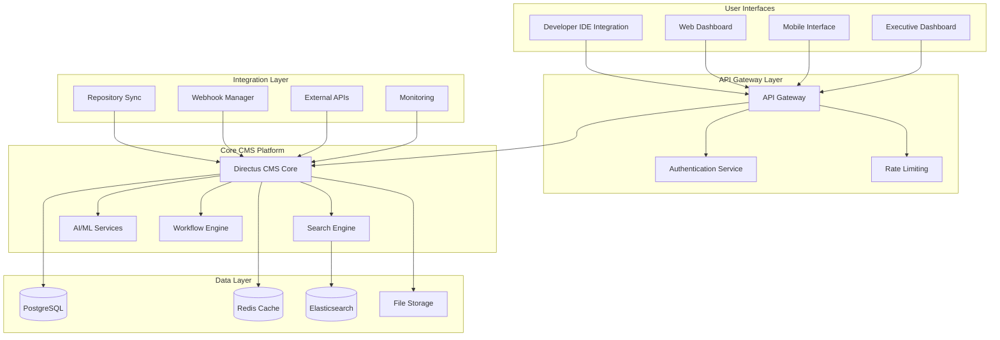

### Component Architecture

#### 1. Directus CMS Core Platform

**Base Configuration:**
- **Database:** PostgreSQL with optimized schema
- **Cache:** Redis for session and query caching
- **Storage:** File system with S3-compatible backup
- **API:** REST and GraphQL endpoints

**Custom Extensions:**
- Stakeholder-specific dashboards
- Advanced search capabilities
- AI-powered content recommendations
- Automated workflow engines

#### 2. Search and Discovery Engine

**Technology Stack:**
- **Primary:** Elasticsearch for full-text and semantic search
- **AI/ML:** Vector embeddings for semantic similarity
- **Indexing:** Real-time content indexing with change detection
- **Analytics:** Search query analysis and optimization

**Search Capabilities:**
```python
class SearchEngine:
    def semantic_search(self, query: str, context: Dict) -> List[SearchResult]:
        """AI-powered semantic search with context awareness"""
        
    def code_pattern_search(self, pattern: str) -> List[CodeMatch]:
        """Pattern matching for code similarity"""
        
    def stakeholder_search(self, query: str, role: str) -> List[RoleSpecificResult]:
        """Role-based search with filtered results"""
```

#### 3. AI/ML Services Integration

**Content Intelligence:**
- Automated content classification and tagging
- Duplicate detection and consolidation
- Quality scoring and recommendations
- Relationship extraction and mapping

**Predictive Analytics:**
- Usage pattern prediction
- Content freshness forecasting
- User behavior analysis
- Performance optimization recommendations

#### 4. Workflow and Automation Engine

**Automated Processes:**
- Repository synchronization workflows
- Content approval and review processes
- Governance compliance checking
- Notification and alerting systems

**Custom Workflows:**
```yaml
# Example workflow configuration
workflows:
  code_review_integration:
    trigger: "repository_change"
    steps:
      - validate_governance_compliance
      - extract_metadata
      - update_relationships
      - notify_stakeholders
```

## Stakeholder-Specific Design

### Developer Experience Design

#### IDE Integration Architecture

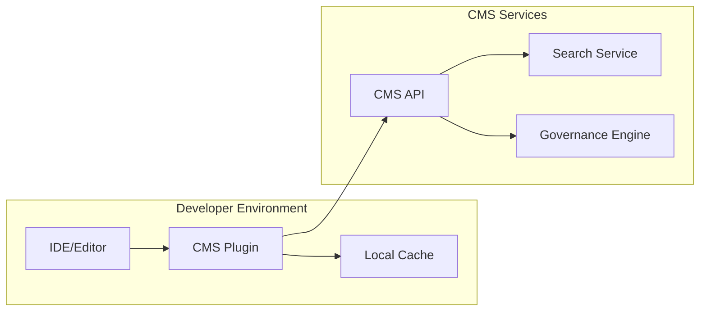

**Features:**
- Real-time code similarity detection
- Governance rule validation
- Contextual documentation suggestions
- Automated code reuse recommendations

#### Developer Dashboard Design

**Components:**
- Personal code contribution analytics
- Governance compliance scorecard
- Recommended learning resources
- Team collaboration metrics

### DevOps Experience Design

#### Operations Dashboard Architecture

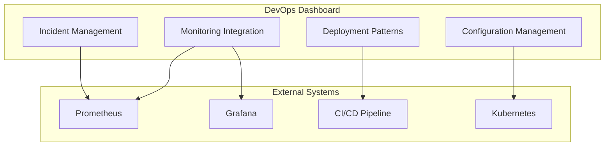

**Features:**
- Deployment pattern library with search
- Real-time system health correlation
- Automated incident documentation
- Configuration drift detection

### Executive Experience Design

#### Executive Dashboard Architecture

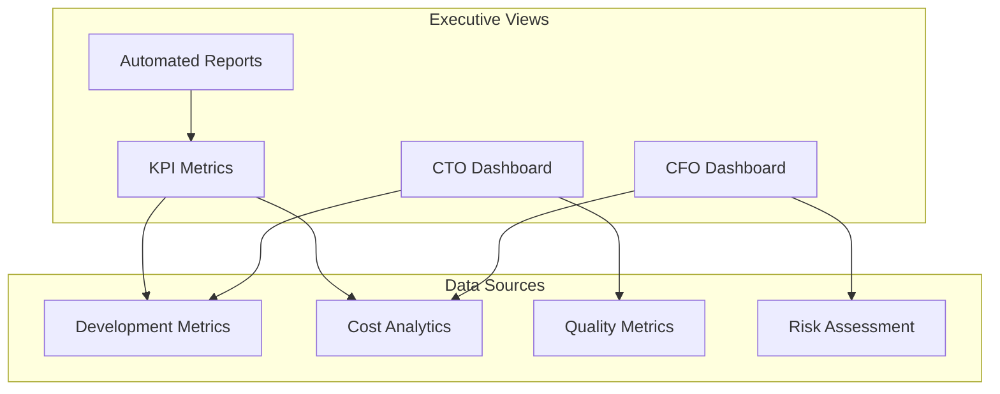

**CFO-Specific Features:**
- Development cost tracking and analysis
- ROI calculations for technical investments
- Budget variance reporting
- Vendor and license cost optimization

**CTO-Specific Features:**
- Technology stack analysis and evolution
- Technical debt quantification and tracking
- Team productivity analytics
- Strategic initiative progress monitoring

### Architect Experience Design

#### Architecture Governance Engine

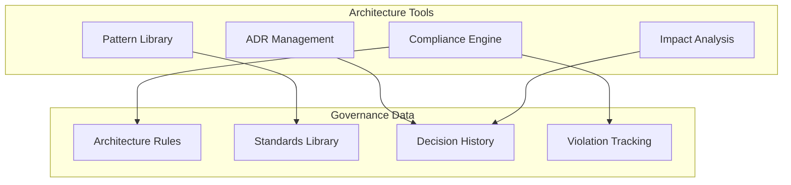

**Features:**
- Automated architecture compliance checking
- Design pattern recommendation engine
- Cross-system dependency analysis
- Architecture evolution tracking

## Data Model Design

### Core Entity Relationships

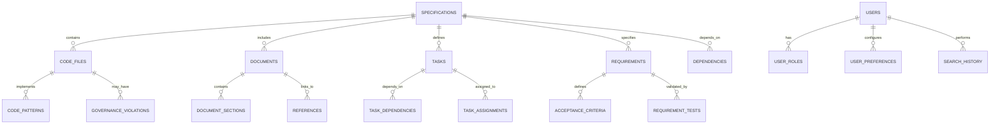

### Extended Schema Design

#### Stakeholder-Specific Collections

**Developer Collections:**
```sql
-- Code similarity tracking
CREATE TABLE code_similarities (
    id UUID PRIMARY KEY,
    source_file_id UUID REFERENCES code_files(id),
    similar_file_id UUID REFERENCES code_files(id),
    similarity_score DECIMAL(3,2),
    similarity_type VARCHAR(50),
    created_at TIMESTAMP DEFAULT NOW()
);

-- Governance violations
CREATE TABLE governance_violations (
    id UUID PRIMARY KEY,
    code_file_id UUID REFERENCES code_files(id),
    rule_id VARCHAR(100),
    violation_type VARCHAR(50),
    severity VARCHAR(20),
    description TEXT,
    resolved BOOLEAN DEFAULT FALSE,
    created_at TIMESTAMP DEFAULT NOW()
);
```

**DevOps Collections:**
```sql
-- Deployment patterns
CREATE TABLE deployment_patterns (
    id UUID PRIMARY KEY,
    pattern_name VARCHAR(100),
    description TEXT,
    pattern_type VARCHAR(50),
    success_rate DECIMAL(5,2),
    usage_count INTEGER DEFAULT 0,
    metadata JSONB,
    created_at TIMESTAMP DEFAULT NOW()
);

-- Incident correlations
CREATE TABLE incident_correlations (
    id UUID PRIMARY KEY,
    incident_id VARCHAR(100),
    code_change_id UUID,
    deployment_id UUID,
    correlation_strength DECIMAL(3,2),
    created_at TIMESTAMP DEFAULT NOW()
);
```

**Executive Collections:**
```sql
-- Cost tracking
CREATE TABLE development_costs (
    id UUID PRIMARY KEY,
    specification_id UUID REFERENCES specifications(id),
    cost_type VARCHAR(50),
    amount DECIMAL(10,2),
    currency VARCHAR(3) DEFAULT 'USD',
    period_start DATE,
    period_end DATE,
    created_at TIMESTAMP DEFAULT NOW()
);

-- ROI calculations
CREATE TABLE roi_calculations (
    id UUID PRIMARY KEY,
    specification_id UUID REFERENCES specifications(id),
    investment_amount DECIMAL(10,2),
    benefit_amount DECIMAL(10,2),
    roi_percentage DECIMAL(5,2),
    calculation_date DATE,
    created_at TIMESTAMP DEFAULT NOW()
);
```

## Security Design

### Authentication and Authorization

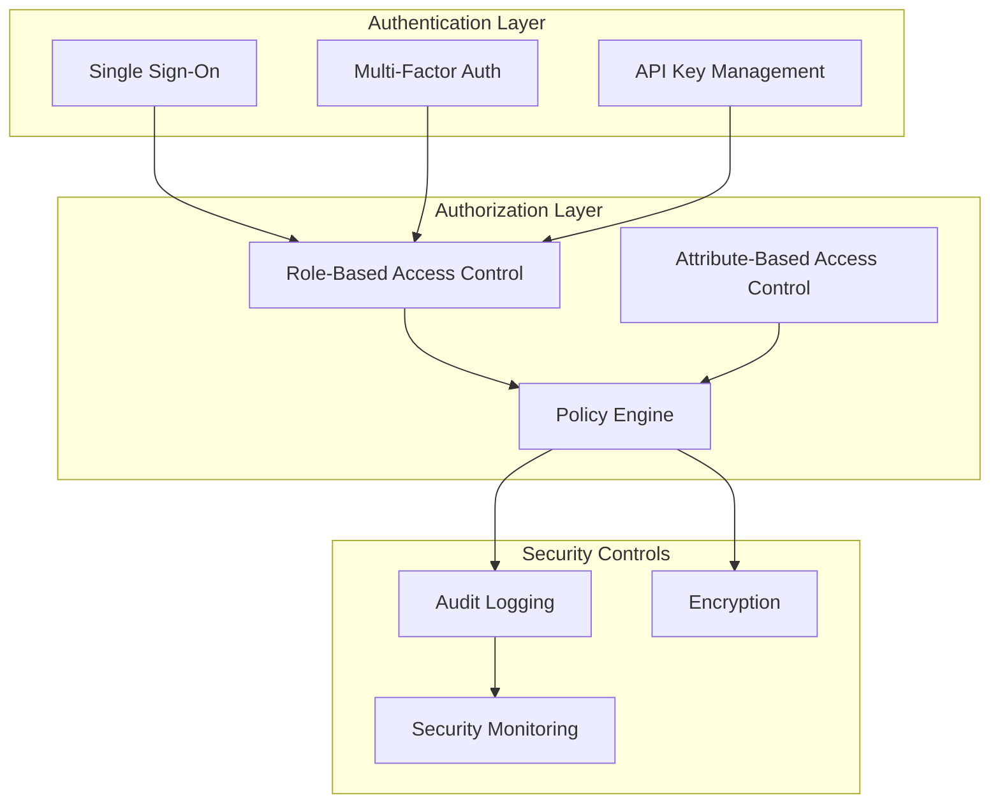

### Role-Based Access Control

**Role Definitions:**
```yaml
roles:
  developer:
    permissions:
      - read_code_files
      - read_specifications
      - read_governance_rules
      - create_search_queries
      - update_personal_preferences
    restrictions:
      - no_cost_data_access
      - no_executive_reports
      
  devops:
    permissions:
      - read_deployment_patterns
      - read_incident_data
      - read_monitoring_data
      - create_operational_docs
      - update_deployment_configs
    restrictions:
      - no_financial_data_access
      
  cfo:
    permissions:
      - read_cost_data
      - read_roi_calculations
      - read_budget_reports
      - create_financial_reports
      - update_cost_allocations
    restrictions:
      - no_code_modification
      - no_technical_configurations
      
  cto:
    permissions:
      - read_all_technical_data
      - read_strategic_metrics
      - read_team_analytics
      - create_strategic_reports
      - update_technology_standards
    restrictions:
      - no_individual_performance_data
      
  architect:
    permissions:
      - read_architecture_data
      - read_design_patterns
      - read_compliance_reports
      - create_architecture_docs
      - update_design_standards
    restrictions:
      - no_financial_data_access
```

## Performance Design

### Caching Strategy

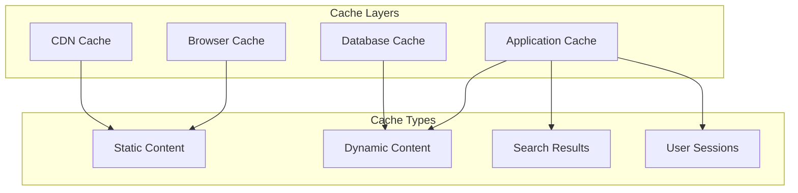

**Cache Configuration:**
```yaml
cache_strategy:
  static_content:
    ttl: 86400  # 24 hours
    locations: [browser, cdn]
    
  search_results:
    ttl: 3600   # 1 hour
    locations: [application, redis]
    
  user_sessions:
    ttl: 1800   # 30 minutes
    locations: [redis]
    
  database_queries:
    ttl: 300    # 5 minutes
    locations: [application, database]
```

### Scalability Design

**Horizontal Scaling Architecture:**
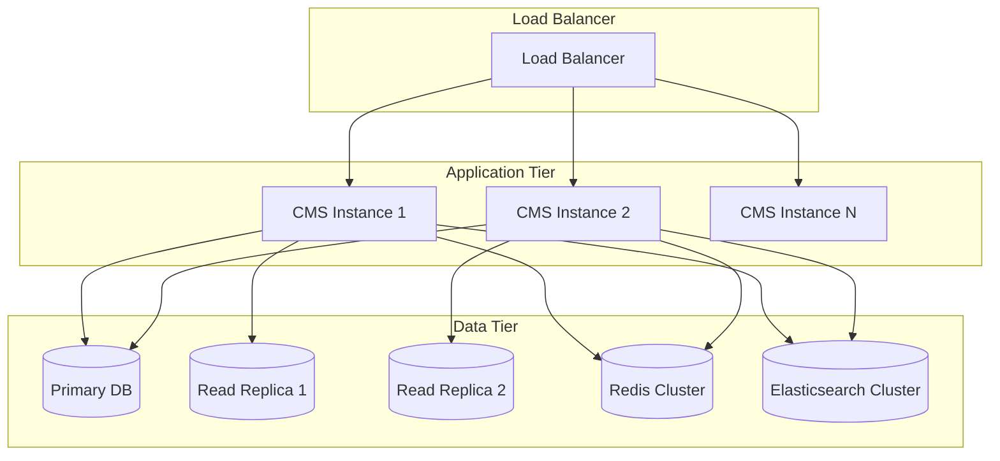

## Integration Design

### Repository Synchronization

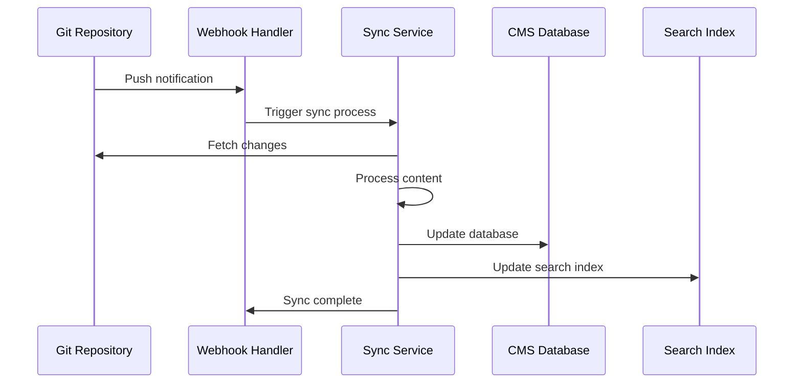

**Synchronization Process:**
```python
class RepositorySyncService:
    async def sync_repository_changes(self, webhook_data: Dict) -> SyncResult:
        """Synchronize repository changes with CMS"""
        
        # 1. Fetch changed files
        changed_files = await self.get_changed_files(webhook_data)
        
        # 2. Process each file type
        for file_path in changed_files:
            if file_path.endswith('.py'):
                await self.sync_code_file(file_path)
            elif file_path.endswith('.md'):
                await self.sync_document(file_path)
            elif file_path.startswith('.kiro/specs/'):
                await self.sync_specification(file_path)
        
        # 3. Update relationships
        await self.update_relationships()
        
        # 4. Refresh search index
        await self.refresh_search_index()
        
        return SyncResult(success=True, files_processed=len(changed_files))
```

### External System Integration

**API Integration Framework:**
```python
class ExternalIntegration:
    def __init__(self):
        self.integrations = {
            'prometheus': PrometheusIntegration(),
            'grafana': GrafanaIntegration(),
            'jenkins': JenkinsIntegration(),
            'jira': JiraIntegration(),
            'slack': SlackIntegration()
        }
    
    async def sync_monitoring_data(self) -> None:
        """Sync monitoring data from external systems"""
        
        # Prometheus metrics
        metrics = await self.integrations['prometheus'].get_metrics()
        await self.store_metrics(metrics)
        
        # Grafana dashboards
        dashboards = await self.integrations['grafana'].get_dashboards()
        await self.store_dashboards(dashboards)
    
    async def sync_deployment_data(self) -> None:
        """Sync deployment data from CI/CD systems"""
        
        # Jenkins builds
        builds = await self.integrations['jenkins'].get_recent_builds()
        await self.store_deployment_data(builds)
```

## Monitoring and Observability Design

### Health Monitoring Architecture

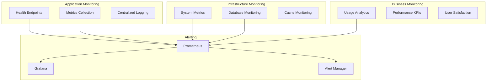

**Health Check Implementation:**
```python
class CMSHealthMonitor(ReflectiveModule):
    """CMS health monitoring with Beast Mode compliance"""
    
    def get_health_status(self) -> Dict[str, Any]:
        """Comprehensive health status"""
        return {
            "database": self._check_database_health(),
            "cache": self._check_cache_health(),
            "search": self._check_search_health(),
            "integrations": self._check_integration_health(),
            "performance": self._check_performance_metrics()
        }
    
    def get_metrics(self) -> Dict[str, float]:
        """Prometheus metrics"""
        return {
            "cms_requests_total": self._total_requests,
            "cms_response_time_seconds": self._avg_response_time,
            "cms_search_queries_total": self._search_queries,
            "cms_sync_operations_total": self._sync_operations,
            "cms_user_sessions_active": self._active_sessions
        }
```

## Deployment Design

### Container Architecture

```dockerfile
# Multi-stage build for CMS
FROM node:18-alpine AS builder
WORKDIR /app
COPY package*.json ./
RUN npm ci --only=production

FROM directus/directus:latest
COPY --from=builder /app/node_modules ./node_modules
COPY ./extensions ./extensions
COPY ./config ./config

# Health check
HEALTHCHECK --interval=30s --timeout=10s --start-period=60s --retries=3 \
  CMD curl -f http://localhost:8055/server/health || exit 1

EXPOSE 8055
```

**Docker Compose Configuration:**
```yaml
version: '3.8'

services:
  cms:
    build: .
    environment:
      - DB_CLIENT=pg
      - DB_HOST=postgres
      - DB_PORT=5432
      - DB_DATABASE=cms
      - DB_USER=cms_user
      - DB_PASSWORD=${DB_PASSWORD}
      - CACHE_ENABLED=true
      - CACHE_STORE=redis
      - CACHE_REDIS=redis://redis:6379
    depends_on:
      - postgres
      - redis
      - elasticsearch
    
  postgres:
    image: postgres:15-alpine
    environment:
      - POSTGRES_DB=cms
      - POSTGRES_USER=cms_user
      - POSTGRES_PASSWORD=${DB_PASSWORD}
    volumes:
      - postgres_data:/var/lib/postgresql/data
    
  redis:
    image: redis:7-alpine
    volumes:
      - redis_data:/data
    
  elasticsearch:
    image: elasticsearch:8.11.0
    environment:
      - discovery.type=single-node
      - xpack.security.enabled=false
    volumes:
      - elasticsearch_data:/usr/share/elasticsearch/data

volumes:
  postgres_data:
  redis_data:
  elasticsearch_data:
```

## Migration and Upgrade Strategy

### Data Migration Framework

```python
class CMSMigrationManager:
    """Manages CMS schema and data migrations"""
    
    def __init__(self):
        self.migrations = self._load_migrations()
    
    async def migrate_to_version(self, target_version: str) -> MigrationResult:
        """Migrate CMS to target version"""
        
        current_version = await self.get_current_version()
        migration_path = self.calculate_migration_path(current_version, target_version)
        
        for migration in migration_path:
            try:
                await self.execute_migration(migration)
                await self.record_migration(migration)
            except Exception as e:
                await self.rollback_migration(migration)
                raise MigrationError(f"Migration {migration.name} failed: {e}")
        
        return MigrationResult(success=True, version=target_version)
```

## Success Metrics and KPIs

### Technical Metrics
- **System Availability:** 99.9% uptime
- **Response Time:** < 500ms for 95th percentile
- **Search Accuracy:** > 90% relevant results
- **Data Synchronization:** < 5 minutes lag
- **API Throughput:** > 1000 requests/minute

### Business Metrics
- **User Adoption:** 90% of target users active monthly
- **Content Utilization:** 80% of content accessed regularly
- **Cost Reduction:** 30% reduction in development costs
- **Time Savings:** 40% reduction in information discovery time
- **Compliance:** 95% governance rule compliance

### Stakeholder Satisfaction
- **Developer Satisfaction:** > 4.5/5 rating
- **DevOps Efficiency:** 50% reduction in incident resolution time
- **Executive Visibility:** 100% of KPIs tracked and reported
- **Architecture Compliance:** 95% adherence to design standards

---

**Design Version:** 1.0  
**Last Updated:** January 27, 2025  
**Status:** Draft  
**Architecture Review:** Pending