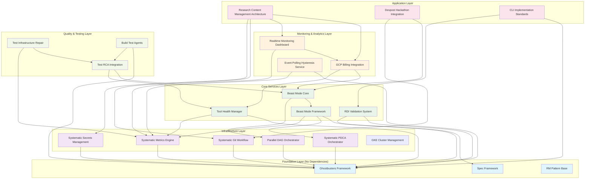

# Comprehensive Specification DAG Analysis

## Complete System Architecture with Dependencies



## Detailed Dependency Analysis

### **Foundation Layer (0 Dependencies)**

#### Ghostbusters Framework
- **Dependencies**: None
- **Dependents**: 15 specs
- **Role**: Multi-agent orchestration, validation frameworks
- **Risk**: Critical - single point of failure

#### Spec Framework  
- **Dependencies**: None
- **Dependents**: 8 specs
- **Role**: Document management, validation, governance
- **Risk**: Medium - document management foundation

#### RM Pattern Base
- **Dependencies**: None
- **Dependents**: All specs (implicit)
- **Role**: Reflective Module pattern enforcement
- **Risk**: Low - pattern compliance

### **Infrastructure Layer (1 Dependency Each)**

#### Systematic PDCA Orchestrator
- **Dependencies**: Ghostbusters Framework
- **Dependents**: Beast Mode Framework, Beast Mode Core
- **Role**: Workflow execution, systematic processes
- **Risk**: Medium - critical for systematic operations

#### Systematic Metrics Engine
- **Dependencies**: Ghostbusters Framework
- **Dependents**: Beast Mode Core, Tool Health Manager, Realtime Monitoring, Event Polling, Test Infrastructure Repair
- **Role**: Performance measurement, superiority demonstration
- **Risk**: Medium - metrics foundation

#### Parallel DAG Orchestrator
- **Dependencies**: Ghostbusters Framework
- **Dependents**: Beast Mode Core
- **Role**: Parallel execution, scaling
- **Risk**: Medium - performance critical

#### Systematic Git Workflow
- **Dependencies**: Ghostbusters Framework
- **Dependents**: Research CMA, Devpost Integration
- **Role**: Version control, deployment workflows
- **Risk**: Low - isolated functionality

#### Systematic Secrets Management
- **Dependencies**: Ghostbusters Framework
- **Dependents**: Research CMA
- **Role**: Secure configuration management
- **Risk**: Medium - security critical

### **Core Services Layer (2-3 Dependencies Each)**

#### Beast Mode Framework
- **Dependencies**: Ghostbusters Framework, PDCA Orchestrator, Metrics Engine
- **Dependents**: Beast Mode Core, Devpost Integration
- **Role**: Main application framework
- **Risk**: High - central application component

#### Beast Mode Core
- **Dependencies**: Beast Mode Framework, DAG Orchestrator
- **Dependents**: GCP Billing Integration, Test RCA Integration
- **Role**: Core implementation consuming orchestration services
- **Risk**: High - complex integration point

#### Tool Health Manager
- **Dependencies**: Ghostbusters Framework, Metrics Engine
- **Dependents**: GCP Billing Integration, Test RCA Integration
- **Role**: Systematic tool repair and maintenance
- **Risk**: Medium - operational health

#### RDI Validation System
- **Dependencies**: Ghostbusters Framework, Spec Framework
- **Dependents**: CLI Implementation Standards
- **Role**: Requirements-Design-Implementation validation
- **Risk**: Low - quality assurance

### **Monitoring & Analytics Layer (2-4 Dependencies Each)**

#### GCP Billing Integration ⭐ **UPDATED**
- **Dependencies**: Beast Mode Core, Tool Health Manager
- **Dependents**: Realtime Monitoring Dashboard, Research CMA
- **Role**: Multi-service GCP cost tracking and correlation
- **Risk**: Medium - financial visibility critical
- **New Features**: Cloud SQL, Storage, Secret Manager cost tracking

#### Realtime Monitoring Dashboard
- **Dependencies**: GCP Billing Integration, Metrics Engine
- **Dependents**: Research CMA
- **Role**: Unified monitoring and alerting
- **Risk**: Medium - operational visibility

#### Event Polling Hysteresis Service
- **Dependencies**: Ghostbusters Framework, Metrics Engine
- **Dependents**: None
- **Role**: Intelligent event polling with hysteresis
- **Risk**: Low - specialized service

### **Application Layer (3-4 Dependencies Each)**

#### Research Content Management Architecture ⭐ **NEW**
- **Dependencies**: GCP Billing Integration, Realtime Monitoring, Git Workflow, Secrets Management
- **Dependents**: None
- **Role**: Enterprise research content management with breakthrough insight capture
- **Risk**: Medium - new complex application
- **Features**: Paper workflow, insight capture, academic integration, GCP Cloud Run deployment

#### Devpost Hackathon Integration
- **Dependencies**: Beast Mode Core, Git Workflow
- **Dependents**: None
- **Role**: Platform integration for hackathon submission
- **Risk**: Low - isolated integration

#### CLI Implementation Standards
- **Dependencies**: Ghostbusters Framework, RDI Validation
- **Dependents**: None
- **Role**: Standardized CLI patterns and validation
- **Risk**: Low - development standards

### **Quality & Testing Layer (2-3 Dependencies Each)**

#### Test RCA Integration
- **Dependencies**: Beast Mode Core, Tool Health Manager
- **Dependents**: Test Infrastructure Repair, Build Test Agents
- **Role**: Automated root cause analysis for test failures
- **Risk**: Medium - quality critical

#### Test Infrastructure Repair
- **Dependencies**: Test RCA Integration, Metrics Engine
- **Dependents**: None
- **Role**: Systematic test infrastructure maintenance
- **Risk**: Low - maintenance automation

#### Build Test Agents
- **Dependencies**: Ghostbusters Framework, Test RCA Integration
- **Dependents**: None
- **Role**: Automated build and test agent management
- **Risk**: Low - build automation

## Critical Path Analysis

### **Longest Dependency Chain (6 levels)**
```
Ghostbusters Framework → 
Beast Mode Framework → 
Beast Mode Core → 
GCP Billing Integration → 
Realtime Monitoring Dashboard → 
Research Content Management Architecture
```

### **Critical Dependencies (High Risk)**
1. **Ghostbusters Framework**: 15 dependents - system foundation
2. **Beast Mode Framework**: 2 direct dependents, enables core functionality
3. **Beast Mode Core**: 2 direct dependents, complex integration point
4. **GCP Billing Integration**: 2 dependents, financial visibility critical

### **Parallel Development Opportunities**

#### **Independent Tracks (Can develop simultaneously)**
- **Track A**: Ghostbusters Framework → PDCA → Beast Mode Framework
- **Track B**: Ghostbusters Framework → Metrics Engine → Tool Health Manager  
- **Track C**: Ghostbusters Framework → Git Workflow → (Research CMA partial)
- **Track D**: Ghostbusters Framework → Secrets Management → (Research CMA partial)

#### **Convergence Points**
- **Beast Mode Core**: Requires completion of Tracks A and B
- **GCP Billing Integration**: Requires Beast Mode Core + Tool Health Manager
- **Research CMA**: Requires GCP Billing + Git Workflow + Secrets Management

## Risk Assessment

### **High Risk Specs (3+ Dependencies)**
- **Research Content Management Architecture**: 4 dependencies, new complex system
- **Beast Mode Core**: 2 dependencies but complex integration
- **Realtime Monitoring Dashboard**: 2 dependencies, operational critical

### **Medium Risk Specs (2 Dependencies)**
- **GCP Billing Integration**: Financial visibility critical
- **Test Infrastructure Repair**: Quality maintenance
- **Build Test Agents**: Build automation

### **Low Risk Specs (0-1 Dependencies)**
- **Foundation Layer**: No dependencies, stable
- **Infrastructure Layer**: Single dependency each, focused functionality
- **Leaf Nodes**: No dependents, isolated functionality

## Implementation Strategy

### **Phase 1: Foundation (Week 1-2)**
- Ghostbusters Framework
- Spec Framework  
- RM Pattern Base
- **Parallel execution**: All foundation specs can be developed simultaneously

### **Phase 2: Infrastructure (Week 3-4)**
- PDCA Orchestrator
- Metrics Engine
- DAG Orchestrator
- Git Workflow
- Secrets Management
- **Parallel execution**: All infrastructure specs can be developed simultaneously after foundation

### **Phase 3: Core Services (Week 5-6)**
- Beast Mode Framework (requires PDCA + Metrics)
- Tool Health Manager (requires Metrics)
- RDI Validation (requires Spec Framework)
- **Parallel execution**: Beast Mode Framework and Tool Health Manager can be developed in parallel

### **Phase 4: Integration (Week 7-8)**
- Beast Mode Core (requires Beast Mode Framework + DAG)
- **Sequential**: Must complete before monitoring layer

### **Phase 5: Monitoring (Week 9-10)**
- GCP Billing Integration (requires Beast Mode Core + Tool Health Manager)
- Event Polling Hysteresis (requires Metrics)
- **Parallel execution**: Can develop simultaneously

### **Phase 6: Applications (Week 11-12)**
- Realtime Monitoring Dashboard (requires GCP Billing + Metrics)
- Research Content Management Architecture (requires GCP Billing + Monitoring + Git + Secrets)
- **Sequential**: Monitoring Dashboard first, then Research CMA

### **Phase 7: Quality & Standards (Week 13-14)**
- Test RCA Integration (requires Beast Mode Core + Tool Health)
- CLI Implementation Standards (requires RDI Validation)
- Devpost Integration (requires Beast Mode Core + Git)
- **Parallel execution**: All can be developed simultaneously

### **Phase 8: Testing Infrastructure (Week 15-16)**
- Test Infrastructure Repair (requires Test RCA + Metrics)
- Build Test Agents (requires Test RCA)
- **Sequential**: Test Infrastructure Repair first, then Build Test Agents

## Success Metrics

### **Dependency Health**
- **DAG Compliance**: ✅ No circular dependencies
- **Layer Separation**: ✅ Clear hierarchical structure
- **Interface Boundaries**: ✅ Service-only access
- **Risk Distribution**: ✅ No single points of failure except foundation

### **Development Efficiency**
- **Parallel Opportunities**: 8 parallel development tracks identified
- **Critical Path**: 6-level dependency chain manageable
- **Resource Allocation**: Clear priority ordering for development teams
- **Risk Mitigation**: High-risk specs identified with mitigation strategies

### **System Integration**
- **Research CMA Integration**: ✅ Properly integrated with GCP billing and monitoring
- **Cost Tracking**: ✅ Multi-service GCP cost correlation implemented
- **Monitoring**: ✅ Unified monitoring across all applications
- **Quality**: ✅ Systematic testing and validation throughout

This comprehensive spec DAG provides a complete view of all system dependencies, enabling systematic development planning and risk management across the entire Beast Mode ecosystem.