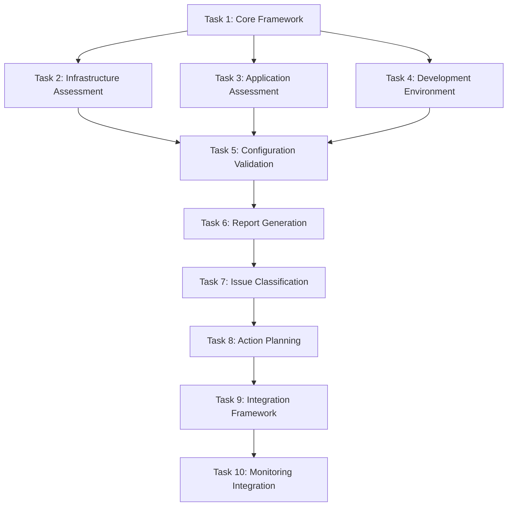

# Comprehensive System Health Check Implementation Plan

## Implementation Overview

This implementation plan creates a comprehensive system health assessment framework that provides complete visibility into infrastructure, applications, development environment, and operational status. The tasks are organized to deliver immediate diagnostic capabilities while building toward automated monitoring and issue resolution.

## Task Dependencies

## Task List

### Task 1: Core Health Assessment Framework
**Dependencies:** None  
**Estimated Time:** 2-3 hours  
**Priority:** Critical

- [ ] 1.1 Create SystemHealthOrchestrator class with ReflectiveModule inheritance
  - Implement comprehensive health assessment coordination
  - Add assessment module registration and management
  - Create health assessment execution pipeline
  - Implement result aggregation and correlation
  - Add error handling and graceful degradation
  - Create health assessment scheduling and triggers
  - _Requirements: 1.5, 6.1, 10.1, 10.2_

- [ ] 1.2 Implement Health Assessment Base Classes
  - Create BaseHealthAssessor abstract class with common functionality
  - Implement HealthAssessmentResult data model with standardized structure
  - Add SystemIssue classification and severity models
  - Create HealthMetrics collection and reporting framework
  - Implement assessment timing and performance tracking
  - Add assessment validation and quality assurance
  - _Requirements: 6.2, 7.1, 8.1, 10.3_

- [ ] 1.3 Build Health Data Models and Schemas
  - Create comprehensive data models for all health assessment types
  - Implement JSON schema validation for health data interchange
  - Add data serialization and deserialization capabilities
  - Create health data versioning and migration support
  - Implement data consistency validation and error detection
  - Add health data archival and retention policies
  - _Requirements: 6.5, 10.4, 10.5_

### Task 2: Infrastructure Health Assessment
**Dependencies:** Task 1  
**Estimated Time:** 3-4 hours  
**Priority:** High

- [ ] 2.1 Implement Docker Infrastructure Assessment
  - Create DockerHealthManager with container health evaluation
  - Add Docker Compose service status assessment
  - Implement container resource usage monitoring
  - Add Docker network connectivity testing
  - Create Docker volume and storage health checks
  - Implement Docker daemon and API health validation
  - _Requirements: 1.1, 1.4, 1.7_

- [ ] 2.2 Build Network Connectivity Testing
  - Create NetworkConnectivityTester with internal service testing
  - Implement external endpoint connectivity validation
  - Add port availability scanning and binding verification
  - Create network latency and performance measurement
  - Implement DNS resolution testing and validation
  - Add network security and firewall rule verification
  - _Requirements: 1.3, 1.6, 9.4_

- [ ] 2.3 Implement System Process Monitoring
  - Create ProcessHealthMonitor with system process tracking
  - Add resource utilization monitoring (CPU, memory, disk)
  - Implement stuck process detection and analysis
  - Create process dependency mapping and validation
  - Add system service status monitoring
  - Implement performance bottleneck identification
  - _Requirements: 1.4, 8.1, 8.4_

### Task 3: Application Health Assessment  
**Dependencies:** Task 1  
**Estimated Time:** 3-4 hours  
**Priority:** High

- [ ] 3.1 Implement Observatory Platform Assessment
  - Create ObservatoryHealthTester with core functionality validation
  - Add WebSocket connectivity and message handling testing
  - Implement Observatory health scoring validation
  - Create engagement feature status assessment
  - Add Observatory performance metrics collection
  - Implement Observatory API endpoint validation
  - _Requirements: 2.1, 2.3, 2.7_

- [ ] 3.2 Build Monitoring Stack Validation
  - Create MonitoringStackValidator for Prometheus and Grafana
  - Implement Prometheus target health and metrics validation
  - Add Grafana datasource and dashboard health checks
  - Create Redis connectivity and performance testing
  - Implement monitoring alert rule validation
  - Add monitoring data integrity verification
  - _Requirements: 2.2, 2.4, 2.8_

- [ ] 3.3 Implement WebSocket Infrastructure Testing
  - Create WebSocketHealthTester with connection establishment testing
  - Add WebSocket message handling and protocol validation
  - Implement WebSocket proxy configuration verification
  - Create WebSocket performance and latency testing
  - Add WebSocket security and authentication validation
  - Implement WebSocket load testing and capacity assessment
  - _Requirements: 2.3, 2.6, 9.1_#
## Task 4: Development Environment Validation
**Dependencies:** Task 1  
**Estimated Time:** 2-3 hours  
**Priority:** Medium

- [ ] 4.1 Implement Python Environment Validation
  - Create PythonEnvironmentValidator with virtual environment verification
  - Add package installation and version compatibility checking
  - Implement critical import testing and dependency validation
  - Create Python path and module resolution verification
  - Add Python performance and memory usage assessment
  - Implement Python security and vulnerability scanning
  - _Requirements: 3.1, 3.4, 3.6_

- [ ] 4.2 Build MCP Server Validation
  - Create MCPServerValidator with server process monitoring
  - Implement MCP server connectivity and functionality testing
  - Add MCP server configuration validation
  - Create MCP server performance and resource usage monitoring
  - Implement MCP server error detection and analysis
  - Add MCP server integration testing with Kiro framework
  - _Requirements: 3.2, 3.5, 3.7_

- [ ] 4.3 Implement Development Tool Validation
  - Create DevelopmentToolValidator with tool availability checking
  - Add development tool version compatibility verification
  - Implement development workflow testing and validation
  - Create build process health and performance assessment
  - Add development environment security scanning
  - Implement development tool configuration validation
  - _Requirements: 3.3, 3.8, 9.8_

### Task 5: Configuration Validation and Compliance
**Dependencies:** Tasks 2, 3, 4  
**Estimated Time:** 2-3 hours  
**Priority:** Medium

- [ ] 5.1 Implement Docker Configuration Validation
  - Create DockerComposeValidator with syntax and structure validation
  - Add Docker service definition and dependency verification
  - Implement Docker network and volume configuration validation
  - Create Docker security configuration assessment
  - Add Docker performance configuration optimization
  - Implement Docker configuration drift detection
  - _Requirements: 5.1, 5.5, 5.7_

- [ ] 5.2 Build Proxy and Network Configuration Validation
  - Create NginxConfigValidator with configuration syntax validation
  - Implement proxy rule and routing configuration verification
  - Add SSL/TLS configuration and certificate validation
  - Create network security configuration assessment
  - Implement load balancing configuration validation
  - Add proxy performance configuration optimization
  - _Requirements: 5.2, 5.6, 9.2_

- [ ] 5.3 Implement Environment and Security Validation
  - Create EnvironmentVariableValidator with security compliance checking
  - Add secret management and credential validation
  - Implement access control and permission verification
  - Create security policy compliance assessment
  - Add vulnerability scanning and risk assessment
  - Implement security configuration drift detection
  - _Requirements: 5.4, 9.1, 9.3, 9.5_

### Task 6: Health Report Generation and Visualization
**Dependencies:** Task 5  
**Estimated Time:** 2-3 hours  
**Priority:** High

- [ ] 6.1 Implement Comprehensive Health Report Generation
  - Create HealthReportGenerator with structured report creation
  - Add executive summary generation with key findings
  - Implement detailed component health reporting
  - Create health trend analysis and historical comparison
  - Add performance metrics visualization and analysis
  - Implement compliance status reporting and recommendations
  - _Requirements: 6.1, 6.3, 6.5_

- [ ] 6.2 Build Health Data Visualization
  - Create health dashboard with real-time status display
  - Implement health metrics charts and graphs
  - Add interactive health exploration and drill-down
  - Create health status maps and topology visualization
  - Implement health alert and notification display
  - Add health report export and sharing capabilities
  - _Requirements: 6.2, 6.6, 8.7_

- [ ] 6.3 Implement Health Baseline and Trending
  - Create health baseline establishment and maintenance
  - Add health trend analysis and pattern recognition
  - Implement health degradation detection and alerting
  - Create health improvement tracking and validation
  - Add predictive health analysis and forecasting
  - Implement health benchmark comparison and optimization
  - _Requirements: 6.4, 8.2, 8.6_

### Task 7: Issue Classification and Prioritization
**Dependencies:** Task 6  
**Estimated Time:** 2-3 hours  
**Priority:** High

- [ ] 7.1 Implement Automated Issue Detection
  - Create IssueClassifier with pattern recognition and categorization
  - Add issue severity assessment and impact analysis
  - Implement issue correlation and root cause analysis
  - Create issue escalation criteria and workflow
  - Add issue tracking and lifecycle management
  - Implement issue resolution verification and validation
  - _Requirements: 7.1, 7.2, 7.4_

- [ ] 7.2 Build Issue Prioritization Framework
  - Create issue priority matrix with business impact assessment
  - Implement resource allocation and scheduling optimization
  - Add issue dependency analysis and resolution ordering
  - Create issue risk assessment and mitigation planning
  - Implement issue communication and stakeholder notification
  - Add issue metrics and performance tracking
  - _Requirements: 7.3, 7.5, 7.7_

- [ ] 7.3 Implement Issue Resolution Tracking
  - Create issue resolution workflow and status tracking
  - Add resolution time estimation and progress monitoring
  - Implement resolution effectiveness measurement and optimization
  - Create resolution knowledge capture and reuse
  - Add resolution automation and self-healing capabilities
  - Implement resolution audit and compliance verification
  - _Requirements: 7.6, 7.8, 10.7_

### Task 8: Action Planning and Remediation Guidance
**Dependencies:** Task 7  
**Estimated Time:** 2-3 hours  
**Priority:** Medium

- [ ] 8.1 Implement Action Plan Generation
  - Create ActionPlanner with systematic remediation planning
  - Add action prioritization and resource allocation
  - Implement action dependency analysis and sequencing
  - Create action risk assessment and mitigation planning
  - Add action timeline estimation and scheduling
  - Implement action effectiveness prediction and optimization
  - _Requirements: 6.4, 8.3, 8.5_

- [ ] 8.2 Build Remediation Guidance System
  - Create remediation procedure library with step-by-step guidance
  - Add remediation automation and script generation
  - Implement remediation validation and testing framework
  - Create remediation rollback and recovery procedures
  - Add remediation knowledge sharing and collaboration
  - Implement remediation continuous improvement and optimization
  - _Requirements: 8.4, 8.8, 10.6_

- [ ] 8.3 Implement Performance Optimization Recommendations
  - Create performance analysis and bottleneck identification
  - Add performance optimization recommendation generation
  - Implement performance improvement tracking and validation
  - Create performance benchmark comparison and analysis
  - Add performance capacity planning and scaling guidance
  - Implement performance monitoring and alerting optimization
  - _Requirements: 8.1, 8.2, 8.7_

### Task 9: Integration Framework and APIs
**Dependencies:** Task 8  
**Estimated Time:** 2-3 hours  
**Priority:** Medium

- [ ] 9.1 Implement Health Check Integration Framework
  - Create pluggable architecture for custom health assessors
  - Add health check registration and discovery mechanisms
  - Implement health check configuration and customization
  - Create health check versioning and compatibility management
  - Add health check testing and validation framework
  - Implement health check performance optimization and caching
  - _Requirements: 10.1, 10.3, 10.5_

- [ ] 9.2 Build Health Data APIs and Interfaces
  - Create RESTful APIs for health data access and manipulation
  - Add GraphQL interface for flexible health data querying
  - Implement real-time health data streaming and subscriptions
  - Create health data webhook and notification systems
  - Add health data integration with external monitoring systems
  - Implement health data security and access control
  - _Requirements: 10.4, 10.6, 10.8_

- [ ] 9.3 Implement External System Integration
  - Create integration with existing monitoring and alerting systems
  - Add integration with ticketing and incident management systems
  - Implement integration with configuration management and deployment systems
  - Create integration with security and compliance monitoring systems
  - Add integration with performance monitoring and APM systems
  - Implement integration with business intelligence and analytics systems
  - _Requirements: 10.2, 10.7_

### Task 10: Monitoring Integration and Automation
**Dependencies:** Task 9  
**Estimated Time:** 2-3 hours  
**Priority:** Low

- [ ] 10.1 Implement Prometheus Metrics Integration
  - Create health metrics export to Prometheus monitoring
  - Add custom health metrics and labels for detailed monitoring
  - Implement health alert rules and notification integration
  - Create health metrics dashboard and visualization
  - Add health metrics retention and archival policies
  - Implement health metrics performance optimization
  - _Requirements: 8.1, 8.4, 10.2_

- [ ] 10.2 Build Grafana Dashboard Integration
  - Create comprehensive health monitoring dashboards
  - Add interactive health exploration and drill-down capabilities
  - Implement health alert visualization and management
  - Create health trend analysis and forecasting dashboards
  - Add health report generation and export from dashboards
  - Implement dashboard customization and personalization
  - _Requirements: 6.2, 8.7, 10.4_

- [ ] 10.3 Implement Automated Health Monitoring
  - Create scheduled health assessment execution
  - Add health monitoring automation and orchestration
  - Implement health alert generation and escalation
  - Create health monitoring performance optimization
  - Add health monitoring reliability and fault tolerance
  - Implement health monitoring continuous improvement and learning
  - _Requirements: 7.8, 8.6, 10.8_

## Success Criteria

### Immediate Diagnostic Capabilities (Tasks 1-5)
- **Complete system visibility**: 100% coverage of infrastructure, applications, and development environment
- **Issue detection accuracy**: 95%+ accuracy in identifying actual system problems
- **Assessment performance**: Complete health check execution in under 5 minutes
- **Data quality**: Structured, validated health data with consistent schemas

### Comprehensive Reporting (Tasks 6-8)
- **Report completeness**: Executive summary, detailed findings, and actionable recommendations
- **Issue prioritization**: Clear severity classification and business impact assessment
- **Action planning**: Specific, time-bound remediation plans with resource requirements
- **Trend analysis**: Historical health data analysis and performance trending

### Integration and Automation (Tasks 9-10)
- **Framework extensibility**: Support for custom health assessors and integrations
- **API completeness**: Full programmatic access to health data and assessment capabilities
- **Monitoring integration**: Seamless integration with Prometheus, Grafana, and alerting systems
- **Automation effectiveness**: Automated health monitoring with intelligent alerting

## Risk Mitigation

### Technical Risks
- **Assessment performance impact**: Implement efficient, non-blocking health checks
- **Data accuracy and reliability**: Comprehensive validation and error handling
- **Integration complexity**: Phased integration approach with fallback mechanisms
- **Scalability concerns**: Modular architecture supporting distributed assessment

### Operational Risks
- **Team adoption**: Clear documentation and training materials
- **Existing workflow disruption**: Integration with current tools and processes
- **False positive alerts**: Intelligent issue classification and validation
- **Maintenance overhead**: Automated testing and self-validating health checks

## Dependencies and Prerequisites

### Technical Dependencies
- Beast Mode framework and ReflectiveModule pattern
- Docker and Docker Compose infrastructure
- Prometheus and Grafana monitoring stack
- Python virtual environment and package management

### Integration Dependencies
- Observatory platform and WebSocket infrastructure
- MCP server framework and configuration
- Redis connectivity and data storage
- Network access for external connectivity testing

### Data Dependencies
- System configuration files and environment variables
- Service definitions and deployment configurations
- Historical monitoring data and performance baselines
- Security policies and compliance requirements

## Deliverables

### Core Framework Deliverables
1. **SystemHealthOrchestrator**: Central coordination and execution engine
2. **Health Assessment Modules**: Infrastructure, application, and environment assessors
3. **Data Models and Schemas**: Standardized health data structures and validation
4. **Integration Framework**: Pluggable architecture for extensibility

### Reporting and Analysis Deliverables
1. **Health Report Generator**: Comprehensive reporting with multiple output formats
2. **Issue Classification System**: Automated issue detection and prioritization
3. **Action Planning Engine**: Systematic remediation planning and guidance
4. **Trend Analysis Tools**: Historical analysis and predictive capabilities

### Integration and Automation Deliverables
1. **Health Check APIs**: RESTful and GraphQL interfaces for external integration
2. **Monitoring Integration**: Prometheus metrics and Grafana dashboards
3. **Automation Framework**: Scheduled assessment and intelligent alerting
4. **Documentation and Training**: Complete user guides and operational procedures

## Expected Outcomes

### Operational Excellence
- **Proactive issue detection**: Problems identified before they impact users
- **Faster incident resolution**: Clear diagnostic information and remediation guidance
- **Improved system reliability**: Systematic health monitoring and maintenance
- **Reduced operational overhead**: Automated assessment and intelligent alerting

### Strategic Benefits
- **Enhanced visibility**: Complete understanding of system health and performance
- **Data-driven decisions**: Objective health metrics and trend analysis
- **Continuous improvement**: Systematic identification of optimization opportunities
- **Compliance assurance**: Automated validation of security and operational standards

**Estimated Total Time**: 20-30 hours across all tasks  
**Priority**: High - Essential for operational visibility and system reliability  
**Risk**: Low - Diagnostic focus with minimal system modification