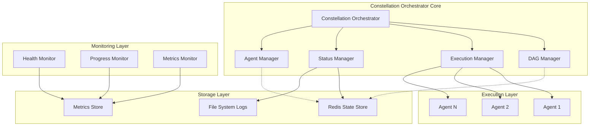

# Design Document - Constellation Orchestrator

## Overview

The Constellation Orchestrator is a sophisticated DAG-based execution system designed to manage the parallel execution of 90+ AI prompts with comprehensive dependency management, multi-agent coordination, and systematic observability. The system transforms complex prompt workflows into a systematic, observable, and resumable process that can handle large-scale AI orchestration scenarios.

**Core Architecture Philosophy**: Build a resilient, scalable orchestration platform that treats AI prompt execution as a systematic engineering problem, with proper dependency management, resource coordination, and comprehensive observability.

## Architecture

### High-Level System Architecture



### Component Architecture

#### 1. Constellation Orchestrator (Main Controller)
- **Responsibility**: Central coordination and lifecycle management
- **Pattern**: Inherits from ReflectiveModule for Beast Mode compliance
- **Key Functions**:
  - Initialize and coordinate all subsystems
  - Provide unified API for orchestration operations
  - Handle graceful shutdown and recovery scenarios
  - Expose health and metrics endpoints

#### 2. DAG Manager
- **Responsibility**: Dependency graph management and validation
- **Key Functions**:
  - Parse task definitions and build dependency graph
  - Validate DAG properties (acyclic, connected)
  - Perform topological sorting for execution order
  - Detect and report circular dependencies
  - Maintain task readiness state

#### 3. Execution Manager
- **Responsibility**: Multi-agent task execution coordination
- **Key Functions**:
  - Manage agent pool and resource allocation
  - Queue and dispatch ready tasks to available agents
  - Handle task completion and failure scenarios
  - Coordinate parallel execution within resource limits
  - Implement retry logic and error handling

#### 4. Agent Manager
- **Responsibility**: AI agent lifecycle and communication
- **Key Functions**:
  - Initialize and manage Claude CLI agent instances
  - Handle agent communication and I/O streaming
  - Monitor agent health and performance
  - Implement agent failure detection and recovery
  - Manage agent resource usage and limits

#### 5. Status Manager
- **Responsibility**: Persistent state tracking and recovery
- **Key Functions**:
  - Maintain real-time execution state in Redis
  - Persist execution logs and outputs to filesystem
  - Enable execution resume after interruption
  - Provide status queries and progress reporting
  - Handle state consistency and recovery

## Components and Interfaces

### Core Interfaces

#### IDAGManager
```python
from abc import ABC, abstractmethod
from typing import Dict, List, Set, Optional
from dataclasses import dataclass

@dataclass
class TaskDefinition:
    task_id: str
    prompt: str
    dependencies: List[str]
    estimated_duration: Optional[int] = None
    retry_count: int = 3
    timeout: Optional[int] = None

@dataclass
class DAGValidationResult:
    is_valid: bool
    cycles: List[List[str]]
    orphaned_tasks: List[str]
    execution_order: List[str]

class IDAGManager(ABC):
    @abstractmethod
    def load_tasks(self, task_definitions: List[TaskDefinition]) -> bool:
        """Load task definitions and build dependency graph."""
        pass
    
    @abstractmethod
    def validate_dag(self) -> DAGValidationResult:
        """Validate DAG properties and return analysis."""
        pass
    
    @abstractmethod
    def get_ready_tasks(self, completed_tasks: Set[str]) -> List[str]:
        """Get tasks ready for execution based on completed dependencies."""
        pass
    
    @abstractmethod
    def get_execution_order(self) -> List[str]:
        """Get topologically sorted execution order."""
        pass
```

#### IExecutionManager
```python
from enum import Enum
from typing import Callable, Awaitable

class TaskStatus(Enum):
    PENDING = "pending"
    RUNNING = "running"
    COMPLETED = "completed"
    FAILED = "failed"
    RETRYING = "retrying"

@dataclass
class ExecutionResult:
    task_id: str
    status: TaskStatus
    output: Optional[str] = None
    error: Optional[str] = None
    duration: Optional[float] = None
    agent_id: Optional[str] = None

class IExecutionManager(ABC):
    @abstractmethod
    async def execute_task(self, task_id: str, prompt: str) -> ExecutionResult:
        """Execute a single task with an available agent."""
        pass
    
    @abstractmethod
    async def execute_parallel(self, task_ids: List[str], max_concurrent: int) -> List[ExecutionResult]:
        """Execute multiple tasks in parallel with concurrency limit."""
        pass
    
    @abstractmethod
    def get_agent_status(self) -> Dict[str, str]:
        """Get current status of all managed agents."""
        pass
```

#### IStatusManager
```python
@dataclass
class ExecutionState:
    execution_id: str
    total_tasks: int
    completed_tasks: int
    failed_tasks: int
    running_tasks: int
    start_time: datetime
    estimated_completion: Optional[datetime] = None

class IStatusManager(ABC):
    @abstractmethod
    def initialize_execution(self, execution_id: str, task_count: int) -> bool:
        """Initialize execution tracking state."""
        pass
    
    @abstractmethod
    def update_task_status(self, task_id: str, status: TaskStatus, result: Optional[ExecutionResult] = None) -> bool:
        """Update individual task status and persist state."""
        pass
    
    @abstractmethod
    def get_execution_state(self, execution_id: str) -> ExecutionState:
        """Get current execution state and progress."""
        pass
    
    @abstractmethod
    def can_resume(self, execution_id: str) -> bool:
        """Check if execution can be resumed from saved state."""
        pass
    
    @abstractmethod
    def resume_execution(self, execution_id: str) -> Dict[str, TaskStatus]:
        """Resume execution and return task states."""
        pass
```

### Integration Interfaces

#### Claude CLI Integration
```python
@dataclass
class AgentConfig:
    agent_id: str
    claude_cli_path: str = "claude"
    timeout: int = 300
    max_retries: int = 3
    environment: Dict[str, str] = None

class ClaudeAgent:
    """Wrapper for Claude CLI agent communication."""
    
    def __init__(self, config: AgentConfig):
        self.config = config
        self.process = None
        self.is_busy = False
    
    async def execute_prompt(self, prompt: str) -> ExecutionResult:
        """Execute prompt via Claude CLI and capture output."""
        pass
    
    def is_available(self) -> bool:
        """Check if agent is available for new tasks."""
        return not self.is_busy and self.process is not None
    
    async def health_check(self) -> bool:
        """Verify agent is responsive and healthy."""
        pass
```

#### Redis State Integration
```python
class RedisStateStore:
    """Redis-based persistent state management."""
    
    def __init__(self, redis_url: str):
        self.redis = redis.from_url(redis_url)
    
    def save_execution_state(self, execution_id: str, state: ExecutionState) -> bool:
        """Save execution state to Redis with expiration."""
        pass
    
    def load_execution_state(self, execution_id: str) -> Optional[ExecutionState]:
        """Load execution state from Redis."""
        pass
    
    def save_task_result(self, task_id: str, result: ExecutionResult) -> bool:
        """Save individual task result for recovery."""
        pass
    
    def get_task_results(self, execution_id: str) -> Dict[str, ExecutionResult]:
        """Get all task results for an execution."""
        pass
```

## Data Models

### Task Definition Schema
```python
from pydantic import BaseModel, Field
from typing import List, Optional, Dict, Any

class TaskDefinition(BaseModel):
    """Comprehensive task definition with validation."""
    
    task_id: str = Field(..., description="Unique task identifier")
    prompt: str = Field(..., min_length=1, description="AI prompt to execute")
    dependencies: List[str] = Field(default_factory=list, description="Task IDs this task depends on")
    
    # Execution parameters
    estimated_duration: Optional[int] = Field(None, ge=1, description="Estimated execution time in seconds")
    timeout: Optional[int] = Field(300, ge=1, description="Maximum execution time in seconds")
    retry_count: int = Field(3, ge=0, le=10, description="Number of retry attempts on failure")
    
    # Metadata
    category: Optional[str] = Field(None, description="Task category for organization")
    priority: int = Field(1, ge=1, le=10, description="Task priority (1=highest, 10=lowest)")
    tags: List[str] = Field(default_factory=list, description="Task tags for filtering")
    
    # Output configuration
    output_format: str = Field("text", description="Expected output format")
    capture_logs: bool = Field(True, description="Whether to capture detailed execution logs")
    
    class Config:
        schema_extra = {
            "example": {
                "task_id": "constellation_1_1",
                "prompt": "Analyze the system architecture and identify key components",
                "dependencies": [],
                "estimated_duration": 60,
                "timeout": 300,
                "retry_count": 3,
                "category": "analysis",
                "priority": 1,
                "tags": ["architecture", "analysis"],
                "output_format": "markdown",
                "capture_logs": True
            }
        }
```

### Execution State Schema
```python
class ExecutionMetrics(BaseModel):
    """Detailed execution metrics and statistics."""
    
    total_tasks: int
    completed_tasks: int
    failed_tasks: int
    running_tasks: int
    pending_tasks: int
    
    # Timing metrics
    start_time: datetime
    last_update: datetime
    estimated_completion: Optional[datetime] = None
    
    # Performance metrics
    average_task_duration: Optional[float] = None
    tasks_per_minute: Optional[float] = None
    agent_utilization: Dict[str, float] = Field(default_factory=dict)
    
    # Error tracking
    error_rate: float = 0.0
    retry_rate: float = 0.0
    timeout_count: int = 0

class ExecutionState(BaseModel):
    """Complete execution state for persistence and recovery."""
    
    execution_id: str
    status: str  # "initializing", "running", "paused", "completed", "failed"
    
    # Task tracking
    task_states: Dict[str, TaskStatus] = Field(default_factory=dict)
    task_results: Dict[str, ExecutionResult] = Field(default_factory=dict)
    
    # Execution metrics
    metrics: ExecutionMetrics
    
    # Configuration
    max_concurrent_agents: int = 5
    execution_config: Dict[str, Any] = Field(default_factory=dict)
    
    # Recovery information
    last_checkpoint: datetime
    recovery_data: Dict[str, Any] = Field(default_factory=dict)
```

## Error Handling

### Error Classification and Response Strategy

#### 1. Agent-Level Errors
```python
class AgentError(Exception):
    """Base class for agent-related errors."""
    pass

class AgentTimeoutError(AgentError):
    """Agent execution timeout."""
    def __init__(self, agent_id: str, timeout: int):
        self.agent_id = agent_id
        self.timeout = timeout
        super().__init__(f"Agent {agent_id} timed out after {timeout} seconds")

class AgentCommunicationError(AgentError):
    """Agent communication failure."""
    pass

class AgentResourceError(AgentError):
    """Agent resource exhaustion."""
    pass
```

**Response Strategy**:
- **Timeout**: Retry with exponential backoff, reassign to different agent
- **Communication**: Restart agent, retry task
- **Resource**: Queue task for later execution, scale agent pool if possible

#### 2. System-Level Errors
```python
class SystemError(Exception):
    """Base class for system-level errors."""
    pass

class DAGValidationError(SystemError):
    """DAG validation failure."""
    pass

class StateCorruptionError(SystemError):
    """Execution state corruption detected."""
    pass

class ResourceExhaustionError(SystemError):
    """System resource exhaustion."""
    pass
```

**Response Strategy**:
- **DAG Validation**: Halt execution, report cycles, require manual intervention
- **State Corruption**: Attempt recovery from last checkpoint, manual intervention if needed
- **Resource Exhaustion**: Graceful degradation, reduce concurrency, alert operators

#### 3. Recovery Mechanisms
```python
class RecoveryManager:
    """Handles error recovery and system resilience."""
    
    def __init__(self, status_manager: IStatusManager, execution_manager: IExecutionManager):
        self.status_manager = status_manager
        self.execution_manager = execution_manager
        self.recovery_strategies = {
            AgentTimeoutError: self._handle_agent_timeout,
            AgentCommunicationError: self._handle_agent_communication,
            StateCorruptionError: self._handle_state_corruption,
        }
    
    async def handle_error(self, error: Exception, context: Dict[str, Any]) -> bool:
        """Handle error with appropriate recovery strategy."""
        error_type = type(error)
        if error_type in self.recovery_strategies:
            return await self.recovery_strategies[error_type](error, context)
        else:
            return await self._handle_unknown_error(error, context)
    
    async def _handle_agent_timeout(self, error: AgentTimeoutError, context: Dict[str, Any]) -> bool:
        """Handle agent timeout with retry and reassignment."""
        task_id = context.get('task_id')
        if task_id:
            # Mark task for retry with different agent
            await self.execution_manager.retry_task(task_id, exclude_agent=error.agent_id)
            return True
        return False
    
    async def _handle_state_corruption(self, error: StateCorruptionError, context: Dict[str, Any]) -> bool:
        """Handle state corruption with checkpoint recovery."""
        execution_id = context.get('execution_id')
        if execution_id and self.status_manager.can_resume(execution_id):
            # Attempt recovery from last valid checkpoint
            recovered_state = self.status_manager.resume_execution(execution_id)
            return recovered_state is not None
        return False
```

## Testing Strategy

### Unit Testing Framework
```python
import pytest
from unittest.mock import Mock, AsyncMock
from constellation_orchestrator import ConstellationOrchestrator, DAGManager

class TestDAGManager:
    """Comprehensive DAG manager testing."""
    
    @pytest.fixture
    def sample_tasks(self):
        return [
            TaskDefinition(task_id="task_1", prompt="First task", dependencies=[]),
            TaskDefinition(task_id="task_2", prompt="Second task", dependencies=["task_1"]),
            TaskDefinition(task_id="task_3", prompt="Third task", dependencies=["task_1"]),
            TaskDefinition(task_id="task_4", prompt="Fourth task", dependencies=["task_2", "task_3"]),
        ]
    
    def test_dag_validation_success(self, sample_tasks):
        """Test successful DAG validation."""
        dag_manager = DAGManager()
        dag_manager.load_tasks(sample_tasks)
        result = dag_manager.validate_dag()
        
        assert result.is_valid
        assert len(result.cycles) == 0
        assert len(result.orphaned_tasks) == 0
        assert result.execution_order == ["task_1", "task_2", "task_3", "task_4"]
    
    def test_circular_dependency_detection(self):
        """Test circular dependency detection."""
        circular_tasks = [
            TaskDefinition(task_id="task_a", prompt="Task A", dependencies=["task_b"]),
            TaskDefinition(task_id="task_b", prompt="Task B", dependencies=["task_c"]),
            TaskDefinition(task_id="task_c", prompt="Task C", dependencies=["task_a"]),
        ]
        
        dag_manager = DAGManager()
        dag_manager.load_tasks(circular_tasks)
        result = dag_manager.validate_dag()
        
        assert not result.is_valid
        assert len(result.cycles) == 1
        assert set(result.cycles[0]) == {"task_a", "task_b", "task_c"}
    
    def test_ready_tasks_identification(self, sample_tasks):
        """Test identification of ready tasks."""
        dag_manager = DAGManager()
        dag_manager.load_tasks(sample_tasks)
        
        # Initially, only task_1 should be ready
        ready_tasks = dag_manager.get_ready_tasks(set())
        assert ready_tasks == ["task_1"]
        
        # After task_1 completes, task_2 and task_3 should be ready
        ready_tasks = dag_manager.get_ready_tasks({"task_1"})
        assert set(ready_tasks) == {"task_2", "task_3"}
        
        # After task_2 and task_3 complete, task_4 should be ready
        ready_tasks = dag_manager.get_ready_tasks({"task_1", "task_2", "task_3"})
        assert ready_tasks == ["task_4"]
```

### Integration Testing
```python
class TestConstellationOrchestrator:
    """Integration testing for complete orchestrator."""
    
    @pytest.fixture
    async def orchestrator(self):
        """Create orchestrator with mocked dependencies."""
        config = {
            "redis_url": "redis://localhost:6379/0",
            "max_concurrent_agents": 3,
            "claude_cli_path": "claude",
            "log_directory": "/tmp/constellation_logs"
        }
        
        orchestrator = ConstellationOrchestrator(config)
        await orchestrator.initialize()
        return orchestrator
    
    @pytest.mark.asyncio
    async def test_full_execution_cycle(self, orchestrator, sample_tasks):
        """Test complete execution cycle from start to finish."""
        # Load tasks
        success = await orchestrator.load_tasks(sample_tasks)
        assert success
        
        # Start execution
        execution_id = await orchestrator.start_execution()
        assert execution_id is not None
        
        # Monitor execution (mock agent responses)
        with patch('constellation_orchestrator.ClaudeAgent.execute_prompt') as mock_execute:
            mock_execute.return_value = ExecutionResult(
                task_id="mock_task",
                status=TaskStatus.COMPLETED,
                output="Mock output",
                duration=1.0
            )
            
            # Wait for completion
            final_state = await orchestrator.wait_for_completion(timeout=30)
            assert final_state.status == "completed"
            assert final_state.metrics.completed_tasks == len(sample_tasks)
    
    @pytest.mark.asyncio
    async def test_execution_resume(self, orchestrator, sample_tasks):
        """Test execution resume after interruption."""
        # Start execution
        execution_id = await orchestrator.start_execution()
        
        # Simulate interruption after partial completion
        await orchestrator.pause_execution()
        
        # Verify state is saved
        assert orchestrator.status_manager.can_resume(execution_id)
        
        # Resume execution
        resumed_state = await orchestrator.resume_execution(execution_id)
        assert resumed_state is not None
        
        # Verify execution continues from saved state
        final_state = await orchestrator.wait_for_completion(timeout=30)
        assert final_state.status == "completed"
```

### Performance Testing
```python
class TestPerformance:
    """Performance and scalability testing."""
    
    @pytest.mark.performance
    def test_large_dag_performance(self):
        """Test performance with large DAG (1000+ tasks)."""
        # Generate large task set
        tasks = []
        for i in range(1000):
            dependencies = [f"task_{j}" for j in range(max(0, i-5), i)]
            tasks.append(TaskDefinition(
                task_id=f"task_{i}",
                prompt=f"Task {i} prompt",
                dependencies=dependencies
            ))
        
        dag_manager = DAGManager()
        
        # Measure DAG loading time
        start_time = time.time()
        dag_manager.load_tasks(tasks)
        load_time = time.time() - start_time
        
        # Measure validation time
        start_time = time.time()
        result = dag_manager.validate_dag()
        validation_time = time.time() - start_time
        
        # Performance assertions
        assert load_time < 1.0  # Should load 1000 tasks in under 1 second
        assert validation_time < 2.0  # Should validate in under 2 seconds
        assert result.is_valid
    
    @pytest.mark.performance
    async def test_concurrent_execution_scaling(self):
        """Test scaling with different concurrency levels."""
        for max_concurrent in [1, 5, 10, 20]:
            orchestrator = ConstellationOrchestrator({
                "max_concurrent_agents": max_concurrent
            })
            
            # Measure execution time with different concurrency
            start_time = time.time()
            await orchestrator.execute_tasks(generate_parallel_tasks(50))
            execution_time = time.time() - start_time
            
            # Verify scaling efficiency
            print(f"Concurrency {max_concurrent}: {execution_time:.2f}s")
```

## Performance Optimization and Scalability

### Scalability Architecture

#### 1. Horizontal Scaling Strategy
```python
class ScalableExecutionManager:
    """Execution manager with dynamic scaling capabilities."""
    
    def __init__(self, config: Dict[str, Any]):
        self.base_agent_count = config.get('base_agent_count', 3)
        self.max_agent_count = config.get('max_agent_count', 20)
        self.scale_threshold = config.get('scale_threshold', 0.8)  # 80% utilization
        self.scale_cooldown = config.get('scale_cooldown', 60)  # 60 seconds
        
        self.agents: Dict[str, ClaudeAgent] = {}
        self.agent_metrics: Dict[str, AgentMetrics] = {}
        self.last_scale_time = 0
    
    async def auto_scale_agents(self) -> bool:
        """Automatically scale agent pool based on demand."""
        current_time = time.time()
        if current_time - self.last_scale_time < self.scale_cooldown:
            return False
        
        utilization = self._calculate_agent_utilization()
        
        if utilization > self.scale_threshold and len(self.agents) < self.max_agent_count:
            # Scale up
            new_agent_count = min(len(self.agents) + 2, self.max_agent_count)
            await self._add_agents(new_agent_count - len(self.agents))
            self.last_scale_time = current_time
            return True
        
        elif utilization < 0.3 and len(self.agents) > self.base_agent_count:
            # Scale down
            agents_to_remove = min(2, len(self.agents) - self.base_agent_count)
            await self._remove_agents(agents_to_remove)
            self.last_scale_time = current_time
            return True
        
        return False
    
    def _calculate_agent_utilization(self) -> float:
        """Calculate current agent utilization percentage."""
        if not self.agents:
            return 0.0
        
        busy_agents = sum(1 for agent in self.agents.values() if agent.is_busy)
        return busy_agents / len(self.agents)
```

#### 2. Memory Optimization
```python
class MemoryOptimizedStatusManager:
    """Status manager with memory-efficient state handling."""
    
    def __init__(self, redis_client, max_memory_tasks: int = 1000):
        self.redis = redis_client
        self.max_memory_tasks = max_memory_tasks
        self.memory_cache: Dict[str, ExecutionResult] = {}
        self.cache_access_times: Dict[str, float] = {}
    
    def update_task_status(self, task_id: str, status: TaskStatus, result: Optional[ExecutionResult] = None) -> bool:
        """Update task status with memory management."""
        # Always persist to Redis
        self.redis.hset(f"task_status", task_id, status.value)
        
        if result:
            # Store in Redis
            self.redis.hset(f"task_results", task_id, result.json())
            
            # Manage memory cache
            self._manage_memory_cache(task_id, result)
        
        return True
    
    def _manage_memory_cache(self, task_id: str, result: ExecutionResult):
        """Manage in-memory cache with LRU eviction."""
        current_time = time.time()
        
        # Add to cache
        self.memory_cache[task_id] = result
        self.cache_access_times[task_id] = current_time
        
        # Evict if over limit
        if len(self.memory_cache) > self.max_memory_tasks:
            # Find least recently used
            lru_task = min(self.cache_access_times.items(), key=lambda x: x[1])[0]
            del self.memory_cache[lru_task]
            del self.cache_access_times[lru_task]
```

#### 3. Performance Monitoring
```python
class PerformanceMonitor:
    """Comprehensive performance monitoring and optimization."""
    
    def __init__(self):
        self.metrics = {
            'task_execution_times': [],
            'agent_utilization_history': [],
            'memory_usage_history': [],
            'throughput_history': []
        }
    
    def record_task_execution(self, task_id: str, duration: float, agent_id: str):
        """Record task execution metrics."""
        self.metrics['task_execution_times'].append({
            'task_id': task_id,
            'duration': duration,
            'agent_id': agent_id,
            'timestamp': time.time()
        })
    
    def get_performance_recommendations(self) -> List[str]:
        """Analyze metrics and provide optimization recommendations."""
        recommendations = []
        
        # Analyze execution times
        if self.metrics['task_execution_times']:
            avg_duration = np.mean([t['duration'] for t in self.metrics['task_execution_times']])
            if avg_duration > 120:  # 2 minutes
                recommendations.append("Consider increasing agent timeout limits")
        
        # Analyze agent utilization
        if self.metrics['agent_utilization_history']:
            avg_utilization = np.mean(self.metrics['agent_utilization_history'])
            if avg_utilization > 0.9:
                recommendations.append("Consider increasing maximum agent count")
            elif avg_utilization < 0.3:
                recommendations.append("Consider reducing base agent count")
        
        return recommendations
```

## Integration with Beast Mode Framework

### ReflectiveModule Implementation
```python
from src.rm_ddd.core.unified_reflective_module import ReflectiveModule

class ConstellationOrchestrator(ReflectiveModule):
    """Main orchestrator with Beast Mode compliance."""
    
    def __init__(self, config: Dict[str, Any]):
        super().__init__()
        self.config = config
        
        # Initialize components
        self.dag_manager = DAGManager()
        self.execution_manager = ScalableExecutionManager(config)
        self.status_manager = MemoryOptimizedStatusManager(
            redis_client=self._create_redis_client(),
            max_memory_tasks=config.get('max_memory_tasks', 1000)
        )
        self.agent_manager = AgentManager(config)
        self.recovery_manager = RecoveryManager(self.status_manager, self.execution_manager)
        
        # Performance monitoring
        self.performance_monitor = PerformanceMonitor()
        
        # Register health checks
        self.register_health_check("dag_manager", self.dag_manager.health_check)
        self.register_health_check("execution_manager", self.execution_manager.health_check)
        self.register_health_check("status_manager", self.status_manager.health_check)
        self.register_health_check("agent_manager", self.agent_manager.health_check)
    
    async def health_check(self) -> Dict[str, Any]:
        """Comprehensive health check for all components."""
        health_status = await super().health_check()
        
        # Add orchestrator-specific health metrics
        health_status.update({
            'active_executions': len(self.status_manager.get_active_executions()),
            'available_agents': self.agent_manager.get_available_agent_count(),
            'total_agents': self.agent_manager.get_total_agent_count(),
            'memory_usage': self._get_memory_usage(),
            'performance_score': self._calculate_performance_score()
        })
        
        return health_status
    
    def get_metrics(self) -> Dict[str, Any]:
        """Prometheus-compatible metrics."""
        base_metrics = super().get_metrics()
        
        # Add orchestrator-specific metrics
        orchestrator_metrics = {
            'constellation_tasks_total': self._get_total_tasks_processed(),
            'constellation_tasks_completed': self._get_completed_tasks(),
            'constellation_tasks_failed': self._get_failed_tasks(),
            'constellation_agents_active': self.agent_manager.get_active_agent_count(),
            'constellation_execution_duration_seconds': self._get_average_execution_duration(),
            'constellation_agent_utilization_ratio': self.execution_manager._calculate_agent_utilization(),
        }
        
        base_metrics.update(orchestrator_metrics)
        return base_metrics
```

### Systematic Observability
```python
class ObservabilityManager:
    """Comprehensive observability for constellation orchestration."""
    
    def __init__(self, orchestrator: ConstellationOrchestrator):
        self.orchestrator = orchestrator
        self.logger = self._setup_structured_logging()
        self.metrics_collector = self._setup_metrics_collection()
    
    def _setup_structured_logging(self):
        """Setup structured logging with correlation IDs."""
        import structlog
        
        structlog.configure(
            processors=[
                structlog.stdlib.filter_by_level,
                structlog.stdlib.add_logger_name,
                structlog.stdlib.add_log_level,
                structlog.stdlib.PositionalArgumentsFormatter(),
                structlog.processors.TimeStamper(fmt="iso"),
                structlog.processors.StackInfoRenderer(),
                structlog.processors.format_exc_info,
                structlog.processors.UnicodeDecoder(),
                structlog.processors.JSONRenderer()
            ],
            context_class=dict,
            logger_factory=structlog.stdlib.LoggerFactory(),
            wrapper_class=structlog.stdlib.BoundLogger,
            cache_logger_on_first_use=True,
        )
        
        return structlog.get_logger()
    
    def log_execution_start(self, execution_id: str, task_count: int):
        """Log execution start with structured data."""
        self.logger.info(
            "constellation_execution_started",
            execution_id=execution_id,
            task_count=task_count,
            timestamp=datetime.utcnow().isoformat()
        )
    
    def log_task_completion(self, task_id: str, duration: float, status: TaskStatus):
        """Log task completion with performance metrics."""
        self.logger.info(
            "constellation_task_completed",
            task_id=task_id,
            duration=duration,
            status=status.value,
            timestamp=datetime.utcnow().isoformat()
        )
    
    def log_error_with_context(self, error: Exception, context: Dict[str, Any]):
        """Log errors with full context for debugging."""
        self.logger.error(
            "constellation_error_occurred",
            error_type=type(error).__name__,
            error_message=str(error),
            context=context,
            timestamp=datetime.utcnow().isoformat()
        )
```

## Design Decisions and Rationales

### 1. DAG-Based Architecture
**Decision**: Use directed acyclic graph for task dependency management
**Rationale**: 
- Provides mathematical guarantee of execution order
- Enables parallel execution of independent tasks
- Prevents circular dependency issues
- Allows for systematic validation and optimization

### 2. Multi-Agent Pool Management
**Decision**: Implement dynamic agent pool with auto-scaling
**Rationale**:
- Optimizes resource utilization based on demand
- Provides fault tolerance through agent redundancy
- Enables horizontal scaling for large workloads
- Maintains cost efficiency through dynamic sizing

### 3. Redis-Based State Persistence
**Decision**: Use Redis for execution state and recovery
**Rationale**:
- Provides fast, atomic state updates
- Enables distributed execution scenarios
- Supports complex data structures for state management
- Offers built-in expiration for cleanup

### 4. Beast Mode Framework Integration
**Decision**: Inherit from ReflectiveModule for systematic observability
**Rationale**:
- Ensures consistent monitoring across all components
- Provides standardized health checks and metrics
- Enables integration with existing infrastructure
- Follows established architectural patterns

### 5. Comprehensive Error Handling
**Decision**: Implement multi-level error handling with recovery strategies
**Rationale**:
- Provides resilience against various failure modes
- Enables graceful degradation under stress
- Supports automatic recovery where possible
- Maintains execution continuity during partial failures

### 6. Performance-First Design
**Decision**: Optimize for large-scale execution (90+ tasks)
**Rationale**:
- Addresses the specific use case requirements
- Provides scalability for future growth
- Ensures efficient resource utilization
- Enables real-time monitoring and optimization

This design provides a robust, scalable foundation for the Constellation Orchestrator that addresses all requirements while maintaining consistency with the Beast Mode framework and established architectural patterns.