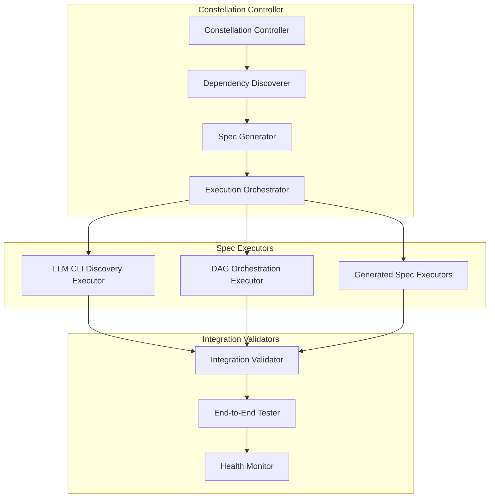

# Design Document - DAG Orchestration Constellation

## Introduction

This design document outlines the architecture for a constellation specification system that automatically discovers, resolves, and executes multiple interdependent specifications to deliver a complete DAG orchestration system with LLM integration. The constellation acts as a meta-orchestrator that ensures all dependencies are satisfied before attempting execution.

## Architecture Overview

### Constellation Orchestrator Pattern

The constellation uses a three-tier architecture:

1. **Constellation Controller** - Meta-orchestrator that manages spec dependencies and execution
2. **Spec Executors** - Individual spec execution engines with standardized interfaces  
3. **Integration Validators** - End-to-end validation and testing systems



## Core Components

### 1. Constellation Controller

**Purpose**: Meta-orchestrator that manages the entire constellation execution lifecycle.

**Key Responsibilities**:
- Dependency discovery and analysis
- Spec completion and generation
- Execution orchestration and monitoring
- Health aggregation and reporting

**Implementation Strategy**:
```python
class ConstellationController(ReflectiveModule):
    def __init__(self, target_specs: List[str]):
        super().__init__()
        self.target_specs = target_specs
        self.dependency_graph = DAGRegistry()
        self.spec_executors = {}
        self.execution_status = {}
    
    async def execute_constellation(self) -> ConstellationResult:
        # 1. Discover and resolve dependencies
        await self.discover_dependencies()
        
        # 2. Complete incomplete specs
        await self.complete_missing_specs()
        
        # 3. Execute specs in dependency order
        return await self.orchestrate_execution()
```

### 2. Dependency Discoverer

**Purpose**: Analyzes specs to identify dependencies and create execution DAG.

**Key Capabilities**:
- Parse requirements and design documents for dependency references
- Identify missing prerequisite specs
- Create dependency graph with topological ordering
- Detect circular dependencies and suggest resolutions

**Dependency Detection Patterns**:
```python
class DependencyDiscoverer:
    def analyze_spec_dependencies(self, spec_path: str) -> Set[str]:
        dependencies = set()
        
        # Parse requirements for dependency references
        requirements = self.parse_requirements(spec_path)
        dependencies.update(self.extract_spec_references(requirements))
        
        # Parse design for integration points
        design = self.parse_design(spec_path)
        dependencies.update(self.extract_integration_dependencies(design))
        
        # Parse tasks for prerequisite components
        tasks = self.parse_tasks(spec_path)
        dependencies.update(self.extract_component_dependencies(tasks))
        
        return dependencies
```

### 3. Spec Generator

**Purpose**: Automatically generates missing specs based on dependency analysis.

**Generation Strategies**:
- **Template-Based**: Use existing spec templates for common patterns
- **Context-Aware**: Generate specs based on dependency context and requirements
- **Architecture-Consistent**: Ensure generated specs follow Beast Mode patterns

**Implementation Approach**:
```python
class SpecGenerator:
    def generate_missing_spec(self, spec_name: str, context: DependencyContext) -> SpecificationFiles:
        # Generate requirements based on dependency context
        requirements = self.generate_requirements(spec_name, context)
        
        # Generate design based on architectural patterns
        design = self.generate_design(spec_name, context, requirements)
        
        # Generate tasks based on requirements and design
        tasks = self.generate_tasks(spec_name, requirements, design)
        
        return SpecificationFiles(requirements, design, tasks)
```

### 4. Execution Orchestrator

**Purpose**: Orchestrates execution of multiple specs in dependency order.

**Orchestration Strategy**:
- Use existing DAG orchestration infrastructure
- Execute independent specs in parallel
- Maintain execution state and progress tracking
- Handle failures with isolation and recovery

**Key Features**:
```python
class ExecutionOrchestrator:
    async def orchestrate_execution(self, spec_dag: DAGRegistry) -> ConstellationResult:
        # Get topological execution order
        execution_order = spec_dag.get_topological_order()
        
        # Execute specs with dependency awareness
        for execution_level in self.group_by_dependencies(execution_order):
            # Execute independent specs in parallel
            await self.execute_parallel_specs(execution_level)
            
            # Validate level completion before proceeding
            await self.validate_level_completion(execution_level)
```

### 5. Integration Validator

**Purpose**: Validates end-to-end functionality across all constellation components.

**Validation Approach**:
- Component integration testing
- End-to-end workflow validation
- Performance and reliability testing
- Health monitoring and reporting

## Constellation Execution Flow

### Phase 1: Discovery and Analysis
1. **Spec Inventory**: Catalog all target specs and their current state
2. **Dependency Analysis**: Parse specs to identify dependencies
3. **Gap Analysis**: Identify missing or incomplete specs
4. **DAG Construction**: Build execution dependency graph

### Phase 2: Spec Completion
1. **Missing Spec Generation**: Create missing specs using templates and context
2. **Incomplete Spec Completion**: Complete missing requirements, design, or tasks
3. **Consistency Validation**: Ensure all specs are consistent and complete
4. **Dependency Verification**: Validate that all dependencies are resolvable

### Phase 3: Orchestrated Execution
1. **Execution Planning**: Create execution plan with parallel opportunities
2. **Progressive Execution**: Execute specs in dependency order
3. **Progress Monitoring**: Track execution status across all specs
4. **Failure Handling**: Isolate failures and continue with independent specs

### Phase 4: Integration Validation
1. **Component Testing**: Validate individual spec implementations
2. **Integration Testing**: Test interactions between components
3. **End-to-End Testing**: Validate complete system functionality
4. **Performance Validation**: Ensure performance targets are met

### Phase 5: Health Monitoring
1. **System Health**: Monitor health across all constellation components
2. **Performance Metrics**: Track performance and resource usage
3. **Reliability Assessment**: Evaluate system reliability and stability
4. **Operational Readiness**: Confirm system is ready for production use

## Integration Points

### Beast Mode Framework Integration
- All constellation components inherit from ReflectiveModule
- Leverage existing DAG orchestration infrastructure
- Use Beast Mode monitoring and observability patterns
- Integrate with ACE Reporter for progress broadcasting

### Existing Infrastructure Leverage
- Use existing DAG Registry for dependency management
- Leverage Parallel Execution Engine for spec execution
- Integrate with AI Memory Palace for learning and optimization
- Use existing health monitoring and metrics collection

## Error Handling and Recovery

### Failure Isolation Strategy
- Isolate spec execution failures to prevent cascade effects
- Continue execution of independent specs when failures occur
- Provide detailed failure analysis and recovery guidance
- Support manual intervention and re-execution

### Recovery Mechanisms
- Automatic retry with exponential backoff for transient failures
- Checkpoint-based recovery for long-running executions
- Rollback capabilities for failed spec implementations
- Manual override options for complex failure scenarios

## Performance Considerations

### Execution Optimization
- Maximize parallel execution of independent specs
- Use resource-aware scheduling to prevent resource contention
- Implement intelligent caching for repeated operations
- Optimize spec parsing and analysis for large constellations

### Scalability Design
- Support for large numbers of interdependent specs
- Efficient dependency graph algorithms for complex relationships
- Streaming execution status for real-time monitoring
- Resource management for concurrent spec executions

## Success Metrics

### Constellation Health Indicators
- **Completion Rate**: Percentage of specs successfully completed
- **Dependency Resolution**: Success rate of dependency resolution
- **Execution Efficiency**: Parallel execution utilization
- **Integration Success**: End-to-end validation pass rate
- **System Reliability**: Uptime and stability metrics

### Performance Targets
- **Dependency Discovery**: < 30 seconds for complex constellations
- **Spec Generation**: < 2 minutes per generated spec
- **Execution Orchestration**: > 70% parallel execution efficiency
- **Integration Validation**: < 10 minutes for complete validation
- **Health Monitoring**: < 1 second response time for status queries