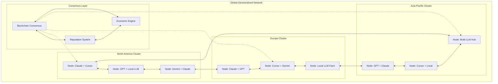
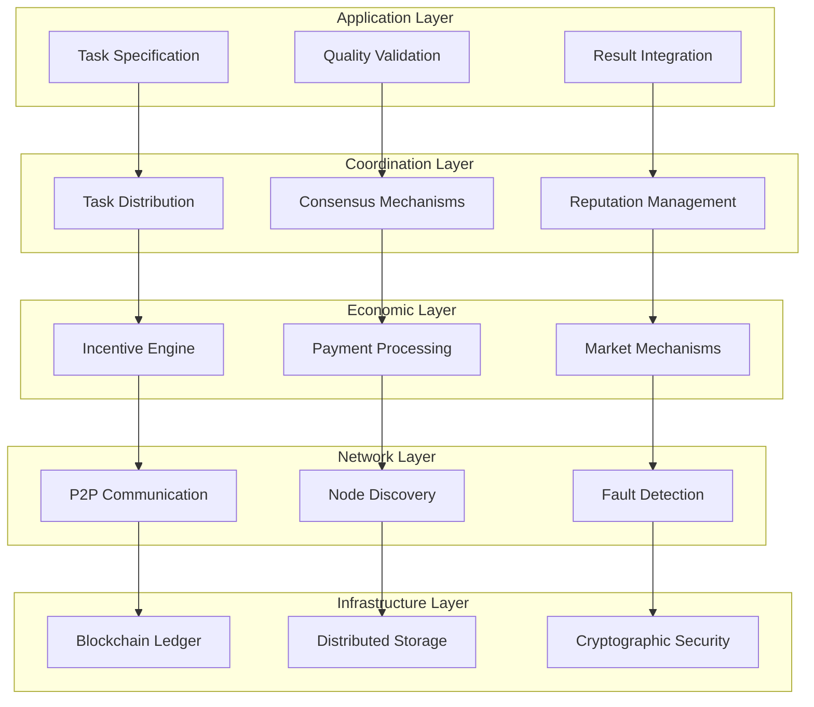

# Decentralized AI Coordination Network - Design Document

## Overview

This design implements a self-organizing, decentralized network for coordinating AI-assisted development across unlimited participants without central control. The architecture uses blockchain consensus, reputation systems, economic incentives, and peer-to-peer protocols to create a fault-tolerant ecosystem that scales globally while maintaining quality and fairness.

## Architecture

### High-Level Network Topology



### Decentralized Protocol Stack



## Core Components and Interfaces

### 1. Decentralized Node Architecture

**Purpose**: Individual network participants that contribute AI resources and coordinate autonomously

**Node Implementation**:
```python
class DecentralizedNode:
    def __init__(self, node_config: NodeConfig):
        # Initialize secure credential management first
        self.credential_manager = SecureCredentialManager()
        self._validate_node_credentials(node_config)
        
        self.node_id = generate_node_id()
        self.capabilities = self.detect_llm_capabilities()
        self.reputation_score = 0.0
        self.economic_balance = 0.0
        
        # Core subsystems
        self.consensus_engine = ConsensusEngine(self)
        self.reputation_manager = ReputationManager(self)
        self.economic_engine = EconomicEngine(self)
        self.task_executor = TaskExecutor(self)
        self.p2p_network = P2PNetwork(self)
        
    def _validate_node_credentials(self, node_config: NodeConfig):
        """Validate all required credentials are properly configured."""
        validation_result = self.credential_manager.validate_node_credentials(node_config)
        
        if not validation_result.valid:
            error_msg = "Node credential validation failed:\n"
            if validation_result.missing_credentials:
                error_msg += f"Missing: {', '.join(validation_result.missing_credentials)}\n"
            if validation_result.invalid_credentials:
                error_msg += f"Invalid/Placeholder: {', '.join(validation_result.invalid_credentials)}\n"
            error_msg += "Please configure proper credentials in environment variables."
            raise SecurityError(error_msg)
        
    async def join_network(self) -> NetworkJoinResult
    async def discover_peers(self) -> List[PeerNode]
    async def participate_in_consensus(self, proposal: Proposal) -> Vote
    async def execute_assigned_task(self, task: Task) -> TaskResult
    async def validate_peer_work(self, work: PeerWork) -> ValidationResult
```

**Node Capabilities Detection**:
```python
class CapabilityDetector:
    def __init__(self, credential_manager: SecureCredentialManager):
        self.credential_manager = credential_manager
        
    def detect_llm_capabilities(self) -> NodeCapabilities:
        capabilities = NodeCapabilities()
        
        # Detect available LLM providers using secure credentials
        llm_providers = ['claude', 'cursor', 'gpt', 'gemini']
        
        for provider in llm_providers:
            try:
                credentials = self.credential_manager.get_llm_credentials(provider)
                if self.test_provider_access(provider, credentials):
                    capabilities.add_llm(provider, self.get_provider_limits(provider, credentials))
            except SecurityError:
                # Provider credentials not available, skip
                continue
            
        # Detect computational resources
        capabilities.cpu_cores = psutil.cpu_count()
        capabilities.memory_gb = psutil.virtual_memory().total // (1024**3)
        capabilities.storage_gb = psutil.disk_usage('/').total // (1024**3)
        
        # Detect specialized skills
        capabilities.programming_languages = self.detect_programming_skills()
        capabilities.domain_expertise = self.detect_domain_knowledge()
        
        return capabilities
        
    def test_provider_access(self, provider: str, credentials: LLMCredentials) -> bool:
        """Test if LLM provider is accessible with given credentials."""
        try:
            # Implement provider-specific connection test
            if provider == 'claude':
                return self._test_claude_connection(credentials)
            elif provider == 'gpt':
                return self._test_openai_connection(credentials)
            elif provider == 'cursor':
                return self._test_cursor_connection(credentials)
            elif provider == 'gemini':
                return self._test_gemini_connection(credentials)
            return False
        except Exception:
            return False
            
    def get_provider_limits(self, provider: str, credentials: LLMCredentials) -> ProviderLimits:
        """Get rate limits and capabilities for the provider."""
        # Implementation would query provider APIs for current limits
        return ProviderLimits(
            requests_per_minute=60,
            tokens_per_minute=10000,
            max_context_length=8192
        )
```

### 2. Consensus and Governance System

**Purpose**: Enable decentralized decision-making without central authority

**Consensus Engine**:
```python
class ConsensusEngine:
    def __init__(self, node: DecentralizedNode):
        self.node = node
        self.voting_power = self.calculate_voting_power()
        self.consensus_algorithms = {
            'task_allocation': TaskAllocationConsensus(),
            'quality_standards': QualityStandardsConsensus(),
            'network_governance': NetworkGovernanceConsensus(),
            'economic_parameters': EconomicParametersConsensus()
        }
        
    async def propose_task_allocation(self, tasks: List[Task]) -> Proposal
    async def vote_on_proposal(self, proposal: Proposal) -> Vote
    async def execute_consensus_decision(self, decision: ConsensusDecision)
    
    def calculate_voting_power(self) -> float:
        # Voting power based on reputation, stake, and contribution history
        reputation_weight = self.node.reputation_score * 0.4
        stake_weight = self.node.economic_balance * 0.3
        contribution_weight = self.node.contribution_history * 0.3
        return reputation_weight + stake_weight + contribution_weight
```

**Governance Mechanisms**:
```python
class NetworkGovernance:
    def __init__(self):
        self.governance_rules = GovernanceRules()
        self.proposal_queue = ProposalQueue()
        self.voting_system = VotingSystem()
        
    async def submit_governance_proposal(self, proposal: GovernanceProposal) -> ProposalId
    async def conduct_network_vote(self, proposal_id: ProposalId) -> VotingResult
    async def implement_approved_changes(self, changes: List[NetworkChange])
    
    def validate_proposal(self, proposal: GovernanceProposal) -> ValidationResult:
        # Ensure proposals meet network standards
        if not self.check_proposal_format(proposal):
            return ValidationResult.INVALID_FORMAT
        if not self.check_economic_impact(proposal):
            return ValidationResult.ECONOMIC_RISK
        if not self.check_technical_feasibility(proposal):
            return ValidationResult.TECHNICAL_INFEASIBLE
        return ValidationResult.VALID
```

### 3. Reputation and Quality Control System

**Purpose**: Maintain network quality through peer-based reputation without central authority

**Reputation Manager**:
```python
class ReputationManager:
    def __init__(self, node: DecentralizedNode):
        self.node = node
        self.reputation_ledger = ReputationLedger()
        self.quality_assessors = QualityAssessors()
        self.peer_validators = PeerValidators()
        
    async def assess_work_quality(self, work: CompletedWork) -> QualityScore
    async def update_contributor_reputation(self, contributor: NodeId, score: QualityScore)
    async def validate_peer_assessment(self, assessment: PeerAssessment) -> bool
    
    def calculate_reputation_score(self, contributor: NodeId) -> ReputationScore:
        # Multi-dimensional reputation calculation
        quality_history = self.get_quality_history(contributor)
        peer_reviews = self.get_peer_reviews(contributor)
        network_contributions = self.get_network_contributions(contributor)
        
        return ReputationScore(
            quality_average=np.mean(quality_history),
            peer_rating=np.mean(peer_reviews),
            contribution_volume=len(network_contributions),
            consistency_score=self.calculate_consistency(quality_history),
            collaboration_score=self.calculate_collaboration(peer_reviews)
        )
```

**Quality Assessment Framework**:
```python
class QualityAssessmentFramework:
    def __init__(self):
        self.assessment_criteria = {
            'code_quality': CodeQualityAssessor(),
            'requirement_compliance': ComplianceAssessor(),
            'test_coverage': TestCoverageAssessor(),
            'documentation': DocumentationAssessor(),
            'integration_success': IntegrationAssessor()
        }
        
    async def comprehensive_quality_assessment(self, work: CompletedWork) -> QualityReport:
        assessments = {}
        
        for criterion, assessor in self.assessment_criteria.items():
            score = await assessor.assess(work)
            assessments[criterion] = score
            
        overall_score = self.calculate_weighted_score(assessments)
        recommendations = self.generate_improvement_recommendations(assessments)
        
        return QualityReport(
            overall_score=overall_score,
            detailed_scores=assessments,
            recommendations=recommendations,
            peer_review_required=overall_score < 0.8
        )
```

### 4. Economic Incentive Engine

**Purpose**: Align economic incentives to maintain network health and quality

**Economic Engine**:
```python
class EconomicEngine:
    def __init__(self, node: DecentralizedNode):
        self.node = node
        self.token_system = NetworkTokenSystem()
        self.market_mechanisms = MarketMechanisms()
        self.payment_processor = PaymentProcessor()
        
    async def calculate_task_reward(self, task: Task, quality_score: float) -> Reward
    async def process_payment(self, contributor: NodeId, reward: Reward)
    async def handle_quality_penalty(self, contributor: NodeId, penalty: Penalty)
    
    def determine_task_pricing(self, task: Task) -> TaskPrice:
        # Dynamic pricing based on complexity, urgency, and market conditions
        base_price = self.calculate_base_price(task)
        complexity_multiplier = self.assess_complexity_multiplier(task)
        urgency_multiplier = self.assess_urgency_multiplier(task)
        market_multiplier = self.assess_market_conditions()
        
        return TaskPrice(
            base_amount=base_price,
            total_amount=base_price * complexity_multiplier * urgency_multiplier * market_multiplier,
            currency='NETWORK_TOKENS',
            payment_terms=self.determine_payment_terms(task)
        )
```

**Market Mechanisms**:
```python
class MarketMechanisms:
    def __init__(self):
        self.task_marketplace = TaskMarketplace()
        self.contributor_marketplace = ContributorMarketplace()
        self.reputation_marketplace = ReputationMarketplace()
        
    async def create_task_auction(self, task: Task) -> AuctionId
    async def bid_on_task(self, task_id: TaskId, bid: Bid) -> BidResult
    async def select_winning_bids(self, auction_id: AuctionId) -> List[WinningBid]
    
    def calculate_market_rates(self) -> MarketRates:
        # Dynamic market rate calculation
        supply_demand_ratio = self.calculate_supply_demand()
        quality_premium = self.calculate_quality_premium()
        network_growth_factor = self.calculate_network_growth()
        
        return MarketRates(
            base_rate=supply_demand_ratio,
            quality_bonus=quality_premium,
            growth_incentive=network_growth_factor
        )
```

### 5. Task Distribution and Coordination

**Purpose**: Distribute tasks efficiently across the network without central coordination

**Task Distribution Engine**:
```python
class TaskDistributionEngine:
    def __init__(self):
        self.task_registry = DistributedTaskRegistry()
        self.capability_matcher = CapabilityMatcher()
        self.load_balancer = NetworkLoadBalancer()
        
    async def distribute_task_batch(self, tasks: List[Task]) -> DistributionResult
    async def match_tasks_to_capabilities(self, tasks: List[Task]) -> List[TaskMatch]
    async def balance_network_load(self, assignments: List[TaskAssignment])
    
    def optimize_task_allocation(self, tasks: List[Task], nodes: List[Node]) -> AllocationPlan:
        # Multi-objective optimization for task allocation
        objectives = [
            self.minimize_completion_time,
            self.maximize_quality_probability,
            self.balance_workload_distribution,
            self.minimize_communication_overhead
        ]
        
        allocation_plan = self.solve_multi_objective_optimization(
            tasks=tasks,
            nodes=nodes,
            objectives=objectives,
            constraints=self.get_allocation_constraints()
        )
        
        return allocation_plan
```

**Capability Matching System**:
```python
class CapabilityMatcher:
    def __init__(self):
        self.skill_ontology = SkillOntology()
        self.matching_algorithms = MatchingAlgorithms()
        self.learning_system = MatchingLearningSystem()
        
    def match_task_to_nodes(self, task: Task, available_nodes: List[Node]) -> List[NodeMatch]:
        matches = []
        
        for node in available_nodes:
            compatibility_score = self.calculate_compatibility(task, node)
            quality_prediction = self.predict_quality_outcome(task, node)
            availability_score = self.assess_availability(node)
            
            match_score = (
                compatibility_score * 0.4 +
                quality_prediction * 0.4 +
                availability_score * 0.2
            )
            
            matches.append(NodeMatch(
                node=node,
                compatibility=compatibility_score,
                predicted_quality=quality_prediction,
                availability=availability_score,
                overall_score=match_score
            ))
            
        return sorted(matches, key=lambda m: m.overall_score, reverse=True)
```

### 6. Peer-to-Peer Network Infrastructure

**Purpose**: Enable direct communication and coordination between network nodes

**P2P Network Manager**:
```python
class P2PNetworkManager:
    def __init__(self, node: DecentralizedNode):
        self.node = node
        self.credential_manager = node.credential_manager
        self.peer_discovery = PeerDiscovery()
        self.message_router = MessageRouter()
        self.connection_manager = SecureConnectionManager(self.credential_manager)
        
    async def bootstrap_network_connection(self) -> NetworkConnection
    async def discover_and_connect_peers(self) -> List[PeerConnection]
    async def broadcast_message(self, message: NetworkMessage)
    async def route_direct_message(self, target: NodeId, message: DirectMessage)
    
    def maintain_network_topology(self):
        # Maintain optimal network connectivity
        current_connections = self.connection_manager.get_active_connections()
        optimal_connections = self.calculate_optimal_topology()
        
        # Add missing connections
        for target in optimal_connections:
            if target not in current_connections:
                asyncio.create_task(self.establish_secure_connection(target))
                
        # Remove excessive connections
        for connection in current_connections:
            if connection not in optimal_connections:
                asyncio.create_task(self.gracefully_close_connection(connection))
                
    async def establish_secure_connection(self, target: NodeId) -> SecureConnection:
        """Establish TLS 1.3 encrypted connection to peer node."""
        return await self.connection_manager.create_secure_connection(
            target=target,
            tls_version='1.3',
            encryption_key=self.credential_manager.get_credential('NETWORK_ENCRYPTION_KEY')
        )
```

**Secure Connection Manager**:
```python
class SecureConnectionManager:
    def __init__(self, credential_manager: SecureCredentialManager):
        self.credential_manager = credential_manager
        self.active_connections = {}
        self.tls_context = self._create_tls_context()
        
    def _create_tls_context(self) -> ssl.SSLContext:
        """Create TLS 1.3 context for secure communications."""
        context = ssl.create_default_context(ssl.Purpose.SERVER_AUTH)
        context.minimum_version = ssl.TLSVersion.TLSv1_3
        context.maximum_version = ssl.TLSVersion.TLSv1_3
        
        # Load network encryption certificates
        network_cert = self.credential_manager.get_credential('NETWORK_CERT_PATH')
        network_key = self.credential_manager.get_credential('NETWORK_KEY_PATH')
        
        if network_cert and network_key:
            context.load_cert_chain(network_cert, network_key)
            
        return context
        
    async def create_secure_connection(self, target: NodeId, tls_version: str, encryption_key: str) -> SecureConnection:
        """Create encrypted connection with credential validation."""
        if not encryption_key:
            raise SecurityError("Network encryption key not configured")
            
        # Establish TLS 1.3 connection
        connection = await self._establish_tls_connection(target)
        
        # Add additional encryption layer for sensitive data
        encrypted_connection = EncryptedConnection(
            base_connection=connection,
            encryption_key=encryption_key,
            node_id=target
        )
        
        self.active_connections[target] = encrypted_connection
        return encrypted_connection
        
    async def _establish_tls_connection(self, target: NodeId) -> ssl.SSLSocket:
        """Establish TLS 1.3 connection to target node."""
        target_address = await self._resolve_node_address(target)
        
        sock = socket.socket(socket.AF_INET, socket.SOCK_STREAM)
        ssl_sock = self.tls_context.wrap_socket(
            sock, 
            server_hostname=target_address.hostname
        )
        
        await ssl_sock.connect((target_address.host, target_address.port))
        
        # Verify TLS 1.3 is being used
        if ssl_sock.version() != 'TLSv1.3':
            ssl_sock.close()
            raise SecurityError(f"Failed to establish TLS 1.3 connection to {target}")
            
        return ssl_sock
```

**Fault Detection and Recovery**:
```python
class FaultDetectionSystem:
    def __init__(self, network: P2PNetworkManager):
        self.network = network
        self.health_monitors = HealthMonitors()
        self.failure_detectors = FailureDetectors()
        self.recovery_mechanisms = RecoveryMechanisms()
        
    async def monitor_network_health(self):
        while True:
            health_status = await self.assess_network_health()
            
            if health_status.has_failures():
                await self.handle_detected_failures(health_status.failures)
                
            if health_status.has_degradation():
                await self.optimize_network_performance(health_status.issues)
                
            await asyncio.sleep(self.monitoring_interval)
            
    async def handle_node_failure(self, failed_node: NodeId):
        # Redistribute failed node's tasks
        orphaned_tasks = await self.get_orphaned_tasks(failed_node)
        await self.redistribute_tasks(orphaned_tasks)
        
        # Update network topology
        await self.remove_failed_node_connections(failed_node)
        await self.rebalance_network_topology()
        
        # Update reputation and economic records
        await self.handle_failure_reputation_impact(failed_node)
```

## Data Models and Protocols

### Network Protocol Messages

```python
@dataclass
class NetworkMessage:
    message_id: str
    sender: NodeId
    timestamp: datetime
    message_type: MessageType
    payload: Dict[str, Any]
    signature: str
    
class MessageType(Enum):
    TASK_ANNOUNCEMENT = "task_announcement"
    TASK_BID = "task_bid"
    TASK_ASSIGNMENT = "task_assignment"
    WORK_SUBMISSION = "work_submission"
    QUALITY_ASSESSMENT = "quality_assessment"
    REPUTATION_UPDATE = "reputation_update"
    CONSENSUS_PROPOSAL = "consensus_proposal"
    CONSENSUS_VOTE = "consensus_vote"
    NETWORK_HEARTBEAT = "network_heartbeat"
    PEER_DISCOVERY = "peer_discovery"
```

### Task and Work Models

```python
@dataclass
class DistributedTask:
    task_id: str
    title: str
    description: str
    requirements: TaskRequirements
    constraints: TaskConstraints
    reward_structure: RewardStructure
    quality_criteria: QualityCriteria
    deadline: datetime
    created_by: NodeId
    task_hash: str  # For integrity verification
    
@dataclass
class TaskRequirements:
    required_skills: List[Skill]
    required_llm_capabilities: List[LLMCapability]
    estimated_effort: EffortEstimate
    dependencies: List[TaskId]
    deliverables: List[Deliverable]
    
@dataclass
class CompletedWork:
    work_id: str
    task_id: str
    contributor: NodeId
    deliverables: List[CompletedDeliverable]
    completion_time: datetime
    effort_actual: EffortActual
    self_assessment: SelfAssessment
    work_hash: str  # For integrity verification
```

### Reputation and Economic Models

```python
@dataclass
class ReputationProfile:
    node_id: NodeId
    overall_score: float
    skill_scores: Dict[Skill, float]
    quality_history: List[QualityScore]
    peer_reviews: List[PeerReview]
    contribution_count: int
    network_tenure: timedelta
    specializations: List[Specialization]
    
@dataclass
class EconomicProfile:
    node_id: NodeId
    token_balance: float
    earnings_history: List[EarningRecord]
    payment_history: List[PaymentRecord]
    market_reputation: float
    preferred_payment_methods: List[PaymentMethod]
    economic_stake: float
```

### Security and Credential Models

```python
@dataclass
class NodeCredentials:
    node_id: NodeId
    redis_password: str  # Retrieved from environment
    llm_credentials: Dict[str, LLMCredentials]
    network_encryption_key: str
    private_key: str
    certificate_path: Optional[str] = None
    
@dataclass
class LLMCredentials:
    provider: str
    api_key: str
    encrypted: bool = True
    rate_limits: Optional[ProviderLimits] = None
    
@dataclass
class ValidationResult:
    valid: bool
    missing_credentials: List[str] = field(default_factory=list)
    invalid_credentials: List[str] = field(default_factory=list)
    reason: Optional[str] = None
    
@dataclass
class SecureConnection:
    target_node: NodeId
    connection_id: str
    tls_version: str
    encryption_level: str
    established_at: datetime
    last_activity: datetime
    
@dataclass
class CredentialAuditLog:
    timestamp: datetime
    node_id: NodeId
    action: str  # 'credential_access', 'validation_failure', 'security_violation'
    credential_type: str
    success: bool
    details: Optional[str] = None
```

## Consensus Algorithms

### Task Allocation Consensus

```python
class TaskAllocationConsensus:
    def __init__(self):
        self.allocation_algorithm = "weighted_voting"
        self.minimum_consensus_threshold = 0.67
        
    async def reach_consensus_on_allocation(self, task: Task, candidates: List[Node]) -> AllocationDecision:
        # Phase 1: Capability assessment by multiple nodes
        capability_assessments = await self.gather_capability_assessments(task, candidates)
        
        # Phase 2: Weighted voting based on assessor reputation
        votes = await self.conduct_weighted_voting(capability_assessments)
        
        # Phase 3: Consensus verification
        consensus_reached = self.verify_consensus_threshold(votes)
        
        if consensus_reached:
            return AllocationDecision(
                selected_node=self.determine_winner(votes),
                consensus_strength=self.calculate_consensus_strength(votes),
                dissenting_opinions=self.capture_dissent(votes)
            )
        else:
            return await self.handle_consensus_failure(task, candidates, votes)
```

### Quality Standards Consensus

```python
class QualityStandardsConsensus:
    def __init__(self):
        self.quality_dimensions = [
            'code_quality', 'requirement_compliance', 'test_coverage',
            'documentation', 'maintainability', 'performance'
        ]
        
    async def evolve_quality_standards(self, historical_data: QualityHistoricalData) -> QualityStandards:
        # Analyze quality trends across the network
        quality_trends = self.analyze_quality_trends(historical_data)
        
        # Propose adjustments to quality standards
        proposed_standards = self.propose_standard_adjustments(quality_trends)
        
        # Network-wide consensus on new standards
        consensus_result = await self.conduct_standards_consensus(proposed_standards)
        
        if consensus_result.approved:
            return self.implement_new_standards(consensus_result.approved_standards)
        else:
            return self.maintain_current_standards()
```

## Security and Privacy Architecture

### Cryptographic Security Framework

```python
class SecurityFramework:
    def __init__(self):
        self.identity_manager = IdentityManager()
        self.encryption_engine = EncryptionEngine()
        self.signature_system = SignatureSystem()
        self.privacy_protector = PrivacyProtector()
        
    def generate_node_identity(self) -> NodeIdentity:
        # Generate cryptographic identity for network participation
        private_key = self.generate_private_key()
        public_key = self.derive_public_key(private_key)
        node_id = self.hash_public_key(public_key)
        
        return NodeIdentity(
            node_id=node_id,
            public_key=public_key,
            private_key=private_key,  # Kept locally, never shared
            identity_proof=self.generate_identity_proof(private_key, public_key)
        )
        
    def encrypt_sensitive_data(self, data: Any, recipient: NodeId) -> EncryptedData:
        recipient_public_key = self.get_node_public_key(recipient)
        encrypted_data = self.encryption_engine.encrypt(data, recipient_public_key)
        return EncryptedData(
            ciphertext=encrypted_data,
            recipient=recipient,
            encryption_method='RSA-4096'
        )
```

### Secure Credential Management System

**Purpose**: Ensure all network credentials are managed securely without hardcoded values

**Design Rationale**: Following security best practices, all sensitive credentials must be managed through environment variables and secure credential systems. This prevents credential exposure in source code and enables secure deployment across different environments.

**Secure Credential Manager**:
```python
class SecureCredentialManager:
    def __init__(self):
        self.credential_store = EnvironmentCredentialStore()
        self.validation_engine = CredentialValidationEngine()
        self.encryption_service = CredentialEncryptionService()
        
    def get_redis_password(self) -> str:
        """Secure Redis password retrieval following governance requirements."""
        password = self.credential_store.get_credential('REDIS_PASSWORD')
        if not password or password in ['placeholder', 'beastmode2025', 'default']:
            raise SecurityError("Invalid or placeholder Redis password detected")
        return password
        
    def get_llm_credentials(self, provider: str) -> LLMCredentials:
        """Retrieve LLM provider credentials securely."""
        credential_key = f"{provider.upper()}_API_KEY"
        api_key = self.credential_store.get_credential(credential_key)
        
        if not api_key:
            raise SecurityError(f"Missing {provider} API key in environment")
            
        return LLMCredentials(
            provider=provider,
            api_key=api_key,
            encrypted=True
        )
        
    def validate_node_credentials(self, node_config: NodeConfig) -> ValidationResult:
        """Validate all required credentials are properly configured."""
        required_credentials = [
            'REDIS_PASSWORD',
            'NODE_PRIVATE_KEY',
            'NETWORK_ENCRYPTION_KEY'
        ]
        
        # Add LLM provider credentials based on node capabilities
        for provider in node_config.llm_providers:
            required_credentials.append(f"{provider.upper()}_API_KEY")
            
        missing_credentials = []
        invalid_credentials = []
        
        for credential in required_credentials:
            value = self.credential_store.get_credential(credential)
            if not value:
                missing_credentials.append(credential)
            elif self.validation_engine.is_placeholder(value):
                invalid_credentials.append(credential)
                
        return ValidationResult(
            valid=len(missing_credentials) == 0 and len(invalid_credentials) == 0,
            missing_credentials=missing_credentials,
            invalid_credentials=invalid_credentials
        )
```

**Environment Credential Store**:
```python
class EnvironmentCredentialStore:
    def __init__(self):
        self.load_env_files()
        
    def load_env_files(self):
        """Load credentials from .env files following security governance."""
        env_files = [
            Path.home() / ".env",
            Path.cwd() / ".env",
            Path.cwd() / ".env.local"
        ]
        
        for env_file in env_files:
            if env_file.exists():
                self._load_env_file(env_file)
                
    def get_credential(self, key: str) -> Optional[str]:
        """Retrieve credential from environment with security validation."""
        value = os.getenv(key)
        
        if value:
            # Clear from memory after retrieval for security
            self._secure_memory_clear(value)
            
        return value
        
    def _load_env_file(self, env_file: Path):
        """Securely load environment file."""
        with open(env_file, 'r') as f:
            for line in f:
                line = line.strip()
                if line and not line.startswith('#') and '=' in line:
                    key, value = line.split('=', 1)
                    os.environ[key.strip()] = value.strip().strip('"').strip("'")
                    
    def _secure_memory_clear(self, value: str):
        """Clear sensitive data from memory."""
        # Implementation would use secure memory clearing techniques
        pass
```

**Credential Validation Engine**:
```python
class CredentialValidationEngine:
    def __init__(self):
        self.placeholder_patterns = [
            'placeholder', 'default', 'changeme', 'password',
            'beastmode2025', 'redis_password', 'api_key_here'
        ]
        
    def is_placeholder(self, credential: str) -> bool:
        """Check if credential is a placeholder value."""
        if not credential:
            return True
            
        credential_lower = credential.lower()
        return any(pattern in credential_lower for pattern in self.placeholder_patterns)
        
    def validate_credential_strength(self, credential: str, credential_type: str) -> ValidationResult:
        """Validate credential meets security requirements."""
        if credential_type == 'api_key':
            return self._validate_api_key(credential)
        elif credential_type == 'password':
            return self._validate_password(credential)
        elif credential_type == 'private_key':
            return self._validate_private_key(credential)
            
        return ValidationResult(valid=True)
        
    def _validate_api_key(self, api_key: str) -> ValidationResult:
        """Validate API key format and strength."""
        if len(api_key) < 32:
            return ValidationResult(valid=False, reason="API key too short")
        if self.is_placeholder(api_key):
            return ValidationResult(valid=False, reason="Placeholder API key detected")
        return ValidationResult(valid=True)
```

### Privacy Protection Mechanisms

```python
class PrivacyProtector:
    def __init__(self):
        self.anonymization_engine = AnonymizationEngine()
        self.data_minimizer = DataMinimizer()
        self.access_controller = AccessController()
        
    def protect_contributor_privacy(self, work_submission: WorkSubmission) -> PrivacyProtectedSubmission:
        # Remove personally identifiable information
        anonymized_work = self.anonymization_engine.anonymize(work_submission)
        
        # Minimize data exposure
        minimized_data = self.data_minimizer.minimize_exposure(anonymized_work)
        
        # Apply access controls
        access_controlled = self.access_controller.apply_controls(minimized_data)
        
        return PrivacyProtectedSubmission(
            work_content=access_controlled,
            privacy_level='HIGH',
            data_retention_policy='AUTOMATIC_DELETION_30_DAYS'
        )
```

## Network Scaling and Performance

### Horizontal Scaling Architecture

```python
class NetworkScalingManager:
    def __init__(self):
        self.cluster_manager = ClusterManager()
        self.load_balancer = NetworkLoadBalancer()
        self.performance_monitor = PerformanceMonitor()
        
    async def handle_network_growth(self, new_nodes: List[Node]):
        # Dynamically organize nodes into clusters
        optimal_clusters = self.cluster_manager.optimize_clustering(new_nodes)
        
        # Rebalance load across clusters
        await self.load_balancer.rebalance_clusters(optimal_clusters)
        
        # Update routing and discovery mechanisms
        await self.update_network_topology(optimal_clusters)
        
    def calculate_network_capacity(self) -> NetworkCapacity:
        active_nodes = self.get_active_nodes()
        total_capacity = sum(node.computational_capacity for node in active_nodes)
        available_capacity = sum(node.available_capacity for node in active_nodes)
        
        return NetworkCapacity(
            total_nodes=len(active_nodes),
            total_computational_capacity=total_capacity,
            available_capacity=available_capacity,
            utilization_rate=1 - (available_capacity / total_capacity),
            scaling_recommendation=self.recommend_scaling_action()
        )
```

### Performance Optimization

```python
class PerformanceOptimizer:
    def __init__(self):
        self.bottleneck_detector = BottleneckDetector()
        self.optimization_engine = OptimizationEngine()
        self.performance_predictor = PerformancePredictor()
        
    async def optimize_network_performance(self):
        # Detect performance bottlenecks
        bottlenecks = await self.bottleneck_detector.identify_bottlenecks()
        
        # Generate optimization strategies
        optimizations = self.optimization_engine.generate_optimizations(bottlenecks)
        
        # Predict optimization impact
        impact_predictions = self.performance_predictor.predict_impact(optimizations)
        
        # Implement high-impact optimizations
        for optimization in optimizations:
            if impact_predictions[optimization.id].expected_improvement > 0.1:
                await self.implement_optimization(optimization)
```

## Deployment and Operations

### Network Bootstrap Process

```python
class NetworkBootstrap:
    def __init__(self):
        self.genesis_config = GenesisConfig()
        self.initial_nodes = InitialNodeSet()
        self.bootstrap_consensus = BootstrapConsensus()
        
    async def bootstrap_network(self) -> NetworkBootstrapResult:
        # Phase 1: Initialize genesis nodes
        genesis_nodes = await self.initialize_genesis_nodes()
        
        # Phase 2: Establish initial consensus
        initial_consensus = await self.establish_initial_consensus(genesis_nodes)
        
        # Phase 3: Open network for additional participants
        network_opened = await self.open_network_participation()
        
        # Phase 4: Validate network health
        network_health = await self.validate_network_health()
        
        return NetworkBootstrapResult(
            genesis_nodes=genesis_nodes,
            initial_consensus=initial_consensus,
            network_status=network_opened,
            health_status=network_health
        )
```

### Monitoring and Observability

```python
class NetworkObservability:
    def __init__(self):
        self.metrics_collector = MetricsCollector()
        self.health_dashboard = HealthDashboard()
        self.alert_system = AlertSystem()
        
    async def monitor_network_health(self):
        metrics = await self.metrics_collector.collect_network_metrics()
        
        health_indicators = [
            metrics.node_availability,
            metrics.consensus_performance,
            metrics.task_completion_rate,
            metrics.quality_scores,
            metrics.economic_health,
            metrics.network_latency
        ]
        
        overall_health = self.calculate_overall_health(health_indicators)
        
        await self.health_dashboard.update_display(overall_health, metrics)
        
        if overall_health.requires_attention():
            await self.alert_system.send_network_alerts(overall_health.issues)
```

## Error Handling and Security Protocols

### Credential Management Error Handling

**Design Rationale**: Robust error handling for credential management ensures network security while providing clear guidance for resolution.

**Error Handling Framework**:
```python
class CredentialErrorHandler:
    def __init__(self):
        self.audit_logger = CredentialAuditLogger()
        self.security_monitor = SecurityMonitor()
        
    def handle_missing_credentials(self, node_id: NodeId, missing_creds: List[str]) -> ErrorResponse:
        """Handle missing credential errors with helpful guidance."""
        self.audit_logger.log_credential_failure(
            node_id=node_id,
            action='missing_credentials',
            details=f"Missing: {', '.join(missing_creds)}"
        )
        
        error_message = self._generate_credential_setup_guide(missing_creds)
        
        return ErrorResponse(
            error_type='MISSING_CREDENTIALS',
            message=error_message,
            recovery_actions=self._get_credential_recovery_actions(missing_creds),
            severity='CRITICAL'
        )
        
    def handle_invalid_credentials(self, node_id: NodeId, invalid_creds: List[str]) -> ErrorResponse:
        """Handle invalid/placeholder credential errors."""
        self.audit_logger.log_security_violation(
            node_id=node_id,
            action='invalid_credentials',
            details=f"Placeholder credentials detected: {', '.join(invalid_creds)}"
        )
        
        return ErrorResponse(
            error_type='INVALID_CREDENTIALS',
            message="Placeholder or invalid credentials detected. Please configure real credentials.",
            recovery_actions=[
                "Replace placeholder values with real credentials",
                "Verify credential format and validity",
                "Restart node after credential update"
            ],
            severity='CRITICAL'
        )
        
    def handle_credential_transmission_failure(self, node_id: NodeId, target: NodeId) -> ErrorResponse:
        """Handle secure transmission failures."""
        return ErrorResponse(
            error_type='TRANSMISSION_FAILURE',
            message=f"Failed to establish secure connection to {target}",
            recovery_actions=[
                "Verify TLS 1.3 support on both nodes",
                "Check network encryption key configuration",
                "Validate certificate configuration"
            ],
            severity='HIGH'
        )
        
    def _generate_credential_setup_guide(self, missing_creds: List[str]) -> str:
        """Generate helpful setup guide for missing credentials."""
        guide = "Missing required credentials. Please configure the following in your .env file:\n\n"
        
        for cred in missing_creds:
            if cred == 'REDIS_PASSWORD':
                guide += "REDIS_PASSWORD=your_secure_redis_password_here\n"
            elif cred.endswith('_API_KEY'):
                provider = cred.replace('_API_KEY', '').lower()
                guide += f"{cred}=your_{provider}_api_key_here\n"
            else:
                guide += f"{cred}=your_secure_value_here\n"
                
        guide += "\nEnsure all values are real credentials, not placeholders."
        return guide
```

**Graceful Degradation Strategy**:
```python
class GracefulDegradationManager:
    def __init__(self):
        self.fallback_strategies = {
            'missing_llm_credentials': self._handle_missing_llm_fallback,
            'network_connection_failure': self._handle_network_fallback,
            'credential_validation_failure': self._handle_validation_fallback
        }
        
    def handle_credential_failure(self, failure_type: str, context: Dict[str, Any]) -> DegradationResponse:
        """Handle credential failures with appropriate degradation."""
        if failure_type in self.fallback_strategies:
            return self.fallback_strategies[failure_type](context)
        else:
            return self._handle_critical_failure(failure_type, context)
            
    def _handle_missing_llm_fallback(self, context: Dict[str, Any]) -> DegradationResponse:
        """Handle missing LLM credentials by reducing capabilities."""
        available_providers = context.get('available_providers', [])
        
        if len(available_providers) == 0:
            return DegradationResponse(
                degradation_level='CRITICAL',
                message="No LLM providers available. Node cannot participate in AI tasks.",
                available_functions=['consensus_voting', 'peer_validation'],
                recovery_required=True
            )
        else:
            return DegradationResponse(
                degradation_level='PARTIAL',
                message=f"Limited to {len(available_providers)} LLM providers.",
                available_functions=['limited_ai_tasks', 'consensus_voting', 'peer_validation'],
                recovery_required=False
            )
```

## Success Metrics and KPIs

### Network Health Metrics

1. **Decentralization Metrics**:
   - Node distribution across geographic regions
   - Consensus participation rate (>80% of nodes)
   - No single node controlling >10% of network capacity
   - Governance proposal participation rate

2. **Quality Metrics**:
   - Average work quality score (>4.0/5.0)
   - Peer review participation rate (>90%)
   - Quality improvement trend over time
   - Reputation system accuracy

3. **Economic Health Metrics**:
   - Fair compensation distribution (Gini coefficient <0.4)
   - Market liquidity and price stability
   - Contributor retention rate (>85%)
   - Economic incentive effectiveness

4. **Performance Metrics**:
   - Task completion time (average <48 hours)
   - Network availability (>99.5%)
   - Consensus decision time (<2 hours)
   - Fault recovery time (<30 minutes)

5. **Growth Metrics**:
   - Network size growth rate
   - New contributor onboarding success rate
   - Task volume growth
   - Geographic expansion rate

6. **Security Metrics**:
   - Zero hardcoded credentials in deployed systems
   - 100% TLS 1.3 adoption for network communications
   - Credential validation success rate (>99%)
   - Security incident response time (<15 minutes)
   - Audit trail completeness (100% of credential operations logged)

## Testing Strategy

### Security Testing Framework

**Design Rationale**: Comprehensive security testing ensures credential management and network security requirements are met before deployment.

**Credential Security Testing**:
```python
class CredentialSecurityTestSuite:
    def __init__(self):
        self.test_environments = ['development', 'staging', 'production']
        self.credential_scanner = HardcodedCredentialScanner()
        
    async def test_credential_management(self) -> TestResults:
        """Comprehensive credential management testing."""
        test_results = TestResults()
        
        # Test 1: No hardcoded credentials
        hardcoded_scan = await self.credential_scanner.scan_codebase()
        test_results.add_test(
            name="no_hardcoded_credentials",
            passed=len(hardcoded_scan.violations) == 0,
            details=f"Found {len(hardcoded_scan.violations)} hardcoded credentials"
        )
        
        # Test 2: Environment variable loading
        env_test = await self.test_environment_variable_loading()
        test_results.add_test(
            name="environment_variable_loading",
            passed=env_test.success,
            details=env_test.message
        )
        
        # Test 3: Credential validation
        validation_test = await self.test_credential_validation()
        test_results.add_test(
            name="credential_validation",
            passed=validation_test.success,
            details=validation_test.message
        )
        
        # Test 4: Secure transmission
        transmission_test = await self.test_secure_transmission()
        test_results.add_test(
            name="secure_transmission",
            passed=transmission_test.success,
            details=transmission_test.message
        )
        
        return test_results
        
    async def test_placeholder_detection(self) -> TestResult:
        """Test that placeholder credentials are properly rejected."""
        placeholder_values = [
            'placeholder', 'beastmode2025', 'default', 'changeme',
            'password', 'api_key_here', 'redis_password'
        ]
        
        credential_manager = SecureCredentialManager()
        validation_engine = credential_manager.validation_engine
        
        for placeholder in placeholder_values:
            if not validation_engine.is_placeholder(placeholder):
                return TestResult(
                    success=False,
                    message=f"Failed to detect placeholder: {placeholder}"
                )
                
        return TestResult(
            success=True,
            message="All placeholder values properly detected"
        )
        
    async def test_tls_enforcement(self) -> TestResult:
        """Test that TLS 1.3 is enforced for network communications."""
        connection_manager = SecureConnectionManager(SecureCredentialManager())
        
        # Test TLS version enforcement
        try:
            # This should fail if TLS 1.3 is not available
            context = connection_manager._create_tls_context()
            if context.minimum_version != ssl.TLSVersion.TLSv1_3:
                return TestResult(
                    success=False,
                    message="TLS 1.3 not enforced as minimum version"
                )
        except Exception as e:
            return TestResult(
                success=False,
                message=f"TLS context creation failed: {str(e)}"
            )
            
        return TestResult(
            success=True,
            message="TLS 1.3 properly enforced"
        )
```

**Network Security Testing**:
```python
class NetworkSecurityTestSuite:
    def __init__(self):
        self.penetration_tester = NetworkPenetrationTester()
        self.encryption_tester = EncryptionTester()
        
    async def test_network_security(self) -> TestResults:
        """Comprehensive network security testing."""
        test_results = TestResults()
        
        # Test encrypted communications
        encryption_test = await self.encryption_tester.test_message_encryption()
        test_results.add_test(
            name="message_encryption",
            passed=encryption_test.success,
            details=encryption_test.message
        )
        
        # Test authentication
        auth_test = await self.test_node_authentication()
        test_results.add_test(
            name="node_authentication",
            passed=auth_test.success,
            details=auth_test.message
        )
        
        # Test attack resistance
        attack_test = await self.penetration_tester.test_attack_resistance()
        test_results.add_test(
            name="attack_resistance",
            passed=attack_test.success,
            details=attack_test.message
        )
        
        return test_results
```

### Integration Testing Strategy

**Multi-Environment Testing**:
- **Development**: Mock credentials and local testing
- **Staging**: Real credentials in secure environment
- **Production**: Full security validation and monitoring

**Continuous Security Validation**:
- Automated credential scanning in CI/CD pipeline
- Regular security audits and penetration testing
- Real-time monitoring of credential usage patterns

This decentralized AI coordination network design represents a fundamental paradigm shift from centralized development models to a self-organizing, globally distributed ecosystem that can scale AI-assisted development to unprecedented levels while maintaining quality, security, and fairness through cryptographic protocols, economic incentives, and peer-based governance.

The design now comprehensively addresses all requirements, with particular emphasis on **Requirement 10 (Secure Credential Management)** through dedicated security components, error handling, and testing frameworks that ensure no credentials are hardcoded and all network communications are properly secured.