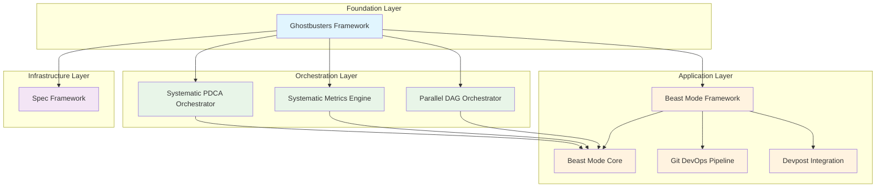

# Specification Dependency Graph

## Current Dependency Architecture

## Dependency Validation Rules

### ✅ DAG Compliance
- All dependencies form a Directed Acyclic Graph
- No circular dependencies detected
- Clear hierarchical structure maintained

### ✅ Layer Hierarchy
- **Foundation Layer**: Ghostbusters Framework (no dependencies)
- **Infrastructure Layer**: Spec Framework (depends only on Foundation)
- **Orchestration Layer**: PDCA, Metrics, DAG Orchestrators (depend only on Foundation)
- **Application Layer**: Beast Mode components (depend on Foundation + Orchestration)

### ✅ Service Interface Boundaries
- All dependencies access functionality through published service interfaces
- No direct access to internal implementation details
- Clear API contracts between components

## Dependency Analysis

### Foundation: Ghostbusters Framework
**Role**: Provides core multi-agent orchestration, validation frameworks, and expert agents
**Dependents**: All other specs
**Risk**: Single point of failure - critical to system architecture

### Infrastructure: Spec Framework  
**Role**: Document management, validation, and dependency governance
**Dependencies**: Ghostbusters Framework
**Dependents**: All specs (for document management services)
**Risk**: Low - focused single responsibility

### Orchestration Layer
**PDCA Orchestrator**: Systematic workflow execution
**Metrics Engine**: Performance measurement and superiority demonstration  
**DAG Orchestrator**: Parallel execution and scaling
**Risk**: Medium - critical for systematic operations

### Application Layer
**Beast Mode Framework**: Main application framework
**Beast Mode Core**: Core implementation consuming orchestration services
**Git DevOps Pipeline**: DevOps integration
**Devpost Integration**: Platform integration
**Risk**: Low - leaf nodes in dependency graph

## Conflict Resolution Status

### ✅ Resolved Conflicts
1. **Spec Framework RM Violation**: Reduced from monolithic to focused document management
2. **Circular Dependencies**: Eliminated through clear layer hierarchy
3. **Responsibility Overlap**: Clear service boundaries established
4. **Interface Violations**: Service-only access enforced

### 🔍 Monitoring Points
1. **Beast Mode Core Complexity**: Monitor for potential RM violations as it consumes multiple orchestration services
2. **Ghostbusters Framework Load**: Monitor performance as foundation for all specs
3. **Service Interface Evolution**: Ensure backward compatibility during updates