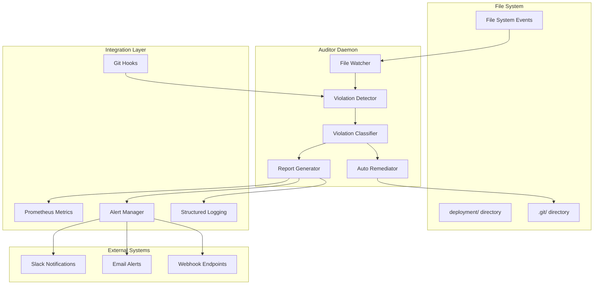
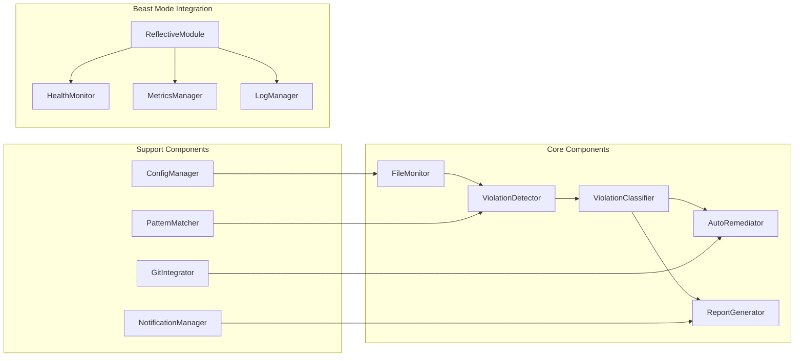

# Design Document

## Overview

The Deployment Data Governance Auditor is a real-time monitoring daemon that continuously watches the repository for violations of deployment data governance rules. The system uses file system monitoring, pattern matching, and automated remediation to prevent volatile data from entering version control.

The auditor is built on the Beast Mode Framework's ReflectiveModule pattern, providing comprehensive observability, health monitoring, and integration with existing infrastructure. It operates as a lightweight daemon that can run continuously during development or be triggered by CI/CD pipelines.

## Architecture

### High-Level Architecture



### Component Architecture



## Components and Interfaces

### 1. FileMonitor Component

**Purpose**: Monitors file system events in deployment directories using efficient OS-specific mechanisms.

**Interface**:
```python
class FileMonitor(ReflectiveModule):
    def start_monitoring(self, paths: List[str]) -> None
    def stop_monitoring(self) -> None
    def register_callback(self, callback: Callable[[FileEvent], None]) -> None
    def get_monitoring_status(self) -> MonitoringStatus
```

**Implementation Details**:
- Uses `watchdog` library for cross-platform file system monitoring
- Implements recursive directory watching with configurable depth limits
- Filters events to reduce noise (ignores temporary files, editor backups)
- Provides event batching to handle high-frequency file operations
- Supports hot-reloading of watch paths without daemon restart

### 2. ViolationDetector Component

**Purpose**: Analyzes file events and paths to identify governance violations using pattern matching.

**Interface**:
```python
class ViolationDetector(ReflectiveModule):
    def detect_violations(self, file_path: str) -> List[Violation]
    def scan_directory(self, directory: str) -> List[Violation]
    def add_pattern(self, pattern: str, severity: Severity) -> None
    def validate_file(self, file_path: str) -> ValidationResult
```

**Pattern Categories**:
- **Database Files**: `*.db`, `*.sqlite*`, `*.sql`, database dumps
- **Time-Series Data**: `*prometheus-data*`, `*grafana-data*`, `*influxdb-data*`
- **Log Files**: `*.log`, `logs/`, `log/`, rotated logs
- **Cache/Temp**: `cache/`, `tmp/`, `temp/`, `*.cache`
- **Runtime State**: `*.pid`, `*.sock`, `*.lock`, `run/`
- **Binary Executables**: Downloaded binaries, compiled artifacts
- **Plugin Data**: `plugins/`, `extensions/`, `node_modules/`

### 3. ViolationClassifier Component

**Purpose**: Classifies detected violations by severity and provides specific remediation guidance.

**Interface**:
```python
class ViolationClassifier(ReflectiveModule):
    def classify_violation(self, violation: Violation) -> ClassifiedViolation
    def get_remediation_steps(self, violation: ClassifiedViolation) -> List[RemediationStep]
    def calculate_risk_score(self, violations: List[Violation]) -> RiskScore
```

**Severity Levels**:
- **CRITICAL**: Database files with potential credentials, production data
- **HIGH**: Time-series data, binary executables, large data files
- **MEDIUM**: Log files, cache data, temporary files
- **LOW**: Editor backups, system metadata files

### 4. AutoRemediator Component

**Purpose**: Automatically fixes violations through .gitignore updates, file quarantine, and git integration.

**Interface**:
```python
class AutoRemediator(ReflectiveModule):
    def remediate_violation(self, violation: ClassifiedViolation) -> RemediationResult
    def update_gitignore(self, patterns: List[str]) -> bool
    def quarantine_file(self, file_path: str) -> QuarantineResult
    def suggest_docker_volume(self, violation: Violation) -> VolumeConfig
```

**Remediation Actions**:
- **Immediate**: Add to .gitignore, remove from git tracking
- **Quarantine**: Move files to quarantine directory with metadata
- **Docker Integration**: Generate volume configuration suggestions
- **Git Cleanup**: Remove files from git history if already committed

### 5. ReportGenerator Component

**Purpose**: Generates comprehensive reports, metrics, and notifications for violations and system health.

**Interface**:
```python
class ReportGenerator(ReflectiveModule):
    def generate_violation_report(self, violations: List[Violation]) -> Report
    def create_compliance_summary(self) -> ComplianceSummary
    def export_metrics(self) -> PrometheusMetrics
    def send_notifications(self, report: Report) -> NotificationResult
```

**Report Types**:
- **Real-time Alerts**: Immediate notifications for critical violations
- **Daily Summaries**: Compliance status and violation trends
- **Weekly Reports**: Detailed analysis and remediation recommendations
- **Emergency Reports**: Mass violation detection and response procedures

## Data Models

### Core Data Structures

```python
@dataclass
class FileEvent:
    event_type: EventType  # CREATED, MODIFIED, DELETED, MOVED
    file_path: str
    timestamp: datetime
    file_size: int
    file_hash: Optional[str]

@dataclass
class Violation:
    file_path: str
    pattern_matched: str
    violation_type: ViolationType
    detected_at: datetime
    file_metadata: FileMetadata

@dataclass
class ClassifiedViolation:
    violation: Violation
    severity: Severity
    risk_score: int
    remediation_steps: List[RemediationStep]
    estimated_impact: ImpactAssessment

@dataclass
class RemediationResult:
    violation_id: str
    actions_taken: List[RemediationAction]
    success: bool
    error_message: Optional[str]
    follow_up_required: bool

@dataclass
class ComplianceReport:
    scan_timestamp: datetime
    total_files_scanned: int
    violations_found: int
    violations_by_severity: Dict[Severity, int]
    remediation_summary: RemediationSummary
    recommendations: List[str]
```

### Configuration Schema

```yaml
# deployment-auditor-config.yml
monitoring:
  watch_paths:
    - "deployment/"
  excluded_paths:
    - "deployment/docs/"
  scan_interval: 60  # seconds
  
patterns:
  database_files:
    patterns: ["*.db", "*.sqlite*", "*.sql"]
    severity: "CRITICAL"
  
  time_series_data:
    patterns: ["*prometheus-data*", "*grafana-data*"]
    severity: "HIGH"
    
  log_files:
    patterns: ["*.log", "logs/", "log/"]
    severity: "MEDIUM"

remediation:
  auto_gitignore: true
  auto_quarantine: true
  git_integration: true
  
notifications:
  slack:
    webhook_url: "${SLACK_WEBHOOK_URL}"
    channels: ["#devops-alerts"]
  
  email:
    smtp_server: "${SMTP_SERVER}"
    recipients: ["security@company.com"]
    
prometheus:
  enabled: true
  port: 9090
  metrics_prefix: "deployment_auditor_"
```

## Error Handling

### Error Categories and Responses

1. **File System Errors**
   - Permission denied: Log warning, continue monitoring other paths
   - Path not found: Remove from watch list, notify configuration issue
   - Disk full: Alert critical, suggest cleanup procedures

2. **Git Integration Errors**
   - Git not available: Disable git features, continue file monitoring
   - Repository corruption: Alert critical, suggest repository recovery
   - Merge conflicts: Provide manual resolution guidance

3. **Configuration Errors**
   - Invalid patterns: Log error, use default patterns
   - Missing credentials: Disable affected notification channels
   - Network failures: Retry with exponential backoff

4. **Performance Issues**
   - High CPU usage: Throttle monitoring frequency
   - Memory pressure: Implement event batching and cleanup
   - Disk I/O saturation: Reduce scan frequency

### Graceful Degradation Strategy

```python
class GracefulDegradation:
    def handle_file_system_error(self, error: FileSystemError) -> None:
        if error.type == "permission_denied":
            self.log_warning(f"Cannot access {error.path}, continuing with other paths")
            self.remove_watch_path(error.path)
        elif error.type == "disk_full":
            self.alert_critical("Disk full - cleanup required")
            self.reduce_monitoring_frequency()
    
    def handle_git_error(self, error: GitError) -> None:
        if error.type == "git_not_found":
            self.disable_git_integration()
            self.log_warning("Git not available, continuing with file monitoring only")
        elif error.type == "repository_corrupt":
            self.alert_critical("Repository corruption detected")
            self.suggest_recovery_procedures()
```

## Testing Strategy

### Unit Testing Approach

1. **Component Isolation**: Each component tested independently with mocked dependencies
2. **Pattern Matching**: Comprehensive test cases for all violation patterns
3. **Error Scenarios**: Test all error conditions and graceful degradation
4. **Configuration Validation**: Test all configuration combinations and edge cases

### Integration Testing

1. **File System Integration**: Test with real file operations and monitoring
2. **Git Workflow**: Test pre-commit hooks and git integration
3. **Notification Systems**: Test alert delivery to all configured channels
4. **Performance Testing**: Validate resource usage under various load conditions

### End-to-End Testing

```python
class E2ETestScenarios:
    def test_critical_violation_workflow(self):
        # Create database file in deployment directory
        # Verify immediate detection and classification
        # Confirm auto-remediation actions
        # Validate notifications sent
        # Check compliance report generation
        
    def test_mass_violation_emergency(self):
        # Create multiple violation files simultaneously
        # Verify emergency response procedures
        # Confirm batch remediation
        # Validate escalation notifications
        
    def test_git_integration_workflow(self):
        # Stage files with violations
        # Attempt git commit
        # Verify commit blocked with clear messages
        # Fix violations and retry commit
        # Confirm successful commit after remediation
```

### Performance Benchmarks

- **File Detection Latency**: < 1 second for file creation events
- **CPU Usage**: < 5% average during normal operation
- **Memory Usage**: < 50MB steady state
- **Scan Performance**: > 1000 files/second for baseline scans
- **Notification Latency**: < 5 seconds for critical alerts

## Security Considerations

### Data Protection
- **No Credential Storage**: All sensitive configuration via environment variables
- **Secure Logging**: Sanitize file paths and content from logs
- **Access Control**: Minimal file system permissions required
- **Audit Trail**: Complete logging of all remediation actions

### Threat Model
- **Malicious Files**: Detect and quarantine potentially harmful files
- **Data Exfiltration**: Prevent sensitive data from entering version control
- **Configuration Tampering**: Validate configuration integrity
- **Privilege Escalation**: Run with minimal required permissions

## Deployment and Operations

### Installation Requirements
- Python 3.9+ with required dependencies
- Git repository with write access
- File system monitoring permissions
- Network access for notifications (optional)

### Operational Modes
1. **Development Mode**: Continuous monitoring during development
2. **CI/CD Mode**: Triggered scans during build pipelines
3. **Audit Mode**: Scheduled compliance scans
4. **Emergency Mode**: Immediate response to mass violations

### Monitoring and Observability
- **Health Endpoints**: `/health`, `/ready`, `/metrics`
- **Prometheus Metrics**: Violation counts, scan performance, system health
- **Structured Logging**: JSON logs with correlation IDs
- **Alert Integration**: Grafana dashboards and alerting rules

This design provides a comprehensive, production-ready solution for preventing deployment data governance violations while integrating seamlessly with existing Beast Mode Framework infrastructure.