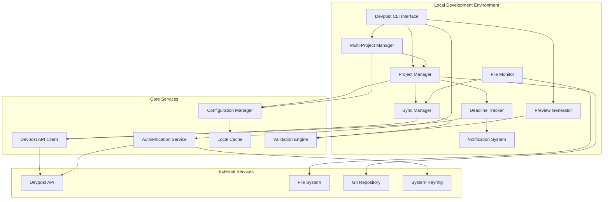
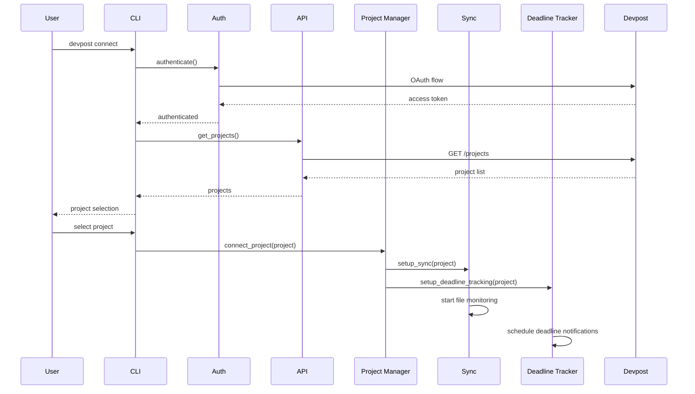

# Design Document

## Overview

The Devpost Hackathon Integration system provides seamless synchronization between local development projects and Devpost hackathon submissions. The system follows a modular architecture that integrates with the existing Beast Mode framework, providing authentication, project management, file monitoring, automated synchronization, deadline tracking, and multi-project management capabilities.

**🎯 Core Marketing Philosophy: "The Requirements ARE the Solution"**

This integration embodies our systematic approach where comprehensive requirements definition becomes the solution architecture itself. Every acceptance criterion transforms into a validation gate, every user story becomes a success metric, and every specification becomes the implementation blueprint. We don't just build tools - we systematically define what success looks like, then deliver exactly that.

The design leverages the existing Beast Mode infrastructure for configuration management, logging, and error handling while introducing new components specifically for Devpost API integration, hackathon project lifecycle management, real-time preview generation, and notification systems. The architecture supports both single and multi-project workflows, enabling developers to participate in multiple hackathons simultaneously while maintaining proper project isolation and context switching.

### Empathetic Marketing Strategy

**🎯 Core Principle: "Make Them Feel Safer, More Confident"**

**Primary Message**: "The Requirements ARE the Solution"
- **Emotional Appeal**: "You already know what good looks like - we help you achieve it systematically"
- **Confidence Building**: "Clear requirements give you a confident path to hackathon success"
- **Supportive Tone**: "We're here to amplify your skills, not point out what's missing"

**Empowering Narratives**:
- **"You've Got This"**: Systematic approaches amplify your existing hackathon skills
- **"Clear Path Forward"**: Requirements provide confidence and direction for your submission
- **"Collaborative Success"**: Everyone wins when we work systematically together
- **"It Just Works"**: Steve Jobs-level reliability gives you peace of mind during crunch time
- **"Smart Choices"**: Increase your odds of hackathon success without the stress
- **"Less Struggle, More Success"**: Systematic prevention of common hackathon frustrations

**Supportive Positioning** (No Shark-Infested Waters):
- **vs. Hackathon Chaos**: "Bring clarity and confidence to your hackathon workflow"
- **vs. Last-Minute Panic**: "Know exactly what your submission needs before the deadline"
- **vs. Solo Struggle**: "Join a community that believes in systematic collaboration"

## Architecture

### High-Level Architecture



### Component Interaction Flow



## Components and Interfaces

### 1. Devpost API Client

**Purpose:** Handles all communication with the Devpost API

**Key Methods:**
- `authenticate(credentials: DevpostCredentials) -> AuthToken`
- `get_user_projects() -> List[DevpostProject]`
- `get_project_details(project_id: str) -> DevpostProject`
- `update_project(project_id: str, updates: ProjectUpdate) -> bool`
- `upload_media(project_id: str, media: MediaFile) -> MediaUploadResult`
- `create_project(hackathon_id: str, project_data: ProjectData) -> DevpostProject`

**Interface:**
```python
class DevpostAPIClient:
    def __init__(self, auth_service: AuthenticationService):
        self.auth = auth_service
        self.base_url = "https://devpost.com/api/v2"
        self.session = self._create_session()
    
    async def get_projects(self) -> List[DevpostProject]:
        """Retrieve user's hackathon projects"""
        
    async def update_project_metadata(
        self, 
        project_id: str, 
        metadata: ProjectMetadata
    ) -> UpdateResult:
        """Update project information on Devpost"""
```

### 2. Authentication Service

**Purpose:** Manages Devpost authentication and token lifecycle

**Key Methods:**
- `authenticate() -> AuthResult`
- `refresh_token() -> AuthToken`
- `is_authenticated() -> bool`
- `get_current_token() -> Optional[AuthToken]`

**Interface:**
```python
class DevpostAuthService:
    def __init__(self, config_manager: ConfigManager):
        self.config = config_manager
        self.token_cache = TokenCache()
    
    async def authenticate(self, credentials: DevpostCredentials) -> AuthResult:
        """Handle OAuth flow or API key authentication"""
        
    def is_token_valid(self) -> bool:
        """Check if current token is valid and not expired"""
```

### 3. Project Manager

**Purpose:** Manages local project configuration and Devpost mapping

**Key Methods:**
- `connect_project(devpost_project: DevpostProject) -> ProjectConnection`
- `get_project_config() -> ProjectConfig`
- `update_local_config(updates: Dict) -> bool`
- `get_sync_status() -> SyncStatus`

**Interface:**
```python
class DevpostProjectManager:
    def __init__(self, config_path: Path):
        self.config_path = config_path
        self.project_config = self._load_config()
    
    def connect_to_devpost(
        self, 
        project_id: str, 
        hackathon_id: str
    ) -> ConnectionResult:
        """Establish connection between local project and Devpost submission"""
        
    def get_project_metadata(self) -> ProjectMetadata:
        """Extract project metadata from local files"""
```

### 4. File Monitor

**Purpose:** Monitors project files for changes and triggers sync operations

**Key Methods:**
- `start_monitoring() -> None`
- `stop_monitoring() -> None`
- `add_watch_path(path: Path) -> None`
- `get_change_events() -> List[FileChangeEvent]`

**Interface:**
```python
class ProjectFileMonitor:
    def __init__(self, project_path: Path, sync_manager: SyncManager):
        self.project_path = project_path
        self.sync_manager = sync_manager
        self.watched_patterns = self._get_watch_patterns()
    
    def start_monitoring(self) -> None:
        """Begin monitoring project files for changes"""
        
    def handle_file_change(self, event: FileChangeEvent) -> None:
        """Process file change and trigger appropriate sync"""
```

### 5. Sync Manager

**Purpose:** Orchestrates synchronization between local project and Devpost

**Key Methods:**
- `sync_project_metadata() -> SyncResult`
- `sync_media_files() -> SyncResult`
- `sync_documentation() -> SyncResult`
- `full_sync() -> SyncResult`

**Interface:**
```python
class DevpostSyncManager:
    def __init__(
        self, 
        api_client: DevpostAPIClient,
        project_manager: DevpostProjectManager
    ):
        self.api = api_client
        self.project = project_manager
        self.sync_queue = SyncQueue()
    
    async def sync_changes(self, changes: List[FileChangeEvent]) -> SyncResult:
        """Synchronize detected changes to Devpost"""
        
    def queue_sync_operation(self, operation: SyncOperation) -> None:
        """Add sync operation to queue for processing"""
```

### 6. Preview Generator

**Purpose:** Generates local preview of how project will appear on Devpost with real-time updates

**Key Methods:**
- `generate_preview() -> PreviewResult`
- `validate_required_fields() -> ValidationResult`
- `export_preview_html() -> Path`
- `update_preview_realtime(changes: List[FileChangeEvent]) -> None`
- `highlight_missing_fields() -> List[ValidationError]`

**Interface:**
```python
class DevpostPreviewGenerator:
    def __init__(self, project_manager: DevpostProjectManager):
        self.project = project_manager
        self.template_engine = Jinja2Environment()
        self.validation_engine = ValidationEngine()
    
    def generate_preview(self) -> PreviewData:
        """Generate preview matching Devpost's display format"""
        
    def validate_submission(self) -> ValidationResult:
        """Validate project meets Devpost requirements"""
        
    def update_preview_realtime(self, changes: List[FileChangeEvent]) -> PreviewData:
        """Update preview when project files change"""
        
    def highlight_formatting_issues(self) -> List[FormattingIssue]:
        """Identify and highlight formatting problems"""
```

### 7. Deadline Tracker

**Purpose:** Monitors hackathon deadlines and manages notification scheduling

**Key Methods:**
- `setup_deadline_tracking(project: DevpostProject) -> None`
- `get_upcoming_deadlines() -> List[Deadline]`
- `schedule_notifications(deadline: Deadline) -> None`
- `check_submission_requirements() -> RequirementStatus`

**Interface:**
```python
class DeadlineTracker:
    def __init__(self, api_client: DevpostAPIClient, notification_service: NotificationService):
        self.api = api_client
        self.notifications = notification_service
        self.scheduler = BackgroundScheduler()
    
    def setup_deadline_tracking(self, project: DevpostProject) -> None:
        """Initialize deadline monitoring for a project"""
        
    def check_submission_completeness(self, project_id: str) -> CompletionStatus:
        """Verify if submission meets all requirements"""
        
    def notify_deadline_approaching(self, project_id: str, deadline: Deadline) -> None:
        """Send notifications for approaching deadlines"""
```

### 8. Multi-Project Manager

**Purpose:** Manages multiple hackathon projects with proper context switching and isolation

**Key Methods:**
- `list_projects() -> List[ProjectSummary]`
- `switch_project(project_id: str) -> SwitchResult`
- `get_active_project() -> Optional[DevpostProject]`
- `resolve_project_conflicts() -> ConflictResolution`

**Interface:**
```python
class MultiProjectManager:
    def __init__(self, config_manager: ConfigManager):
        self.config = config_manager
        self.active_project = None
        self.project_contexts = {}
    
    def switch_project_context(self, project_id: str) -> ContextSwitchResult:
        """Switch between different hackathon projects"""
        
    def prevent_cross_contamination(self, operation: SyncOperation) -> bool:
        """Ensure operations only affect the intended project"""
        
    def display_project_dashboard() -> ProjectDashboard:
        """Show status of all configured projects"""
```

### 9. Notification System

**Purpose:** Delivers deadline reminders and status notifications to users

**Key Methods:**
- `send_desktop_notification(message: NotificationMessage) -> None`
- `schedule_reminder(deadline: Deadline, advance_time: timedelta) -> None`
- `notify_sync_status(status: SyncStatus) -> None`

**Interface:**
```python
class NotificationSystem:
    def __init__(self, config: NotificationConfig):
        self.config = config
        self.desktop_notifier = DesktopNotifier()
    
    def send_deadline_reminder(self, project: DevpostProject, deadline: Deadline) -> None:
        """Send deadline reminder notification"""
        
    def notify_submission_status_change(self, project_id: str, status: SubmissionStatus) -> None:
        """Notify when submission status changes"""
```

## Data Models

### Core Data Models

```python
@dataclass
class DevpostProject:
    id: str
    title: str
    tagline: str
    description: str
    hackathon_id: str
    hackathon_name: str
    team_members: List[TeamMember]
    tags: List[str]
    links: List[ProjectLink]
    media: List[MediaFile]
    submission_status: SubmissionStatus
    created_at: datetime
    updated_at: datetime
    deadline: Optional[datetime]
    submission_requirements: List[SubmissionRequirement]
    completion_status: CompletionStatus

@dataclass
class ProjectMetadata:
    title: str
    tagline: str
    description: str
    tags: List[str]
    team_members: List[str]
    repository_url: Optional[str]
    demo_url: Optional[str]
    video_url: Optional[str]
    version: Optional[str]
    changelog: Optional[str]

@dataclass
class SyncOperation:
    operation_type: SyncOperationType
    target_field: str
    local_value: Any
    remote_value: Any
    priority: int
    timestamp: datetime
    project_id: str  # For multi-project isolation

@dataclass
class FileChangeEvent:
    file_path: Path
    change_type: ChangeType  # CREATED, MODIFIED, DELETED
    timestamp: datetime
    affects_sync: bool
    content_type: ContentType  # DOCUMENTATION, MEDIA, SOURCE_CODE, RELEASE

@dataclass
class Deadline:
    hackathon_id: str
    project_id: str
    deadline_type: DeadlineType  # SUBMISSION, JUDGING, FINAL
    deadline_time: datetime
    requirements: List[SubmissionRequirement]
    notification_schedule: List[NotificationTiming]

@dataclass
class ProjectSummary:
    project_id: str
    title: str
    hackathon_name: str
    deadline: datetime
    submission_status: SubmissionStatus
    completion_percentage: float
    last_sync: datetime
```

### Configuration Models

```python
@dataclass
class DevpostConfig:
    project_id: str
    hackathon_id: str
    auth_token: Optional[str]
    sync_enabled: bool
    watch_patterns: List[str]
    sync_interval: int
    auto_sync_media: bool
    notification_preferences: NotificationSettings
    deadline_reminders: List[ReminderTiming]
    validation_rules: ValidationRules

@dataclass
class ProjectConnection:
    local_path: Path
    devpost_project_id: str
    hackathon_id: str
    last_sync: datetime
    sync_status: SyncStatus
    configuration: DevpostConfig
    is_active: bool  # For multi-project context switching

@dataclass
class MultiProjectConfig:
    active_project_id: Optional[str]
    project_connections: Dict[str, ProjectConnection]
    global_settings: GlobalSettings
    conflict_resolution_strategy: ConflictResolutionStrategy

@dataclass
class NotificationSettings:
    desktop_notifications: bool
    email_notifications: bool
    deadline_advance_times: List[timedelta]  # e.g., [7 days, 1 day, 1 hour]
    sync_failure_notifications: bool
    submission_status_notifications: bool

@dataclass
class ValidationRules:
    required_fields: List[str]
    min_description_length: int
    required_media_types: List[MediaType]
    team_member_validation: bool
    link_validation: bool
```

## Error Handling

### Error Categories

1. **Authentication Errors**
   - Invalid credentials
   - Expired tokens
   - Rate limiting
   - API access denied

2. **Sync Errors**
   - Network connectivity issues
   - File access permissions
   - Validation failures
   - Conflict resolution
   - Cross-project contamination

3. **Configuration Errors**
   - Invalid project mapping
   - Missing required fields
   - Malformed configuration files
   - Multi-project conflicts

4. **Deadline and Notification Errors**
   - Failed deadline retrieval
   - Notification delivery failures
   - Invalid reminder scheduling
   - Submission requirement changes

5. **Preview and Validation Errors**
   - Template rendering failures
   - Missing required submission fields
   - Formatting validation errors
   - Real-time update failures

### Error Handling Strategy

```python
class DevpostError(Exception):
    """Base exception for Devpost integration errors"""
    pass

class AuthenticationError(DevpostError):
    """Authentication-related errors"""
    pass

class SyncError(DevpostError):
    """Synchronization-related errors"""
    pass

class ValidationError(DevpostError):
    """Data validation errors"""
    pass

class DeadlineError(DevpostError):
    """Deadline tracking and notification errors"""
    pass

class PreviewError(DevpostError):
    """Preview generation and validation errors"""
    pass

class MultiProjectError(DevpostError):
    """Multi-project management errors"""
    pass

# Error handling with retry logic and user-friendly messaging
class ErrorHandler:
    def __init__(self):
        self.retry_strategies = {
            AuthenticationError: self._handle_auth_error,
            SyncError: self._handle_sync_error,
            ValidationError: self._handle_validation_error,
            DeadlineError: self._handle_deadline_error,
            PreviewError: self._handle_preview_error,
            MultiProjectError: self._handle_multiproject_error
        }
    
    async def handle_error(self, error: Exception) -> ErrorResult:
        """Handle errors with appropriate retry and recovery strategies"""
        
    def generate_user_friendly_message(self, error: Exception) -> str:
        """Convert technical errors into actionable user messages"""
        
    def suggest_resolution_steps(self, error: Exception) -> List[str]:
        """Provide specific steps to resolve the error"""
```

## Design Decisions and Rationale

### Multi-Project Architecture Decision

**Decision:** Implement a centralized Multi-Project Manager with context switching rather than separate instances per project.

**Rationale:** Requirement 6 demands efficient management of multiple hackathon projects simultaneously. A centralized approach prevents resource duplication, enables shared authentication tokens, and provides a unified interface for project switching. The context isolation prevents cross-contamination (Requirement 6.3) while maintaining performance.

### Real-Time Preview Updates Decision

**Decision:** Implement file-change-triggered preview regeneration with debouncing rather than periodic updates.

**Rationale:** Requirement 5.4 specifies real-time preview updates when changes are made. Event-driven updates provide immediate feedback while debouncing prevents excessive regeneration during rapid file changes, optimizing performance without sacrificing responsiveness.

### Deadline Notification Architecture Decision

**Decision:** Use a background scheduler with configurable advance notification times rather than polling-based checks.

**Rationale:** Requirement 4.2 requires proactive deadline notifications. A scheduler-based approach ensures reliable delivery without continuous resource consumption. Configurable timing (7 days, 1 day, 1 hour) accommodates different user preferences and hackathon timelines.

### Validation Engine Separation Decision

**Decision:** Create a dedicated ValidationEngine component used by both Sync Manager and Preview Generator.

**Rationale:** Requirements 3.2, 3.5, and 5.3 all involve validation of Devpost requirements. Centralizing validation logic ensures consistency across components, reduces code duplication, and enables unified error messaging for validation failures.

### Authentication Token Storage Decision

**Decision:** Use system keyring for secure token storage with fallback to encrypted local storage.

**Rationale:** Requirement 1.1 involves OAuth authentication with sensitive tokens. System keyring provides OS-level security while encrypted fallback ensures functionality across different environments. This approach balances security with usability.

### File Change Detection Strategy Decision

**Decision:** Implement content-based change detection with configurable file patterns rather than timestamp-only monitoring.

**Rationale:** Requirement 2.1 requires detection of "significant changes" in project files. Content analysis enables intelligent filtering of meaningful changes (documentation updates, new releases) versus trivial modifications (temporary files, build artifacts), reducing unnecessary sync operations.

## Testing Strategy

### Unit Testing

1. **API Client Testing**
   - Mock Devpost API responses
   - Test authentication flows
   - Validate request/response handling
   - Error condition testing
   - Rate limiting behavior

2. **Sync Manager Testing**
   - File change detection
   - Sync operation queuing
   - Conflict resolution
   - Retry mechanisms
   - Multi-project isolation

3. **Project Manager Testing**
   - Configuration management
   - Project metadata extraction
   - Local file operations
   - Multi-project context switching

4. **Deadline Tracker Testing**
   - Deadline retrieval and parsing
   - Notification scheduling
   - Requirement validation
   - Background task management

5. **Preview Generator Testing**
   - Template rendering accuracy
   - Real-time update mechanisms
   - Validation error highlighting
   - Missing field detection

6. **Multi-Project Manager Testing**
   - Project context isolation
   - Configuration separation
   - Conflict detection and resolution
   - Dashboard generation

### Integration Testing

1. **End-to-End Workflows**
   - Complete project connection flow
   - Full synchronization cycles
   - Multi-project management
   - Error recovery scenarios
   - Deadline notification delivery
   - Real-time preview updates

2. **API Integration Testing**
   - Real Devpost API interactions (with test account)
   - Authentication flow validation
   - Rate limiting behavior
   - Network failure handling
   - Deadline data retrieval
   - Submission status updates

3. **Multi-Project Integration Testing**
   - Concurrent project operations
   - Context switching validation
   - Cross-contamination prevention
   - Shared resource management

### Test Data Management

```python
# Test fixtures for consistent testing
@pytest.fixture
def mock_devpost_project():
    return DevpostProject(
        id="test-project-123",
        title="Test Hackathon Project",
        tagline="A test project for integration testing",
        description="Detailed description of test project",
        hackathon_id="hackathon-456",
        hackathon_name="Test Hackathon 2025",
        team_members=[],
        tags=["python", "ai", "testing"],
        links=[],
        media=[],
        submission_status=SubmissionStatus.DRAFT,
        created_at=datetime.now(),
        updated_at=datetime.now(),
        deadline=datetime.now() + timedelta(days=7)
    )

@pytest.fixture
def mock_api_client():
    client = Mock(spec=DevpostAPIClient)
    client.get_projects.return_value = [mock_devpost_project()]
    return client
```

### Performance Testing

1. **File Monitoring Performance**
   - Large project directory handling
   - High-frequency file changes
   - Memory usage optimization
   - Real-time preview update latency

2. **Sync Performance**
   - Batch operation efficiency
   - Large file upload handling
   - Concurrent sync operations
   - Multi-project sync isolation

3. **API Rate Limiting**
   - Request throttling behavior
   - Queue management under load
   - Graceful degradation
   - Deadline polling optimization

4. **Notification System Performance**
   - Background scheduler efficiency
   - Notification delivery latency
   - Resource usage during idle periods
   - Scalability with multiple projects

5. **Preview Generation Performance**
   - Template rendering speed
   - Real-time update responsiveness
   - Memory usage with large projects
   - Concurrent preview generation