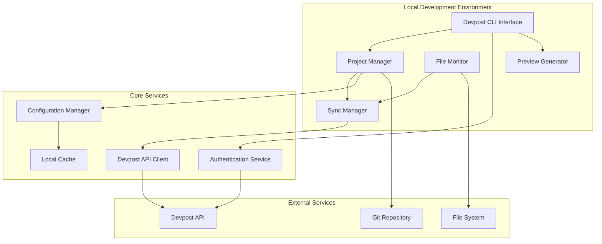
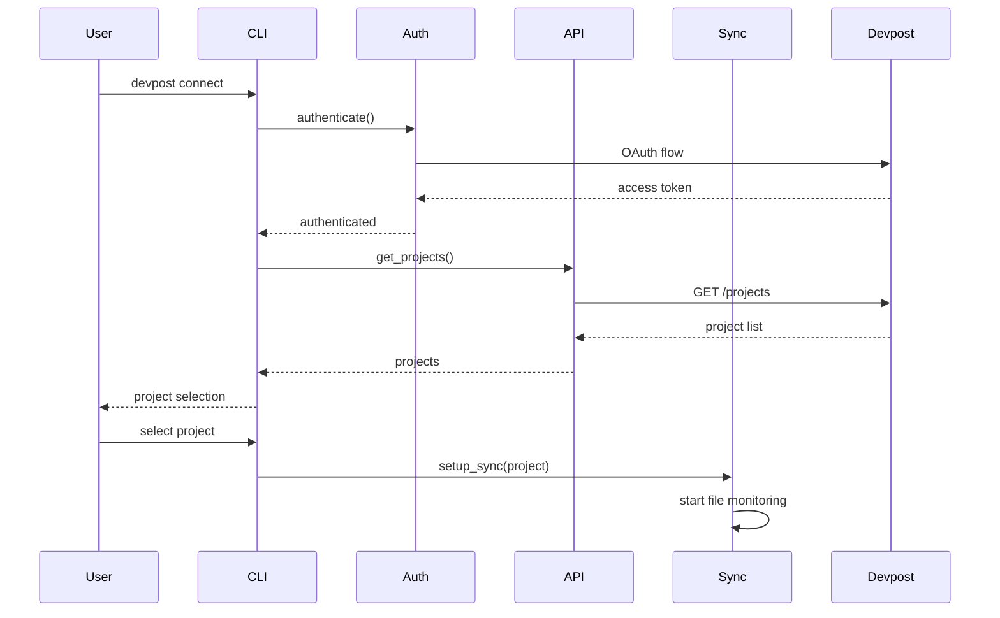

# Design Document

## Overview

The Devpost Hackathon Integration system provides seamless synchronization between local development projects and Devpost hackathon submissions. The system follows a modular architecture that integrates with the existing Beast Mode framework, providing authentication, project management, file monitoring, and automated synchronization capabilities.

The design leverages the existing Beast Mode infrastructure for configuration management, logging, and error handling while introducing new components specifically for Devpost API integration and hackathon project lifecycle management.

## Architecture

### High-Level Architecture



### Component Interaction Flow



## Components and Interfaces

### 1. Devpost API Client

**Purpose:** Handles all communication with the Devpost API

**Key Methods:**
- `authenticate(credentials: DevpostCredentials) -> AuthToken`
- `get_user_projects() -> List[DevpostProject]`
- `get_project_details(project_id: str) -> DevpostProject`
- `update_project(project_id: str, updates: ProjectUpdate) -> bool`
- `upload_media(project_id: str, media: MediaFile) -> MediaUploadResult`
- `create_project(hackathon_id: str, project_data: ProjectData) -> DevpostProject`

**Interface:**
```python
class DevpostAPIClient:
    def __init__(self, auth_service: AuthenticationService):
        self.auth = auth_service
        self.base_url = "https://devpost.com/api/v2"
        self.session = self._create_session()
    
    async def get_projects(self) -> List[DevpostProject]:
        """Retrieve user's hackathon projects"""
        
    async def update_project_metadata(
        self, 
        project_id: str, 
        metadata: ProjectMetadata
    ) -> UpdateResult:
        """Update project information on Devpost"""
```

### 2. Authentication Service

**Purpose:** Manages Devpost authentication and token lifecycle

**Key Methods:**
- `authenticate() -> AuthResult`
- `refresh_token() -> AuthToken`
- `is_authenticated() -> bool`
- `get_current_token() -> Optional[AuthToken]`

**Interface:**
```python
class DevpostAuthService:
    def __init__(self, config_manager: ConfigManager):
        self.config = config_manager
        self.token_cache = TokenCache()
    
    async def authenticate(self, credentials: DevpostCredentials) -> AuthResult:
        """Handle OAuth flow or API key authentication"""
        
    def is_token_valid(self) -> bool:
        """Check if current token is valid and not expired"""
```

### 3. Project Manager

**Purpose:** Manages local project configuration and Devpost mapping

**Key Methods:**
- `connect_project(devpost_project: DevpostProject) -> ProjectConnection`
- `get_project_config() -> ProjectConfig`
- `update_local_config(updates: Dict) -> bool`
- `get_sync_status() -> SyncStatus`

**Interface:**
```python
class DevpostProjectManager:
    def __init__(self, config_path: Path):
        self.config_path = config_path
        self.project_config = self._load_config()
    
    def connect_to_devpost(
        self, 
        project_id: str, 
        hackathon_id: str
    ) -> ConnectionResult:
        """Establish connection between local project and Devpost submission"""
        
    def get_project_metadata(self) -> ProjectMetadata:
        """Extract project metadata from local files"""
```

### 4. File Monitor

**Purpose:** Monitors project files for changes and triggers sync operations

**Key Methods:**
- `start_monitoring() -> None`
- `stop_monitoring() -> None`
- `add_watch_path(path: Path) -> None`
- `get_change_events() -> List[FileChangeEvent]`

**Interface:**
```python
class ProjectFileMonitor:
    def __init__(self, project_path: Path, sync_manager: SyncManager):
        self.project_path = project_path
        self.sync_manager = sync_manager
        self.watched_patterns = self._get_watch_patterns()
    
    def start_monitoring(self) -> None:
        """Begin monitoring project files for changes"""
        
    def handle_file_change(self, event: FileChangeEvent) -> None:
        """Process file change and trigger appropriate sync"""
```

### 5. Sync Manager

**Purpose:** Orchestrates synchronization between local project and Devpost

**Key Methods:**
- `sync_project_metadata() -> SyncResult`
- `sync_media_files() -> SyncResult`
- `sync_documentation() -> SyncResult`
- `full_sync() -> SyncResult`

**Interface:**
```python
class DevpostSyncManager:
    def __init__(
        self, 
        api_client: DevpostAPIClient,
        project_manager: DevpostProjectManager
    ):
        self.api = api_client
        self.project = project_manager
        self.sync_queue = SyncQueue()
    
    async def sync_changes(self, changes: List[FileChangeEvent]) -> SyncResult:
        """Synchronize detected changes to Devpost"""
        
    def queue_sync_operation(self, operation: SyncOperation) -> None:
        """Add sync operation to queue for processing"""
```

### 6. Preview Generator

**Purpose:** Generates local preview of how project will appear on Devpost

**Key Methods:**
- `generate_preview() -> PreviewResult`
- `validate_required_fields() -> ValidationResult`
- `export_preview_html() -> Path`

**Interface:**
```python
class DevpostPreviewGenerator:
    def __init__(self, project_manager: DevpostProjectManager):
        self.project = project_manager
        self.template_engine = Jinja2Environment()
    
    def generate_preview(self) -> PreviewData:
        """Generate preview matching Devpost's display format"""
        
    def validate_submission(self) -> ValidationResult:
        """Validate project meets Devpost requirements"""
```

## Data Models

### Core Data Models

```python
@dataclass
class DevpostProject:
    id: str
    title: str
    tagline: str
    description: str
    hackathon_id: str
    hackathon_name: str
    team_members: List[TeamMember]
    tags: List[str]
    links: List[ProjectLink]
    media: List[MediaFile]
    submission_status: SubmissionStatus
    created_at: datetime
    updated_at: datetime
    deadline: Optional[datetime]

@dataclass
class ProjectMetadata:
    title: str
    tagline: str
    description: str
    tags: List[str]
    team_members: List[str]
    repository_url: Optional[str]
    demo_url: Optional[str]
    video_url: Optional[str]

@dataclass
class SyncOperation:
    operation_type: SyncOperationType
    target_field: str
    local_value: Any
    remote_value: Any
    priority: int
    timestamp: datetime

@dataclass
class FileChangeEvent:
    file_path: Path
    change_type: ChangeType  # CREATED, MODIFIED, DELETED
    timestamp: datetime
    affects_sync: bool
```

### Configuration Models

```python
@dataclass
class DevpostConfig:
    project_id: str
    hackathon_id: str
    auth_token: Optional[str]
    sync_enabled: bool
    watch_patterns: List[str]
    sync_interval: int
    auto_sync_media: bool
    notification_preferences: NotificationSettings

@dataclass
class ProjectConnection:
    local_path: Path
    devpost_project_id: str
    hackathon_id: str
    last_sync: datetime
    sync_status: SyncStatus
    configuration: DevpostConfig
```

## Error Handling

### Error Categories

1. **Authentication Errors**
   - Invalid credentials
   - Expired tokens
   - Rate limiting
   - API access denied

2. **Sync Errors**
   - Network connectivity issues
   - File access permissions
   - Validation failures
   - Conflict resolution

3. **Configuration Errors**
   - Invalid project mapping
   - Missing required fields
   - Malformed configuration files

### Error Handling Strategy

```python
class DevpostError(Exception):
    """Base exception for Devpost integration errors"""
    pass

class AuthenticationError(DevpostError):
    """Authentication-related errors"""
    pass

class SyncError(DevpostError):
    """Synchronization-related errors"""
    pass

class ValidationError(DevpostError):
    """Data validation errors"""
    pass

# Error handling with retry logic
class ErrorHandler:
    def __init__(self):
        self.retry_strategies = {
            AuthenticationError: self._handle_auth_error,
            SyncError: self._handle_sync_error,
            ValidationError: self._handle_validation_error
        }
    
    async def handle_error(self, error: Exception) -> ErrorResult:
        """Handle errors with appropriate retry and recovery strategies"""
```

## Testing Strategy

### Unit Testing

1. **API Client Testing**
   - Mock Devpost API responses
   - Test authentication flows
   - Validate request/response handling
   - Error condition testing

2. **Sync Manager Testing**
   - File change detection
   - Sync operation queuing
   - Conflict resolution
   - Retry mechanisms

3. **Project Manager Testing**
   - Configuration management
   - Project metadata extraction
   - Local file operations

### Integration Testing

1. **End-to-End Workflows**
   - Complete project connection flow
   - Full synchronization cycles
   - Multi-project management
   - Error recovery scenarios

2. **API Integration Testing**
   - Real Devpost API interactions (with test account)
   - Authentication flow validation
   - Rate limiting behavior
   - Network failure handling

### Test Data Management

```python
# Test fixtures for consistent testing
@pytest.fixture
def mock_devpost_project():
    return DevpostProject(
        id="test-project-123",
        title="Test Hackathon Project",
        tagline="A test project for integration testing",
        description="Detailed description of test project",
        hackathon_id="hackathon-456",
        hackathon_name="Test Hackathon 2025",
        team_members=[],
        tags=["python", "ai", "testing"],
        links=[],
        media=[],
        submission_status=SubmissionStatus.DRAFT,
        created_at=datetime.now(),
        updated_at=datetime.now(),
        deadline=datetime.now() + timedelta(days=7)
    )

@pytest.fixture
def mock_api_client():
    client = Mock(spec=DevpostAPIClient)
    client.get_projects.return_value = [mock_devpost_project()]
    return client
```

### Performance Testing

1. **File Monitoring Performance**
   - Large project directory handling
   - High-frequency file changes
   - Memory usage optimization

2. **Sync Performance**
   - Batch operation efficiency
   - Large file upload handling
   - Concurrent sync operations

3. **API Rate Limiting**
   - Request throttling behavior
   - Queue management under load
   - Graceful degradation