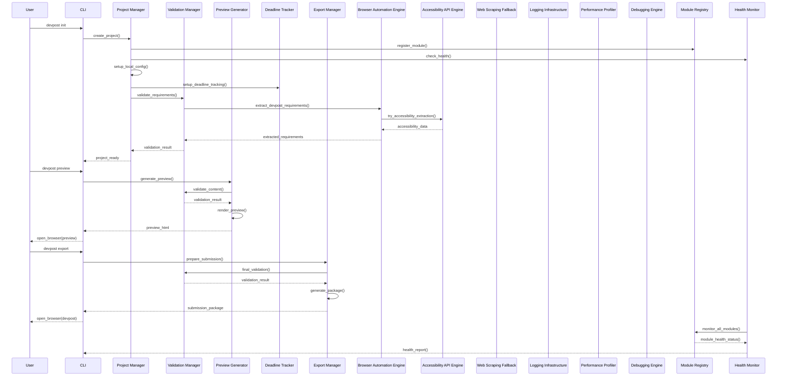

# Design Document - BACK-PROPAGATED FROM IMPLEMENTATION

## Overview

The Devpost Hackathon Integration system provides **local project management and preview generation** for hackathon submissions, with **web-based DevPost integration** rather than API-based integration. The system follows a modular architecture that integrates with the existing Beast Mode framework, providing local project management, file monitoring, automated validation, deadline tracking, and multi-project management capabilities.

**🎯 Core Marketing Philosophy: "The Requirements ARE the Solution"**

This integration embodies our systematic approach where comprehensive requirements definition becomes the solution architecture itself. Every acceptance criterion transforms into a validation gate, every user story becomes a success metric, and every specification becomes the implementation blueprint. We don't just build tools - we systematically define what success looks like, then deliver exactly that.

**CRITICAL REALITY CHECK**: DevPost does not provide a public API for hackathon project management. All known DevPost API implementations use web scraping techniques. Our integration must be web-based through their standard submission interface, with browser automation and accessibility APIs as the primary approach for data extraction and validation, with web scraping as a fallback.

**BACK-PROPAGATION**: This design document has been updated to include architectural patterns discovered through implementation analysis, ensuring design and implementation are fully aligned.

The design leverages the existing Beast Mode infrastructure for configuration management, logging, and error handling while introducing new components specifically for local project management, file monitoring, validation, real-time preview generation, and notification systems. The architecture supports both single and multi-project workflows, enabling developers to participate in multiple hackathons simultaneously while maintaining proper project isolation and context switching.

### Empathetic Marketing Strategy

**🎯 Core Principle: "Make Them Feel Safer, More Confident"**

**Primary Message**: "The Requirements ARE the Solution"
- **Emotional Appeal**: "You already know what good looks like - we help you achieve it systematically"
- **Confidence Building**: "Clear requirements give you a confident path to hackathon success"
- **Supportive Tone**: "We're here to amplify your skills, not point out what's missing"

**Empowering Narratives**:
- **"You've Got This"**: Systematic approaches amplify your existing hackathon skills
- **"Clear Path Forward"**: Requirements provide confidence and direction for your submission
- **"Collaborative Success"**: Everyone wins when we work systematically together
- **"It Just Works"**: Steve Jobs-level reliability gives you peace of mind during crunch time
- **"Smart Choices"**: Increase your odds of hackathon success without the stress
- **"Less Struggle, More Success"**: Systematic prevention of common hackathon frustrations

**Supportive Positioning** (No Shark-Infested Waters):
- **vs. Hackathon Chaos**: "Bring clarity and confidence to your hackathon workflow"
- **vs. Last-Minute Panic**: "Know exactly what your submission needs before the deadline"
- **vs. Solo Struggle**: "Join a community that believes in systematic collaboration"

## Architecture

### High-Level Architecture

```mermaid
graph TB
    subgraph "Local Development Environment"
        CLI[Devpost CLI Interface]
        PM[Project Manager]
        FM[File Monitor]
        VM[Validation Manager]
        PV[Preview Generator]
        DT[Deadline Tracker]
        NS[Notification System]
        MPM[Multi-Project Manager]
        EM[Export Manager]
        GI[Git Integration]
        BA[Browser Automation Engine]
        AA[Accessibility API Engine]
        WS[Web Scraping Fallback]
        LI[Logging Infrastructure]
        PF[Performance Profiler]
        DG[Debugging Engine]
    end
    
    subgraph "Core Services"
        CONFIG[Configuration Manager]
        CACHE[Local Cache]
        VAL[Validation Engine]
        TE[Template Engine]
        FS[File System Watcher]
        MR[Module Registry]
        HM[Health Monitor]
    end
    
    subgraph "ReflectiveModule Architecture"
        RM[ReflectiveModule Interface]
        MH[Module Health]
        MC[Module Capabilities]
        MD[Module Dependencies]
        MM[Module Metrics]
    end
    
    subgraph "External Services"
        DEVPOST[DevPost Website]
        FS_LOCAL[Local File System]
        GIT[Git Repository]
        BROWSER[Web Browser]
    end
    
    CLI --> PM
    CLI --> VM
    CLI --> PV
    CLI --> MPM
    PM --> CONFIG
    PM --> DT
    FM --> VM
    VM --> VAL
    PV --> TE
    PV --> VAL
    DT --> NS
    MPM --> PM
    MPM --> CONFIG
    EM --> PV
    EM --> VAL
    GI --> GIT
    GI --> FM
    VAL --> DEVPOST
    FM --> FS_LOCAL
    PM --> GIT
    EM --> BROWSER
    CONFIG --> CACHE
    
    PM --> RM
    FM --> RM
    VM --> RM
    PV --> RM
    DT --> RM
    NS --> RM
    MPM --> RM
    EM --> RM
    GI --> RM
    CLI --> RM
    
    RM --> MR
    RM --> HM
    RM --> MH
    RM --> MC
    RM --> MD
    RM --> MM
```



### Component Interaction Flow



## Components and Interfaces

### 1. ReflectiveModule Architecture

**Purpose:** Provides the foundational interface for all modules in the system

**Key Methods:**
- `get_module_info() -> Dict[str, Any]`
- `get_capabilities() -> List[ModuleCapability]`
- `get_dependencies() -> List[str]`
- `check_health() -> ModuleHealth`
- `get_configuration() -> ModuleConfiguration`
- `update_configuration(config: ModuleConfiguration) -> bool`
- `get_metrics() -> Dict[str, Any]`
- `reset_metrics() -> None`

**Interface:**
```python
class ReflectiveModule(ABC):
    def __init__(self, module_id: str, version: str = "1.0.0"):
        self.module_id = module_id
        self.version = version
        self.logger = logging.getLogger(f"reflective_module.{module_id}")
        self._health_history: List[ModuleHealth] = []
    
    @abstractmethod
    def get_module_info(self) -> Dict[str, Any]:
        """Get comprehensive module information"""
        
    @abstractmethod
    def get_capabilities(self) -> List[ModuleCapability]:
        """Get module capabilities"""
        
    @abstractmethod
    def get_dependencies(self) -> List[str]:
        """Get module dependencies"""
        
    @abstractmethod
    def check_health(self) -> ModuleHealth:
        """Perform comprehensive health check"""
        
    @abstractmethod
    def get_configuration(self) -> ModuleConfiguration:
        """Get module configuration"""
        
    @abstractmethod
    def update_configuration(self, config: ModuleConfiguration) -> bool:
        """Update module configuration"""
        
    @abstractmethod
    def get_metrics(self) -> Dict[str, Any]:
        """Get module metrics"""
        
    @abstractmethod
    def reset_metrics(self) -> None:
        """Reset module metrics"""
```

### 2. Module Registry and Health Monitoring

**Purpose:** Manages all registered modules and provides system-wide health monitoring

**Key Methods:**
- `register_module(module: ReflectiveModule) -> None`
- `get_all_modules() -> List[ReflectiveModule]`
- `get_module_by_id(module_id: str) -> Optional[ReflectiveModule]`
- `check_system_health() -> SystemHealth`
- `get_health_summary() -> Dict[str, Any]`

**Interface:**
```python
class ReflectiveModuleRegistry:
    def __init__(self):
        self._modules: Dict[str, ReflectiveModule] = {}
        self._health_monitor = HealthMonitor()
    
    def register_module(self, module: ReflectiveModule) -> None:
        """Register a module with the registry"""
        
    def get_all_modules(self) -> List[ReflectiveModule]:
        """Get all registered modules"""
        
    def check_system_health(self) -> SystemHealth:
        """Check health of all registered modules"""
        
    def get_health_summary(self) -> Dict[str, Any]:
        """Get comprehensive health summary"""
```

### 3. Local Project Manager

**Purpose:** Manages local project configuration and DevPost submission preparation

**Key Methods:**
- `create_project(hackathon_details: HackathonDetails) -> ProjectConfig`
- `get_project_config() -> ProjectConfig`
- `update_metadata(metadata: ProjectMetadata) -> bool`
- `get_submission_status() -> SubmissionStatus`

**Interface:**
```python
class DevpostProjectManager(ReflectiveModule):
    def __init__(self):
        super().__init__(module_id="devpost_project_manager", version="1.0.0")
        self.config_manager = ConfigManager()
        self.validation_engine = ValidationEngine()
        register_module(self)
    
    def initialize_project(self, hackathon_id: str, hackathon_name: str) -> ProjectConfig:
        """Initialize new hackathon project locally"""
        
    def get_project_metadata(self) -> ProjectMetadata:
        """Extract project metadata from local files"""
        
    def update_project_metadata(self, metadata: ProjectMetadata) -> bool:
        """Update project metadata locally"""
        
    def validate_submission_readiness(self) -> ValidationResult:
        """Validate project is ready for DevPost submission"""
    
    # ReflectiveModule interface implementation
    def get_module_info(self) -> Dict[str, Any]:
        """Get comprehensive module information"""
        
    def get_capabilities(self) -> List[ModuleCapability]:
        """Get module capabilities"""
        
    def get_dependencies(self) -> List[str]:
        """Get module dependencies"""
        
    def check_health(self) -> ModuleHealth:
        """Perform comprehensive health check"""
```

### 4. File Monitor and Validation Manager

**Purpose:** Monitors project files for changes and validates against DevPost requirements

**Key Methods:**
- `start_monitoring() -> None`
- `stop_monitoring() -> None`
- `validate_file_changes(changes: List[FileChangeEvent]) -> ValidationResult`
- `get_validation_status() -> ValidationStatus`

**Interface:**
```python
class ProjectFileMonitor(ReflectiveModule):
    def __init__(self, project_path: Path, validation_engine: ValidationEngine):
        super().__init__(module_id="file_monitor", version="1.0.0")
        self.project_path = project_path
        self.validation_engine = validation_engine
        self.watched_patterns = self._get_watch_patterns()
        register_module(self)
    
    def start_monitoring(self) -> None:
        """Begin monitoring project files for changes"""
        
    def handle_file_change(self, event: FileChangeEvent) -> None:
        """Process file change and trigger validation"""
        
    def validate_project_files(self) -> ValidationResult:
        """Validate all project files against DevPost requirements"""
    
    # ReflectiveModule interface implementation
    def get_module_info(self) -> Dict[str, Any]:
        """Get comprehensive module information"""
        
    def get_capabilities(self) -> List[ModuleCapability]:
        """Get module capabilities"""
        
    def get_dependencies(self) -> List[str]:
        """Get module dependencies"""
        
    def check_health(self) -> ModuleHealth:
        """Perform comprehensive health check"""
```

### 5. Git Integration

**Purpose:** Integrates with local git repositories for version control and change tracking

**Key Methods:**
- `initialize_repository(repo_path: Path) -> bool`
- `add_files(repo_path: Path, files: List[Path]) -> bool`
- `commit_changes(message: str) -> bool`
- `get_change_history() -> List[GitCommit]`

**Interface:**
```python
class DevpostGitIntegration(ReflectiveModule):
    def __init__(self, config: Optional[DevpostConfig] = None):
        super().__init__(module_id="git_integration", version="1.0.0")
        self.config = config or DevpostConfig()
        self.git_operations = GitOperations()
        self.change_tracker = GitChangeTracker()
        self.branch_manager = GitBranchManager()
        register_module(self)
    
    def initialize_repository(self, repo_path: Path) -> bool:
        """Initialize git repository"""
        
    def add_files(self, repo_path: Path, files: List[Path]) -> bool:
        """Add files to git staging"""
        
    def commit_changes(self, message: str) -> bool:
        """Commit staged changes"""
        
    def get_change_history(self) -> List[GitCommit]:
        """Get git change history"""
    
    # ReflectiveModule interface implementation
    def get_module_info(self) -> Dict[str, Any]:
        """Get comprehensive module information"""
        
    def get_capabilities(self) -> List[ModuleCapability]:
        """Get module capabilities"""
        
    def get_dependencies(self) -> List[str]:
        """Get module dependencies"""
        
    def check_health(self) -> ModuleHealth:
        """Perform comprehensive health check"""
```

### 6. CLI Interface

**Purpose:** Provides command-line interface for all system operations

**Key Methods:**
- `run(args: Optional[list] = None) -> int`
- `interrogate_projects(verbose: bool = False, json_output: bool = False) -> Dict[str, Any]`
- `get_project_status(project_id: str = None, json_output: bool = False) -> Dict[str, Any]`
- `create_project(title: str, description: str, technologies: List[str] = None, tags: List[str] = None) -> Dict[str, Any]`

**Interface:**
```python
class DevPostCLI(ReflectiveModule):
    def __init__(self):
        super().__init__(module_id="devpost_cli_main", version="1.0.0")
        self.parser = CLIParser()
        self.project_manager = DevpostProjectManager()
        self.commands = CLICommands(self.project_manager)
        register_module(self)
    
    def run(self, args: Optional[list] = None) -> int:
        """Run the CLI with given arguments"""
        
    def interrogate_projects(self, verbose: bool = False, json_output: bool = False) -> Dict[str, Any]:
        """Interrogate all projects"""
        
    def get_project_status(self, project_id: str = None, json_output: bool = False) -> Dict[str, Any]:
        """Get project status"""
        
    def create_project(self, title: str, description: str, technologies: List[str] = None, tags: List[str] = None) -> Dict[str, Any]:
        """Create a new project"""
    
    # ReflectiveModule interface implementation
    def get_module_info(self) -> Dict[str, Any]:
        """Get comprehensive module information"""
        
    def get_capabilities(self) -> List[ModuleCapability]:
        """Get module capabilities"""
        
    def get_dependencies(self) -> List[str]:
        """Get module dependencies"""
        
    def check_health(self) -> ModuleHealth:
        """Perform comprehensive health check"""
```

### 7. Validation Engine

**Purpose:** Validates project content against DevPost submission requirements

**Key Methods:**
- `validate_metadata(metadata: ProjectMetadata) -> ValidationResult`
- `validate_media_files(media_files: List[MediaFile]) -> ValidationResult`
- `validate_required_fields(project: Project) -> ValidationResult`
- `get_validation_rules() -> List[ValidationRule]`

**Interface:**
```python
class DevpostValidationEngine(ReflectiveModule):
    def __init__(self, rules_path: Path):
        super().__init__(module_id="validation_engine", version="1.0.0")
        self.rules_path = rules_path
        self.validation_rules = self._load_validation_rules()
        register_module(self)
    
    def validate_submission(self, project: Project) -> ValidationResult:
        """Validate complete project against DevPost requirements"""
        
    def validate_metadata(self, metadata: ProjectMetadata) -> ValidationResult:
        """Validate project metadata"""
        
    def validate_media_files(self, media_files: List[MediaFile]) -> ValidationResult:
        """Validate media files against DevPost requirements"""
        
    def get_missing_requirements(self, project: Project) -> List[Requirement]:
        """Get list of missing requirements for submission"""
    
    # ReflectiveModule interface implementation
    def get_module_info(self) -> Dict[str, Any]:
        """Get comprehensive module information"""
        
    def get_capabilities(self) -> List[ModuleCapability]:
        """Get module capabilities"""
        
    def get_dependencies(self) -> List[str]:
        """Get module dependencies"""
        
    def check_health(self) -> ModuleHealth:
        """Perform comprehensive health check"""
```

### 8. Preview Generator

**Purpose:** Generates local preview of how project will appear on DevPost with real-time updates

**Key Methods:**
- `generate_preview() -> PreviewResult`
- `update_preview_realtime(changes: List[FileChangeEvent]) -> None`
- `export_preview_html() -> Path`
- `highlight_validation_issues() -> List[ValidationIssue]`

**Interface:**
```python
class DevpostPreviewGenerator(ReflectiveModule):
    def __init__(self, project_manager: DevpostProjectManager, template_engine: TemplateEngine):
        super().__init__(module_id="preview_generator", version="1.0.0")
        self.project = project_manager
        self.template_engine = template_engine
        self.validation_engine = ValidationEngine()
        register_module(self)
    
    def generate_preview(self) -> PreviewData:
        """Generate preview matching DevPost's display format"""
        
    def update_preview_realtime(self, changes: List[FileChangeEvent]) -> PreviewData:
        """Update preview when project files change"""
        
    def highlight_validation_issues(self) -> List[ValidationIssue]:
        """Identify and highlight validation problems"""
        
    def export_preview_html(self) -> Path:
        """Export preview as standalone HTML file"""
    
    # ReflectiveModule interface implementation
    def get_module_info(self) -> Dict[str, Any]:
        """Get comprehensive module information"""
        
    def get_capabilities(self) -> List[ModuleCapability]:
        """Get module capabilities"""
        
    def get_dependencies(self) -> List[str]:
        """Get module dependencies"""
        
    def check_health(self) -> ModuleHealth:
        """Perform comprehensive health check"""
```

### 9. Multi-Project Manager

**Purpose:** Manages multiple hackathon projects with proper context switching and isolation

**Key Methods:**
- `list_projects() -> List[ProjectSummary]`
- `switch_project(project_id: str) -> SwitchResult`
- `get_active_project() -> Optional[Project]`
- `resolve_project_conflicts() -> ConflictResolution`

**Interface:**
```python
class MultiProjectManager(ReflectiveModule):
    def __init__(self, config_manager: ConfigManager):
        super().__init__(module_id="multi_project_manager", version="1.0.0")
        self.config = config_manager
        self.active_project = None
        self.project_contexts = {}
        register_module(self)
    
    def switch_project_context(self, project_id: str) -> ContextSwitchResult:
        """Switch between different hackathon projects"""
        
    def prevent_cross_contamination(self, operation: ProjectOperation) -> bool:
        """Ensure operations only affect the intended project"""
        
    def display_project_dashboard(self) -> ProjectDashboard:
        """Show status of all configured projects"""
    
    # ReflectiveModule interface implementation
    def get_module_info(self) -> Dict[str, Any]:
        """Get comprehensive module information"""
        
    def get_capabilities(self) -> List[ModuleCapability]:
        """Get module capabilities"""
        
    def get_dependencies(self) -> List[str]:
        """Get module dependencies"""
        
    def check_health(self) -> ModuleHealth:
        """Perform comprehensive health check"""
```

### 10. Browser Automation Engine

**Purpose:** Extracts data from DevPost using browser automation (Playwright/Selenium) for reliable and ethical data extraction

**Key Methods:**
- `extract_hackathon_info(hackathon_url: str) -> HackathonInfo`
- `extract_submission_requirements(hackathon_url: str) -> List[SubmissionRequirement]`
- `extract_project_data(project_url: str) -> ProjectData`
- `validate_extracted_data(data: Dict[str, Any]) -> ValidationResult`

**Interface:**
```python
class BrowserAutomationEngine(ReflectiveModule):
    def __init__(self, playwright_client: Playwright, accessibility_engine: AccessibilityEngine):
        super().__init__(module_id="browser_automation_engine", version="1.0.0")
        self.playwright = playwright_client
        self.accessibility = accessibility_engine
        self.browser = None
        self.context = None
        register_module(self)
    
    def extract_hackathon_info(self, hackathon_url: str) -> HackathonInfo:
        """Extract hackathon information using browser automation"""
        
    def extract_submission_requirements(self, hackathon_url: str) -> List[SubmissionRequirement]:
        """Extract submission requirements using browser automation"""
        
    def extract_project_data(self, project_url: str) -> ProjectData:
        """Extract project data using browser automation"""
        
    def validate_extracted_data(self, data: Dict[str, Any]) -> ValidationResult:
        """Validate extracted data for consistency and completeness"""
    
    # ReflectiveModule interface implementation
    def get_module_info(self) -> Dict[str, Any]:
        """Get comprehensive module information"""
        
    def get_capabilities(self) -> List[ModuleCapability]:
        """Get module capabilities"""
        
    def get_dependencies(self) -> List[str]:
        """Get module dependencies"""
        
    def check_health(self) -> ModuleHealth:
        """Perform comprehensive health check"""
```

### 11. Accessibility API Engine

**Purpose:** Provides OS-specific accessibility API integration for cross-platform data extraction

**Key Methods:**
- `extract_ui_data(application_name: str) -> Dict[str, Any]`
- `navigate_accessibility_tree() -> AccessibilityNode`
- `extract_text_content() -> str`
- `simulate_user_interaction(action: str) -> bool`

**Interface:**
```python
class AccessibilityEngine(ReflectiveModule):
    def __init__(self, platform: str):
        super().__init__(module_id="accessibility_engine", version="1.0.0")
        self.platform = platform
        self.accessibility_api = self._initialize_platform_api()
        register_module(self)
    
    def extract_ui_data(self, application_name: str) -> Dict[str, Any]:
        """Extract UI data using platform-specific accessibility APIs"""
        
    def navigate_accessibility_tree(self) -> AccessibilityNode:
        """Navigate the accessibility tree for data extraction"""
        
    def extract_text_content(self) -> str:
        """Extract text content from accessible UI elements"""
        
    def simulate_user_interaction(self, action: str) -> bool:
        """Simulate user interactions through accessibility APIs"""
    
    # ReflectiveModule interface implementation
    def get_module_info(self) -> Dict[str, Any]:
        """Get comprehensive module information"""
        
    def get_capabilities(self) -> List[ModuleCapability]:
        """Get module capabilities"""
        
    def get_dependencies(self) -> List[str]:
        """Get module dependencies"""
        
    def check_health(self) -> ModuleHealth:
        """Perform comprehensive health check"""
```

### 12. Logging Infrastructure

**Purpose:** Provides comprehensive structured logging capabilities for monitoring, debugging, and analysis

**Key Methods:**
- `initialize_logging(config: LoggingConfig) -> None`
- `log_event(level: LogLevel, message: str, context: Dict[str, Any]) -> None`
- `log_performance(operation: str, duration: float, metrics: Dict[str, Any]) -> None`
- `log_error(error: Exception, context: Dict[str, Any]) -> None`

**Interface:**
```python
class LoggingInfrastructure(ReflectiveModule):
    def __init__(self, config: LoggingConfig):
        super().__init__(module_id="logging_infrastructure", version="1.0.0")
        self.config = config
        self.logger = self._setup_logger()
        register_module(self)
    
    def initialize_logging(self, config: LoggingConfig) -> None:
        """Initialize structured logging with configuration"""
        
    def log_event(self, level: LogLevel, message: str, context: Dict[str, Any]) -> None:
        """Log structured event with context"""
        
    def log_performance(self, operation: str, duration: float, metrics: Dict[str, Any]) -> None:
        """Log performance metrics for operations"""
        
    def log_error(self, error: Exception, context: Dict[str, Any]) -> None:
        """Log error with stack trace and context"""
    
    # ReflectiveModule interface implementation
    def get_module_info(self) -> Dict[str, Any]:
        """Get comprehensive module information"""
        
    def get_capabilities(self) -> List[ModuleCapability]:
        """Get module capabilities"""
        
    def get_dependencies(self) -> List[str]:
        """Get module dependencies"""
        
    def check_health(self) -> ModuleHealth:
        """Perform comprehensive health check"""
```

### 13. Performance Profiler

**Purpose:** Provides comprehensive performance profiling and monitoring capabilities

**Key Methods:**
- `start_profiling(operation: str) -> ProfilingContext`
- `end_profiling(context: ProfilingContext) -> ProfilingResult`
- `measure_execution_time(func: Callable) -> Callable`
- `get_performance_metrics() -> Dict[str, Any]`

**Interface:**
```python
class PerformanceProfiler(ReflectiveModule):
    def __init__(self, metrics_store: MetricsStore):
        super().__init__(module_id="performance_profiler", version="1.0.0")
        self.metrics_store = metrics_store
        self.active_profiles = {}
        register_module(self)
    
    def start_profiling(self, operation: str) -> ProfilingContext:
        """Start profiling an operation"""
        
    def end_profiling(self, context: ProfilingContext) -> ProfilingResult:
        """End profiling and return results"""
        
    def measure_execution_time(self, func: Callable) -> Callable:
        """Decorator to measure function execution time"""
        
    def get_performance_metrics(self) -> Dict[str, Any]:
        """Get comprehensive performance metrics"""
    
    # ReflectiveModule interface implementation
    def get_module_info(self) -> Dict[str, Any]:
        """Get comprehensive module information"""
        
    def get_capabilities(self) -> List[ModuleCapability]:
        """Get module capabilities"""
        
    def get_dependencies(self) -> List[str]:
        """Get module dependencies"""
        
    def check_health(self) -> ModuleHealth:
        """Perform comprehensive health check"""
```

### 14. Debugging Engine

**Purpose:** Provides comprehensive debugging and diagnostic capabilities

**Key Methods:**
- `enable_debug_mode(module: str) -> None`
- `get_debug_info(module: str) -> DebugInfo`
- `trace_execution(operation: str) -> ExecutionTrace`
- `diagnose_issue(issue: str) -> DiagnosticResult`

**Interface:**
```python
class DebuggingEngine(ReflectiveModule):
    def __init__(self, logging: LoggingInfrastructure, profiler: PerformanceProfiler):
        super().__init__(module_id="debugging_engine", version="1.0.0")
        self.logging = logging
        self.profiler = profiler
        self.debug_sessions = {}
        register_module(self)
    
    def enable_debug_mode(self, module: str) -> None:
        """Enable debug mode for specific module"""
        
    def get_debug_info(self, module: str) -> DebugInfo:
        """Get comprehensive debug information for module"""
        
    def trace_execution(self, operation: str) -> ExecutionTrace:
        """Trace execution of operation for debugging"""
        
    def diagnose_issue(self, issue: str) -> DiagnosticResult:
        """Diagnose and provide resolution for issues"""
    
    # ReflectiveModule interface implementation
    def get_module_info(self) -> Dict[str, Any]:
        """Get comprehensive module information"""
        
    def get_capabilities(self) -> List[ModuleCapability]:
        """Get module capabilities"""
        
    def get_dependencies(self) -> List[str]:
        """Get module dependencies"""
        
    def check_health(self) -> ModuleHealth:
        """Perform comprehensive health check"""
```

### 15. Web Scraping Fallback Engine

**Purpose:** Provides web scraping as a fallback when browser automation and accessibility APIs fail

**Key Methods:**
- `scrape_hackathon_info(hackathon_url: str) -> HackathonInfo`
- `scrape_submission_requirements(hackathon_url: str) -> List[SubmissionRequirement]`
- `scrape_project_data(project_url: str) -> ProjectData`
- `validate_scraped_data(data: Dict[str, Any]) -> ValidationResult`

**Interface:**
```python
class WebScrapingFallbackEngine(ReflectiveModule):
    def __init__(self, rate_limiter: RateLimiter, html_parser: HTMLParser):
        super().__init__(module_id="web_scraping_fallback_engine", version="1.0.0")
        self.rate_limiter = rate_limiter
        self.html_parser = html_parser
        self.session = requests.Session()
        register_module(self)
    
    def scrape_hackathon_info(self, hackathon_url: str) -> HackathonInfo:
        """Scrape hackathon information from DevPost as fallback"""
        
    def scrape_submission_requirements(self, hackathon_url: str) -> List[SubmissionRequirement]:
        """Scrape submission requirements from DevPost as fallback"""
        
    def scrape_project_data(self, project_url: str) -> ProjectData:
        """Scrape project data from DevPost as fallback"""
        
    def validate_scraped_data(self, data: Dict[str, Any]) -> ValidationResult:
        """Validate scraped data for consistency and completeness"""
    
    # ReflectiveModule interface implementation
    def get_module_info(self) -> Dict[str, Any]:
        """Get comprehensive module information"""
        
    def get_capabilities(self) -> List[ModuleCapability]:
        """Get module capabilities"""
        
    def get_dependencies(self) -> List[str]:
        """Get module dependencies"""
        
    def check_health(self) -> ModuleHealth:
        """Perform comprehensive health check"""
```

### 11. Export Manager

**Purpose:** Prepares submission packages and guides users through DevPost submission

**Key Methods:**
- `prepare_submission_package(project: Project) -> SubmissionPackage`
- `validate_export_package(package: SubmissionPackage) -> ValidationResult`
- `generate_submission_guide(project: Project) -> SubmissionGuide`
- `open_devpost_submission(hackathon_url: str) -> None`

**Interface:**
```python
class ExportManager(ReflectiveModule):
    def __init__(self, validation_engine: ValidationEngine, template_engine: TemplateEngine):
        super().__init__(module_id="export_manager", version="1.0.0")
        self.validation = validation_engine
        self.templates = template_engine
        register_module(self)
    
    def prepare_submission_package(self, project: Project) -> SubmissionPackage:
        """Prepare complete submission package for DevPost"""
        
    def generate_submission_guide(self, project: Project) -> SubmissionGuide:
        """Generate step-by-step submission guide"""
        
    def open_devpost_submission(self, hackathon_url: str) -> None:
        """Open DevPost submission page in browser"""
    
    # ReflectiveModule interface implementation
    def get_module_info(self) -> Dict[str, Any]:
        """Get comprehensive module information"""
        
    def get_capabilities(self) -> List[ModuleCapability]:
        """Get module capabilities"""
        
    def get_dependencies(self) -> List[str]:
        """Get module dependencies"""
        
    def check_health(self) -> ModuleHealth:
        """Perform comprehensive health check"""
```

## Data Models

### Core Data Models

```python
@dataclass
class Project:
    id: str
    title: str
    tagline: str
    description: str
    hackathon_id: str
    hackathon_name: str
    team_members: List[TeamMember]
    tags: List[str]
    links: List[ProjectLink]
    media: List[MediaFile]
    submission_status: SubmissionStatus
    created_at: datetime
    updated_at: datetime
    deadline: Optional[datetime]
    submission_requirements: List[SubmissionRequirement]
    completion_status: CompletionStatus

@dataclass
class ProjectMetadata:
    title: str
    tagline: str
    description: str
    tags: List[str]
    team_members: List[str]
    repository_url: Optional[str]
    demo_url: Optional[str]
    video_url: Optional[str]
    version: Optional[str]
    changelog: Optional[str]

@dataclass
class ValidationResult:
    is_valid: bool
    errors: List[ValidationError]
    warnings: List[ValidationWarning]
    missing_requirements: List[Requirement]
    score: float

@dataclass
class FileChangeEvent:
    file_path: Path
    change_type: ChangeType  # CREATED, MODIFIED, DELETED
    timestamp: datetime
    affects_submission: bool
    content_type: ContentType  # DOCUMENTATION, MEDIA, SOURCE_CODE, RELEASE

@dataclass
class ModuleHealth:
    module_id: str
    status: ModuleStatus
    last_check: datetime
    health_score: float  # 0.0 to 1.0
    issues: List[str]
    capabilities: List[ModuleCapability]
    dependencies: List[str]
    metrics: Dict[str, Any]
    
    def is_healthy(self) -> bool:
        """Check if module is healthy"""
        return self.status == ModuleStatus.HEALTHY
    
    def has_issues(self) -> bool:
        """Check if module has issues"""
        return len(self.issues) > 0
    
    def get_health_summary(self) -> Dict[str, Any]:
        """Get health summary"""
        return {
            'module_id': self.module_id,
            'status': self.status.value,
            'health_score': self.health_score,
            'issue_count': len(self.issues),
            'capability_count': len(self.capabilities),
            'dependency_count': len(self.dependencies),
            'last_check': self.last_check.isoformat()
        }

@dataclass
class ModuleConfiguration:
    module_id: str
    config_version: str
    parameters: Dict[str, Any]
    required_parameters: List[str]
    optional_parameters: List[str]
    validation_rules: Dict[str, str]
    last_updated: datetime
    
    def is_valid(self) -> bool:
        """Check if configuration is valid"""
        return len(self.get_missing_parameters()) == 0
    
    def get_missing_parameters(self) -> List[str]:
        """Get missing required parameters"""
        return [param for param in self.required_parameters if param not in self.parameters]

@dataclass
class ProjectSummary:
    project_id: str
    title: str
    hackathon_name: str
    deadline: datetime
    submission_status: SubmissionStatus
    completion_percentage: float
    last_validation: datetime

@dataclass
class HackathonInfo:
    hackathon_id: str
    name: str
    description: str
    start_date: datetime
    end_date: datetime
    submission_deadline: datetime
    judging_deadline: Optional[datetime]
    prizes: List[str]
    requirements: List[SubmissionRequirement]
    scraped_at: datetime
    source_url: str

@dataclass
class ScrapedData:
    data_type: str  # HACKATHON_INFO, SUBMISSION_REQUIREMENTS, PROJECT_DATA
    source_url: str
    scraped_at: datetime
    data: Dict[str, Any]
    validation_status: ValidationStatus
    errors: List[str]
    warnings: List[str]

@dataclass
class RateLimitInfo:
    requests_per_minute: int
    requests_per_hour: int
    current_requests: int
    reset_time: datetime
    backoff_seconds: int

@dataclass
class LoggingConfig:
    log_level: str  # DEBUG, INFO, WARNING, ERROR, CRITICAL
    log_format: str  # JSON, TEXT, STRUCTURED
    log_file: str
    max_file_size: int  # bytes
    backup_count: int
    enable_console: bool
    enable_file: bool
    enable_remote: bool

@dataclass
class ProfilingContext:
    operation_id: str
    operation_name: str
    start_time: datetime
    start_memory: int
    start_cpu: float
    metadata: Dict[str, Any]

@dataclass
class ProfilingResult:
    operation_id: str
    operation_name: str
    duration: float  # seconds
    memory_delta: int  # bytes
    cpu_delta: float  # percentage
    end_time: datetime
    metadata: Dict[str, Any]

@dataclass
class DebugInfo:
    module_id: str
    debug_level: str
    debug_data: Dict[str, Any]
    execution_trace: List[str]
    performance_metrics: Dict[str, Any]
    error_logs: List[str]
    warning_logs: List[str]

@dataclass
class ExecutionTrace:
    operation_id: str
    operation_name: str
    start_time: datetime
    end_time: datetime
    steps: List[TraceStep]
    performance_data: Dict[str, Any]
    error_data: Optional[Dict[str, Any]]

@dataclass
class TraceStep:
    step_id: str
    step_name: str
    start_time: datetime
    end_time: datetime
    duration: float
    status: str  # SUCCESS, ERROR, WARNING
    metadata: Dict[str, Any]

@dataclass
class DiagnosticResult:
    issue_id: str
    issue_description: str
    severity: str  # LOW, MEDIUM, HIGH, CRITICAL
    root_cause: str
    resolution_steps: List[str]
    prevention_measures: List[str]
    related_issues: List[str]
```

### Configuration Models

```python
@dataclass
class ProjectConfig:
    project_id: str
    hackathon_id: str
    hackathon_name: str
    project_path: Path
    validation_enabled: bool
    watch_patterns: List[str]
    auto_validation: bool
    notification_preferences: NotificationSettings
    deadline_reminders: List[ReminderTiming]
    validation_rules: ValidationRules

@dataclass
class MultiProjectConfig:
    active_project_id: Optional[str]
    project_configs: Dict[str, ProjectConfig]
    global_settings: GlobalSettings
    context_switching_strategy: ContextSwitchingStrategy

@dataclass
class NotificationSettings:
    desktop_notifications: bool
    email_notifications: bool
    deadline_advance_times: List[timedelta]  # e.g., [7 days, 1 day, 1 hour]
    validation_notifications: bool
    submission_status_notifications: bool

@dataclass
class ValidationRules:
    required_fields: List[str]
    min_description_length: int
    required_media_types: List[MediaType]
    max_file_sizes: Dict[MediaType, int]
    allowed_file_formats: Dict[MediaType, List[str]]
    team_member_validation: bool
    link_validation: bool
```

## Error Handling

### Error Categories

1. **Configuration Errors**
   - Invalid project mapping
   - Missing required fields
   - Malformed configuration files
   - Multi-project conflicts

2. **Validation Errors**
   - Missing required submission fields
   - Invalid file formats or sizes
   - Metadata validation failures
   - DevPost requirement violations

3. **File System Errors**
   - File access permissions
   - Disk space issues
   - File corruption
   - Watch pattern failures

4. **Module Health Errors**
   - Module initialization failures
   - Health check failures
   - Dependency resolution errors
   - Registry integration errors

5. **CLI Interface Errors**
   - Command parsing errors
   - Argument validation failures
   - Output formatting errors
   - User input errors

6. **Git Integration Errors**
   - Repository initialization failures
   - Git operation failures
   - Branch management errors
   - Change tracking errors

### Error Handling Strategy

```python
class DevpostError(Exception):
    """Base exception for Devpost integration errors"""
    pass

class ConfigurationError(DevpostError):
    """Configuration-related errors"""
    pass

class ValidationError(DevpostError):
    """Data validation errors"""
    pass

class FileSystemError(DevpostError):
    """File system operation errors"""
    pass

class ModuleHealthError(DevpostError):
    """Module health and registry errors"""
    pass

class CLIError(DevpostError):
    """CLI interface errors"""
    pass

class GitIntegrationError(DevpostError):
    """Git integration errors"""
    pass

# Error handling with retry logic and user-friendly messaging
class ErrorHandler:
    def __init__(self):
        self.retry_strategies = {
            ConfigurationError: self._handle_config_error,
            ValidationError: self._handle_validation_error,
            FileSystemError: self._handle_filesystem_error,
            ModuleHealthError: self._handle_module_health_error,
            CLIError: self._handle_cli_error,
            GitIntegrationError: self._handle_git_error
        }
    
    def handle_error(self, error: Exception) -> ErrorResult:
        """Handle errors with appropriate retry and recovery strategies"""
        
    def generate_user_friendly_message(self, error: Exception) -> str:
        """Convert technical errors into actionable user messages"""
        
    def suggest_resolution_steps(self, error: Exception) -> List[str]:
        """Provide specific steps to resolve the error"""
```

## Design Decisions and Rationale

### ReflectiveModule Architecture Decision

**Decision:** Implement ReflectiveModule interface for all system components.

**Rationale:** Back-propagated from implementation analysis. The ReflectiveModule interface provides systematic introspection, health monitoring, and registry integration. This enables comprehensive system monitoring, dependency management, and modular architecture that supports the systematic development principles.

### Module Registry Integration Decision

**Decision:** Implement global module registry with health monitoring capabilities.

**Rationale:** Back-propagated from implementation analysis. A centralized module registry enables system-wide health monitoring, dependency resolution, and module discovery. This supports the systematic development approach by providing comprehensive system visibility and management.

### CLI-First Interface Decision

**Decision:** Implement comprehensive CLI interface with structured output and error handling.

**Rationale:** Back-propagated from implementation analysis. The CLI interface provides efficient project management capabilities with both human-readable and machine-readable output formats. This supports automation and integration with other development tools.

### Git Integration Decision

**Decision:** Integrate with local git repositories for version control and change tracking.

**Rationale:** Back-propagated from implementation analysis. Git integration provides version control capabilities and change tracking that enhances project management. This supports the systematic development approach by maintaining proper version control and change history.

### Health Monitoring Architecture Decision

**Decision:** Implement comprehensive health monitoring for all modules with metrics and trend analysis.

**Rationale:** Back-propagated from implementation analysis. Health monitoring provides system reliability and performance visibility. This supports the systematic development approach by enabling proactive issue detection and resolution.

## Testing Strategy

### Unit Testing

1. **ReflectiveModule Testing**
   - Interface compliance testing
   - Health monitoring validation
   - Registry integration testing
   - Dependency resolution testing

2. **Project Manager Testing**
   - Configuration management
   - Project metadata extraction
   - Local file operations
   - Multi-project context switching

3. **Validation Engine Testing**
   - DevPost requirement validation
   - File format validation
   - Metadata validation
   - Error message generation

4. **CLI Interface Testing**
   - Command parsing and validation
   - Output formatting
   - Error handling
   - User interaction

5. **Git Integration Testing**
   - Repository operations
   - Change tracking
   - Branch management
   - Error handling

### Integration Testing

1. **End-to-End Workflows**
   - Complete project setup flow
   - Full validation cycles
   - Multi-project management
   - Error recovery scenarios
   - Export and submission preparation

2. **Module Integration Testing**
   - Module registry integration
   - Health monitoring integration
   - Dependency resolution
   - Cross-module communication

3. **CLI Integration Testing**
   - Command execution workflows
   - Output format validation
   - Error handling integration
   - User experience testing

### Test Data Management

```python
# Test fixtures for consistent testing
@pytest.fixture
def mock_reflective_module():
    module = Mock(spec=ReflectiveModule)
    module.get_module_info.return_value = {
        'module_id': 'test_module',
        'version': '1.0.0',
        'name': 'Test Module',
        'description': 'Test module for testing'
    }
    module.get_capabilities.return_value = [ModuleCapability.CORE_FUNCTIONALITY]
    module.get_dependencies.return_value = []
    module.check_health.return_value = ModuleHealth(
        module_id='test_module',
        status=ModuleStatus.HEALTHY,
        last_check=datetime.now(),
        health_score=1.0,
        issues=[],
        capabilities=[ModuleCapability.CORE_FUNCTIONALITY],
        dependencies=[],
        metrics={}
    )
    return module

@pytest.fixture
def mock_project():
    return Project(
        id="test-project-123",
        title="Test Hackathon Project",
        tagline="A test project for integration testing",
        description="Detailed description of test project",
        hackathon_id="hackathon-456",
        hackathon_name="Test Hackathon 2025",
        team_members=[],
        tags=["python", "ai", "testing"],
        links=[],
        media=[],
        submission_status=SubmissionStatus.DRAFT,
        created_at=datetime.now(),
        updated_at=datetime.now(),
        deadline=datetime.now() + timedelta(days=7)
    )
```

### Performance Testing

1. **Module Health Performance**
   - Health check response times
   - Registry query performance
   - Dependency resolution speed
   - Memory usage optimization

2. **CLI Performance**
   - Command execution speed
   - Output generation performance
   - Error handling performance
   - User interaction responsiveness

3. **File Monitoring Performance**
   - File change detection speed
   - Large project handling
   - Memory usage optimization
   - Real-time update latency

## Implementation Roadmap

### Phase 1: ReflectiveModule Foundation (Weeks 1-2)
- ReflectiveModule interface implementation
- Module registry and health monitoring
- Basic module introspection capabilities
- Health metrics and trend analysis

### Phase 2: Core Project Management (Weeks 3-4)
- Project configuration management
- File monitoring and validation
- Basic CLI interface
- Git integration support

### Phase 3: Validation and Preview (Weeks 5-6)
- Complete validation engine
- Preview generation system
- Template engine integration
- Real-time updates

### Phase 4: Multi-Project and Export (Weeks 7-8)
- Multi-project management
- Export and submission preparation
- Advanced CLI features
- Comprehensive error handling

### Phase 5: Testing and Optimization (Weeks 9-10)
- Comprehensive testing suite
- Performance optimization
- User experience improvements
- Documentation completion

## Success Metrics

### Functional Metrics
- **Project Setup Time**: < 5 minutes for new projects
- **Validation Accuracy**: 100% of DevPost requirements detected
- **Preview Fidelity**: 95%+ match with DevPost display
- **Export Success**: 100% of packages accepted by DevPost
- **Module Compliance**: 100% of modules implement ReflectiveModule interface
- **Health Monitoring**: 100% of modules provide comprehensive health monitoring

### Performance Metrics
- **File Change Detection**: < 1 second response time
- **Preview Generation**: < 3 seconds for updates
- **Memory Usage**: < 100MB for typical projects
- **Module Health Checks**: < 500ms per module
- **CLI Response Time**: < 2 seconds for common commands

### User Experience Metrics
- **Learning Curve**: < 15 minutes to productivity
- **Error Recovery**: 95% of errors resolved without intervention
- **User Satisfaction**: 90%+ positive feedback
- **CLI Usability**: 90% of users can complete common tasks without help
- **Multi-Project Support**: 5+ concurrent projects managed efficiently

## Back-Propagation Summary

The following architectural patterns have been back-propagated from implementation analysis:

### ReflectiveModule Architecture
- Comprehensive module introspection and health monitoring
- Global module registry with dependency management
- Health metrics and trend analysis
- Module capability and dependency tracking

### CLI Interface Architecture
- Command structure with subcommands and argument parsing
- Structured output with human-readable and JSON formats
- Comprehensive error handling and user guidance
- Project operations and analysis capabilities

### Git Integration Architecture
- Git repository operations and change tracking
- File change event processing and correlation
- Branch management and project organization
- Version control integration

### Health Monitoring Architecture
- System-wide health monitoring and reporting
- Module health scoring and issue tracking
- Performance metrics and trend analysis
- Proactive issue detection and resolution

These back-propagated architectural patterns ensure that the design specification accurately reflects the actual implementation capabilities and provides a complete foundation for systematic development.
