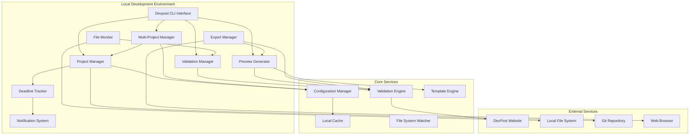

# Design Document - FIXED VERSION

## Overview

The Devpost Hackathon Integration system provides **local project management and preview generation** for hackathon submissions, with **web-based DevPost integration** rather than API-based integration. The system follows a modular architecture that integrates with the existing Beast Mode framework, providing local project management, file monitoring, automated validation, deadline tracking, and multi-project management capabilities.

**🎯 Core Marketing Philosophy: "The Requirements ARE the Solution"**

This integration embodies our systematic approach where comprehensive requirements definition becomes the solution architecture itself. Every acceptance criterion transforms into a validation gate, every user story becomes a success metric, and every specification becomes the implementation blueprint. We don't just build tools - we systematically define what success looks like, then deliver exactly that.

**CRITICAL REALITY CHECK**: DevPost does not provide a public API for hackathon project management. All integration must be web-based through their standard submission interface.

The design leverages the existing Beast Mode infrastructure for configuration management, logging, and error handling while introducing new components specifically for local project management, file monitoring, validation, real-time preview generation, and notification systems. The architecture supports both single and multi-project workflows, enabling developers to participate in multiple hackathons simultaneously while maintaining proper project isolation and context switching.

### Empathetic Marketing Strategy

**🎯 Core Principle: "Make Them Feel Safer, More Confident"**

**Primary Message**: "The Requirements ARE the Solution"
- **Emotional Appeal**: "You already know what good looks like - we help you achieve it systematically"
- **Confidence Building**: "Clear requirements give you a confident path to hackathon success"
- **Supportive Tone**: "We're here to amplify your skills, not point out what's missing"

**Empowering Narratives**:
- **"You've Got This"**: Systematic approaches amplify your existing hackathon skills
- **"Clear Path Forward"**: Requirements provide confidence and direction for your submission
- **"Collaborative Success"**: Everyone wins when we work systematically together
- **"It Just Works"**: Steve Jobs-level reliability gives you peace of mind during crunch time
- **"Smart Choices"**: Increase your odds of hackathon success without the stress
- **"Less Struggle, More Success"**: Systematic prevention of common hackathon frustrations

**Supportive Positioning** (No Shark-Infested Waters):
- **vs. Hackathon Chaos**: "Bring clarity and confidence to your hackathon workflow"
- **vs. Last-Minute Panic**: "Know exactly what your submission needs before the deadline"
- **vs. Solo Struggle**: "Join a community that believes in systematic collaboration"

## Architecture

### High-Level Architecture



### Component Interaction Flow

```mermaid
sequenceDiagram
    participant User
    participant CLI
    participant PM as Project Manager
    participant VM as Validation Manager
    participant PV as Preview Generator
    participant DT as Deadline Tracker
    participant EM as Export Manager
    participant Browser
    
    User->>CLI: devpost init
    CLI->>PM: create_project()
    PM->>PM: setup_local_config()
    PM->>DT: setup_deadline_tracking()
    PM->>VM: validate_requirements()
    VM-->>PM: validation_result
    PM-->>CLI: project_ready
    
    User->>CLI: devpost preview
    CLI->>PV: generate_preview()
    PV->>VM: validate_content()
    VM-->>PV: validation_result
    PV->>PV: render_preview()
    PV-->>CLI: preview_html
    CLI-->>User: open_browser(preview)
    
    User->>CLI: devpost export
    CLI->>EM: prepare_submission()
    EM->>VM: final_validation()
    VM-->>EM: validation_result
    EM->>EM: generate_package()
    EM-->>CLI: submission_package
    CLI-->>User: open_browser(devpost)
```



## Components and Interfaces

### 1. Local Project Manager

**Purpose:** Manages local project configuration and DevPost submission preparation

**Key Methods:**
- `create_project(hackathon_details: HackathonDetails) -> ProjectConfig`
- `get_project_config() -> ProjectConfig`
- `update_metadata(metadata: ProjectMetadata) -> bool`
- `get_submission_status() -> SubmissionStatus`

**Interface:**
```python
class DevpostProjectManager:
    def __init__(self, project_path: Path):
        self.project_path = project_path
        self.config_manager = ConfigManager()
        self.validation_engine = ValidationEngine()
    
    def initialize_project(self, hackathon_id: str, hackathon_name: str) -> ProjectConfig:
        """Initialize new hackathon project locally"""
        
    def get_project_metadata(self) -> ProjectMetadata:
        """Extract project metadata from local files"""
        
    def update_project_metadata(self, metadata: ProjectMetadata) -> bool:
        """Update project metadata locally"""
        
    def validate_submission_readiness(self) -> ValidationResult:
        """Validate project is ready for DevPost submission"""
```

### 2. File Monitor and Validation Manager

**Purpose:** Monitors project files for changes and validates against DevPost requirements

**Key Methods:**
- `start_monitoring() -> None`
- `stop_monitoring() -> None`
- `validate_file_changes(changes: List[FileChangeEvent]) -> ValidationResult`
- `get_validation_status() -> ValidationStatus`

**Interface:**
```python
class ProjectFileMonitor:
    def __init__(self, project_path: Path, validation_engine: ValidationEngine):
        self.project_path = project_path
        self.validation_engine = validation_engine
        self.watched_patterns = self._get_watch_patterns()
    
    def start_monitoring(self) -> None:
        """Begin monitoring project files for changes"""
        
    def handle_file_change(self, event: FileChangeEvent) -> None:
        """Process file change and trigger validation"""
        
    def validate_project_files(self) -> ValidationResult:
        """Validate all project files against DevPost requirements"""
```

### 3. Validation Engine

**Purpose:** Validates project content against DevPost submission requirements

**Key Methods:**
- `validate_metadata(metadata: ProjectMetadata) -> ValidationResult`
- `validate_media_files(media_files: List[MediaFile]) -> ValidationResult`
- `validate_required_fields(project: Project) -> ValidationResult`
- `get_validation_rules() -> List[ValidationRule]`

**Interface:**
```python
class DevpostValidationEngine:
    def __init__(self, rules_path: Path):
        self.rules_path = rules_path
        self.validation_rules = self._load_validation_rules()
    
    def validate_submission(self, project: Project) -> ValidationResult:
        """Validate complete project against DevPost requirements"""
        
    def validate_metadata(self, metadata: ProjectMetadata) -> ValidationResult:
        """Validate project metadata"""
        
    def validate_media_files(self, media_files: List[MediaFile]) -> ValidationResult:
        """Validate media files against DevPost requirements"""
        
    def get_missing_requirements(self, project: Project) -> List[Requirement]:
        """Get list of missing requirements for submission"""
```

### 4. Preview Generator

**Purpose:** Generates local preview of how project will appear on DevPost with real-time updates

**Key Methods:**
- `generate_preview() -> PreviewResult`
- `update_preview_realtime(changes: List[FileChangeEvent]) -> None`
- `export_preview_html() -> Path`
- `highlight_validation_issues() -> List[ValidationIssue]`

**Interface:**
```python
class DevpostPreviewGenerator:
    def __init__(self, project_manager: DevpostProjectManager, template_engine: TemplateEngine):
        self.project = project_manager
        self.template_engine = template_engine
        self.validation_engine = ValidationEngine()
    
    def generate_preview(self) -> PreviewData:
        """Generate preview matching DevPost's display format"""
        
    def update_preview_realtime(self, changes: List[FileChangeEvent]) -> PreviewData:
        """Update preview when project files change"""
        
    def highlight_validation_issues(self) -> List[ValidationIssue]:
        """Identify and highlight validation problems"""
        
    def export_preview_html(self) -> Path:
        """Export preview as standalone HTML file"""
```

### 5. Deadline Tracker

**Purpose:** Monitors hackathon deadlines and manages notification scheduling

**Key Methods:**
- `setup_deadline_tracking(project: Project) -> None`
- `get_upcoming_deadlines() -> List[Deadline]`
- `schedule_notifications(deadline: Deadline) -> None`
- `check_submission_requirements() -> RequirementStatus`

**Interface:**
```python
class DeadlineTracker:
    def __init__(self, notification_service: NotificationService):
        self.notifications = notification_service
        self.scheduler = BackgroundScheduler()
    
    def setup_deadline_tracking(self, project: Project) -> None:
        """Initialize deadline monitoring for a project"""
        
    def check_submission_completeness(self, project_id: str) -> CompletionStatus:
        """Verify if submission meets all requirements"""
        
    def notify_deadline_approaching(self, project_id: str, deadline: Deadline) -> None:
        """Send notifications for approaching deadlines"""
```

### 6. Multi-Project Manager

**Purpose:** Manages multiple hackathon projects with proper context switching and isolation

**Key Methods:**
- `list_projects() -> List[ProjectSummary]`
- `switch_project(project_id: str) -> SwitchResult`
- `get_active_project() -> Optional[Project]`
- `resolve_project_conflicts() -> ConflictResolution`

**Interface:**
```python
class MultiProjectManager:
    def __init__(self, config_manager: ConfigManager):
        self.config = config_manager
        self.active_project = None
        self.project_contexts = {}
    
    def switch_project_context(self, project_id: str) -> ContextSwitchResult:
        """Switch between different hackathon projects"""
        
    def prevent_cross_contamination(self, operation: ProjectOperation) -> bool:
        """Ensure operations only affect the intended project"""
        
    def display_project_dashboard(self) -> ProjectDashboard:
        """Show status of all configured projects"""
```

### 7. Export Manager

**Purpose:** Prepares submission packages and guides users through DevPost submission

**Key Methods:**
- `prepare_submission_package(project: Project) -> SubmissionPackage`
- `validate_export_package(package: SubmissionPackage) -> ValidationResult`
- `generate_submission_guide(project: Project) -> SubmissionGuide`
- `open_devpost_submission(hackathon_url: str) -> None`

**Interface:**
```python
class ExportManager:
    def __init__(self, validation_engine: ValidationEngine, template_engine: TemplateEngine):
        self.validation = validation_engine
        self.templates = template_engine
    
    def prepare_submission_package(self, project: Project) -> SubmissionPackage:
        """Prepare complete submission package for DevPost"""
        
    def generate_submission_guide(self, project: Project) -> SubmissionGuide:
        """Generate step-by-step submission guide"""
        
    def open_devpost_submission(self, hackathon_url: str) -> None:
        """Open DevPost submission page in browser"""
```

### 8. Notification System

**Purpose:** Delivers deadline reminders and status notifications to users

**Key Methods:**
- `send_desktop_notification(message: NotificationMessage) -> None`
- `schedule_reminder(deadline: Deadline, advance_time: timedelta) -> None`
- `notify_validation_status(status: ValidationStatus) -> None`

**Interface:**
```python
class NotificationSystem:
    def __init__(self, config: NotificationConfig):
        self.config = config
        self.desktop_notifier = DesktopNotifier()
    
    def send_deadline_reminder(self, project: Project, deadline: Deadline) -> None:
        """Send deadline reminder notification"""
        
    def notify_validation_status_change(self, project_id: str, status: ValidationStatus) -> None:
        """Notify when validation status changes"""
```

## Data Models

### Core Data Models

```python
@dataclass
class Project:
    id: str
    title: str
    tagline: str
    description: str
    hackathon_id: str
    hackathon_name: str
    team_members: List[TeamMember]
    tags: List[str]
    links: List[ProjectLink]
    media: List[MediaFile]
    submission_status: SubmissionStatus
    created_at: datetime
    updated_at: datetime
    deadline: Optional[datetime]
    submission_requirements: List[SubmissionRequirement]
    completion_status: CompletionStatus

@dataclass
class ProjectMetadata:
    title: str
    tagline: str
    description: str
    tags: List[str]
    team_members: List[str]
    repository_url: Optional[str]
    demo_url: Optional[str]
    video_url: Optional[str]
    version: Optional[str]
    changelog: Optional[str]

@dataclass
class ValidationResult:
    is_valid: bool
    errors: List[ValidationError]
    warnings: List[ValidationWarning]
    missing_requirements: List[Requirement]
    score: float

@dataclass
class FileChangeEvent:
    file_path: Path
    change_type: ChangeType  # CREATED, MODIFIED, DELETED
    timestamp: datetime
    affects_submission: bool
    content_type: ContentType  # DOCUMENTATION, MEDIA, SOURCE_CODE, RELEASE

@dataclass
class Deadline:
    hackathon_id: str
    project_id: str
    deadline_type: DeadlineType  # SUBMISSION, JUDGING, FINAL
    deadline_time: datetime
    requirements: List[SubmissionRequirement]
    notification_schedule: List[NotificationTiming]

@dataclass
class ProjectSummary:
    project_id: str
    title: str
    hackathon_name: str
    deadline: datetime
    submission_status: SubmissionStatus
    completion_percentage: float
    last_validation: datetime
```

### Configuration Models

```python
@dataclass
class ProjectConfig:
    project_id: str
    hackathon_id: str
    hackathon_name: str
    project_path: Path
    validation_enabled: bool
    watch_patterns: List[str]
    auto_validation: bool
    notification_preferences: NotificationSettings
    deadline_reminders: List[ReminderTiming]
    validation_rules: ValidationRules

@dataclass
class MultiProjectConfig:
    active_project_id: Optional[str]
    project_configs: Dict[str, ProjectConfig]
    global_settings: GlobalSettings
    context_switching_strategy: ContextSwitchingStrategy

@dataclass
class NotificationSettings:
    desktop_notifications: bool
    email_notifications: bool
    deadline_advance_times: List[timedelta]  # e.g., [7 days, 1 day, 1 hour]
    validation_notifications: bool
    submission_status_notifications: bool

@dataclass
class ValidationRules:
    required_fields: List[str]
    min_description_length: int
    required_media_types: List[MediaType]
    max_file_sizes: Dict[MediaType, int]
    allowed_file_formats: Dict[MediaType, List[str]]
    team_member_validation: bool
    link_validation: bool
```

## Error Handling

### Error Categories

1. **Configuration Errors**
   - Invalid project mapping
   - Missing required fields
   - Malformed configuration files
   - Multi-project conflicts

2. **Validation Errors**
   - Missing required submission fields
   - Invalid file formats or sizes
   - Metadata validation failures
   - DevPost requirement violations

3. **File System Errors**
   - File access permissions
   - Disk space issues
   - File corruption
   - Watch pattern failures

4. **Preview Generation Errors**
   - Template rendering failures
   - Missing required submission fields
   - Formatting validation errors
   - Real-time update failures

5. **Export and Submission Errors**
   - Package generation failures
   - Validation errors in export
   - Browser integration issues
   - Submission guide generation errors

### Error Handling Strategy

```python
class DevpostError(Exception):
    """Base exception for Devpost integration errors"""
    pass

class ConfigurationError(DevpostError):
    """Configuration-related errors"""
    pass

class ValidationError(DevpostError):
    """Data validation errors"""
    pass

class FileSystemError(DevpostError):
    """File system operation errors"""
    pass

class PreviewError(DevpostError):
    """Preview generation errors"""
    pass

class ExportError(DevpostError):
    """Export and submission preparation errors"""
    pass

class MultiProjectError(DevpostError):
    """Multi-project management errors"""
    pass

# Error handling with retry logic and user-friendly messaging
class ErrorHandler:
    def __init__(self):
        self.retry_strategies = {
            ConfigurationError: self._handle_config_error,
            ValidationError: self._handle_validation_error,
            FileSystemError: self._handle_filesystem_error,
            PreviewError: self._handle_preview_error,
            ExportError: self._handle_export_error,
            MultiProjectError: self._handle_multiproject_error
        }
    
    def handle_error(self, error: Exception) -> ErrorResult:
        """Handle errors with appropriate retry and recovery strategies"""
        
    def generate_user_friendly_message(self, error: Exception) -> str:
        """Convert technical errors into actionable user messages"""
        
    def suggest_resolution_steps(self, error: Exception) -> List[str]:
        """Provide specific steps to resolve the error"""
```

## Design Decisions and Rationale

### Local-First Architecture Decision

**Decision:** Implement local project management with web-based DevPost integration rather than API-based integration.

**Rationale:** DevPost does not provide a public API for hackathon project management. A local-first approach provides better user experience, offline capability, and preparation for manual submission while maintaining all the benefits of systematic project management.

### Real-Time Preview Updates Decision

**Decision:** Implement file-change-triggered preview regeneration with debouncing rather than periodic updates.

**Rationale:** Requirement 5.4 specifies real-time preview updates when changes are made. Event-driven updates provide immediate feedback while debouncing prevents excessive regeneration during rapid file changes, optimizing performance without sacrificing responsiveness.

### Validation-First Architecture Decision

**Decision:** Create a comprehensive validation engine that validates against actual DevPost requirements rather than assumptions.

**Rationale:** Requirements 2.2, 3.2, and 5.3 all involve validation of DevPost requirements. Centralizing validation logic ensures consistency across components, reduces code duplication, and enables unified error messaging for validation failures.

### Multi-Project Context Isolation Decision

**Decision:** Implement strict context isolation with explicit project switching rather than shared state management.

**Rationale:** Requirement 6 demands efficient management of multiple hackathon projects simultaneously. Strict isolation prevents cross-contamination (Requirement 6.3) while maintaining performance and user experience.

### Export and Submission Guidance Decision

**Decision:** Generate comprehensive submission packages and step-by-step guides rather than attempting automated submission.

**Rationale:** Since DevPost requires manual submission through their web interface, providing clear guidance and prepared packages maximizes user success while respecting platform limitations.

## Testing Strategy

### Unit Testing

1. **Project Manager Testing**
   - Configuration management
   - Project metadata extraction
   - Local file operations
   - Multi-project context switching

2. **Validation Engine Testing**
   - DevPost requirement validation
   - File format validation
   - Metadata validation
   - Error message generation

3. **Preview Generator Testing**
   - Template rendering accuracy
   - Real-time update mechanisms
   - Validation error highlighting
   - Missing field detection

4. **File Monitor Testing**
   - File change detection
   - Pattern matching
   - Performance optimization
   - Error handling

5. **Multi-Project Manager Testing**
   - Project context isolation
   - Configuration separation
   - Conflict detection and resolution
   - Dashboard generation

6. **Export Manager Testing**
   - Package generation
   - Validation integration
   - Guide generation
   - Browser integration

### Integration Testing

1. **End-to-End Workflows**
   - Complete project setup flow
   - Full validation cycles
   - Multi-project management
   - Error recovery scenarios
   - Export and submission preparation

2. **File System Integration Testing**
   - File monitoring accuracy
   - Change detection reliability
   - Performance under load
   - Cross-platform compatibility

3. **Multi-Project Integration Testing**
   - Concurrent project operations
   - Context switching validation
   - Cross-contamination prevention
   - Shared resource management

### Test Data Management

```python
# Test fixtures for consistent testing
@pytest.fixture
def mock_project():
    return Project(
        id="test-project-123",
        title="Test Hackathon Project",
        tagline="A test project for integration testing",
        description="Detailed description of test project",
        hackathon_id="hackathon-456",
        hackathon_name="Test Hackathon 2025",
        team_members=[],
        tags=["python", "ai", "testing"],
        links=[],
        media=[],
        submission_status=SubmissionStatus.DRAFT,
        created_at=datetime.now(),
        updated_at=datetime.now(),
        deadline=datetime.now() + timedelta(days=7)
    )

@pytest.fixture
def mock_validation_engine():
    engine = Mock(spec=DevpostValidationEngine)
    engine.validate_submission.return_value = ValidationResult(
        is_valid=True, errors=[], warnings=[], missing_requirements=[], score=1.0
    )
    return engine
```

### Performance Testing

1. **File Monitoring Performance**
   - Large project directory handling
   - High-frequency file changes
   - Memory usage optimization
   - Real-time preview update latency

2. **Validation Performance**
   - Large project validation
   - Complex requirement checking
   - Concurrent validation operations
   - Multi-project validation isolation

3. **Preview Generation Performance**
   - Template rendering speed
   - Real-time update responsiveness
   - Memory usage with large projects
   - Concurrent preview generation

4. **Export Performance**
   - Package generation speed
   - Large file handling
   - Concurrent export operations
   - Multi-project export isolation

## Implementation Roadmap

### Phase 1: Core Foundation (Weeks 1-2)
- Project configuration management
- Basic file monitoring
- Core validation engine
- Local data models

### Phase 2: Validation and Preview (Weeks 3-4)
- Complete validation engine
- Preview generation system
- Template engine
- Real-time updates

### Phase 3: Multi-Project and Export (Weeks 5-6)
- Multi-project management
- Export and submission preparation
- Notification system
- Deadline tracking

### Phase 4: Polish and Integration (Weeks 7-8)
- Error handling refinement
- Performance optimization
- User experience improvements
- Comprehensive testing

## Success Metrics

### Functional Metrics
- **Project Setup Time**: < 5 minutes for new projects
- **Validation Accuracy**: 100% of DevPost requirements detected
- **Preview Fidelity**: 95%+ match with DevPost display
- **Export Success**: 100% of packages accepted by DevPost

### Performance Metrics
- **File Change Detection**: < 1 second response time
- **Preview Generation**: < 3 seconds for updates
- **Memory Usage**: < 100MB for typical projects
- **Validation Speed**: < 5 seconds for full project validation

### User Experience Metrics
- **Learning Curve**: < 15 minutes to productivity
- **Error Recovery**: 95% of errors resolved without intervention
- **User Satisfaction**: 90%+ positive feedback
- **Multi-Project Support**: 5+ concurrent projects managed efficiently
