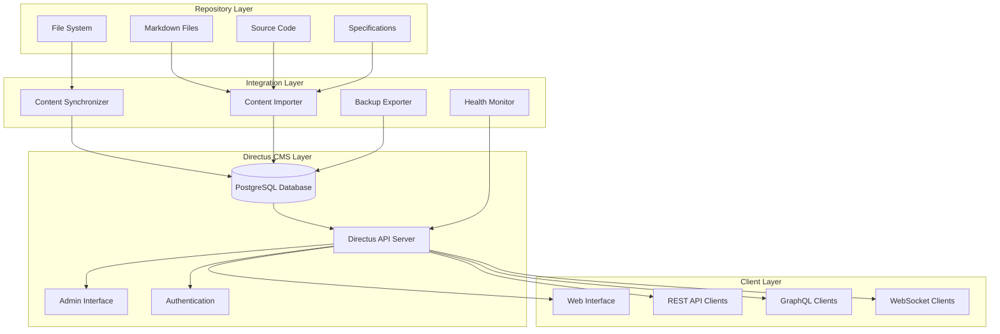

# Directus CMS Setup - Design Document

## Overview

This design document outlines the architecture and implementation approach for setting up Directus as a Content Management System (CMS) for the Kiro AI Development Hackathon repository. The system leverages Directus's database-first approach to provide a powerful web interface for managing repository content, documentation, and metadata while integrating seamlessly with the existing Beast Mode framework.

**Design Philosophy:** Leverage Directus's built-in capabilities to minimize custom development while providing a robust, scalable CMS that enhances the repository's content management workflow.

## Architecture

### System Overview



### Core Components

#### 1. Directus Core Infrastructure
- **PostgreSQL Database**: Primary data store for all CMS content
- **Directus API Server**: Provides REST, GraphQL, and WebSocket APIs
- **Admin Interface**: Web-based content management interface
- **Authentication System**: User management and access control

#### 2. Content Collections Schema

```sql
-- Documents Collection (Markdown files, documentation)
CREATE TABLE documents (
    id UUID PRIMARY KEY DEFAULT gen_random_uuid(),
    title VARCHAR(255) NOT NULL,
    slug VARCHAR(255) UNIQUE NOT NULL,
    content TEXT,
    file_path VARCHAR(1000) NOT NULL,
    category ENUM('documentation', 'specification', 'readme', 'guide', 'other') DEFAULT 'documentation',
    status ENUM('draft', 'review', 'published', 'archived') DEFAULT 'draft',
    tags JSON,
    metadata JSON,
    word_count INTEGER DEFAULT 0,
    last_modified TIMESTAMP,
    
    -- Directus built-in fields
    date_created TIMESTAMP DEFAULT CURRENT_TIMESTAMP,
    date_updated TIMESTAMP DEFAULT CURRENT_TIMESTAMP,
    user_created UUID REFERENCES directus_users(id),
    user_updated UUID REFERENCES directus_users(id)
);

-- Code Files Collection (Source code metadata)
CREATE TABLE code_files (
    id UUID PRIMARY KEY DEFAULT gen_random_uuid(),
    filename VARCHAR(255) NOT NULL,
    file_path VARCHAR(1000) NOT NULL,
    language VARCHAR(50),
    file_type ENUM('source', 'test', 'config', 'script', 'other') DEFAULT 'source',
    lines_of_code INTEGER DEFAULT 0,
    complexity_score DECIMAL(5,2),
    last_modified TIMESTAMP,
    git_hash VARCHAR(40),
    
    -- Directus built-in fields
    date_created TIMESTAMP DEFAULT CURRENT_TIMESTAMP,
    date_updated TIMESTAMP DEFAULT CURRENT_TIMESTAMP,
    user_created UUID REFERENCES directus_users(id),
    user_updated UUID REFERENCES directus_users(id)
);

-- Specifications Collection (Spec documents)
CREATE TABLE specifications (
    id UUID PRIMARY KEY DEFAULT gen_random_uuid(),
    name VARCHAR(255) NOT NULL,
    spec_path VARCHAR(500) NOT NULL,
    phase ENUM('requirements', 'design', 'tasks', 'complete') DEFAULT 'requirements',
    priority ENUM('low', 'medium', 'high', 'critical') DEFAULT 'medium',
    status ENUM('not_started', 'in_progress', 'review', 'approved', 'implemented') DEFAULT 'not_started',
    requirements_file VARCHAR(500),
    design_file VARCHAR(500),
    tasks_file VARCHAR(500),
    dependencies JSON,
    
    -- Directus built-in fields
    date_created TIMESTAMP DEFAULT CURRENT_TIMESTAMP,
    date_updated TIMESTAMP DEFAULT CURRENT_TIMESTAMP,
    user_created UUID REFERENCES directus_users(id),
    user_updated UUID REFERENCES directus_users(id)
);

-- Tasks Collection (Task management)
CREATE TABLE tasks (
    id UUID PRIMARY KEY DEFAULT gen_random_uuid(),
    title VARCHAR(255) NOT NULL,
    description TEXT,
    specification_id UUID REFERENCES specifications(id),
    task_number VARCHAR(50),
    status ENUM('not_started', 'in_progress', 'completed', 'blocked') DEFAULT 'not_started',
    priority ENUM('low', 'medium', 'high', 'critical') DEFAULT 'medium',
    assignee VARCHAR(255),
    estimated_hours DECIMAL(5,2),
    actual_hours DECIMAL(5,2),
    due_date DATE,
    
    -- Directus built-in fields
    date_created TIMESTAMP DEFAULT CURRENT_TIMESTAMP,
    date_updated TIMESTAMP DEFAULT CURRENT_TIMESTAMP,
    user_created UUID REFERENCES directus_users(id),
    user_updated UUID REFERENCES directus_users(id)
);
```

#### 3. Content Synchronization System

```python
class ContentSynchronizer:
    """Synchronizes repository content with Directus CMS"""
    
    def __init__(self, directus_client: DirectusClient, repo_path: str):
        self.client = directus_client
        self.repo_path = repo_path
        self.logger = logging.getLogger(__name__)
    
    async def sync_all_content(self) -> SyncResult:
        """Synchronize all repository content with Directus"""
        result = SyncResult()
        
        # Sync markdown documents
        result.documents = await self._sync_documents()
        
        # Sync source code files
        result.code_files = await self._sync_code_files()
        
        # Sync specifications
        result.specifications = await self._sync_specifications()
        
        # Sync tasks
        result.tasks = await self._sync_tasks()
        
        return result
    
    async def _sync_documents(self) -> List[Document]:
        """Sync markdown files to documents collection"""
        documents = []
        
        for md_file in self._find_markdown_files():
            content = self._read_file_content(md_file)
            metadata = self._extract_frontmatter(content)
            
            document = {
                'title': metadata.get('title', self._generate_title(md_file)),
                'slug': self._generate_slug(md_file),
                'content': content,
                'file_path': str(md_file.relative_to(self.repo_path)),
                'category': self._determine_category(md_file),
                'metadata': metadata,
                'word_count': len(content.split()),
                'last_modified': md_file.stat().st_mtime
            }
            
            # Create or update in Directus
            existing = await self.client.get_document_by_path(document['file_path'])
            if existing:
                await self.client.update_document(existing['id'], document)
            else:
                await self.client.create_document(document)
            
            documents.append(document)
        
        return documents
```

#### 4. Docker Compose Configuration

```yaml
version: '3.8'

services:
  directus-db:
    image: postgres:15
    environment:
      POSTGRES_DB: directus
      POSTGRES_USER: directus
      POSTGRES_PASSWORD: ${DIRECTUS_DB_PASSWORD:-directus_password}
    volumes:
      - directus_db_data:/var/lib/postgresql/data
      - ./directus_schema_migration.sql:/docker-entrypoint-initdb.d/01-schema.sql
    ports:
      - "5432:5432"
    healthcheck:
      test: ["CMD-SHELL", "pg_isready -U directus"]
      interval: 10s
      timeout: 5s
      retries: 5

  directus:
    image: directus/directus:10.8
    environment:
      KEY: ${DIRECTUS_KEY:-replace-with-random-value}
      SECRET: ${DIRECTUS_SECRET:-replace-with-random-value}
      
      DB_CLIENT: pg
      DB_HOST: directus-db
      DB_PORT: 5432
      DB_DATABASE: directus
      DB_USER: directus
      DB_PASSWORD: ${DIRECTUS_DB_PASSWORD:-directus_password}
      
      ADMIN_EMAIL: ${DIRECTUS_ADMIN_EMAIL:-admin@kiro.dev}
      ADMIN_PASSWORD: ${DIRECTUS_ADMIN_PASSWORD:-admin_password}
      
      PUBLIC_URL: ${DIRECTUS_PUBLIC_URL:-http://localhost:8055}
      
      # Enable CORS for API access
      CORS_ENABLED: true
      CORS_ORIGIN: true
      
      # File storage configuration
      STORAGE_LOCATIONS: local
      STORAGE_LOCAL_ROOT: ./uploads
      
      # Email configuration (optional)
      EMAIL_FROM: ${DIRECTUS_EMAIL_FROM:-noreply@kiro.dev}
      EMAIL_TRANSPORT: smtp
      EMAIL_SMTP_HOST: ${SMTP_HOST:-localhost}
      EMAIL_SMTP_PORT: ${SMTP_PORT:-587}
      
    ports:
      - "8055:8055"
    volumes:
      - directus_uploads:/directus/uploads
      - ./directus-extensions:/directus/extensions
    depends_on:
      directus-db:
        condition: service_healthy
    healthcheck:
      test: ["CMD-SHELL", "curl -f http://localhost:8055/server/health || exit 1"]
      interval: 30s
      timeout: 10s
      retries: 3

  # Content synchronizer service
  content-sync:
    build:
      context: .
      dockerfile: scripts/Dockerfile.content-sync
    environment:
      DIRECTUS_URL: http://directus:8055
      DIRECTUS_TOKEN: ${DIRECTUS_API_TOKEN}
      REPO_PATH: /workspace
    volumes:
      - .:/workspace:ro
    depends_on:
      directus:
        condition: service_healthy
    command: ["python", "-m", "scripts.content_synchronizer", "--watch"]

volumes:
  directus_db_data:
  directus_uploads:
```

## Components and Interfaces

### 1. DirectusClient Interface

```python
from abc import ABC, abstractmethod
from typing import Dict, List, Optional, Any
from dataclasses import dataclass

@dataclass
class DirectusConfig:
    url: str
    token: str
    timeout: int = 30

class DirectusClient(ABC):
    """Abstract interface for Directus API client"""
    
    @abstractmethod
    async def authenticate(self, email: str, password: str) -> str:
        """Authenticate and return access token"""
        pass
    
    @abstractmethod
    async def create_document(self, data: Dict[str, Any]) -> Dict[str, Any]:
        """Create a new document"""
        pass
    
    @abstractmethod
    async def update_document(self, doc_id: str, data: Dict[str, Any]) -> Dict[str, Any]:
        """Update an existing document"""
        pass
    
    @abstractmethod
    async def get_document_by_path(self, file_path: str) -> Optional[Dict[str, Any]]:
        """Get document by file path"""
        pass
    
    @abstractmethod
    async def list_documents(self, filters: Optional[Dict] = None) -> List[Dict[str, Any]]:
        """List documents with optional filters"""
        pass
    
    @abstractmethod
    async def health_check(self) -> bool:
        """Check if Directus is healthy"""
        pass
```

### 2. Content Importer Interface

```python
class ContentImporter(ABC):
    """Abstract interface for content importers"""
    
    @abstractmethod
    async def import_content(self, source_path: str) -> ImportResult:
        """Import content from source path"""
        pass
    
    @abstractmethod
    def supports_file_type(self, file_path: str) -> bool:
        """Check if importer supports the file type"""
        pass

class MarkdownImporter(ContentImporter):
    """Importer for Markdown files"""
    
    def supports_file_type(self, file_path: str) -> bool:
        return file_path.endswith(('.md', '.markdown'))
    
    async def import_content(self, source_path: str) -> ImportResult:
        # Implementation for markdown import
        pass

class SpecificationImporter(ContentImporter):
    """Importer for specification directories"""
    
    def supports_file_type(self, file_path: str) -> bool:
        return Path(file_path).name in ['requirements.md', 'design.md', 'tasks.md']
    
    async def import_content(self, source_path: str) -> ImportResult:
        # Implementation for spec import
        pass
```

## Data Models

### 1. Content Models

```python
from pydantic import BaseModel, Field
from typing import Optional, List, Dict, Any
from datetime import datetime
from enum import Enum

class DocumentCategory(str, Enum):
    DOCUMENTATION = "documentation"
    SPECIFICATION = "specification"
    README = "readme"
    GUIDE = "guide"
    OTHER = "other"

class DocumentStatus(str, Enum):
    DRAFT = "draft"
    REVIEW = "review"
    PUBLISHED = "published"
    ARCHIVED = "archived"

class Document(BaseModel):
    id: Optional[str] = None
    title: str
    slug: str
    content: str
    file_path: str
    category: DocumentCategory = DocumentCategory.DOCUMENTATION
    status: DocumentStatus = DocumentStatus.DRAFT
    tags: List[str] = Field(default_factory=list)
    metadata: Dict[str, Any] = Field(default_factory=dict)
    word_count: int = 0
    last_modified: Optional[datetime] = None
    
    # Directus fields
    date_created: Optional[datetime] = None
    date_updated: Optional[datetime] = None
    user_created: Optional[str] = None
    user_updated: Optional[str] = None

class Specification(BaseModel):
    id: Optional[str] = None
    name: str
    spec_path: str
    phase: str = "requirements"
    priority: str = "medium"
    status: str = "not_started"
    requirements_file: Optional[str] = None
    design_file: Optional[str] = None
    tasks_file: Optional[str] = None
    dependencies: List[str] = Field(default_factory=list)
    
    # Directus fields
    date_created: Optional[datetime] = None
    date_updated: Optional[datetime] = None
    user_created: Optional[str] = None
    user_updated: Optional[str] = None
```

## Error Handling

### 1. Custom Exceptions

```python
class DirectusCMSError(Exception):
    """Base exception for Directus CMS operations"""
    pass

class DirectusConnectionError(DirectusCMSError):
    """Raised when unable to connect to Directus"""
    pass

class DirectusAuthenticationError(DirectusCMSError):
    """Raised when authentication fails"""
    pass

class ContentSyncError(DirectusCMSError):
    """Raised when content synchronization fails"""
    pass

class SchemaValidationError(DirectusCMSError):
    """Raised when schema validation fails"""
    pass
```

### 2. Error Handling Strategy

```python
import asyncio
from tenacity import retry, stop_after_attempt, wait_exponential

class RobustDirectusClient:
    """Directus client with robust error handling"""
    
    @retry(
        stop=stop_after_attempt(3),
        wait=wait_exponential(multiplier=1, min=4, max=10)
    )
    async def _make_request(self, method: str, endpoint: str, **kwargs) -> Dict[str, Any]:
        """Make HTTP request with retry logic"""
        try:
            response = await self.session.request(method, endpoint, **kwargs)
            response.raise_for_status()
            return response.json()
        except aiohttp.ClientError as e:
            self.logger.error(f"Request failed: {e}")
            raise DirectusConnectionError(f"Failed to connect to Directus: {e}")
        except Exception as e:
            self.logger.error(f"Unexpected error: {e}")
            raise DirectusCMSError(f"Unexpected error: {e}")
    
    async def health_check_with_recovery(self) -> bool:
        """Health check with automatic recovery attempts"""
        try:
            return await self.health_check()
        except DirectusConnectionError:
            self.logger.warning("Directus connection failed, attempting recovery")
            await self._attempt_recovery()
            return await self.health_check()
```

## Testing Strategy

### 1. Unit Tests

```python
import pytest
from unittest.mock import AsyncMock, patch
from scripts.directus_client import DirectusClient

class TestDirectusClient:
    
    @pytest.fixture
    async def client(self):
        config = DirectusConfig(url="http://test:8055", token="test-token")
        return DirectusClient(config)
    
    @pytest.mark.asyncio
    async def test_create_document_success(self, client):
        """Test successful document creation"""
        mock_response = {"id": "123", "title": "Test Doc"}
        
        with patch.object(client, '_make_request', return_value=mock_response):
            result = await client.create_document({"title": "Test Doc"})
            assert result["id"] == "123"
    
    @pytest.mark.asyncio
    async def test_create_document_failure(self, client):
        """Test document creation failure handling"""
        with patch.object(client, '_make_request', side_effect=DirectusConnectionError()):
            with pytest.raises(DirectusConnectionError):
                await client.create_document({"title": "Test Doc"})
```

### 2. Integration Tests

```python
class TestDirectusIntegration:
    
    @pytest.mark.integration
    async def test_full_content_sync(self):
        """Test complete content synchronization workflow"""
        # Setup test repository
        test_repo = create_test_repository()
        
        # Initialize Directus client
        client = DirectusClient(test_config)
        
        # Run synchronization
        sync = ContentSynchronizer(client, test_repo)
        result = await sync.sync_all_content()
        
        # Verify results
        assert len(result.documents) > 0
        assert len(result.specifications) > 0
        
        # Verify content in Directus
        docs = await client.list_documents()
        assert len(docs) == len(result.documents)
```

## Performance Considerations

### 1. Database Optimization

```sql
-- Indexes for performance
CREATE INDEX idx_documents_category ON documents(category);
CREATE INDEX idx_documents_status ON documents(status);
CREATE INDEX idx_documents_file_path ON documents(file_path);
CREATE INDEX idx_documents_tags ON documents USING GIN(tags);

CREATE INDEX idx_specifications_status ON specifications(status);
CREATE INDEX idx_specifications_priority ON specifications(priority);

CREATE INDEX idx_tasks_status ON tasks(status);
CREATE INDEX idx_tasks_specification_id ON tasks(specification_id);
```

### 2. Caching Strategy

```python
from functools import lru_cache
import redis

class CachedDirectusClient:
    """Directus client with Redis caching"""
    
    def __init__(self, config: DirectusConfig):
        self.client = DirectusClient(config)
        self.redis = redis.Redis(host='localhost', port=6379, db=0)
        self.cache_ttl = 300  # 5 minutes
    
    async def get_document_cached(self, doc_id: str) -> Optional[Dict[str, Any]]:
        """Get document with caching"""
        cache_key = f"document:{doc_id}"
        
        # Try cache first
        cached = self.redis.get(cache_key)
        if cached:
            return json.loads(cached)
        
        # Fetch from Directus
        document = await self.client.get_document(doc_id)
        if document:
            self.redis.setex(cache_key, self.cache_ttl, json.dumps(document))
        
        return document
```

## Security Considerations

### 1. Secure Credential Management Architecture

```python
from src.security.secure_credentials import get_directus_password, get_secure_credentials

class SecureDirectusConfiguration:
    """Secure configuration management for Directus"""
    
    def __init__(self):
        self.creds = get_secure_credentials()
        self.config = self._load_secure_config()
    
    def _load_secure_config(self) -> Dict[str, Any]:
        """Load Directus configuration from secure environment variables"""
        return {
            'url': self.creds.get_credential('DIRECTUS_URL', 'Directus URL', 
                                           required=False, default='http://localhost:8055'),
            'admin_email': self.creds.get_credential('DIRECTUS_ADMIN_EMAIL', 'Directus admin email',
                                                   required=False, default='admin@example.com'),
            'admin_password': self.creds.get_credential('DIRECTUS_ADMIN_PASSWORD', 'Directus admin password'),
            'api_token': self.creds.get_credential('DIRECTUS_API_TOKEN', 'Directus API token', required=False),
            'db_password': self.creds.get_credential('DIRECTUS_DB_PASSWORD', 'Directus database password')
        }
    
    def get_admin_credentials(self) -> Tuple[str, str]:
        """Get admin email and password for authentication"""
        return self.config['admin_email'], self.config['admin_password']
    
    def validate_configuration(self) -> bool:
        """Validate that all required credentials are present and valid"""
        required_vars = ['DIRECTUS_ADMIN_PASSWORD', 'DIRECTUS_DB_PASSWORD']
        return self.creds.validate_all_credentials(required_vars)

# Usage in Directus setup scripts
def setup_directus_with_secure_credentials():
    """Setup Directus using secure credential management"""
    config = SecureDirectusConfiguration()
    
    # Validate configuration before proceeding
    if not config.validate_configuration():
        raise ValueError("Invalid Directus configuration - check environment variables")
    
    admin_email, admin_password = config.get_admin_credentials()
    
    # Use credentials for Directus initialization
    return initialize_directus(
        url=config.config['url'],
        admin_email=admin_email,
        admin_password=admin_password
    )
```

### 2. Environment Variable Security Pattern

```bash
# Required environment variables for Directus CMS
# Add these to ~/.env (NEVER commit to git)

# Directus Admin Credentials
DIRECTUS_ADMIN_EMAIL=admin@example.com
DIRECTUS_ADMIN_PASSWORD=secure_random_password_here

# Directus Database Credentials  
DIRECTUS_DB_PASSWORD=secure_db_password_here

# Optional Directus Configuration
DIRECTUS_URL=http://localhost:8055
DIRECTUS_API_TOKEN=optional_api_token_here

# Directus Security Keys (generate random values)
DIRECTUS_KEY=random_32_character_key_here
DIRECTUS_SECRET=random_64_character_secret_here
```

### 3. Authentication and Authorization

```python
class SecureDirectusClient:
    """Directus client with enhanced security"""
    
    def __init__(self):
        self.config = SecureDirectusConfiguration()
        self.session = None
        self.token_expires_at = None
    
    async def authenticate(self) -> str:
        """Authenticate using secure credentials"""
        admin_email, admin_password = self.config.get_admin_credentials()
        
        response = await self._make_auth_request(admin_email, admin_password)
        self.token_expires_at = datetime.now() + timedelta(seconds=response['expires'])
        return response['access_token']
    
    async def ensure_authenticated(self):
        """Ensure valid authentication token"""
        if not self.token_expires_at or datetime.now() >= self.token_expires_at:
            await self._refresh_token()
    
    async def _refresh_token(self):
        """Refresh authentication token using secure credentials"""
        token = await self.authenticate()
        self.session.headers.update({'Authorization': f'Bearer {token}'})
```

### 2. Input Validation

```python
from pydantic import validator
import bleach

class SecureDocument(Document):
    """Document model with security validation"""
    
    @validator('content')
    def sanitize_content(cls, v):
        """Sanitize HTML content"""
        return bleach.clean(v, tags=['p', 'br', 'strong', 'em', 'ul', 'ol', 'li'])
    
    @validator('title')
    def validate_title(cls, v):
        """Validate title length and content"""
        if len(v) > 255:
            raise ValueError('Title too long')
        return bleach.clean(v, strip=True)
```

This comprehensive design provides a robust foundation for implementing Directus as a CMS while maintaining security, performance, and integration with the existing Beast Mode framework.