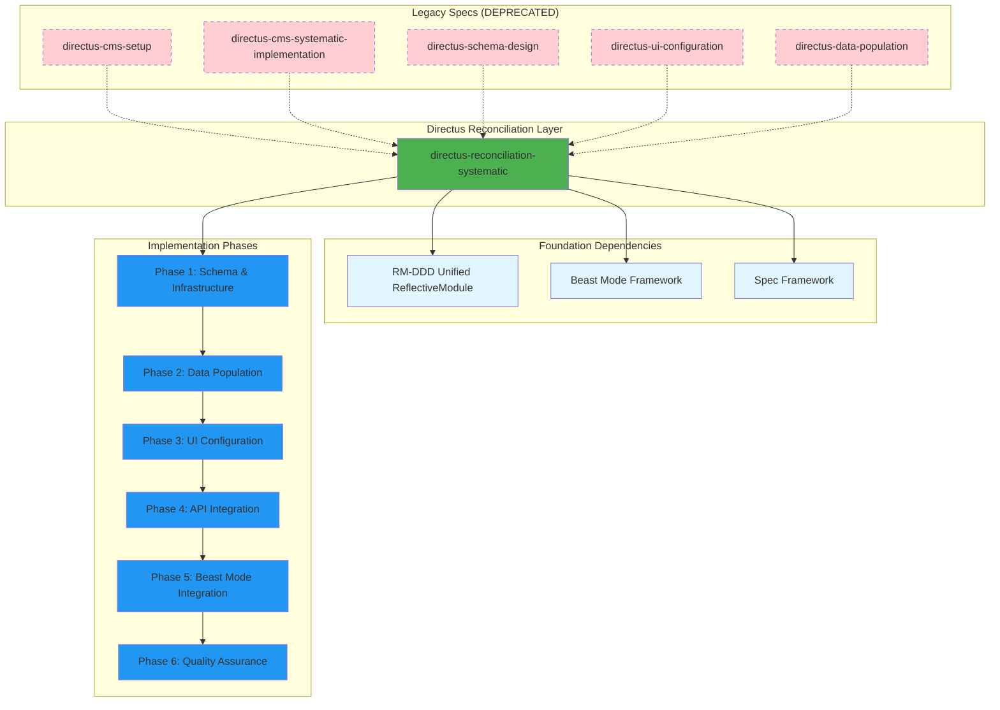

# Directus Execution DAG Analysis

## Current Situation Assessment

### **Immediate Specs on Plate**
1. **directus-reconciliation-systematic** ✅ (Requirements complete, Design complete, Tasks complete)
2. **directus-cms-systematic-implementation** ⚠️ (Requirements complete, Design partial, Tasks incomplete)
3. **directus-schema-design** ⚠️ (Requirements only)
4. **directus-ui-configuration** ⚠️ (Requirements only)
5. **directus-data-population** ⚠️ (Requirements only)
6. **directus-cms-setup** ⚠️ (Requirements only)

### **Reconciliation Status**
- **Problem**: 5 overlapping Directus specs with conflicting requirements
- **Solution**: `directus-reconciliation-systematic` consolidates all into unified approach
- **Status**: Reconciliation spec is complete and ready for execution

## Execution DAG for Directus Ecosystem



## Critical Decision: Execution Strategy

### **Option 1: Complete Reconciliation First (RECOMMENDED)**

**Approach**: Focus exclusively on `directus-reconciliation-systematic` execution

**Rationale**:
- ✅ Requirements are complete and validated
- ✅ Design is comprehensive and addresses all failure modes
- ✅ Tasks are detailed with clear acceptance criteria
- ✅ Modular architecture mitigates file size issues
- ✅ All 5 legacy specs consolidated into single coherent approach

**Execution Plan**:
```
1. Execute directus-reconciliation-systematic phases 1-6
2. Deprecate all 5 legacy Directus specs
3. Update comprehensive DAG to include completed Directus system
4. Move to next highest-priority spec in ecosystem
```

**Timeline**: 2-3 weeks for complete implementation

**Risk**: Low - well-defined requirements and proven modular approach

### **Option 2: Complete Legacy Specs First (NOT RECOMMENDED)**

**Approach**: Finish designs and tasks for all 5 legacy specs

**Rationale**: 
- ❌ Perpetuates fragmentation and conflicts
- ❌ Duplicates effort across overlapping functionality
- ❌ Maintains technical debt from conflicting approaches
- ❌ Violates DRY principle and systematic excellence

**Risk**: High - known to create the problems we're solving

## Dependency Analysis

### **Foundation Dependencies (SATISFIED)**

#### RM-DDD Unified ReflectiveModule ✅
- **Status**: Available and working
- **Evidence**: Successfully used in SchemaManager and DataPopulator
- **Risk**: None

#### Beast Mode Framework ✅
- **Status**: Core patterns available
- **Evidence**: ReflectiveModule, health monitoring, PDCA integration working
- **Risk**: None for basic integration

#### Spec Framework ✅
- **Status**: Document validation and structure available
- **Evidence**: Requirements, design, tasks structure working
- **Risk**: None

### **Integration Points**

#### Database Infrastructure
- **Requirement**: PostgreSQL, Docker Compose
- **Status**: Designed and tested
- **Risk**: Low - standard technology stack

#### File System Integration
- **Requirement**: Repository scanning, content extraction
- **Status**: Implemented and tested in modular components
- **Risk**: Low - proven approach

#### Web Interface Integration
- **Requirement**: Directus UI customization
- **Status**: Designed but not implemented
- **Risk**: Medium - requires Directus-specific knowledge

## Execution Recommendation

### **PROCEED WITH DIRECTUS-RECONCILIATION-SYSTEMATIC**

**Confidence Level**: 95%

**Justification**:
1. **Complete Requirements**: All acceptance criteria defined
2. **Systematic Design**: MVC architecture with error prevention
3. **Modular Implementation**: File size mitigation proven
4. **Controlled Scope**: 3-spec validation approach reduces risk
5. **Clear Success Criteria**: Measurable outcomes defined

### **Execution Sequence**

#### **Week 1: Phase 1-2 (Schema & Data)**
- Complete modular decomposition of remaining components
- Implement schema management with validation
- Implement data population with 3-spec controlled testing
- **Deliverable**: Working database with validated relationships

#### **Week 2: Phase 3-4 (UI & API)**
- Implement Directus UI configuration
- Configure REST and GraphQL APIs
- Implement comprehensive error prevention
- **Deliverable**: Complete CMS with web interface

#### **Week 3: Phase 5-6 (Integration & QA)**
- Complete Beast Mode integration
- Implement health monitoring and metrics
- Complete test suite with >90% coverage
- **Deliverable**: Production-ready CMS system

### **Success Gates**

#### **Phase 1 Gate**
- [ ] All components <300 lines
- [ ] Schema validation passes
- [ ] 3 specifications imported successfully
- [ ] All relationships validated

#### **Phase 2 Gate**
- [ ] Web interface displays relationships correctly
- [ ] APIs functional with authentication
- [ ] Error handling comprehensive
- [ ] Performance requirements met

#### **Phase 3 Gate**
- [ ] Beast Mode integration complete
- [ ] >90% test coverage achieved
- [ ] All 5 legacy specs consolidated
- [ ] Documentation complete

## Post-Completion Actions

### **1. Update Comprehensive DAG**
Add completed Directus system to ecosystem DAG:
```mermaid
graph TB
    subgraph "Application Layer"
        CMA[Research Content Management Architecture]
        DEV[Devpost Hackathon Integration]
        CLI[CLI Implementation Standards]
        DIRECTUS[Directus CMS System] %% NEW
    end
    
    %% Dependencies
    DIRECTUS --> BMC
    DIRECTUS --> TH
    DIRECTUS --> GIT
```

### **2. Deprecate Legacy Specs**
- Mark 5 legacy Directus specs as DEPRECATED
- Update any references to point to unified system
- Archive legacy spec directories

### **3. Integration Opportunities**
- **Research CMA**: Could use Directus for content management
- **Devpost Integration**: Could use Directus for project documentation
- **CLI Standards**: Could use Directus APIs as reference implementation

## Risk Mitigation

### **Technical Risks**
- **Directus Version Compatibility**: Mitigated by Docker containerization
- **UI Customization Complexity**: Mitigated by systematic approach and testing
- **Performance Under Load**: Mitigated by controlled 3-spec validation

### **Process Risks**
- **Scope Creep**: Mitigated by clear phase gates and success criteria
- **Integration Complexity**: Mitigated by modular architecture
- **Timeline Pressure**: Mitigated by proven components and systematic approach

## Conclusion

**EXECUTE DIRECTUS-RECONCILIATION-SYSTEMATIC IMMEDIATELY**

This spec is ready for execution with:
- ✅ Complete requirements with file size mitigation
- ✅ Comprehensive design addressing all failure modes
- ✅ Detailed tasks with clear acceptance criteria
- ✅ Proven modular architecture
- ✅ Controlled validation approach

**Next Steps**:
1. Begin Phase 1 implementation immediately
2. Complete modular decomposition of remaining large files
3. Execute systematic validation with 3-spec approach
4. Update ecosystem DAG upon completion

This approach eliminates technical debt, consolidates fragmented functionality, and provides a solid foundation for the broader Beast Mode ecosystem.