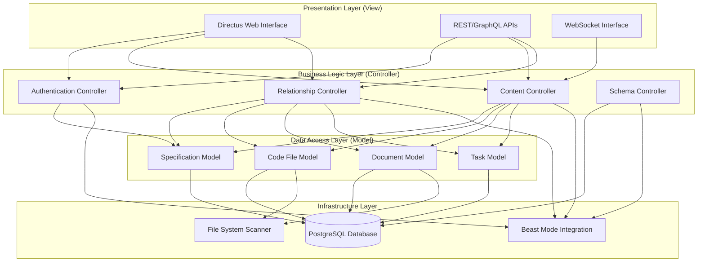
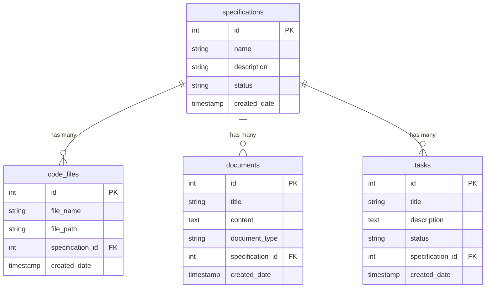

# Design Document

## Overview

The Directus Reconciliation Systematic design provides a unified, MVC-based architecture that consolidates all functionality from 5 fragmented specifications into a coherent, implementable system. This design addresses the critical failures identified in previous attempts while maintaining systematic excellence through proper separation of concerns, comprehensive error prevention, and Beast Mode framework integration.

### Architectural Principles

1. **Model-View-Controller Architecture**: Clear separation of data access, business logic, and presentation
2. **Systematic Error Prevention**: Comprehensive handling of all identified failure modes
3. **Incremental Validation**: Step-by-step implementation with validation at each stage
4. **Beast Mode Integration**: ReflectiveModule patterns and PDCA methodology
5. **Controlled Scope**: Focus on 3 specifications for validation before scaling

### Design Philosophy

**"Systematic Integration Over Fragmented Implementation"** - consolidate overlapping functionality into unified components that eliminate redundancy while preserving all essential capabilities.

## Architecture

### System Architecture Overview



### MVC Architecture Implementation

#### Model Layer (Data Access and Business Logic)
- **Specification Model**: Manages specification metadata, validation, and relationships
- **Code File Model**: Handles file system integration and code file metadata
- **Document Model**: Manages document content and specification relationships
- **Task Model**: Handles task parsing, status tracking, and specification links

#### View Layer (Presentation)
- **Directus Web Interface**: Customized UI with relationship displays and navigation
- **REST API**: Standard CRUD operations with relationship expansion
- **GraphQL API**: Complex queries and relationship traversal
- **WebSocket Interface**: Real-time updates and notifications

#### Controller Layer (Request Handling and Coordination)
- **Authentication Controller**: Credential validation, token management, permission enforcement
- **Content Controller**: CRUD operations, validation, and business rule enforcement
- **Relationship Controller**: Relationship creation, validation, and navigation
- **Schema Controller**: Database schema management and migration

## Components and Interfaces

### Core Components

#### 1. Schema Management Component

**Responsibility**: Database schema design, creation, and validation

**Interface**:
```python
class SchemaManager(ReflectiveModule):
    def create_schema(self) -> SchemaResult
    def validate_schema(self) -> ValidationResult
    def migrate_schema(self, version: str) -> MigrationResult
    def rollback_schema(self, checkpoint: str) -> RollbackResult
```

**Key Features**:
- Consistent INTEGER ID types across all tables
- Proper foreign key constraints with CASCADE rules
- Referential integrity validation
- Rollback capability for failed operations

#### 2. Data Population Component

**Responsibility**: Systematic data import with validation and relationship linking

**Interface**:
```python
class DataPopulator(ReflectiveModule):
    def populate_specifications(self, spec_names: List[str]) -> PopulationResult
    def link_code_files(self, spec_id: int) -> LinkingResult
    def import_documents(self, spec_id: int) -> ImportResult
    def create_tasks(self, spec_id: int) -> TaskResult
    def validate_relationships(self) -> ValidationResult
```

**Key Features**:
- Focused on 3 specifications for controlled validation
- Comprehensive relationship testing
- Rollback capability for failed imports
- Step-by-step validation with detailed reporting

#### 3. UI Configuration Component

**Responsibility**: Web interface customization for optimal relationship management

**Interface**:
```python
class UIConfigurator(ReflectiveModule):
    def configure_relationship_displays(self) -> ConfigResult
    def setup_navigation_links(self) -> NavigationResult
    def create_dropdown_selectors(self) -> SelectorResult
    def enable_search_filtering(self) -> SearchResult
```

**Key Features**:
- Clear relationship visualization
- Intuitive navigation between related items
- Dropdown selectors for relationship creation
- Search and filtering by relationships

#### 4. Error Prevention Component

**Responsibility**: Comprehensive error handling and recovery mechanisms

**Interface**:
```python
class ErrorPrevention(ReflectiveModule):
    def validate_authentication(self, credentials: dict) -> AuthResult
    def check_schema_consistency(self) -> ConsistencyResult
    def test_relationships(self) -> RelationshipResult
    def handle_api_errors(self, error: Exception) -> ErrorResult
    def provide_rollback(self, operation_id: str) -> RollbackResult
```

**Key Features**:
- Authentication failure prevention
- Schema consistency validation
- Relationship testing before proceeding
- API error handling with meaningful messages
- Comprehensive rollback capabilities

### Integration Interfaces

#### Beast Mode Framework Integration

```python
class DirectusCMSOrchestrator(ReflectiveModule):
    """Main orchestrator implementing Beast Mode patterns"""
    
    def __init__(self):
        super().__init__()
        self.schema_manager = SchemaManager()
        self.data_populator = DataPopulator()
        self.ui_configurator = UIConfigurator()
        self.error_prevention = ErrorPrevention()
    
    def health_check(self) -> HealthStatus:
        """Beast Mode health monitoring"""
        pass
    
    def get_metrics(self) -> MetricsData:
        """Beast Mode metrics collection"""
        pass
    
    def execute_pdca_cycle(self, operation: str) -> PDCAResult:
        """PDCA methodology implementation"""
        pass
```

#### File System Integration

```python
class FileSystemScanner(ReflectiveModule):
    """Scans repository for content to import"""
    
    def scan_specifications(self, base_path: str) -> List[SpecificationInfo]
    def find_code_files(self, patterns: List[str]) -> List[CodeFileInfo]
    def extract_documents(self, spec_path: str) -> List[DocumentInfo]
    def parse_tasks(self, tasks_file: str) -> List[TaskInfo]
```

## Data Models

### Database Schema Design

#### Specifications Table
```sql
CREATE TABLE specifications (
    id INTEGER PRIMARY KEY AUTOINCREMENT,
    name VARCHAR(255) NOT NULL UNIQUE,
    description TEXT,
    status VARCHAR(50) DEFAULT 'active',
    created_date TIMESTAMP DEFAULT CURRENT_TIMESTAMP,
    updated_date TIMESTAMP DEFAULT CURRENT_TIMESTAMP
);
```

#### Code Files Table
```sql
CREATE TABLE code_files (
    id INTEGER PRIMARY KEY AUTOINCREMENT,
    file_name VARCHAR(255) NOT NULL,
    file_path TEXT NOT NULL UNIQUE,
    specification_id INTEGER,
    created_date TIMESTAMP DEFAULT CURRENT_TIMESTAMP,
    FOREIGN KEY (specification_id) REFERENCES specifications(id) ON DELETE SET NULL
);
```

#### Documents Table
```sql
CREATE TABLE documents (
    id INTEGER PRIMARY KEY AUTOINCREMENT,
    title VARCHAR(255) NOT NULL,
    content TEXT,
    document_type VARCHAR(50), -- 'requirements', 'design', 'tasks'
    specification_id INTEGER,
    created_date TIMESTAMP DEFAULT CURRENT_TIMESTAMP,
    FOREIGN KEY (specification_id) REFERENCES specifications(id) ON DELETE SET NULL
);
```

#### Tasks Table
```sql
CREATE TABLE tasks (
    id INTEGER PRIMARY KEY AUTOINCREMENT,
    title VARCHAR(255) NOT NULL,
    description TEXT,
    status VARCHAR(50) DEFAULT 'not_started',
    specification_id INTEGER,
    created_date TIMESTAMP DEFAULT CURRENT_TIMESTAMP,
    FOREIGN KEY (specification_id) REFERENCES specifications(id) ON DELETE SET NULL
);
```

### Relationship Model



## Error Handling

### Comprehensive Error Prevention Strategy

#### 1. Authentication Error Prevention
- **Credential Validation**: Multi-layer validation with clear error messages
- **Token Management**: Automatic refresh with expiration handling
- **Permission Enforcement**: Role-based access with graceful degradation

#### 2. Schema Consistency Prevention
- **Type Validation**: Ensure INTEGER consistency across all ID fields
- **Constraint Testing**: Validate foreign keys before creation
- **Rollback Capability**: Automatic rollback on constraint failures

#### 3. Relationship Error Prevention
- **Bidirectional Testing**: Validate relationships work in both directions
- **Orphan Detection**: Prevent orphaned records through proper constraints
- **Navigation Validation**: Test UI navigation before deployment

#### 4. API Error Prevention
- **Response Validation**: Check API responses for completeness
- **Error Handling**: Meaningful error messages with remediation guidance
- **Timeout Management**: Proper timeout handling with retry logic

### Error Recovery Mechanisms

```python
class ErrorRecovery:
    def rollback_operation(self, operation_id: str) -> RollbackResult:
        """Rollback failed operations to last known good state"""
        pass
    
    def repair_relationships(self) -> RepairResult:
        """Repair broken relationships automatically"""
        pass
    
    def validate_data_integrity(self) -> IntegrityResult:
        """Comprehensive data integrity validation"""
        pass
    
    def generate_recovery_report(self) -> RecoveryReport:
        """Detailed recovery actions and results"""
        pass
```

## Testing Strategy

### Comprehensive Testing Approach

#### 1. Unit Testing
- **Model Testing**: Validate all data models and business logic
- **Controller Testing**: Test request handling and coordination
- **Component Testing**: Validate individual component functionality
- **Error Handling Testing**: Test all error scenarios and recovery

#### 2. Integration Testing
- **Database Integration**: Test schema creation and data operations
- **API Integration**: Validate REST and GraphQL endpoints
- **UI Integration**: Test web interface functionality
- **File System Integration**: Validate repository scanning and import

#### 3. Relationship Testing
- **Relationship Creation**: Test all relationship creation scenarios
- **Navigation Testing**: Validate bidirectional navigation
- **Search Testing**: Test filtering and search by relationships
- **Data Integrity Testing**: Validate referential integrity

#### 4. End-to-End Testing
- **Complete Workflow**: Test entire setup → population → configuration → usage workflow
- **Error Scenarios**: Test recovery from various failure modes
- **Performance Testing**: Validate response times and concurrent usage
- **Security Testing**: Validate authentication and authorization

### Test Data Strategy

#### Controlled Test Dataset
- **3 Specifications**: integration-orchestrator-framework, ai-driven-cursor-sharing, gpt5-context-calibration-system
- **Related Code Files**: Files from src/beast_mode/integration_orchestrator/ and src/beast_mode/cursor_sharing/
- **Documents**: requirements.md, design.md, tasks.md for each specification
- **Tasks**: Parsed from tasks.md files with proper relationships

#### Validation Criteria
- Each specification has 2-3 related items in each category
- All relationships are bidirectionally navigable
- Database, API, and UI all show consistent relationship data
- Search and filtering work correctly across relationships

## Deployment Architecture

### Docker Compose Configuration

```yaml
version: '3.8'
services:
  directus:
    image: directus/directus:latest
    ports:
      - "8055:8055"
    environment:
      KEY: "directus-key"
      SECRET: "directus-secret"
      DB_CLIENT: "pg"
      DB_HOST: "postgres"
      DB_PORT: "5432"
      DB_DATABASE: "directus"
      DB_USER: "directus"
      DB_PASSWORD: "directus"
      ADMIN_EMAIL: "admin@directus.local"
      ADMIN_PASSWORD: "directus"
    depends_on:
      - postgres
    volumes:
      - ./directus/uploads:/directus/uploads
      - ./directus/extensions:/directus/extensions

  postgres:
    image: postgres:13
    environment:
      POSTGRES_DB: "directus"
      POSTGRES_USER: "directus"
      POSTGRES_PASSWORD: "directus"
    volumes:
      - postgres_data:/var/lib/postgresql/data
    ports:
      - "5432:5432"

volumes:
  postgres_data:
```

### Health Monitoring

```python
class DirectusHealthMonitor(ReflectiveModule):
    def health_check(self) -> HealthStatus:
        """Comprehensive health monitoring"""
        return HealthStatus(
            database=self._check_database(),
            api=self._check_api(),
            relationships=self._check_relationships(),
            ui=self._check_ui()
        )
    
    def ready_check(self) -> ReadinessStatus:
        """Readiness for traffic"""
        pass
    
    def metrics(self) -> MetricsData:
        """Performance and usage metrics"""
        pass
```

## Implementation Sequence

### Phase 1: Schema Design and Validation
1. Create database schema with consistent INTEGER IDs
2. Validate foreign key constraints
3. Test referential integrity
4. Implement rollback capability

### Phase 2: Data Population and Relationship Testing
1. Import 3 target specifications
2. Link related code files and documents
3. Create task records from tasks.md files
4. Validate all relationships work correctly

### Phase 3: UI Configuration and Navigation
1. Configure relationship displays
2. Set up navigation links
3. Create dropdown selectors
4. Enable search and filtering

### Phase 4: API Integration and Error Prevention
1. Configure REST and GraphQL APIs
2. Implement comprehensive error handling
3. Add authentication and authorization
4. Enable real-time updates

### Phase 5: Beast Mode Integration and Monitoring
1. Implement ReflectiveModule patterns
2. Add health monitoring endpoints
3. Enable structured logging
4. Integrate with PDCA methodology

Each phase includes comprehensive validation before proceeding to the next phase, ensuring systematic quality and preventing the failures encountered in previous attempts.