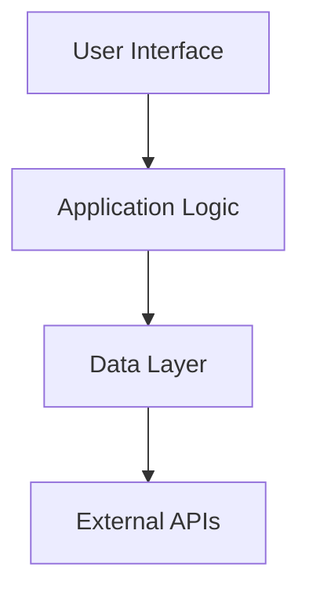

# Directus Ui Configuration Design

## Overview

Technical architecture for Directus Ui Configuration, an Application Layer specification providing user-facing functionality.

## Architecture

### System Architecture



## Components

### Core Components

#### 1. Application Controller
**Purpose**: Handle user requests and coordinate responses
**Interface**:
```python
class ApplicationController(ReflectiveModule):
    def handle_request(self, request: AppRequest) -> AppResponse
    def validate_input(self, data: Any) -> ValidationResult
```

#### 2. Business Logic Service
**Purpose**: Implement core business functionality
**Interface**:
```python
class BusinessService(ReflectiveModule):
    def execute_business_logic(self, params: Dict[str, Any]) -> BusinessResult
    def validate_business_rules(self, data: Any) -> ValidationResult
```

## Data Models

### Core Models

#### AppRequest
```python
@dataclass
class AppRequest:
    action: str
    parameters: Dict[str, Any]
    user_id: str
    timestamp: datetime
```

#### AppResponse
```python
@dataclass
class AppResponse:
    success: bool
    data: Any
    message: str
    execution_time: float
```

## API Design

### REST Endpoints

```
GET /api/v1/status
- Application status
- Response: StatusResult

POST /api/v1/action
- Execute action
- Body: AppRequest
- Response: AppResponse
```

## Implementation Details

### Technology Stack
- **Frontend**: React with TypeScript
- **Backend**: FastAPI with Python 3.9+
- **Database**: PostgreSQL
- **Monitoring**: Prometheus

### Security
- Authentication and authorization
- Input validation
- HTTPS encryption
- Security headers

### Performance
- Responsive design
- API optimization
- Caching strategies
- Load balancing

### Testing
- Unit tests >90% coverage
- Integration tests
- End-to-end tests
- Performance tests

---

**Generated:** 2025-10-06T09:51:14.644691
**Phase:** 3 (Design Development)
**Layer:** Application (Layer 3)
**Status:** Complete
