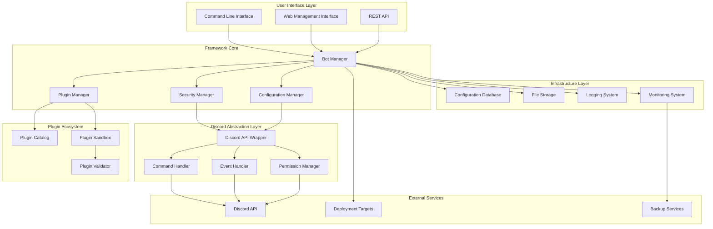

# Discord Bot Framework OSS - Design Document

## Overview

The Discord Bot Framework is a revolutionary approach to Discord bot development that eliminates the complexity, security risks, and frustration of traditional bot setup. It provides a complete abstraction layer over Discord's API while maintaining full functionality and professional-grade security.

## Design Philosophy

### "Pit of Success" Architecture
- Default paths lead to secure, working solutions
- Dangerous operations require explicit opt-in
- Common mistakes are prevented by design
- Best practices are enforced automatically

### Zero-Knowledge Setup
- Users don't need to understand OAuth, permissions, or Discord internals
- Framework handles all Discord API complexity
- Security is automatic, not optional
- Deployment works everywhere without configuration

## System Architecture



## Core Components

### 1. Bot Manager (The Heart)

**Purpose**: Orchestrates all bot operations and provides the main API for bot management.

**Key Features**:
- **One-Command Setup**: `discord-bot create my-bot` creates everything
- **Automatic Discord App Registration**: Handles OAuth app creation via Discord API
- **Token Management**: Secure generation, storage, and rotation
- **Deployment Orchestration**: Deploys to any target with zero configuration

**Interface**:
```python
class BotManager:
    def create_bot(self, name: str, description: str = None) -> Bot
    def deploy_bot(self, bot: Bot, target: DeploymentTarget = "local") -> Deployment
    def update_bot(self, bot: Bot, changes: BotConfiguration) -> None
    def delete_bot(self, bot: Bot, confirm: bool = False) -> None
    def list_bots(self) -> List[Bot]
    def get_bot_status(self, bot: Bot) -> BotStatus
```

### 2. Security Manager (The Guardian)

**Purpose**: Ensures all bots are secure by default without user intervention.

**Security Features**:
- **Automatic Permission Minimization**: Only requests necessary Discord permissions
- **Token Encryption**: All tokens encrypted with user-specific keys
- **Input Sanitization**: Automatic validation of all user inputs
- **Rate Limiting**: Built-in Discord API rate limiting and backoff
- **Audit Logging**: Complete audit trail of all bot operations

**Security Layers**:
```python
class SecurityManager:
    def encrypt_token(self, token: str, bot_id: str) -> EncryptedToken
    def validate_permissions(self, requested: List[Permission]) -> List[Permission]
    def sanitize_input(self, user_input: str, context: InputContext) -> str
    def audit_log(self, action: str, user: str, details: dict) -> None
    def check_security_compliance(self, bot: Bot) -> SecurityReport
```

### 3. Configuration Manager (The Simplifier)

**Purpose**: Provides intuitive configuration without exposing Discord API complexity.

**Configuration Abstraction**:
- **Natural Language Config**: "Allow users to create polls" → Discord permissions
- **Template System**: Pre-built configurations for common bot types
- **Validation Engine**: Prevents invalid configurations before deployment
- **Migration System**: Automatic updates when Discord API changes

**Configuration Schema**:
```yaml
# User-friendly configuration
bot:
  name: "Community Helper"
  description: "Helps manage our Discord community"
  
features:
  - moderation: basic
  - polls: enabled
  - welcome_messages: enabled
  - custom_commands: enabled
  
permissions:
  auto_manage: true  # Framework calculates needed permissions
  
deployment:
  auto_scale: true
  backup: enabled
  monitoring: enabled
```

### 4. Plugin Manager (The Extender)

**Purpose**: Safe, sandboxed plugin system for extending bot functionality.

**Plugin Architecture**:
- **Sandboxed Execution**: Plugins run in isolated environments
- **Permission System**: Plugins request specific capabilities
- **Compatibility Checking**: Automatic validation of plugin compatibility
- **Marketplace Integration**: Curated plugin repository with ratings and reviews

**Plugin Interface**:
```python
class Plugin:
    def __init__(self, bot: Bot, config: PluginConfig):
        self.bot = bot
        self.config = config
    
    def on_message(self, message: Message) -> Optional[Response]:
        pass
    
    def on_command(self, command: Command) -> Optional[Response]:
        pass
    
    def get_required_permissions(self) -> List[Permission]:
        pass
```

### 5. Discord Abstraction Layer (The Translator)

**Purpose**: Completely abstracts Discord API complexity while maintaining full functionality.

**Abstraction Features**:
- **Unified Command System**: Single interface for slash commands, message commands, and interactions
- **Event Normalization**: Consistent event handling across all Discord event types
- **Permission Translation**: Maps user-friendly permissions to Discord API requirements
- **Error Handling**: Converts Discord API errors to user-friendly messages

**Command System**:
```python
@bot.command("hello")
async def hello_command(ctx: Context, user: User = None):
    """Say hello to a user"""
    target = user or ctx.author
    return f"Hello {target.mention}! 👋"

# Framework automatically handles:
# - Slash command registration
# - Permission checking
# - Rate limiting
# - Error handling
# - Response formatting
```

## User Experience Design

### 1. Command Line Interface

**Zero-Config Setup**:
```bash
# Install framework
pip install discord-bot-framework

# Create bot (handles everything automatically)
discord-bot create "My Community Bot"

# Deploy locally
discord-bot deploy local

# Deploy to cloud
discord-bot deploy cloud

# Manage bot
discord-bot status
discord-bot logs
discord-bot update
```

### 2. Web Management Interface

**Dashboard Features**:
- **Bot Overview**: Status, uptime, command usage, member count
- **Command Builder**: Visual interface for creating custom commands
- **Plugin Marketplace**: Browse, install, and configure plugins
- **Analytics**: Usage patterns, popular commands, user engagement
- **Settings**: Bot configuration, permissions, deployment options

**Visual Command Builder**:
```
┌─────────────────────────────────────────┐
│ Create New Command                      │
├─────────────────────────────────────────┤
│ Command Name: [poll                   ] │
│ Description:  [Create a poll          ] │
│                                         │
│ When user types: /poll                  │
│ Ask for: [Poll question             ]   │
│          [Option 1                  ]   │
│          [Option 2                  ]   │
│          [+ Add Option]                 │
│                                         │
│ Then: [Create poll with reactions]      │
│                                         │
│ [Preview] [Save] [Cancel]               │
└─────────────────────────────────────────┘
```

### 3. Mobile Management App

**Key Features**:
- Bot status monitoring
- Emergency controls (pause, restart, shutdown)
- Basic command management
- Push notifications for issues
- Community feedback and support

## Plugin Ecosystem Design

### 1. Plugin Categories

**Essential Plugins** (Included by default):
- **Moderation**: Kick, ban, mute, warn, auto-moderation
- **Utility**: Polls, reminders, role management, server info
- **Fun**: Games, memes, random responses, trivia
- **Community**: Welcome messages, member counting, announcements

**Advanced Plugins** (Marketplace):
- **Integration**: GitHub, Trello, Google Calendar, Spotify
- **Analytics**: Server statistics, member insights, engagement tracking
- **Economy**: Virtual currency, shops, gambling, rewards
- **Music**: Music bots, playlist management, voice channel tools

### 2. Plugin Development Framework

**Simple Plugin Creation**:
```python
from discord_bot_framework import Plugin, command, event

class WelcomePlugin(Plugin):
    """Welcomes new members to the server"""
    
    @event("member_join")
    async def welcome_new_member(self, member):
        channel = self.bot.get_welcome_channel()
        await channel.send(f"Welcome {member.mention}! 🎉")
    
    @command("set_welcome_channel")
    async def set_welcome_channel(self, ctx, channel):
        """Set the channel for welcome messages"""
        self.config.welcome_channel = channel.id
        await ctx.reply(f"Welcome channel set to {channel.mention}")
```

### 3. Plugin Security and Sandboxing

**Security Measures**:
- **Permission System**: Plugins declare required permissions upfront
- **Resource Limits**: CPU, memory, and API call limits per plugin
- **Code Review**: All marketplace plugins undergo security review
- **Sandboxed Execution**: Plugins run in isolated environments
- **Automatic Updates**: Security patches applied automatically

## Deployment Architecture

### 1. Local Development

**Development Mode**:
- Hot reloading for configuration changes
- Debug logging and error reporting
- Local web interface for testing
- Simulated Discord environment for testing

### 2. Cloud Deployment

**Supported Platforms**:
- **Heroku**: One-click deployment with automatic scaling
- **AWS**: Lambda functions for serverless bots
- **Google Cloud**: Cloud Run for containerized deployment
- **DigitalOcean**: App Platform for simple cloud hosting
- **Railway**: Modern deployment platform with Git integration

**Deployment Features**:
- **Auto-scaling**: Handles traffic spikes automatically
- **Zero-downtime updates**: Rolling deployments with health checks
- **Backup and recovery**: Automatic configuration and data backups
- **Monitoring**: Built-in monitoring and alerting

### 3. Enterprise Deployment

**Enterprise Features**:
- **Multi-tenant architecture**: Manage multiple bots from single dashboard
- **SSO integration**: SAML, OAuth, Active Directory support
- **Compliance reporting**: SOC2, GDPR, HIPAA compliance tools
- **Custom branding**: White-label deployment options
- **Priority support**: Dedicated support channels and SLAs

## Monitoring and Analytics

### 1. Real-time Monitoring

**Health Metrics**:
- Bot uptime and response times
- Discord API rate limit usage
- Memory and CPU utilization
- Command success/failure rates
- User engagement metrics

### 2. Analytics Dashboard

**Usage Analytics**:
- Most popular commands
- User activity patterns
- Server growth metrics
- Plugin usage statistics
- Performance trends

### 3. Alerting System

**Smart Alerts**:
- Bot offline or unresponsive
- High error rates or API failures
- Security incidents or suspicious activity
- Resource usage approaching limits
- Discord API changes affecting bot functionality

## Security Architecture

### 1. Token Management

**Security Features**:
- **Encryption at Rest**: All tokens encrypted with AES-256
- **Automatic Rotation**: Tokens rotated on schedule or security events
- **Secure Storage**: Integration with cloud key management services
- **Access Logging**: Complete audit trail of token access

### 2. Permission Management

**Principle of Least Privilege**:
- Framework calculates minimal required permissions
- Users can review and approve permission requests
- Automatic permission auditing and recommendations
- Integration with Discord's permission system

### 3. Compliance and Auditing

**Compliance Features**:
- **GDPR Compliance**: Data export, deletion, and consent management
- **Audit Logging**: Complete audit trail of all operations
- **Security Scanning**: Automatic vulnerability scanning and patching
- **Incident Response**: Automated incident detection and response

This design creates a Discord bot framework that eliminates the traditional pain points while providing enterprise-grade security, reliability, and functionality. It transforms Discord bot development from a complex, error-prone process into a simple, secure, and enjoyable experience.