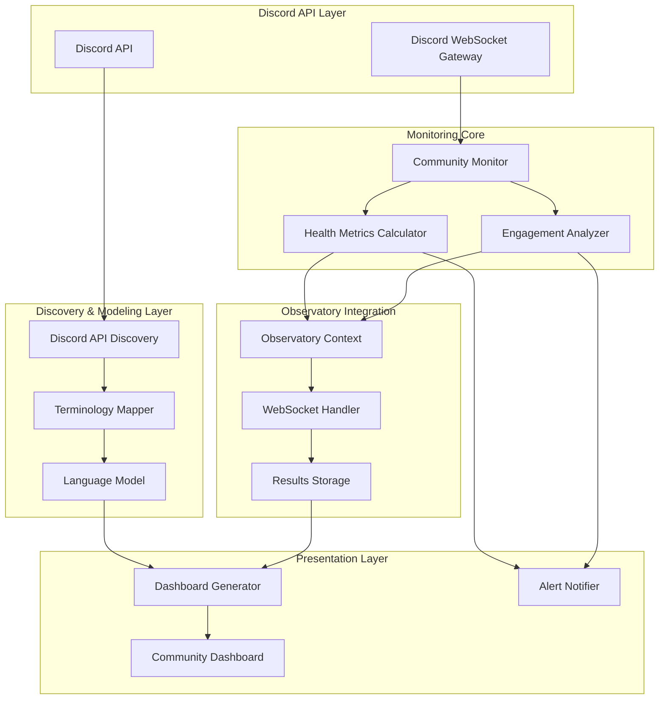

# Design Document

## Overview

The Discord Community Monitoring system demonstrates the complete Ubiquitous Language-Driven Monitoring Integration Platform methodology through a practical, real-world implementation. This system monitors Discord community health, engagement metrics, and provides actionable insights using community management terminology rather than technical API jargon.

The design showcases the discovery → modeling → generation workflow by:
1. **Discovery**: Analyzing Discord API endpoints and extracting monitoring-relevant terminology
2. **Modeling**: Mapping technical Discord concepts to community management business language
3. **Generation**: Creating monitoring dashboards and alerts using the derived ubiquitous language

## Architecture

### High-Level Architecture



### Component Architecture

The system follows the Beast Mode Observatory's Reflective Module pattern, with each component implementing health monitoring, status reporting, and systematic debugging capabilities.

## Components and Interfaces

### 1. Discord API Discovery Module

**Purpose**: Discovers and analyzes Discord API endpoints to extract monitoring terminology.

**Key Interfaces**:
```python
class DiscordAPIDiscovery(ReflectiveModule):
    async def discover_endpoints(self) -> List[APIEndpoint]
    async def extract_terminology(self, endpoints: List[APIEndpoint]) -> TerminologyMap
    async def analyze_rate_limits(self) -> RateLimitInfo
```

**Responsibilities**:
- Scan Discord API documentation and available endpoints
- Extract monitoring-relevant concepts (channels, messages, users, reactions)
- Map technical terms to community management concepts
- Handle Discord API rate limiting and authentication

### 2. Community Health Monitor

**Purpose**: Monitors Discord community activity and calculates health metrics using business terminology.

**Key Interfaces**:
```python
class CommunityHealthMonitor(ReflectiveModule):
    async def calculate_community_health(self) -> CommunityHealthScore
    async def track_engagement_metrics(self) -> EngagementMetrics
    async def detect_important_discussions(self) -> List[ImportantDiscussion]
    async def monitor_response_times(self) -> ResponseTimeMetrics
```

**Health Metrics**:
- **Community Vitality**: Message frequency, active user count, discussion diversity
- **Engagement Quality**: Response rates, reaction patterns, thread participation
- **Response Efficiency**: Time to first response, resolution time for questions
- **Community Growth**: New member integration, retention patterns

### 3. Terminology Mapper

**Purpose**: Maps Discord API technical terms to community management business language.

**Key Mappings**:
- `guild` → `community`
- `channel` → `discussion space`
- `message.reactions` → `community engagement`
- `member.joined_at` → `community member since`
- `message.mentions` → `important discussions`
- `channel.slowmode_delay` → `discussion pacing`

**Interface**:
```python
class TerminologyMapper(ReflectiveModule):
    def map_technical_to_business(self, technical_term: str) -> str
    def get_business_context(self, api_response: dict) -> BusinessContext
    def generate_dashboard_labels(self, metrics: dict) -> dict
```

### 4. Real-Time Event Processor

**Purpose**: Processes Discord events in real-time and triggers appropriate monitoring actions.

**Key Interfaces**:
```python
class DiscordEventProcessor(ReflectiveModule):
    async def process_message_event(self, event: MessageEvent) -> None
    async def process_member_event(self, event: MemberEvent) -> None
    async def process_reaction_event(self, event: ReactionEvent) -> None
    async def trigger_health_recalculation(self) -> None
```

**Event Processing**:
- Message events → Engagement tracking, sentiment analysis
- Member events → Community growth metrics, onboarding tracking
- Reaction events → Engagement quality, content popularity
- Channel events → Discussion space health, moderation metrics

### 5. Dashboard Generator

**Purpose**: Generates monitoring dashboards using community management terminology.

**Key Features**:
- **Community Health Overview**: Visual health score with trend indicators
- **Engagement Metrics**: Active discussions, response rates, member participation
- **Important Discussions**: Highlighted conversations needing attention
- **Growth Trends**: Member acquisition, retention, and activity patterns
- **Alert Summary**: Current issues and recommended actions

**Interface**:
```python
class CommunityDashboardGenerator(ReflectiveModule):
    async def generate_health_dashboard(self) -> DashboardConfig
    async def create_engagement_charts(self) -> List[ChartConfig]
    async def build_alert_panel(self) -> AlertPanelConfig
    async def export_metrics_summary(self) -> MetricsSummary
```

## Data Models

### Community Health Score
```python
@dataclass
class CommunityHealthScore:
    overall_score: float  # 0-100
    vitality: float      # Message frequency and diversity
    engagement: float    # Response rates and interactions
    growth: float        # Member acquisition and retention
    responsiveness: float # Time to address questions/issues
    timestamp: datetime
    contributing_factors: List[str]
```

### Engagement Metrics
```python
@dataclass
class EngagementMetrics:
    active_members_24h: int
    messages_per_hour: float
    average_response_time: timedelta
    discussion_threads_active: int
    reaction_engagement_rate: float
    new_member_integration_score: float
    moderator_response_efficiency: float
```

### Important Discussion
```python
@dataclass
class ImportantDiscussion:
    channel_name: str
    discussion_topic: str
    urgency_score: float
    participants: List[str]
    last_activity: datetime
    requires_attention: bool
    suggested_action: str
```

## Error Handling

### Discord API Error Handling
- **Rate Limiting**: Implement exponential backoff with jitter
- **Authentication Errors**: Graceful degradation with clear error messages
- **Network Issues**: Retry logic with circuit breaker pattern
- **Permission Errors**: Fallback to available data with status indicators

### Data Processing Error Handling
- **Invalid Events**: Log and skip malformed Discord events
- **Calculation Errors**: Use fallback metrics and alert administrators
- **Storage Failures**: Queue metrics for retry, maintain in-memory cache
- **Dashboard Generation**: Show partial data with error indicators

### Monitoring Error Handling
```python
class DiscordMonitoringError(Exception):
    """Base exception for Discord monitoring errors"""
    pass

class RateLimitExceededError(DiscordMonitoringError):
    """Raised when Discord API rate limits are exceeded"""
    def __init__(self, retry_after: int):
        self.retry_after = retry_after
        super().__init__(f"Rate limit exceeded, retry after {retry_after} seconds")

class CommunityDataUnavailableError(DiscordMonitoringError):
    """Raised when community data cannot be retrieved"""
    pass
```

## Testing Strategy

### Unit Testing
- **Component Testing**: Each module tested in isolation with mocked dependencies
- **Terminology Mapping**: Verify correct mapping of Discord API terms to business language
- **Health Calculation**: Test community health scoring algorithms with various scenarios
- **Error Handling**: Verify graceful handling of all error conditions

### Integration Testing
- **Discord API Integration**: Test with real Discord API (rate-limited test environment)
- **Observatory Integration**: Verify seamless integration with existing Observatory infrastructure
- **End-to-End Workflow**: Test complete discovery → modeling → generation pipeline
- **Dashboard Generation**: Verify dashboard creation with real community data

### Performance Testing
- **Rate Limit Compliance**: Ensure Discord API rate limits are respected
- **Real-Time Processing**: Verify event processing keeps up with active community
- **Memory Usage**: Monitor memory consumption during extended monitoring periods
- **Dashboard Responsiveness**: Ensure dashboards load quickly even with large datasets

### Demonstration Testing
- **Methodology Showcase**: Verify complete workflow is clearly demonstrated
- **Business Value**: Confirm dashboards provide actionable community insights
- **Enterprise Applicability**: Validate that methodology scales to enterprise monitoring
- **Community Engagement**: Test sharing and feedback collection mechanisms

## Security Considerations

### Discord API Security
- **Token Management**: Secure storage and rotation of Discord bot tokens
- **Permission Scoping**: Request minimal necessary permissions from Discord
- **Data Privacy**: Respect Discord's data usage policies and user privacy
- **Rate Limit Compliance**: Prevent API abuse through proper rate limiting

### Data Security
- **Sensitive Information**: Filter out personal information from monitoring data
- **Access Control**: Implement proper authentication for dashboard access
- **Data Retention**: Establish appropriate data retention and deletion policies
- **Audit Logging**: Log all access to community monitoring data

## Deployment Strategy

### Phase 1: Core Monitoring (2-3 hours)
1. Implement Discord API discovery and basic terminology mapping
2. Create simple community health calculator
3. Generate basic dashboard with health metrics
4. Deploy to hackathon Discord for initial demonstration

### Phase 2: Enhanced Features (1-2 days)
1. Implement real-time event processing
2. Add comprehensive engagement metrics
3. Create alert system for important discussions
4. Enhance dashboard with trend analysis and historical data

### Phase 3: Methodology Documentation (Ongoing)
1. Document complete discovery → modeling → generation workflow
2. Create enterprise applicability demonstrations
3. Gather community feedback and iterate
4. Prepare for post-hackathon community engagement

## Integration Points

### Observatory Infrastructure
- **WebSocket Integration**: Real-time dashboard updates through existing WebSocket infrastructure
- **Results Storage**: Store community metrics using existing results storage system
- **Health Monitoring**: Integrate with Observatory health checking and circuit breaker systems
- **Authentication**: Use Observatory's authentication and authorization systems

### External Systems
- **Discord API**: Primary data source for community monitoring
- **Discord WebSocket Gateway**: Real-time event streaming
- **Community Management Tools**: Potential integration with existing community management platforms
- **Analytics Platforms**: Export metrics to external analytics systems if needed

## Success Metrics

### Technical Success
- **API Discovery**: Successfully map 100% of relevant Discord API endpoints
- **Real-Time Processing**: Process Discord events with <1 second latency
- **Dashboard Performance**: Dashboard loads in <2 seconds with current data
- **Uptime**: Maintain >99% uptime during demonstration period

### Business Success
- **Community Value**: Provide actionable insights that improve community management
- **Methodology Demonstration**: Clearly showcase discovery → modeling → generation workflow
- **Enterprise Interest**: Generate interest from potential enterprise customers
- **Community Engagement**: Active participation and positive feedback from hackathon community

### Platform Success
- **Reusability**: Demonstrate how methodology applies to other monitoring domains
- **Scalability**: Show how approach scales from Discord to enterprise monitoring
- **Maintainability**: Create maintainable code that serves as reference implementation
- **Documentation**: Provide comprehensive documentation for methodology replication