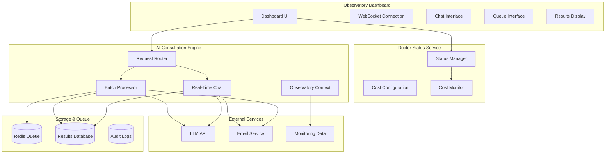

# Design Document

## Overview

The "Doctor Is In" AI Consultation System is a cost-controlled, queue-based AI interaction feature that integrates seamlessly into the Observatory monitoring dashboard. The system provides intelligent analysis of monitoring data while maintaining strict cost controls through a dual-mode approach: real-time consultation when "The Doctor Is In" and asynchronous queue processing when "The Doctor Is Out".

This design creates a sustainable AI-powered monitoring assistant that builds institutional knowledge while preventing runaway LLM costs through systematic availability management.

## Architecture

### High-Level Architecture



### Component Architecture

The system follows a modular architecture with clear separation of concerns:

1. **Frontend Integration**: Seamless integration into existing Observatory dashboard
2. **Status Management**: Centralized control of AI availability and cost monitoring
3. **Request Routing**: Intelligent routing between real-time and queue modes
4. **AI Processing**: Dual-mode AI consultation with Observatory context
5. **Storage Layer**: Persistent storage for results, queue, and audit trails
6. **Notification System**: Optional email notifications for query completion

## Components and Interfaces

### 1. Doctor Status Manager

**Purpose**: Centralized management of AI availability and cost controls

**Key Responsibilities**:
- Track real-time LLM costs and usage
- Enforce daily/monthly budget limits
- Manage "Doctor Is In/Out" status transitions
- Provide cost analytics and reporting

**Interface**:
```python
class DoctorStatusManager:
    def get_status() -> DoctorStatus
    def set_status(status: DoctorStatus, reason: str) -> bool
    def check_budget_limits() -> BudgetStatus
    def track_usage(tokens: int, cost: float) -> None
    def get_cost_analytics() -> CostAnalytics
```

**Configuration**:
- Daily/monthly budget limits
- Cost per token thresholds
- Auto-transition rules
- Alert thresholds

### 2. AI Consultation Router

**Purpose**: Route requests between real-time and queue processing based on doctor status

**Key Responsibilities**:
- Determine processing mode based on doctor status
- Validate and sanitize user queries
- Provide consistent interface for both modes
- Handle mode transitions gracefully

**Interface**:
```python
class ConsultationRouter:
    def submit_query(query: ConsultationQuery) -> ConsultationResponse
    def get_processing_mode() -> ProcessingMode
    def handle_mode_transition(query: ConsultationQuery) -> None
```

### 3. Real-Time Chat Engine

**Purpose**: Provide immediate AI consultation when doctor is available

**Key Responsibilities**:
- Maintain WebSocket connections for real-time chat
- Integrate Observatory monitoring context
- Stream LLM responses with cost tracking
- Handle session management and timeouts

**Interface**:
```python
class RealTimeChatEngine:
    def start_session(user_id: str, context: ObservatoryContext) -> ChatSession
    def process_message(session_id: str, message: str) -> AsyncIterator[str]
    def end_session(session_id: str) -> SessionSummary
    def get_session_cost(session_id: str) -> float
```

### 4. Batch Query Processor

**Purpose**: Process queued queries efficiently during off-peak times

**Key Responsibilities**:
- Manage Redis-based query queue
- Batch process queries for cost optimization
- Store results with full context and metadata
- Send optional email notifications

**Interface**:
```python
class BatchQueryProcessor:
    def queue_query(query: QueuedQuery) -> str  # Returns queue_id
    def process_batch(batch_size: int = 10) -> List[ProcessedQuery]
    def get_queue_status() -> QueueStatus
    def retrieve_result(queue_id: str) -> QueryResult
```

### 5. Observatory Context Provider

**Purpose**: Provide AI with relevant monitoring data and system context

**Key Responsibilities**:
- Extract current monitoring metrics and alerts
- Provide historical trend data
- Format monitoring data for LLM consumption
- Maintain data privacy and security

**Interface**:
```python
class ObservatoryContextProvider:
    def get_current_context(user_id: str) -> ObservatoryContext
    def get_metric_context(metric_names: List[str]) -> MetricContext
    def get_alert_context() -> AlertContext
    def format_for_llm(context: ObservatoryContext) -> str
```

### 6. Results Storage Manager

**Purpose**: Persistent storage and retrieval of consultation results

**Key Responsibilities**:
- Store consultation queries and responses
- Maintain searchable knowledge base
- Implement retention policies
- Provide audit trails

**Interface**:
```python
class ResultsStorageManager:
    def store_result(result: ConsultationResult) -> str
    def search_results(query: str, user_id: str) -> List[ConsultationResult]
    def get_user_history(user_id: str) -> List[ConsultationResult]
    def cleanup_old_results() -> int
```

### 7. Email Notification Service

**Purpose**: Send optional email notifications when query results are ready

**Key Responsibilities**:
- Send result notification emails
- Manage email preferences securely
- Provide unsubscribe functionality
- Track delivery status

**Interface**:
```python
class EmailNotificationService:
    def send_result_notification(email: str, result: ConsultationResult) -> bool
    def validate_email(email: str) -> bool
    def store_email_preference(user_id: str, email: str) -> None
    def remove_email_preference(user_id: str) -> None
```

## Data Models

### Core Data Models

```python
@dataclass
class ConsultationQuery:
    user_id: str
    query_text: str
    timestamp: datetime
    context_snapshot: ObservatoryContext
    email_notification: Optional[str] = None
    priority: QueryPriority = QueryPriority.NORMAL

@dataclass
class ConsultationResult:
    query_id: str
    query: ConsultationQuery
    response: str
    processing_mode: ProcessingMode
    cost: float
    tokens_used: int
    processing_time: float
    timestamp: datetime
    confidence_score: Optional[float] = None

@dataclass
class DoctorStatus:
    is_available: bool
    reason: str
    cost_budget_remaining: float
    daily_usage: float
    monthly_usage: float
    last_updated: datetime

@dataclass
class ObservatoryContext:
    current_metrics: Dict[str, Any]
    active_alerts: List[Alert]
    system_health: SystemHealth
    recent_events: List[Event]
    user_permissions: UserPermissions
```

### Queue Data Models

```python
@dataclass
class QueuedQuery:
    queue_id: str
    query: ConsultationQuery
    queued_at: datetime
    priority: QueryPriority
    estimated_cost: float
    retry_count: int = 0

@dataclass
class QueueStatus:
    total_queued: int
    processing: int
    estimated_wait_time: timedelta
    estimated_batch_cost: float
```

## Error Handling

### Error Categories and Strategies

1. **LLM API Failures**
   - Implement exponential backoff with jitter
   - Graceful degradation to queue mode
   - Clear error messages to users
   - Automatic retry for transient failures

2. **Cost Limit Exceeded**
   - Immediate transition to "Doctor Is Out" mode
   - Queue subsequent requests automatically
   - Alert administrators about budget limits
   - Provide clear user messaging about status

3. **Queue Overflow**
   - Implement priority-based queue management
   - Reject low-priority queries when at capacity
   - Provide queue status and wait time estimates
   - Alert administrators about capacity issues

4. **Context Data Unavailable**
   - Proceed with limited context when possible
   - Clearly indicate limitations to users
   - Log context failures for debugging
   - Provide fallback responses

5. **Email Notification Failures**
   - Log delivery failures for retry
   - Don't block query processing on email failures
   - Provide alternative notification methods
   - Track delivery success rates

### Error Response Format

```python
@dataclass
class ErrorResponse:
    error_code: str
    error_message: str
    user_message: str
    retry_possible: bool
    suggested_action: Optional[str] = None
    fallback_mode: Optional[ProcessingMode] = None
```

## Testing Strategy

### Unit Testing

1. **Component Testing**
   - Test each component in isolation
   - Mock external dependencies (LLM API, Redis, Database)
   - Test error conditions and edge cases
   - Validate data model serialization/deserialization

2. **Cost Calculation Testing**
   - Test budget limit enforcement
   - Validate cost tracking accuracy
   - Test automatic status transitions
   - Verify cost analytics calculations

3. **Queue Management Testing**
   - Test queue operations (add, remove, process)
   - Test priority handling
   - Test queue overflow scenarios
   - Validate batch processing logic

### Integration Testing

1. **End-to-End Workflows**
   - Test complete real-time consultation flow
   - Test complete queue processing flow
   - Test status transitions during active sessions
   - Test email notification delivery

2. **Observatory Integration**
   - Test context data extraction
   - Test monitoring data formatting
   - Test user permission handling
   - Test data privacy compliance

3. **External Service Integration**
   - Test LLM API integration with various response types
   - Test email service integration
   - Test Redis queue operations
   - Test database operations

### Performance Testing

1. **Load Testing**
   - Test concurrent real-time sessions
   - Test batch processing performance
   - Test queue throughput
   - Test database query performance

2. **Cost Optimization Testing**
   - Test batch processing cost efficiency
   - Test context optimization for token usage
   - Test query deduplication effectiveness
   - Validate cost tracking accuracy under load

### Security Testing

1. **Data Privacy**
   - Test monitoring data access controls
   - Test user data isolation
   - Test email address security
   - Test audit trail completeness

2. **Input Validation**
   - Test query sanitization
   - Test injection attack prevention
   - Test rate limiting effectiveness
   - Test authentication integration

## Implementation Considerations

### Observatory Dashboard Integration

The system integrates into the existing Observatory dashboard through:

1. **UI Components**
   - Doctor status indicator in dashboard header
   - Chat interface as collapsible sidebar
   - Queue submission form with optional email field
   - Results history panel

2. **WebSocket Integration**
   - Reuse existing WebSocket infrastructure
   - Add consultation-specific message types
   - Handle real-time status updates
   - Manage chat session state

3. **Authentication Integration**
   - Use existing user authentication
   - Respect user permissions for monitoring data
   - Maintain session security
   - Audit user actions

### Cost Management Strategy

1. **Budget Controls**
   - Daily and monthly spending limits
   - Per-user usage tracking
   - Automatic status transitions
   - Cost alerting and reporting

2. **Optimization Techniques**
   - Batch processing for cost efficiency
   - Context optimization to reduce token usage
   - Query deduplication and caching
   - Smart retry logic with backoff

3. **Monitoring and Analytics**
   - Real-time cost tracking
   - Usage pattern analysis
   - ROI measurement
   - Cost per insight metrics

### Scalability Considerations

1. **Horizontal Scaling**
   - Stateless service design
   - Redis-based queue for multi-instance support
   - Database connection pooling
   - Load balancer compatibility

2. **Performance Optimization**
   - Async processing where possible
   - Connection pooling for external services
   - Caching for frequently accessed data
   - Efficient database indexing

3. **Resource Management**
   - Memory usage monitoring
   - Connection limit management
   - Queue size limits
   - Automatic cleanup processes

## Security and Privacy

### Data Protection

1. **Monitoring Data Security**
   - Encrypt sensitive monitoring data in transit
   - Implement data access controls
   - Audit monitoring data access
   - Comply with data retention policies

2. **User Data Privacy**
   - Secure email address storage
   - Optional data collection with clear consent
   - User data deletion capabilities
   - Privacy-compliant audit trails

3. **Query and Response Security**
   - Sanitize user queries
   - Prevent data leakage in responses
   - Secure storage of consultation history
   - Implement data classification

### Authentication and Authorization

1. **User Authentication**
   - Integrate with existing Observatory auth
   - Maintain session security
   - Support multi-factor authentication
   - Handle session timeouts gracefully

2. **Permission Management**
   - Respect monitoring data permissions
   - Implement consultation access controls
   - Audit permission changes
   - Support role-based access

## Deployment and Operations

### Deployment Architecture

1. **Service Deployment**
   - Containerized microservices
   - Health check endpoints
   - Graceful shutdown handling
   - Rolling deployment support

2. **Infrastructure Requirements**
   - Redis cluster for queue management
   - Database for results storage
   - Email service integration
   - LLM API connectivity

3. **Configuration Management**
   - Environment-based configuration
   - Secure secrets management
   - Dynamic configuration updates
   - Configuration validation

### Monitoring and Observability

1. **Service Monitoring**
   - Health check endpoints
   - Performance metrics
   - Error rate monitoring
   - Cost tracking metrics

2. **Business Metrics**
   - Consultation success rates
   - User satisfaction scores
   - Cost per consultation
   - Queue processing efficiency

3. **Alerting**
   - Budget limit alerts
   - Service health alerts
   - Queue overflow alerts
   - Performance degradation alerts

This design provides a comprehensive foundation for implementing the "Doctor Is In" AI consultation system with proper cost controls, user experience, and integration with the Observatory monitoring platform.