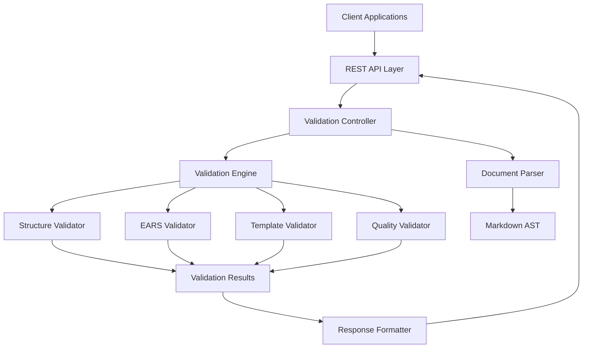

# Document Validation Service Design

## Overview

The Document Validation Service is a lightweight, focused microservice that validates markdown-based specification documents against predefined templates and standards. The service operates as a stateless validation engine with no external dependencies, providing fast and reliable document compliance checking.

**Architecture Pattern:** Layered Architecture with Plugin-based Validators
**Technology Stack:** Node.js/TypeScript with Express.js REST API
**Deployment Model:** Containerized microservice with horizontal scaling capability

## Architecture

### High-Level Architecture



### Service Layers

1. **API Layer**: REST endpoints for document validation requests
2. **Controller Layer**: Request handling and response formatting
3. **Validation Engine**: Core validation orchestration
4. **Parser Layer**: Markdown document parsing and AST generation
5. **Validator Plugins**: Specialized validation components
6. **Configuration Layer**: Template schemas and validation rules

## Components and Interfaces

### Core Components

#### DocumentParser
```typescript
interface DocumentParser {
  parseMarkdown(content: string): DocumentAST;
  extractSections(ast: DocumentAST): DocumentSection[];
  validateSyntax(content: string): SyntaxValidationResult;
}
```

#### ValidationEngine
```typescript
interface ValidationEngine {
  validateDocument(document: ParsedDocument, options: ValidationOptions): ValidationResult;
  registerValidator(validator: DocumentValidator): void;
  getValidators(): DocumentValidator[];
}
```

#### DocumentValidator (Plugin Interface)
```typescript
interface DocumentValidator extends ReflectiveModule {
  name: string;
  priority: number;
  validate(document: ParsedDocument): ValidatorResult;
  getSchema(): ValidationSchema;
}

// Base implementation
abstract class BaseDocumentValidator implements DocumentValidator {
  abstract name: string;
  abstract priority: number;
  
  abstract validate(document: ParsedDocument): ValidatorResult;
  abstract getSchema(): ValidationSchema;
  
  async getModuleStatus(): Promise<ModuleStatus> {
    return {
      name: this.name,
      status: 'healthy',
      uptime: process.uptime(),
      version: '1.0.0'
    };
  }
  
  async isHealthy(): Promise<boolean> {
    return true;
  }
  
  async getHealthIndicators(): Promise<HealthIndicator[]> {
    return [
      { name: 'validator_ready', status: 'UP', details: {} }
    ];
  }
  
  async gracefulShutdown(): Promise<void> {
    // Cleanup resources
  }
}
```

#### ValidationController
```typescript
interface ValidationController {
  validateSingle(request: ValidationRequest): Promise<ValidationResponse>;
  validateBatch(request: BatchValidationRequest): Promise<BatchValidationResponse>;
  getTemplates(): Promise<TemplateListResponse>;
}
```

### Validator Implementations

#### StructureValidator
- Validates document hierarchy and required sections
- Checks heading structure (H1, H2, H3) and numbering
- Verifies section content completeness
- Reports missing or malformed sections

#### EARSValidator
- Parses acceptance criteria for EARS format compliance
- Validates WHEN/IF/GIVEN + THEN + SHALL patterns
- Handles complex conditional logic (AND, OR operators)
- Provides confidence scoring for EARS compliance

#### TemplateValidator
- Loads and validates against predefined templates
- Supports multiple template types (requirements, design, tasks)
- Handles template versioning and backward compatibility
- Validates custom user-defined templates

#### QualityValidator
- Checks content completeness and quality metrics
- Validates user story format and acceptance criteria presence
- Applies configurable quality rules and thresholds
- Generates improvement recommendations

## Data Models

### Core Data Structures

```typescript
interface ParsedDocument {
  content: string;
  ast: DocumentAST;
  sections: DocumentSection[];
  metadata: DocumentMetadata;
}

interface DocumentSection {
  type: SectionType;
  title: string;
  content: string;
  level: number;
  lineNumber: number;
  subsections: DocumentSection[];
}

interface ValidationResult {
  isValid: boolean;
  score: number;
  violations: ValidationViolation[];
  recommendations: Recommendation[];
  metadata: ValidationMetadata;
}

interface ValidationViolation {
  severity: 'error' | 'warning' | 'info';
  validator: string;
  message: string;
  lineNumber?: number;
  suggestion?: string;
  ruleId: string;
}
```

### Template Schema

```typescript
interface TemplateSchema {
  name: string;
  version: string;
  requiredSections: SectionRequirement[];
  validationRules: ValidationRule[];
  metadata: TemplateMetadata;
}

interface SectionRequirement {
  name: string;
  required: boolean;
  minContent: number;
  maxContent?: number;
  subsections?: SectionRequirement[];
}
```

## Error Handling

### Error Categories

1. **Parsing Errors**: Invalid markdown syntax, malformed documents
2. **Validation Errors**: Rule violations, template non-compliance
3. **System Errors**: Service unavailable, timeout, resource limits
4. **Client Errors**: Invalid requests, unsupported formats

### Error Response Format

```python
from pydantic import BaseModel
from typing import Optional, Any
from datetime import datetime

class ErrorResponse(BaseModel):
    error: ErrorDetail

class ErrorDetail(BaseModel):
    code: str
    message: str
    details: Optional[Any] = None
    timestamp: datetime
    request_id: str
```

### Graceful Degradation

- Continue validation with available validators if one fails
- Provide partial results when possible
- Log errors for monitoring and debugging
- Return appropriate HTTP status codes

## Testing Strategy

### Unit Testing
- **Parser Tests**: Markdown parsing accuracy and AST generation
- **Validator Tests**: Individual validator logic and edge cases
- **Engine Tests**: Validation orchestration and result aggregation
- **API Tests**: Endpoint functionality and error handling

### Integration Testing
- **End-to-End Validation**: Complete document validation workflows
- **Template Compliance**: Validation against various template types
- **Batch Processing**: Multiple document validation scenarios
- **Error Scenarios**: Invalid input handling and error responses

### Performance Testing
- **Load Testing**: Concurrent validation requests (50+ simultaneous)
- **Stress Testing**: Large document processing (10,000+ words)
- **Memory Testing**: Resource usage under various loads
- **Response Time**: Sub-2-second validation requirements

### Test Data Strategy
- **Sample Documents**: Valid and invalid spec documents
- **Template Variations**: Different template types and versions
- **Edge Cases**: Malformed markdown, missing sections, complex EARS patterns
- **Performance Datasets**: Large documents for load testing

## Configuration and Deployment

### Configuration Management
- **Template Schemas**: Configurable validation templates
- **Validation Rules**: Adjustable quality thresholds and rules
- **API Settings**: Rate limiting, timeout configurations
- **Logging**: Structured logging with configurable levels

### Deployment Architecture
- **Containerization**: Docker containers for consistent deployment
- **Horizontal Scaling**: Multiple service instances behind load balancer
- **Health Checks**: Readiness and liveness probes
- **Monitoring**: Metrics collection and alerting

### Security Considerations
- **Input Validation**: Sanitize and validate all input documents
- **Rate Limiting**: Prevent abuse and ensure fair usage
- **Authentication**: Optional API key-based authentication
- **Data Privacy**: No persistent storage of validated documents