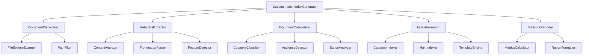
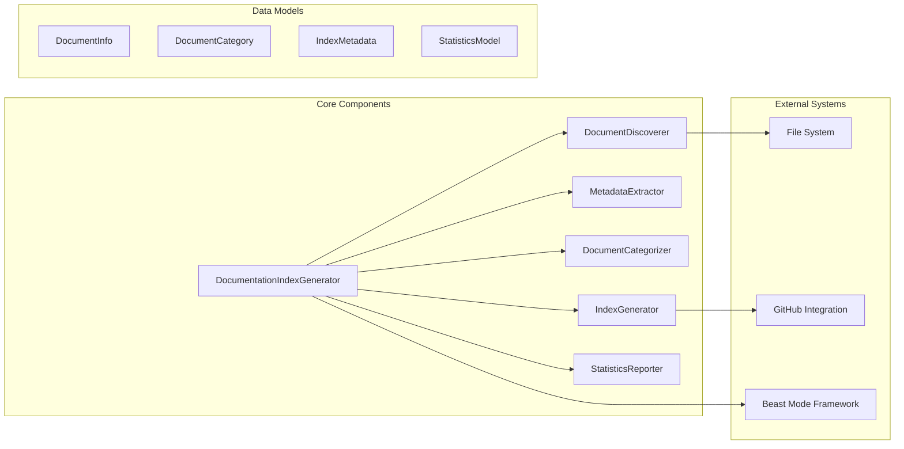

# Documentation Index Generator Design

## Overview

This design document specifies the architecture for the Documentation Index Generator system, which automatically discovers, analyzes, and organizes markdown documentation across repositories. The system transforms the existing ad-hoc implementation into a systematic, well-architected solution following Beast Mode framework patterns.

## Architecture

### System Architecture Diagram



### Component Relationships



## Components and Interfaces

### Core Orchestrator

**DocumentationIndexGenerator**

**Interface**:
```python
class DocumentationIndexGenerator(ReflectiveModule):
    def __init__(self, repository_root: str = ".", config: Optional[GeneratorConfig] = None):
        """Initialize with repository root and optional configuration"""
    
    def generate_complete_index(self) -> IndexGenerationResult:
        """Execute complete documentation indexing workflow"""
    
    def discover_documents(self) -> Dict[str, DocumentInfo]:
        """Discover all markdown documents and extract metadata"""
    
    def generate_category_indexes(self) -> None:
        """Generate README files for each category directory"""
    
    def generate_statistics_report(self) -> StatisticsReport:
        """Generate comprehensive documentation statistics"""
    
    def validate_existing_indexes(self) -> ValidationResult:
        """Validate existing indexes for consistency and completeness"""
```

**Responsibilities**:
- Orchestrate the complete documentation indexing workflow
- Coordinate between discovery, analysis, categorization, and generation components
- Provide health monitoring and status reporting via ReflectiveModule pattern
- Handle configuration management and system-wide error handling

### Document Discovery System

**DocumentDiscoverer**

**Interface**:
```python
class DocumentDiscoverer(ReflectiveModule):
    def __init__(self, repository_root: Path, exclusion_patterns: List[str]):
        """Initialize with repository root and exclusion patterns"""
    
    def scan_repository(self) -> List[Path]:
        """Scan repository for markdown files with filtering"""
    
    def apply_exclusion_filters(self, files: List[Path]) -> List[Path]:
        """Apply exclusion patterns to filter unwanted files"""
    
    def validate_file_accessibility(self, file_path: Path) -> bool:
        """Validate that file can be read and processed"""
```

**Responsibilities**:
- Scan file system for markdown documents
- Apply configurable exclusion patterns
- Handle file system errors and access issues
- Provide progress reporting for large repositories

### Metadata Extraction Engine

**MetadataExtractor**

**Interface**:
```python
class MetadataExtractor(ReflectiveModule):
    def __init__(self, content_analyzers: List[ContentAnalyzer]):
        """Initialize with content analysis components"""
    
    def extract_document_metadata(self, file_path: Path) -> DocumentInfo:
        """Extract comprehensive metadata from markdown document"""
    
    def parse_frontmatter(self, content: str) -> Dict[str, Any]:
        """Parse YAML frontmatter if present"""
    
    def analyze_content_structure(self, content: str) -> ContentFeatures:
        """Analyze document structure and features"""
    
    def extract_title_and_description(self, content: str) -> Tuple[str, str]:
        """Extract title and description from content"""
```

**Responsibilities**:
- Parse markdown content and extract metadata
- Handle multiple metadata sources (frontmatter, content analysis)
- Detect document features (TOC, examples, code blocks)
- Provide fallback values for missing metadata

### Document Categorization System

**DocumentCategorizer**

**Interface**:
```python
class DocumentCategorizer(ReflectiveModule):
    def __init__(self, category_rules: CategoryRules, audience_detector: AudienceDetector):
        """Initialize with categorization rules and audience detection"""
    
    def categorize_document(self, doc_info: DocumentInfo) -> CategoryResult:
        """Determine category and subcategory for document"""
    
    def detect_audience(self, content: str, file_path: Path) -> List[str]:
        """Detect target audience from content and context"""
    
    def analyze_status(self, content: str) -> DocumentStatus:
        """Analyze document status from content keywords"""
    
    def validate_categorization(self, result: CategoryResult) -> bool:
        """Validate categorization result for consistency"""
```

**Responsibilities**:
- Classify documents into appropriate categories
- Detect target audiences based on content analysis
- Determine document status and lifecycle stage
- Apply configurable categorization rules

### Index Generation Engine

**IndexGenerator**

**Interface**:
```python
class IndexGenerator(ReflectiveModule):
    def __init__(self, template_engine: TemplateEngine, output_config: OutputConfig):
        """Initialize with template engine and output configuration"""
    
    def generate_category_index(self, category: str, documents: List[DocumentInfo]) -> Path:
        """Generate README for specific category"""
    
    def generate_main_index(self, all_categories: Dict[str, List[DocumentInfo]]) -> Path:
        """Generate main documentation index"""
    
    def create_navigation_structure(self, categories: Dict[str, List[DocumentInfo]]) -> None:
        """Create directory structure for organized navigation"""
    
    def validate_generated_links(self, index_path: Path) -> ValidationResult:
        """Validate that generated links are accessible"""
```

**Responsibilities**:
- Generate organized README files for categories
- Create main documentation index with navigation
- Ensure GitHub-compatible directory structures
- Validate generated links and references

### Statistics and Reporting System

**StatisticsReporter**

**Interface**:
```python
class StatisticsReporter(ReflectiveModule):
    def __init__(self, metrics_calculator: MetricsCalculator):
        """Initialize with metrics calculation component"""
    
    def generate_statistics_report(self, documents: Dict[str, DocumentInfo]) -> StatisticsReport:
        """Generate comprehensive statistics report"""
    
    def calculate_coverage_metrics(self, documents: Dict[str, DocumentInfo]) -> CoverageMetrics:
        """Calculate documentation coverage and completeness metrics"""
    
    def analyze_content_quality(self, documents: Dict[str, DocumentInfo]) -> QualityMetrics:
        """Analyze content quality indicators"""
    
    def generate_trend_analysis(self, historical_data: List[StatisticsReport]) -> TrendAnalysis:
        """Generate trend analysis from historical statistics"""
```

**Responsibilities**:
- Calculate comprehensive documentation statistics
- Analyze coverage and quality metrics
- Generate formatted reports and visualizations
- Track trends and changes over time

## Data Models

### Core Data Structures

**DocumentInfo**:
```python
@dataclass
class DocumentInfo:
    path: Path
    title: str
    description: str
    category: str
    subcategory: str
    audience: List[str]
    status: DocumentStatus
    last_modified: datetime
    size: int
    word_count: int
    content_features: ContentFeatures
    metadata: Dict[str, Any]
```

**ContentFeatures**:
```python
@dataclass
class ContentFeatures:
    has_toc: bool
    has_examples: bool
    has_code: bool
    code_languages: List[str]
    heading_count: int
    link_count: int
    image_count: int
    complexity_score: float
```

**CategoryResult**:
```python
@dataclass
class CategoryResult:
    primary_category: DocumentCategory
    subcategory: str
    confidence_score: float
    alternative_categories: List[DocumentCategory]
    categorization_reasons: List[str]
```

### Configuration Models

**GeneratorConfig**:
```python
@dataclass
class GeneratorConfig:
    repository_root: str
    output_directory: str
    exclusion_patterns: List[str]
    category_rules: CategoryRules
    template_config: TemplateConfig
    github_integration: GitHubConfig
    performance_settings: PerformanceConfig
```

**CategoryRules**:
```python
@dataclass
class CategoryRules:
    path_patterns: Dict[str, DocumentCategory]
    content_keywords: Dict[DocumentCategory, List[str]]
    audience_keywords: Dict[str, List[str]]
    status_keywords: Dict[DocumentStatus, List[str]]
    custom_rules: List[CustomRule]
```

## Error Handling

### Error Categories

**File System Errors**:
- File access permissions
- Encoding issues
- Path resolution problems
- Directory creation failures

**Content Processing Errors**:
- Malformed markdown
- Invalid frontmatter
- Encoding detection failures
- Large file handling

**Generation Errors**:
- Template rendering failures
- Link validation errors
- Directory structure conflicts
- Output file writing issues

### Error Handling Strategy

**Graceful Degradation**:
- Continue processing when individual files fail
- Use fallback values for missing metadata
- Generate partial indexes when some categories fail
- Provide detailed error reporting without stopping execution

**Recovery Mechanisms**:
- Retry file operations with different encodings
- Skip problematic files with clear logging
- Generate alternative directory structures if conflicts occur
- Validate and repair broken links automatically

## Testing Strategy

### Unit Testing

**Component Testing**:
- DocumentDiscoverer: File scanning and filtering
- MetadataExtractor: Content parsing and analysis
- DocumentCategorizer: Classification accuracy
- IndexGenerator: Template rendering and link generation
- StatisticsReporter: Metrics calculation and reporting

**Data Model Testing**:
- DocumentInfo serialization and validation
- CategoryResult consistency and scoring
- Configuration model validation
- Error handling and edge cases

### Integration Testing

**Workflow Testing**:
- Complete indexing workflow with sample repositories
- Cross-component data flow validation
- Error propagation and recovery testing
- Performance testing with large document sets

**GitHub Integration Testing**:
- Link validation in GitHub environment
- Directory structure compatibility
- Markdown rendering verification
- Navigation functionality testing

### Performance Testing

**Scalability Testing**:
- Large repository processing (1000+ documents)
- Memory usage optimization
- Processing time benchmarks
- Concurrent processing capabilities

**Resource Management**:
- File handle management
- Memory leak detection
- CPU usage optimization
- Disk space requirements

## Integration Points

### Beast Mode Framework Integration

**ReflectiveModule Compliance**:
- Health monitoring endpoints
- Performance metrics collection
- Structured logging with correlation IDs
- Systematic error handling and recovery

**Framework Services**:
- Configuration management integration
- Logging infrastructure utilization
- Monitoring and alerting integration
- Testing framework compatibility

### GitHub Integration

**Native Navigation Support**:
- GitHub-flavored markdown compatibility
- Relative link generation for GitHub rendering
- Directory structure optimization for GitHub UI
- GitHub Pages integration support

**Repository Integration**:
- Git metadata utilization for document tracking
- Branch-aware documentation generation
- Pull request integration for documentation updates
- GitHub Actions workflow integration

### External Tool Integration

**Documentation Tools**:
- Sphinx integration for advanced documentation
- MkDocs compatibility for documentation sites
- Gitiles integration for code review documentation
- Wiki system integration for collaborative editing

**Development Workflow**:
- Pre-commit hook integration for automatic indexing
- CI/CD pipeline integration for documentation validation
- IDE plugin support for real-time documentation updates
- Documentation linting and quality checking integration

This design provides a comprehensive, systematic approach to documentation indexing that transforms the existing ad-hoc implementation into a robust, maintainable system following Beast Mode framework principles and supporting the full range of requirements identified in the specification.