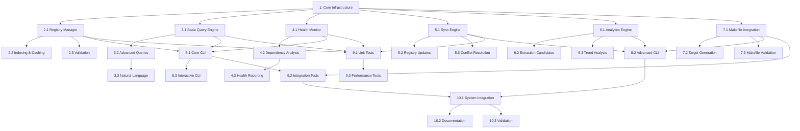

# Task DAG Analysis for Parallel Execution

## Dependency Analysis

### Critical Path Dependencies

## Parallel Execution Waves

### Wave 1: Foundation (Sequential - Critical Path)
**Duration: ~3-5 days**
- **Task 1**: Set up core domain system infrastructure
  - Must complete first - all other tasks depend on this foundation

### Wave 2: Core Components (Parallel Execution)
**Duration: ~8-12 days (parallel)**

**Parallel Track A: Domain Registry (2-3 days)**
- **Task 2.1**: Create DomainRegistryManager class with JSON registry loading
- **Task 2.2**: Implement domain indexing and caching system (depends on 2.1)
- **Task 2.3**: Add domain validation and consistency checking (depends on 2.1)

**Parallel Track B: Query Engine (3-4 days)**
- **Task 3.1**: Implement basic pattern and content-based search
- **Task 3.2**: Add advanced query capabilities (depends on 3.1)
- **Task 3.3**: Implement natural language query processing (depends on 3.2)

**Parallel Track C: Health Monitoring (3-4 days)**
- **Task 4.1**: Implement domain health checking infrastructure
- **Task 4.2**: Add comprehensive dependency analysis (depends on 4.1)
- **Task 4.3**: Build health reporting and alerting system (depends on 4.2)

**Parallel Track D: Synchronization Engine (3-4 days)**
- **Task 5.1**: Implement filesystem synchronization
- **Task 5.2**: Add automated registry updates (depends on 5.1)
- **Task 5.3**: Build conflict resolution system (depends on 5.1)

**Parallel Track E: Analytics Engine (3-4 days)**
- **Task 6.1**: Implement domain metrics calculation
- **Task 6.2**: Add extraction candidate identification (depends on 6.1)
- **Task 6.3**: Build trend analysis and evolution tracking (depends on 6.1)

**Parallel Track F: Makefile Integration (2-3 days)**
- **Task 7.1**: Create Makefile integration layer
- **Task 7.2**: Add automated makefile target generation (depends on 7.1)
- **Task 7.3**: Build makefile health validation (depends on 7.1)

### Wave 3: Interface Layer (Parallel Execution)
**Duration: ~5-7 days (parallel)**

**Parallel Track G: CLI Development (4-5 days)**
- **Task 8.1**: Create core CLI commands (depends on 2.1, 3.1, 4.1)
- **Task 8.2**: Add advanced CLI operations (depends on 5.1, 6.1, 7.1)
- **Task 8.3**: Build interactive CLI features (depends on 8.1)

**Parallel Track H: Unit Testing (3-4 days)**
- **Task 9.1**: Implement unit tests for all core components (depends on 2.1, 3.1, 4.1, 5.1)

### Wave 4: Integration and Testing (Sequential Dependencies)
**Duration: ~4-6 days**

**Sequential Track I: Advanced Testing (2-3 days)**
- **Task 9.2**: Build integration tests (depends on 8.1, 7.1)
- **Task 9.3**: Add performance and reliability tests (depends on 9.1)

### Wave 5: Finalization (Sequential)
**Duration: ~3-5 days**

**Sequential Track J: System Completion (3-5 days)**
- **Task 10.1**: Wire all components together (depends on 8.2, 9.2)
- **Task 10.2**: Add documentation and examples (depends on 10.1)
- **Task 10.3**: Validate against existing domain registry (depends on 10.1)

## Optimized Execution Strategy

### Resource Allocation Recommendations

**For 3-4 Developers:**
- **Developer 1**: Domain Registry Manager (Track A) → CLI Core (Track G.1) → Integration (Track J)
- **Developer 2**: Query Engine (Track B) → CLI Advanced (Track G.2) → Documentation (Track J.2)
- **Developer 3**: Health Monitoring (Track C) → Unit Tests (Track H) → Validation (Track J.3)
- **Developer 4**: Sync Engine (Track D) + Analytics (Track E) + Makefile Integration (Track F) → Integration Tests (Track I)

**For 2 Developers:**
- **Developer 1**: Tracks A, B, C → Tracks G.1, H → Track J.1, J.2
- **Developer 2**: Tracks D, E, F → Tracks G.2, G.3 → Track I → Track J.3

**For 1 Developer (Sequential):**
- Follow the wave structure but execute sequentially within each wave
- Prioritize critical path: 1 → 2.1 → 3.1 → 4.1 → 8.1 → 9.1 → 10.1

### Critical Dependencies to Monitor

1. **Task 1 → All Wave 2 tasks**: Core infrastructure must be complete
2. **Task 2.1 → Tasks 2.2, 2.3, 8.1, 9.1**: Registry manager is foundation for many components
3. **Tasks 3.1, 4.1, 5.1 → Task 8.1**: Core CLI needs basic functionality from each engine
4. **Task 8.1 → Task 9.2**: Integration tests need CLI interface
5. **Task 9.2 → Task 10.1**: System integration needs integration tests

### Parallel Execution Benefits

**Time Savings:**
- **Sequential Execution**: ~25-35 days
- **Parallel Execution (4 developers)**: ~15-20 days
- **Time Reduction**: ~40-45%

**Risk Mitigation:**
- Independent tracks reduce blocking dependencies
- Early unit testing catches issues before integration
- Parallel CLI development allows early user feedback

### Coordination Points

**Daily Standups Focus:**
- Interface compatibility between parallel tracks
- Shared data model changes that affect multiple tracks
- Integration readiness status for each track

**Weekly Integration:**
- Merge and test compatibility between tracks
- Resolve any interface conflicts early
- Validate shared components work across tracks

**Critical Handoff Points:**
1. **End of Wave 1**: Core infrastructure ready for all tracks
2. **End of Wave 2**: All engines ready for CLI integration
3. **End of Wave 3**: System ready for comprehensive testing
4. **End of Wave 4**: System ready for final integration

This DAG analysis shows significant opportunities for parallel execution, potentially reducing development time by 40-45% with proper resource allocation and coordination.