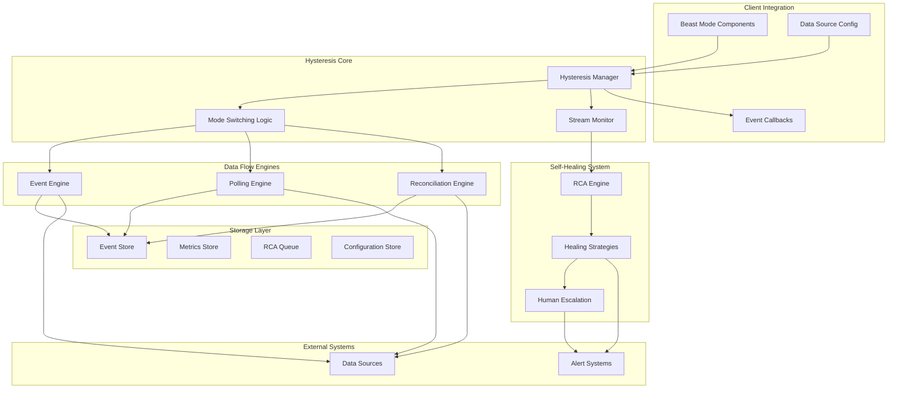

# Design Document

## Overview

The Event/Polling Hysteresis Service is a foundational Beast Mode component that provides a systematic pattern for event-driven systems with polling fallback, reconciliation loops, and self-healing RCA. This service implements the meta-pattern of "event-first with systematic fallback" that can be reused across all Beast Mode components requiring reliable data flow.

## Architecture

### Core Design Principles

#### Event-First with Hysteresis
**"Prefer events, fallback to polling, prevent oscillation"** - The service prioritizes event-driven updates but automatically switches to polling when events fail, using hysteresis loops to prevent rapid mode switching.

#### Self-Healing by Design
**"Monitor, Detect, RCA, Fix"** - Built-in monitoring detects failures, queues automatic RCA analysis, and implements healing strategies without external intervention.

#### Multi-Tenant Isolation
**"Each tenant gets independent reliability"** - Complete isolation of event streams, polling schedules, and failure handling per tenant (hackathon).

### High-Level Architecture



### Technology Stack

- **Core Service**: Python 3.9+ with FastAPI for HTTP APIs
- **Event Processing**: asyncio for concurrent event handling
- **Storage**: PostgreSQL for configuration, InfluxDB for metrics, Redis for caching
- **Message Queue**: Redis Pub/Sub for internal event distribution
- **Monitoring**: Prometheus metrics, structured logging with correlation IDs

## Components and Interfaces

### 1. Hysteresis Manager

```python
from beast_mode.core import ReflectiveModule
from typing import Dict, List, Optional, Callable, Any
import asyncio
from datetime import datetime, timedelta
from enum import Enum

class DataFlowMode(str, Enum):
    EVENT_ONLY = "event_only"
    POLLING_ONLY = "polling_only"
    HYBRID = "hybrid"
    TRANSITION = "transition"

class DataSourceConfig(BaseModel):
    """Configuration for a data source with event/polling capabilities"""
    name: str
    tenant_id: str
    event_source: Optional[Callable] = None
    polling_source: Callable
    reconciliation_source: Optional[Callable] = None
    
    # Timing configuration
    polling_interval: timedelta = timedelta(minutes=5)
    reconciliation_interval: timedelta = timedelta(minutes=15)
    event_timeout: timedelta = timedelta(seconds=30)
    
    # Hysteresis configuration
    failure_threshold: int = 3  # Events failures before switching to polling
    success_threshold: int = 5  # Event successes before switching from polling
    max_hysteresis: int = 10    # Maximum threshold during oscillation
    
    # Callbacks
    data_callback: Callable[[str, Dict], None]
    error_callback: Optional[Callable[[str, Exception], None]] = None

class HysteresisManager(ReflectiveModule):
    """Central manager for event/polling hysteresis across all data sources"""
    
    def __init__(self):
        super().__init__()
        self.data_sources: Dict[str, DataSourceConfig] = {}
        self.mode_states: Dict[str, DataFlowMode] = {}
        self.failure_counts: Dict[str, int] = {}
        self.success_counts: Dict[str, int] = {}
        self.hysteresis_levels: Dict[str, int] = {}
        
        self.event_engine = EventEngine()
        self.polling_engine = PollingEngine()
        self.reconciliation_engine = ReconciliationEngine()
        self.stream_monitor = StreamMonitor()
        self.rca_engine = RCAEngine()
        
    async def register_data_source(self, config: DataSourceConfig) -> str:
        """Register a new data source with hysteresis management"""
        source_id = f"{config.tenant_id}_{config.name}"
        
        self.data_sources[source_id] = config
        self.mode_states[source_id] = DataFlowMode.EVENT_ONLY if config.event_source else DataFlowMode.POLLING_ONLY
        self.failure_counts[source_id] = 0
        self.success_counts[source_id] = 0
        self.hysteresis_levels[source_id] = config.failure_threshold
        
        # Start monitoring and data flow
        await self.start_data_flow(source_id)
        
        return source_id
        
    async def start_data_flow(self, source_id: str):
        """Start data flow for a registered source"""
        config = self.data_sources[source_id]
        mode = self.mode_states[source_id]
        
        # Start appropriate engines based on mode
        if mode in [DataFlowMode.EVENT_ONLY, DataFlowMode.HYBRID]:
            if config.event_source:
                await self.event_engine.start_event_stream(source_id, config)
                
        if mode in [DataFlowMode.POLLING_ONLY, DataFlowMode.HYBRID]:
            await self.polling_engine.start_polling(source_id, config)
            
        # Always start reconciliation if available
        if config.reconciliation_source:
            await self.reconciliation_engine.start_reconciliation(source_id, config)
            
        # Start monitoring
        await self.stream_monitor.start_monitoring(source_id, config)
        
    async def handle_event_success(self, source_id: str, data: Dict):
        """Handle successful event processing"""
        self.success_counts[source_id] += 1
        self.failure_counts[source_id] = 0  # Reset failure count
        
        # Check if we should switch from polling to events
        await self.check_mode_switch(source_id)
        
        # Process the data
        config = self.data_sources[source_id]
        await config.data_callback(source_id, data)
        
    async def handle_event_failure(self, source_id: str, error: Exception):
        """Handle event processing failure"""
        self.failure_counts[source_id] += 1
        self.success_counts[source_id] = 0  # Reset success count
        
        # Queue for RCA
        await self.rca_engine.queue_failure(source_id, "event_failure", error)
        
        # Check if we should switch to polling
        await self.check_mode_switch(source_id)
        
        # Handle error callback
        config = self.data_sources[source_id]
        if config.error_callback:
            await config.error_callback(source_id, error)
            
    async def check_mode_switch(self, source_id: str):
        """Check if mode switching is needed based on hysteresis logic"""
        config = self.data_sources[source_id]
        current_mode = self.mode_states[source_id]
        failure_count = self.failure_counts[source_id]
        success_count = self.success_counts[source_id]
        threshold = self.hysteresis_levels[source_id]
        
        should_switch = False
        new_mode = current_mode
        
        # Check for switch to polling due to event failures
        if current_mode == DataFlowMode.EVENT_ONLY and failure_count >= threshold:
            new_mode = DataFlowMode.POLLING_ONLY if not config.event_source else DataFlowMode.HYBRID
            should_switch = True
            
        # Check for switch to events due to polling success
        elif current_mode == DataFlowMode.POLLING_ONLY and success_count >= config.success_threshold:
            if config.event_source:
                new_mode = DataFlowMode.EVENT_ONLY
                should_switch = True
                
        if should_switch:
            await self.switch_mode(source_id, new_mode)
            
    async def switch_mode(self, source_id: str, new_mode: DataFlowMode):
        """Switch data flow mode with transition handling"""
        old_mode = self.mode_states[source_id]
        
        self.logger.info(f"Switching {source_id} from {old_mode} to {new_mode}")
        
        # Set transition state
        self.mode_states[source_id] = DataFlowMode.TRANSITION
        
        # Stop old mode engines
        if old_mode == DataFlowMode.EVENT_ONLY:
            await self.event_engine.stop_event_stream(source_id)
        elif old_mode == DataFlowMode.POLLING_ONLY:
            await self.polling_engine.stop_polling(source_id)
            
        # Start new mode engines
        config = self.data_sources[source_id]
        if new_mode == DataFlowMode.EVENT_ONLY:
            await self.event_engine.start_event_stream(source_id, config)
        elif new_mode == DataFlowMode.POLLING_ONLY:
            await self.polling_engine.start_polling(source_id, config)
        elif new_mode == DataFlowMode.HYBRID:
            await self.event_engine.start_event_stream(source_id, config)
            await self.polling_engine.start_polling(source_id, config)
            
        # Complete transition
        self.mode_states[source_id] = new_mode
        
        # Adjust hysteresis levels if oscillation detected
        await self.adjust_hysteresis_levels(source_id)
        
    async def adjust_hysteresis_levels(self, source_id: str):
        """Adjust hysteresis levels to prevent oscillation"""
        # Simple oscillation detection: if we've switched modes recently
        # In a real implementation, this would track mode switch history
        
        config = self.data_sources[source_id]
        current_level = self.hysteresis_levels[source_id]
        
        # Increase hysteresis if we're switching too frequently
        if current_level < config.max_hysteresis:
            self.hysteresis_levels[source_id] = min(
                current_level + 1, 
                config.max_hysteresis
            )
            self.logger.info(f"Increased hysteresis level for {source_id} to {self.hysteresis_levels[source_id]}")
```

### 2. Event Engine

```python
class EventEngine(ReflectiveModule):
    """Handles event-driven data flow with monitoring"""
    
    def __init__(self):
        super().__init__()
        self.active_streams: Dict[str, asyncio.Task] = {}
        self.event_timeouts: Dict[str, datetime] = {}
        
    async def start_event_stream(self, source_id: str, config: DataSourceConfig):
        """Start event stream for a data source"""
        if source_id in self.active_streams:
            await self.stop_event_stream(source_id)
            
        task = asyncio.create_task(self.event_stream_loop(source_id, config))
        self.active_streams[source_id] = task
        
    async def stop_event_stream(self, source_id: str):
        """Stop event stream for a data source"""
        if source_id in self.active_streams:
            self.active_streams[source_id].cancel()
            del self.active_streams[source_id]
            
    async def event_stream_loop(self, source_id: str, config: DataSourceConfig):
        """Main event stream processing loop"""
        while True:
            try:
                # Set timeout for event reception
                self.event_timeouts[source_id] = datetime.now() + config.event_timeout
                
                # Wait for event from source
                event_data = await config.event_source()
                
                # Clear timeout
                if source_id in self.event_timeouts:
                    del self.event_timeouts[source_id]
                    
                # Process event
                await self.process_event(source_id, event_data)
                
            except asyncio.CancelledError:
                break
            except Exception as e:
                await self.handle_event_error(source_id, e)
                await asyncio.sleep(1)  # Brief pause before retry
                
    async def process_event(self, source_id: str, event_data: Dict):
        """Process received event data"""
        # Validate event data
        if not self.validate_event_data(event_data):
            raise ValueError("Invalid event data format")
            
        # Store event for audit trail
        await self.store_event(source_id, event_data)
        
        # Notify hysteresis manager of success
        from .hysteresis_manager import HysteresisManager
        manager = HysteresisManager.get_instance()
        await manager.handle_event_success(source_id, event_data)
        
    async def handle_event_error(self, source_id: str, error: Exception):
        """Handle event processing errors"""
        self.logger.error(f"Event error for {source_id}: {error}")
        
        # Notify hysteresis manager of failure
        from .hysteresis_manager import HysteresisManager
        manager = HysteresisManager.get_instance()
        await manager.handle_event_failure(source_id, error)
        
    async def check_event_timeouts(self):
        """Check for event timeouts and handle them"""
        now = datetime.now()
        timed_out = []
        
        for source_id, timeout_time in self.event_timeouts.items():
            if now > timeout_time:
                timed_out.append(source_id)
                
        for source_id in timed_out:
            await self.handle_event_error(
                source_id, 
                TimeoutError(f"Event timeout for {source_id}")
            )
            del self.event_timeouts[source_id]
```

### 3. Polling Engine

```python
class PollingEngine(ReflectiveModule):
    """Handles polling-based data flow with adaptive intervals"""
    
    def __init__(self):
        super().__init__()
        self.polling_tasks: Dict[str, asyncio.Task] = {}
        self.polling_intervals: Dict[str, timedelta] = {}
        
    async def start_polling(self, source_id: str, config: DataSourceConfig):
        """Start polling for a data source"""
        if source_id in self.polling_tasks:
            await self.stop_polling(source_id)
            
        self.polling_intervals[source_id] = config.polling_interval
        task = asyncio.create_task(self.polling_loop(source_id, config))
        self.polling_tasks[source_id] = task
        
    async def stop_polling(self, source_id: str):
        """Stop polling for a data source"""
        if source_id in self.polling_tasks:
            self.polling_tasks[source_id].cancel()
            del self.polling_tasks[source_id]
            del self.polling_intervals[source_id]
            
    async def polling_loop(self, source_id: str, config: DataSourceConfig):
        """Main polling loop"""
        while True:
            try:
                # Poll data source
                poll_data = await config.polling_source()
                
                # Process polled data
                await self.process_poll_data(source_id, poll_data)
                
                # Wait for next poll interval
                interval = self.polling_intervals[source_id]
                await asyncio.sleep(interval.total_seconds())
                
            except asyncio.CancelledError:
                break
            except Exception as e:
                await self.handle_poll_error(source_id, e)
                await asyncio.sleep(5)  # Brief pause before retry
                
    async def process_poll_data(self, source_id: str, poll_data: Dict):
        """Process polled data"""
        # Store poll data for audit trail
        await self.store_poll_data(source_id, poll_data)
        
        # Notify hysteresis manager of success
        from .hysteresis_manager import HysteresisManager
        manager = HysteresisManager.get_instance()
        await manager.handle_event_success(source_id, poll_data)
        
    async def handle_poll_error(self, source_id: str, error: Exception):
        """Handle polling errors"""
        self.logger.error(f"Polling error for {source_id}: {error}")
        
        # Notify hysteresis manager of failure
        from .hysteresis_manager import HysteresisManager
        manager = HysteresisManager.get_instance()
        await manager.handle_event_failure(source_id, error)
        
    async def adapt_polling_interval(self, source_id: str, load_factor: float):
        """Adapt polling interval based on system load"""
        if source_id in self.polling_intervals:
            base_interval = self.polling_intervals[source_id]
            # Increase interval under high load, decrease under low load
            adapted_interval = base_interval * (1 + load_factor)
            self.polling_intervals[source_id] = adapted_interval
```

### 4. Self-Healing RCA Engine

```python
class RCAEngine(ReflectiveModule):
    """Root Cause Analysis and Self-Healing Engine"""
    
    def __init__(self):
        super().__init__()
        self.failure_queue = asyncio.Queue()
        self.healing_strategies = {
            'event_timeout': self.heal_event_timeout,
            'polling_failure': self.heal_polling_failure,
            'data_inconsistency': self.heal_data_inconsistency,
            'connection_failure': self.heal_connection_failure
        }
        self.rca_history: Dict[str, List[RCAResult]] = {}
        
    async def queue_failure(self, source_id: str, failure_type: str, error: Exception):
        """Queue a failure for RCA analysis"""
        failure_record = FailureRecord(
            source_id=source_id,
            failure_type=failure_type,
            error=str(error),
            timestamp=datetime.now(),
            context=await self.gather_failure_context(source_id)
        )
        
        await self.failure_queue.put(failure_record)
        
    async def process_rca_queue(self):
        """Process RCA queue continuously"""
        while True:
            try:
                failure = await self.failure_queue.get()
                
                # Perform RCA analysis
                rca_result = await self.analyze_failure(failure)
                
                # Store RCA result
                if failure.source_id not in self.rca_history:
                    self.rca_history[failure.source_id] = []
                self.rca_history[failure.source_id].append(rca_result)
                
                # Attempt self-healing
                healing_strategy = self.healing_strategies.get(rca_result.root_cause_category)
                if healing_strategy:
                    success = await healing_strategy(failure, rca_result)
                    
                    if success:
                        self.logger.info(f"Self-healing successful for {failure.source_id}")
                        rca_result.healing_successful = True
                    else:
                        self.logger.warning(f"Self-healing failed for {failure.source_id}")
                        await self.escalate_to_human(failure, rca_result)
                else:
                    # Unknown failure type, escalate immediately
                    await self.escalate_to_human(failure, rca_result)
                    
            except Exception as e:
                self.logger.error(f"RCA processing failed: {e}")
                
    async def analyze_failure(self, failure: FailureRecord) -> RCAResult:
        """Analyze failure and determine root cause"""
        # Simple rule-based RCA (could be enhanced with ML)
        root_cause_category = "unknown"
        confidence = 0.5
        
        if "timeout" in failure.error.lower():
            root_cause_category = "event_timeout"
            confidence = 0.8
        elif "connection" in failure.error.lower():
            root_cause_category = "connection_failure"
            confidence = 0.9
        elif "poll" in failure.failure_type:
            root_cause_category = "polling_failure"
            confidence = 0.7
            
        return RCAResult(
            failure_id=failure.id,
            root_cause_category=root_cause_category,
            confidence=confidence,
            analysis_timestamp=datetime.now(),
            recommended_actions=self.get_recommended_actions(root_cause_category),
            healing_successful=False
        )
        
    async def heal_event_timeout(self, failure: FailureRecord, rca: RCAResult) -> bool:
        """Heal event timeout issues"""
        try:
            # Restart event stream with longer timeout
            from .hysteresis_manager import HysteresisManager
            manager = HysteresisManager.get_instance()
            
            config = manager.data_sources[failure.source_id]
            config.event_timeout = config.event_timeout * 1.5  # Increase timeout
            
            await manager.event_engine.stop_event_stream(failure.source_id)
            await asyncio.sleep(2)  # Brief pause
            await manager.event_engine.start_event_stream(failure.source_id, config)
            
            return True
        except Exception as e:
            self.logger.error(f"Event timeout healing failed: {e}")
            return False
            
    async def heal_connection_failure(self, failure: FailureRecord, rca: RCAResult) -> bool:
        """Heal connection failure issues"""
        try:
            # Implement exponential backoff and retry
            for attempt in range(3):
                await asyncio.sleep(2 ** attempt)  # Exponential backoff
                
                # Test connection
                if await self.test_connection(failure.source_id):
                    # Connection restored, restart data flow
                    from .hysteresis_manager import HysteresisManager
                    manager = HysteresisManager.get_instance()
                    await manager.start_data_flow(failure.source_id)
                    return True
                    
            return False
        except Exception as e:
            self.logger.error(f"Connection healing failed: {e}")
            return False
```

## Data Models

```python
from pydantic import BaseModel
from datetime import datetime
from typing import Dict, List, Optional, Any
from enum import Enum

class FailureRecord(BaseModel):
    """Record of system failures for RCA"""
    id: str = Field(default_factory=lambda: str(uuid.uuid4()))
    source_id: str
    failure_type: str
    error: str
    timestamp: datetime
    context: Dict[str, Any]

class RCAResult(BaseModel):
    """Result of RCA analysis"""
    failure_id: str
    root_cause_category: str
    confidence: float
    analysis_timestamp: datetime
    recommended_actions: List[str]
    healing_successful: bool = False

class StreamHealth(BaseModel):
    """Health status of a data stream"""
    source_id: str
    mode: DataFlowMode
    last_success: Optional[datetime]
    last_failure: Optional[datetime]
    failure_count: int
    success_count: int
    health_score: float  # 0.0 to 1.0

class HysteresisMetrics(BaseModel):
    """Metrics for hysteresis service performance"""
    source_id: str
    mode_switches: int
    total_events: int
    total_polls: int
    average_latency: float
    error_rate: float
    uptime_percentage: float
```

## Error Handling

### Graceful Degradation Strategy

1. **Event Stream Failures**: Automatic switch to polling mode with hysteresis
2. **Polling Failures**: Exponential backoff with circuit breaker pattern
3. **Data Source Unavailable**: Cached data with staleness indicators
4. **RCA Engine Failures**: Continue operation with reduced self-healing
5. **Storage Failures**: In-memory fallback with data persistence on recovery

### Circuit Breaker Implementation

```python
class CircuitBreaker:
    """Circuit breaker for external service calls"""
    
    def __init__(self, failure_threshold: int = 5, timeout: int = 60):
        self.failure_threshold = failure_threshold
        self.timeout = timeout
        self.failure_count = 0
        self.last_failure_time = None
        self.state = "closed"  # closed, open, half-open
        
    async def call(self, func, *args, **kwargs):
        """Execute function with circuit breaker protection"""
        if self.state == "open":
            if datetime.now() - self.last_failure_time > timedelta(seconds=self.timeout):
                self.state = "half-open"
            else:
                raise CircuitBreakerOpenError("Circuit breaker is open")
                
        try:
            result = await func(*args, **kwargs)
            self.on_success()
            return result
        except Exception as e:
            self.on_failure()
            raise
            
    def on_success(self):
        """Handle successful call"""
        self.failure_count = 0
        self.state = "closed"
        
    def on_failure(self):
        """Handle failed call"""
        self.failure_count += 1
        self.last_failure_time = datetime.now()
        
        if self.failure_count >= self.failure_threshold:
            self.state = "open"
```

## Testing Strategy

### Test Categories

1. **Unit Tests**: Individual component functionality, hysteresis logic, RCA algorithms
2. **Integration Tests**: Multi-component workflows, external service integration
3. **Chaos Tests**: Failure injection, network partitions, service unavailability
4. **Performance Tests**: High-throughput event processing, concurrent tenant handling
5. **Reliability Tests**: Long-running stability, memory leak detection, recovery validation

This design provides a comprehensive, reusable foundation for event-driven systems with systematic reliability patterns that can be adopted across all Beast Mode components.