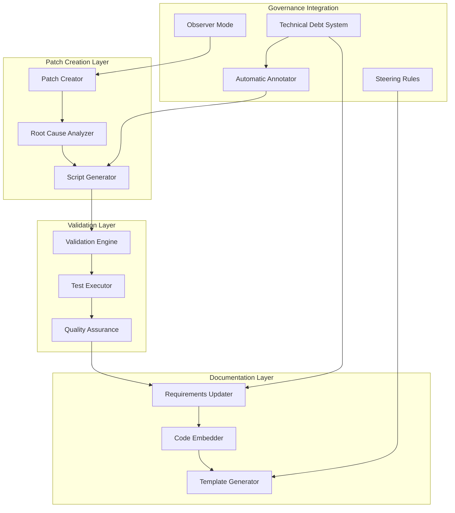

# Design Document

## Overview

The Executable Patch Code Governance System transforms the traditional approach to code patching from documentation-based to code-based. Instead of describing what needs to be fixed, this system requires creating executable scripts that demonstrate the exact fix, making requirements precise, immediately actionable, and reusable.

## Architecture

### Design Principles

1. **Code as Specification**: The clearest specification is working code that solves the problem
2. **Executable Documentation**: Requirements include runnable code that demonstrates solutions
3. **Systematic Reusability**: Patch scripts serve as templates for similar problems
4. **Validation-First**: Every fix includes validation to ensure it works correctly
5. **Observer Mode Integration**: Seamlessly integrates with observer mode governance
6. **Future LLM Friendly**: Designed for LLMs to understand and apply fixes

### Core Components



## Components and Interfaces

### Patch Script Template Engine

**Purpose**: Generate standardized patch scripts that follow the executable code governance pattern

**Key Interfaces**:
- `IPatchScriptGenerator`: Creates patch scripts from problem descriptions
- `ITemplateManager`: Manages reusable patch script templates
- `IValidationGenerator`: Creates validation functions for patch scripts

**Responsibilities**:
- Generate executable patch scripts with standard structure
- Create validation functions that check all acceptance criteria
- Provide CLI interfaces for easy usage and automation
- Ensure scripts follow governance patterns and best practices

### Requirements Integration Engine

**Purpose**: Automatically update requirements documents with executable code examples

**Key Interfaces**:
- `IRequirementsUpdater`: Updates requirement documents with patch code
- `ICodeEmbedder`: Embeds executable code examples in requirements
- `IUsageDocumenter`: Generates usage instructions for patch scripts

**Responsibilities**:
- Parse existing requirements and identify where patches apply
- Embed executable code examples in appropriate requirement sections
- Generate clear usage instructions for applying and validating fixes
- Maintain traceability between problems, fixes, and requirements

### Automatic Technical Debt Annotator

**Purpose**: Automatically generate technical debt annotations for all patches created by executable patch scripts

**Key Interfaces**:
- `IAnnotationGenerator`: Creates standardized technical debt annotations
- `IDebtLevelAssessor`: Assesses debt level based on component and bypass type
- `ICleanupGuidanceGenerator`: Generates specific cleanup instructions
- `IValidationCriteriaGenerator`: Creates comprehensive validation criteria

**Responsibilities**:
- Generate unique patch identifiers for tracking
- Assess debt level based on component impact and bypass type
- Create specific, actionable cleanup guidance
- Generate comprehensive validation criteria for patch removal
- Ensure all patches are properly annotated for tracking and management
- Integrate with existing technical debt discovery and management systems

### Validation and Quality Assurance Engine

**Purpose**: Ensure all patch scripts work correctly and meet quality standards

**Key Interfaces**:
- `IPatchValidator`: Validates patch scripts execute correctly
- `IQualityChecker`: Checks patch scripts meet governance standards
- `ITestRunner`: Runs patch script tests and validations

**Responsibilities**:
- Execute patch scripts to ensure they work without errors
- Validate that fixes actually solve the stated problems
- Check that patch scripts follow governance patterns
- Generate quality reports and recommendations

## Data Models

### PatchScript
```python
@dataclass
class PatchScript:
    """Represents an executable patch script."""
    script_name: str
    problem_description: str
    root_cause_analysis: str
    solution_approach: str
    target_files: List[str]
    apply_function: str  # Function code for applying fix
    validate_function: str  # Function code for validating fix
    cli_interface: str  # CLI interface code
    usage_instructions: str
    created_date: datetime
    author: str
    requirements_references: List[str]
```

### ValidationResult
```python
@dataclass
class ValidationResult:
    """Result of patch script validation."""
    script_name: str
    status: str  # 'passed', 'failed', 'error'
    validation_checks: Dict[str, bool]
    error_messages: List[str]
    execution_time: float
    fixes_verified: List[str]
    recommendations: List[str]
```

### RequirementsPatch
```python
@dataclass
class RequirementsPatch:
    """Represents a patch to requirements documentation."""
    requirement_id: str
    requirement_file: str
    patch_script_path: str
    code_examples: List[str]
    usage_instructions: str
    integration_point: str  # Where in requirement to add the patch info
    validation_criteria: List[str]
```

## Implementation Strategy

### Phase 1: Core Patch Script Framework
1. **Template System**: Create standardized templates for patch scripts
2. **Validation Framework**: Build validation engine for testing patch scripts
3. **CLI Interface**: Implement consistent command-line interface pattern
4. **Quality Assurance**: Create quality checking and validation systems

### Phase 2: Requirements Integration
1. **Requirements Parser**: Build system to parse and update requirements
2. **Code Embedding**: Create system to embed executable code in requirements
3. **Usage Documentation**: Generate clear usage instructions automatically
4. **Traceability**: Maintain links between problems, fixes, and requirements

### Phase 3: Governance Integration
1. **Observer Mode Integration**: Connect with observer mode governance
2. **Technical Debt Integration**: Link with technical debt annotation system
3. **Steering Rules Integration**: Align with existing steering rules
4. **Workflow Automation**: Automate the patch creation and documentation process

### Phase 4: Advanced Features
1. **Pattern Recognition**: Identify common patch patterns for reuse
2. **Template Library**: Build library of reusable patch script templates
3. **Automated Validation**: Create automated testing for all patch scripts
4. **Metrics and Analytics**: Track patch script effectiveness and usage

## Integration with Existing Systems

### Observer Mode Governance Integration
- All observer mode patches follow executable code pattern
- Root cause analysis embedded in patch script documentation
- Systematic backing into requirements includes executable examples
- Traceability from problem observation to executable solution

### Technical Debt Patch Annotation System Integration
- **Automatic Annotation Generation**: Executable patch scripts automatically generate technical debt annotations for all patches
- **Standardized Annotation Format**: Uses the same annotation schema as the technical debt system
- **Debt Level Assessment**: Automatically assesses debt level based on component and bypass type
- **Cleanup Guidance**: Generates specific, actionable cleanup instructions
- **Validation Criteria**: Creates comprehensive validation criteria for patch removal
- **Forward Pass Integration**: Patches are automatically tracked for systematic cleanup
- **Observability Correlation**: Annotations include component information for observability integration

### Steering Rules Integration
- Executable patch code governance enhances existing steering rules
- Provides concrete implementation patterns for governance principles
- Creates reusable templates for common governance scenarios
- Ensures consistency across all governance systems

## Quality Assurance Framework

### Patch Script Quality Gates
1. **Syntax Validation**: All patch scripts must execute without syntax errors
2. **Function Completeness**: Must include both apply_fix() and validate_fix() functions
3. **Documentation Quality**: Clear problem description, root cause, and solution
4. **CLI Interface**: Consistent command-line interface with proper error handling
5. **Validation Coverage**: Validation function must check all acceptance criteria

### Requirements Integration Quality Gates
1. **Code Example Accuracy**: Embedded code examples must match actual patch script
2. **Usage Instructions**: Clear and accurate instructions for using patch scripts
3. **Traceability**: Clear links between problems, fixes, and requirements
4. **Consistency**: All requirements follow the same executable code pattern
5. **Validation**: Requirements updates must be validated for correctness

### Governance Compliance Quality Gates
1. **Observer Mode Compliance**: All patches follow observer mode governance
2. **Technical Debt Integration**: Proper integration with debt annotation system
3. **Steering Rules Alignment**: Compliance with all relevant steering rules
4. **Pattern Consistency**: Similar problems solved with similar approaches
5. **Knowledge Preservation**: Working solutions preserved as executable code

## Success Metrics

### Effectiveness Metrics
- **Patch Success Rate**: Percentage of patch scripts that execute successfully
- **Problem Resolution Rate**: Percentage of problems solved by executable patches
- **Validation Accuracy**: Percentage of validations that correctly identify fix status
- **Requirements Clarity**: Reduction in ambiguity and interpretation errors

### Efficiency Metrics
- **Time to Fix**: Reduction in time from problem identification to solution
- **Reusability Rate**: Percentage of patch scripts reused for similar problems
- **Automation Success**: Percentage of patches that can be applied automatically
- **Documentation Accuracy**: Reduction in documentation-code mismatches

### Quality Metrics
- **Regression Prevention**: Percentage of regressions caught by validation functions
- **Governance Compliance**: Percentage of patches following governance patterns
- **Knowledge Preservation**: Percentage of solutions preserved as executable code
- **Future LLM Success**: Success rate of LLMs applying existing patch scripts

## Risk Mitigation

### Technical Risks
- **Script Execution Failures**: Comprehensive testing and validation framework
- **Code Quality Issues**: Automated quality checking and peer review
- **Integration Complexity**: Phased rollout with careful integration testing
- **Performance Impact**: Lightweight scripts with minimal system impact

### Process Risks
- **Adoption Resistance**: Clear benefits demonstration and training
- **Governance Conflicts**: Careful integration with existing systems
- **Maintenance Burden**: Automated validation and quality assurance
- **Knowledge Loss**: Systematic documentation and template preservation

### Operational Risks
- **Script Reliability**: Extensive testing and validation before deployment
- **Security Concerns**: Code review and security scanning for all scripts
- **Compatibility Issues**: Testing across different environments and versions
- **Rollback Procedures**: Clear rollback and recovery procedures for all patches