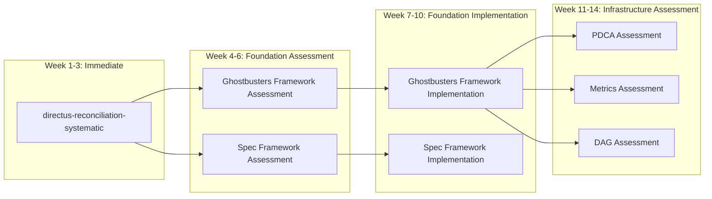

# Execution Priority Matrix - Systematic Spec Completion Strategy

## Current State Analysis

### **Specs with Complete Requirements, Design, and Tasks**
1. **directus-reconciliation-systematic** ✅✅✅ (Ready for execution)
2. **integration-orchestrator-framework** ✅✅✅ (Implemented)
3. **ai-driven-cursor-sharing** ✅✅✅ (Implemented)
4. **gpt5-context-calibration-system** ✅✅✅ (Implemented)

### **Specs with Partial Completion**
- **83 total specs** with varying levels of completion
- **Most specs**: Requirements only, missing design and tasks
- **Critical gap**: No systematic completion strategy

## Execution DAG Strategy

### **Priority Tier 1: Foundation Dependencies (Execute First)**

#### **Ghostbusters Framework** 
- **Status**: Requirements exist, design/tasks unknown
- **Dependencies**: None (Foundation)
- **Dependents**: 15+ specs
- **Priority**: CRITICAL - Single point of failure
- **Estimated Effort**: 3-4 weeks

#### **Spec Framework**
- **Status**: Requirements exist, design/tasks unknown  
- **Dependencies**: None (Foundation)
- **Dependents**: 8+ specs
- **Priority**: HIGH - Document management foundation
- **Estimated Effort**: 2-3 weeks

#### **RM-DDD Unified ReflectiveModule**
- **Status**: Implemented and working ✅
- **Dependencies**: None
- **Dependents**: All specs (implicit)
- **Priority**: COMPLETE

### **Priority Tier 2: Infrastructure Layer (Execute After Foundation)**

#### **Systematic PDCA Orchestrator**
- **Status**: Requirements exist, design/tasks unknown
- **Dependencies**: Ghostbusters Framework
- **Dependents**: Beast Mode Framework, Beast Mode Core
- **Priority**: HIGH - Systematic process foundation
- **Estimated Effort**: 2-3 weeks

#### **Systematic Metrics Engine**
- **Status**: Requirements exist, design/tasks unknown
- **Dependencies**: Ghostbusters Framework
- **Dependents**: 5+ monitoring specs
- **Priority**: HIGH - Metrics foundation
- **Estimated Effort**: 2-3 weeks

#### **Parallel DAG Orchestrator**
- **Status**: Requirements exist, design/tasks unknown
- **Dependencies**: Ghostbusters Framework
- **Dependents**: Beast Mode Core
- **Priority**: MEDIUM - Performance critical
- **Estimated Effort**: 2-3 weeks

### **Priority Tier 3: Application Layer (Execute After Infrastructure)**

#### **directus-reconciliation-systematic** ⭐ **READY NOW**
- **Status**: ✅✅✅ Complete and ready for execution
- **Dependencies**: RM-DDD (satisfied), Beast Mode patterns (available)
- **Dependents**: None (leaf node)
- **Priority**: EXECUTE IMMEDIATELY
- **Estimated Effort**: 2-3 weeks
- **Risk**: Low - complete requirements and proven approach

#### **Beast Mode Framework**
- **Status**: Requirements exist, design/tasks unknown
- **Dependencies**: Ghostbusters Framework, PDCA Orchestrator, Metrics Engine
- **Dependents**: Beast Mode Core, multiple applications
- **Priority**: HIGH - Main application framework
- **Estimated Effort**: 4-5 weeks

#### **Beast Mode Core**
- **Status**: Requirements exist, design/tasks unknown
- **Dependencies**: Beast Mode Framework, DAG Orchestrator
- **Dependents**: Multiple applications
- **Priority**: HIGH - Core implementation
- **Estimated Effort**: 3-4 weeks

## Execution Strategy Matrix

### **Immediate Action Plan (Next 4 weeks)**

#### **Week 1-3: Execute directus-reconciliation-systematic**
**Rationale**: Only spec with complete RDT (Requirements-Design-Tasks)

**Execution Plan**:
```
Week 1: Phase 1-2 (Schema & Data Population)
- Complete modular decomposition (<300 lines per file)
- Implement schema management with validation
- Implement data population with controlled 3-spec testing

Week 2: Phase 3-4 (UI Configuration & API Integration)  
- Implement Directus UI configuration
- Configure REST and GraphQL APIs
- Implement comprehensive error prevention

Week 3: Phase 5-6 (Beast Mode Integration & QA)
- Complete Beast Mode integration
- Implement health monitoring and metrics
- Complete test suite with >90% coverage
```

**Success Criteria**:
- ✅ Working CMS with 3-spec validation
- ✅ All components <300 lines
- ✅ >90% test coverage
- ✅ Beast Mode integration complete

#### **Week 4: Assess and Plan Next Spec**
**Action**: Systematic assessment of next highest-priority spec

**Assessment Criteria**:
1. **Dependency Satisfaction**: Are required dependencies available?
2. **Requirements Completeness**: Are requirements detailed enough?
3. **Design Feasibility**: Can we create systematic design?
4. **Implementation Clarity**: Can we define clear tasks?

### **Systematic Completion Methodology**

#### **For Each Spec in Priority Order**:

**Phase 1: Requirements Validation (1-2 days)**
- Read existing requirements
- Identify gaps and inconsistencies
- Apply EARS format and systematic validation
- Ensure <300 line file size requirements included
- Get user approval before proceeding

**Phase 2: Design Creation (2-3 days)**
- Create systematic design based on validated requirements
- Apply MVC architecture patterns
- Include modular decomposition strategy
- Define component interfaces and dependencies
- Include comprehensive error prevention strategy

**Phase 3: Task Definition (1-2 days)**
- Break design into implementable tasks
- Ensure each task <300 lines of implementation
- Define clear acceptance criteria
- Include testing and validation requirements
- Create systematic implementation sequence

**Phase 4: Execution (1-4 weeks depending on complexity)**
- Follow systematic PDCA methodology
- Implement with modular architecture
- Validate at each step
- Maintain >90% test coverage

### **Dependency-Aware Scheduling**

#### **Parallel Execution Opportunities**


#### **Risk-Based Prioritization**

**High Risk (Complete First)**:
- Foundation specs with many dependents
- Specs with complex integration requirements
- Specs with unclear or incomplete requirements

**Medium Risk (Complete Second)**:
- Infrastructure specs with moderate dependencies
- Specs with well-defined scope
- Specs with proven patterns

**Low Risk (Complete Last)**:
- Leaf node specs with no dependents
- Specs with simple, isolated functionality
- Specs with complete requirements

### **Success Metrics**

#### **Completion Velocity**
- **Target**: 1 complete spec per 2-4 weeks
- **Measurement**: Requirements → Design → Tasks → Implementation
- **Quality Gate**: >90% test coverage, <300 lines per file

#### **Dependency Health**
- **Target**: No blocked specs due to missing dependencies
- **Measurement**: Dependency satisfaction rate
- **Quality Gate**: Clear execution path for next 3 specs

#### **Technical Debt Reduction**
- **Target**: Eliminate overlapping and conflicting specs
- **Measurement**: Number of deprecated/consolidated specs
- **Quality Gate**: Single source of truth for each capability

## Immediate Recommendation

### **EXECUTE DIRECTUS-RECONCILIATION-SYSTEMATIC NOW**

**Confidence**: 95%

**Rationale**:
1. **Only spec with complete RDT** - Requirements, Design, Tasks all complete
2. **Proven modular approach** - File size mitigation validated
3. **Controlled scope** - 3-spec validation reduces risk
4. **Clear success criteria** - Measurable outcomes defined
5. **No blocking dependencies** - Can execute immediately

**Next Steps**:
1. Begin Phase 1 implementation immediately
2. While executing, assess Ghostbusters Framework requirements
3. Plan systematic completion of foundation specs
4. Update execution matrix based on learnings

This approach ensures systematic progress while maintaining quality and avoiding the technical debt that created the current fragmentation.